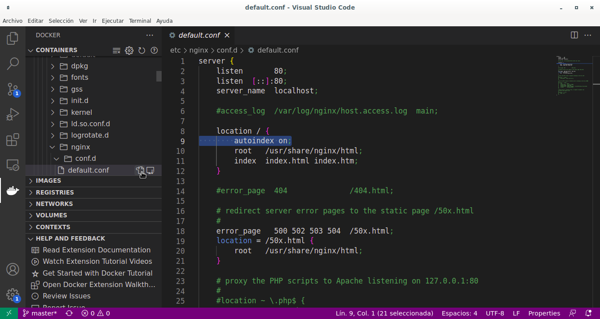

# Desplegar ISOs i OVAs en el aula
- [Desplegar ISOs i OVAs en el aula](#desplegar-isos-i-ovas-en-el-aula)
  - [Repositori d'imatges](#repositori-dimatges)
  - [Enviar un fitxer als alumnes per UDP](#enviar-un-fitxer-als-alumnes-per-udp)
    - [Resum](#resum)
  - [Muntar un servidor web en el nostre equip](#muntar-un-servidor-web-en-el-nostre-equip)
    - [Servidor web amb Python](#servidor-web-amb-python)
    - [Servidor web amb Docker](#servidor-web-amb-docker)
      - [Crear i configurar el servidor web](#crear-i-configurar-el-servidor-web)
      - [Utilitzar el servidor web](#utilitzar-el-servidor-web)

## Repositori d'imatges
En el Centre tenim un servidor (`descargasiso.cipfpbatoi.lan`) on qualsevol pot deixar ISOs i OVAs per a que tots els pugam utilitzar. La idea és que tots nosaltres deixem allí les ISOs que descarreguem per a que les puguem utilitzar tots.

Podem pujar o baixar fitxers mitjançant `scp` (des de la terminal) o des de l'explorador d'arxius amb el protocol `sftp` (entorn gràfic).

Per a fer-ho gràficament obrim l'_Explorador d'arxius_ i en la barra d'addresses posem 
```uri
sftp://diso@descargasiso.cipfpbatoi.lan/home/diso/REPOSITORI
```
(si no podem escriure en la barra perquè només ens ixen les icones polsem `Ctrl+L`).

L'usuari és **`diso`** i la contrasenya **`diso-2021`**

**IMPORTANT**: no volem que els alumnes es descarreguen els fitxers directament des d'allí per a no sobrecarregar la xarxa dels servidors de l'institut.

El que hem de fer per a pasar-li una ISO o OVA als alumnes es descarregar-la nosaltres des d'aquesta màquina al nostre ordinador del professor i que els alumnes accedeixen allí o, molt millor, li la passem per UDP _multicast_ que ens permetrà pasar-li-la a tots al mateix temps en pocs minuts.

## Enviar un fitxer als alumnes per UDP
Per a transferir arxius per UDP hem de tindre instal·lat el paquet `udpcast` (també hi ha [versió per a Windows](http://www.udpcast.linux.lu/exe.html))

Els alumnes han d'obri una terminal i escriure

```bash
udp-receiver -f firxer-a-rebre
```

La terminal es queda a l'espera de rebre les dades. Quan ho han fet tots, per a enviar-ho escrivim:

```bash
udp-sender -i nom-de-la-interficie-com-enp0s2 -f fitxer-a-enviar
```

### Resum
1. Descarreguen la ISO en l'equip del professor amb l'_Explorador d'arxius_ (`sftp://diso@descargaiso.cipfpbatoi.lan/home/diso/REPOSITORI`), per exemple _Win10.iso_
2. Cada alumne escriu en una terminal `udp-receiver -f Win10.iso`
3. Obrim una terminal i ho enviem amb `udp-sender -i enp0s2 -f Win10.iso`

NOTA: el nom que posen els alumnes és el nom amb el que es guarda el fitxer i no ha de ser el mateix amb que s'envia.

## Muntar un servidor web en el nostre equip
Tenim diferents maneres de fer-ho. Anem a vore com llançar un servidor web amb _python_ i com fer-ho amb _docker_.

### Servidor web amb Python
Si només volem compartir fitxers de forma puntual i no volem complicar-nos la vida podem utilitzar el servidor web que porta _python_ per defecte.

Per a fer-ho anem al directori on estan els fitxers que volem compartir (per exemple en `/home/batoi/recursos`).
A continuació obrim una terminal i llancem el servidor web amb:

```bash
python3 -m http.server
```

Això crea un servidor web al port 8000 (per defecte) i el directori arrel és el directori on estem situats. 
Ara els alumnes poden accedir des del seu navegador a la nostra IP (per exemple `http://172.16.225.10:8000`).
Quan no el necessitem més tanquem la terminal o fem `Ctrl+C`.

Si volem que el servidor web estiga en un altre port (per exemple el 80) fem:

```bash
sudo python3 -m http.server 80
```

### Servidor web amb Docker
Com que en la imatge del SSD tenim _docker_ instal·lat és molt senzill tindre un servidor web _dockeritzat_ per a poder deixar en ell les imatges i que els alumnes se les descarreguen des del seu navegador.

#### Crear i configurar el servidor web
El primer que farem és crear un directori en el nostre ordinador que serà el directori arrel del servidor web (per exemple en `/home/batoi/recursos`).

A continuació crearem el nostre servidor amb:
```bash
docker run --name _nom-del-servidor-dockeritzat_ -v _directori-creat-abans_:/usr/share/nginx/html:Z -p 80:80 -d nginx
```

Per exemple, al meu servidor li diré _recursos_ i el directori arrel serà el que he fet abans. EL comando serà:
```bash
docker run --name recursos -v /home/batoi/recursos:/usr/share/nginx/html -p 80:80 -d nginx
```

El servei _ngix_ no permet per defecte listar el contingut d'un directori. Per a activar eixa opció hem d'entrar al servidor i modificar el fitxer `/etc/nginx/conf.d/default.conf` per a afegir-li l'opció **`autoindex on`**. 

La manera més sencilla és des de _Visual Studio Code_. Hem de tindre instal·lada l'extensió per a Docker (ens la sugereix si l'obrim amb una màquina arrencada). 

Obrim _VSC_ i en la barra de l'esquerra seleccionem **_Docker_** (és l'última icona, la balena). Al costat, despleguem `CONTAINERS -> Individual Containes -> nginx -> Files -> etc -> nginx -> conf.d` i sobre el fitxer `default.conf` polsem la icona d'**Obrir**. Dins de l'apartat `location /` que està per la part superior del fitxer, afegim la línia indicada abans de forma que quedarà com:
```bash
    location / {
        autoindex on;
        root   /usr/share/nginx/html;
        index  index.html index.htm;
    }
```



Guardem el fitxer i tanquem _VSC_. Aturem el servidor (`docker stop recursos`)i ja el tenim preparat per a utilitzar-lo quan el necessitem.

#### Utilitzar el servidor web
Quan volem que els alumnes es descarreguen del nostre ordinador una ISO o qualsevol altre fitxer el que hem de fer és:
1. El copiem dins de la carpeta que hem creat per al servidor web (en el meu cas `/home/batoi/recursos`)
2. Arranquem el servidor web: `docker start recursos`

Els alumnos poden accedir des del seu navegador a la nostra IP (per exemple `http://172.16.225.10`).

Quan no el necessitem més l'aturem amb `docker stop recursos`.