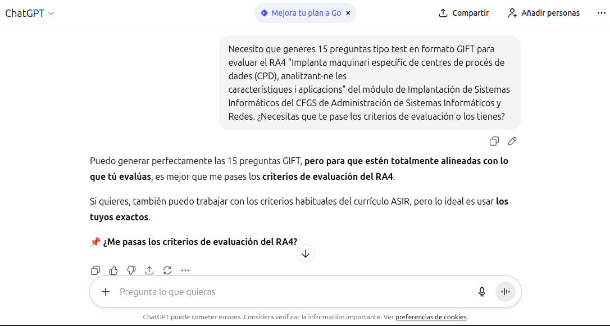
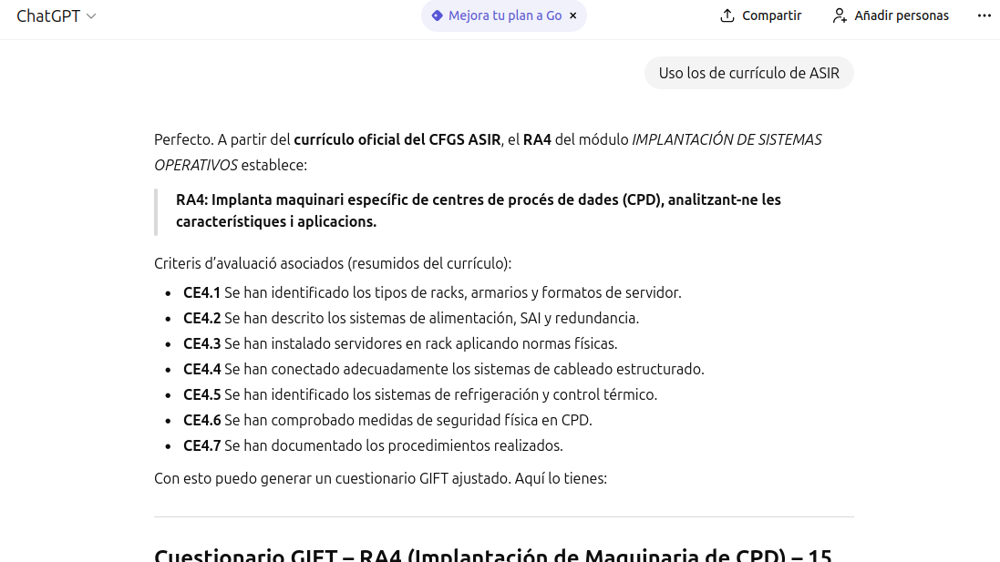
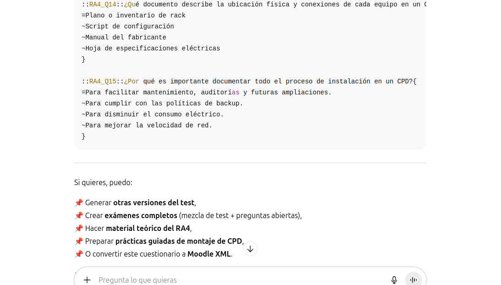
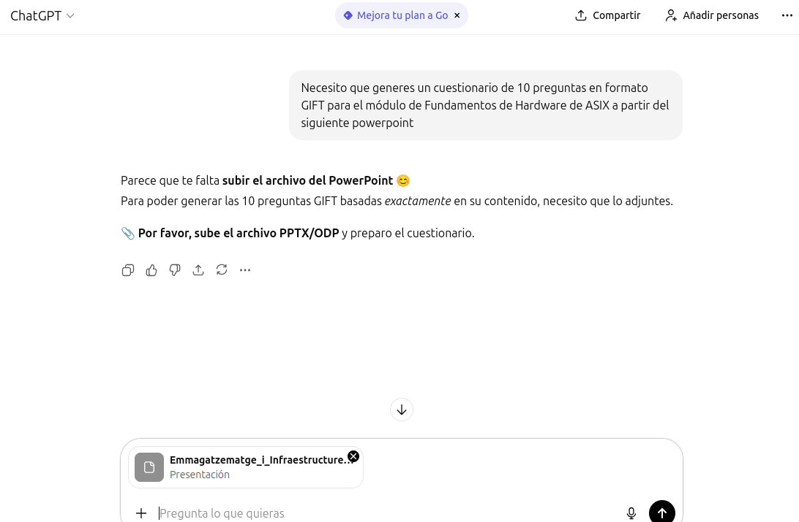
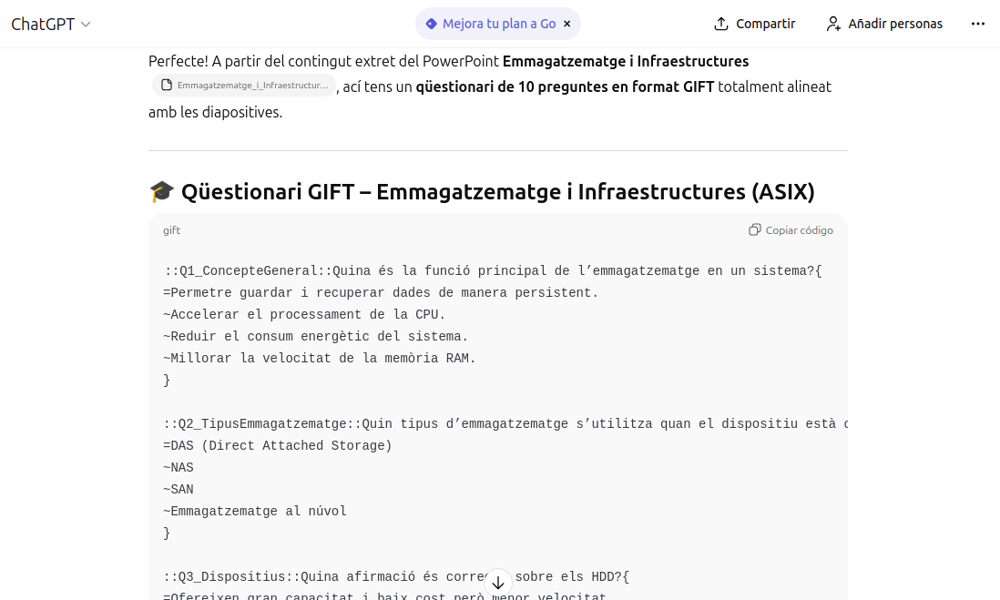
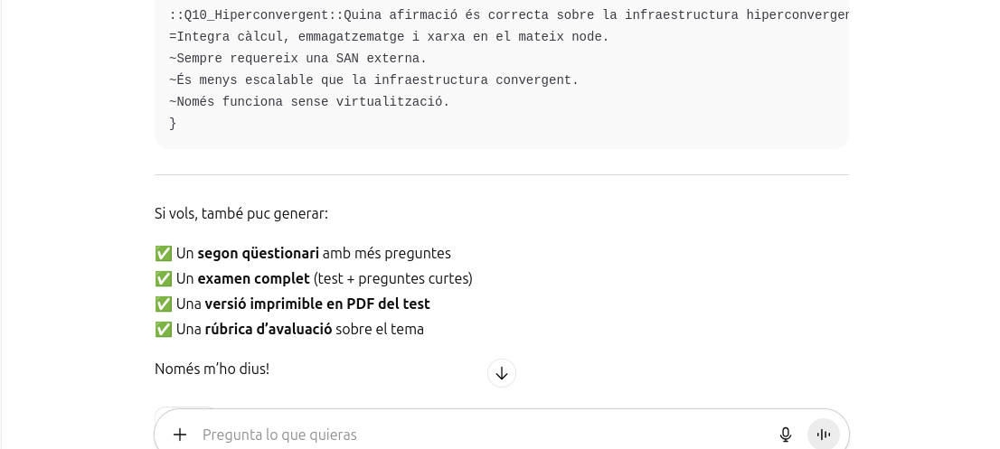

# Generar automàticamente con IA preguntas para cuestionarios de Aules

- [Generar automàticamente con IA preguntas para cuestionarios de Aules](#generar-automàticamente-con-ia-preguntas-para-cuestionarios-de-aules)
  - [Introducción](#introducción)
  - [Formato GIFT](#formato-gift)
  - [Generación automática de preguntas con IA](#generación-automática-de-preguntas-con-ia)
    - [Generar las preguntas a partir de un _RA_](#generar-las-preguntas-a-partir-de-un-ra)
    - [Generar las preguntas a partir de un fichero de apuntes](#generar-las-preguntas-a-partir-de-un-fichero-de-apuntes)
  - [Importar las preguntas en Aules](#importar-las-preguntas-en-aules)


## Introducción
Aules (que es una versión de _Moodle_) permite importar preguntas en diferentes formatos, lo que facilita la creación de cuestionarios. En este documento se explica cómo utilizar herramientas de inteligencia artificial para generar automáticamente preguntas en  formato GIFT.

## Formato GIFT
El formato GIFT es un formato de texto plano que permite definir preguntas de diferentes tipos, como opción múltiple, verdadero/falso, respuesta corta, entre otros. A continuación se muestra un ejemplo de una pregunta de opción múltiple en formato GIFT:

```
::Pregunta 1:: ¿Cuál es la capital de Francia? {
=París
~Londres
~Berlín
~Madrid
}
```

Si no especificamos el valor de cada respuesta, Aules asigna automáticamente un valor de 100% a cada pregunta con el símbolo `=` y un valor de -33.33% a cada opción incorrecta (en caso de haber 4 opciones). La suma de los valores de las respuestas incorrectas debe ser igual a -100%.

También se puede especificar el valor de las respuestas correctas y las incorrectas, así como incluir retroalimentación para cada opción:

```
::Pregunta 2:: ¿Cuál es la capital de Italia? {
=%100%Roma #Correcto! Roma es la capital de Italia.
~%-33.33%Milán #Incorrecto. Milán no es la capital.
~%-33.33%París #Incorrecto. París es la capital de Francia.
~%-33.33%Ginebra #Incorrecto. Ginebra es una ciudad Suiza.
}
```

## Generación automática de preguntas con IA
Para generar preguntas automáticamente, podemos utilizar herramientas de inteligencia artificial como ChatGPT. Como base teórica podemos proporcionarle texto o nuestro fichero de apuntes o bien indicarle un _RA_ o criterios de evaluación de nuestro módulo.

### Generar las preguntas a partir de un _RA_
A continuación se muestra un ejemplo de cómo generar preguntas para un _RA_ del currículo:



Me pide que la de los criterios de evaluación específicos que estoy usando pero le puedo decir que los coja del currículo:



Y el resultado es el siguiente:




El botón de **_Copiar código_** de la parte superior derecha me permite copiar el resultado al portapapeles para luego pegarlo en un fichero de texto plano. También puedo pedirle que me genere el fichero directamente y lo descargo.

### Generar las preguntas a partir de un fichero de apuntes
Otra opción es proporcionarle un fichero de apuntes o un texto largo y pedirle que me genere preguntas a partir de ese texto:



El resultado es similar al anterior, con preguntas en formato GIFT que puedo copiar y pegar en un fichero de texto plano:




## Importar las preguntas en Aules
Una vez que tenemos el fichero de preguntas en formato GIFT, podemos importarlo en Aules siguiendo estos pasos:
1. Acceder al curso en Aules donde queremos importar las preguntas.
2. Ir a la sección de "Banco de preguntas".
3. Seleccionar la opción "Importar".
4. Elegir el formato "GIFT".
5. Subir el fichero de texto plano que contiene las preguntas generadas.
6. Confirmar la importación y revisar las preguntas importadas.
7. Crear un cuestionario utilizando las preguntas importadas.

Con estos pasos, podemos generar automáticamente preguntas para cuestionarios en Aules utilizando herramientas de inteligencia artificial y el formato GIFT.

Puedes ver un [vídeo explicativo](https://gvaedu-my.sharepoint.com/:v:/g/personal/ja_seguravasco_edu_gva_es/Ef3eVcN_GZdFq0oyyFWeJv4B8b5gFycSMqIgMGiDE0WOhg?nav=eyJyZWZlcnJhbEluZm8iOnsicmVmZXJyYWxBcHAiOiJTdHJlYW1XZWJBcHAiLCJyZWZlcnJhbFZpZXciOiJTaGFyZURpYWxvZy1MaW5rIiwicmVmZXJyYWxBcHBQbGF0Zm9ybSI6IldlYiIsInJlZmVycmFsTW9kZSI6InZpZXcifX0%3D&e=siIbDW) de este proceso.