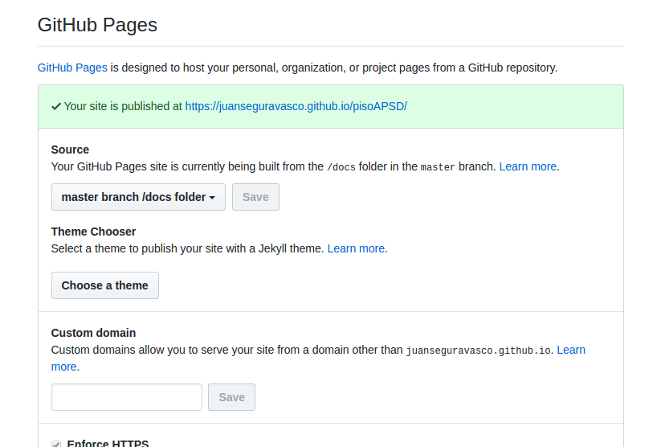

# Publicar en gh-pages
GitHub Pages es un servicio de alojamiento web estático de GitHub que permite publicar documentación. Al ser contenido estático podemos usar HTML, CSS y Javascript y podemos usarlo para publicar apuntes, portfolio, información sobre los repositorios, etc. 

Para publicar documentación podemos usar una _Wiki GitHub_ asociada a nuestro repositorio o usar las _GitHub Pages_. Las _gh-pages_ son directamente accesibles en el domin io github.io. Y podemos poner las páginas en formato MD y GitHun las sirve automáticamente como HTML.

Podemos publicar 2 tipos de documentación:
1. documentación sobre un repositorio concreto
2. documentación no asociada a ningún repositorio

Podemos encontrar información de cómo realizar La configuración de las _gh_pages_ en [GitHub Pages](https://pages.github.com/). 

## Publicar documentación sobre un repositorio
Nos puede servir, por ejemplo, para poner manuales o la documentación sobre el proyecto de ese respositorio. Por ejemplo en el repositorio **intranetBatoi** de la organización **cipfpbatoi** tenemos el [código de la intranet](https://github.com/cipfpbatoi/intranetBatoi) del centro. Y dentro de la carpeta /docs está su documentación con los manuales de uso, las instrucciones para instalar el programa, etc, que es accesible directamente desde la URL [https://cipfpbatoi.github.io/intranetBatoi/](https://cipfpbatoi.github.io/intranetBatoi/) y aunque está escrita en Markdown que és más sencillo GitHub la muestra como páginas HTML.

En cada repositorio tenemos 3 opciones para guardar las páginas:
* en la rama master directamente
* en una rama llamada gh-pages
* en un directorio llamado /docs dentro de la rama master (es la opción que hemos elegido en _intranetBatoi_)

La página principal que se abrirá automáticamente se debe llamar README.md, index.md o index.html.

Una vez creadas las paginas hay que activar las GitHub Pages para ese repositorio yendo a **Settings** y escogiendo una de las 3 opciones anteriores.

También podemos aplicar a nuestra documentación un tema de Jekyll.

La documentación estará accesible en la URL \<usuario>.github.io/\<repositorio>, donde \<usuario> se cambia por nuestro nombre de usuario de GitHub y \<repositorio> por el nombre de nuestro repositorio.

## Publicar documentación no ligada a ningún repositorio
Sirve para publicar información sobre el usuario de GitHub (nuestro CV, nuestro Portfolio o cualquier otra cosa) o sobre la organización. Por ejemplo hemos activado las GH Pages de la organización **cipfpbatoi** para publicar cursos, apuntes, talleres y todo tipo de información sobre nosotros. 

En este caso lo que tenemos que hacer es crear en GitHub un nuevo repositorio que se debe llamar obligatoriamente \<usuario>.github.io. Allí podemos la documentación que ya aparecerá automáticamente publicada en dicha URL.

Sólo podemos tener un repositorio personal con \<usuario>.github.io pero podemos tener uno más por cada organización que tengamos en la url \<organizacion>.github.io. El de la organización **cipfpbatoi** lo tenemos en [https://cipfpbatoi.github.io/](https://cipfpbatoi.github.io/).

## Usar plantillas
Podemos usar los temas de Jekyll que incluye GH Pages para aplicar a nuestras páginas configurándolo en el repositorio ('Settings'). Sólo hay que escoger la plantilla que queremos usar y se aplica inmediatamente.

También podemos instalarnos Jekyll en local y crear nuestras propias plantillas que subiremos psoteriormente a _gh-pages_ (o al servidor web que queramos) como se ve en la [siguiente página](./jekyll.md) de los apuntes.

## Leer más
* [What is GitHub Pages?](https://help.github.com/categories/github-pages-basics/)
* [JONATHAN MCGLONE: Creating and Hosting a Personal Site on GitHub](http://jmcglone.com/guides/github-pages/)
