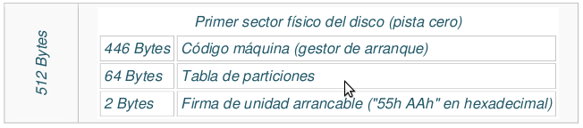
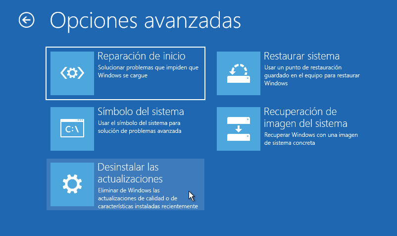
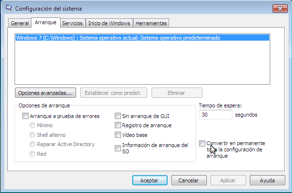
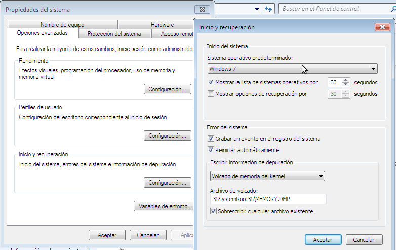
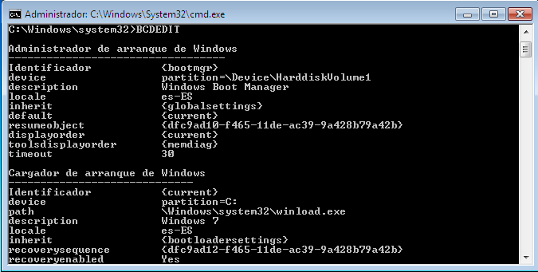
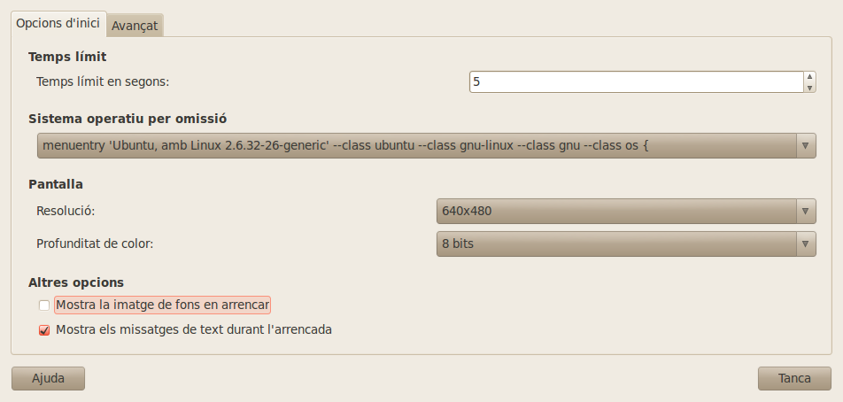
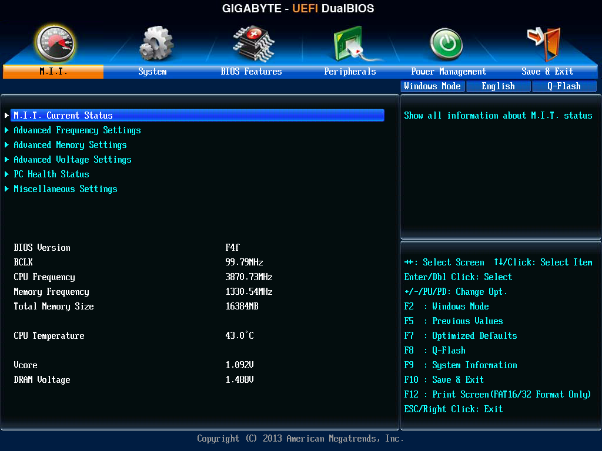
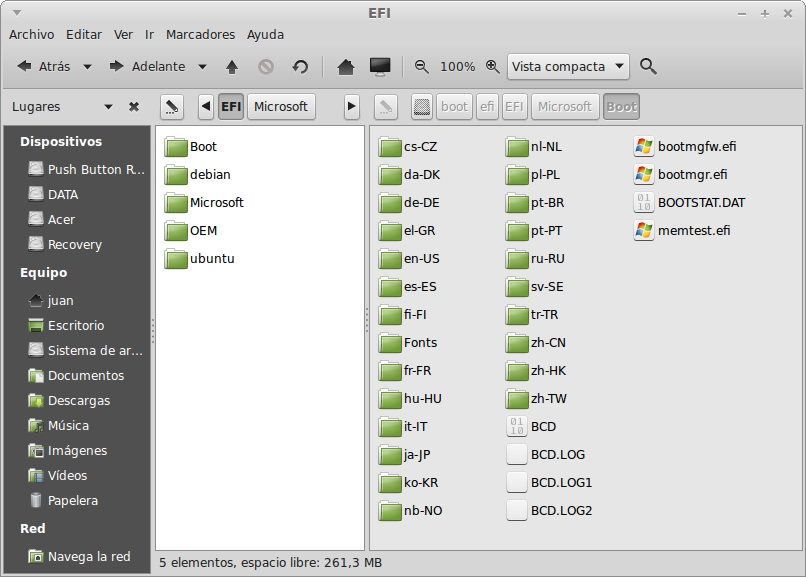
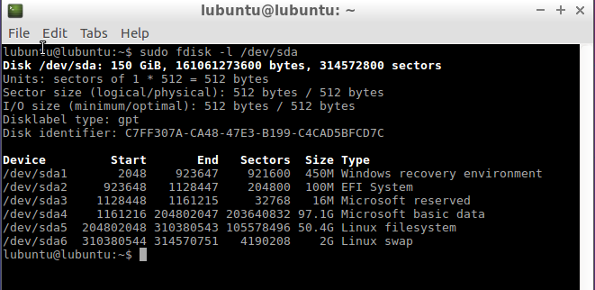

# Arrencada del sistema
- [Arrencada del sistema](#arrencada-del-sistema)
  - [Introducció](#introducció)
  - [Arrencada del sistema amb BIOS](#arrencada-del-sistema-amb-bios)
    - [BIOS](#bios)
    - [MBR](#mbr)
    - [Procés d'arrencada](#procés-darrencada)
    - [Arrencada de Windows](#arrencada-de-windows)
      - [Reparar l'arrencada del sistema](#reparar-larrencada-del-sistema)
      - [Canviar les opcions d'arrencada en Windows](#canviar-les-opcions-darrencada-en-windows)
    - [Arrencada de GNU/Linux amb Grub i BIOS](#arrencada-de-gnulinux-amb-grub-i-bios)
      - [Canviar les opcions de configuració de Grub](#canviar-les-opcions-de-configuració-de-grub)
      - [Reparar l'arrencada del sistema](#reparar-larrencada-del-sistema-1)
        - [Utilitzant un LiveCD de GNU/Linux](#utilitzant-un-livecd-de-gnulinux)
        - [Amb SuperGrubDisc2](#amb-supergrubdisc2)
  - [Arrencada del sistema amb UEFI](#arrencada-del-sistema-amb-uefi)
    - [EFI](#efi)
    - [Arrencada amb UEFI](#arrencada-amb-uefi)
      - [Secure Boot](#secure-boot)
    - [Reparar l'arrencada](#reparar-larrencada)
      - [I si Linux no arranca?](#i-si-linux-no-arranca)

## Introducció
Ja sabem que:
- per a poder utilitzar un ordinador ha de tindre un sistema operatiu
- la CPU només pot executar programes que estiguen en memòria
- la memòria RAM és volàtil, és a dir, sense electricitat (al apagar l'ordinador) s'esborra el seu contingut

Per tant per a que l'equip funcione necesita tindre el sistema operatiu carregat en la RAM. Quan volem utilitzar un programa el sistema operatiu s'encarrega de buscar-lo en el disc i carregar-lo en la RAM per a que es puga executar, però ¿qui carrega el sistema operatiu en la RAM al arrancar l'equip?

La solució és incloure en la placa base un xip amb memòria no volàtil (un xip EPROM, memòria _flash_, ...) amb un programa que inicia els passos per a carregar el sistema operatiu en la RAM. Les plaques base per a PC tenen dos tipus de xip amb el firmware per a carregar el sistema:
* **BIOS**: és el mètode que s'ha utilitzat des dels primers PCs. Permet carregar el sistema des de un disc formatjat amb taula de particions **MsDOS** (també anomenada **MBR**)
* **UEFI**: és el nou mètode que s'inclou en tots els equips moderns. Pot funcionar com una BIOS (mode _Legacy BIOS_) o bé carregar el sistema operatiu des d'un disc amb taula de particions **GPT** (sistema de particionat més modern)

Tant en un cas com en l'altre el programa inclòs en el _firmware_ (BIOS o UEFI) haurà de carregar en la RAM un programa anomenat **_bootloader_** (carregador d'arrencada) que és qui s'encarregarà de buscar el sistema operatiu en el disc i carregar-lo en memòria.

El procés de carregar el S.O. tindrà vàries fases:
1. El firmware (i altres xicotets programes en el cas de la BIOS) carreguen en la RAM el _bootloader_
2. Aquest programa carrega en la RAM el _kernel_ del sistema operatiu (S.O.) i tot el que necessita per a funcionar
3. Comença a executar-se el S.O. carregat en la RAM i l'ordinador ja està preparat per a funcionar normalment i rebre ordres de l'usuari, normalment tras realitzar el procés de _login_

Aquest procés tarda alrededor d'un minut en els sistemes operatius moderns, encara que en els servidors pot tardar varis minuts.

Ara anem a vore en detall el procés d'[arrencada del sistema amb BIOS](#arrencada-de-gnulinux-amb-grub-i-bios) (o amb UEFI funcionant en mode _Legacy BIOS_) i el procés d'[arrencada del sistema amb UEFI](#arrencada-del-sistema-amb-uefi).

## Arrencada del sistema amb BIOS

### BIOS
La **BIOS** és un xip de memòria no volàtil que es troba a la placa base i que conté configuracions bàsiques de l'ordinador (com la data i hora o la seqüència d'arrencada) i un xicotet programa per a carregar el sistema operatiu.


Encara que la inmensa majoria d'equips ja no tenen BIOS sino la nova **UEFI** aquesta es pot configurar en mode **Legacy BIOS** per a que funcione com una BIOS.

L'arrencada amb BIOS només pot fer-se des d'un dispositiu formatjat amb **taula de particions _MBR_** (també anomenada _**Ms-DOS**_).

### MBR
El _Master Boot Record_ (**MBR**) és el primer sector d'un dispositiu d'emmagatzematge de dades, com un disc dur o un pen-drive. Conté:
- _MBC (Master Boot Code)_: programa per a començar el procés de càrrega del _bootloader_ (446 bytes)
- _Taula de particions_: amb espai per a 4 particions (les màximes que permet el particionat _Ms-DOS_) amb informació de cada partició, com si és la partició activa, el seu sistema d'arxius, on comença i on acaba, la seua mida, etc. (16 bytes per partició)



### Procés d'arrencada
A l'arrencar un ordinador amb BIOS la CPU executa el programa carregat en ella, anomenat **POST** (_PowerOn Self Test_) que:
* Comprova i inicialitza el hardware de l'equip
* Llig la seqüència d'arrencada (guardada en la BIOS) per a saber quin és el primer dispositiu d'arrencada (Disc dur, CD, USB, xarxa, ...), és a dir, on buscar el sistema operatiu
* Carrega en la RAM el primer sector d'eixe dispositiu (anomenat _Master Boot Record_, **MBR**)
* El programa MBC que hi ha en el MBR llig la taula de particions, identifica la partició activa i carrega en la RAM el **sector d'arrencada de la partició activa** (el primer sector d'eixa partició)
* Aquest sector conté un programa que busca i carrega en la RAM el **_bootloader_** (carregador del sistema operatiu)
* Aquest carregador ja no està limitat a 512 bytes i és qui carrega en la RAM el sistema operatiu i prepara tot el que necessita
* Ara ja s'executa el S.O.

El procés te tants passos perquè tant el programa de la BIOS com el del MBR i el del sector d'arrencada de la partició activa són molt xicotets (recorda que la mida de un sector són 512 bytes) i per tant no poden carregar el S.O. directament.

Alguns sistemes canvien el programa del MBR per a que carregue directament el _bootloader_ des de la partició en que es trobe (com **Grub**).

### Arrencada de Windows
La manera en que arranca l'ordinador és pràcticament igual des de Windows 7. El procés d'arrencada és el següent:
* Com hem vist el primer lugar s'executa el **POST** i tras comprovar el hardware carrega el **MBR** en la RAM
* El programa del MBR llig la taula de particions i carrega el **sector d'arrencada de la partició activa** (que serà la partició que conté els fitxers d'arrencada de Windows)
* El programa que hi ha al sector d'arrencada de la partició activa carrega en la RAM el fitxer **BootMGR** (que està en la seua partició i és el _bootloader_ de Windows)
* _Bootmgr_ llig el fitxer **BCD.log** (que està dins de la carpeta `\Boot` en la mateixa partició que BootMGR) i, si hi ha més d'una opció, mostra a l'usuari el menú d'arrencada amb les opcions guardades en BCD
* A continuació carrega el programa **Winload.exe** (que està en `\Windows\system32`) pasant-li les opcions triades
* Winload carrega **ntoskrnl.exe** (està en `\Windows\system32`) que és el _kernel_ de Windows. Aquest programa s'encarrega de la resta del procès de càrrega. Si voleu saber en detall què fa, és el següent:
  * Ntoskrnl executa **Hal.dll** (_Hardware Abstraction Layer_, es troba en `\Windows\system32`) que es qui gestiona tot el hardware
  * A continuació mira en el registre de Windows el contingut de la clau de HKEY_LOCAL_MACHINE\SYSTEM\CurrentControlSet\Services per a veure els dispositius a carregar:
    * Inicialitza els dispositius amb un valor de START de 0
    * Inicialitza els dispositius amb un valor de START de 1
    * Inicialitza, utilitzant Session Manager (arxiu SMSS.EXE) els dispositius amb un valor de START de 2
  * Executa **Winlogo.exe** que executa **Lsass.exe** (Autoritat de seguretat local) que mostra la pantalla d'inici demanant usuari i contrasenya
  * Si son correctes executa **Userinit.exe** que carrega l'Escriptori de l'usuari

| NOTA: En molts sistemes amb Winwows 8 quan apaguen l'equip en compte de tancar les sessions dels usuaris, aturar els serveis i apagar la màquina el que es fa és només tancar les sessions dels usuaris i hibernar la màquina (es guarda el contingut de la memòria en un fitxer anomenat _hiberfil.sys_). Això té l'avantatge que el sistema s'inicia molt ràpidament perquè no han de carregar-se els drivers i iniciar el sistema operatiu i els serveis.

| Per a que l'ordinador s'ature completament i poder així entrar en la BIOS hem d'apagar-lo en Windows amb la tecla _majúscules_ polsada. Si volem desactivar per a sempre la hibernació hem d'obrir una terminal d'Administrador (busquem _cmd_ i en el menú contextual triem '_Executar com administrador_') i executar el comando:
```bash
powercfg -h como
```

| També podem fer-ho des de l'entorn gràfic amb Panel de control -> Sistema y seguridad -> Opciones de energía -> Cambiar lo que hacen los botones de encendido.

#### Reparar l'arrencada del sistema
Si es danya el MBR o algun fitxer d'arranque l'equip no podrà arrancar correctament. El que hem de fer és introduir el CD d'instal·lació de Windows i arrancar l'equip. Una vegada iniciem amb el CD, cal triar l'opció de "**Reparar l'equip**" en compte de continuar amb l'opció d'instal·lació del sistema.

Una vegada triem aquesta opció, ens pot aparèixer una finestra on triarem **Solucionar problemes**. A continuació ens apareixerà una finestra en les diferents possibilitats de recuperació:




- **Reparació d'inici**: resol automàticament els problemes en l'arrencada del sistema
- **Restaurar sistema**: torna el sistema a un punt de restauració anterior en el que funcionaba correctament. Els punts de restauració són com instantànies en que es guarda l'estat del sistema de manera que es pot tornar posteriorment a eixe estat. Alguns es fan automàticament quan fem alguna acció perillosa i a més podem crear una quan vulguem
- **Recuperació de la imatge del sistema**: si hem fet una imatge quan el sistema funcionaba podem restaurar-la amb aquesta opció
- **Desinstal·lar actualitzacions**: de vegades és una actualització la que fa que el sistema no funcione. Des d'ací podem desinstal·lar les últimes
- **Símbol del sistema**: si no funciona la reparació d'inici des d'ací obrim una terminal des de la que podem intentar la reparació manualment. En ella podem utilitzar alguns comandos com:
  - **`Bootrec`**. Ens permet reparar l'MBR, el sector d'arrencada de la partició o el fitxer Bcd.log:
    * per a recuperar l'MBR: `bootrec /fixmbr`
    * per a recuperar el sector d'arrencada: `bootrec /fixboot`
    * per a recuperar un fitxer Bcd.log bàsic si s'haguera borrat o estropejat l'actual: `bootrec /rebuildbcd`
  - **`Bootsect`**.Actualitza el MBC de les particions de disc dur. Podem utilitzar també aquesta eina per a restaurar el sector d'arrencada de l'ordinador. Per exemple per a recuperar el sector d'arrancada de la partició del sistema amb Windows 7 i també recuperar el MBC del MBR la sintaxi seria:
```bash
    bootsect.exe /nt60 SYS /mbr /force
```
 
En internet podeu trobar infinitat de pàgines i vídeos de com fer les reparacions més comuns.

#### Canviar les opcions d'arrencada en Windows
NOTA: ací anem a veure com podem modificar l'arrencada de Windows des del mateix sistema però hi ha multitud de programes que ens permeten fer tot això de manera més senzilla, com _EasyBCD_.

Una forma senzilla de modificar algunes opcions del BCD és amb el comando `msconfig`. Podem canviar el temps d'espera, el sistema operatiu per defecte o les opcions de càrrega:



Altra manera de canviar les opcions és des de `Panell de Control -> Sistema i Seguretat -> Sistema -> Configuració Avançada del sistema -> Opcions Avançades -> Inici i Recuperació -> Configuració`. Des d'ací només permet canviar el temps i el sistema operatiu per defecte:



L'opció més potent però més difícil de canviar les opcions és executar des de la **terminal d'Administrador** l'eina `bcdedit`. A continuació hi ha un exemple de l'execució d'aquesta ordre sense cap paràmetre o opció.



L'eina `BCDEDIT` permet configurar qualsevol opció d'arrencada en el menú BCD així com afegir noves entrades al menú. Podem obtindre ajuda del mateix amb:
* `bcdedit /?`: mostra informació general del comando
* `bcdedit /? topics`: mostra una llista de accions que permet el comando bcdedit
* `bcdedit /? copy`: mostra informació sobre la acció copy que copia una entrada del menú amb un altre nom


### Arrencada de GNU/Linux amb Grub i BIOS
Tenim molts carregadors per als sistemes Linux però el més utilitzat és **Grub**.

En realitat _Grub_ no és un gestor d'arrencada només de GNU/Linux sinó que pot carregar qualsevol sistema operatiu (és un gestor d'arrencada múltiple). Una de les característiques més interessants d'aquest gestor és que podem canviar tots els paràmetres en l'arrencada mitjançant el sistema d'ordres de consola de _Grub_.

El procés d'inici d'un equip amb _Grub_ és:
* Després de que el **POST** comprove el hardware es carrega en la RAM el **MBR** del primer dispositiu d'arrencada. El programa del MBR ha estat modificat per Grub i conté la seua primera fase d'arrencada
* El programa del MBR (la fase 1 de Grub) busca en el disc i carrega la fase 2 de **Grub** (no cal que estiga en la partició activa com passa amb els sistemes Windows)
* La fase 2 de Grub llig el fitxer **grub.cfg** (que conté les opcions de càrrega) i presenta a l'usuari el **menú d'arrencada** de Grub.
* Grub carrega el kernel seleccionat per l'usuari i la resta del sistema operatiu.

#### Canviar les opcions de configuració de Grub
La manera més ràpida de canviar les opcions de configuració és editar el fitxer **`/etc/default/grub`**. Algunes de les opcions que conté són:
* `GRUB_DEFAULT`: opció del menú que es triarà per defecte. Posem el número d'opció que volem (començant per 0) o _`saved`_ (la última triada)
* `GRUB_TIMEOUT`: temps d'espera del menú
* `GRUB_CMDLINE_LINUX_DEFAULT="quiet splash"`: afegeix opcions a la línia kernel (en aquest cas per a que mostre la imatge amb el progrés de la càrrega i no el detall del que es fa)
* `GRUB_TERMINAL=console`: si es descomenta no carrega la interfície gràfica
* `GRUB_DISABLE_LINUX_RECOVERY`: si es descomenta no apareix l'opció de recuperació en el menú

Per a que els canvis fets tinguen efecte, després de fer qualsevol modificació d'aquest fitxer hem de tornar a generar el fitxer grub.cfg mitjançant l'execució de:
```bash
    upgrade-grub
```

També podem instal·lar qualsevol programa gràfic per a editar les opcions d'inici com **StartUp Manager**, **Grub Customizer**, etc:



#### Reparar l'arrencada del sistema
Hi pot haver ocasions en què un usuari necessita tornar a instal·lar _Grub_. Això passa sovint quan el MBR del dispositiu d'arrencada s'altera i _Grub_ s'elimina del MBR, per exemple si Windows s'instal·la (o es re-instal·la) després d'instal·lar GNU/Linux en eixe ordinador.

Podem fer-ho de diferents maneres (podeu trobar més informació en [https://help.ubuntu.com/community/Grub2/Installing#Reinstalling_GRUB_2](https://help.ubuntu.com/community/Grub2/Installing#Reinstalling_GRUB_2):

##### Utilitzant un LiveCD de GNU/Linux
Els passos a seguir són:
1. Arrencar amb el LiveCD.
1. Obrir una terminal.
1. Si no sabem en quina partició tenim instal·lat el sistema operatiu ho determinarem amb el comando `fdisk -l`.

4. Muntar la partició que conté la instal·lació d'Ubuntu (en el cas de l'exemple **sda3** que és la partició Linux).
```bash
  sudo mount /dev/sda3 /mnt
```
5. Si hem fet algun canvi en els sistemes que teníem instal·lats (com instal·lar un nou Windows) hem d-actualitzar el menú de Grub amb:
```bash
  sudo update-grub
```
1. Executar l'ordre `grub-install` com es descriu a continuació. Açò reinstal·larà els fitxers de Grub en la partició muntada i corregirà el MBR:
```bash
  sudo grub-install --root-directory=/mnt/ /dev/sda
```

Ara ja podem reiniciar l'equip.

En el pas 6 compte de instal·lar grub des d'un directori podem _rootear_ eixe directori de manera que treballem sobre el nostre sistema en el disc i no sobre el sistema del LiveCD. En eixe cas després de muntar la partició (pas 4) hem de muntar (amb l'opció `--bind`) altres 3 directoris:
```bash
  sudo mount --bind /sys /mnt/sys
  sudo mount --bind /proc /mnt/proc
  sudo mount --bind /dev /mnt/dev
```

Una vegada fet executem `chroot` sobre el punt de muntatge:
```bash
  sudo chroot /mnt
```

I ara ja podem reparar grub (abans l'actualitzarem si cal amb `update-grub`):
```bash
  sudo grub-install --recheck /dev/sda
```

I per últim reiniciem l'equip.

NOTA: recorda canviar els noms de discs i particions (_sda_, _sda3_, ...) pels adequats en el teu sistema.

##### Amb SuperGrubDisc2
Es tracta de un LiveCD que permet arrencar un equip des de la qualsevol partició del disc. El que fa és mirar en el disc de l'equip els sistemes operatius instal·lats i mostra un menú on triem el que volem arrancar. Una vegada dins, com ja estem en el nostre linux només cal fer:
1. Actualitzar el menú _Grub_ amb `sudo update-grub` si hem fet algun canvi en el disc (per exemple si hem instal·lat un nou Windows)
2. Executar l'ordre `grub-install`. Açò reinstal·larà els fitxers de _Grub_ de la partició actual en la seua correcta ubicació i també corregirà el MBR.
```bash
  sudo grub-install /dev/sda
```
3. Reiniciar l'equip.

A més de _SuperGrub_ hi ha altres utilitats per fer això com **Boot Repair**, **Rescatux**, etc.

## Arrencada del sistema amb UEFI

### EFI
La **EFI** (_Extensible Firmware Interface_), és una especificació desenvolupada per Intel per a reemplaçar la antiga BIOS que tenia moltes limitacions. Algunes de les seues avantatges són:
* Dona suport complet als discos **GPT** que superen les limitacions dels **MBR** (la mida màxima d'una partició és de 8 ZB front als 2 TB de MBR, i permeten fins 128 particions primàries en compte de 4).
* A més funciona en mode 64 bits a diferència de la BIOS que s'executa en mode 16 bits (heretat dels primers PC)
* L'entorn és molt més amigable (entorn gràfic amb ratolí front a la interfície de text de BIOS)
* El temps d'arrencada del sistema operatiu és més curt perquè UEFI pot carregar directament el _bootloader_ sense "intermediaris".
* Només carrega sistemes operatius de 64 bits.
* La interfície UEFI te un modo compatible amb la BIOS (**Legacy BIOS**) que li permet funcionar con una BIOS per a carregar sistemes operatius de 32 bits o que estiguen en discos MBR. 

NOTA: Per a saber quin tipus d'instal·lació de Windows tenim executem (menu contextual del botó Inici -> Executar) `msinfo32`.



### Arrencada amb UEFI
El procés d'arrencada és més simple que amb BIOS: al arrancar l'equip s'executa el programa que hi ha en la UEFI que comprova i inicialitza el hardware i carrega directament en la RAM el carregador del sistema operatiu que volem iniciar.

L'arrencada amb UEFI és més senzilla i ràpida perquè aquest firmware pot carregar directament en la RAM el carregador del sistema operatiu, sense necessitat del MBR ni el sector d'arrencada de la partició activa.

Un ordinador amb arrencada UEFI necessita una partició en el disc dur anomenada **ESP** (_EFI System Partition_) on es guarden els carregadors dels sistemes operatius instal·lats en el disc. Aquesta partició ha de tindre un sistema d'arxius **FAT32**. Cada sistema operatiu que s'instal·la crea una carpeta en aquesta partició on guarda el seu carregador. Per defecte es carrega **`/EFI/BOOT/bootx64.efi`**.



En la imatge anterior podem veure la partició EFI d'un equip amb Windows, Debian i Ubuntu instal·lats. En el panel de la dreta podem veure el contingut de la carpeta d'arrencada de Windows amb el carregador (BootMgr) i el menú d'opcions d'inici (BCD).

#### Secure Boot
És una opció de UEFI que impedeix que s'execute un carregador si no està signat digitalment per una entitat reconeguda pel sistema. Normalment els equips que comprem inclouen la signatura de Microsoft i per tant poden arrancar els carregadors de Windows però hi ha algunes distribucions GNU/Linux que tenen també el seu carregador signat per Microsoft per a poder arrancar amb _Secure Boot_. També podem afegir altres signatures a la nostra UEFI o desactivar aquesta opció.

### Reparar l'arrencada
Si el nostre ordinador amb UEFI no arranca podem accedir a la shell de UEFI des d'on podem intentar arreglar l'arrencada del sistema o podem arrancar des d'un USB amb algun gestor d'arrencada per a UEFI com **rEFInd**, **Boot Repair** o altres.

La forma més senzilla es des de l'entorn gràfic de la nostra BIOS/UEFI. Allí podrem vore les diferents opcions d'arrancada així com eliminar alguna o afegir noves.

També podem afegir una opció des de la shell de UEFI per a que arranque el carregador que li indiquem. En primer lloc anem a veure els dispositius que tenim:
```bash
Shell> map
```

Entrem en el disc dur (normalment fs0):
```bash
Shell> fs0:
```

Amb `ls` podem veure el contingut i buscar el carregador (un fitxer _.efi_ que estarà dins de la carpeta de la nostra distribució). En el cas de Debian el trobem en _fs0:\EFI\debian\grubx64.efi_. Ara afegim una entrada per al carregador
:
```bash
FS0:\> bcfg boot add 0 fs0:\EFI\debian\grubx64.efi "Debian"
```

Per a finalitzar eixim amb `exit` i ja tenim el carregador arreglat.

#### I si Linux no arranca?
Cada sistema operatiu que instal·lem crearà dins de la partició EFI una carpeta amb el seu nom (Microsoft, Debian, Ubuntu, Apple, etc) dins de la qual hi ha un fitxer anomenat _NomfitxerArquitectura.efi_ (per exemple **bootmgfw.efi** o **grubx64.efi**) que és el carregador d'eixe sistema operatiu. A més crea una variable en la NVRAM (Non-Volatile RAM) de UEFI que apunta a eixe carregador per a que aparega eixa opció en el menú al arrancar (si només hi ha una opció no apareix el menú).

Si el firmware no troba cap opció d'arrencada carrega directament el fitxer **`EFI/boot/bootx64.efi`** que és un carregador per defecte, dins del directori boot que no pertany a cap sistema operatiu. Algunes versions del sistemes de Microsoft quan instal·len el sistema a més de posar el seu carregador dins de `EFI/Microsoft` sobreescriuen el carregador per defecte amb el seu carregador de manera que per defecte arranque Windows.

Això no hauria de ser un problema però hi ha alguns equips amb una implementació dèbil d'EFI on els carregadors no es registren correctament en la NVRAM per la qual cosa només arranquen el carregador per defecte, és a dir, el de Windows (font: [http://mjg59.livejournal.com/138188.html](http://mjg59.livejournal.com/138188.html)).

La solució si tenim un equip amb aquest problema on volem tindre un Windows i un GNU/Linux és sobreescriure el `EFI/boot/bootx64.efi` amb el carregador de GNU/Linux que ens donarà opció d'arrancar tant Linux com Windows.

Els pasos per a fer-ho són els següents:
1. **Arranquem amb un LiveCD** de GNU/Linux. Quan ens pregunte li direm que volem provar el sistema sense instal·lar res (en realitat el nostre GN//Linux ja està instal·lat, només que no podem accedir a ell).
2. **Obrim una terminal** i determinem quina és la partició de EFI i quina la del nostre sistema GNU/Linux. Podem fer-ho amb `sudo fdisk -l`.


1. Executem els comandos per a substituir bootx64.efi:
   - Muntem les particions:
```bash
mount /dev/sda5 /mnt
mount /dev/sda2 /mnt/boot/efi
for i in /sys /proc /dev
do
  mount --bind $i /mnt$i
done
```

   - Canviem al nostre sistema del disc (fins ara treballabem amb el del LiveCD)
```bash
chroot /mnt
```

   - Copiem el fitxer d'arrencada de Grub al fitxer per defecte
```bash
cd /boot/efi/EFI
cp ubuntu/grubx64.efi Boot/bootx64.efi
```

   - Desmuntem les particions:
```bash
exit
for i in /sys /proc /dev
do
  umount /mnt$i
done
umount /mnt/boot/efi
umount /mnt
```

Ara ja podem reiniciar el nostre sistema i apareixerà el menú de Grub per a triar quin sistema operatiu carregar.

(Font [https://wiki.debian.org/GrubEFIReinstall#Problem1:_Weak_EFI_implementation_only_recognizes_the_fallback_bootloader](https://wiki.debian.org/GrubEFIReinstall#Problem1:_Weak_EFI_implementation_only_recognizes_the_fallback_bootloader) )
