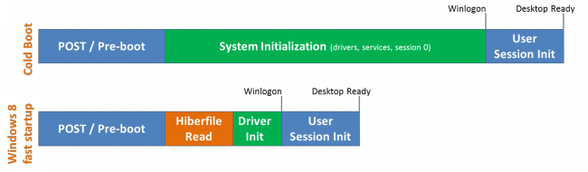
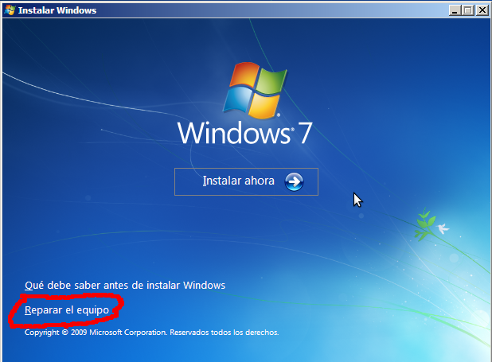
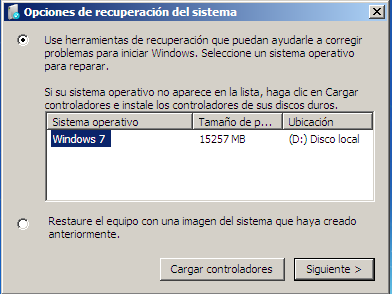
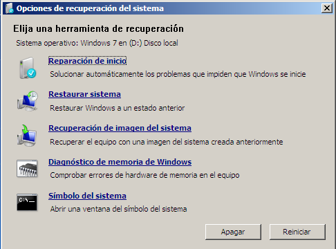

## [Introducció](./)
## [Arrencada del sistema amb UEFI](./uefi.md#arrencada-amb-bios)

## Arrencada amb BIOS
La **BIOS** és un xip de memòria ROM que conté les configuracions bàsiques de l'ordinador (com la data i hora o la seqüència d'arrencada) i un xicotet programa per a carregar el sistema operatiu.


Encara que la inmensa majoria d'equips ja no tenen BIOS sino la nova **UEFI** aquesta es pot configurar en mode **Legacy BIOS** per a que funcione com una BIOS.

El procés és el següent:
* A l'arrencar l'ordinador la CPU executa el programa carregat en la BIOS, anomenat **POST** (PowerOn Self Test)
* El POST comprova i inicialitza el hardware de l'equip
* Llig la seqüència d'arrencada (guardada en la BIOS) per a saber quin és el primer dispositiu d'arrencada (normalment CD, Disc dur, ...)
* Carrega en la RAM el primer sector del dispossitiu (anomenat Master Boot Record, **MBR**)
* El programa que hi ha en el MBR llig la taula de particions, identifica la partició activa i carrega en la RAM el **sector d'arrencada de la partició activa**
* Aquest sector conté un programa que busca i carrega en la RAM el **carregador del sistema operatiu**
* Aquest programa (no limitat a 512 bytes) carrega en la RAM i prepara el S.O. amb tot el que necessita
* Ara ja s'executa el S.O.

El procés te tants passos perquè la BIOS només sap carregar el primer sector del dispositiu (MBR) i aquest sector té 512 bytes (com tots) per la qual cosa el programa que conté és molt xicotet i tampoc pot carregar el S.O. directament.

Alguns carregadors canvien el programa del MBR per a que carregue directament el gestor d'arrencada des de la partició en que es troba (com Grub).

El Master Boot Record (**MBR**) és el primer sector d'un dispositiu d'emmagatzematge de dades, com un disc dur o un pen-drive. Conté la taula de particions (64 bytes) que indica quines particions hi ha en el dispostiu i normalment també le programa que inicia la seqüència d'arrencada del sistema operatiu (446 bytes):


La taula de particions conté 4 registres de 16 bytes, amb informació de les 4 particions primàries:. La informació que guarda de cada partició és si és la partició activa, el seu sistema d'arxuis, on comença i on acaba, la seua mida, etc.

### Arrencada de Windows amb BIOS

#### Windows 8/10 vs 7
La manera en que arranca l'ordinador és pràcticament igual en Windows 7 i Windows 10 ( o 8). La principal diferència entre els dos sistemes és que quan apaguen un ordinador amb Windows 7 es tanquen les sessions dels usuaris, s'aturen els serveis i s'apaga la màquina. Amb Windows 8/10 només es tanquen les sessions dels usuaris però la màquina s'hiberna i es guarda el contingut de la memòria en un fitxer anomenat hiberfil.sys. Això té l'avantatge que el sistema s'inicia molt ràpidament perquè no han de carregar-se els drivers i iniciar el sistema operatiu i els serveis.



El procés d'arrencada és el següent:
* Com hem vist el primer lugar s'executa el **POST** i tras comprovar el hardware carrega el **MBR**
* El programa del MBR llig la taula de particions i carrega el **sector d'arrencada de la partició activa** (que serà la que conté el S.O. Windows)
* El programa que hi ha al sector d'arrencada de la partició activa carrega en la RAM el fitxer **BootMGR** (que es troba normalment en l'arrel de la partició oculta d'arrencada)
* Bootmgr llig el fitxer **Bcd.log** (que està dins de la carpeta `\Boot` en la mateixa partició que BootMGR) i, si hi ha més d'una opció, mostra a l'usuari el menú d'arrencada amb les opcions guardades en Bcd
* A continuació carrega el programa **Winload.exe** (que està en `\Windows\system32`) pasant-li les opcions triades per l'usuari
* Winload carrega **ntoskrnl.exe** (està en `\Windows\system32`) que és el kernel de Windows. Aquest programa s'encarrega de la resta del procès de càrrega. Si voleu saber en detall què fa, és el següent:
  * Ntoskrnl executa **Hal.dll** (_Hardware Abstraction Layer_, es troba en `\Windows\system32`) que es qui gestiona tot el hardware
  * A continuació mira en el registre de Windows el contingut de la clau de HKEY_LOCAL_MACHINE\SYSTEM\CurrentControlSet\Services per a veure els dispossitius a carregar:
    * Inicialitza els dispossitius amb un valor de START de 0
    * Inicialitza els dispossitius amb un valor de START de 1
    * Inicialitza, utilitzant Session Manager (arxiu SMSS.EXE) els dispossitius amb un valor de START de 2
  * Executa **Winlogo.exe** que executa **Lsass.exe** (Autoritat de seguretat local) que mostra la pantalla d'inici demanant usuari i contrasenya
  * Si son correctes executa **Userinit.exe** que carrega l'Escriptori de l'usuari

#### Canviar les opcions d'arrencada
NOTA: ací anem a veure com podem modificar l'arrencada de Windows des del mateix sistema però hi ha multitud de programes que ens permeten fer tot això de manera més senzilla, com EasyBCD.

La manera més senzilla de modificar les opcions del BCD és amb el comando `msconfig`. Podem canviar el temps d'espera, el sistema operatiu per defecte o les opcions de càrrega:


Altra manera de canviar les opcions és des de `Panell de Control -> Sistema i Seguretat -> Sistema -> Configuració Avançada del sistema -> Opcions Avançades -> Inici i Recuperació -> Configuració`. Des d'ací només permet canviar el temps i el sistema operatiu per defecte:


L'opció més potent però més difícil de canviar les opcions és executar des de la **terminal d'Administrador** l'eina `bcdedit`. A continuació hi ha un exemple de l'execució d'aquesta ordre sense cap paràmetre o opció.


El comando `BCDEDIT` eina permet configurar qualsevol opció d'arrencada en el menú BCD. Podem obtindre ajuda del mateix amb:
* `bcdedit /?`: mostra informació general del comando
* `bcdedit /? topics`: mostra una llista de accions que permet el comando bcdedit
* `bcdedit /? copy`: mostra informació sobre la acció copy que copia una entrada del menú amb un altre nom

#### Reparar l'arrencada del sistema
El primer que hem de fer és introduir el CD d'instal·lació de Windows i arrancar l'equip. Una vegada iniciem amb el CD, cal triar l'opció de "reparar equip" i no continuar amb l'opció genèrica d'instal·lació del sistema.



Una vegada triem aquesta opció, ens apareixerà una finestra amb dos opcions:



Com en el nostre cas el que volem és reparar el sistema, però no recuperar-lo d'una imatge anterior, cal triar l'opció que apareix en primer lloc. En principi el sistema a carregar apareixerà en la llista. Després de polsar “següent”, ens apareixerà una finestra en les diferents possibilitats de recuperació. Segons el nostre problema haurem de triar una o altra.



Entre les diferents opcions, en el cas que estem, caldria executar la primera opció “Reparació d'inici”. Aquesta opció és la que triem i serà l'encarregada de resoldre si hi han problemes en l'arranc del sistema.

Si això no funciona també podem recuperar l'arrencada des de la línia de comandos. En la pantalla anterior, si triem l'opció “Símbol del sistema” tindrem una terminal a la nostra dispossició. En ella podem utilitzar vàries eines útils:
* **Bootrec**. Ens permet reparar l'MBR, el sector d'arrencada de la partició o el fitxer Bcd.log:
  * per a recuperar l'MBR: `bootrec /fixmbr`
  * per a recuperar el sector d'arrencada: `bootrec /fixboot`
  * per a recuperar un fitxer Bcd.log bàsic si s'haguera borrat o estropejat l'actual: `bootrec /rebuildbcd`
* **Bootsect**. Bootsect.exe actualitza el MBC de les particions de disc dur per canviar entre Bootmgr i NTLDR (que és el carregador de Windows XP). Podem utilitzar també aquesta eina per a restaurar el sector d'arrencada de l'ordinador. La seua sintaxi és:
```bash
    bootsect.exe {/help | /nt52 | /nt60} {SYS | ALL | <DriveLetter:>} [/force] [/mbr]
```
Per exemple per a recuperar el sector d'arrancada de la partició del sistema amb Windows 7 i també recuperar el MBC del MBR la sintaxi seria:
```bash
    bootsect.exe /nt60 SYS /mbr
```
 
#### Reparacions d'inici en Windows 10
La forma de reparar Windows 10 és molt semblant al que hem vist per a Windows 7 però canvia la forma d'accedir a algunes opcions i també inclou nous assitents per a fer més senzilla la tarea.

En internet podeu trobar infinitat de pàgines i vídeos de com fer les reparacions més comuns.

### Arrencada de GNU/Linux amb Grub2 i BIOS
Tenim molts carregadors per als sisteme Linux però el més utilitzat és Grub2.

En realitat Grub no és un gestor d'arrencada només de GNU/Linux sinó que pot carregar qualsevol sistema operatiu (és un gestor d'arrencada múltiple). Una de les característiques més interessants d'aquest gestor és que podem canviar tots els paràmetres en l'arrencada mitjançant el sistema d'ordres de consola de GRUB.

El procés d'inici de Grub és:
* Després de que el **POST** comprove el hardware es carrega en la RAM el **MBR** del primer dispositiu d'arrencada que ha estat modificat per Grub i conté la seua primera fase d'arrencada
* El programa del MBR (la fase 1 de Grub) busca en el disc i carrega la fase 2 de **Grub** (no cal que estiga en la partició activa com passa amb els sistemes Windows)
* La fase 2 de Grub llig el fitxer **grub.cfg** (que conté les opcions de càrrega) i presenta a l'usuari el **menú d'arrencada** de Grub.
* Grub carrega el kernel seleccionat per l'usuari i la resta del sistema operatiu.

#### Canviar les opcions de configuració
La manera més ràpida de canviar les opcions de configuració és editar el fitxer /etc/default/grub. Algunes de les opcions que conté són:
* GRUB_DEFAULT: opció del menú per defecte (equivalent a default en menu.lst). Posem el número d'opció que volem (començant per 0) o “saved”.
* GRUB_TIMEOUT: temps d'espera del menú (equivalent a timeout)
* GRUB_CMDLINE_LINUX_DEFAULT=”quiet splash”: afegeix eixes opcions a la línia kernel (per a que mostre la imatge amb el progrés de la càrrega)
* GRUB_TERMINAL=console: si es descomenta no carrega la interfície gràfica
* GRUB_DISABLE_LINUX_RECOVERY: si es descomenta no apareix la opció de recuperació en el menú

Per a que els canvis fets tinguen efecte, després de fer qualsevol modificació d'aquest fitxer hem de tornar a generar el fitxer grub.cfg mitjançant l'execució de:
```bash
    upgrade-grub
```

També podem instal·lar qualsevol programa gràfic per a editar les opcions d'inici com **StartUp Manager**, **Grub Customizer**, etc:


#### Reparar l'arrencada del sistema
Hi pot haver ocasions en què un usuari necessita tornar a instal·lar Grub 2. Això passa sovint quan el MBR del dispositiu d'arrencada s'altera i GRUB 2 s'elimina, per exemple quan Windows s'instal·la (o es re-instal·la) després d'instal·lar GNU/Linux.

Podem fer-ho de diferents maneres (podeu trobar més informació en [https://help.ubuntu.com/community/Grub2/Installing#Reinstalling_GRUB_2](https://help.ubuntu.com/community/Grub2/Installing#Reinstalling_GRUB_2):

##### Utilitzant un LiveCD
Els passos a seguir són:
1. Arrencar amb el LiveCD.
1. Obrir una terminal.
1. Si no sabem en quina partició tenim instal·lat el sistema operatiu ho determinarem amb fdisk.
```bash
    sudo fdisk -l
```
4. Muntar la partició que conté la instal·lació d'Ubuntu (canvia **sdXY** per la partici'o que cont'e el sistema, per exemple, **sda1** o **sda5**).
```bash
    sudo mount /dev/sdXY /mnt
```
5. Executar l'ordre `grub-install` com es descriu a continuació (canviant **sdX** pel disc dur de l-equip, per exemple, **sda**). Açò reinstal·larà els fitxers de Grub 2 en la partició muntada en la seua correcta ubicació i també corregirà el MBR:
```bash
    sudo grub-install --root-directory=/mnt/ /dev/sdX
```
6. Si hem fet algun canvi en els sistemes que teníem instal·lats (com instal·lar un nou Windows) hem d-actualitzar el menú de Grub 2 amb:
```bash
    sudo update-grub
```

Ara ja podem reiniciar l'equip.

En el pas 5 compte de instal·lar grub des d'un directori podem rootear eixe directori de manera que treballem sobre el nostre sistema en el disc i no sobre el sistema del LiveCD. En eixe cas després de muntar la partició (pas 4) hem de muntar (amb l'opció `--bind`) altres 2 directoris:
```bash
    sudo mount --bind /dev /mnt/dev
    sudo mount --bind /sys /mnt/sys
```

Una vegada fet fem `chroot` sobre el punt de muntatge:
```bash
    sudo chroot /mnt
```

I ara ja podem reparar grub:
```bash
    sudo grub-install --recheck /dev/sdX
```

I per últim actualitzar grub si cal i reiniciar l'equip.

#### Amb SuperGrubDisc2
Es tracta de un LiveCD que permet arrencar des de la partició que conté en nostre linux. Una vegada dins i com que ja estem en el linux nostre nomé cal fer:
1. Executar l'ordre `grub-install`. Açò reinstal·larà els fitxers de Grub 2 de la partició actual en la seua correcta ubicació i també corregirà el MBR.
```bash
    sudo grub-install /dev/sdX
```
2. Actualitzar el menú Grub 2 amb `sudo update-grub` si hem fet algun canvi en el disc (per exemple si hem instal·lat un nou Windows)
```bash
    sudo update-grub
```
3. Reiniciar l'equip.
