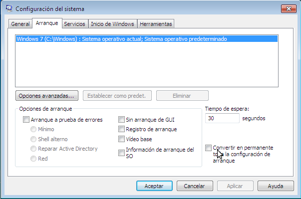
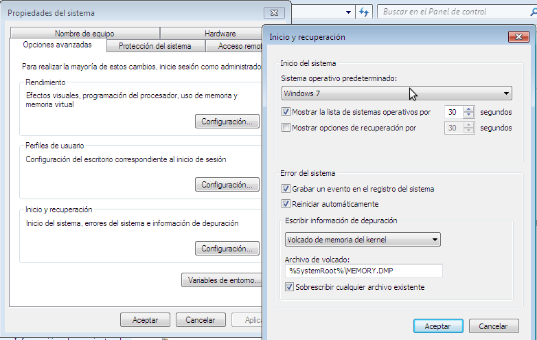
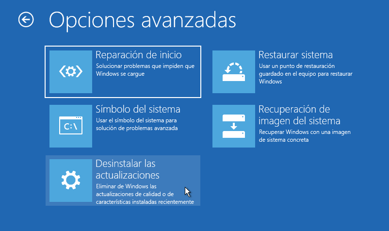
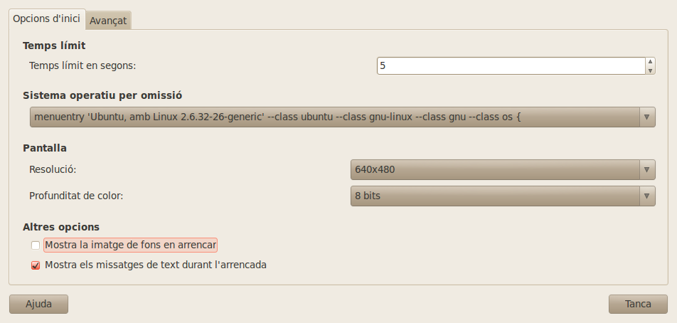
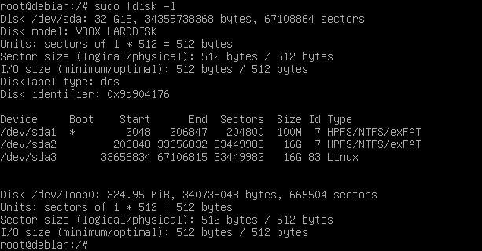

# Arrencada del sistema amb BIOS
- [Arrencada del sistema amb BIOS](#arrencada-del-sistema-amb-bios)
  - [BIOS](#bios)
  - [MBR](#mbr)
  - [Procés d'arrencada](#procés-darrencada)
  - [Arrencada de Windows](#arrencada-de-windows)
    - [Canviar les opcions d'arrencada](#canviar-les-opcions-darrencada)
    - [Reparar l'arrencada del sistema](#reparar-larrencada-del-sistema)
  - [Arrencada de GNU/Linux amb Grub2 i BIOS](#arrencada-de-gnulinux-amb-grub2-i-bios)
    - [Canviar les opcions de configuració de Grub](#canviar-les-opcions-de-configuració-de-grub)
    - [Reparar l'arrencada del sistema](#reparar-larrencada-del-sistema-1)
      - [Utilitzant un LiveCD de GNU/Linux](#utilitzant-un-livecd-de-gnulinux)
      - [Amb SuperGrubDisc2](#amb-supergrubdisc2)

## BIOS
La **BIOS** és un xip de memòria no volàtil que es troba a la placa base i que conté les configuracions bàsiques de l'ordinador (com la data i hora o la seqüència d'arrencada) i un xicotet programa per a carregar el sistema operatiu.


Encara que la inmensa majoria d'equips ja no tenen BIOS sino la nova **UEFI** aquesta es pot configurar en mode **Legacy BIOS** per a que funcione com una BIOS.

L'arrencada amb BIOS només pot fer-se des d'un dispositiu formatjat amb **taula de particions _MBR_** (també anomenada _**Ms-DOS**_).

## MBR
El _Master Boot Record_ (**MBR**) és el primer sector d'un dispositiu d'emmagatzematge de dades, com un disc dur o un pen-drive. Conté la taula de particions (64 bytes), que indica quines particions hi ha en el dispositiu, i, si es un dispositiu d'arrencada, també el programa que inicia la seqüència d'arrencada del sistema operatiu (446 bytes):


La taula de particions conté 4 registres de 16 bytes, amb informació de les 4 particions primàries que és el màxim permès. La informació que guarda de cada partició és si és la partició activa, el seu sistema d'arxius, on comença i on acaba, la seua mida, etc.

## Procés d'arrencada
A l'arrencar un ordinador amb BIOS la CPU executa el programa carregat en ella, anomenat **POST** (_PowerOn Self Test_) que:
* Comprova i inicialitza el hardware de l'equip
* Llig la seqüència d'arrencada (guardada en la BIOS) per a saber quin és el primer dispositiu d'arrencada (normalment CD, Disc dur, ...), és a dir, on buscar el sistema operatiu
* Carrega en la RAM el primer sector d'eixe dispositiu (anomenat _Master Boot Record_, **MBR**)
* El programa que hi ha en el MBR llig la taula de particions, identifica la partició activa i carrega en la RAM el **sector d'arrencada de la partició activa**
* Aquest sector conté un programa que busca i carrega en la RAM el **carregador del sistema operatiu**
* Aquest carregador ja no està limitat a 512 bytes i és qui carrega en la RAM i prepara el Sistema Operatiu amb tot el que necessita
* Ara ja s'executa el S.O.

El procés te tants passos perquè tant el programa de la BIOS com el del MBR i el del sector d'arrencada de la partició activa són molt xicotets (recorda que la mida de un sector són 512 bytes) i per tant no poden carregar el S.O. directament.

Alguns sistemes canvien el programa del MBR per a que carregue directament el carregador del sistema operatiu des de la partició en que es trobe (com Grub).

## Arrencada de Windows
La manera en que arranca l'ordinador és pràcticament igual des de Windows 7. La principal diferència és que quan apaguen un ordinador amb Windows 7 es tanquen les sessions dels usuaris, s'aturen els serveis i s'apaga la màquina però els Windows posteriors només es tanquen les sessions dels usuaris però la màquina s'hiberna i es guarda el contingut de la memòria en un fitxer anomenat _hiberfil.sys_. Això té l'avantatge que el sistema s'inicia molt ràpidament perquè no han de carregar-se els drivers i iniciar el sistema operatiu i els serveis.


Per a que l'ordinador s'ature completament i poder així entrar en la BIOS hem d'apagar-lo en Windows amb la tecla majúscules polsada. 

El procés d'arrencada és el següent:
* Com hem vist el primer lugar s'executa el **POST** i tras comprovar el hardware carrega el **MBR** en la RAM
* El programa del MBR llig la taula de particions i carrega el **sector d'arrencada de la partició activa** (que serà la partició que conté els fitxers d'arrencada de Windows)
* El programa que hi ha al sector d'arrencada de la partició activa carrega en la RAM el fitxer **BootMGR** (que està en la seua partició)
* _Bootmgr_ llig el fitxer **BCD.log** (que està dins de la carpeta `\Boot` en la mateixa partició que BootMGR) i, si hi ha més d'una opció, mostra a l'usuari el menú d'arrencada amb les opcions guardades en BCD
* A continuació carrega el programa **Winload.exe** (que està en `\Windows\system32`) pasant-li les opcions triades
* Winload carrega **ntoskrnl.exe** (està en `\Windows\system32`) que és el _kernel_ de Windows. Aquest programa s'encarrega de la resta del procès de càrrega. Si voleu saber en detall què fa, és el següent:
  * Ntoskrnl executa **Hal.dll** (_Hardware Abstraction Layer_, es troba en `\Windows\system32`) que es qui gestiona tot el hardware
  * A continuació mira en el registre de Windows el contingut de la clau de HKEY_LOCAL_MACHINE\SYSTEM\CurrentControlSet\Services per a veure els dispossitius a carregar:
    * Inicialitza els dispositius amb un valor de START de 0
    * Inicialitza els dispositius amb un valor de START de 1
    * Inicialitza, utilitzant Session Manager (arxiu SMSS.EXE) els dispositius amb un valor de START de 2
  * Executa **Winlogo.exe** que executa **Lsass.exe** (Autoritat de seguretat local) que mostra la pantalla d'inici demanant usuari i contrasenya
  * Si son correctes executa **Userinit.exe** que carrega l'Escriptori de l'usuari

### Canviar les opcions d'arrencada
NOTA: ací anem a veure com podem modificar l'arrencada de Windows des del mateix sistema però hi ha multitud de programes que ens permeten fer tot això de manera més senzilla, com EasyBCD.

Una forma senzilla de modificar algunes opcions del BCD és amb el comando `msconfig`. Podem canviar el temps d'espera, el sistema operatiu per defecte o les opcions de càrrega:



Altra manera de canviar les opcions és des de `Panell de Control -> Sistema i Seguretat -> Sistema -> Configuració Avançada del sistema -> Opcions Avançades -> Inici i Recuperació -> Configuració`. Des d'ací només permet canviar el temps i el sistema operatiu per defecte:



L'opció més potent però més difícil de canviar les opcions és executar des de la **terminal d'Administrador** l'eina `bcdedit`. A continuació hi ha un exemple de l'execució d'aquesta ordre sense cap paràmetre o opció.


L'eina `BCDEDIT` permet configurar qualsevol opció d'arrencada en el menú BCD així com afegir noves entrades al menú. Podem obtindre ajuda del mateix amb:
* `bcdedit /?`: mostra informació general del comando
* `bcdedit /? topics`: mostra una llista de accions que permet el comando bcdedit
* `bcdedit /? copy`: mostra informació sobre la acció copy que copia una entrada del menú amb un altre nom

### Reparar l'arrencada del sistema
El primer que hem de fer és introduir el CD d'instal·lació de Windows i arrancar l'equip. Una vegada iniciem amb el CD, cal triar l'opció de "**Reparar l'equip**" en compte de continuar amb l'opció d'instal·lació del sistema.

Una vegada triem aquesta opció, ens pot aparèixer una finestra on triarem **Solucionar problemes**. A continuació ens apareixerà una finestra en les diferents possibilitats de recuperació:




- **Reparació d'inici**: resol automàticament els problemes en l'arrencada del sistema
- **Restaurar sistema**: torna el sistema a un punt de restauració anterior en el que funcionaba correctament. Els punts de restauració són com instantànies en que es guarda l'estat del sistema de manera que es pot tornar posteriorment a eixe estat. Alguns es fan automàticament quan fem alguna acció perillosa i a més podem crear una quan vulguem
- **Recuperació de la imatge del sistema**: si hem fet una imatge quan el sistema funcionaba podem restaurar-la amb aquesta opció
- **Desinstal·lar actualitzacions**: de vegades és una actualització la que fa que el sistema no funcione. Des d'ací podem desinstal·lar les últimes
- **Símbol del sistema**: si no funciona la reparació d'inici des d'ací obrim una terminal des de la que podem intentar la reparació manualment. En ella podem utilitzar vàries eines útils:
  - **Bootrec**. Ens permet reparar l'MBR, el sector d'arrencada de la partició o el fitxer Bcd.log:
    * per a recuperar l'MBR: `bootrec /fixmbr`
    * per a recuperar el sector d'arrencada: `bootrec /fixboot`
    * per a recuperar un fitxer Bcd.log bàsic si s'haguera borrat o estropejat l'actual: `bootrec /rebuildbcd`
  - **Bootsect**. Bootsect.exe actualitza el MBC de les particions de disc dur. Podem utilitzar també aquesta eina per a restaurar el sector d'arrencada de l'ordinador. La seua sintaxi és:
```bash
    bootsect.exe {/help | /nt52 | /nt60} {SYS | ALL | <DriveLetter:>} [/force] [/mbr]
```
Per exemple per a recuperar el sector d'arrancada de la partició del sistema amb Windows 7 i també recuperar el MBC del MBR la sintaxi seria:
```bash
    bootsect.exe /nt60 SYS /mbr /force
```
 
En internet podeu trobar infinitat de pàgines i vídeos de com fer les reparacions més comuns.

## Arrencada de GNU/Linux amb Grub2 i BIOS
Tenim molts carregadors per als sistemes Linux però el més utilitzat és **Grub2**.

En realitat Grub no és un gestor d'arrencada només de GNU/Linux sinó que pot carregar qualsevol sistema operatiu (és un gestor d'arrencada múltiple). Una de les característiques més interessants d'aquest gestor és que podem canviar tots els paràmetres en l'arrencada mitjançant el sistema d'ordres de consola de GRUB.

El procés d'inici de Grub és:
* Després de que el **POST** comprove el hardware es carrega en la RAM el **MBR** del primer dispositiu d'arrencada. El programa del MBR ha estat modificat per Grub i conté la seua primera fase d'arrencada
* El programa del MBR (la fase 1 de Grub) busca en el disc i carrega la fase 2 de **Grub** (no cal que estiga en la partició activa com passa amb els sistemes Windows)
* La fase 2 de Grub llig el fitxer **grub.cfg** (que conté les opcions de càrrega) i presenta a l'usuari el **menú d'arrencada** de Grub.
* Grub carrega el kernel seleccionat per l'usuari i la resta del sistema operatiu.

### Canviar les opcions de configuració de Grub
La manera més ràpida de canviar les opcions de configuració és editar el fitxer `**/etc/default/grub**`. Algunes de les opcions que conté són:
* `GRUB_DEFAULT`: opció del menú que es triarà per defecte. Posem el número d'opció que volem (començant per 0) o _`saved`_ (la última triada)
* `GRUB_TIMEOUT`: temps d'espera del menú
* `GRUB_CMDLINE_LINUX_DEFAULT="quiet splash"`: afegeix opcions a la línia kernel (en aquest cas per a que mostre la imatge amb el progrés de la càrrega i no el detall del que es fa)
* `GRUB_TERMINAL=console`: si es descomenta no carrega la interfície gràfica
* `GRUB_DISABLE_LINUX_RECOVERY`: si es descomenta no apareix l'opció de recuperació en el menú

Per a que els canvis fets tinguen efecte, després de fer qualsevol modificació d'aquest fitxer hem de tornar a generar el fitxer grub.cfg mitjançant l'execució de:
```bash
    upgrade-grub
```

També podem instal·lar qualsevol programa gràfic per a editar les opcions d'inici com **StartUp Manager**, **Grub Customizer**, etc:



### Reparar l'arrencada del sistema
Hi pot haver ocasions en què un usuari necessita tornar a instal·lar Grub2. Això passa sovint quan el MBR del dispositiu d'arrencada s'altera i GRUB 2 s'elimina, per exemple quan Windows s'instal·la (o es re-instal·la) després d'instal·lar GNU/Linux en eixe ordinador.

Podem fer-ho de diferents maneres (podeu trobar més informació en [https://help.ubuntu.com/community/Grub2/Installing#Reinstalling_GRUB_2](https://help.ubuntu.com/community/Grub2/Installing#Reinstalling_GRUB_2):

#### Utilitzant un LiveCD de GNU/Linux
Els passos a seguir són:
1. Arrencar amb el LiveCD.
1. Obrir una terminal.
1. Si no sabem en quina partició tenim instal·lat el sistema operatiu ho determinarem amb el comando `fdisk -l`.

4. Muntar la partició que conté la instal·lació d'Ubuntu (en el cas de l'exemple **sda3** que és la partició Linux).
```bash
  sudo mount /dev/sda3 /mnt
```
5. Si hem fet algun canvi en els sistemes que teníem instal·lats (com instal·lar un nou Windows) hem d-actualitzar el menú de Grub2 amb:
```bash
  sudo update-grub
```
1. Executar l'ordre `grub-install` com es descriu a continuació. Açò reinstal·larà els fitxers de Grub2 en la partició muntada i corregirà el MBR:
```bash
  sudo grub-install --root-directory=/mnt/ /dev/sda
```

Ara ja podem reiniciar l'equip.

En el pas 6 compte de instal·lar grub des d'un directori podem _rootear_ eixe directori de manera que treballem sobre el nostre sistema en el disc i no sobre el sistema del LiveCD. En eixe cas després de muntar la partició (pas 4) hem de muntar (amb l'opció `--bind`) altres 3 directoris:
```bash
  sudo mount --bind /sys /mnt/sys
  sudo mount --bind /proc /mnt/proc
  sudo mount --bind /dev /mnt/dev
```

Una vegada fet fem `chroot` sobre el punt de muntatge:
```bash
  sudo chroot /mnt
```

I ara ja podem reparar grub (abans l'actualitzarem si cal amb `update-grub`):
```bash
  sudo grub-install --recheck /dev/sdX
```

I per últim reiniciem l'equip.

#### Amb SuperGrubDisc2
Es tracta de un LiveCD que permet arrencar des de la partició que conté en nostre linux. Una vegada dins i com que ja estem en el linux nostre nomé cal fer:
1. Actualitzar el menú Grub2 amb `sudo update-grub` si hem fet algun canvi en el disc (per exemple si hem instal·lat un nou Windows)
2. Executar l'ordre `grub-install`. Açò reinstal·larà els fitxers de Grub2 de la partició actual en la seua correcta ubicació i també corregirà el MBR.
```bash
  sudo grub-install /dev/sdX
```
3. Reiniciar l'equip.

A més de SuperGrub hi ha altres utilitats per fer això com **Boot Repair**, **Rescatux**, etc.