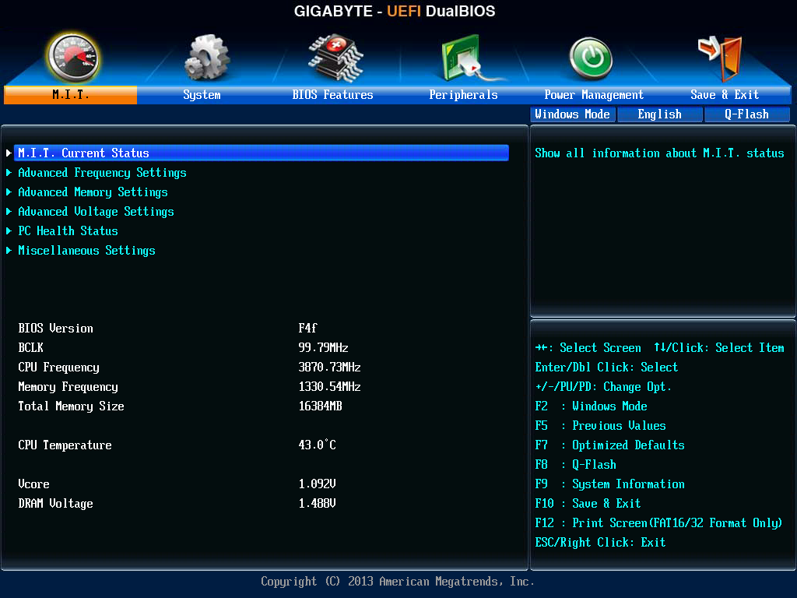
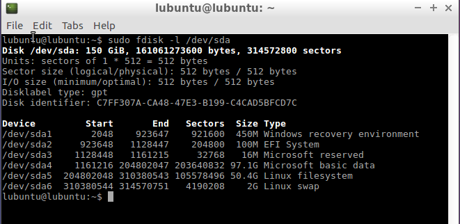

## [Introducció](./)
## [Arrencada del sistema amb BIOS](./bios.md)
### [Arrencada de Windows amb BIOS](./bios.md#arrencada-de-windows-amb-bios)
### [Arrencada de GNU/Linux amb Grub2 i BIOS](./bios.md#arrencada-de-gnulinux-amb-grub2-i-bios)

## Arrencada amb UEFI
La **EFI** (_Extensible Firmware Interface_), és una especificació desenvolupada per Intel per a reemplaçar la antiga BIOS que tenia moltes limitacions:
* Dona suport complet als discos **GPT** que superen les limitacions dels **MBR** (la mida màxima d'una partició MBR és de 2 TB front als 8 ZB i només permeten 4 particions primàries front a les 128 que permeten els discos GPT).
* A més funciona en mode 64 bits a diferència de la BIOS que s'executa en mode 16 bits (heretat dels primers PC)
* L'entorn és molt més amigable (entorn gràfic amb ratolí front a la interfície de text de BIOS)
* El temps d'arrencada del sistema operatiu és més curt perquè UEFI pot carregar directament el carregador del sistema operatiu sense "intermediaris".
* Només carrega sistemes operatius de 64 bits.
* La interfície UEFI te un modo compatible amb la BIOS (**Legacy BIOS**) que li permet funcionar con una BIOS per a carregar sistemes operatius de 32 bits o que estiguen en discos MBR. NOTA: Per a saber quin tipus d'instal·lació de Windows tenim executem (menu contextual del botó Inici -> Executar) msinfo32.



El procés d'arrencada és més simple que amb BIOS: al arrancar l'equip s'executa el prgrama que hi ha en la UEFI que comprova i inicialitza el hardware i carrega directament en la RAM el carregador del sistema operatiu que carrega el kernel del sistema i tot el que necessita.

L'arrencada amb UEFI és més senzilla i ràpida perquè aquest firmware pot carregar directament en la RAM el carregador del sistema operatiu, sense necessitat de l'MBR ni el sector d'arrencada de la partició activa.

Un ordinador amb arrencada UEFI necessita una partició en el disc dur anomenada **ESP** (_EFI System Partition_) on es guarden els carregadors dels sistemes operatius instal·lats en el disc. Aquesta partició ha de tindre un sistema d'arxius **FAT32** i conté el carregador de cada sistema operatiu instal·lat.


En la imatge anterior podem veure la partició EFI d'un equip amb Windows 8, Debian i Ubuntu instal·lats. En el panel de la dreta podem veure el contingut de la carpeta d'arrencada de Windows amb el carregador (bootmgr) i el menú d'opcions d'inici (BCD).

Si el nostre ordinador amb UEFI no arranca accedirem a la shell de UEFI des d'on podem intentar arreglar l'arrencada del sistema. En qualsevol cas sempre podem arrancar des d'un USB amb algun gestor d'arrencada per a UEFI com **rEFInd**, **Boot-repair** o altres.

Des de la shell de UEFI podem arreglar el problema afegint una opció per a que arranque el carregador que li indiquem. Hem primer lloc anem a veure els dispositius que tenim:
```bash
Shell> map
```

Entrem en el disc dur (normalment fs0):
```bash
Shell> fs0:
```

Amb `ls` podem veure el contingut i buscar el carregador (un fitxer _.efi_ que estarà dins de la carpeta de la nostra distribució). En el cas de Debian el trobem en _fs0:\EFI\debian\grubx64.efi_. Ara afegim una entrada per al carregador
:
```bash
FS0:\> bcfg boot add 0 fs0:\EFI\debian\grubx64.efi "Debian"
```

Per a finalitzar eixim amb `exit` i ja tenim el carregador arreglat.

### I si Linux no arranca?
Cada sistema operatiu que instal·lem crearà dins de la partició EFI una carpeta amb el seu nom (Microsoft, Debian, Ubuntu, Apple, etc) dins de la qual hi ha un fitxer anomenat _nomfitxerarquitectura.efi_ (per exemple **bootx64.efi** o **grubx64.efi**) que és el carregador d'eixe sistema operatiu. A més crea una variable en la NVRAM (Non-volatile RAM) de UEFI que apunta a eixe carregador per a que aparega eixa opció en el menú al arrancar (si només hi ha una opció no apareix el menú).

Si el firmware no troba cap opció al arrancar directament carrega el fitxer **`EFI/boot/bootx64.efi`** que és un carregador per defecte, dins del directori boot que no pertany a cap sistema operatiu. Microsoft quan instal·la un sistema a més de posar el seu carregador dins de `EFI/Microsoft` sobreescriu el carregador per defecte amb el seu carregador de manera que per defecte arranque Windows.

Això no hauria de ser un problema però hi ha alguns equips amb una implementació dèbil d'EFI on els carregadors no es registren correctament en la NVRAM per la qual cosa només arranquen el carregador per defecte, és a dir,el de Windows (font: [http://mjg59.livejournal.com/138188.html](http://mjg59.livejournal.com/138188.html)).

La solució si tenim un equip amb aquest problema on volem tindre un Windows i un GNU/Linux és sobreescriure el `EFI/boot/bootx64.efi` amb el carregador de GNU/Linux que ens donarà opció d'arrancar tant Linux com Windows.

Els pasos per a fer-ho són els següents:
1. **Arranquem amb un LiveCD** de GNU/Linux. Quan ens pregunte li direm que volem provar el sistema sense instal·lar res (en realitat el nostre GN//Linux ja està instal·lat, només que no podem accedir a ell).
2. **Obrim una terminal** i determinem quina és la partició de EFI i quina la del nostre sistema GNU/Linux. Podem fer-ho amb `sudo fdisk -l` (o si el fdisk diu que no enten particions GPT fem `sudo parted`).



En el nostre cas la partició EFI és /dev/sda2 i la de Linux és /dev/sda5.

3. Executem els comandos per a substituir bootx64.efi:
* Muntem les particions:
```bash
mount /dev/sda5 /mnt
mount /dev/sda2 /mnt/boot/efi
for i in /sys /proc /dev; do mount --bind $i /mnt$i; done
```

* Canviem al nostre sistema del disc (fins ara treballabem amb el del LiveCD)
```bash
chroot /mnt
```

* Copiem el fitxer d'arrencada de Grub al fitxer per defecte
```bash
cd /boot/efi/EFI
cp ubuntu/grubx64.efi Boot/bootx64.efi
```

* Desmuntem les particions:
```bash
exit
for i in /sys /proc /dev; do umount /mnt$i; done
umount /mnt/boot/efi
umount /mnt
```

Ara ja podem reiniciar el nostre sistema i apareixerà el menú de Grub per a tria quin sistema operatiu carregar.

(Font [https://wiki.debian.org/GrubEFIReinstall#Problem1:_Weak_EFI_implementation_only_recognizes_the_fallback_bootloader](https://wiki.debian.org/GrubEFIReinstall#Problem1:_Weak_EFI_implementation_only_recognizes_the_fallback_bootloader) )
