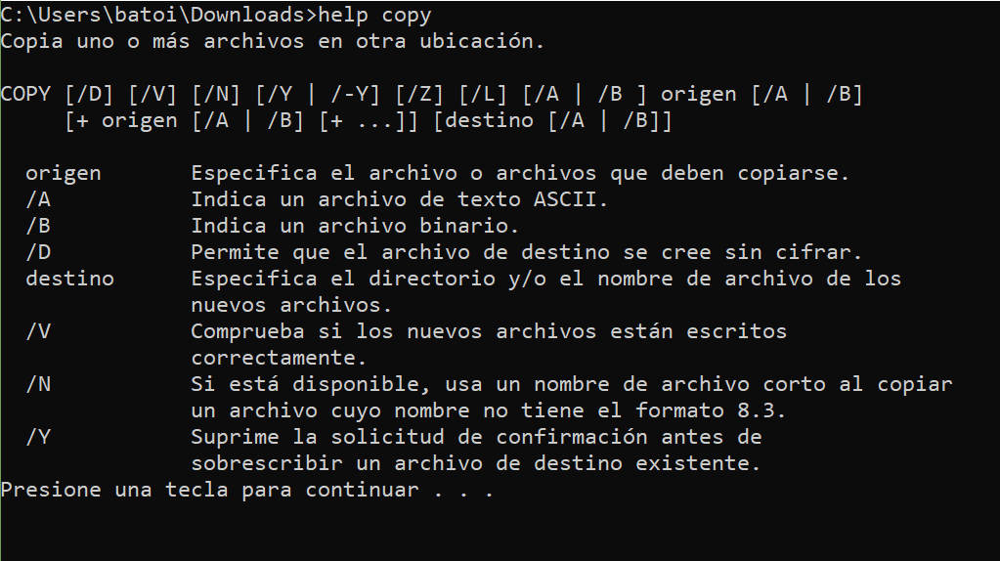
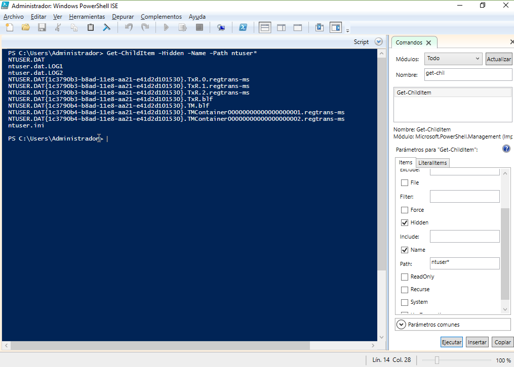
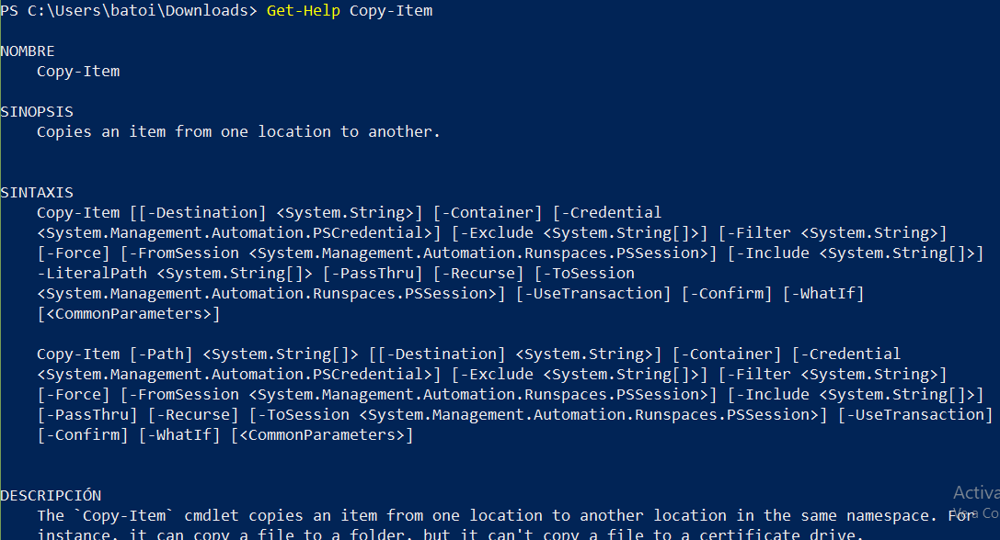

# PowerShell
- [PowerShell](#powershell)
  - [Introducción a PowerShell](#introducción-a-powershell)
  - [Obtener ayuda](#obtener-ayuda)
  - [PowerShell ISE](#powershell-ise)
  - [Sintaxis de los comandos de la consola](#sintaxis-de-los-comandos-de-la-consola)
  - [Comandos para trabajar con Directorios y Ficheros](#comandos-para-trabajar-con-directorios-y-ficheros)
    - [Cambiar de directorio](#cambiar-de-directorio)
    - [Ver el contenido de un directorio](#ver-el-contenido-de-un-directorio)
    - [Crear un directorio o un fichero vacío](#crear-un-directorio-o-un-fichero-vacío)
    - [Borrar un directorio o fichero](#borrar-un-directorio-o-fichero)
    - [Copiar directorios y ficheros](#copiar-directorios-y-ficheros)
    - [Mover directorios y archivos](#mover-directorios-y-archivos)
    - [Renombrar directorios y ficheros](#renombrar-directorios-y-ficheros)
  - [Comandos para trabajar con el contenido de un fichero](#comandos-para-trabajar-con-el-contenido-de-un-fichero)
  - [Comandos para gestionar la red](#comandos-para-gestionar-la-red)
  - [Comandos para gestionar discos](#comandos-para-gestionar-discos)
  - [Comandos para gestionar procesos](#comandos-para-gestionar-procesos)
  - [Comandos para gestionar usuarios](#comandos-para-gestionar-usuarios)
  - [Comandos para gestionar grupos](#comandos-para-gestionar-grupos)

## Introducción a PowerShell
Está basado en objetos por lo que en lugar de procesar texto como la mayoría de intérpretes de comandos procesa objetos. A sus comandos se les llama **cmdlets** y están formados por un verbo (_Get_, _Set_, ...) y un nombre de objeto sobre el que realizar la acción (_Location_, _Item_, _Content_, _Process_, _Service_, ...) separados por un **-**.

Por ejemplo, para cambiar al directorio _Windows_ el comando es `cd C:\Windows` y su _cmdlet_ correspondiente es 

```powershell
Set-Location C:\Windows
```

donde:
- **Set** indica la operación a realizar sobre el objeto
- **Location** es el objeto sobre el que actuamos. _Location_ almacena el directorio actual
- _PATH_ el parámetro es la ubicación del directorio al que queremos ir

Y para saber en qué directorio estamos deberíamos ejecutar `Get-Location`.

La salida de un _cmdlet_ es también un objeto por lo que podemos encadenar varios cmdlets, formatear la salida, aplicar filtros, ... 

Algunos comandos útiles para todo esto son:
- **`Out-GridView`**: formatea la salida en forma de tabla en el entorno gráfico con la que podemos interactuar. Reconoce los nombres de los campos así como su tipo de datos
- **`Where-Object`**: es un poderoso filtro que no da acceso a multitud de funciones
- **`Sort-Object`**: permite ordenar por la propiedad que deseemos
- **`Export-CSV`**: exporta la salida a formato CSV (texto con separador)
- **`Measure-Object`**: cuenta los objetos pasado
- ...

Ejemplo:
```powershell
Get-Process | Where-Object {$_.Id -gt 500 -and $_.Id -lt 1000 } | Sort-Object -Property Id | Format-Table -Property *
```

El operador **`|`** permite encadenar varios comandos de forma que la salida del comando que hay antes del operador constituirá la entrada para el comando que hay tras él. Se utiliza tanto en PS como en la consola clásica y en las diferentes terminales de GNU/Linux. Lo veremos con más detalle en el apartado de [redireccionamiento de comandos](#redireccionamiento-de-comandos).

Los _cmdlets_ normalmente tienen alias tanto para poder seguir usando los comandos clásicos como para no escribir tanto. Por ejemplo `Get-ChildItem` tiene como alias `dir`, `ls` y `gci`. Podemos ver todos los alias de un comando con `Get-Alias`. Ejemplo:
```powershell
Get-Alias -Definition Get-ChildItem
```

## Obtener ayuda
Normalmente para ejecutar un comando ponemos uno o más parámetros para que el comando haga exactamente lo que queremos. Esto hace que en ocasiones sea compleja la forma de utilizar un comando y muchas veces tenemos que ir a la ayuda para hacer lo que queremos.

Para obtener la ayuda de un comando ejecutaremos el cmdlet
```powershell
Get-Help <NombreDelCmdlet>
```



Si ponemos `Get-Help <NombreDelCmdlet> -full` muestra información detallada de cada opción del comando así como ejemplos de uso.

Si sólo queremos ver ejemplos de su uso pondremos `Get-Help <NombreDelCmdlet> -examples`.

La primera vez nos pedirá que actualicemos la ayuda con el cmdlet **`Update-Help`** ya que no se instala por defecto (hay que hacerlo desde una consola de Administrador). Este cmdlet tiene como alias _help_ y _man_.

El cmdlet para obtener la lista de comandos es `Get-Command`.

## PowerShell ISE
PowerShell incluye un entorno para probar comandos llamado ISE (_Interactive Script Environment_) que nos permite ver gráficamente los parámetros de un comando lo que puede ser útil cuando no los recordamos.



En este caso se quería listar los ficheros del directorio actual cuyo nombre empieza por 'ntuser' aunque estén ocultos. Se selecciona el comando a usar, se marcan los parámetros en el panel de la derecha y se pulsa 'Ejecutar' y el entorno escribe por nosotros el comando con sus parámetros correctos.

## Sintaxis de los comandos de la consola
Normalmente para ejecutar un comando ponemos uno o más parámetros para que el comando haga exactamente lo que queremos. Esto hace que en ocasiones sea compleja la forma de utilizar un comando y muchas veces tenemos que ir a la ayuda para hacer lo que queremos.



La información que nos proporciona la ayuda es la siguiente:
- Sinopsis: breve resumen de lo que hace el cmdlet
- Sintaxis: cómo tenemos que utilizarlo. Normalmente los comandos pueden tener parámetros que modifican su comportamiento. Además algunos tienen parámetros que es obligatorio poner para que el comando sepa qué tiene que hacer. Aquí podemos encontrar:
  - parámetros sin corchetes: significa que son obligatorios, es decir que tenemos que escribir algo allí. Si van entre `< >` significa que no hay que poner eso sino un valor que concuerde con lo que pone allí. Por ejemplo `<System.String>` indica que hay que poner una cadena (en este caso la que indica los ficheros a copiar y es obligatorio ponerla. Si no lo hacemos tendremos un error al intentar ejecutar el comando
  - parámetros entre corchetes: significa que son opcionales, es decir que podemos ponerlos o no. Por ejemplo podemos poner `-Confirm` (los corchetes no se escriben) y en ese caso si ya existe el fichero en el destino nos pedirá confirmación para sobreescribirlo. Si no lo ponemos no lo verificará
- Descripción del comando: explica qué hace ese comando 
- Vínculos relacionados: dónde podemos encontrar más información al respecto
- Notas: nos indica que pongamos modificadores a `Get-Help` para:
  - `-examples`: muestra ejemplos del comando
  - `-detailed`: muestra más información del comando
  - `-online`: muestra la ayuda de internet del comando

Cómo podemos ver, los parámetros que modifican el comportamiento de un comando en la consola de Windows son una letra precedida del carácter **-**. Podemos poner tantos parámetros como necesitemos para un comando.

## [Comandos para trabajar con Directorios y Ficheros](https://docs.microsoft.com/es-es/powershell/scripting/samples/working-with-files-and-folders?view=powershell-7.1)

### Cambiar de directorio
**`Set-Location`** (equivale a `cd`)

Cambia el directorio actual por el que le pasamos como parámetro. El _cmdlet_ para mostrar el directorio actual es **`Get-Location`**. 

Ejemplos:
- `Set-Location -Path C:\Usuarios`: Cambia al directorio C:\Usuarios que pasa a ser el directorio actual. En este _cmdlet_ y en muchos otros podemos omitir el parámetro _-Path_ y poner directamente la ruta: `Set-Location C:\Usuarios`
- `Set-Location -Path ..`: Cambia al directorio padre del actual
- `Get-Location`: Muestra la ruta absoluta del directorio actual
- `Set-Location -Path .. -Passthru`: Cambia al directorio padre del actual y muestra por consola dónde se encuentra (es como hacer tras el _Set-Location_ un _Get-Location_)


### Ver el contenido de un directorio
**`Get-ChildItem`** (equivale a `dir`)

Lista el contenido del directorio pasado como parámetro. Si no le pasamos ningún parámetro muestra el contenido del directorio actual. 

Principales parámetros:
- **`-Path <PATH>`**: de qué directorio queremos ver su contenido (podemos omitir el _-Path_)
- **`-Recurse`**: muestra también el contenido de los subdirectorios
- **`-Force`**: muestra también los archivos ocultos y del sistema (los que tienen los atributos **H** -_hidden_- o **S** -_system_-)
- **`-Filter`**, **`-Include`**, **`-Exclude`**: permite filtrar los resultados por el nombre. También se puede usar para filtrar el cmdlet **`Where-Object`** que es mucho más potente y el cmdlet **`Sort-Object`** para ordenar el resultado

Ejemplos:
- `Get-ChildItem`: Muestra el contenido del directorio actual
- `Get-ChildItem ..`: Muestra el contenido del directorio padre del actual
- `Get-ChildItem C:\Usuarios -Force`: Muestra el contenido del directorio C:\Usuarios, incluyendo ficheros ocultos y del sistema
- `Get-ChildItem -Include *.txt`: Muestra todos los ficheros del directorio actual con extensión .txt
- `Get-ChildItem -Include *.txt | Where-Object -FilterScript {($_.LastWriteTime -gt '2005-10-01') -and ($_.Length -ge 1mb) -and ($_.Length -le 10mb)}`: Muestra todos los ficheros del directorio actual con extensión .txt que se modificaron por última vez después del 1 de octubre de 2005, cuyo tamaño no es inferior a 1 megabyte ni superior a 10 megabytes
- `Get-ChildItem -Include *.txt | Where-Object -FilterScript {($_.LastWriteTime -gt '2015-10-01') -and ($_.Length -ge 500kb) -and ($_.Length -le 10mb)} | Sort-Object -Property Length`: Muestra todos los ficheros del directorio actual con extensión .txt que se modificaron por última vez después del 1 de octubre de 2015, cuyo tamaño es mayor o igual a 500 kilobytes y menor o igual a 10 megabytes ordenados por tamaño

### Crear un directorio o un fichero vacío
**`New-Item`** (en directorios equivale a `mkdir`)

Crea un nuevo directorio o fichero que le pasamos como parámetro. Ejemplos:
- `New-Item -Path 'clientes' -ItemType Directory`: Crea un directorio llamado clientes dentro del directorio actual
- `New-Item -Path '..\clientes' -ItemType Directory`: Crea un directorio llamado clientes en el directorio paro del actual
- `New-Item -Path 'C:\Usuarios\Juan\Documentos\clientes' -ItemType Directory`: Crea el directorio clientes en C:\Usuarios\Juan\Documentos
- `New-Item -Path 'clientes.txt' -ItemType File`: Crea un fichero llamado clientes.txt dentro del directorio actual
- `New-Item -Path 'C:\Usuarios\Juan\Documentos\clientes.txt' -ItemType File`: Crea el fichero clientes.txt en C:\Usuarios\Juan\Documentos

### Borrar un directorio o fichero
**`Remove-Item`** (equivale a `rmdir` en directorios y `del` en ficheros)

Borra los directorios o ficheros pasados como parámetro. Si queremos borrar un directorio que no está vacío _Remove-Item_ pedirá confirmación (a menos que se le añada el modificador **-Recurse**).

Ejemplos:
- `Remove-Item -Path clientes`: Elimina el directorio clientes que hay dentro del directorio actual (si no está vacío pedirá confirmación)
- `Remove-Item -Path  C:\Usuarios\Juan\Documentos\clientes`: Elimina el directorio clientes de la ubicación indicada (si no está vacío pedirá confirmación)
- `Remove-Item -Path clientes -Recurse`: Elimina el directorio clientes que hay dentro del directorio actual y todo su contenido sin pedir confirmación
- `Remove-Item -Path lligme.txt`: Borra el fichero lligme.txt del directorio actual
- `Remove-Item -Path C:\Usuarios\juan\*.odt`: Borra todos los ficheros con extensión odt del directorio indicado

### Copiar directorios y ficheros
**`Copy-Item`** (equivale a `copy/xcopy`)

Copia los ficheros o directorios indicados a una nueva ubicación. Si ya existe el fichero en el destino se produce un error. Principales parámetros y modificadores:
- **-Path**: Indica la ruta de los objetos a copiar
- **-Destination**: Indica el directorio de destino
- **-Recurse**: Copia también los subdirectorios (si no sólo copia ficheros)
- **-Force**: Si existe el fichero en el destino lo sobreescribe
- **-Filter**, **-Include**, **-Exclude**: Permite filtrar los objetos a copiar

Ejemplos:
- `Copy-Item -Path leeme.txt -Destination F:\`: Copia todos el fichero leeme.txt del directorio actual al directorio raíz de la unidad F:. También se puede poner `Copy-Item leeme.txt F:\`
- `Copy-Item -Path * -Destination F:\`: Copia todos los ficheros del directorio actual al directorio raíz de la unidad F: (pero no copiará los subdirectorios)
- `Copy-Item -Path * -Destination F:\ -Recurse`: Copia todos los ficheros y subdirectorios del directorio actual al directorio raíz de la unidad F:

### Mover directorios y archivos
**`Move-Item`** (equivale a `move`)

Funciona como el comando de copiar pero en vez de hacer una copia se mueven los ficheros o directorios de ubicación. Después copiar tendremos el fichero 2 veces: donde estaba y donde lo hemos copiado. Si lo movemos se borra de donde estaba y se sitúa donde lo copiamos.

Funciona también con directorios sn necesidad de poner modificador (sin _-Recurse_).

### Renombrar directorios y ficheros 
**`Rename-Item`** (equivale a `rename`)

Permite cambiar el nombre del fichero o directorio pasado como primer parámetro por el que le pasamos como segundo parámetro. Ejemplo:
- `Rename-Item -Path C:\Windows\leeme.txt -NewName readme.txt`: Cambia el nombre del fichero leeme.txt del directorio C:\Windows por readme.txt

También podemos cambiar el nombre a muchos ficheros a la vez:
- `Get-ChildItem *.txt | Rename-Item -NewName { $_.Name -replace '.txt','.log' }`: Cambia la extensión de todos los ficheros .txt del directorio actual por .log

No se puede cambiar el directorio donde se encuentra el fichero con este comando. Para ello hay que usar _Move-Item_ que permite moverlo de lugar y además cambiar su nombre (si se lo especificamos en la ruta de destino)

## Comandos para trabajar con el contenido de un fichero
Existen muchas formas en Powershell de mostrar, filtrar y ordenar el contenido de un fichero. La más sencilla es usar el _cmdlet_ **`Get-Content`** para mostrarlo y luego usar **`Where-Object`**, **`Sort-Object`**, etc. para filtrarlo, ordenarlo, etc ya que estos comandos (como todos) trabajan sobre objetos y funcionan tanto sobre ficheros como sobre las líneas de un fichero.

Ejemplo:
- `Get-Content fijo.txt | Where-Object {$_ -match "Muro"}`: Muestra las líneas del fichero fijo.txt que contengan el texto Muro. Fíjate que buscamos en toda la línea ($_) y no en un campo concreto ($_.Localitat) porque todo el contenido es texto, no hay definidos campos. Si queremos todas las líneas que NO contengan un texto en lugar de `-match` usaremos **`-notmatch`**.
- `Get-Content fijo.txt | Where-Object {$_ -match "Muro"} | Sort-Object`: Muestra las líneas del fichero fijo.txt que contengan el texto Muro ordenadas alfabéticamente

Si se trata de un fichero de texto delimitado por un carácter (CSV) podemos convertirlo en un objeto con sus campos como propiedades con el comando **`Import-Csv`**. Una vez convertido en objeto podemos filtrar por campo, ordenar por campo, mostrar sólo algunos campos y cualquier otra cosa que se nos ocurra.

Ejemplos:
- `Import-Csv delimitado.txt -Delimiter ";"`: Convierte el fichero CSV en un objeto y nos muestra cada item con sus propiedades
- `Import-Csv delimitado.txt -Delimiter ";" | Format-Table`: Convierte el fichero CSV en un objeto y nos muestra cada item con sus propiedades en formato tabla (por defecto aparece en formato lista `Format-List`)
- `Import-Csv delimitado.txt -Delimiter ";" | Out-GridView `: Convierte el fichero CSV en un objeto y lo muestra en una tabla grid en una ventana
- `Import-Csv delimitado.txt -Delimiter ";" | Where-Object {$_.Localitat -match "Muro"}`: Muestra las líneas del fichero fijo.txt que contengan el texto "Muro" en el campo "Localitat". Fíjate que ahora sólo filtra por dicho campo por lo que si hay un alumno cuyo apellido sea "Muro" no aparecerá (en el ejemplo de texto fijo sí que aparecería)
- `Import-Csv delimitado.txt -Delimiter ";" | Sort-Object -Property 1rCognom, 2nCognom`: Convierte el fichero CSV en un objeto y lo ordena por los campos 1rCognom y, los que lo tengan igual, 2nCognom
- `Import-Csv delimitado.txt -Delimiter ";" | Where-Object {$_.Localitat -match "Muro"} | Select-Object 1rCognom, 2nCognom, Nom`: De las líneas del fichero fijo.txt que contengan el texto "Muro" en el campo "Localitat" muestra sólo los campos 1rCognom, 2nCognom y Nom

## Comandos para gestionar la red
- **`Get-NetAdapter`**: Muestra las propiedades básicas del adaptador de red
- **`Get-NetIpAddress`**: Muestra la configuración de la dirección IP, tanto IPv4 como IPv6 y las interfaces de red respectivas
- **`Get-NetIPConfiguration`**: Muestra información de la configuración de red, interfaces utilizables, direcciones IP y direcciones DNS del sistema.
- **`Get-NetRoute`**: Muestra toda la tabla de rutas
- **`Enable-NetAdapter -Name "Ethernet"`**: Activa la interfaz llamada Ethernet
- **`Disable-NetAdapter -Name "Ethernet"`**: Desactiva la interfaz llamada Ethernet
- **`Enable-NetAdapter -Name "Ethernet"`**
- **`Rename-Adapter -Name "Ethernet" - NewName "Externa"`**: Renombra un adaptador de red
- **`Get-NetAdapter -Name "Ethernet" | Remove-NetIPAddress`**: Elimina la IP de adaptador "Ethernet"
- **`New-NetIPAddress -InterfaceAlias "Ethernet" -IPv4Address 192.168.1.25 -PrefixLength "24"`**: Se asigna a la interfaz "Ethernet" la IP 192.168.1.25/24
- **`Test-NetConnection -ComputerName 8.8.8.8`**: Realiza un ping a 8.8.8.8
- **`Test-NetConnection 8.8.8.8 –TraceRoute`**: Ejecuta un tracert a 8.8.8.8
- **`Resolve-DnsName google.com`**: Ejecuta un Nslookup a google.com
- **`Get-NetTCPConnection`**: Muestra el estado actual de la red, los puertos y su propietario (como netstat)
- **`Get-NetTCPConnection –State Established`**: igual que la anterior pero muestra sólo las conexiones establecidas

## Comandos para gestionar discos
- **`Get-Disk`**: muestra los discos de ordenador
- **`Get-Partition`**: muestra las particiones
- **`Get-StoragePool`**: muestra los pools de almacenamiento del servidor
- **`Initialize-Disk`**: inicializa un nuevo disco añadido al equipo (luego habrá que hacer particiones y formatearlas). Ejemplo: `Initialize-Disk -Number 1 -PartitionStyle GPT`
- **`New-Partition -DiskNumber 1 -Size 150GB -AssignDriveLetter`**: crea una partición de 150GB en el disco 1 y hace que se le asigne una letra automáticamente (por ejemplo la E:)
- **`Get-Volume -DriveLetter E:`**: Muestra información de la partición E: (si no está formateada el espacio disponible será 0)
- **`Format-Volume -DriveLetter E -FileSystem NTFS`**: formatea la partición E: a NTFS
- **`Optimize-Volume -DriveLetter E -Defrag -Verbose`**: inicia la desfragmentación del disco E: mostrando todos los detalles de la operación
- **`Optimize-Volume -DriveLetter E -ReTrim -Verbose`**: optimiza un disco SSD que admite TRIM
- **`Remove-Particion -DriveLetter E`**: Elimina la partición E:


## [Comandos para gestionar procesos](https://docs.microsoft.com/es-es/powershell/scripting/samples/managing-processes-with-process-cmdlets?view=powershell-7.1)
Para ver los procesos del sistema usamos el _cmdlet_ **`Get-Process`**. Ejemplos:
- **`Get-Process`**: Muestra todos los procesos
- **`Get-Process -Id 2398`**: Muestra el proceso 2398
- **`Get-Process -Name firefox*`**: Muestra todos los procesos cuyo nombre comience por firefox

Si queremos detener procesos el _cmdlet_ que se usa es **`Stop-Process`**. Ejemplos:
- **`Stop-Process -Id 2398`**: Mata el proceso 2398
- **`Stop-Process -Name firefox*`**: Mata todos los procesos cuyo nombre comience por firefox
- **`Stop-Process -Name firefox* -Confirm`**: Mata todos los procesos cuyo nombre comience por firefox pero antes pide confirmación para cada uno
- **`Get-Process | Where-Object -FilterScript {$_.Responding -eq $false} | Stop-Process`**: Mata todos los procesos que no estén respondiendo

Para iniciar un proceso se usa **`Start-Process`**. Ejemplo:
- **`Start-Process notepad.exe`**: Inicia un bloc de notas

También podemos gestionar los servicios de Windows con los comandos:
- **`Get-Service`**: Muestra todos los servicios. Si mostramos un servicio con el parámetro `-RequiredServices` se muestran los servicios necesarios para que ese servicio funcione. Con el parámetro `-DependentServices` se muestran los servicios que necesitan de ese servicio para funcionar
- **`Stop-Service -Id 2398`**: Para el proceso 2398
- **`Start-Service -Name wua*`**: Muestra todos los procesos cuyo nombre comience por firefox
- **`Set-Service`**

Ejemplos:
- `Get-Service`**: Muestra todos los servicios
- `Get-Service -Name wuauserv`: Muestra información del servicio wuauserv (Windows Update)
- `Get-Service -Name wuauserv -RequiredServices`: Muestra los servicios que necesita Windows Update para funcionar
- `Stop-Service -Id 2398`: Para el servicio 2398
- `Stop-Service -Name wuauserv`: Para el servicio wauserv
- `Start-Service -Name wuauserv`: Arranca el servicio wuauserv
- `Set-Service wuauserv -StartupType disabled`: Deshabilita el servicio wuauserv (no se podrá arrancar hasta que se configure como manual)

## Comandos para gestionar usuarios
Para trabajar con los usuarios tenemos los comandos:
- **`Get-LocalUser`** / **`Get-ADUser`**: muestra las cuentas de usuarios locales de ese equipo / de Active Directory
- **`New-LocalUser`** / **`New-ADUser`**: Crea una nueva cuenta de usuario local / de AD
- **`Set-LocalUser`** / **`Set-ADUser`**: Establece o modifica una propiedad de una cuenta de usuario
- **`Set-LocalAccountPassword`** / **`Set-ADAccountPassword`**: Establece o modifica la contraseña de una cuenta de usuario
- **`Rename-LocalUser`** / **`Rename-ADUser`**: Renombra una cuenta de usuario
- **`Disable-LocalUser`** / **`Disable-ADUser`**: Desactiva una cuenta de usuario
- **`Enable-LocalUser`** / **`Enable-ADUser`**: Activa una cuenta de usuario
- **`Remove-LocalUser`** / **`Remove-ADUser`**: Elimina una cuenta de usuario

El nombre de un usuario puede contener hasta 20 caracteres. La contraseña puede contener hasta 127 caracteres.

Ejemplos:
- `Get-ADUser`: muestra todos los usuarios de Active Directory
- `Get-ADUser -Filter * -SearchBase "OU=1rCurs,OU=ASIX,DC=BATOI,DC=LAN"`: muestra los usuarios de la unidad organizativa (OU) '1rCurs' que está dentro de la OU 'ASIX' del dominio Batoi.lan
- `Get-ADUser -Identity jsegura -Properties *`: muestra todos los campos del usuario jsegura
- `New-LocalUser "User01" -Description "Cuenta de prueba" -NoPassword`: crea la cuenta de User01 con una descripción y sin contraseña
- `New-ADUser "jsegura" -Path OU=1rCurs,OU=ASIX,DC=BATOI,DC=LAN -DisplayName "Juan Segura" -GivenName "Juan" -Surname "Segura" -AccountPassword (ConvertTo-SecureString 12345678 -AsPlainText -force)  -OfficePhone "666 12 34 56" -Enabled $true`: crea el usuario jsegura en la OU '1rCurs' que está dentro de la OU 'ASIX' del dominio Batoi.lan, le asigna la contraseña 12345678 (encriptada), le configura unos parámetros (nombre, teléfono, ...) y la activa. Si queremos pedir al usuario que introduzca la contraseña haremos `-AccountPassword(Read-Host -AsSecureString "Introduce la contraseña")`
- `New-LocalUser "User01" -Description "Cuenta de prueba" -NoPassword`: crea la cuenta de User01 con una descripción y sin contraseña
- `Set-ADAccountPassword -Identity jsegura -Reset -NewPassword (ConvertTo-SecureString -AsPlainText "p@ssw0rd" -Force)`: le pone al usuario jsegura la contraseña p@ssw0rd
- `Set-ADAccountPassword -Identity 'CN=jsegura,OU=1rCurs,OU=ASIX,DC=BATOI,DC=LAN' -Reset -NewPassword (ConvertTo-SecureString -AsPlainText "p@ssw0rd" -Force)`: hace lo mismo pero identifica al usuario por su DN en lugar de por su login
- `Set-ADUser -Identity jsegura -Remove @{otherMailbox="juan.segura"} -Add @{url="acme.com"} -Replace @{title="manager"} -Clear description`: modifica el usuario jsegura y le quita el campo de otherMailbox, le añade el de url y le cambia el de title, además de borrar su descripción

NOTA: para especificar el nombre de usuario se pone el parámetro `-Name` o no se pone nada. Para especificar el nombre completo con `New-LocalUser` el parámetro es `-FullName` y en `New-ADUser` es `-DisplayName` y además permite indicar nombre y apellidos con `-GivenName` y `SurName` respectivamente.

## Comandos para gestionar grupos
- **`Get-LocalGroup`** /  **`Get-ADGroup`**: muestra los grupos locales / de Active Directory
- **`New-LocalGroup`** / **`New-ADGroup`**: Crea un nuevo grupo
- **`Set-LocalGroup`** / **`Set-ADGroup`**: Establece o modifica una propiedad de un grupo
- **`Rename-LocalGroup`** / **`Rename-ADGroup`**: Renombra un grupo
- **`Remove-LocalGroup`** / **`Remove-ADGroup`**: Elimina un grupo
- **`Get-LocalGroupMember`** / **`Get-ADGroupMember`**: Muestra los miembros de un grupo
- **`Add-LocalGroupMember`** / **`Add-ADGroupMember`**: Agrega un miembro a un grupo
- **`Remove-LocalGroupMember`** / **`Remove-ADGroupMember`**: Elimina un miembro de un grupo

Ejemplos:
- `New-ADGroup -Name "Professors del matí" -SamAccountName ProfesMati -GroupCategory Security -GroupScope Global -DisplayName "Professors del matí" -Path "OU=1rCurs,OU=ASIX,DC=BATOI,DC=LAN" -Description "Members of this group are teachers in the morning courses"`: añade un nuevo grupo global llamado ProfesMati en la OU '1rCurs' que está dentro de la OU 'ASIX' del dominio Batoi.lan
- `Add-ADGroupMember -Identity ProfesMati -Members jsegura,lmanzaneque`: añade los usuarios jsegura y lmanzaneque al grupo ProfesMati