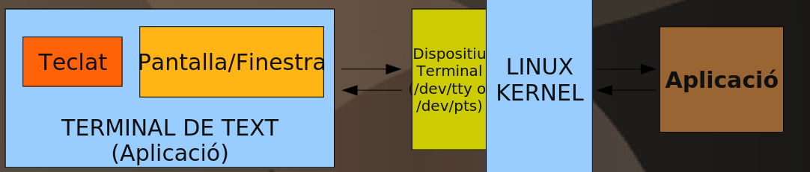
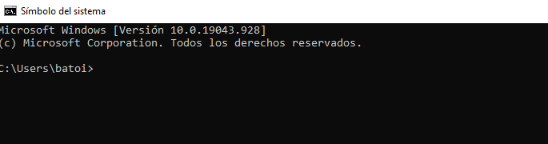
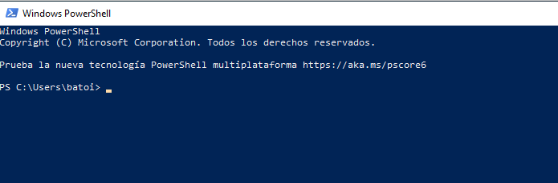
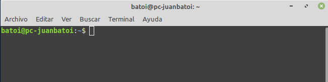
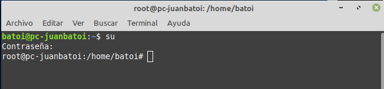

# La interfaz de texto
- [La interfaz de texto](#la-interfaz-de-texto)
  - [Introducción](#introducción)
  - [Conceptos básicos](#conceptos-básicos)
    - [La consola](#la-consola)
      - [GNU/Linux](#gnulinux)
      - [Windows](#windows)
    - [El prompt](#el-prompt)
  - [Comodines](#comodines)
  - [Rutas](#rutas)
  - [Comandos de la consola CMD](#comandos-de-la-consola-cmd)
  - [Comandos PowerShell](#comandos-powershell)
  - [Comandos de GNU/Linux](#comandos-de-gnulinux)
  - [Redireccionamiento de comandos](#redireccionamiento-de-comandos)
    - [Operadores de redireccionamiento](#operadores-de-redireccionamiento)
    - [Dispositivos](#dispositivos)
  - [Scripts](#scripts)
    - [Scripts en GNU/Linux](#scripts-en-gnulinux)

## Introducción
Una de las funciones del sistema operativo es hacer de intermediario entre el usuario y el equipo: el sistema operativo le proporciona una interfaz para comunicarse con el ordenador. Las interfaces pueden ser de dos tipos:
- **de texto**, llamada **CLI (_Command Line Interface_)**: el usuario se comunica mediante el teclado escribiendo comandos que el sistema operativo interpreta y ejecuta
- **gráfica**, llamada **GUI (_Graphic User Interface_)**: consta de ventanas, iconos y botones con los cuales el usuario interactúa. Son mucho más sencillas de usar para el usuario por lo que la mayoría de sistemas operativos proporcionan este tipo de interfaces

Los primeros sistemas operativos sólo tenían la interfaz de texto. La interfaz gráfica facilita enormemente su uso puesto que ahora no es necesario conocer multitud de órdenes, y entonces, ¿por qué usar la línea de comandos?. Las razones son varías:
- no todo se puede hacer desde el entorno gráfico, hay opciones avanzadas que sólo pueden hacerse desde la terminal
- muchas veces para hacer una acción tenemos que pasar por muchos menús y ventanas el que trae tiempo
- es difícil automatizar tareas que hacemos a a menudo (a veces puede hacerse con macros y otras es imposible)
- en algunos equipos (servidores) no nos interesa tener una _GUI_ para ahorrar recursos

## Conceptos básicos

### La consola
El funcionamiento  de la consola es el siguiente:
- el usuario escribe un comando en el **prompt** (carácter de petición de comandos de la terminal) y pulsa _Intro_
- el **shell** o _intérprete de comandos_ del sistema operativo lee el comando tecleado, comprueba si la sintaxis es correcta y lo ejecuta (normalmente se muestra el resultado por pantalla)
- cuando finaliza le pide al usuario un nuevo comando mostrándole de nuevo el _prompt_

#### GNU/Linux
En GNU/Linux tenemos la posibilidad de ejecutar dos tipos de terminales:



- **Terminal virtual** (/dev/ttY*): És la combinació conceptual de teclat+pantalla que creen una interfície d'usuari, normalment tenim 6 consoles virtuals. Per canviar entre consoles virtuals executem (Ctrl+Alt+F1 o F2 o F3...)
- **Pseudo Terminal** (/dev/pts): Aplicació que emula un video-terminal dins d'una altre arquitectura de pantalla (p. ex. X-Windows). Normalment és sinònim de línia de comandes tot i que el terme terminal inclou tots els tipus de terminals remots
  - Emuladors de terminal: xterm, Konsole, Gnome Terminal, Eterm, rxvt, mrxvt, term, aterm, Terminal (Xfce)..
incloent les interfícies gràfiques

#### Windows

En Windows tenemos 2 tipos de terminal diferente:
- **CMD** o **Símbolo del sistema**: es una implementación para Windows de la consola del sistema operativo Ms-DOS. Se abre desde el _menú Inicio_ o también ejecutando el programa `cmd.exe`.



- **Powershell**: es una herramienta tan potente como la terminal en Linux y usa el framework .NET de Microsoft, que está orientado a objetos. Permite hacer la mayoría de tareas de configuración del sistema operativo. A los comandos de Powershell se les llama _cmdlets_.



PowerShell incluye _alias_ para muchos de sus _cmdlets_ lo que permite ejecutarlos usando los comandos _CMD_ y también en muchos casos los comandos de GNU/Linux. Por ejemplo para obtener el listado de ficheros de la carpeta _C:\\_ podemos usar el _cmdlet_
```powershell
Get-ChildItem -Path C:\
```

o bien uno de sus alias
```bat
dir C:\
ls C:\
```

**Windows no diferencia** entre mayúsculas y minúsculas así que podemos usar los comandos y sus argumentos en mayúsculas o en minúsculas. **Linux sí** que lo hace y todos sus comandos están en minúsculas.

Desde la terminal está restringida la ejecución de algunos comandos de administración. Para ejecutarlos debemos hacer:
- en GNU/Linux: anteponer `sudo` al comando lo que hace que se ejecute como si lo ejecutara el usuario **root**, o bien ejecutarlos siendo el usuario **root**
- en CMD de Windows: hay que abrir la consola como **Administrador** lo que se hace buscando _CMD.EXE_ y a continuación con el botón derecho del ratón elegimos "_Abrir como Administrador_"
- en PowerShell se abre en el _menú Inicio_ el programa **Windows Powershell (Administrador)** en lugar del normal

### El prompt
El lugar donde el usuario escribe una orden en el símbolo del sistema se llama **prompt**. Es el símbolo que muestra el sistema operativo para indicar que está preparado para recibir órdenes. Además muestra información como el directorio actual o, en el caso de Linux, el nombre del usuario y del ordenador.


En Windows el prompt es el símbolo **`>`** y muestra el directorio actual: `C:\Users\batoi`, es decir, el directorio personal del usuario "batoi".



En Linux el prompt de cualquier usuario (excepto _root_) es **`$`** y la información que muestra es el usuario (_batoi_), el nombre del ordenador (_pc-juanbatoi_) y el directorio actual (**~**, que significa el directorio personal del usuario, es decir, _/home/batoi_). El símbolo **@** separa el usuario y el ordenador y el símbolo **:** separa el ordenador del directorio actual.



En Linux el prompt del usuario root es **`#`**. La información mostrada es la misma que antes, pero en este caso el directorio actual no es el directorio personal de _root_ por lo cual no pone **~**).

El **directorio actual** es el directorio en el cual nos encontramos en este instante y en el cual se ejecutará la orden. Si, por ejemplo, la orden es de crear el directorio "_prueba_" (`mkdir prueba`) ese directorio se creará en el directorio actual. En los ejemplos anteriores se crearía dentro de `/home/batoi` (en los ejemplos de Linux) y dentro de `C:\Users\batoi` (en el ejemplo de Windows).

## Comodines
Si los parámetros son nombres de ficheros podemos utilizar caracteres comodines. Los comodines son:
- **`*`** (asterisco): sustituye a cero o más caracteres
- **`?`** (interrogación): sustituye a un carácter

Vamos a ver algunos ejemplos en los que utilizaremos el comando `copy`. Se trata de un comando de Windows que permite copiar ficheros y al que se le pasan 2 parámetros: el primero el nombre del fichero a copiar y el segundo la ruta donde lo copiaremos:

```bash
copy inf*.txt C:\Users\juan\prueba
```

Esta orden copiará todos los ficheros cuyo nombre empieza por "_inf_" seguido de cualquier carácter y cuya extensión es "_.txt_", del directorio actual al directorio _C:\Users\juan\prueba_ (copiará _inf.txt_, _informe.txt_, _informacion_junio.txt_, etc pero no _informe.doc_, _mi\_informe.txt_, ...)

```bash
copy *_junio.doc C:\Users\juan\prueba
```

Copia todos los ficheros cuyo nombre acaba por "_\_junio_" y cuya extensión es "_.doc_",  del directorio actual al directorio _C:\Users\juan\prueba_ (copiará _informe\_junio.doc_, _ventas_junio.doc_, etc pero no _informe_junio_clientes.doc_, _informe_junio.txt_, ...)

```bash
copy *.* C:\Users\juan\prueba
```

Copia todos los ficheros (con cualquier nombre y extensión) del directorio actual al directorio _C:\Users\juan\prueba_

```bash
copy ma?o.jpg C:\Users\juan
```

Copia todos los ficheros cuyo nombre es "_ma_", una letra cualquiera y "_o_" y cuya extensión es "_.jpg_" del directorio actual al directorio _C:\Users\juan_ (copiará _mano.jpg_, _mazo.jpg_, etc pero no _marzo.jpg_ -2 letras- ni _mao.jpg_ -0 letras-).

## Rutas
A la hora de usar ficheros y directorios como parámetros de los comandos tenemos que tener claro lo que son las rutas y tendremos que ser capaces de usar tanto rutas _absolutas_ como _relativas_ según convenga.

Vimos las rutas al hablar de los _sistemas de archivo_ pero puedes repasarlo [aquí](./rutas.md).

## Comandos de la consola CMD
Ver la [página de comandos de Windows](ConsolaCMD.md).

## Comandos PowerShell
Ver la [página de comandos de Powershell](./PowerShell.md).

## Comandos de GNU/Linux
Ver la [página de comandos de GNU/Linux](./linux.md).

## Redireccionamiento de comandos

La comunicación de la terminal con el exterior se hace, por defecto, mediante 3 dispositivos:
- dispositivo estándar de **entrada**, que es el **teclado** (es el dispositivo por el que se introduce la información)
- dispositivo estándar de **salida**, que es el **monitor** (es por donde el sistema muestra la información al usuario)
- dispositivo estándar de **error**, que también es el **monitor** (es por donde el sistema muestra los mensajes de error al usuario)

### Operadores de redireccionamiento
Cómo hemos comentado, la entrada y salida por defecto es el teclado y el monitor, por ejemplo si ejecutamos en Windows el comando `DATE` muestra la fecha actual por el monitor y espera que introduzcamos una nueva fecha por el teclado.

Pero es posible redireccionar la entrada y la salida para que se utilice otro dispositivo, un fichero o incluso otro comando. Los operadores que lo hacen posible son:
- **`<`**: redirecciona la entrada al fichero o dispositivo indicado (poco usual)
- **`>`**: redirecciona la salida al fichero o dispositivo indicado. Si es un fichero lo creará (y si ya existe lo truncará, es decir, eliminará su contenido)
- **`>>`**: redirecciona la salida a un fichero y, si ya existe, lo añade al final
- **`2>`**: redirecciona la salida de error a un fichero o dispositivo
- **`&>`**: redirecciona tanto la salida estándar como la salida de error a un fichero o dispositivo
- **`|`**: envía la salida del comando a su izquierda como entrada del comando a su derecha. Se utiliza habitualmente con los filtros (more, find, sort).

Ejemplos:
- `dir C:\Usuarios\juan > ficheros_de_juan`: La lista de ficheros del directorio indicado la guarda en un fichero llamado _ficheros\_de\_juan_. Si el fichero existe lo truncará
- `dir C:\Usuarios\juan >> ficheros_de_juan`: La lista de ficheros del directorio indicado la añade al fichero llamado _ficheros\_de\_juan_. Si ya existe el fichero añadirá la lista al final
- `sort alumnos.txt > alumnos_ordenados.txt`: Ordena el contenido del fichero _alumnos.txt_ y envía el resultado al fichero _alumnos\_ordenados.txt_
- `dir | more`: Muestra el contenido del directorio actual pantalla a pantalla
- `find "Alcoi" alumnos.txt | sort >> alumnos_ordenado.txt`: Filtra en el fichero _alumnos.txt_ las líneas que contengan la palabra "Alcoi", envía esas líneas al comando _sort_ que las ordena y el resultado (los alumnos que son de Alcoi, ordenados) se añade al fichero _alumnos\_ordenado.txt_

En Powershell podemos utilizar igual los operadores de redirección **>**, **2>** y **|** (no _<_ que no está implementado) pero además podemos redireccionar la salida con el comando **`Out-File`** que guarda la salida en el fichero que le indiquemos. Ejemplos:
- `Get-ChildItem C:\Usuarios\juan | Out-File ficheros_de_juan`: La lista de ficheros del directorio indicado la guarda en un fichero llamado ficheros_de_juan. Si el fichero existe lo truncará
- `Get-ChildItem C:\Usuarios\juan | Out-File -Append ficheros_de_juan`: La lista de ficheros del directorio indicado la añade al fichero llamado ficheros_de_juan. Si ya existe el fichero añadirá la lista al final

Además podemos enviar la salida **a un fichero y al monitor** con el _cmdlet_ **`Tee-Object`**. Ejemplos:
- `Get-ChildItem C:\Usuarios\juan | Tee-Object ficheros_de_juan`: La lista de ficheros del directorio indicado la muestra en el monitor y además la guarda en un fichero llamado ficheros_de_juan. Si el fichero existe lo truncará
- `Get-ChildItem C:\Usuarios\juan | Tee-Object -Append ficheros_de_juan`: La lista de ficheros del directorio indicado la muestra en el monitor y además la añade al fichero llamado ficheros_de_juan. Si ya existe el fichero añadirá la lista al final

### Dispositivos
Además de enviar la salida a un fichero (que es lo más habitual) podemos enviarla a un dispositivo del equipo, aunque no es muy común.

En Windows a los dispositivos estándar de entrada y salida se los conoce como consola (o abreviado **CON**). Los dispositivos que se utilizaban en la consola tradicional CMD son:
- **CON**: consola. Es el dispositivo que se utiliza por defecto y está formado por el teclado y el monitor
- **NUL**: es un dispositivo ficticio que hace desaparecer todo el que le se envía. Por ejemplo si no queremos que los errores aparezcan en el monitor redireccionamos la salida de error al dispositivo NUL.
- Otros dispositivos: LPTn que hace referencia a los puertos paralelos del ordenador (hasta 3, LPT1, LPT2 y LPT3). Antiguamente la impresora estaba conectada al puerto LPT1 que también se denomina PRN. COMn que identifica los puertos serie y pueden haber 4 (COM1, COM2, COM3 y COM4)…

Podemos utilizar estos dispositivos en los comandos. Por ejemplo:
- `copy prueba.txt PRN`: Copia el fichero _prueba.txt_ del directorio actual al dispositivo PRN, o sea, lo envía a la impresora conectada en el primer puerto paralelo. Es otra forma de imprimir un fichero (seria equivalente al comando `PRINT prueba.txt`)
- `copy prueba.txt .. 2> NUL`: Copia el fichero _prueba.txt_ del directorio actual al directorio padre del actual y, si se produce algún error, en vez de mostrarlo por el monitor lo envía a NUL (es decir desaparece)

En GNU/Linux todos los dispositivos se tratan como ficheros y se encuentran dentro del directorio `/dev`. La comunicación del sistema con el exterior se hace, por defecto, mediante 3 dispositivos:
- **dispositivo estándar de entrada (_stdin_ o 0)**, que es el teclado. Es el dispositivo por el que se introduce la información
- **dispositivo estándar de salida (_stdout_ o 1)**, que es el monitor. Es por donde el sistema muestra la información al usuario
- **dispositivo estándar de error (_stderr_ o 2)**, que también es el monitor. Es por donde el sistema muestra los mensajes de error al usuario

También hay un dispositivo especial que es como un agujero negro donde desaparece todo el que se le envía denominado **null** (/dev/null) y que se usa a veces en los comandos. Ejemplo:
- `cp prueba.txt .. 2> /dev/null`: Copia el fichero _prueba.txt_ del directorio actual al directorio padre del actual y, si se produce algún error, en vez de mostrarlo por el monitor lo envía a _/dev/null_ (es decir desaparece)

## Scripts
En ocasiones para hacer una tarea tenemos que ejecutar una serie de comandos y a veces esa tarea tiene que ejecutarse repetidamente.

Para automatizar ese tipo de tareas se crearon los ficheros de proceso por lotes o _scripts_, que son un fichero de texto que en cada línea tiene un comando. Cuando ejecutamos un fichero de proceso por lotes lo que pasa es que se ejecuta tras otro los comandos que contiene.

En Windows este tipo de fichero tienen extensión `.bat` si contiene comandos _CMD_ o `.ps1` si son comandos _Powershell_ y se ejecutan tecleando su nombre en el prompt del sistema. En GNU/Linux su extensión es `.sh` y pueden ejecutarse poniendo su nombre y su ruta si tienen permisos de ejecución o anteponiendo al nombre el _shell_ con el que queremos que se ejecuten (`sh`, `bash`, ...). Por ejemplo para ejecutar el script '_prueba_':
- en CMD
```bat
prueba.bat
```

- en PowerShell
```powershell
prueba.ps1
```

- en Linux
```bash
./prueba.sh   # Si tiene permisos de ejecución
sh prueba.sh
bash prueba.sh
```

Vamos a ver algunos ejemplos simples de scripts CMD.

**Ejemplo 1** - Haz un fichero de proceso por lotes que limpie la ventana y a continuación muestre la hora y fecha actuales y el contenido del directorio raíz del disco C:

El fichero se llamará `info_raíz.bat` y su contenido será:
```bat
@ECHO OFF
CLS
ECHO La hora actual es
TIME /t
ECHO El día actual es
DATE /t
ECHO El contenido del directorio raíz del disco C es
DIR C:\
```

La primera línea del ejemplo es para que no se muestre en la ventana cada comando que va a ejecutarse. Para ejecutar el fichero en la línea de comandos escribiremos `info_raíz.bat`.

El mismo script para Linux sería:
```bash
#!/bin/bash
clear
echo La fecha y hora actual es
date
echo El contenido del directorio raíz es
ls /
```

La primera línea indica que se espera que se ejecute con el _shell_ **bash**.

Podemos pasarle parámetros a un fichero _BAT_ igual que hacemos con los comandos normales. Para acceder desde el fichero _.bat_ a cada parámetro utilizamos **%1** para el primer parámetro, **%2** para el segundo, etc. En un fichero _.sh_ se hace con **$1**, **$2**, etc.

**Ejemplo 2** - Haz un fichero de proceso por lotes que limpie la ventana y a continuación muestro la hora y fecha actuales y el contenido del directorio pasado como parámetro.

El fichero se llamará `info_dir.bat` y su contenido será:
```bat
@ECHO OFF
CLS
ECHO La hora actual es
TIME /t
ECHO El día actual es
DATE /t
ECHO El contenido del directorio %1 es
DIR %1
```

Para ejecutar el fichero en la línea de comandos escribiremos el nombre del fichero seguido del nombre de un directorio, por ejemplo `info_dir.bat C:\Windows`. Al ejecutarse el fichero la última línea se convertirá a `DIR C:\Windows` y se mostrará el contenido de ese directorio.

El mismo script para Linux sería:
```bash
#!/bin/bash
clear
echo La fecha y hora actual es
date
echo El contenido del directorio $1 es
ls $1
```

### Scripts en GNU/Linux
Ver la [página de scripts de GNU/Linux](./scripts-linux.md).