Comandos en GNU/**GNU/Linux**
=====================

- [Comandos en GNU/**GNU/Linux**](#comandos-en-gnugnulinux)
  - [Introducción](#introducción)
    - [Comandos de administración](#comandos-de-administración)
    - [Autocompletado](#autocompletado)
    - [Las terminales en Gnu/Linux](#las-terminales-en-gnulinux)
  - [Ayuda](#ayuda)
  - [Sintaxis](#sintaxis)
  - [Para trabajar con directorios](#para-trabajar-con-directorios)
    - [ls](#ls)
    - [cd](#cd)
    - [mkdir](#mkdir)
    - [rmdir](#rmdir)
    - [pwd](#pwd)
  - [Para trabajar con ficheros](#para-trabajar-con-ficheros)
    - [cp](#cp)
    - [mv](#mv)
    - [rm](#rm)
    - [touch](#touch)
    - [find](#find)
    - [file](#file)
    - [stat](#stat)
    - [gzip](#gzip)
    - [gunzip](#gunzip)
    - [tar](#tar)
  - [Para trabajar con el contenido de un fichero](#para-trabajar-con-el-contenido-de-un-fichero)
    - [cat](#cat)
    - [more](#more)
    - [less](#less)
    - [tail](#tail)
    - [head](#head)
    - [sort](#sort)
    - [grep](#grep)
    - [cut](#cut)
    - [tr](#tr)
    - [uniq](#uniq)
    - [diff](#diff)
    - [wc](#wc)
  - [Para gestionar permisos](#para-gestionar-permisos)
    - [chmod](#chmod)
    - [chown](#chown)
    - [chgrp](#chgrp)
  - [Para gestionar usuarios](#para-gestionar-usuarios)
    - [whoami](#whoami)
    - [groups](#groups)
    - [id](#id)
    - [who](#who)
    - [passwd](#passwd)
    - [useradd](#useradd)
    - [adduser](#adduser)
    - [userdel o deluser](#userdel-o-deluser)
    - [usermod](#usermod)
    - [groupadd o addgroup](#groupadd-o-addgroup)
    - [groupdel](#groupdel)
  - [Para gestionar la red](#para-gestionar-la-red)
    - [ping](#ping)
    - [ifconfig](#ifconfig)
    - [dhclient](#dhclient)
    - [ifup ethX](#ifup-ethx)
    - [ifdown ethX](#ifdown-ethx)
    - [nslookup](#nslookup)
    - [ip](#ip)
    - [ss](#ss)
    - [NET-TOOLS VS IPROUTE](#net-tools-vs-iproute)
  - [Para gestionar dispositivos de bloque](#para-gestionar-dispositivos-de-bloque)
    - [fsck](#fsck)
    - [mkfs](#mkfs)
    - [mount](#mount)
    - [df](#df)
    - [dd](#dd)
    - [fdisk](#fdisk)
    - [cfdisk](#cfdisk)
    - [parted](#parted)
    - [blkid](#blkid)
    - [lsblk](#lsblk)
  - [Otros comandos](#otros-comandos)
    - [ps](#ps)
    - [date](#date)
    - [clear](#clear)
    - [shutdown, poweroff, halt, reboot, logout, exit](#shutdown-poweroff-halt-reboot-logout-exit)
    - [su](#su)
    - [sudo](#sudo)
    - [uname](#uname)
    - [hostname](#hostname)
    - [ln](#ln)
  - [Redireccionamiento de comandos](#redireccionamiento-de-comandos)
    - [Dispositivos](#dispositivos)
    - [Operadores de redireccionamiento](#operadores-de-redireccionamiento)
  - [Shell Scripts](#shell-scripts)

## Introducción

La línea de comandos de Linux es una herramienta muy potente que nos permite realizar cualquier acción en el sistema. En Linux el entorno gráfico es una opción y, de hecho, podemos instalar el sistema operativo sin entorno gráfico con todas sus funcionalidades (se hace en servidores para optimizar los recursos).

Aunque podemos hacer cualquier cosa necesitamos los permisos necesarios para hacerlo. Por eso hay muchos comandos que sólo los puede ejecutar el administrador **root**. Cómo vimos anteriormente el prompt de cualquier usuario normal acaba en el carácter **\$** y el de _root_ en **\#**.

Cuando el usuario **root** ejecuta un comando el sistema operativo considera que sabe qué está haciendo y no nos pedirá confirmaciones, simplemente lo hace. Por eso tenemos que tener mucho cuidado cuando seamos _root_ en un sistema Linux. La recomendación es que siempre trabajamos como un usuario normal y sólo cuando tengamos que ejecutar un comando que necesita permisos de administrador nos convirtamos en *root*.

### Comandos de administración
Como hemos dicho, algunos comandos sólo puede ejecutarlos _root_. El comando para cambiar de usuario es `su` y se le pasa como parámetro el usuario al que queremos cambiar. Si no le pasamos ningún parámetro se supone que queremos ser _root_. Ejemplo:
```bash
su jmonllor
```

pasamos a ser el usuario jmonllor (después de escribir su contraseña)

```bash
su
```

pasamos a ser el usuario **root** (si escribimos la contraseña de **root**). Es lo mismo que `su root`.

**IMPORTANTE**: si nos convertimos en otro usuario no se cambian algunas de las variables de entorno (prueba a hacer `echo $USER`), lo que puede ser un problema. Para hacer que se cambien deberíamos siempre ejecutar este comando con el parámetro **`-`**:
```bash
su -
su jmonllor -
```

También es posible ejecutar un comando que necesita permisos de _root_ desde nuestro usuario anteponiéndole el comando `sudo`. Para hacer esto nuestro usuario tiene que pertenecer al grupo de usuarios administradores (**sudo**).

En el caso de Ubuntu esta es la manera de trabajar por defecto: el usuario con que instalamos el sistema pertenece al grupo **sudo**. De hecho durante el proceso de instalación no se nos pide la contraseña de root por lo cual no podemos acceder como **root** (podemos hacerlo con el comando **sudo su**). 

En el caso de **Debian** el usuario que se crea durante la instalación es un usuario normal (no puede hacer `sudo`) pero se nos pide la contraseña de _root_ para poder acceder como *root* cuando queramos.

### Autocompletado

En Linux no hay que escribir el comando entero sino que podemos utilizar la función de **autocompletar**: por ejemplo si queremos reiniciar el ordenador en cuenta de escribir el comando `reboot` entero podemos escribir `reb` y pulsar el _tabulador_ para que aparezca el resto del comando. Si hay varios comandos que empiezan por los caracteres que hemos escrito aparece una lista de todos ellos al pulsar el tabulador _dos_ veces (por ejemplo si en vez de escribir `reb` escribimos sólo `re` al pulsar el tabulador no pasa nada pero al volver a pulsarlo aparecen todos los comandos que empiezan por _re_, incluyendo `reboot`).

La función de autocompletar también funciona para los nombres de ficheros y directorios y es conveniente utilizarla por comodidad pero también porque así evitamos equivocarnos a la hora de escribir.

También utilizaremos a a menudo la utilidad de Linux de guardar los comandos que ya hemos escrito de forma que podemos volver a escribirlos sólo pulsando las flechas de cursor arriba y bajo. Podemos ver la lista de comandos almacenada con el comando **`history`**.

### Las terminales en Gnu/Linux
Linux por defecto arranca 7 terminales para trabajar, 6 de texto y una terminal gráfica. Podemos cambiar de unos a otros con **Ctrl+Alt+Fn** donde _n_ es el número de terminal al que queremos ir. La terminal gráfica es la 7 y las de texto son las terminales de la 1 a la 6. Por lo tanto para trabajar con la primera terminal de texto pulsamos **Ctrl+Alt+F1** y para volver a la terminal gráfica **Ctrl+Alt+F7** (normalmente, aunque puede ser la 8 u otra según la distribución).

Cada terminal tiene un nombre que es **ttyN**, donde N es el número de terminal (es decir tty1, tty2, ..., tty7).

Además dentro de la terminal gráfica podemos abrir tantas pseudoterminales cómo queramos, cada una en su ventana. El nombre de
estas terminales es **pts/N**.

**Ejemplo** - Abre desde el entorno gráfico un par de terminales y además accede con el usuario **root** desde la primera terminal de texto. Ahora desde cualquier terminal de las que tienes abiertas teclea la orden **who** que muestra los usuarios logueados en este momento. Aparecerá algo pareciendo a:

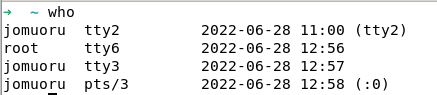

En GNU/Linux podemos elegir el **shell** o interprete de comandos que queremos utilizar, es decir, el programa encargado de interpretar y ejecutar el comando que tecleamos en la terminal. El más utilizado es el **bash** (se encuentra en `/bin/bash`) pero podemos utilizar otros como el **sh**, **ksh**, etc.. En el fichero de usuarios del sistema (**`/etc/passwd`**) entre otras informaciones de cada usuario se almacena cuál es su shell.

## Ayuda
En Linux podemos obtener ayuda de un comando de diferentes maneras. La más completa y utilizada es utilizando el comando **man** seguido del nombre del comando que queremos. Por ejemplo:

```bash
man cp
```

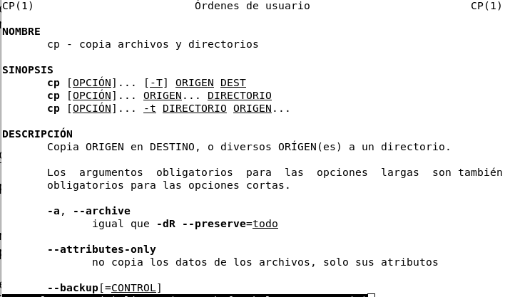

Esto nos muestra la página del manual en lo referente al comando indicado. Para salir del manual pulsamos la tecla **q** (_quit_ = salir).

También podemos obtener ayuda de algunos comandos con **`help`** y el nombre del comando (ejemplo `help cd`) y otros con el nombre del comando con la opción _--help_ (ejemplo `cp --help`).

## Sintaxis
La sintaxis general de cualquier comando es:

```bash 
comando [ -o | --opción ] [argumentos]
```

En primer lugar escribimos el nombre del comando y a continuación las opciones que queremos (o ninguna) y después los argumentos que le pasamos. Para escribir cada opción normalmente podemos elegir entre la forma normal (ejemplo **`--all`**) o la reducida (ejemplo **`-a`**). Fijaos que la forma reducida sólo es una letra y está precedida de un signo menos (-) mientras que la forma normal es una palabra y siempre está precedida de dos signos menos (**`--`**).

Respecto a los argumentos, algunos comandos no tienen, otros tienen argumentos opcionales y otros obligatorios. Tendremos que escribir la sintaxis correcta de cada comando para que se ejecuto (recordáis que podemos obtener ayuda con **`man`**).

## Para trabajar con directorios

### ls

Lista el contenido del directorio pasado como parámetro. Si no le
pasamos ningún parámetro muestra el contenido del directorio actual.
Principales opciones:

- **-l** muestra toda la información de cada fichero y directorio
- **-h** muestra la medida de los ficheros en formato “humano” (en KB, MB, etc en vez de en bytes)
- **-a** muestra también los ficheros y directorios ocultos
- **-R** recursivo. Muestra también el contenido de cada subdirectorio

Ejemplos:

- **`ls`** - Muestra el contenido del directorio actual ls -l /home/juan - Muestra con detalles el contenido del directorio /home/juan\
- **`ls -la ..`** - Muestra el contenido del directorio padre del actual con detalles e incluyendo los ficheros y directorios ocultos (fijaos que -la equivale a -l -a)

### cd

Cambia el directorio actual por el que le pasamos como parámetro.
Ejemplos:


- **`cd /hombre/juan/Desktop/pruebas`** - Cambia al directorio indicado

- **`cd ..`** - Cambia al directorio padre del actual

- **`cd ~`** - Cambia al directorio de inicio del usuario (~ en Gnu/**GNU/Linux** hace referencia a ese directorio)

### mkdir

Crea un nuevo directorio que le pasamos como parámetro. Ejemplos:

- **mkdir clientes** - Crea un directorio llamado clientes dentro del directorio actual

- **mkdir ../clientes** - Crea un directorio llamado clientes en el directorio paro del actual

- **mkdir /home/juan/clientes** - Crea el directorio clientes en /home/juan

### rmdir

Elimina el directorio que le pasamos como parámetro, que tiene que estar vacío. Ejemplos:

- **rmdir clientes** - Elimina el directorio clientes que hay dentro del directorio actual

- **rmdir /home/juan/clientes** - Elimina el directorio clientes de la ubicación indicada

### pwd

Muestra la ruta absoluta del directorio actual.

- **pwd**

## Para trabajar con ficheros

### cp

Copia el fichero o ficheros especificados como primer parámetro en el directorio especificado como segundo parámetro. Ejemplos:

- **cp leeme.txt ..** - Copia el fichero leeme.txt del directorio actual a su directorio padre

- **cp /home/juan/* /media/KINGSTON** - Copia todos los ficheros que del directorio /hombre/juan al directorio indicado (seguramente un disco USB)

El comando **cp** ***NO*** copia directorios a menos que utilizamos la opción -R (recursivo). Ejemplo:

**cp -R /home/juan/* /media/KINGSTON** - Copia todos los ficheros y subdirectorios del directorio /hombre/juan al directorio indicado

### mv

Funciona como el comando cp pero en cuenta de hacer una copia mueve los ficheros de ubicación. Después de hacer un cp tendremos el fichero 2 veces: donde estaba y donde lo hemos copiado. Si hacemos un mv se borra de donde estaba y se sitúa donde lo copiamos.

También mueve directorios y su contenido.

Este comando también se utiliza para cambiar el nombre de un fichero o directorio. Ejemplos:

- **`mv leeme.txt ..`** - Mueve el fichero leeme.txt del directorio actual a su directorio padre
- **`mv /home/juan/* /media/KINGSTON`** - Mueve todos los ficheros y subdirectorios del directorio /hombre/juan al directorio indicado.
- **`mv leeme.txt readme.txt`** - Cambia el nombre del fichero leeme.txt del directorio actual por readme.txt

### rm

Elimina el fichero o ficheros pasados como parámetro. Ejemplos:

- **rm leeme.txt** - Borra el fichero leeme.txt del directorio actual
- **rm /home/juan/*.odt** - Borra todos los ficheros con extensión odt del directorio indicado

Con la opción -R elimina directorios con todo su contenido:

- rm **-R /home/juan/pruebas** - Borra el directorio indicado (pruebas) con todos los ficheros y directorios que contenga

### touch

Crea un nuevo fichero vacío si no existe con el nombre que le pasamos como parámetro o actualiza la fecha de acceso.

- **touch pepe.txt**
- **touch -t 203801181205. pep.txt** 

### find

Busca ficheros en la ruta pasada como primer parámetro que cumplan las condiciones pasadas como segundo parámetro. Principales opciones:

- **-name** busca los ficheros con ese nombre
- **-perm** busca los ficheros con esos permisos
- **-user** busca los ficheros que pertenecen a ese usuario
- **-group** busca los ficheros que pertenecen a ese grupo
- **-size** busca los ficheros de más (o menos) de esa medida

Ejemplos:

- **find . -name “*.odt”** - Busca en el directorio actual (y sus subdirectorios) todos los ficheros con extensión odt
- **find / -perm 770** - Busca desde el directorio raíz todos los ficheros con permisos 770
- **find / -user batoi** - Busca desde el directorio raíz todos los ficheros del usuario batoi
- **find /var -size +1000000c** - Busca en /var y subdirectorios todos los ficheros de medida superior a 1.000.000 bytes

### file

Indica el tipo del fichero pasado como parámetro.

### stat

Muestra las características del fichero que le pasamos como parámetro: nombre, permisos, medida, fecha, propietario, i-nodo, etc.

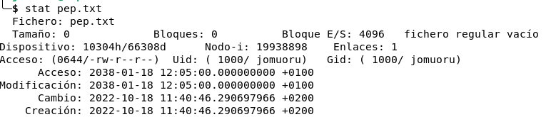

### gzip

Comprime el fichero que le pasamos como parámetro. El fichero comprimido tendrá el mismo nombre y extensión gz.

### gunzip

Descomprime el fichero que le pasamos como parámetro (normalmente con extensión gz).

### tar

Agrupa o desagrupa los ficheros pasados como parámetro. También tiene una opción para comprimir el fichero agrupado. Puede utilizarse para hacer copias de seguridad. Principales opciones:

- **-c** crea un fichero agrupado
- **-x** extrae los ficheros de un fichero agrupado (es el contrario de -c)
- **-t** no extrae el contenido de un fichero agrupado sino que sólo muestra los ficheros que contiene
- **-f** agrupa o desagrupa a un fichero en vez de a la salida estándar (lo usaremos siempre)
- **-v** verbose, para ver todos los mensajes
- **-z** comprime el resultado con gzip

tar permite no poner el guion (-) ante las opciones. Ejemplos:

- **tar -zcvf /home/juan/etc.tar.gz /etc** - Crea en /home/juan el fichero etc.tar.gz con todo el contenido del directorio /etc comprimido
- **tar -zxf etc.tar.gz** - Extrae donde estamos todo el contenido del fichero agrupado y comprimido etc.tar.gz

## Para trabajar con el contenido de un fichero

### cat

Muestra por pantalla el contenido del fichero o ficheros pasados como parámetro.

### more

Igual que el anterior pero si el contenido del fichero ocupa más de una pantalla lo muestra pantalla a pantalla, esperando a que el usuario pulse una tecla para mostrar la siguiente pantalla.

- **`more pepe.txt`**
- **`ls -l | more`**

### less

Igual que more pero permite también volver atrás en el fichero.

- **`less pepe.txt`**
- **`ls -l | less`**

### tail

Muestra por pantalla las últimas líneas del fichero pasado como parámetro, por defecto 10. La opción -f va mostrando las últimas líneas según va creciendo el fichero (se utiliza para ver como cambian ficheros de log). Ejemplo:

- **`tail -f /var/logs/squid/acces.log`** - Va mostrando por pantalla las ultimas líneas del fichero acces.log donde se guardan las páginas de Internet visitadas por los alumnos
- **`ls -l | tail -n+2`** Muestro a partir de la 2ª línea. 

### head

Muestra por pantalla las primeras líneas del fichero pasado como parámetro, por defecto 10.

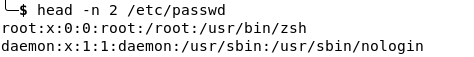

### sort

Ordena las líneas contenidas en un fichero de texto. Si no cambiamos las opciones la ordenación la hace por el primer carácter de cada línea.

Opciones:

- **-r** Ordena de forma inversa
- **-f** No diferencia mayúsculas y minúsculas
- **-kn** Donde *n* es la clave a ordenar   

Ejemplos:

- **sort alumnos.txt** - Muestra el contenido del fichero alumnos.txt ordenado
- **sort -r alumnos.txt** - Muestra el contenido del fichero en orden inverso

### grep

Busca el texto pasado como primer parámetro en el fichero pasado como segundo parámetro y muestra por pantalla las líneas que lo contengan.

Opciones:

- **-e** ignora las diferencias entre mayúsculas y minúsculas
- **-v** muestra las líneas que NO contengan el texto pasado
- **-c** vuelve sólo el número de líneas que contienen el texto

Ejemplo:

- **`grep ”juan” alumnos.txt`** - Muestra las líneas del fichero alumnos.txt que contengan el texto juan, es decir, todos los alumnos que se denominan juan

### cut

Muestra sólo los caracteres o campos indicados de cada línea de un fichero de texto. Opciones:

- **-c** muestra los caracteres indicados. Se utiliza en fichero organizados en campos de ancho fijo
- **-f** muestra sólo el campo indicado. Se utiliza juntamente al siguiente el ficheros con campos separados por un carácter delimitador que indica donde acaba cada campo
- **-d** permite indicar cuál es el carácter delimitador de campo

Este comando permite filtrar campos en 2 tipos de ficheros de texto:

- ficheros de ancho fijo en que cada campo comienza y acaba en una determinada posición. Se usa la opción **-c** indicando dónde empieza y acaba el campo.
- ficheros con campos delimitados por un carácter que determina dónde acaba cada campo. Se usan las opciones **-f** para indicar qué campo queremos y **-d** para indicar qué carácter es el delimitador

Ejemplos:

- **`cut -c 4-12 alumnos.txt`** - Muestra los caracteres del 4 al 12 de cada línea del fichero alumnos.txt (que será un fichero con campos de ancho fijo y entre los caracteres 4 y 12 tendremos por ejemplo el nombre del
alumno)
- **`cut -f 6 -d ”:” /etc/passwd`** - Muestra el sexto campo del fichero passwd que contiene la lista de usuarios del sistema. En este fichero el sexto campo es la carpeta personal del usuario y el carácter que delimita
cuando acaba un campo es **:**

A todos estos comandos (cat, grep, cut, sort, tail, ...) se los denomina filtros porque reciben unos datos de entrada, los filtran o modifican y devuelven una salida que es esos datos modificados.

### tr
tr es más que una abreviación de translate. Las principales utilidades de tr son las siguientes, cambiar caracteres, palabras y frases de mayúscula a minúscula o viceversa, buscar palabras y reemplazarlas por otras, borrar caracteres, palabras o frases, eliminar caracteres repetidos de forma innecesaria, cambiar letras o palabras de mayúscula a minúscula.

- **`echo "Esto es una ejemplo" | tr 'a' 'A'`**: Cambiamos la a por A.
- **`echo "Esto es una ejemplo" | tr '[:lower:]' '[:upper:]'`**: Cambiamos minúsculas por mayúsculas. 
- **`echo "Esto es una ejemplo" | tr 'aeiou' ' ''`**: Cambiamos las vocales por espacios en blanco.
- **`echo "eesto ees una eejemplo" | tr -s 'e'`**: Borrar caracteres iguales que hemos escrito de forma consecutiva. 

### uniq

Herramienta de línea de comando que se utiliza para informar u omitir cadenas o líneas repetidas.

- **`uniq -d fitx.txt`** imprime solo duplicados
- **`uniq -i fitx.txt`** ignora mayúsculas y minúsculas al comparar
- **`sort fitx.txt | uniq -c`**: Primero ordenamos el archivo y luego podemos encontrar duplicados.


### diff

Compara el contenido de los ficheros pasado como parámetro y muestra por pantalla las líneas que tengan alguna diferencia. 

Ejemplo:

- **`diff fichero1.txt fichero2.txt`** - Muestra por pantalla las líneas que sean diferentes entre los ficheros fichero1.txt y fichero2.txt del directorio actual

### wc

Muestra el número de líneas, palabras y letras del fichero pasado como parámetro.

- **`wc -l /etc/passwd`**
- **`cat /etc/passwd | wc -l`**

## Para gestionar permisos

### chmod

Cambia los permisos de los ficheros o directorios pasados por parámetro. Funciona de dos formas:

Permite añadir (+), eliminar (-) o asignar (=) permisos de lectura (r), escritura (w) o ejecución (x) para el propietario (uno , el grupo (g), el resto de usuarios (o) o todos a la vez (a)

Ejemplos:

- **`chmod g-w alumnos.txt`** - Elimina el permiso de escritura sobre el fichero alumnos.txt a los usuarios del grupo al que pertenece el fichero

- **`chmod a+x alumnos.txt`** - Añade permisos de ejecución sobre el fichero a todos los usuarios

- **`chmod ugo=rw alumnos.txt`** - Establece permisos de lectura y ejecución sobre el fichero y quita el de ejecución (si lo tenía)

También permite establecer directamente qué permisos tendrá, en notación octal:

- **1** permisos de ejecución (--x = 001 = 1)
- **2** permisos de escritura (-w- = 010 = 2)
- **4** permisos de lectura (r-- = 100 = 6)

Por lo tanto, lectura y escritura será 4+2=6 (puesto que rw- = 110 = 6), lectura y ejecución 5 (4+1) y todos los permisos será 7 (4+2+1). De este modo para establecer los permisos indicamos un número octal para el usuario, otro para el grupo y otro para el resto de usuarios. Ejemplos:

- **`chmod 664 alumnos.txt`** - Los permisos sobre el fichero alumnos.txt serán de lectura y escritura (6) para el propietario, lectura y escritura (6) para los miembros del grupo propietario y de lectura (4) para el resto de usuarios 

- **`chmod 750 ventas`** - Mujer todos los permisos (lectura, escritura y ejecución -en el caso de un directorio, entrar dentro-) al propietario, permisos de lectura y ejecución/entrar al grupo y ningún permiso al resto sobre el fichero o directorio ventas

Este comando permite la opción -R para ejecutarse recursivamente sobre el contenido de un directorio. Ejemplo:

- **`chmod -R 750 ventas`** - Mujer todos los permisos (lectura, escritura y entrar dentro) al propietario, permisos de lectura y entrar dentro al grupo y ningún permiso al resto sobre el directorio ventas y todos los ficheros y directorios contenidos dentro de ventas

### chown

Permite cambiar el propietario y el grupo propietario de los ficheros o directorios pasados por parámetro. Ejemplos:

- **`chown amiro alumnos.txt`** - El fichero alumnos.txt pasa a pertenecer al usuario amiro

- **`chown amiro:ventas alumnos.txt`** - El fichero alumnos.txt pasa a pertenecer al usuario amiro y al grupo ventas

Igual que el anterior permite el uso de la opción -R para funcionar recursivamente.

### chgrp

Permite cambiar el grupo propietario de los ficheros o directorios pasados por parámetro.

## Para gestionar usuarios

### whoami

Muestra el nombre del usuario en que estoy logueado

### groups

Muestra el nombre de los grupos a que pertenece el usuario que le pasamos como parámetro (o el usuario actual si no se le pasa ningún parámetro)

### id

Muestra el id y el nombre del usuario, el gid y el nombre de su grupo principal y los gids y nombre de todos los grupos a que pertenece

### who

Muestra los usuarios conectados al sistema ahora.


### passwd

Permite especificar una nueva contraseña para el usuario pasado como parámetro (o para el usuario actual si no pasamos ningún usuario).

También permite bloquear (con el parámetro **-l**) o desbloquear (con **-u**) una cuenta de usuario. Entre otras opciones.

### useradd

Crea el usuario que le pasamos por parámetro, pero no la activa porque no crea su contraseña (tenemos que hacerlo después con passwd). Principales opciones:

- **-d** directorio para indicar qué directorio será su hombre (si no ponemos este parámetro su hombre será el normal, /hombre/usuario)
- **-m** para crear ese directorio si no existe
- **-g** grupo para indicar cuál será su grupo principal
- **-G** grupos para indicar el resto de grupos a que pertenece

Ejemplos:

**`useradd -m -d /hombre/alumnos/amiro -g empleados -G alcoi,ventas amiro`** - Crea el usuario amiro y crea también su carpeta personal que será /hombre/alumnos/amiro. Su grupo principal es empleados y pertenece también a los grupos alcoi y ventas

### adduser

También crea la usuario que le pasamos por parámetro pero nos pide también su contraseña y activa el usuario creado. Se crea el usuario, un grupo que se denomina como él y que será su grupo principal, la carpeta personal del usuario (en /hombre/usuario) y su contraseña. Ejemplo:

**`adduser amiro`** - Crea el usuario amiro después de preguntar su contraseña y le suyos datos (nombre, dirección, teléfono, etc)

También permite añadir un usuario a un grupo (tienen que existir los dos). Ejemplo:

**`adduser amiro produccio`** - Añade el usuario amiro (ya creado) al grupo produccion (también tiene que estar creado ya)

### userdel o deluser

Borra el usuario pasado por parámetro. Por defecto no elimina su directorio personal. Para hacerlo tenemos que possar el parámetro -r

### usermod

Modifica el usuario pasado por parámetro. Tiene las mismas opciones que useradd.

Ejemplos:

- **`usermod -G jefes amiro`** - Modifica el usuario amiro haciéndole pertenecer al grupo jefes, pero dejaría de pertenecer a los grupos a los cuales pertenecía antes.

Si queremos que pertenezca además de a el grupo cabes a los grupos alcoi y ventas a los que pertenecía antes grupos tendríamos que hacer:

- **`usermod -G jefes,alcoi,ventas amiro`** - hace que el usuario pertenezca a los 3 grupos
- **`usermod -a -G jefes amiro`** - añade (-a) el usuario al grupo jefes sin quitarlo de alcoi y ventas

### groupadd o addgroup

Crea el grupo pasado por parámetro

### groupdel

Borra el grupo pasado por parámetro.

## Para gestionar la red

### ping

Envía señales de ping al host indicado

### ifconfig

Muestra la configuración de la red y permite cambiarla

### dhclient

Vuelve a pedir IP a un servidor DHCP

### ifup ethX

Activa la interfaz de red indicada (eth0, eth1, wlan0, etc)

### ifdown ethX

Desactiva la interfaz de red indicada

### nslookup

Resuelve el nombre de dominio indicado, mostrando qué es su IP

### ip 

- **`ip addr`:** Show information for all addresses
- **`ip link`**: Show information for all interfaces
- **`ip route`**: List all of the route entries
- **`ip addr add 192.168.1.1/24 dev em1`**: Add address 192.168.1.1 with netmask 24 to device em1
- **`ip addr del 192.168.1.1/24 dev em1`**: Remove address 192.168.1.1/24 from device em1
- **`ip route add default via 192.168.1.1 dev em1`**: Add a default route (for all addresses) via the local gateway 192.168.1.1 that can be reached on device em1
- **`ip route delete 192.168.1.0/24 via 192.168.1.1`**: Delete the route for 192.168.1.0/24 via the gateway at
192.168.1.1

### ss 

Display socket statistics.

- **`ss -a`**: Show all sockets (listening and non-listening)
- **`ss -e`**: Show detailed socket information
- **`ss -o`**: Show timer information
- **`ss -n`**: Do not resolve addresses

### NET-TOOLS VS IPROUTE 

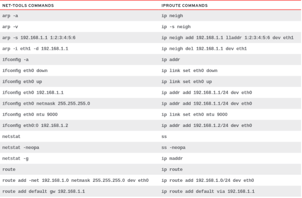

## Para gestionar dispositivos de bloque

### fsck

Permite comprobar un sistema de archivos (hay versiones para los diferentes FS) Ejemplo: 

- **`fsck.ext4 /dev/sda1`**

### mkfs

Formatea una partición con sistema de archivos ext, FAT, NTFS, etc. 

- **`mkfs.ext4 /dev/sda1`**
- **`mkfs -t ext4 /dev/sda2`**

### mount

Monta una partición en una carpeta para poderla utilizar. Hay que indicar el dispositivo que queremos montar y en qué directorio se montará (el directorio debe existir). Ejemplo: 

- **`mount /dev/sda1 /mnt`** - Monta partición en directorio /mnt
- **`mount`** - Muestra particiones, etc montadas en el sistema

La partición permanecerá montada hasta que la desmontemos con **umount** o hasta que reiniciemos la máquina. Si queremos que una partición se monte automáticamente cada vez que iniciamos el equipo hay que añadir una línea con sus opciones al fichero **/etc/fstab**.

Sin parámetros muestra todas las unidades montadas y sus opciones de montaje.

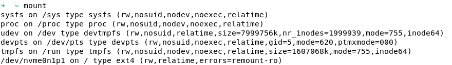

### df

Muestra un resumen de todas las particiones montadas en el sistema y el espacio usado y libre de cada una:


### dd

Permite copiar directamente bloques a o desde un dispositivo, como el disco duro. Ejemplo: 

- **`dd if=/dev/sda of=copia_mbr count=1 bs=512`**

Este ejemplo copia 1 bloque (count=1) de 512 bytes (bs=512) del disco duro (/dev/sda) a un fichero llamado copia_mbr. Este primer bloque del disco duro es el MBR por lo que estamos haciendo una copia del MBR en un fichero.

### fdisk

Se trata de un programa en modo texto que permite gestionar las particiones del disco pasado como parámetro.

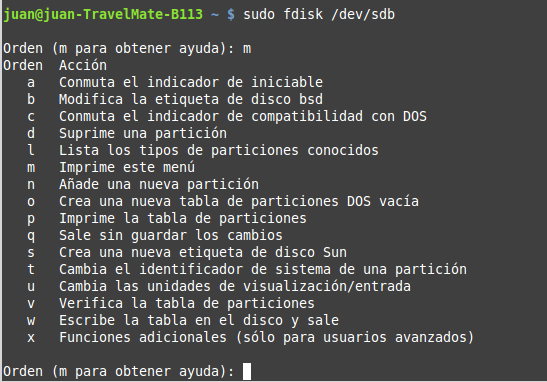

Con la opción **-l** muestra todos los discos del sistema con sus particiones:

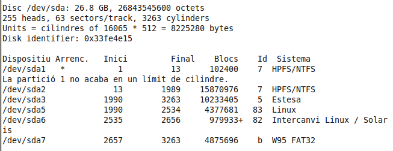

### cfdisk

Igual que el anterior pero con una interface visual (en modo texto) que nos facilita el trabajo.

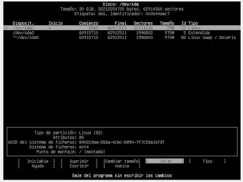

### parted

Se trata de una utilidad similar a fdisk pero que permite gestionar también discos con tipo de partición GPT.

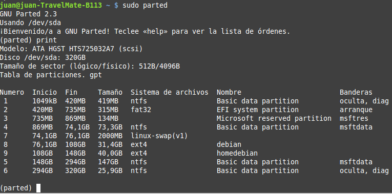

### blkid

Enumerará todos los dispositivos disponibles con su Identificador único universal (UUID), el TIPO del sistema de archivos y la ETIQUETA, si está configurada.

Algunas opciones:

- **`blkid -po udev /dev/sda1`**
- **`blkid -U a3e1edd2-e3b0-45b0-b703-e6e0e360a524`**
  
### lsblk

El comando lsblk nos muestra información de todos los dispositivos de bloque (discos duros, SSD, memorias flash, CD-ROM…).

Algunas opciones:

 - **-o NAME,MODEL,SERIAL,FSTYPE,MOUNTPOINT** nos muestra el nombre, modelo, número de serie, punto de montaje y tipo de sistema de archivos
 - **-m** Nos muestra información sobre los permisos
 - **-f** Nos muestra información sobre el sistema de ficheros y equivale a **-o NAME,FSTYPE,LABEL,UUID,FSAVAIL,FSUSE%,MOUNTPOINT**

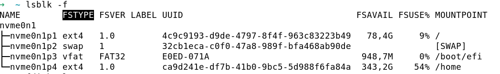

## Otros comandos

### ps
Muestra información sobre los procesos del sistema.

- **`ps -aux`**: Muestra todos los procesos del sistema, mostrando UID y otras características de cada proceso. 
- **`ps -A`**: Muestra todos los procesos del sistema.
- **`ps -u USUARIO`**: Muestra los procesos de USUARIO.


### date

Muestra la fecha y hora actuales del ordenador

### clear

Borra la pantalla.

### shutdown, poweroff, halt, reboot, logout, exit

Permiten apagar el ordenador (shutdown -h, poweroff y halt), reiniciarlo (shutdown -r, reboot) o cerrar la sesión actual (exit, logout). Ejemplo:

- **`poweroff`**: Apaga ahora el equipo
- **`shutdown -h now`**: Apaga (-h) ahora el equipo
- **`shutdown -r 10:15 “El servidor va a reiniciarse”`**: Reinicia (-r) el equipo a las 10:15 y muestra antes el mensaje

### su

Permite cambiar al usuario indicado como parámetro o a root si no indicamos ninguno.

- **`su -`**
- **`su`**

### sudo

Permite ejecutar el comando pasado como parámetro con permisos de root. Sólo pueden usarlo los usuarios con permisos de administración (sudoers)

- **`sudo apt install apache2`**

### uname

Muestra información del sistema operativo y del ordenador. Opciones:

- **-s** muestra el nombre del kernel (**GNU/Linux**)
- **-r** muestra la versión del kernel
- **-n** muestra el nombre del equipo
- **-a** muestra toda la información

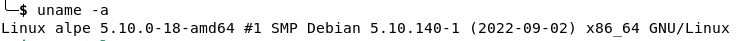

### hostname

Muestra el nombre del equipo y si le pasamos un nuevo nombre cambia el nombre del equipo (pero sólo por esta sesión, para cambiarlo para siempre tenemos que hacerlo en el fichero **/etc/hostname**)

### ln

Crea un nuevo enlace a un fichero. Un enlace es como darle otro nombre al fichero (que ahora tendrá dos nombres diferentes pero existe sólo un fichero). Opciones:

**-s** lo que crea es un nuevo enlace simbólico, que es como un acceso directo.

## Redireccionamiento de comandos

### Dispositivos

En **GNU/Linux** los dispositivos se tratan como ficheros. Cada dispositivo tiene un fichero asociado dentro del directorio /dev. Los más comunes son:

- **unidades de almacenamiento**: los discos duros, unidades USB, etc se identifican como sdX. El primer disco llevar es /dev/sda y su primera partición es /dev/sda1. En caso de disco duros IDE en cuenta de sdX se identifican como hdX.
- **terminales**: se identifican cono ttyX. La terminal gráfica es la 7, es decir, /dev/tty7

La comunicación del sistema con el exterior se hace, por defecto, mediante 3 dispositivos:

- **dispositivo estándar de entrada (stdin o 0)**, que es el teclado. Es el dispositivo por el que se introduce la información. En /dev hay un enlace simbólico para este dispositivo llamado **stdin**
- **dispositivo estándar de salida (stdout o 1)**, que es el monitor. Es por donde el sistema muestra la información al usuario. En /dev hay un enlace simbólico para este dispositivo llamado **stdout**
- **dispositivo estándar de error (stderr o 2)**, que también es el monitor. Es por donde el sistema muestra los mensajes de error al usuario. En /dev hay un enlace simbólico para este dispositivo llamado **stderr**

También hay un dispositivo especial que es como un agujero negro donde desaparece todo el que se le envía denominado **null** (/dev/null)

### Operadores de redireccionamiento

El redireccionamento en GNU/**GNU/Linux** es exactamente igual que en Windows. Cómo hemos comentado la entrada y salida por defecto son el teclado y el monitor respectivamente.

Pero es posible redireccionar la entrada y la salida para que se utilizo otro dispositivo, un fichero o, incluso, otro comando. Los operadores que lo hacen posible son:

- **\<**: redirecciona la entrada al fichero o dispositivo indicado
- **\>**: redirecciona la salida al fichero o dispositivo indicado. Si se un fichero lo creará (y si ya existe lo truncará, es decir, eliminará su contenido)
- **\>\>**: redirecciona la salida a un fichero y, si ya existe, lo añade al final
- **2\>**: redirecciona la salida de error a un fichero o dispositivo
- **|**: redirecciona la salida del comando a su izquierda a la entrada del comando a su derecha. Se utiliza habitualmente con los filtros (more, find y suerte).

Ejemplos:

- **`ls /home/juan > ficheros_de_juan`** - La lista de ficheros del directorio indicado la guarda en un fichero llamado ficheros_de_juan. Si el fichero existe lo truncará.
- **`ls /home/juan >> ficheros_de_juan`** - La lista de ficheros del directorio indicado la añade al fichero llamado ficheros_de_juan. Si ya existe el fichero añadirá la lista al final
- **`sort alumnas.txt > alumnos_ordenado.txt`** - Copia el contenido del fichero alumnos.txt ordenado al fichero alumnos_ordenado.txt
- **`ls -l | more`** - Muestra el contenido del directorio actual con detalles pantalla a pantalla 
- **`grep “Alcoi” alumnos.txt | sort >> alumnos_ordenado.txt`** - Filtra en el fichero alumnos.txt las líneas que contengan la palabra Alcoi, envía esas líneas al comando sort que las ordena y el resultado (los alumnos que son de Alcoi, ordenados) se añade al fichero alumnos_ordenado.txt
- **`touch /root/prueba 2> errores.txt`** - Crea dentro del directorio root un fichero vacío denominado prueba. Si hay un error en vez de mostrarlo por pantalla lo escribirá en el fichero errores.txt

## Shell Scripts

En ocasiones para hacer una tarea se tienen que ejecutar una serie de comandos y a veces esa tarea tiene que ejecutarse día detrás día.

Para automatizar ese tipo de tareas se crearon los scripts, que son un fichero de texto que en cada línea tiene un comando (son iguales que los ficheros de proceso por lotes en Windows). Habitualmente tienen extensión **.sh**. Cuando ejecutamos un script el que pasa es que se ejecuta un por uno los comandos que contiene.

Para ejecutar un script tenemos dos formas:

- Escribir el nombre del shell a utilizar seguido del nombre del script (ejemplo: **bash haz_backup.sh**)
- Dar permisos de ejecución al fichero. En ese caso se puede ejecutar directamente escribiendo su nombre (precedido de la ruta si no se encuentra en el PATH, por ejemplo: **./haz_backup.sh**)


Obra publicada con [Licencia Creative Commons Reconocimiento No comercial Compartir igual 4.0](<http://creativecommons.org> licenses/by-nc-sa/4.0/)