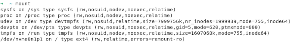
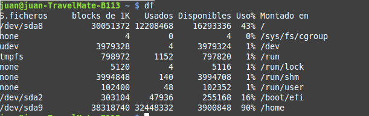

# Comandos en GNU/Linux

- [Comandos en GNU/Linux](#comandos-en-gnulinux)
  - [Introducción](#introducción)
    - [Comandos de administración](#comandos-de-administración)
    - [Autocompletado](#autocompletado)
    - [Las terminales en Gnu/Linux](#las-terminales-en-gnulinux)
  - [Ayuda](#ayuda)
  - [Sintaxis](#sintaxis)
  - [Comandos para trabajar con directorios](#comandos-para-trabajar-con-directorios)
    - [ls](#ls)
    - [cd](#cd)
    - [mkdir](#mkdir)
    - [rmdir](#rmdir)
    - [pwd](#pwd)
  - [Comandos para trabajar con ficheros](#comandos-para-trabajar-con-ficheros)
    - [cp](#cp)
    - [mv](#mv)
    - [rm](#rm)
    - [touch](#touch)
    - [find](#find)
    - [file](#file)
    - [stat](#stat)
    - [gzip](#gzip)
    - [gunzip](#gunzip)
    - [tar](#tar)
  - [Comandos para trabajar con el contenido de un fichero](#comandos-para-trabajar-con-el-contenido-de-un-fichero)
    - [cat](#cat)
    - [more](#more)
    - [less](#less)
    - [tail](#tail)
    - [head](#head)
    - [sort](#sort)
    - [grep](#grep)
    - [cut](#cut)
    - [diff](#diff)
    - [wc](#wc)
  - [Comandos para gestionar permisos](#comandos-para-gestionar-permisos)
    - [chmod](#chmod)
    - [chown](#chown)
    - [chgrp](#chgrp)
  - [Comandos para gestionar usuarios](#comandos-para-gestionar-usuarios)
    - [whoami](#whoami)
    - [groups](#groups)
    - [id](#id)
    - [who](#who)
    - [passwd](#passwd)
    - [useradd](#useradd)
    - [adduser](#adduser)
    - [userdel o deluser](#userdel-o-deluser)
    - [usermod](#usermod)
    - [groupadd o addgroup](#groupadd-o-addgroup)
    - [groupdel](#groupdel)
  - [Comandos para gestionar la red](#comandos-para-gestionar-la-red)
    - [ping](#ping)
    - [ip a](#ip-a)
    - [dhclient](#dhclient)
    - [ip set link enp0s3 up](#ip-set-link-enp0s3-up)
    - [ip set link enp0s3 down](#ip-set-link-enp0s3-down)
    - [nslookup](#nslookup)
  - [Comandos para gestionar discos](#comandos-para-gestionar-discos)
    - [fsck](#fsck)
    - [mkfs](#mkfs)
    - [mount](#mount)
    - [df](#df)
    - [dd](#dd)
    - [fdisk](#fdisk)
    - [parted](#parted)
  - [Otros comandos](#otros-comandos)
    - [ps](#ps)
    - [date](#date)
    - [clear](#clear)
    - [shutdown, poweroff, halt, reboot, logout, exit](#shutdown-poweroff-halt-reboot-logout-exit)
    - [su](#su)
    - [sudo](#sudo)
    - [uname](#uname)
    - [hostname](#hostname)
    - [ln](#ln)

## Introducción

La línea de comandos de Linux es una herramienta muy potente que nos permite realizar cualquier acción en el sistema. En Linux el entorno gráfico es una opción y, de hecho, podemos instalar el sistema operativo sin entorno gráfico con todas sus funcionalidades (se hace en servidores para optimizar los recursos).

Aunque podemos hacer cualquier cosa necesitamos los permisos necesarios para hacerlo. Por eso hay muchos comandos que sólo los puede ejecutar el administrador **root**. Cómo vimos anteriormente el prompt de cualquier usuario normal acaba en el carácter **\$** y el de _root_ en **\#**.

Cuando el usuario **root** ejecuta un comando el sistema operativo considera que sabe qué está haciendo y no nos pedirá confirmaciones, simplemente lo hace. Por eso tenemos que tener mucho cuidado cuando seamos _root_ en un sistema Linux. La recomendación es que siempre trabajamos como un usuario normal y sólo cuando tengamos que ejecutar un comando que necesita permisos de administrador nos convirtamos en *root*.

### Comandos de administración
Como hemos dicho, algunos comandos sólo puede ejecutarlos _root_. El comando para cambiar de usuario es `su` y se le pasa como parámetro el usuario al que queremos cambiar. Si no le pasamos ningún parámetro se supone que queremos ser _root_. Ejemplo:
```bash
su jmonllor
```

pasamos a ser el usuario jmonllor (después de escribir su contraseña)

```bash
su
```

pasamos a ser el usuario **root** (si escribimos la contraseña de **root**). Es lo mismo que `su root`.

**IMPORTANTE**: si nos convertimos en otro usuario no se cambian algunas de las variables de entorno (prueba a hacer `echo $USER`), lo que puede ser un problema. Para hacer que se cambien deberíamos siempre ejecutar este comando con el parámetro **`-`**:
```bash
su -
su jmonllor -
```

También es posible ejecutar un comando que necesita permisos de _root_ desde nuestro usuario anteponiéndole el comando `sudo`. Para hacer esto nuestro usuario tiene que pertenecer al grupo de usuarios administradores (**sudo**).

En el caso de Ubuntu esta es la manera de trabajar por defecto: el usuario con que instalamos el sistema pertenece al grupo **sudo**. De hecho durante el proceso de instalación no se nos pide la contraseña de root por lo cual no podemos acceder como **root** (podemos hacerlo con el comando **sudo su**). 

En el caso de **Debian** el usuario que se crea durante la instalación es un usuario normal (no puede hacer `sudo`) pero se nos pide la contraseña de _root_ para poder acceder como *root* cuando queramos.

### Autocompletado

En Linux no hay que escribir el comando entero sino que podemos utilizar la función de **autocompletar**: por ejemplo si queremos reiniciar el ordenador en cuenta de escribir el comando `reboot` entero podemos escribir `reb` y pulsar el _tabulador_ para que aparezca el resto del comando. Si hay varios comandos que empiezan por los caracteres que hemos escrito aparece una lista de todos ellos al pulsar el tabulador _dos_ veces (por ejemplo si en vez de escribir `reb` escribimos sólo `re` al pulsar el tabulador no pasa nada pero al volver a pulsarlo aparecen todos los comandos que empiezan por _re_, incluyendo `reboot`).

La función de autocompletar también funciona para los nombres de ficheros y directorios y es conveniente utilizarla por comodidad pero también porque así evitamos equivocarnos a la hora de escribir.

También utilizaremos a a menudo la utilidad de Linux de guardar los comandos que ya hemos escrito de forma que podemos volver a escribirlos sólo pulsando las flechas de cursor arriba y bajo. Podemos ver la lista de comandos almacenada con el comando **`history`**.

### Las terminales en Gnu/Linux
Linux por defecto arranca 7 terminales para trabajar, 6 de texto y una terminal gráfica. Podemos cambiar de unos a otros con **Ctrl+Alt+Fn** donde _n_ es el número de terminal al que queremos ir. La terminal gráfica es la 7 y las de texto son las terminales de la 1 a la 6. Por lo tanto para trabajar con la primera terminal de texto pulsamos **Ctrl+Alt+F1** y para volver a la terminal gráfica **Ctrl+Alt+F7** (normalmente, aunque puede ser la 8 u otra según la distribución).

Cada terminal tiene un nombre que es **ttyN**, donde N es el número de terminal (es decir tty1, tty2, ..., tty7).

Además dentro de la terminal gráfica podemos abrir tantas pseudoterminales cómo queramos, cada una en su ventana. El nombre de
estas terminales es **pts/N**.

**Ejemplo** - Abre desde el entorno gráfico un par de terminales y además accede con el usuario **root** desde la primera terminal de texto. Ahora desde cualquier terminal de las que tienes abiertas teclea la orden **who** que muestra los usuarios logueados en este momento. Aparecerá algo pareciendo a:


En GNU/Linux podemos elegir el **shell** o interprete de comandos que queremos utilizar, es decir, el programa encargado de interpretar y ejecutar el comando que tecleamos en la terminal. El más utilizado es el **bash** (se encuentra en `/bin/bash`) pero podemos utilizar otros como el **sh**, **ksh**, etc.. En el fichero de usuarios del sistema (**`/etc/passwd`**) entre otras informaciones de cada usuario se almacena cuál es su shell.

## Ayuda
En Linux podemos obtener ayuda de un comando de diferentes maneras. La más completa y utilizada es utilizando el comando **man** seguido del nombre del comando que queremos. Por ejemplo:

```bash
man cp
```


Esto nos muestra la página del manual en lo referente al comando indicado. Para salir del manual pulsamos la tecla **q** (_quit_ = salir).

También podemos obtener ayuda de algunos comandos con **help** y el nombre del comando (ejemplo `help cd`) y otros con el nombre del comando con la opción _--help_ (ejemplo `cp --help`).

## Sintaxis
La sintaxis general de cualquier comando es:

```bash 
comando [ -o | --opción ] [argumentos]
```

En primer lugar escribimos el nombre del comando y a continuación las opciones que queremos (o ninguna) y después los argumentos que le pasamos. Para escribir cada opción normalmente podemos elegir entre la forma normal (ejemplo **`--all`**) o la reducida (ejemplo **`-a`**). Fijaos que la forma reducida sólo es una letra y está precedida de un signo menos (-) mientras que la forma normal es una palabra y siempre está precedida de dos signos menos (**`--`**).

Respecto a los argumentos, algunos comandos no tienen, otros tienen argumentos opcionales y otros obligatorios. Tendremos que escribir la sintaxis correcta de cada comando para que se ejecuto (recordáis que podemos obtener ayuda con **`man`**).

## Comandos para trabajar con directorios

### ls
Lista el contenido del directorio pasado como parámetro. Si no le
pasamos ningún parámetro muestra el contenido del directorio actual.
Principales opciones:

- **`-l`** muestra toda la información de cada fichero y directorio
- **`-h`** muestra la medida de los ficheros en formato “humano” (en KB, MB, etc en vez de en bytes)
- **`-a`** muestra también los ficheros y directorios ocultos
- **`-R`** recursivo. Muestra también el contenido de cada subdirectorio

Ejemplos:
- **`ls`** - Muestra el contenido del directorio actual 
- **`ls -l /home/juan`** - Muestra con detalles el contenido del directorio /home/juan
- **`ls -la ..`** - Muestra el contenido del directorio padre del actual con detalles e incluyendo los ficheros y directorios ocultos (fijaos que `-la` equivale a `-l -a`)

### cd
Cambia el directorio actual por el que le pasamos como parámetro.
Ejemplos:
- **`cd /hombre/juan/Desktop/pruebas`** - Cambia al directorio indicado
- **`cd ..`** - Cambia al directorio padre del actual
- **`cd ~`** - Cambia al directorio de inicio del usuario (~ en Gnu/Linux hace referencia a ese directorio)

### mkdir
Crea un nuevo directorio que le pasamos como parámetro. Ejemplos:
- **`mkdir clientes`** - Crea un directorio llamado clientes dentro del directorio actual
- **`mkdir ../clientes`** - Crea un directorio llamado clientes en el directorio paro del actual
- **`mkdir /home/juan/clientes`** - Crea el directorio clientes en /home/juan

### rmdir
Elimina el directorio que le pasamos como parámetro, que tiene que estar vacío. Ejemplos:
**`rmdir clientes`** - Elimina el directorio clientes que hay dentro del directorio actual
**`rmdir /home/juan/clientes`** - Elimina el directorio clientes de la ubicación indicada

### pwd
Muestra la ruta absoluta del directorio actual.

## Comandos para trabajar con ficheros

### cp
Copia el fichero o ficheros especificados como primer parámetro en el directorio especificado como segundo parámetro. Ejemplos:
- **`cp leeme.txt ..`** - Copia el fichero _leeme.txt_ del directorio actual a su directorio padre
- **`cp /home/juan/* /media/KINGSTON`** - Copia todos los ficheros que del directorio _/hombre/juan_ al directorio indicado (seguramente un _pen drive_)

El comando **cp** NO copia directorios a menos que utilizamos la opción `-R` (recursivo). Ejemplo:
- **`cp -R /home/juan/* /media/KINGSTON`** - Copia todos los ficheros y subdirectorios del directorio /hombre/juan al directorio indicado

### mv
Funciona como el comando cp pero en cuenta de hacer una copia mueve los ficheros de ubicación. Después de hacer un cp tendremos el fichero 2 veces: donde estaba y donde lo hemos copiado. Si hacemos un mv se borra de donde estaba y se sitúa donde lo copiamos. También mueve directorios y su contenido.

Este comando también se utiliza para cambiar el nombre de un fichero o directorio. Ejemplos:
- **`mv leeme.txt ..`** - Mueve el fichero _leeme.txt_ del directorio actual a su directorio padre
- **`mv /home/juan/* /media/KINGSTON`** - Mueve todos los ficheros y subdirectorios del directorio _/hombre/juan_ al directorio indicado.
- **`mv leeme.txt readme.txt`** - Cambia el nombre del fichero _leeme.txt_ del directorio actual por _readme.txt_

### rm
Elimina el fichero o ficheros pasados como parámetro. Ejemplos:
- **`rm leeme.txt`** - Borra el fichero _leeme.txt_ del directorio actual
- **`rm /home/juan/*.odt`** - Borra todos los ficheros con extensión _.odt_ del directorio indicado

Con la opción `-R`` elimina directorios con todo su contenido:
- **`rm -R /home/juan/pruebas`** - Borra el directorio indicado (_pruebas_) con todos los ficheros y directorios que contenga

### touch
Crea un nuevo fichero vacío si no existe con el nombre que le pasamos como parámetro o actualiza la fecha de acceso.

### find
Busca ficheros en la ruta pasada como primer parámetro que cumplan las condiciones pasadas como segundo parámetro. Principales opciones:
- **`-name`** busca los ficheros con ese nombre
- **`-perm`** busca los ficheros con esos permisos
- **`-user`** busca los ficheros que pertenecen a ese usuario
- **`-group`** busca los ficheros que pertenecen a ese grupo
- **`-size`** busca los ficheros de más (o menos) de esa medida

Ejemplos:
- **`find . -name "\*.odt"`** - Busca en el directorio actual (y sus subdirectorios) todos los ficheros con extensión _.odt_
- **`find / -perm 770`** - Busca desde el directorio raíz todos los ficheros con permisos 770
- **`find / -user batoi`** - Busca desde el directorio raíz todos los ficheros del usuario _batoi_
- **`find /var -size +1000000c`** - Busca en _/var_ y subdirectorios todos los ficheros de medida superior a 1.000.000 bytes

### file
Indica el tipo del fichero pasado como parámetro.

### stat
Muestra las características del fichero que le pasamos como parámetro: nombre, permisos, medida, fecha, propietario, i-nodo, etc.

### gzip
Comprime el fichero que le pasamos como parámetro. El fichero comprimido tendrá el mismo nombre y extensión gz.

### gunzip
Descomprime el fichero que le pasamos como parámetro (normalmente con extensión gz).

### tar
Agrupa o desagrupa los ficheros pasados como parámetro. También tiene una opción para comprimir el fichero agrupado. Puede utilizarse para hacer copias de seguridad. Principales opciones:
- **`-c`** crea un fichero agrupado
- **`-x`** extrae los ficheros de un fichero agrupado (es el contrario de -c)
- **`-t`** no extrae el contenido de un fichero agrupado sino que sólo muestra los ficheros que contiene
- **`-f`** agrupa o desagrupa a un fichero en vez de a la salida estándar (lo usaremos siempre)
- **`-v`** verbose, para ver todos los mensajes
- **`-z`** comprime el resultado con gzip

`tar` permite no poner el guion (-) ante las opciones. Ejemplos:
- **`tar -cvfz /home/juan/etc.tar.gz /etc`** - Crea en _/hombre/juan_ el fichero _etc.tar.gz_ con todo el contenido del directorio _/etc_ comprimido
- **`tar -xfz etc.tar.gz`** - Extrae donde estamos todo el contenido del fichero agrupado y comprimido _etc.tar.gz_

## Comandos para trabajar con el contenido de un fichero

### cat
Muestra por pantalla el contenido del fichero o ficheros pasados como parámetro.

### more
Igual que el anterior pero si el contenido del fichero ocupa más de una pantalla lo muestra pantalla a pantalla, esperando a que el usuario pulse una tecla para mostrar la siguiente pantalla.

### less
Igual que more pero permite también volver atrás en el fichero.

### tail
Muestra por pantalla las últimas líneas del fichero pasado como parámetro, por defecto 10. La opción `-f` va mostrando las últimas líneas según va creciendo el fichero (se utiliza para ver como cambian ficheros de _log_). Ejemplo:
- **`tail -f /var/logs/squid/acces.log`** - Va mostrando por pantalla las ultimas líneas del fichero _acces.log_ donde se guardan las páginas de Internet visitadas

### head
Muestra por pantalla las primeras líneas del fichero pasado como parámetro, por defecto 10.

### sort
Ordena las líneas contenidas en un fichero de texto. Si no cambiamos las opciones la ordenación la hace por el primer carácter de cada línea.

Opciones:
- **`-r`** Ordena de forma inversa
- **`-f`** no diferencia mayúsculas y minúsculas

Ejemplos:
- **`sort alumnos.txt`** - Muestra el contenido del fichero alumnos.txt ordenado
- **`sort -r alumnos.txt`** - Muestra el contenido del fichero en orden inverso

### grep
Busca el texto pasado como primer parámetro en el fichero pasado como segundo parámetro y muestra por pantalla las líneas que lo contengan.

Opciones:
- **`-e`** ignora las diferencias entre mayúsculas y minúsculas
- **`-v`** muestra las líneas que NO contengan el texto pasado
- **`-c`** vuelve sólo el número de líneas que contienen el texto

Ejemplo:
- **`grep ”juan” alumnos.txt`** - Muestra las líneas del fichero _alumnos.txt_ que contengan el texto _juan_, es decir, todos los alumnos que se llaman juan

### cut
Muestra sólo los caracteres o campos indicados de cada línea de un fichero de texto. Opciones:
- **`-c`** muestra los caracteres indicados. Se utiliza en fichero organizados en campos de ancho fijo
- **`-f`** muestra sólo el campo indicado. Se utiliza juntamente al siguiente el ficheros con campos separados por un carácter delimitador que indica donde acaba cada campo
- **`-d`** permite indicar cuál es el carácter delimitador de campo

Este comando permite filtrar campos en 2 tipos de ficheros de texto:
- ficheros de **ancho fijo** en que cada campo comienza y acaba en una determinada posición. Se usa la opción **`-c`** indicando dónde empieza y acaba el campo.
- ficheros con **campos delimitados** por un carácter que determina dónde acaba cada campo. Se usan las opciones **`-f`** para indicar qué campo queremos y **`-d`** para indicar qué carácter es el delimitador

Ejemplos:
- **`cut -c 4-12 alumnos.txt`** - Muestra los caracteres del 4 al 12 de cada línea del fichero _alumnos.txt_ (que será un fichero con campos de ancho fijo y entre los caracteres 4 y 12 tendremos por ejemplo el nombre del
alumno)
- **`cut -f 6 -d ":" /etc/passwd`** - Muestra el sexto campo del fichero _passwd_ que contiene la lista de usuarios del sistema. En este fichero el sexto campo es la carpeta personal del usuario y el carácter que delimita
cuando acaba un campo es **:**

A todos estos comandos (cat, grep, cut, sort, tail, ...) se los denomina **filtros** porque reciben unos datos de entrada, los filtran o modifican y devuelven una salida que es esos datos modificados.

### diff
Compara el contenido de los ficheros pasado como parámetro y muestra por pantalla las líneas que tengan alguna diferencia. Ejemplo:
- **`diff fichero1.txt fichero2.txt`** - Muestra por pantalla las líneas que sean diferentes entre los ficheros _fichero1.txt_ y _fichero2.txt_ del directorio actual

### wc
Muestra el número de líneas, palabras y letras del fichero pasado como parámetro. Ejemplos:
- **`wc -l /etc/passwd`**
- **`cat /etc/passwd | wc -l`**

## Comandos para gestionar permisos

### chmod
Cambia los permisos de los ficheros o directorios pasados por parámetro.

Funciona de dos formas: de la primera permite añadir (**`+`**), eliminar (**`-`**) o asignar (**`=`**) permisos de lectura (**`r`**), escritura (**`w`**) o ejecución (**`x`**) para el propietario (**`u`**) , el grupo (**`g`**), el resto de usuarios (**`o`**) o todos a la vez (**`a`**)

Ejemplos:
- **`chmod g-w alumnos.txt`** - Elimina el permiso de escritura sobre el fichero _alumnos.txt_ a los usuarios del grupo al que pertenece el fichero
- **`chmod a+x alumnos.txt`** - Añade permisos de ejecución sobre el fichero a todos los usuarios
- **`chmod ugo=rw alumnos.txt`** - Establece permisos de lectura y ejecución sobre el fichero y quita el de ejecución (si lo tenía)

La segunda forma de funcionar permite establecer directamente qué permisos tendrá, en notación **octal**:
- **`1`** permisos de ejecución (--x = 001 = 1)
- **`2`** permisos de escritura (-w- = 010 = 2)
- **`4`** permisos de lectura (r-- = 100 = 6)

Por lo tanto, lectura y escritura será 4+2=6 (puesto que rw- = 110 = 6), lectura y ejecución 5 (4+1) y todos los permisos será 7 (4+2+1). De este modo para establecer los permisos indicamos un número octal para el usuario, otro para el grupo y otro para el resto de usuarios. Ejemplos:
- **`chmod 664 alumnos.txt`** - Los permisos sobre el fichero _alumnos.txt_ serán de lectura y escritura (6) para el propietario, lectura y escritura (6) para los miembros del grupo propietario y de lectura (4) para el resto de usuarios 
- **`chmod 750 ventas`** - Da todos los permisos (lectura, escritura y ejecución -en el caso de un directorio, entrar dentro-) al propietario (7), permisos de lectura y ejecución/entrar al grupo propietario (5) y ningún permiso al resto (0) sobre el fichero o directorio _ventas_.

Este comando permite la opción `-R`` para ejecutarse recursivamente sobre el contenido de un directorio. Ejemplo:
- **`chmod -R 750 ventas`** - Da todos los permisos (lectura, escritura y entrar dentro) al propietario, permisos de lectura y entrar dentro al grupo y ningún permiso al resto sobre el directorio _ventas_ y todos los ficheros y directorios contenidos dentro del mismo

### chown
Permite cambiar el propietario y el grupo propietario de los ficheros o directorios pasados por parámetro. Ejemplos:
- **`chown amiro alumnos.txt`** - El fichero _alumnos.txt_ pasa a pertenecer al usuario _amiro_
- **`chown amiro:ventas alumnos.txt`** - El fichero _alumnos.txt_ pasa a pertenecer al usuario _amiro_ y al grupo _ventas_

Igual que el anterior permite el uso de la opción `-R` para funcionar recursivamente.

### chgrp
Permite cambiar el grupo propietario de los ficheros o directorios pasados por parámetro.

## Comandos para gestionar usuarios

### whoami
Muestra el nombre del usuario en que estoy logueado

### groups
Muestra el nombre de los grupos a que pertenece el usuario que le pasamos como parámetro (o el usuario actual si no se le pasa ningún parámetro)

### id
Muestra el _id_ y el nombre del usuario, el _gid_ y el nombre de su grupo principal y los _gids_ y nombre de todos los grupos a que pertenece

### who
Muestra los usuarios conectados al sistema ahora

### passwd
Permite especificar una nueva contraseña para el usuario pasado como parámetro (o para el usuario actual si no pasamos ningún usuario).

También permite bloquear (con el parámetro **`-l`**) o desbloquear (con **`-u`**) una cuenta de usuario.

### useradd
Crea el usuario que le pasamos por parámetro, pero no la activa porque no crea su contraseña (tenemos que hacerlo después con `passwd`). Principales opciones:
- **`-d`** directorio para indicar qué directorio será su hombre (si no ponemos este parámetro su hombre será el normal, _/hombre/usuario_)
- **`-m`** para crear ese directorio si no existe
- **`-g`** grupo para indicar cuál será su grupo principal
- **`-G`** grupos para indicar el resto de grupos a que pertenece

Ejemplos:
**`useradd -m -d /hombre/alumnos/amiro -g empleados -G alcoi,ventas amiro`** - Crea el usuario _amiro_ y crea también su carpeta personal que será _/hombre/alumnos/amiro_. Su grupo principal es _empleados_ y pertenece también a los grupos _alcoi_ y _ventas_

### adduser
También crea la usuario que le pasamos por parámetro pero nos pide también su contraseña y activa el usuario creado. Se crea el usuario, un grupo que se denomina como él y que será su grupo principal, la carpeta personal del usuario (en _/hombre/usuario_) y su contraseña. Ejemplo:
**`adduser amiro`** - Crea el usuario amiro después de preguntar su contraseña y otros datos (nombre, dirección, teléfono, etc)

También permite añadir un usuario a un grupo (tienen que existir los dos). Ejemplo:
**`adduser amiro produccio`** - Añade el usuario _amiro_ (ya creado) al grupo _produccion_ (también tiene que estar creado ya)

### userdel o deluser
Borra el usuario pasado por parámetro. Por defecto no elimina su directorio personal. Para hacerlo tenemos que poner el parámetro `-r`.

### usermod
Modifica el usuario pasado por parámetro. Tiene las mismas opciones que useradd.

Ejemplos:
- **`usermod -G jefes amiro`** - Modifica el usuario _amiro_ haciéndole pertenecer al grupo _jefes_, pero dejaría de pertenecer a los grupos a los cuales pertenecía antes.

Si queremos que pertenezca además de al grupo _jefes_ a los grupos _alcoi_ y _ventas_ a los que pertenecía antes grupos tendríamos que hacer:
- **`usermod -G jefes,alcoi,ventas amiro`** - hace que el usuario pertenezca a los 3 grupos
- **`usermod -a -G jefes amiro`** - añade (-a) el usuario al grupo _jefes_ sin quitarlo de _alcoi_ y _ventas_

### groupadd o addgroup
Crea el grupo pasado por parámetro

### groupdel
Borra el grupo pasado por parámetro.

## Comandos para gestionar la red

### ping
Envía señales de ping al host indicado

### ip a
Muestra la configuración de la red y permite cambiarla

### dhclient
Vuelve a pedir IP a un servidor DHCP

### ip set link enp0s3 up
Activa la interfaz de red indicada (enp0s3, eno1, wlan0, etc)

### ip set link enp0s3 down
Desactiva la interfaz de red indicada

### nslookup
Resuelve el nombre de dominio indicado, mostrando cuál es su IP

[Listado](https://www.linuxparty.es/2-amd/10782-10-comandos-ip-utiles-para-configurar-interfaces-de-red.html)

## Comandos para gestionar discos

### fsck
Permite comprobar un sistema de archivos (hay versiones para los diferentes FS) Ejemplo: 
- **`fsck.ext4 /dev/sda1`**

### mkfs
Formatea una partición con sistema de archivos ext, FAT, NTFS, etc. Ejemplo: 
- **`mkfs.ext4 /dev/sda1`**

### mount
Monta una partición en una carpeta para poderla utilizar. Hay que indicar el dispositivo que queremos montar y en qué directorio se montará (el directorio debe existir). Ejemplo: 
- **`mount /dev/sda1 /mnt`**

La partición permanecerá montada hasta que la desmontemos con **`umount`** o hasta que reiniciemos la máquina. Si queremos que una partición se monte automáticamente cada vez que iniciamos el equipo hay que añadir una línea con sus opciones al fichero **`/etc/fstab`**.

Sin parámetros muestra todas las unidades montadas y sus opciones de montaje.



### df
Muestra un resumen de todas las particiones montadas en el sistema y el espacio usado y libre de cada una:



### dd
Permite copiar directamente bloques a o desde un dispositivo, como el disco duro. Ejemplo: 
- **`dd if=/dev/sda of=copia\_mbr count=1 bs=512`**

Este ejemplo copia 1 bloque (_count=1_) de 512 bytes (_bs=512_) del primer disco duro (_/dev/sda_) a un fichero llamado _copia_mbr_. Este primer bloque del disco duro es el **MBR** por lo que estamos haciendo una copia del MBR en un fichero.

### fdisk
Se trata de un programa en modo texto que permite gestionar las particiones del disco pasado como parámetro.


Con la opción **`-l`** muestra todos los discos del sistema con sus particiones:


### parted
Se trata de una utilidad similar a la anterior.


## Otros comandos

### ps
Falta este comandos

### date
Muestra la fecha y hora actuales del ordenador

### clear
Borra la pantalla.

### shutdown, poweroff, halt, reboot, logout, exit
Permiten apagar el ordenador (`shutdown -h`, `poweroff` y `halt`), reiniciarlo (`shutdown -r`, `reboot`) o cerrar la sesión actual (`exit`, `logout`). Ejemplo:
- **`poweroff`**: Apaga ahora el equipo
- **`shutdown -h now`**: Apaga (-h) ahora el equipo
- **`shutdown -r 10:15 "El servidor va a reiniciarse"`**: Reinicia (_-r_) el equipo a las 10:15 y muestra antes el mensaje

### su
Permite cambiar al usuario indicado como parámetro o a root si no indicamos ninguno.

### sudo
Permite ejecutar el comando pasado como parámetro con permisos de root. Sólo pueden usarlo los usuarios con permisos de administración (sudoers)

### uname
Muestra información del sistema operativo y del ordenador. Opciones:
- **`-s`** muestra el nombre del kernel (Linux)
- **`-r`** muestra la versión del kernel
- **`-n`** muestra el nombre del equipo
- **`-a`** muestra toda la información

### hostname
Muestra el nombre del equipo y si le pasamos un nuevo nombre cambia el nombre del equipo (pero sólo por esta sesión, para cambiarlo para siempre tenemos que hacerlo en el fichero **/etc/hostname**) o usar el comando `hostnamectl`:
```bash
hostnamectl set-hostname nuevonombre
```

### ln
Crea un nuevo enlace a un fichero. Un enlace es como darle otro nombre al fichero (que ahora tendrá dos nombres diferentes pero existe sólo un fichero). Opciones:
**`-s`** lo que crea es un nuevo enlace simbólico, que es como un acceso directo
