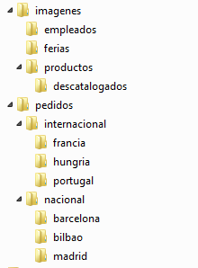

# Rutas del sistema de archivos
- [Rutas del sistema de archivos](#rutas-del-sistema-de-archivos)
  - [Introducción](#introducción)
  - [Directorios](#directorios)
  - [Rutas](#rutas)
    - [Rutas absolutas y relativas](#rutas-absolutas-y-relativas)
    - [Ejemplos de rutas absolutas y relativas](#ejemplos-de-rutas-absolutas-y-relativas)

## Introducción
Un fichero se identifica de forma unívoca mediante su nombre y la ruta de acceso al mismo. Tanto el nombre como la ruta dependen del sistema de archivos que se utilice.

Normalmente se permiten nombres con espacios, caracteres especiales, etc (aunque no es lo más recomendable, sobre todo si vamos a usar la terminal). Los sistemas de archivo de Microsoft (_FAT_ y _NTFS_) no distinguen entre mayúsculas y minúsculas en los nombres de ficheros y directorios mientras que los sistemas _ext_ sí que lo hacen (_Datos.txt_, _datos.txt_ y _DATOS.txt_ podrían ser 3 ficheros diferentes en el mismo directorio).

Una parte importante del nombre de un archivo es su extensión, que se ubica al final del mismo detrás de un punto (normalmente son 3 caracteres, aunque puede variar). En Windows la extensión permite conocer el tipo de información que contiene. En GNU/Linux esta información se guarda en los _metadatos_ del fichero, aunque se suele utilizar la extensión para aportar información al usuario.

## Directorios
Son un tipo de archivo especial que permite organizar los ficheros. Puede contener ficheros y/o otros directorios.

De este modo los ficheros y directorios constituyen una estructura jerárquica en forma de árbol: cada sistema tiene un directorio principal llamado **directorio raíz** dentro del cual se encuentran archivos y otros subdirectorios que contienen más archivos y subdirectorios.


En Windows cada partición tiene su propio _directorio raíz_ formado por la letra de la partición y **`\`** (ej. `C:\`, `D:\`). En GNU/Linux hay un único directorio raíz, **`/`** y otras particiones se _montan_ en subdirectorios dentro de `/`.

Se llama **directorio actual** al directorio en que se encuentra el usuario en este momento. Si no indicamos ruta para un fichero se supone que se encuentra en el directorio actual (ej. `rm prueba.txt` borraría el fichero _prueba.txt_ del directorio actual). 

El directorio actual se representa con el carácter **`.`** (punto). El comando anterior es el mismo que  `rm ./prueba.txt`.

El **directorio padre** del actual es el directorio en el cual se haya el directorio actual y se representa con  **`..`** (punto punto). Ej.:
```bash
cp ./prueba.txt ../
```

copia el fichero _prueba.txt_ del directorio actual al directorio padre del actual. El símbolo `/` final no es necesario ponerlo (el comando anterior es equivalente a `cp ./prueba.txt ..` o a `cp prueba.txt ..`)

## Rutas
La ubicación de un archivo se indica con una cadena de texto llamada **ruta** (_path_). Puede haber dos archivos con el mismo nombre en distintas rutas. La nomenclatura de rutas varía ligeramente dependiendo del sistema: en Windows se indican con el carácter **`\`** y en GNU/Linux con  **`/`**.

Una ruta viene dada por una sucesión de nombres de directorios y subdirectorios, ordenados jerárquicamente de izquierda a derecha que acaba en el nombre de un archivo o directorio presente en la última rama de directorios especificada.

Ejemplo de ruta en GNU/Linux:
```bash
/home/usuario/documentos/documento.txt
```

- `/` representa el directorio raíz
- `home/usuario/música` es la ruta
- `documento.txt` es el nombre del archivo

Ejemplo de ruta en Windows:
```bat
C:\Usuarios\usuario\Documentos\documento.txt
```

- `C:` es la unidad de almacenamiento
- `\` representa el directorio raíz de la unidad C:
- `Usuarios\usuario\Documentos` es la ruta
- `documento.txt` es el nombre del archivo

### Rutas absolutas y relativas
Siempre hay 2 formas de identificar la ruta de un fichero:
- Utilizando su **ruta absoluta**: es la que **empieza en el directorio raíz** y llega hasta el fichero. Los ejemplos que hemos visto anteriormente usan rutas absolutas
- Utilizando **rutas relativas**: en lugar de empezar la ruta por el directorio raíz se **empieza desde el directorio actual**

Ejemplo:
- ruta absoluta: `/home/usuario/documentos/prueba.txt`
- rutas relativas
  - si el directorio actual es `/home/usuario/documentos/`, la ruta del fichero seria `prueba.txt` (o también podría escribirse `./prueba.txt`)
  - si el directorio actual es `/home/usuario/`, la ruta sería `documentos/prueba.txt` (o `./documentos/prueba.txt`)
  - si el directorio actual es `/home/usuario/música/`, la ruta del sería `../documentos/prueba.txt`

**NOTA**: la barra final de la ruta de un directorio puede omitirse, por lo que es lo mismo `/home/usuario/` que `/home/usuario`

### Ejemplos de rutas absolutas y relativas
Vamos a ver unos ejemplos partiendo de la estructura de directorios de la imagen siguiente. Esa estructura está creada en la carpeta personal del usuario juan (en C:\Usuarios\juan). Para los ejemplos nuestro directorio actual será nacional (C:\Usuarios\juan\pedidos\nacional).



**Copiar todos los ficheros de nacional en bilbao**

- Ruta absoluta: 
  ```bat
  copy C:\Usuarios\juan\pedidos\nacional\*.* C:\Usuarios\juan\pedidos\bilbao
  ```

- Ruta relativa: 
  ```bat
  copy *.* bilbao 
  ```
  (o también `copy *.* .\bilbao`)
  
**Copiar todos el ficheros con extensión "jpg" de "pedidos" a "ferias"**

- Ruta absoluta: 
  ```bat
  copy C:\Usuarios\juan\pedidos\*.jpg C:\Usuarios\juan\imagenes\ferias
  ```

- Ruta relativa: 
  ```bat
  copy ..\*.jpg ..\..\imagenes\ferias 
  ```

También podemos poner un parámetro con ruta absoluta y otro con relativa. Ejemplo:

**Copiar los ficheros con extensión gif de descatalogados a imagenes**

```bat
copy descatalogados\*.gif C:\Usuarios\juan\imagenes
```
