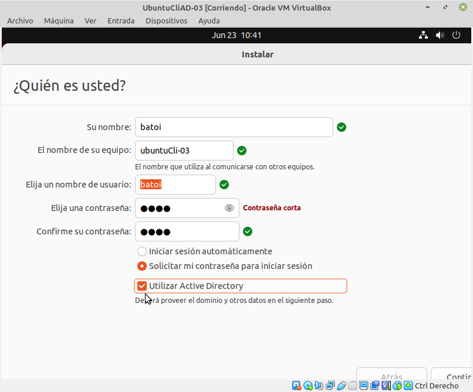

# Afegir un client GNU/Linux a _Active Directory_
- [Afegir un client GNU/Linux a _Active Directory_](#afegir-un-client-gnulinux-a-active-directory)
  - [Introducció](#introducció)
  - [SSSD](#sssd)
  - [Afegir un Ubuntu al instal·lar el sistema](#afegir-un-ubuntu-al-installar-el-sistema)
  - [Instal·lació manual](#installació-manual)
    - [Instal·lació de _kerberos_](#installació-de-kerberos)
  - [Altres configuracions](#altres-configuracions)
    - [Iniciar sessió des de l'entorn gràfic](#iniciar-sessió-des-de-lentorn-gràfic)
  - [Bibliografia](#bibliografia)

## Introducció
En ocasions necessitem afegir un equip GNU/Linux al nostre domini _Active Directory_. En el cas d'_Ubuntu Desktop_, des de la versió 22.04 tenim una opció en la instal·lació que podem marcar i ens pregunta les dades del domini per a afegir l'equip automàticament. Si no marquem eixa opció, o amb altres distribucions, podem fer-ho manualment de diverses formes. Una de les més senzilles és utilitzant _sssd_.

Els paquets que necessitarem són:
- **adcli**: és un paquet linux per a realitzar accions en un domini _Active Directory_ ([manpages](https://manpages.ubuntu.com/manpages/trusty/man8/adcli.8.html))
- **kerberos**: és el mètode d'autenticació que utilitza _AD_. Per a utilitzar-lo en linux s'ha d'instal·lar el paquet _krb5-user_
- **realmd**: paquet amb utilitats per a gestionar la unió d'equips a dominis amb autenticació _kerberos_ ([manpages](https://manpages.ubuntu.com/manpages/xenial/man8/realm.8.html))
- **sssd**: inclou eines per a gestionar l'autenticació i informació d'usuaris i grups per a distints orígens de xarxa com _AD_, _LDAP_ i _kerberos_

## SSSD
El dimoni de serveis de seguretat del sistema (_System Security Services Daemon, SSSD_) és un servei que permet accedir a mecanismes d'autenticació i directoris remotos com _LDAP_, _Active Directory_ i regnes _kerberos_. Això permet als usuaris autentificar-se en un equip local utilitzant un compte del servidor.

A més, igual que fa Windows, SSSD manté una caché d'identitats en l'equip local la qual cosa permet a un usuari iniciar sessió encara que el servidor no estiga disponible si ja l'ha iniciat abans en aquest equip.

El fitxer de configuració és `/etc/sssd/sssd.conf`.

## Afegir un Ubuntu al instal·lar el sistema
L'instal·lador d'Ubuntu Desktop inclou una opció per a afegir l'equip que estem instal·lant al domini en el procés d'instal·lació del sistema operatiu:



Si marquem aquesta opció en la següent pantalla ens demana el nom del domini i un compte per a afegir l'equip al domini (normalment el de l'_Administrador_):


## Instal·lació manual
Per a instal·lar els paquets que necessite escrivim:
```bash
apt-get install realmd sssd-ad sssd-tools adcli
```

Ara podem provar que l'equip troba el domini amb:
```bash
sudo realm -v discover mydomain.lan
```

Ens ha de mostrar el nom del domini i la IP del DC. 

Per últim afegim l'equip al domini amb
```bash
realm join -v -U Administrador mydomain.lan
```

L'opció `-v` és per a obtindre més informació del procés. 

Si tot ha funcionat ja tenim equip afegit al domini. Si falla per falta de permisos (_Couldn't authenticate to active directory SASL(-1)_) és que no tenim instal·lat _kerberos_ així que ho instal·lem ara.

### Instal·lació de _kerberos_
Per a instal·lar _kerberos_ fem:
```bash
sudo apt install krb5-user
```

Durant el procés d'instal·lació s'ens demana el nom del regne (ens pregunta pel _realm_ que és com kerberos anomena al domini on s'autenticarem). Indicarem el nom del nostre domini **en majúscules** (per exemple MYDOMAIN.LAN). Si no ho fem així més avant (al executar el comando `kinit`) obtindrem un error (_KDC reply did not match expectations while getting initial credentials_). Podem canviar el nom del domini en el fitxer `/etc/krb5.conf` editant la línia **default_realm**.

Per últim editem el fitxer de configuració de _kerberos_ (`/etc/krb5.conf`) i afegim en la secció `[libdefaults]`la línia:
```bash
rdns = false
```

Ara tornem a executar el comando per a afegir l'equip al domini `realm join` i tot ha de funcionar correctament.


A continuació canviem el nom del nostre equip per a que incloga el domini
```bash
hostnamectl set-hostname mymachine.mydomain.lan
```

## Altres configuracions
Ja tenim l'equip afegit al domini i el podem vore des de l'eina **_Usuaris i equips d'Active Directory_**. També podem obtindre informació de qualsevol usuari del domini des de la terminal de l'equip amb:
```bash
id Administrador@mydomain.lan
```

Podem iniciar sessió amb un usuari del domini amb 
```bash
su Administrador@mydomain.lan
```

o 
```bash
sudo login Administrador@mydomain.lan
```

Encara ens queden unes coses per configurar per a millorar la usabilitat del sistema. En el fitxer de configuració de _sssd_ `/etc/sssd/sssd.conf` trobem les línies:
- `cache_credentials = True`. Es guarden les credencials d'un usuari quan inicia sessió i la propera vegada és el mateix equip el que li dona accés sense haver de contactar amb un DC (Windows també ho fa)
- `use_fully_qualified_names = True`. Per a iniciar sessió s'ha de posar el FQDN de l'usuari (_usuari@domini_) en compte de només l'usuari. Podem posar-ho a _false_ només si treballam amb un únic domini i no té relacions de confiança amb altres.

La primera vegada que un usuari del domini inicia la sessió en l'equip no es crea per defecte el seu _home_. Per a que es cree executem el comando:
```bash
sudo pam-auth-update --enable mkhomedir
```

### Iniciar sessió des de l'entorn gràfic
Per defecte la pantalla d'inici d'Ubuntu només mostra els usuaris locals per a iniciar sessió. Però polsant en 'No es troba en la llista' podem escriure manualment en nom de l'usuari.

## Bibliografia
- [Ubuntu: SSSD and Active Directory](https://ubuntu.com/server/docs/service-sssd-ad)
- [RedHat: Entender SSSD y sus beneficios](https://access.redhat.com/documentation/es-es/red_hat_enterprise_linux/8/html/configuring_authentication_and_authorization_in_rhel/understanding-sssd-and-its-benefits_configuring-authentication-and-authorization-in-rhel).
