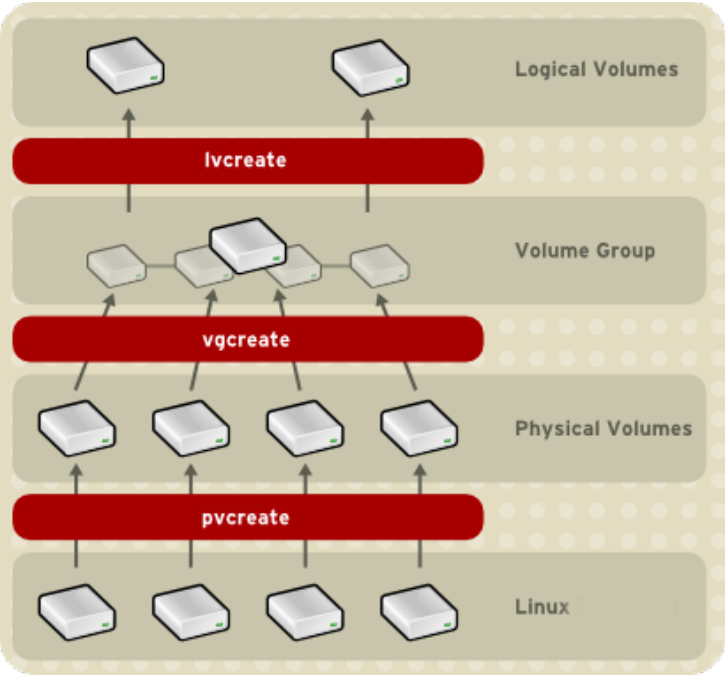

# LVM (Logical Volume Manager)
- [LVM (Logical Volume Manager)](#lvm-logical-volume-manager)
  - [Introducción](#introducción)
  - [Componentes de LVM](#componentes-de-lvm)
  - [Principales comandos LVM](#principales-comandos-lvm)
  - [Creación del disco virtual](#creación-del-disco-virtual)
    - [Ampliación del disco virtual](#ampliación-del-disco-virtual)
  - [Creación de una partición virtual](#creación-de-una-partición-virtual)
    - [Ampliación de una partición virtual](#ampliación-de-una-partición-virtual)

## Introducción
Normalmente en un disco tendremos diferentes particiones:
- para el sistema operativo
- para datos
- para los _bootloaders_ en sistemes UEFI
- para el _swap_ (GNU/Linux), para recuperación del sistema (Windows Recovery Environment), ...

El problema es que al hacer las particiones no sabemos exactamente cuánto creceran los ficheros almacenados en cada una de ellas y posiblemente en algún momento nos quedaremos sin espacio suficiente en alguna. Cuando eso pasa se tendrá que comprar un disco duro mayor, pero no podemos hacer que la partición que necesita más espacio sea la que teníamos más parte del nuevo disco sino que tenemos que pasarla toda al disco nuevo ya que una partición debe ser un trozo contiguo de un disco (no de dos).

Eso se soluciona con LVM porque trabaja con discos y particiones virtuales (lógicas) que pueden estar formadas por partes de varios discos diferentes.

LVM (Logical Volume Manager) es un sistema de gestión de volúmenes lógicos que permite gestionar el almacenamiento de forma más flexible que las particiones tradicionales, permitiendo:
- Que una partición (virtual) pueda extenderse a lo largo de varios discos duros físicos
- Redimensionado de discos lógicos (_volume group_)
- Redimensionado de particiones lógicas (_logical volume_)
- Instantáneas de sólo lectura (LVM2 ofrece lectura y escritura)
- RAID0 de volúmenes lógicos.

Algunas de las ventajas que proporciona LVM son:
- Cuando instalamos el sistema y hacemos las particiones siempre es difícil estimar cuánto espacio será necesario para el sistema o para datos y es bastante común que nos quedemos sin espacio en alguna partición aunque sobre espacio en otra. Con LVM podemos reducir las particiones a las que les sobre espacio y añadírselo a la que lo necesite. También podemos dejar cierta cantidad de espacio de disco sin asignar para expandir un volumen cuando se necesite.
- Cuando un nuevo disco se añade al sistema, no es necesario mover al nuevo disco los datos de los usuarios. Simplemente se añade el nuevo disco al disco virtual correspondiente y se expanden las particiones virtuales todo lo que se considere adecuado.

## Componentes de LVM
LVM funciona en tres niveles:
- **Volúmenes físicos** (**PV**, _phisical volume_): Son los discos o particiones reales donde se guardarán los datos (por ejemplo /dev/sda3, /dev/sdb, ...). Algunos de los discos o particiones del sistema son los _PV_ que podrá utilizar LVM para guardar los datos y tendrán su sistema de archivos LVM.
- **Grupos de volúmenes** (**VG**, _volume group_): Son los discos duros virtuales hechos con la suma de los _PV_. Lo normal es tener un sólo _VG_ aunque podríamos tener varios. Dentro del _VG_ (disco virtual) crearemos las diferentes particiones virtuales (_LV_).
- **Volúmenes lógicos** (LV, _logical volume_): Son las particiones virtuales que hemos creado en el disco virtual. Cada _LV_ es el equivalente a una partición en un sistema tradicional por lo cual debemos crearle un sistema de archivos (formatearla) y montarla para poderla utilizar.



## Principales comandos LVM
Los comandos básicos de LVM son:
- _display_: Muestra información sobre los distintos componentes de LVM. Es recomandable ejecutar estos comandos antes y después de cada operación para comprobar que se ha realizado correctamente. Son:
  - **pvdisplay**: Muestra información sobre los volúmenes físicos
  - **vgdisplay**: Muestra información sobre los discos virtuales (grupos de volúmenes)
  - **lvdisplay**: Muestra información sobre las particiones virtuales (volúmenes lógicos)
- _create_: Crea los distintos componentes de LVM:
  - **pvcreate**: Crea un volumen físico (PV), es decir, coge una partición o disco duro del sistema y se la asigna a LVM
  - **vgcreate**: Crea un disco virtual usando uno o más _PV_
  - **lvcreate**: Crea una partición virtual dentro de un disco virtual
- _extend_: Aumenta el tamaño de los distintos componentes de LVM:
  - **vgextend**: Aumenta el tamaño de un disco virtual (_VG_) asignándole más volúmenes físicos (_PV_)
  - **lvextend**: Aumenta el tamaño de una partición virtual (_LV_) asignándole más espacio del que tenga libre el disco virtual
- _remove_: Elimina los distintos componentes de LVM:
  - **lvremove**: Elimina una partición virtual (_LV_)
  - **vgremove**: Elimina un disco virtual (_VG_)
  - **pvremove**: Elimina un volumen físico (_PV_)

Existen otros comandos como _XXscan_ que escanea los discos y particiones del sistema (_pvscan_, vgscan_ y _lvscan_), _lvrename_ que renombra una partición virtual (_LV_), _vgchange_ que activa o desactiva un disco virtual (_VG_), _lvchange_ que activa o desactiva una partición virtual (_LV_), _lvconvert_ que convierte un volumen lógico en un RAID, etc.

Hay herramientas gráficas para gestionar LVM como **_system-config-lvm_** pero nosotros utilizaremos la consola de comandos.

## Creación del disco virtual
NOTA: si durante la instalación del sistema operativo hemos elegido la opción de usar LVM, ya tenemos un disco virtual creado y no es necesario crear uno nuevo. En el caso de Ubuntu ya se ha creado un disco virtual llamado _ubuntu-vg_ y una partición lógica llamada _ubuntu-lv_ donde se almacena el sistema. Por tanto NO es necesario hacer nada de esto.

En primer lugar escogemos los volúmenes físicos (PV, *Phisical Volums*) que utilizaremos para LVM. Podemos escoger particiones o discos enteros. Por ejemplo, para asignar a LVM la partición _sda3_ haremos:
```bash
pvcreate /dev/sda3
```

Esto lo tenemos que repetir para cada partición a utilizar (por ejemplo _sda4_ y _sda5_). También podríamos usar un disco completo (por ejemplo _sdb_) con:
```bash
pvcreate /dev/sdb
```

A continuación creamos el disco virtual (grupo de volúmenes) que contendrá nuestras particiones virtuales (volúmenes lógicos). Por ejemplo para crear el disco virtual disco_vg con la partición _sda3_ y el disco _sdb_ que asignamos antes a LVM haremos:
```bash
vgcreate disco_vg /dev/sda3 /dev/sdb
```

### Ampliación del disco virtual
Si necesitamos aumentar el tamaño de nuestro disco virtual, por ejemplo porque queremos hacer una nueva partición y no queda suficiente espacio en el disco virtual, lo primero que necesitaremos es nuevo espacio de almacenamiento. Para ello podemos añadir un nuevo disco duro al sistema (por ejemplo _sdc_) y se lo asignamos a _LVM_:
```bash
pvcreate /dev/sdc
```

A continuación lo añadimos a nuestro disco virtual (grupo de volúmenes):
```bash
vgextend disco_vg /dev/sdc
```

Con este comando hemos ampliado el disco virtual _disco_vg_ con el nuevo disco duro _/dev/sdc_ añadido antes a LVM.

## Creación de una partición virtual
Una vez tenemos el disco virtual creado, podemos crear las particiones virtuales (volúmenes lógicos) que utilizaremos. Por ejemplo crearemos un volumen lógico llamado datos_lv de 5 GB:
```bash
lvcreate -L5G -n datos_lv disco_vg
```

los parámetros de este comando son:
- **-L**: Tamaño de lapartición virtual (LV) que queremos crear. En este caso 5 GB.
- **-n**: Nombre que le queremos dar a la partición virtual (LV). En este caso datos_lv.
- **disco_vg**: Nombre del disco virtual (VG) donde queremos crear la partición virtual (LV). En este caso disco_vg.

Ya tenemos la partición hecha y podemos verla tanto con `lsblk` como con el comando `lvdisplay`. 

La partición lógica (LV) creada es un dispositivo estándar de bloques, por lo cual debemos formatearla y montarla como cualquier otra partición. Por ejemplo para formatear la partición lógica (LV) _datos_lv_ con el sistema de archivos _ext4_ y montarla en la carpeta _/datos_ haremos:
```bash
mkfs.ext4 /dev/disco_vg/datos_lv
mount /dev/disco_vg/datos_lv /datos
```

Recordad que el comando `mount` monta la partición temporalmente, por lo cual si reiniciamos el sistema no estará montada. Para que se monte automáticamente al iniciar el sistema, tenemos que añadirla al archivo `/etc/fstab`. 

### Ampliación de una partición virtual
Si tenemos más espacio en el disco virtual (VG) podemos aumentar cualquiera de las particiones creadas en él. Si no tenemos sufuciente espacio en el _VG_ deberemos ampliarlo como se ha visto antes. Por ejemplo vamos a darle otros 3 GB al volumen datos_lv:
```bash
lvextend -L +3G /dev/disco_vg/datos_lv
```

Los parámetros de este comando son:
- **-L**: Tamaño a ampliar en la partición virtual. En este caso +3G (3 GB más de los que tenía).
- **/dev/disco_vg/datos_lv**: Nombre de la partición virtual que queremos ampliar (podemos saberlo con `lvdisplay`)

Por tanto ahora el volumen _datos_lv_ tendrá 8 GB (los 5 que tenía al crealo más los 3 que le hemos dado ahora).

Tanto `lvdisplay` como `lsblk` nos mostrarán el nuevo tamaño de la partición pero al hacer `df -h` sigue mostrando su tamaño anterior. Esto es porque el sistema de archivos ext4 no se ha ampliado automáticamente y tenemos que ampliarlo nosotros con `resize2fs`:

```bash
resize2fs /dev/disco_vg/datos_lv
```

Como no hemos indicado el tamaño, el sistema de archivos se ampliará al tamaño máximo del volumen lógico (LV). Si queremos que tenga un tamaño específico, podemos indicarlo. Por ejemplo para que el sistema de archivos tenga un tamaño de sólo 7 GB haremos:
```bash
resize2fs /dev/disco_vg/datos_lv 7G
```
