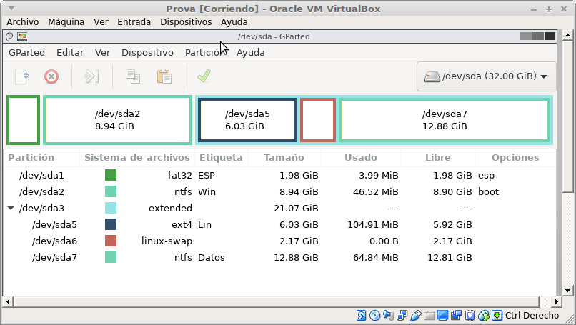
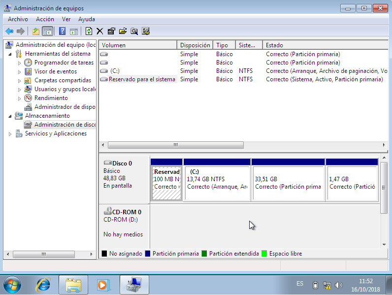
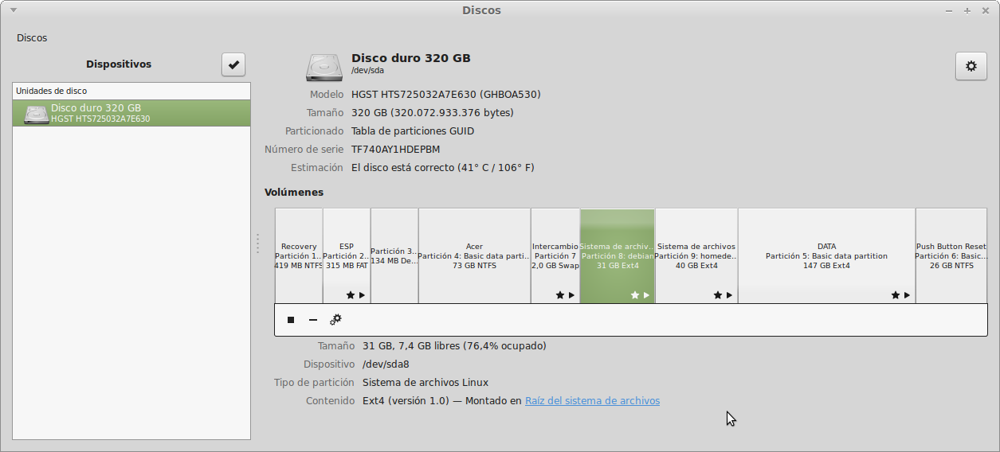
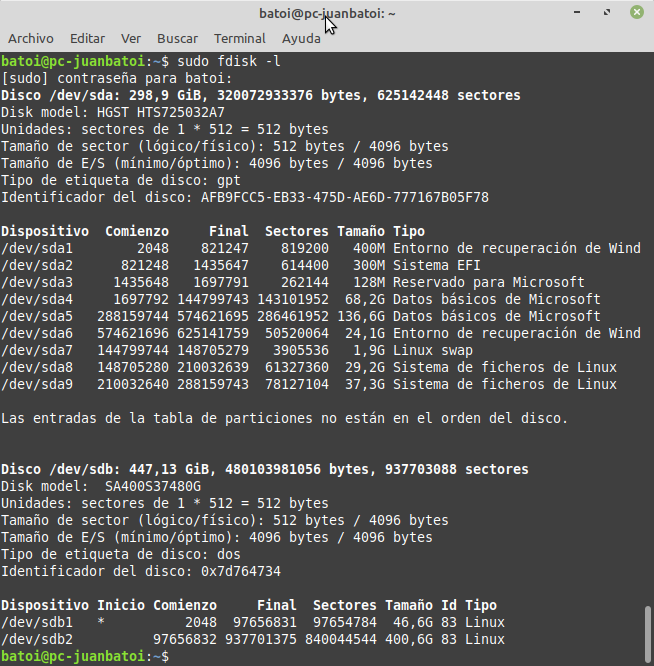

# Particionament de discos

## Índex
* [Introducció](#introducció)
* [Per què utilitzar particions](#per-qu%C3%A8-utilitzar-particions)
* [Nom de les particions](#nom-de-les-particions)
* [Veure les nostres particions](#veure-les-nostres-particions)
* [Taula de particions Ms-DOS o MBR](./mbr.md#taula-de-particions-ms-dos-o-mbr)
  * [MBR](.mbr.md/#mbr)
  * [Tipus de particions](.mbr.md/#tipus-de-particions)
  * [Còpia de seguretat del MBR](.mbr.md/#c%C3%B2pia-de-seguretat-del-mbr)
* [Taula de particions GUID (GPT)](./gpt.md#taula-de-particions-guid-o-gpt)

## Introducció
Encara que podem instal·lar el sistema operatiu en un medi extraïble com una memòria USB, el més normal és fer-ho en el disc dur de l'ordinador. Encara que un disc dur està format per plats, cilindres, pistes i sectors, en realitat el sistema operatiu el veu com si fos una sèrie de clústers consecutius.

Per a utilitzar qualsevol suport d'emmagatzematge ho hem de particionar prèviament, és a dir, hem de fer particions (al menys una) en ell. Una partició de disc és cada part en que es divideix un disc. Quan particionem un disc, els sistemes operatius reconeixen l'únic disc físic com un conjunt de discos lògics, a tots els efectes independents. Per tant cada partició tindrà el seu propi sistema d'arxius que gestiona com es guarden els fitxers en eixa partició. 

Si anem a instal·lar un sistema operatiu en un disc podem particionar-ho abans amb alguna eina de particionat, o durant el procés d'instal·lació del sistema operatiu. Però abans de fer la instal·lació és molt recomanable tindre clar quines particions haurem de fer en el nostre disc.

Des del naixement del PC en els anys 80 el mètode de particionatment utilitzat per a particionar el disc era l'anomenada Taula de particions **Ms-DOS** o **MBR** (_Master Boot Record_). Però des de fa uns anys un nou mètode que millora l'anterior va substituint-lo: la Taula de Particions GUID o **GPT** (_GUID Partition Table_).

## Per què utilitzar particions
Hi ha moltes raons per a tindre més d'una partició al nostre disc dur:
* Dos sistemes operatius no poden coexistir en la mateixa partició. Per tant si volem tindre instal·lat més d'un S.O. (per exemple un Windows i un Gnu/Linux) hem de fer al menys una partició per a cadascun d'ells.
* També és molt recomanable tindre el programari i les dades en particions diferents per seguretat. Així si hem de formatjar i reinstal·lar el sistema operatiu les dades no es veuran afectades.
* Alguns sistemes d'arxius (p.e. versions antigues de sistemes FAT) tenen grandàries màximes menors que la grandària real del nostre un disc, per la qual cosa hem de particionar el disc en particions amb mida igual o inferior a la mida màxima permesa pel sistema d'arxius per a poder-ho utilitzar tot.
* Es pot fer una imatge de la partició que utilitzem per al sistema operatiu i el programari i guardar-la en altra partició del disc dur. Així si el nostre ordinador deixa de funcionar o no ho fa correctament podem fàcilment restaurar la imatge guardada i tornem a tindre'l com el primer dia. Això és molt freqüent en els portàtils i en equips amb Windows 8 o posterior en un disc GPT.
* Es pot guardar una còpia de seguretat de les dades de l'usuari en altra partició del mateix disc, per a evitar la pèrdua d'informació important. Aquesta opció no es molt recomanable perquè si s'estropeja el disc sencer es perdria també la còpia.
* Alguns sistemes operatius aconsellen tindre més d'una partició, per exemple, els sistemes GNU/Linux recomanen tindre una partició d'intercanvi (swap) per a la memòria virtual o els sistemes Windows que recomanen tindre els fitxers d'arrencada en una partició diferent a la del sistema operatiu.

## Nom de les particions
En sistemes basats en Unix (com Gnu/Linux), cada disc té un nom de tipus **sdX** (el 1r disc es diu **sda**, el 2n disc **sdb**, etc). Recorda que qualsevol pen drive, disc SSD, etc que connectem a l'ordinador és un nou disc i rebrà un nom d'aquest tipus.

Cada partició rep el nom del disc seguit d'un número que indica quina partició és dins del disc. Per exemple la 1a partició primària del 1r disc s'anomene **sda1**, la 2a **sda2**, etc. La 1a partició primària de segon disc seria **sdb1**. Les particions lògiques rebren números a partir del 5. Així la 1a partició lògica del 1r disc es diu **sda5** i la 2a **sda6**.

Per exemple, un disc dur amb 2 particons primàries i una estesa que conté 3 particions lògiques es veuria com:

En l'exemple anterior trobem les particions:
* sda1: primera partició primària, amb format FAT32
* sda2: segona partición primària amb format NTFS
* sda3: partició estesa (conta com una primària). Dins trobem:
  * sda5: primera partició lògica amb format ext4
  * sda6: segona partició lògica, per a la memòria virtual d'un sistema Linux (swap)
  * sda7: tercera partició lògica, amb NTFS

En Windows els discos s'identifiquen con **Disco0** el 1r, **Disco1** el 2n, etc. Les particions quan es munten rebren una lletra (C:, D:, E:, ...) però només es munten les particions amb format NTFS o FAT.

## Veure les nostres particions
En Windows podem veure els diferents discos i particions que tenim al nostre equip des de l'**Administrador de disc** que trobem dins d'**Adminstracío d'equips** (es pot obrir, per exemple, des del `menú contextual de 'Equip' -> Administrar`):

Des de la terminal podem treballar amb els discos amb els comandos `FDISK` (per a discos MBR) o `DISKPART` (per a discos MBR o GPT).

En el cas de GNU/Linux cada distribució inclou la seua pròpia eina gràfica de gestió de discos i particions (_Utilitat de discos_ en Ubuntu, _Discos_ en Linux Mint, ...).

Des de la terminal en tots els sistemes Linux podem veure els discos i particions de l'equip amb els comandos `fdisk -l` o `parted`. Cal se administrador per a poder executar aquestes ordres.

## [Taula de particions Ms-DOS o MBR](./mbr.html#taula-de-particions-ms-dos-o-mbr)

## [Taula de particions GUID (GPT)](./gpt.html#taula-de-particions-guid-o-gpt)
