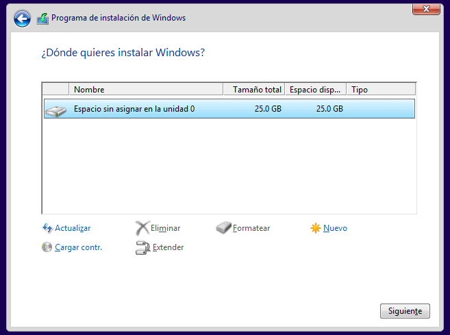
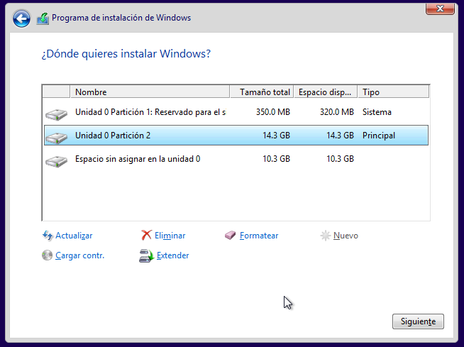
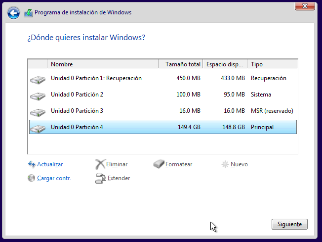

# Particionament de discos
- [Particionament de discos](#particionament-de-discos)
  - [Introducció](#introducció)
    - [Per què utilitzar particions](#per-què-utilitzar-particions)
    - [Nom de les particions](#nom-de-les-particions)
    - [Veure les nostres particions](#veure-les-nostres-particions)
  - [Taula de particions Ms-DOS o MBR](#taula-de-particions-ms-dos-o-mbr)
    - [MBR](#mbr)
    - [Tipus de particions](#tipus-de-particions)
    - [Còpia de seguretat del MBR](#còpia-de-seguretat-del-mbr)
  - [## Taula de Particions GUID o GPT](#-taula-de-particions-guid-o-gpt)
    - [Estructura de GPT](#estructura-de-gpt)
  - [Particions per a instal·lar Windows](#particions-per-a-installar-windows)
    - [Instal·lar Windows amb BIOS+MBR](#installar-windows-amb-biosmbr)
    - [Instal·lar Windows amb UEFI+GPT](#installar-windows-amb-uefigpt)
  - [Particions per a instal·lar GNU/Linux](#particions-per-a-installar-gnulinux)
    - [Particions en un disc GPT](#particions-en-un-disc-gpt)
    - [GNU/Linux amb Windows](#gnulinux-amb-windows)
  
## Introducció
Per a utilitzar qualsevol suport d'emmagatzematge ho hem de particionar prèviament, és a dir, hem de fer particions (al menys una) en ell. Una partició de disc és cada part en que es divideix un disc. Quan particionem un disc, els sistemes operatius reconeixen l'únic disc físic com un conjunt de discos independents a tots els efectes. Per tant cada partició tindrà el seu propi sistema d'arxius que gestiona com es guarden els fitxers en eixa partició. 

Si anem a instal·lar un sistema operatiu en un disc podem particionar-ho abans amb alguna eina de particionat, o durant el procés d'instal·lació del sistema operatiu. Però abans de fer la instal·lació és molt recomanable tindre clar quines particions haurem de fer en el nostre disc.

Des del naixement del PC en els anys 80 el mètode de particionatment utilitzat per a particionar el disc era l'anomenada _Taula de particions **Ms-DOS** o **MBR**_. Però des de fa uns anys un nou mètode que millora l'anterior el substitueix: la _Taula de Particions GUID o **GPT**_ (_GUID Partition Table_).

### Per què utilitzar particions
Hi ha moltes raons per a tindre més d'una partició al nostre disc dur:
* Dos sistemes operatius no poden coexistir en la mateixa partició. Per tant si volem tindre instal·lat més d'un S.O. (per exemple un Windows i un Gnu/Linux) hem de fer al menys una partició per a cadascun d'ells.
* També és molt recomanable tindre el sistema operatiu i les dades en particions diferents per seguretat. Així si hem de formatjar i reinstal·lar el sistema operatiu les dades no es veuran afectades.
* Alguns sistemes d'arxius (p.e. versions antigues de sistemes FAT) tenen grandàries màximes menors que la grandària real del nostre un disc, per la qual cosa hem de particionar el disc en particions amb mida igual o inferior a la mida màxima permesa pel sistema d'arxius per a poder-ho utilitzar tot.
* Es pot fer una imatge de la partició que utilitzem per al sistema operatiu i el programari i guardar-la en altra partició del disc dur. Així si el nostre ordinador deixa de funcionar o no ho fa correctament podem fàcilment restaurar la imatge guardada i tornem a tindre'l com el primer dia. Això és molt freqüent en els portàtils i en equips amb Windows 8 o posterior en un disc GPT.
* Es pot guardar una còpia de seguretat de les dades de l'usuari en altra partició del mateix disc, per a evitar la pèrdua d'informació important. Aquesta opció no es molt recomanable perquè si s'estropeja el disc sencer es perdria també la còpia.
* Alguns sistemes operatius aconsellen tindre més d'una partició, per exemple, els sistemes GNU/Linux recomanen tindre una partició d'intercanvi (swap) per a la memòria virtual o els sistemes Windows que recomanen tindre els fitxers d'arrencada en una partició diferent a la del sistema operatiu.

### Nom de les particions
En sistemes basats en Unix (com Gnu/Linux), cada disc té un nom de tipus **sdX** (el 1r disc es diu **sda**, el 2n disc **sdb**, etc). Recorda que qualsevol pen drive, disc SSD, etc que connectem a l'ordinador és un nou disc i rebrà un nom d'aquest tipus. El prefix _sd_ venia de _SATA disc_.

Cada partició rep el nom del disc seguit d'un número que indica quina partició és dins del disc. Per exemple la primera partició del primer disc s'anomena **sda1**, la 2a **sda2**, etc. La primera partició del segon disc seria **sdb1**. En el cas de discos MBR, les particions lògiques (després vorem què són) rebren números a partir del 5. Així la primera partició lògica del primer disc es diu **sda5** i la 2a **sda6**.

Per exemple, un disc dur MBR amb 2 particions primàries i una estesa que conté 3 particions lògiques es veuria com:


En l'exemple anterior trobem les particions:
* sda1: primera partició primària, amb format FAT32
* sda2: segona partición primària amb format NTFS
* sda3: partició estesa (conta com una primària). Dins trobem:
  * sda5: primera partició lògica amb format ext4
  * sda6: segona partició lògica, per a la memòria virtual d'un sistema Linux (swap)
  * sda7: tercera partició lògica, amb NTFS

En Windows els discos s'identifiquen con **Disco0** el 1r, **Disco1** el 2n, etc. Les particions quan es munten rebren una lletra (C:, D:, E:, ...) però només es munten les particions amb format NTFS o FAT.

### Veure les nostres particions
En Windows podem veure els diferents discos i particions que tenim al nostre equip des de l'**Administrador de disc** que trobem dins d'**Adminstracío d'equips** (es pot obrir, per exemple, des del `menú contextual de 'Equip' -> Administrar`):


En la part de dalt ('_Volumen_') trobem totes les particions de tots els discos i el la de baix els diferents discos.

Des de la terminal podem treballar amb els discos amb els comandos `FDISK` (per a discos MBR) o `DISKPART` (per a discos MBR o GPT).

En el cas de GNU/Linux cada distribució inclou la seua pròpia eina gràfica de gestió de discos i particions ('_Utilitat de discos_' en Ubuntu, '_Discos_' en Linux Mint, ...).


I també hi ha programes que podem instal·lar en qualsevol distribució, com _gparted_:


Des de la terminal en tots els sistemes Linux podem veure els discos i particions de l'equip amb els comandos `lsblk` o  `fdisk -l` (cal ser administrador per a poder executar fdisk).


## Taula de particions Ms-DOS o MBR
Encara és un format de particionament molt utilitzat en els PCs que tenen uns anys però els nous equips ja porten normalment el format GPT.

El primer sector del disc dur és especial i no podem utilitzar-lo per a guardar informació. Es diu _Master Boot Record_ (**MBR**). En la resta de sectors és on emmagatzemem informació després de fer les particions.

### MBR
El _Master Boot Record_ (MBR) és el primer sector d'un dispositiu d'emmagatzematge de dades amb aquest tipus de particionat i conté la taula de particions amb la informació de quines particions hi ha en el dispositiu. Normalment també s'empra per a l'arrencada del sistema operatiu. 

El seu contingut és: 
* 446 bytes que contenen al programa que iniciarà la càrrega del S.O. 
* 64 bytes amb la taula de particions (amb informació de les 4 particions primàries)
* 2 bytes amb la marca d'arrencada


La taula de particions conté 4 registres de 16 bytes cadascun per a una de les particions primàries on es guarda si és la partició activa, el seu sistema d'arxius, on comença i on acaba, la seua mida, etc.

### Tipus de particions
Hi ha 3 tipus diferents de particions:
* **Primària**: com a màxim només poden haver 4 d'aquest tipus en un disc
* **Estesa**: per a superar el límit de 4 particions primàries una d'elles pot ser la partició estesa que és un contenidor dins del qual es poden crear tantes particions lògiques com vulguem. Solament pot existir una partició d'aquest tipus per disc (i si hi ha partició estesa només podrà haver com a màxim 3 particions primàries)
* **Lògica**: es creen dins de la partició estesa i podem fer totes les que necessitem. Alguns sistemes operatius tenen certes restriccions amb aquestes particions (per exemple no es recomana el seu ús per a instal·lar els sistemes operatius Windows).


En la imatge anterior podem veure un disc dur de 233 GB particionat de la següent manera:
* Una partició primària de 55 GB amb sistema d'arxius NTFS
* Una partició estesa de 96 GB que te en el seu interior 2 particions lògiques:
* Una de 46 GB amb sistema d'arxius NTFS
* Altra de 50 GB també amb sistema NTFS
* Una partició primària de 28 GB amb sistema d'arxius ext4
* Altra partició primària de 54 GB també amb sistema d'arxius ext4

### Còpia de seguretat del MBR
En UNIX es pot fer una còpia i restaurar el MBR des de la consola. Ho farem amb l'ordre `dd` que copia els bytes indicats del dispositiu d'entrada (especificat per _if_) en el dispositiu d'eixida (especificat per _of_).

Per a fer la còpia de seguretat, executarem:
```bash
dd if=/dev/sda of=mbr.backup bs=512 count=1
```

Estem dient-li que del dispositiu `/dev/sda` (és a dir el primer disc dur, si volem altre canviarem això) copie al dispositiu d'eixida (el fitxer `mbr.backup` que després haurem de guardar en un USB o altre lloc) 1 bloc (`count=1`) de 512 bytes (bs=512).

Per a restaurar-lo:
```bash
dd if=mbr.backup of=/dev/sda
```

Si el nostre disc utilitza el sistema GPT en compte de l'MBR (ho veurem en el pròxim apartat) i volem fer una còpia de seguretat de l'arrencada del disc hem de copiar els primers 63 sectors del disc (que equivalen al primer cilindre del disc) i no només el primer sector. La instrucció seria:
```bash
dd if=/dev/sda of=gpt.backup count=63
```

Per a esborrar el contingut de l'MBR podem posar els bytes del MBC a zero (però no tot el MBR perquè perdríem també la taula de particions).
```bash
dd if=/dev/zero of=/dev/sda bs=446 count=1
```

En els sistemes operatius de Microsoft no podem accedir a l'MBR.

## ## Taula de Particions GUID o GPT
La _GUID Partition Table_ (GPT) és un estàndard de particionament de discos que vol solucionar les limitacions de l'MBR:
* MBR només permet fer 4 particions primàries (per això posteriorment es van crear les particions lògiques) però GPT permet fins a 128 particions primàries en un disc
* En MBR la mida màxima d'una unitat són 2,2 TB front als 9,4 ZB que permet direccionar GPT

Altra diferència és que GPT usa el mètode de direccionament lògic (**LBA**, _Logical Block Addressing_) en lloc de l'antic model cilindre-cap-sector (**CHS**) usat amb el MBR (què és el primer sector del cilindre 0 del cap 0).

També es diferencien en la forma en que arranca l'equip: en un disc amb MBR la BIOS carrega en la RAM aquest sector que conté el programa que inicia el procés d'arrencada (que tindrà vàries etapes fins carregar en la RAM el _bootloader_). La GPT no té res d'això perquè es la pròpia UEFI (que substitueix a la antiga BIOS) qui s'encarrega de buscar el _bootloader_ en el disc i carregar-lo en la RAM, com vam vore al parlar de [l'arrencada del sistema](../arrencada/).

### Estructura de GPT
Mentre que MBR ocupa el primer sector del disc la GPT ocupa els primers 34 sectors (encara que podrien ser més). A més està repetida en els últims sectors del disc per si s'espatllés la taula primària.


En el primer sector del disc, LBA 0, trobem l'MBR heretat. El seu propòsit és evitar que utilitats de disc basades en MBR no reconeguen i desbaraten discos basats en GPT. En l'MBR heretat s'especifica l'existència d'una única partició, que abasta tota la unitat GPT.

En el segon sector, LBA 1 i repetit en l'últim, trobem la capçalera GTP que defineix els blocs de disc que poden ser utilitzats per l'usuari. També conté el GUID del disc (Globally Unique Identifier, Identificador Global Únic).

En els sectors següents (a partir del LBA 2 fins al 33 -o més- i repetit al final) està la taula de particions. De cada partició es guarda el GUID de la partició, el començament i final de la partició, el nom de la partició i altres atributs.

En les distribucions modernes el comando `fdisk` sap llegir tant els discos MBR com els GPT:


## Particions per a instal·lar Windows
Segons si estem instal·lant Windows en un equip amb BIOS i disc MBR o amb UEFI i disc GPT les particions necessàries seran diferents.

### Instal·lar Windows amb BIOS+MBR
Al instal·lar Windows podem no indicar quines particions volem fer:



Si simplement polsem el botó _'Següent'_ Windows crearà les següents particions:
* Una **partició d'inici** de 500 MB on estaran els fitxers d'arrencada de Windows (_BootMGR_, _BDC_, ...) que no es muntarà per a que l'usuari no els puga esborrar (serà la partició _activa_)
* La **partició del sistema**, amb la resta d'espai del disc, on estarà el sistema operatiu i també es guardaran les dades, que es muntarà en C:

A partir de Windows 10 es crea a més altras partició NTFS:
* l'**entorn de recuperació de Windows - WinRE** (500 MB): tampoc es munta (ni l'_Administrador de Discos_ ens permet assignar-le una lletra). Conté l'entorn de recuperació (fitxer _WinRE.wim_). Es carrega si reiniciem amb la lletra SHIFT polsada i és un entorn com el que es carrega a l'arrancar des del CD d'instal·lació polsant en 'Reparar el sistema'

Les tres particions seran **primàries** i tindran sistema de fitxers **NTFS**.


Per a crear nosaltres les particions que vulguem (per exemple per a separar sistema i dades) utilitzem el botó de _'Nova'_ i especifiquem la mida de la partició a crear (en MB). Si volem eliminar una partició creada la seleccionem i premem el botó de _'Eliminar'_. Al crear la partició apareix un missatge que ens diu que es crearà automàticament la xicoteta partició d'arrencada (per tant no hem de crear-la nosaltres). Les particions creades son totes primàries (des d'ací Windows només ens deixa crear aquest tipus de partició) i amb sistema de fitxers NTFS:



Quan tinguem fetes les particions seleccionarem la partició en la qual instal·lar el sistema operatiu i premem el botó _'Següent'_.

### Instal·lar Windows amb UEFI+GPT
Si el firmware del nostre ordinador està configurat en mode _'UEFI'_ i no en _'Legacy BIOS'_ el programa instal·lador de Windows crearà en el disc la taula de particions GPT en compte de MBR.

NOTA: en Virtualbox per defecte està actiu el mode _'Legacy BIOS'_ al triar un S.O. Windows. Per a activar el mode _'UEFI'_ hem de marcar la casella _**Habil·litar EFI (només SO especials)**_ en la pestanya _Sistema_ abans de començar la instal·lació.

En el cas de instal·lar Windows en un disc GPT Microsoft recomana fer les següents particions:

?redirectedfrom=MSDN) )

La partició de imatge de recuperació és opcional però recomanada. L'us de cada partició és el següent:
* **Windows RE Tools partition** (> 300 MB, NTFS): conté eines de recuperació i la imatge _winre.wim_
* **EFI System Parttion, ESP** (>100 MB, FAT32): és la partició EFI
* **Microsoft Reserved Partition, MSR** (128 MB, cap): per a gestionar el disc
* **Partició de Windows** (> 20 GB, NTFS): la partició on s'instal·la el sistema operatiu i, si no hi ha partició de dades, on estan les dades de l'usuari. És la partició que veu i utilitza l'usuari (serà la partició C:)
* OPCIONAL: Altres particions de dades:
* **Partición de Recuperación** (>2G , NTFS): partició de recuperació que inclou la imatge _install.wim_

Per defecte les particions que crea el programa instal·lador de Windows 10 Pro en un disc GPT de 150 GB són les següents:



Com podem veure estan totes excepte la partició de recuperació.

## Particions per a instal·lar GNU/Linux
Per a instal·lar una distribució GNU/Linux haurem de crear una partició (és indiferent si és o no primària) que muntarem en **/**. Haurà de tindre un sistema d'arxius adequat (per exemple **ext4**).

Linux no crea per defecte una partició per al fitxers d'arrencada com fa Windows (encara que podem fer-ho creant manualment la partició i muntant-la en la carpeta _/boot_).

Normalment sí crea una partició per a la memòria virtual o **swap** (recordeu que en Windows la memòria virtual és el fitxer `C:\pagefile.sys`). No cal que siga massa gran perquè els equips moderns tenen molta RAM (4 GB o més) i si estem utilitzant molta memòria virtual el rendiment del sistema es degradarà ràpidament (es recomana uns 2GB). De fet es casi innecesaria i algunes distribucions com _Ubuntu_ ja no la crean sinó que usen un fitxer com memòria virtual igual que fa Windows. Sí que es necessita (amb una mida algo superior a la RAM) si es vol usar la hibernació perquè el contingut de la RAM es guarda en eixa partició al hibernar el sistema. La partició de _swap_ no utilitza el sistema d'arxius _ext4_ ni cap altre sinó que es gestiona de forma diferente.

Quan instal·lem un sistema GNU/Linux tenim habitualment l'opció de fer el particionat automàticament o manualment:


En aquest cas es tracta d'un disc dur buit sense cap altre sistema operatiu. En cas de detectar altre sistema ens oferirà a més l'opció d'instal·lar el sistema GNU/Linux junt a l'altre sistema operatiu i triar al arrancar l'ordinador quins sistema operatiu carregar:


Per a crear les particions automàticament seleccionem l'opció de _'Borrar tot el disc'_ ( o _'Instal·lar junt a l'altre sistema'_ si ja tenim un sistema operatiu en aquest disc) i es crearan automàticament les 2 particions comentades abans:
* una xicoteta **partició de swap** (per a la memòria virtual) que creará al final del disc i serà de tipus lògica
* la resta del disc dur serà per a una única partició primària amb sistema de fitxers _ext4_ on instal·lar el sistema operatiu

Si seleccionem l'opció _'Més opcions'_ haurem de crear nosaltres les particions del disc. Per a això tenim en la part inferior esquerra de la finestra els botons **+** (per a crear una nova partició en l'espai lliure sense particionar), **-** (per a eliminar la partició seleccionada) i _'Change'_ (per a canviar la partició seleccionada):


Al crear cada partició ens pregunta:
* la mida de la nova partició
* si serà primària o lògica. Recordeu que per a GNU/Linux no és important el tipus de la partició
* si la volem crear al principi o al final de l'espai sense particionar
* el sistema d'arxius que tindrà. Per al sistema operatiu el més normal és triar el sistema _ext4_. Per a la partició de swap triarem l'opció _Àrea d'intercanvi_. Si volem una partició de dades per a compartir amb Windows hem de triar _FAT_ perquè no tenim l'opció de _NTFS_ (el millor seria haver fet abans aquesta partició en _NTFS_ o fer-la després al instal·lar Windows)
* el punt de muntatge si volem que la partició es munte automàticament i es puga utilitzar. Recordeu que en Windows les particions es munten en lletres (C:, D:, ...) però en Linux es munten en carpetes (/home, /var, ...) i ací indiquem que al accedir a eixa carpeta estarem accedim en realitat a la partició. 
  * El punt de muntatge per al sistema operatiu ha de ser **/**. 
  * Si fem una partició apart per a les dades dels usuaris de GNU/Linux (no per a compartir amb Windows) la muntarem en **/home**.
  * Podem fer més particions i muntar-les en la carpeta adequada (per exemple si volem els fitxers d'arrencada en altra partició la creem i la muntem en _/boot_)
  * Si volem muntar una partició Windows ací triarem la carpeta que vulguem (per exemple **/windows** o **/dades**). 
  * Si no especifiquen un punt de muntatge la partició no es muntarà automàticament al iniciar el sistema i haurem de muntar-la nosaltres per a poder-la utilitzar.


En l'exemple següent tindrem una partició separada per al sistema operatiu i per a les dades dels usuaris:


Les particions creades són:
* **/dev/sda1**: primera partició primària on s'instal·larà el sistema operatiu (es munta en **/**), amb sistema d'arxius _ext4_
* **/dev/sda5**: primera partició lògica per a les dades dels usuaris, també amb ext4 (recordeu per a cada nou usuari es crea la seua carpeta personal dins de **/home**)
* **/dev/sda6**: segona partició lògica per a la memòria virtual

### Particions en un disc GPT
Si volem instal·lar GNU/Linux en un disc amb GPT hem de crear una partició per a **EFI** de al menys 250 MB amb format _FAT32_. Es recomana que siga la primera partició del disc i no hauríem de muntar-la (per a evitar que els usuaris puguen modificar-la per error). 

Si configurem el nostre firmware el mode _'UEFI'_ ho farà automàticament i crearà 2 particions:
* la partició per a **EFI** de 500 MB
* una partició amb la resta d'espai per al sistema i les dades

Si volem més particions haurem de fer-les manualment.

### GNU/Linux amb Windows
Si en instal·lar el sistema ja tenim un Windows instal·lat en aquesta màquina, l'assistent ho detectarà i ens mostrarà l'opció d'instal·lar GNU/Linux al costat de Windows. En aquest cas ens demanarà que reduïm la mida de la partició de Windows per deixar lloc a la de Linux. A Debian no apareix aquesta opció però podem entrar a particionat manual i allà redimensionar la partició de Windows i crear en aquest espai les de Debian.

Per defecte, les particions Windows i la resta de particions que hi hagi al disc no es muntaran automàticament al GNU/Linux. Si volem que alguna es munte només hem de seleccionar-la i posar-hi un punt de muntatge (com hem vist abans). Això afegirà la partició al fitxer `**/etc/fstab**`. Si no sempre podrem muntar-les des de l'entorn gràfic punxant-les o des de la terminal amb l'ordre `mount` o bé podem afegir-les manualment a `/etc/fstab` més avant perquè es munten al iniciar el sistema.