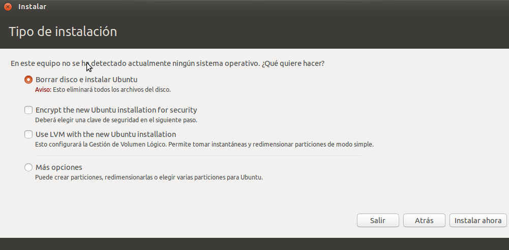

## Particionar al instal·lar GNU/Linux
Quan instal·lem un sistema GNU/Linux tenim habitualment l'opció de fer el particionat automàticament o manualment:

En aquest cas es tracta d'un disc dur buit sense cap altre sistema operatiu. En cas de detectar altre sistema ens oferirà a més l'opció d'instal·lar el sistema GNU/Linux junt a l'altre sistema operatiu i triar al arrancar l'ordinador quins sistema operatiu carregar:

Per a crear les particions automàticament seleccionem l'opció de _'Borrar tot el disc'_ ( o _'Instal·lar junt a l'altre sistema'_ si ja tenim un sistema operatiu en aquest disc) i es crearan automàticament 2 particions:
* una xicoteta partició de swap (per a la memòria virtual) que creará al final del disc i serà de tipus lògica
* la resta del disc dur serà per a una única partició primària amb sistema de fitxers _ext4_ on instal·lar el sistema operatiu

Si seleccionem l'opció _'Més opcions'_ haurem de crear nosaltres les particions del disc. Per a això tenim en la part inferior esquerra de la finestra els botons + (per a crear una nova partició en l'espai lliure sense particionar), - (per a eliminar la partició seleccionada) i _'Change'_ (per a canviar la partició seleccionada):

Al crear cada partició ens pregunta:
* la mida de la nova partició
* si serà primària o lògica. Recordeu que per a GNU/Linux no és important el tipus de la partició
* si la volem crear al principi o al final de l'espai sense particionar
* el sistema d'arxius que tindrà. Per al sistema operatiu el més normal és triar el sistema _ext4_. Per a la partició de swap triarem l'opció _Àrea d'intercanvi_. Si volem una partició de dades per a compartir amb Windows hem de triar _FAT_ perquè no tenim l'opció de _NTFS_ (el millor seria haver fet abans aquesta partició en _NTFS_)
* el punt de muntatge si volem que la partició es munte automàticament i es puga utilitzar. Recordeu que en Windows les particions es munten en lletres (C:, D:, ...) però en Linux es munten en carpetes (/home, /var, ...) i ací indiquem que al accedir a eixa carpeta estarem accedim en realitat a la partició. El punt de muntatge per al sistema operatiu ha de ser **/**. Si fem una partició apart per a les dades dels usuaris de GNU/LInux (no per a compartir amb Windows) la muntarem en **/home**. Si volem muntar una partició de dades o de Windows ací triarem la carpeta que vulgam (per exemple **/dades** o **/windows**). Si no especifiquen un punt de muntatge la partició no es muntarà automàticament al iniciar el sistema i haurem de muntar-la nosaltres per a poder-la utilitzar.

En l'exemple següent tindrem una partició separada per al sistema operatiu i per a les dades dels usuaris:

Les particions creades són:
* **/dev/sda1**: primera partició primària on s'instal·larà el sistema operatiu (es munta en **/**), amb sistema d'arxius _ext4_
* **/dev/sda5**: primera partició lògica per a les dades dels usuaris, també amb ext4 (recordeu per a cada nou usuari es crea la seua carpeta personal dins de **/home**)
* **/dev/sda6**: segona partició lògica per a la memòria virtual

### Particions en un disc GPT
Si volem instal·lar GNU/Linux en un disc amb GPT recordeu que hem de crear una particó per a **EFI** de al menys 250 MB amb format _FAT32_. Es recomana que siga la primera partició del disc i no hauríem de muntar-la (per a evitar que els usuaris puguen modificar-la per error).

També farem una partición de 1 MB al final del disc per a BIOSGRUB.

Si tenim una distribució preparada per a _'UEFI'_ i configurem així el nostre firmware tot això ho farà automàticament. Si no farem la instal·lació en mode _'Legacy BIOS'_ i després canviarem al mode _'UEFI'_ (com exemple teniu ací un tutorial per a [instal·lar Debian](http://gnulinuxvagos.es/topic/1818-debian-gnulinux-amd64-y-uefi/) i ací altre per a [instal·lar Ubuntu amb Windows 10](https://windtux.com/instalando-windows-10-y-ubuntu-14-04-con-uefi-gpt-configuracion-y-ventajas)).
