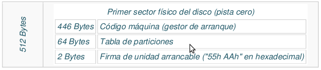
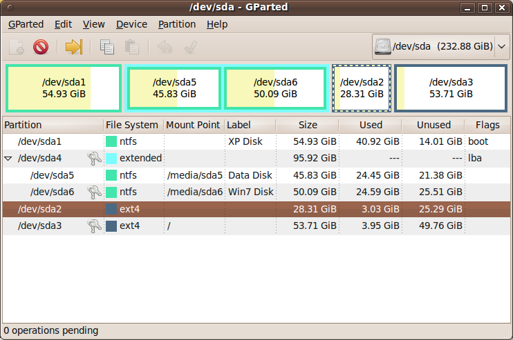

# [Particionament de discos](./)

## Índex
* [Introducció](./#introducció)
* [Per què utilitzar particions](./#per-qu%C3%A8-utilitzar-particions)
* [Nom de les particions](./#nom-de-les-particions)
* [Veure les nostres particions](./#veure-les-nostres-particions)
* Taula de particions Ms-DOS o MBR
  * [MBR](#mbr)
  * [Tipus de particions](#tipus-de-particions()
  * [Còpia de seguretat del MBR](#c%C3%B2pia-de-seguretat-del-mbr)
* [Taula de particions GUID (GPT)](./gpt.html#taula-de-particions-guid-o-gpt)

## Taula de particions Ms-DOS o MBR
Encara és un format de particionament molt utilitzat en els PCs que tenen uns anys però els nous equips ja porten normalment el format GPT.

El primer sector del disc dur és especial i no podem utilitzar-lo per a guardar informació. Es diu _Master Boot Record_ (**MBR**). En la resta de sectors és on emmagatzemem informació després de fer les particions.

### MBR
El _Master Boot Record_ (MBR) és el primer sector d'un dispositiu d'emmagatzematge de dades amb aquest tipus de particionat i conté la taula de particions amb la informació de quines particions hi ha en el dispositiu. Normalment també s'empra per a l'arrencada del sistema operatiu. 

El seu contingut és: 
* 446 bytes que contenen al programa que iniciarà la càrrega del S.O. 
* 64 bytes amb la taula de particions (amb informació de les 4 particions primàries)
* 2 bytes amb la marca d'arrencada



La taula de particions conté 4 registres de 16 bytes cadascun per a lainformació de una de les 4 particions primàries: on comança i acaba, si és la partició activa, el seu format, la seua grandària, etc.

### Tipus de particions
Hi ha 3 tipus diferents de particions:
* **Primària**: com a màxim només poden haver 4 d'aquest tipus en un disc
* **Estesa**: permet superar el límit de 4 particions primàries. Una de eixes 4 particions es pot convertir en partició estesa que és només un contenidor dins del qual es poden crear tantes particions lògiques com vulgam. Solament pot existir una partició d'aquest tipus per disc (si hi ha partició estesa només podira haver com a màxim 3 particions primàries)
* **Lògica**: es creen dins de la partició estesa i podem fer totes les que necessitem. Alguns sistemes operatius tenen certes restriccions amb aquestes particions (per exemple no es recomana el seu ús per a instal·lar els sistemes operatius Windows).



En la imatge anterior podem veure un disc dur de 233 GB particionat de la següent manera:
* Una partició primària de 55 GB amb sistema d'arxius NTFS
* Una partició estesa de 96 GB que te en el seu interior 2 particions lògiques:
* Una de 46 GB amb sistema d'arxius NTFS
* Altra de 50 GB també amb sistema NTFS
* Una partició primària de 28 GB amb sistema d'arxius ext4
* Altra partició primària de 54 GB també amb sistema d'arxius ext4

### Còpia de seguretat del MBR
En UNIX es pot fer una còpia i restaurar el MBR des de la consola. Ho farem amb l'ordre `dd` que copia els bytes indicats del dispositiu d'entrada (especificat per _if_) en el dispositiu d'eixida (especificat per _of_).

Per a fer la còpia de seguretat, executarem:
```bash
dd if=/dev/sda of=mbr.backup bs=512 count=1
```

Estem dient-li que del dispositiu `/dev/sda` (és a dir el primer disc dur, si volem altre canviarem això) copie al dispositiu d'eixida (el fitxer `mbr.backup` que després haurem de guardar en un USB o altre lloc) 1 bloc (`count=1`) de 512 bytes (bs=512).

Per a restaurar-lo:
```bash
dd if=mbr.backup of=/dev/sda
```

Si el nostre disc utilitza el sistema GPT en compte de l'MBR (ho veurem en el pròxim apartat) i volem fer una còpia de seguretat de l'arrencada del disc hem de copiar els primers 63 sectors del disc (que equivalen al primer cilindre del disc) i no només el primer sector. La instrucció seria:
```bash
dd if=/dev/sda of=gpt.backup count=63
```

Per a esborrar el contingut de l'MBR podem posar els bytes del MBC a zero (però no tot el MBR perquè perdríem també la taula de particions).
```bash
dd if=/dev/zero of=/dev/sda bs=446 count=1
```

En els sistemes operatius de Microsoft no podem accedir a l'MBR.
