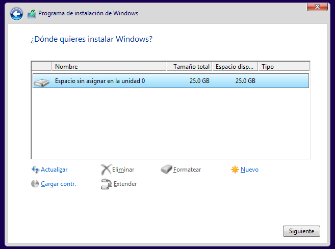
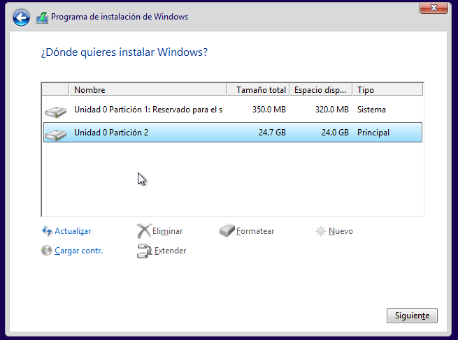
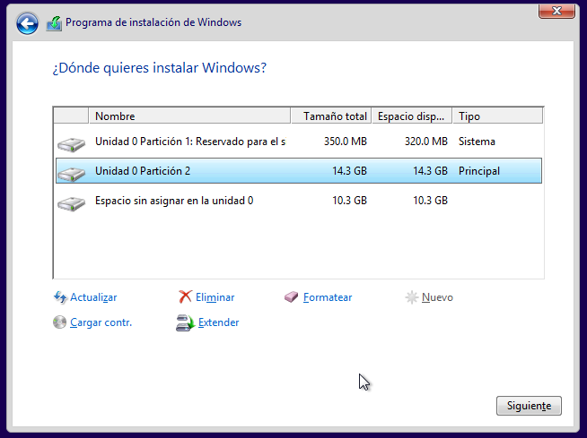
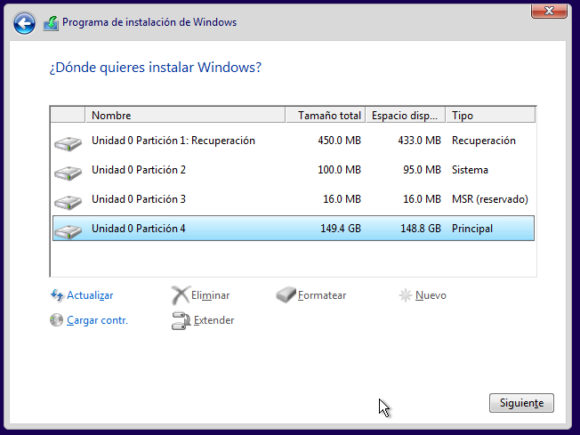

## Particions en Windows
### Instal·lar Windows amb BIOS+MBR
Al instal·lar Windows es creen per defecte 2 particions, amb sistema de fitxers NTFS:
* Una partició de 500 MB on estaran els fitxers d'arrencada de Windows (BootMGR, BDC, ...) que no es muntarà per a que l'usuari no els puga esborrar (serà la partició _activa_)
* La partició del sistema, amb la resta d'espai del disc, on estarà el sistema operatius i també es guardaran les dades, que es muntarà en C:

Si no hem fet particions prèviament amb _GParted_ o altra eina, al començament de la instal·lació de Windows ens pregunta on volem instal·lar el sistema:



Si simplement pulsem el botó _'Següent'_ Windows crearà les dos particions comentades abans. Totes dos seran primàries.



Per a crear nosaltres les particions que vulguem (per exemple per a separar sistema i dades) utilitzem el botó de _'Nova'_ i especifiquem la mida de la partició a crear (en MB). Si volem eliminar una partició creada la seleccionem i premem el botó de _'Eliminar'_. Al crear la partició apareix un missatge que ens diu que es crearà automàticament la xicoteta partició d'arrencada (per tant no hem de crear-la nosaltres). Les particions creades son totes primàries (des d'ací Windows només ens deixa crear aquest tipus de partició) i amb sistema de fitxers NTFS:



Quan tinguem fetes les particions seleccionarem la partició en la qual instal·lar el sistema operatiu i premem el botó _'Següent'_.

### Instal·lar Windows amb UEFI+GPT
Si el firmware del nostre ordinador està configurat en mode _'UEFI'_ i no en _'Legacy BIOS'_ el programa instal·lador de Windows crearà en el disc la taula de particions GPT en compte de MBR.

NOTA: en Virtualbox per defecte està actiu el mode _'Legacy BIOS'_ al triar un S.O. Windows. Per a activar el mode _'UEFI'_ hem de marcar la casella _**Habil·litar EFI (només SO especials)**_ en la pestanya _Sistema_.

En el cas de instal·lar Windows en un disc GPT Microsoft recomana fer les següents particions:


Font: [Microsoft](https://docs.microsoft.com/en-us/previous-versions/windows/it-pro/windows-8.1-and-8/hh824839(v=win.10)?redirectedfrom=MSDN)

La partició de imatge de recuperació és opcional però recomanada. L'us de cada partició és el següent:
* **Windows RE Tools partition** (> 300 MB, NTFS): conté eines de recuperació i la imatge _winre.wim_
* **EFI System Parttion, ESP** (>100 MB, FAT32): és la partició EFI
* **Microsoft Reserved Partition, MSR** (128 MB, cap): per a gestionar el disc
* **Partició de Windows** (> 20 GB, NTFS): la partició on s'instal·la el sistema operatiu i, si no hi ha partició de dades, on estan les dades de l'usuari. És la partició que veu i utilitza l'usuari (serà la partició C:)
* OPCIONAL: Altres particions de dades:
* **Partición de Recuperación** (>2G , NTFS): partició de recuperació que inclou la imatge _install.wim_

Per defecte les particions que crea el programa instal·lador de Windows 10 Pro en un disc GPT de 150 GB són les següents:



Com podem veure estan totes excepte la partició de recuperació.

Si la nostra versió de Windows no crea la taula de particions GTP sino MBR podem fer-ho manualment des de la pantalla de fer les particions prement la tecla Shift+F10 per a obrir una terminal i executant el programa `diskpart` per a crear les particions que vulguem (altra opció més senzilla és crear prèviement les particions amb alguna eina com GParted). Els comandos a executar són:
```cmd
diskpart
select disk 0
clean
convert gpt
exit
```

El que hem fet és executar `diskpart`, seleccionar el primer disc, eliminar la taula de particions, crear una taula de particions GPT i eixir. Ara des de la finestra gràfica crearem les particions on instal·lar Windows.

