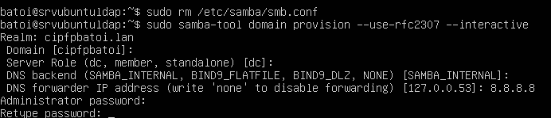
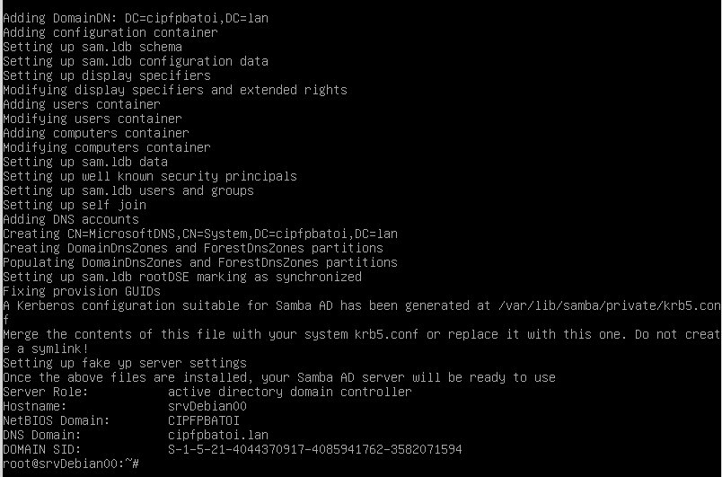
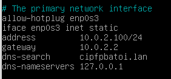
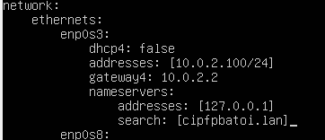

# Samba

## Introducción
Samba es una implementación en software libre del protocolo de red **SMB/CIFS** de Microsoft para la compartición de ficheros e impresoras en redes Windows. Desde la versión 3 de Samba además de proporcionar servicios de impresión y compartición de ficheros para clientes Windows, puede gestionar un dominio de Windows Server NT4 como DC (_Domain Controller_) o como miembro del dominio. A partir de Samba 4 también puede actuar como un controlador de dominio de un dominio _Active Directory_.

Samba funciona en la mayoría de sistemas UNIX y derivados como GNU/Linux, BSD o Mac OS X. Normalmente se utiliza para:
- Implementar el protocolo SMB/CIFS para compartir archivos e impresoras
- Implementar un controlador principal o secundario de dominio Windows (_Active Directory_)

Nosotros vamos a utilizar Samba 4 para crear y administrar un dominio Active Directory en el cual validaremos a los usuarios, compartiremos carpetas e impresoras y estableceremos directivas.

Algunos de los protocolos y servicios que utiliza Samba son:
- **SMB/CIFS**: es un protocolo que permite compartir archivos e impresoras entre equipos de una red. Lo inventó IBM pero la versión más extendida es la modificada por Microsoft que lo denominó CIFS y añadió más características. Samba es una implementación libre del protocolo SMB con las extensiones de Microsoft.
- **Active Directory (AD)**: es la implementación de Microsoft del servicio de directorio LDAP.
- **Kerberos**: es un protocolo de autenticación de redes que permite a dos ordenadores demostrar su identidad mutuamente de manera segura. Se emiten tickets para demostrar la identidad de cada elemento. Kerberos denomina a la red que lo usa **realm** (reino) y a los objetos que autentifica **principales** (son usuarios, equipos, servicios, …).
- **NTP**: el _Network Time Protocolo_ es un protocolo de sincronización de relojes sobre una red.

## Instalación y configuración del servidor
El paquete a instalar en el servidor es el paquete **samba** (si el servidor es CentOS tenemos que instalar **samba4**). Podéis encontrar más información de como instalar Samba en diferentes distribuciones en la [web oficial del proyecto Samba](https://wiki.samba.org/index.php/binary_distribution_packages).

Para añadir los clientes al dominio también necesitaremos tener instalado el paquete **winbind**.

Podemos saber qué versión de samba tenemos instalada con:
```bash
  samba -V
```

El protocolo se controla por dos demonios o servicios:
- **smbd**: ofrece los servicios de acceso remoto a archivos e impresoras
- **nmbd**: proporciona los mecanismos de resolución de nombres de Windows, es decir, proporciona a un sistema GNU/Linux visibilidad dentro de la red de un equipo Windows cómo si fuera un equipo más de la red Windows.

Además Samba4 incluye el servicio **samba-ad-dc** (_Samba Active Directory Domain Controller_) que por defecto está deshabilitado y que sustituye a los anteriores en dominios _Active Directory_.

La configuración del servicio se hace en el fichero **/etc/samba/smb.conf**. 

### Creación del dominio
El primer paso es hacer la provisión de nuestro dominio con el comando **samba-tool**. Para que funcione correctamene tenemos que eliminar previamente el fichero del configuración de Samba (o mejor, cambiarle el nombre). Para crear el doinio ejecutamos el comando samba-tool:
```bash
  samba-tool domain provision --use-rfc2307 --interactive
```

La opción use-rfc2307 permite a Samba guardar atributos POSIX de los usuarios y crear la información NIS para gestionarlos en GNU/Linux. Lo que nos preguntará este comando es:



- el nombre del dominio para Kerberos (**REALM**): pondremos el nombre de nuestro dominio, por ejemplo _cipfpbatoi.lan_
- el nombre del dominio (su nombre NetBIOS): ya lo pone por defecto (en nuestro caso _cipfpbatoi_)
- qué tipo de servidor será: 
  - controlador del dominio (DC)
  - miembro del dominio (ya debe haber algún controlador)
  - servidor único (sin dominio o como un equipo más del dominio existente, por ejemplo sólo servidor de ficheros)
- el DNS que utilizaremos: por defecto pone **SAMBA-INTERNAL** que es uno básico que integra Samba y así no necesitamos instalar y configurar DNS. Como sucede en Windows, se instalará un DNS básico que sólo sabe resolver el nombre del dominio y el del servidor, y cualquier otra petición la enviará al _reenviador DNS_
- el reenviador del DNS: un DNS a quien el servidor le reenviará todas las peticiones que no sepa resolver (sólo sabe resolver el nombre del dominio y del servidor). Por defecto aparece el DNS actualmente configurado en el equipo
- la contraseña del administrador del dominio: debe tener al menos 7 caracteres y cumplir los requisitos de complejidad

También se puede ejecutar el comando poniéndole todas las opciones en vez de poner –interactive para que nos las pida:
```bash
samba-tool domain provision --realm cipfpbatoi.lan --domain CIPFPBATOI --adminpass P@ssw0rd --server-role=dc --use-rfc2307
```
En este caso tendremos que editar después el fichero de configuración de Samba para indicar cuál será el reenviador de DNS.

Si todo funciona correctamente se creará el nuevo dominio:



Ahora tenemos que cambiar la configuración de la red para poner como **dns-nameservers** nuestro servidor y añadir en **dns-search** nuestro dominio. En _ifupdown_ haremos:



Y en netplan:



Tras recargar la red comprobamos que nuestro equipo sabe resolver tanto el dominio ldap como el servidor. Si nuestro sistema usa _systemd-resolved_ no resolverá el dominio y tenemos que hacer las [configuraciones adicionales](#configuración-adicional-en-sistemas-con-systemd-resolved) que se indican en el siguiente apartado para desactivar ese servicio.

Ya tenemos el dominio configurado y podemos añadir nuestros clientes Windows exactamente como se hace para añadirlos a un dominio creado con _Windows Server_. Recordad que el nombre del administrador de nuestro dominio es **Administrator** y no Administrador.

Sin embargo para que Windows se comunique con el servidor y pueda crearse la cuenta del equipo en el dominio debemos haber instalado en el servidor el paquete _winbind_ (y reiniciar el servidor). Si no lo tenemos al añadir el cliente al dominio se nos pide las credenciales de quien nos puede añadir al dominio (y se validan correctamente en el servidor) pero luego aparece un error diciendo que el recurso ya no está disponible.

Para añadir clientes GNU/Linux se hace igual que para añadirlos al Active Directory creado con un _Windows Server_.

Es importante que la hora sea la correcta tanto en el servidor como en el cliente para que Kerberos funcione adecuadamente. Para asegurarnos de ello podemos instalar el servicio NTP (el paquete se llama _ntp_) que coge la hora de Internet. Una vez instalado toma la hora por defecto de los servidores de hora de Ubuntu pero podemos indicarle otros servidores de hora.

### Configuración adicional en sistemas con systemd-resolved
Algunas distribuciones como Ubuntu 17.10 y posteriores utilizan un servicio denominado **systemd-resolved** para resolver los nombres de dominio (tiene una caché que optimiza la resolución de nombres). En ellas cuando miramos su DNS nos dice que és la 127.0.0.1:53 (es el puerto que usa este servicio).

Esto que es muy útil en una máquina cliente, causa problemas en el servidor porque interfiere con el DNS interno de Samba por lo que vamos a desactivarlo después de configurar el dominio.

Los pasos a realizar son los siguientes:
1. Paramos y deshabilitamos (para que no se iniciem de nuevo al arrancar el servidor) los servicios de samba (_smbd_ y _nmbd_), _winbind_ y _systemd-resolved_:
```bash
systemctl stop smbd nmbd winbind systemd-resolved
systemctl disable smbd nmbd winbind systemd-resolved
```

2. Eliminamos **resolv.conf** (que ahora no es un fichero sino un enlace al de systemd-resolved) y lo creamos nuevo. En él escribimos el DNS 127.0.0.1 (para que resuelva el DNS de Samba) y el nombre del dominio (para que resuelve el nombre de nuestro servidor aunque no pongamos su nombre completo, con dominio):
```bash
rm /etc/resolv.conf
nano /etc/resolv.conf
```

Y en él escribimos
```bash
search cipfpbatoi.lan
nameserver 127.0.0.1
```

3. Arrancamos y habilitamos el servicio de controlador de dominio de Samba:
```bash
systemctl unmask samba-ad-dc
systemctl start samba-ad-dc
systemctl enable samba-ad-dc
```

Tras reiniciar el servidor comprobaremos que el servicio **samba-ad-dc** funciona correctamente.

#### Configurar ufw
Si tenemos activado el Firewall debemos abrir los puertos que utiliza el dominio de Samba para que el cliente pueda acceder al mismo (de hecho no funciona ni el comando _nslookup_ porque el puerto 53 está bloqueado como el resto).

Por lo tanto tenemos que abrir en el firewall los puertos que vayamos a necesitar. Para abrir un puerto en los protocolos TCP y UDP ejecutamos:
```bash
ufw allow num_puerto
```

Para abrir un puerto sólo en TCP o en UDP hacemos igual pero con /TCP o /UPD:
```bash
ufw allow num_puerto/udp
```

Para abrir un rango de puertos se separan por ":" y se tiene que indicar el protocolo. Por ejemplo para abrir los puertos del 20 al 25 TCP:
```bash
ufw allow 20:25/tcp
```

Para cerrar puertos en vez de **allow** ponemos **deny** y para ver todos los puertos abiertos hacemos:
```bash
ufw status
```

Podemos quitar una regla que hemos puesto previamente con **delete** y la regla a eliminar:
```bash
ufw delete allow 20:25/tcp
```

Por último podemos reiniciar el firewall y dejarlo cómo al principio (sin ningún puerto abierto y deshabilitado) con:
```bash
ufw reset
```

Los puertos que utiliza samba y que tenemos que abrir en ufw son:

Service | Port | Protocol
:-- | :--: | :--:
DNS * | 53 | tcp/udp
Kerberos | 88 | tcp/udp
End Point Mapper (DCE/RPC Locator Service) | 135 | tcp
NetBIOS Name Service | 137 | udp
NetBIOS Datagram | 138 | udp
NetBIOS Session | 139 | tcp
LDAP | 389 | tcp/udp
SMB over TCP | 445 | tcp
Kerberos kpasswd | 464 | tcp/udp
LDAPS ** | 636 | tcp
Dynamic RPC Ports *** | 49152-65535 | tcp
Global Catalog | 3268 | tcp
Global Catalog SSL ** | 3269 | tc

Como son muchos podemos crear un script donde los anotamos y así sólo tenemos que ejecutar el script o modificarlo cuando lo necesitemos.

### Crear el dominio en un servidor DNS
Si queremos que nuestro servidor además de hacer de Contrlador del Dominio sea también un servidor DNS con bind tenemos que instalar el paquete **bind9** y configurarlo.

Cuando creamos el dominio (con samba-tool domain provision) a la hora de escoger el DNS pondremos _BIND_DLZ_ (en mayúsculas) en lugar de SAMBA_INTERNAL.

Después de crearse el dominio tenemos que configurar diversas cosas en algunos ficheros de bind:

- Fichero **/etc/bind/named.conf**

Añadiremos al final la línea:
```bash
include "/var/lib/samba/private/named.conf";
```

Eso incluye en BIND la configuración de Samba.

- Fichero **/etc/bind/named.conf.options**

Añadimos al final (pero dentro de las llaves) la línea:
```bash
tkey-gssapi-keytab "/var/lib/samba/private/dns.keytab";
```

Eso permitira a Samba añadir registros al DNS cuando se añadan clientes al dominio.

- Fichero **/etc/bind/named.conf.local**

Si en este fichero tenemos ya una definición de zona de nuestro dominio (por ejemplo si estaba configurado antes con SAMBA_INTERNAL) tenemos que quitarla porque la añadira Samba automàticamente.

Finalmente reiniciamos el servicio BIND:
```bash
systemctl restart bind9
```

Com ya dijimos, conviene añadir en **/etc/samba/smb.conf** en la sección global la opción
```bash
allow dns updates = nonsecure and secure
```

para permitir que se registren en el DNS los clientes al ser añadidos al dominio.

Ya deberia funcionar el DNS y podemos continuar con la configuración del dominio como se ha explicado en el capítulo anterior.

Fuentes:
- [Configuració do servidor Samba4 com a controlador de domini](https://manuais.iessanclemente.net/index.php/Configuración_do_servidor_Samba4_como_controlador_de_dominio)
- [BIND9 DLZ DNS Back End](https://wiki.samba.org/index.php/BIND9_DLZ_DNS_Back_End)
- [Samba4 AD DC on Ubuntu 14.04](https://blogging.dragon.org.uk/samba4-ad-dc-on-ubuntu-14-04/)
