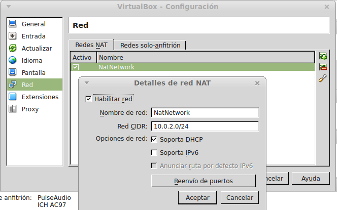

# VirtualBox
- [VirtualBox](#virtualbox)
  - [Introducció](#introducció)
  - [VirtualBox Guest Additions](#virtualbox-guest-additions)
  - [Compartir carpetes entre la màquina real i la virtual](#compartir-carpetes-entre-la-màquina-real-i-la-virtual)
  - [Importar i exportar màquines virtuales](#importar-i-exportar-màquines-virtuales)
  - [Emmagatzematge en VirtualBox](#emmagatzematge-en-virtualbox)
    - [L'Administrador de mitjans virtuals](#ladministrador-de-mitjans-virtuals)
    - [Afegir un disc addicional a una màquina](#afegir-un-disc-addicional-a-una-màquina)
    - [Clonar un disc dur](#clonar-un-disc-dur)
    - [Canviar el CD](#canviar-el-cd)
  - [La xarxa en Virtualbox](#la-xarxa-en-virtualbox)
    - [NAT](#nat)
    - [Xarxa NAT](#xarxa-nat)
    - [Adaptador pont](#adaptador-pont)
    - [Xarxa interna](#xarxa-interna)
    - [Adaptador sols amfitrió](#adaptador-sols-amfitrió)
    - [Canviar el tipus de la xarxa](#canviar-el-tipus-de-la-xarxa)
  - [Snapshots o Instantànies](#snapshots-o-instantànies)

## Introducció
És un programa de virtualització de hardware que permet crear diferents màquines virtuals en l'ordinador en que s'instal·la. Es tracta d'un hipervisor de tipus 2 per tant funciona com un programa més de la màquina _host_. Hi ha versions de VirtualBox per a GNU/Linux, Windows i Mac oS X (entre altres).

Aquest programa va ser creat per l'empresa _**Innotek GmbH**_ que va crear també una versió OSE (_Open Source Edition_) amb llicència GPL (software lliure). Aquesta empresa va ser adquirida per _Sun Microsystems_ en 2008 que va ser comprada per _**Oracle Corporation**_ en 2010 pel que ara el programa es diu _Oracle Virtualbox_. Hi ha una versió amb llicència privativa que és gratis per a ús personal i una **versió OSE** amb llicència GPL.

Virtualbox permet muntar fitxers `.iso` com unitats òptiques de les màquines virtuals. Respecte als disc durs, cadascú s'emmagatzema com un fitxer amb extensió `.vdi` (o `.vmdk`).

Per a cada màquina virtual es crea un directori amb el nom de la màquina (per defecte dins d'un directori anomenat **VirtualBox VMs**) en el qual es guarden els seus fitxers (incloent els seus discs durs). La seua configuració es guarda en un fitxer XML amb el nom de la màquina i extensió `.vbox`.

Una vegada instal·lat VirtualBox en la nostra màquina instal·larem el _**VirtualBox Extension Pack**_ (es descarrega també de la web de VirtualBox) amb millores com suport per a USB 2.0 i 3.0 i altres.

En el [manual de VirtualBox](https://www.virtualbox.org/manual/UserManual.html) podem conèixer més sobre el funcionament d'aquest programa. 

## VirtualBox Guest Additions
En cada màquina virtual que creem poder instal·lar les _Guest Additions_ que són un programa amb drivers i millores per al sistema operatiu d'eixa màquina, com:
- driver millorat de vídeo, que permet redimensionar la pantalla i canviar la resolució així como utilitzar acceleració de vídeo 3D i 2D
- que el host sincronitze l'hora en la màquina guest
- integració del ratolí i el teclado per a no haver de polsar la tecla _Host_ (per defecte el _Ctrl_ de la dreta del teclat) per a canviar el ratolí de la màquina host a la màquina virtual
- compartir carpetes entre la màquina host i la virtual
- compartir el portapapers entre la màquina real i la virtual
- etc

Per a instal·lar les _Guest Additions_ les muntem en la unitat òptica de la màquina virtual com si foren un CD (tenim l'opció de muntar-lo en el menú `Dispositius -> Instal·lar Guest Additions`) i executem el programa _**VBoxWindowsAdditions.exe**_ si el S.O. de la màquina virtual és Windows o _**VBoxLinuxAdditions.sh**_ si és GNU/Linux.

## Compartir carpetes entre la màquina real i la virtual
Una carpeta compartida és una carpeta del host accesible des d'una màquina virtual. Per a compartir carpetes hem de tindre instal·lades les _Guest Additions_ en la màquina virtual. La carpeta compartida es crea des de la màquina virtual en el menú `Dispositius -> Carpetes compartides`.

A continuació seleccionem la carpeta del host a compartir, li donem un nom per al guest i marquem les opcions que vulguem (com _Automuntar_ per a que es munte automàticament o _Fer permanent_ per a continuar tenint la carpeta compartida si reiniciem la màquina virtual).

Al fer això ja tenim la carpeta accesible en una ubicació dins de **vboxsvr**. Ara faltaria muntar-la per comoditat, per exemple en Windows podríem connectar la unidad de xarxa `\\vboxsvr\compartida`.

## Importar i exportar màquines virtuales
En el menú `Arxiu -> Importar/Exportar servei virtualitzat` de VirtualBox trobem opcions per a importar i exportar màquines virtuals.

L'exportació crea un arxiu comprimit en el qual es guarda tota la informació de configuració de la màquina virtual, així com tots els seus discos durs amb les dades, aplicacions, etc., del sistema operatiu guest. L'extensió d'aquest tipus de fitxer és **`.ova`**.

La importació d'un fitxer ova crea una nova màquina virtual exactament igual a la que es va exportar.

## Emmagatzematge en VirtualBox
La part més important del nostre sistema és el disc dur virtual on el tenim instal·lat. Aquest disc dur és un fitxer que es guarda en la màquina real amb extensió **`vdi`** en la carpeta del nostre directori d'inici denominada **VirtualBox VMs**. VirtualBox també pot treballar amb discos de VMware, amb extensió `vmdk` (ens pregunta el format a l'hora de crear un nou disc).

Una qüestió molt important al crear un nou disc dur és si ho volem d'**expansió dinàmica** o de **mida fixa**. Nosaltres sempre triarem la primera opció que farà que el fitxer `.vdi` que es crea no tinga tota la mida del disc dur creat sinó que tindrà només l'espai necessari per a guardar la informació que conté i anirà augmentant segons anem guardant més coses en la màquina virtual.

### L'Administrador de mitjans virtuals
És una eina a la que accedim des del menú `Arxiu -> Administrador de mitjans virtuals` i que ens permet gestionar els discos durs i CDs de totes les màquines virtuals.

Tenim 3 pèstanyes diferents per a gestionar els discs durs, els CDs i els disquetes. En la pestanya dels discs durs podem veure la mesura virtual del disc (la que es pensa que té la màquina virtual que és el màxim que podria arribar a tindre) i la mesura real del disc que és la que ocupa el fitxer vdi en el disc dur real.

Hem de tindre sempre en compte que aquest disc va creixent segons la màquina virtual necessita més espai i per tant ha de tindre espai en el disc dur real on créixer perquè si s'omple el disc dur real pot desbaratar-se el disc dur virtual.

Si polsem la icona de **Propietats** podem vore en la part inferior de la pantalla les dades d'aquest disc:
- Atributs: podem vore la ubicació del fitxer (i canviar el seu nom), la seua descripció i la seua mida (i podem canviar-la des d'ací)
- Informació: ací ens mostra el format del disc (vdi o vmdk), el tipus (si és reservat dinàmicament) o a quina màquina virtual està connectat (podria estar connectat a més d'una)

Altres accions que podem fer des d'ací son:
- **Copiar**: permet fer una còpia d'un disc dur (s'explica en detall més avant)
- **Alliberar**: permet desconnectar un disc dur de la màquina a la que pertany
- **Eliminar**: elimina el fitxer del disc dur. Només pot eliminar-se si no està connectat a cap màquina virtual (per tant abans ho hem d'alliberar)

### Afegir un disc addicional a una màquina
En la configuració de la nostra màquina virtual, dins de l'apartat d'emmagatzematge, apareixen les unitats de disc i CD que té la màquina virtual. Des d'ací podem en qualsevol moment afegir un nou disc dur a la nostra màquina igual o llevar-li algú dels que té.

Igual que en un PC real, quan afegim un disc dur hem de triar entre un disc SATA, IDE, SCSI, ...

Per a afegir un disc a un controlador existent (IDE o SATA) seleccionem el controlador i en les icones que apareixen a la dreta triem si volem afegir un dispositiu de CD/DVD o un nou disc portar al controlador.

També tenim en la part inferior de l'arbre d'emmagatzematge una icona per a afegir un nou controlador que pot ser SCSI, SAS o de disquette a més de IDE o SATA.

Si optem per un disc SATA no cal configurar res, igual que passa en la realitat, sinó simplement afegir el disc i indicar en quin port SATA es troba (del 0 al 29).

En el cas dels discos IDE hem d'indicar si serà el primari o el secundari i dins de cadascun si és el mestre o l'esclau (recordeu que normalment en un PC hi ha 2 connectors IDE, un anomenat primari i l'altre secundari, i que en cadascun podem connectar fins a 2 dispositius, el mestre i l'esclau).

NOTA: si en una màquina virtual hem instal·lat un sistema operatiu en un disc configurat com IDE (o SATA) i després l'arranquem en una màquina on està configurat com SATA (o IDE) el sistema podria no arrancar correctament.

### Clonar un disc dur
Des de l'administrador de mitjans virtuals podem veure tots els discos durs que estem utilitzant en les nostre màquines o que tenim preparats per a utilitzar-se.

A vegades volem fer una còpia d'un disc existent per a tindre una segona màquina virtual. Per exemple si necessitem 2 clients Windows no té sentit instal·lar i configurar el sistema operatiu en cada màquina sinó que ho fem una vegada i després tenim 2 opcions:
- **clonem la màquina virtual** (des del menú `Màquina -> Clonar`) per a tindre 2 màquines iguals
- **copiem el disc dur** (des de l'Administrador de mitjans virtuals) per a tindre un disc dur igual amb el sistema operatiu ja instal·Lat i configurar que podem connectar-lo a una màquina virtual que ja tinguem feta

Per a copiar un disc dur no podem simplement copiar el fitxer `.vdi` que constitueix el disc dur de la màquina perquè cada disc és únic i té un codi que l'identifica, el seu UUID. Si ho fem al intentar afegir el disc copiat a VirtualBox obtindrem un missatge d'error indicant que ja tenim un disc dur amb aqueix UUID. El que hem de fer és copiar el disc dur des de l'_Administrador de mitjans virtuals_ de manera que tenim una còpia igual del mateix però amb diferent identificador.

### Canviar el CD
En qualsevol moment podem canviar el CD que tenim en la unitat de CD sense necessitat d'apagar la màquina virtual, des del menú `Dispositius -> Unitats òptiques` de la màquina virtual.

## La xarxa en Virtualbox
La nostra màquina virtual, igual que la real, necessita una targeta de xarxa per a connectar-se amb la resta d'ordinadors (reals o virtuals).

VirtualBox ens permet posar fins a 4 targetes de xarxa en cada màquina virtual i podem triar entre diferents models (AMD PC-Net, Intel PRO, etc.). La majoria de sistemes operatius inclouen drivers per a aquestes targetes però si no sempre podem triar un model diferent. També ens assigna una MAC per defecte que nosaltres podem canviar si volem.

Però el més important que hem de configurar és com es connectarà la targeta i tenim diverses opcions:
* No connectat: la nostra targeta no té en cable](#adaptador-pont) connectat
* **[NAT](#nat)**: és la manera per defecte en el qual no és necessari configurar res. La màquina virtual té accés a Internet i a la xarxa externa però ningú pot accedir a ella.
* [Xarxa NAT](#xarxa-nat): virtualbox crea un encaminador virtual al qual es connecten totes les màquines virtuals connectades a aqueixa xarxa interna, que poden veure's entre si.
* **[Adaptador pont](#adaptador-pont)**: la nostra màquina virtual serà una més en la xarxa real. És el que hem d'utilitzar per a virtualizar servidors accessibles des de la xarxa real.
* **[Xarxa interna](#xarxa-interna)**: per a crear una xarxa entre màquines virtuals, que haurem de configurar nosaltres.
* [Adaptador sols amfitrió](#adaptador-sols-amfitrió): crea una xarxa únicament entre el host i diferents màquines virtuals, que no tenen accés a Internet
* Altres tipus de xarxa avançats com a Túnel UDP (per a més informació consulteu l'ajuda de Virtualbox)

### NAT
Aquest és la manera per defecte de la targeta de xarxa quan creguem una nova màquina virtual.

Quan triem aquesta manera la màquina virtual es connecta en una xarxa creada per VirtualBox que fa de porta d'enllaç i s'encarrega de donar eixida a l'exterior. La **porta d'enllaç** és la **`10.0.2.2`** qui disposa d'un servidor DHCP que dóna al client l'adreça `10.0.2.15`.

L'avantatge d'aquesta manera és que no hem de configurar res perquè la xarxa funcione en la màquina virtual però l'inconvenient és que la màquina no és accessible des de cap un altre equip (ni des de la màquina real ni des de la resta d'equips de la xarxa real ni des de les altres màquines virtuals) posat que és com si la màquina virtual estiguera més enllà d'un firewall. Per a fer-la visible hauríem de redirigir ports des de la màquina real a la virtual (VirtualBox permet fer-ho).

En definitiva és la millor opció per a una màquina virtual que només necessita tindre accés a l'exterior però no que cap altra màquina accedisca a ella.

### Xarxa NAT
Aquest mètode imita el que seria una xarxa domèstica amb un encaminador al qual es connecten els equips. Per a usar-ho hem de crear l'encaminador virtual des del `menú Arxiu -> Preferències -> Xarxa`:

Li donem un nom a la xarxa i configurem l'encaminador virtual (xarxa, màscara, si tindrà DHCP, reexpedició de ports, etc).

Una vegada fet ja podem triar aquest mètode en les nostres màquines virtuals. En fer-ho estaran totes en la mateixa xarxa (per defecte la **10.0.2.0/24**) pel que seran visibles entre si i la seua **porta d'enllaç** serà la **`10.0.2.1`**.

Si volem que una màquina virtual siga visible des de l'exterior hauríem de redirigir ports des de l'encaminador virtual.

### Adaptador pont
En aquest cas la màquina virtual es connecta directament a la targeta de xarxa de la màquina real (ens pregunta quin si tenim més d'una): és com si en la nostra targeta de xarxa de la màquina real ara tinguérem 2 connectades: la pròpia màquina real més la màquina virtual.

La configuració que haurem de fer és igual que la de la màquina real: la mateixa porta d'enllaç i màscara de xarxa (però òbviament amb diferent IP). La nostra màquina virtual serà un equip més de la xarxa real i per tant visible des de qualsevol màquina de la xarxa. Si en la nostra xarxa tenim un servidor DHCP li donarà IP automàticament a la nostra màquina virtual igual que fa en les màquines reals.

És la millor opció per a crear màquines virtuals que es comporten com si foren màquines reals en la nostra xarxa (per exemple per a virtualitzar un servidor i que els clients puguen accedir a ell com a la resta d'equips de la xarxa).

### Xarxa interna
Aquesta manera permet crear una xarxa interna entre màquines virtuals dins de la màquina real. És com instal·lar un switch virtual (amb el nom que li donem en la xarxa interna) al qual podem connectar totes les màquines virtuals que vulguem (similar a l'opció Xarxa NAT però sense eixida a l'exterior).

Les màquines virtuals que estiguen dins de la mateixa xarxa interna seran visibles entre elles però no des de l'exterior (ni des de la màquina host).

Com és una nova xarxa nosaltres elegirem els seus paràmetres (direcció de xarxa, màscara, etc) i haurem de configurar adequadament cada màquina virtual connectada a ella.

Podem crear diferents xarxes internes (donant-li a cadascuna d'elles diferent nom) i és com si vam tindre diferents switches en la nostra xarxa. 
És l'opció adequada per a crear una xarxa virtual on es veuen les màquines virtuals creades però que no són accessibles des de fora.

Normalment s'utilitza al costat d'una altra màquina virtual que faça de servidor de la xarxa. Aquest servidor tindrà 2 targetes de xarxa: 
- una interna en la mateixa xarxa interna que els clients virtuals i que els conecta a ells
- una externa configurada com NAT o Adaptador pont que proporcione a la xarxa interna eixida a l'exterior.

### Adaptador sols amfitrió
En aquest cas totes les màquines virtuals configurades així es poden veure entre elles i també amb el host però no són accessibles des de fora ni poden eixir fora del host ja que aquest adaptador no te connexió amb cap targeta física del host.

Per a utilitzar aquesta manera des del `menú Arxiu -> Configuració -> Xarxa` creem un (o més) adaptador que funciona com si fóra una targeta de xarxa afegida al host però incomunicada de les altres. A aquest nou adaptador li donarem una IP (per defecte 192.168.56.1) i li podem configurar un servei DHCP per a donar IP a les màquines virtuals (per defecte les dóna en el rang 192.168.56.101-254).

### Canviar el tipus de la xarxa
Per a afegir o llevar targetes de xarxa hem de parar la màquina virtual però no cal fer-ho per a canviar el tipus d'una targeta. Podem fer-ho amb la màquina funcionant des del menú `Dispositius -> Adaptadors de xarxa`.

En realitat canviar el tipus de xarxa és equivalent a connectar el cable de la targeta de xarxa en un switch o router diferent.

## Snapshots o Instantànies
Ens permeten guardar “instantànies” de l'estat de la nostra màquina i tornar a aquest estat posteriorment. És com fer una còpia de seguretat de la màquina.

És una opció molt útil si fem un canvi en la configuració de la màquina virtual i no sabem si afectarà negativament aqueixa màquina.

En aquesta finestra apareixeran totes les instantànies i podem tornar a ella en qualsevol moment seleccionant-la i prement el botó de **Restauració** d'una instantània.

Les instantànies es guarden en un directori anomenat **Snapshots** dins del directori de la màquina virtual.
