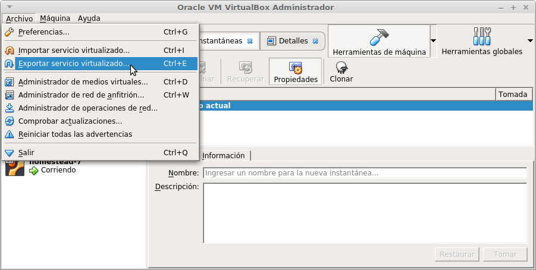

# VirtualBox
Com podem llegir a la Wikipedia:

> Oracle VM VirtualBox es un software de virtualización para arquitecturas x86/amd64, creado originalmente por la empresa alemana innotek GmbH. Actualmente es desarrollado por Oracle Corporation como parte de su familia de productos de virtualización. Por medio de esta aplicación es posible instalar sistemas operativos adicionales, conocidos como «sistemas invitados», dentro de otro sistema operativo «anfitrión», cada uno con su propio ambiente virtual.
>
> Entre los sistemas operativos soportados (en modo anfitrión) se encuentran GNU/Linux, Mac OS X, OS/2 Warp , Microsoft Windows, y Solaris/OpenSolaris, y dentro de ellos es posible virtualizar los sistemas operativos FreeBSD, GNU/Linux, OpenBSD, OS/2 Warp, Windows, Solaris, MS-DOS y muchos otros.
>
> La aplicación fue inicialmente ofrecida bajo una licencia de software privativo, pero en enero de 2007, después de años de desarrollo, surgió VirtualBox OSE (Open Source Edition) bajo la licencia GPL 2. Actualmente existe la versión privativa Oracle VM VirtualBox, que es gratuita únicamente bajo uso personal o de evaluación, y está sujeta a la licencia de "Uso Personal y de Evaluación VirtualBox" (VirtualBox Personal Use and Evaluation License o PUEL) y la versión Open Source, VirtualBox OSE, que es software libre, sujeta a la licencia GPL.
>
> Fuente: http://es.wikipedia.org/wiki/VirtualBox

Una vegada instal·lat el programa instal·larem també la _**VirtualBox Extension Pack**_. És un paquet que inclou funcionalitats com a suport per a dispositius USB 2.0, arrencada de la màquina per xarxa...

En cada màquina virtual que creem tenim l'opció d'instal·lar les _**VirtualBox Guest Additions**_ que inclouen funcionalitats molt útils com:
* integració del ratolí i el teclat per a no haver de prémer una tecla per a canviar el ratolí de la màquina host a la màquina virtual
* suport millorat de vídeo, que permet redimensionar la pantalla i canviar la resolució així com utilitzar acceleració de vídeo 3D i 2D
* que el host sincronitze l'hora en la màquina guest
* compartir carpetes entre la màquina host i la virtual
* compartir el portapapers entre la màquina real i la virtual

En el [manual de VirtualBox](http://www.virtualbox.org/manual/UserManual.html) podem conéixer a fons el funcionament d'aquest programa. Algunes de les coses que ens serà útil conéixer són::

## Compartir carpetes entre la màquina real i la virtual
Una carpeta compartida és una carpeta de l'host accessible des d'una màquina virtual. Es crea des de la màquina en el menú Dispositius -> Carpetes compartides.

A continuació seleccionem la carpeta de l'host a compartir, li mengem un nom per al guest i marquem les opcions que vulguem (com Automontar perquè es munte automàticament i Fer permanent per a continuar tenint la carpeta compartida si reiniciem la màquina virtual).

En fer això ja tindrem la carpeta accessible en una ubicació dins de vboxsvr. Ara faltaria muntar-la per comoditat, per exemple en Windows podríem connectar la unitat de xarxa \\vboxsvr\compartida.
Importar i exportar màquines virtuals.

## Importar i exportar màquinas virtuals
En el menú Arxiu de VirtualBox trobem opcions per a importar i exportar màquines virtuals, anomenades Importar/Exportar servei virtualitzat.

L'exportació crea un arxiu comprimit en el qual es guarda tota la informació de configuració de la màquina virtual, així com tots els seus discos durs amb les dades, aplicacions, etc., del sistema operatiu guest . L'extensió d'aquest tipus de fitxer és **.ova**.

La importació d'un fitxer ova crea una nova màquina virtual exactament igual a la que es va exportar.

## Emmagatzematge en VirtualBox

## La xarxa en Virtualbox

## Snapshots o Instantànies
