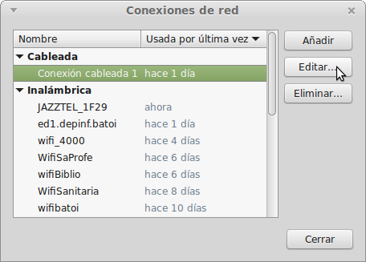
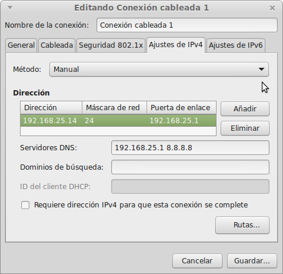
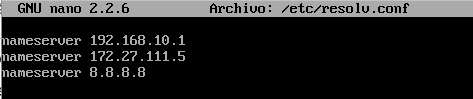
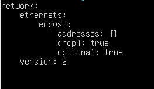
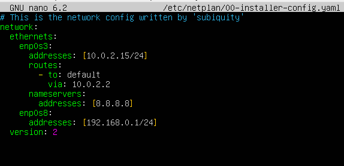
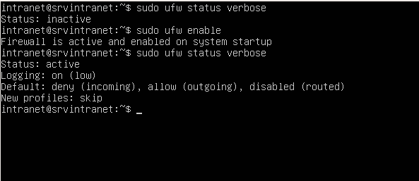

# La xarxa en GNU/Linux
- [La xarxa en GNU/Linux](#la-xarxa-en-gnulinux)
  - [Introducció](#introducció)
    - [Nom de les targetes](#nom-de-les-targetes)
    - [Network Manager (entorn gràfic)](#network-manager-entorn-gràfic)
    - [Netplan vs ifupdown (_Command Line Interface_)](#netplan-vs-ifupdown-command-line-interface)
    - [Veure la configuració de la xarxa](#veure-la-configuració-de-la-xarxa)
    - [Accions més comuns](#accions-més-comuns)
  - [Configurar la xarxa](#configurar-la-xarxa)
    - [Configuració de la xarxa amb Network Manager](#configuració-de-la-xarxa-amb-network-manager)
    - [Configuració de la xarxa amb ifupdown](#configuració-de-la-xarxa-amb-ifupdown)
    - [Configuració de la xarxa amb netplan](#configuració-de-la-xarxa-amb-netplan)
    - [Configuració con systemd-networkd](#configuració-con-systemd-networkd)
    - [Configuració de la xarxa en CentOS](#configuració-de-la-xarxa-en-centos)
      - [Afegir noves targetes](#afegir-noves-targetes)
    - [Configuració en Virtualbox](#configuració-en-virtualbox)
    - [Detectar problemes](#detectar-problemes)
  - [Enrutament](#enrutament)
    - [Habilitar l'enrutament](#habilitar-lenrutament)
    - [Configurar NAT en sistemes netplan](#configurar-nat-en-sistemes-netplan)
    - [Configurar NAT en sistemes amb ifupdown i nftables](#configurar-nat-en-sistemes-amb-ifupdown-i-nftables)
    - [Configurar NAT en sistemes amb ifupdown i iptables](#configurar-nat-en-sistemes-amb-ifupdown-i-iptables)
    - [Configurar NAT en CentOS](#configurar-nat-en-centos)
  - [Solucionar problemes de conectivitat](#solucionar-problemes-de-conectivitat)

## Introducció
La majoria de sistemes GNU/Linux amb entorn gràfic utilitzen el servei **NetworkManager** per a gestionar la xarxa. A més totes tenen un servei per a gestionar-la si la volem configurar-la directament des de la terminal amb els fitxers de configuració, sense utilitzar l'entorn gràfic.

Totes les distribucions GNU/Linux basades en Debian han configurat sempre la xarxa des de la terminal amb el paquet **ifupdown**. Aquest paquet permet configurar-la amb el servei **networking** que guarda la configuració de la xarxa en el fitxer `/etc/network/interfaces` (encara que també es pot configurar des de l'entorn gràfic amb el servei **NetworkManager**).

A partir de Ubuntu 17.10 Canonical ha introduit una nova forma de configurar la xarxa: **netplan**. Ara el servei és **systemd-networkd** i el fitxer de configuració està dins de `/etc/netplan/` i es tracta d'un fitxer en format _YAML_ (on cada subsecció ha d'estar indentada de la secció pare amb uns ESPAIS en blanc). El motiu segons explique és per a superar certes limitacions de _ifupdown_.
La configuració gràfica continua igual amb el **NetworkManager**.

### Nom de les targetes
En GNU/Linux les targetes de xarxa s'identifiquen com **ethX** (eth0, eth1, ...) si són targetes ethernet cablejades o **wlanX** si són targetes WiFi (en ocasions es diuen athX si són wifis Atheros o amb altres noms depenent del fabricant).

El problema és que el nom que se li assigna depèn de quan es configura la targeta en arrancar (la primera serà la _eth0_, la segona la _eth1_) i això podria canviar entre un reinicie i un altre. A més algunes distribucions, com Ubuntu, assignen sempre el mateix nom d'interfície a cada MAC pel que si es desbarata una targeta i la canviem la nova ja no seria eth0 sinó el següent nom no usat. El mateix també passa en les màquines virtuals on podem canviar les MAC de les nostres targetes.

Moltes configuracions (firewall, enrutament, etc) depenen del nom que tinguen les targetes i si aquest canvia deixaran de funcionar correctament. Per a evitar el problema de no saber com es dirà cada interfície de xarxa, les distribucions GNU/Linux utilitzen **Predictable Network Interface Names** que assigna identificadors estables a les interfícies de xarxa basant-se en el tipus (local Ethernet, WLAN, WWAN, etc).

El nom que reben les targetes depen del tipus (**en...** per a les ethernet amb cable, **wl...** per a les _wireless_ o **lo** per a la interfície _loopback_). La resta del nom depen de on està instal·lada (**p** si està _"punxada"_ en un port PCI, USB, etc, la targeta es dirà **enpXsY**; **o** si està en la placa i es dirà **enoX**). En les màquines de VirtualBox la primera sol ser la **emp0s3** i la resta a partir de la **enp0s8**, ...

### Network Manager (entorn gràfic)
Si la nostra distribució és Debian o està basada en ell (com Ubuntu, Linux Mint, Lliurex, ...) i tenim entorn gràfic el servei responsable de la xarxa serà per defecte el **Network Manager**, encara que podem configurar el sistema per a gestionar la xarxa sense aquest servei, utilitzant _netplan_ o _ifupdown_. 

Per a vore o canviar la configuració podem prémer amb el ratolí sobre la icona de la xarxa i triar l'opció de **Configuració de la xarxa**. AIxò obri l'editor del Network Manager:


### Netplan vs ifupdown (_Command Line Interface_)
Per a configurar la xarxa des de la terminal s'utilitzen diferents sistemes segons la distribució utilitzada: les distribucions _Debian_ utilitzen **ifupdown** i les _Ubuntu_ utilitzen **netplan** (abans de la versió 17.10 també utilitzaven _netplan_)

Les principals diferències entre els dos sistemes són, entre uns altres:
* el fitxer de configuració en _ifupdown_ es de text pla (**`/etc/network/interfaces`**) i en _netplan_ és un fitxer _YAML_ que es troba dins de **`/etc/netplan/`**
* el servei que gestiona la xarxa  en _ifupdown_ és **`networking`** i en _netplan_ **`systemd-networkd`**
* en _netplan_ hi ha una nova comanda, **networkctl**, per a veure què dispositius tenim. Amb el paràmetre `status` ens dóna la configuració de cadascun:


Si li posem el nom d'una targeta ens dona la informació de la mateixa:


### Veure la configuració de la xarxa
Abans s'utilitzava el comando `ifconfig` que es troba en el paquet **net-tools** junt a `route` i altres. Les distribucions modernes en compte d'aquest paquet inclouen el paquet **iproute2util** que sustitueix aquest comando pel comando `ip` que és més potent. Per a veure la configuració escrivim:
```bash
ip addr show
```
(o simplement `ip a`). 


Es tracta de la xarxa d'un equip amb la interfície local (_localhost_ o _lo_), una targeta ethernet cablejada (_enp4s0f0_) i una inalàmbrica (_wlp3s0_). Podem veure només un resum d'aquesta informació amb `ip -br a`.


Per a veure la porta d'enllaç el comando és:
```bash
ip route show
```
(o simplement `ip r`)


### Accions més comuns
Tant els antics comandos `ifconfig` com `ip` ens permeten canviar al nostra configuració temporalment (per a canviar-la definitivament hem de fer-ho en els fitxers de configuració):
* desactivar una interfície de xarxa:
  * ip: `ip link set enp0s3 down`
  * ifconfig: `ifconfig enp0s3 down`
* volver-la a activar:
  * ip: `ip link set enp0s3 up`
  * ifconfig: `ifconfig enp0s3 up`
* afegir una nova IP a una interfície:
  * ip: `ip addr add 192.168.100.5/24 dev enp0s3`
  * ifconfig: `ifconfig enp0s3 add 192.168.100.5/24`
* eliminar-la IP:
  * ip: `ip addr del 192.168.100.5/24 dev enp0s3`
  * ifconfig: `ifconfig enp0s3 del 192.168.100.5/24`
* canviar la porta d'enllaç (per exemple que siga la 192.168.1.1):
  * ip: `ip route add default via 192.168.1.1`
  * ifconfig: `route add default gateway 192.168.1.1`

Podeu consultar més comandos en [aquesta pàgina](https://www.tecmint.com/ifconfig-vs-ip-command-comparing-network-configuration/).

## Configurar la xarxa
Tots els canvis que fem amb `ip` o `ifconfig` són temporals i es perden quan reiniciem la xarxa. El servei de xarxa (anomenat **networking** en ifupdown i **systemd-networkd** en netplan) quan s'inicia configura la xarxa amb el contingut del fitxer de configuració (`/etc/network/interfaces` en ifupdown i `/etc/netplan/nom-del-fitxer.yaml` en netplan). Per tant, per a canviar la configuració permanentment hem de canviar-la en aquest fitxer.

Ací veurem com configurar la xarxa en:
* [sistemes amb entorn gràfic, amb Network Manager](#configurtació-de-la-xarxa-amb-Network-Manager)
* [sistemes amb ifupdown (Debian i derivats i Ubuntu fins 17.04)](#configuraci%C3%B3-de-la-xarxa-amb-ifupdown)
* [sistemes amb netplan (Ubuntu des de 17.10 i derivats)](#configuraci%C3%B3-de-la-xarxa-amb-netplan)
* [CentOS](#configuraci%C3%B3-de-la-xarxa-en-centos)
* [Configuració prèvia de Virtualbox](#configuraci%C3%B3-en-virtualbox)

### Configuració de la xarxa amb Network Manager
Per a canviar la configuració podem prémer amb el ratolí sobre la icona de la xarxa i triar l'opció de **Editar les connexions**. AIxò obri l'editor del Network Manager (també es pot obrir des de la terminal amb `nm-connection-editor`):



Al seleccionar la connexió a configurar i prémer el botó **Editar** podem canviar la configuració. En concret anem a la pestanya de **Ajustes de IPv4**. L'opció per defecte és **Automàtica (DHCP)** que ens permet obtindre les dades de la connexió per DHCP sense haver de configurar res. Per a posar nosaltres la IP que vulguem triem el mètode **Manual**:



Ací podem configurar la IP, la màscara, la porta d'enllaç i els DNS i ja tenim la nostra targeta configurada.
 
### Configuració de la xarxa amb ifupdown
El fitxer de configuració de la xarxa és `/etc/network/interfaces`:


La informació que trobem és:
* auto: per a què la interfície s'active automàticament en arrancar l'equip sense haver de fer ifup.
* allow-hotplug: per a què la interfície s'active automàticament en detectar un esdeveniment en la interfície (com que es connecta el cable).
* inet dhcp: per a configurar aquesta interfície per DHCP
* inet static: per a configurar-la estàticament. Haurem d'indicar els seus paràmetres:
  * address: l'adreça IP
  * netmask: la màscara de xarxa
  * gateway: la porta d'enllaç
  * dns-nameservers: servidors DNS (separats per espai)

Un altre exemple amb 2 targetes de xarxa configurades estàticament:


Podem configurar cada interfície de forma:
- estàtica: `iface ethX inet static`
- per dhcp `iface ethX inet dhcp`

Si ho fem estàticament hem d'indicar la IP (_address_), la màscara (_netmask_), la porta d'enllaç si fa falta (_gateway_) i els servidors DNS (_dns-nameservers_). També es pot indicar la xarxa (_network_) i l'adreça de _broadcast_ però no és necessari perquè es pot calcular a partir de la IP i la màscara.

Després de modificar el fitxer de configuració hem de reiniciar el servei de xarxa (amb systemctl):
```bash
systemctl restart networking
```

o (amb el sistema d'inici SysV)
```bash
service networking restart
```

o directament executant l'script:
```bash
/etc/init.d/networking restart
```

En ocasions cal reiniciar la targeta que hem canviat amb `ifdown ethX` i `ifup ethX`.

Els servidors DNS es poden configurar també en el fitxer `/etc/resolv.conf` encara que se sobreescriu el seu contingut amb el que indiquem en `/etc/network/interfícies` en l'apartat _dns-nameservers_ en reiniciar el servei de xarxa pel que s'ha de configurar allí. Un exemple de fitxer és:



A més en el fitxer /etc/hosts podem posar els noms que el nostre propi ordinador ha de resoldre:


Si la nostra màquina té una IP fixa hauríem d'afegir-la ací també al costat del nom del host.

### Configuració de la xarxa amb netplan
El nou fitxer de configuració és un fitxer que trobem dins de `/etc/netplan/`. Es tracta d'un fitxer _YAML_ el que significa que cada opció va en una línia i si una opció és una subopció de l'anterior ha d'anar indentada cap a dins amb espais (ATENCIÓ han de ser espais, no serveix tabulador).

Exemple de fitxer d'una màquina amb una única targeta configurada per DHCP:



Si volem configurar una altra targeta i que siguen ambdues estàtiques:



**ATENCIÓ**: ha d'haver-hi un espai entre els : i el valor de l'opció i no pot haver-hi espais al final d'una línia.

Perquè s'apliquen els canvis no és necessari reiniciar el servei de xarxa sinó que n'hi ha prou amb fer:
```bash
netplan apply
```

Si volem obtindre més informació de què fa o si hi ha errors li posem l'opció `--debug`:
```bash
netplan --debug apply
```

També podem utilitzar el paràmetre `try` en compte de `apply` per a que ens mostre que farà abans de decidir si volem que es canvie o no la configuració de la xarxa.

Si volem fer la configuració des de l'entorn gràfic amb **NetworkManager** ho indiquem en el fitxer que hi ha en `/etc/netplan/`, posant-ho com a renderer:


Aquesta és l'opció per defecte en distribucions amb entorn gràfic. Si volem tornar a utilitzar el fitxer canviarem el renderer a **systemd** (o eliminem la línia ja que systemd és l'opció per defecte):
```bash
network:
  renderer: systemd
  version: 2
  ethernets:
    ...
```

### Configuració con systemd-networkd
_**systemd-networkd**_ es un dimoni del sistema que gestiona les configuracions de xarxa. Detecta i configura els dispositius de xarxa segons es detecten i també pot crear dispositius de xarxa virtuals.

Per a usar _**systemd-networkd**_ cal iniciar/activar el servei `systemd-networkd.service`.

Totes les configuracions es guarden en fitxers en `/etc/systemd/network` de tipus `.network`, `.netdev` i `.link`. 

Exemples
- Adaptador cablejat utilitzant DHCP: `/etc/systemd/network/wired.network`
```ini
[Match]
Name=enp1s0

[Network]
DHCP=ipv4
```

- Adaptador cablejat utilitzat una IP estàtica: `/etc/systemd/network/static.network`
```ini
[Match]
Name=enp1s0

[Network]
Address=10.1.10.9/24
Gateway=10.1.10.1
DNS=10.1.10.1
#DNS=8.8.8.8
```

Més informació:
- [Systemd-networkd wiki Debian](https://wiki.debian.org/SystemdNetworkd)
- [Systemd-networkd wiki Arch Linux](https://wiki.archlinux.org/title/Systemd-networkd_(Espa%C3%B1ol))

### Configuració de la xarxa en CentOS
La configuració es similar a la de netplan i utilitzem també el comando `ip`. Però en compte d'un fitxer on es configuren totes les targetes cadascuna té el seu propi fitxer de configuració en **`/etc/sysconfig/network-scripts/ifcfg-enp0sX`**.

Les principals opcions que hem de configurar són:
* ONBOOT=yes
* BOOTPROTO=dhcp

L'opció ONBOOT indica al sistema que ha d'activar la targeta al iniciar el servei _network_ (igual que _auto_ en Ubuntu). BOOTPROTO indica com es configurarà la xarxa i potser _dhcp_, _static_ o _none_.

Si volem configurar la targeta estàticament posarem:
* BOOTPROTO=static
* IPADRR=10.0.2.15 (la IP, si es configura static)
* PREFIX=24 (la màscara)
* GATEWAY=10.0.2.2 (la porta d'enllaç predeterminada de la interfície)
* DNS1=8.8.8.8 (el primer DNS)
* DNS2=9.9.9.9 (el segon DNS, podem posar més)

Si no volem usar IPv6:
* IPV6INIT=no
* IPV6_AUTOCONF=no

A més de configurar la xarxa canviant directament els fitxers podem utilitzar l'eina `nmcli` que és el client del **NetworkManager**. Fins i tot tenim una interfície de text anomenada `nmtui` (_NetworkManager Text User Interface_) que ens permet configurar la xarxa com es fa des de l'entorn gràfic. Podem obtindre informació de com utilitzar aquestes eines en pàgines com [LinuxConfig: How to configure a static IP address on RHEL 8 / CentOS 8 Linux](https://linuxconfig.org/rhel-8-configure-static-ip-address).

Per a reiniciar el servei de xarxa es recomana utilitzar el comando `nmcli`:
```bash
nmcli nerworking off
nmcli nerworking on
```

Encara que també el podem reiniciar amb `systemctl`
```bash
systemctl restart NetworkManager.service
```
NOTA: En CentOS 7 i anteriors el servei en un sistema sense interfície gràfica és **network.service** i no tenim el comando `nmcli`. Si te interfície gràfica el servei encarregat de la xarxa és també **NetworkManager** i és el que haurem de reiniciar. 

#### Afegir noves targetes
Si hem afegit posteriorment una nova targeta no es crea el seu fitxer de configuració dins de **/etc/sysconfig/network-scripts/**. Si tenim entorn gràfic seleccionem la nova interfície i polsem la icona de afegir perfil (+) que apareix a la seua dreta.

Si no el tenim poder crear-ho manualment però és molt més senzill fer-ho amb `nmtui`. Al obrir-ho seleccinem _'Modificar una connexió'_ i com no ens apareix polsem sobre _'Afegir'_ i seleccionem el tipus de targeta (en el nostre cas _Ethernet_). Ens apareix una finestra on configurar la nova targeta:


El que ens pregunta és:
- Nom del perfil: el nom del fitxer on es guardarà. Normalment posem el nom de la targeta
- Dispossitiu: el nom de la targeta que es gestionarà amb aquest fitxer
- Ethernet: no cal configurar res
- Configuració IPv4: podem triar 'Desactivat', 'Automàtic' (per DHCP), 'Manual',... Si triem _'Manual'_ hem de configurar els parèmetres de xarxa polsant en _'Mostrar'_
- Configuració IPv6: igual per a IPv6
- Connectar de forma automàtica: per a que s'active al reiniciar l'equip
- Disponible per a tots els usuaris: la marcarem igual que l'anterior

Això crea el fitxer **ifcfg-NomDelPerfil**. Reiniciem la xarxa i ja tenim la targeta funcionant.

### Configuració en Virtualbox
Si volem configurar una màquina virtual que siga el servidor de una xarxa de màquines virtuals clients haurà de tindre al menys 2 targetes de xarxa: una 'externa' per a connectar-se a l'enterior i una interna per a cada xarxa interna de clients que vulga connectar. Cada targeta interna la configurarem en VirtualBox com a 'Xarxa interna' i li assignarem un nom (és com si fóra el nom del switch al que es connecta el seu cable). Per a la interfície externa Virtualbox ens ofereix 2 opcions:
* **Adaptador pont**: la màquina serà una més de la xarxa real i es podrà accedir a ella des de qualsevol equip de la xarxa. Per tant la seua IP ha de ser una IP de la xarxa. El problema és que la xarxa en l'aula i a casa són diferents per la qual cosa la configuració que funciona a casa no ho fa en l'aula.
* **NAT**: en aquest cas formen part d'una xarxa virtual que crea VirtualBox en la qual només estem nosaltres i el gateway que ens dóna eixida a l'exterior (amb la IP 10.0.2.2). L'avantatge és que aquesta configuració funciona en qualsevol lloc (perquè el 10.0.2.2 ens dóna eixida a l'ordinador real que ens trau en Internet) però des de fora d'aqueixa xarxa no es pot accedir a la nostra màquina (fins i tot no es pot accedir des de la màquina amfitrió).

### Detectar problemes
Si la xarxa no funciona podem veure els missatges d'inici relacionats amb la xarxa amb:
```bash
dmesg | grep eth
```
o si el nom de les nostrres targetes és enpXsY
```bash
dmesg | grep enp
```

## Enrutament
Si estem configurant un servidor de comunicacions que proporcione eixida a l'exterior a una xarxa haurà de tindre al menys 2 targetes de xarxa:
* la externa que li comunica amb l'exterior (el router o altre equip que fa de porta d'enllaç)
* una o més targetes internes conectades als switches on estan els equips de la xarxa que han d'eixir per ell

Una vegada totes les targetes estiguen correctament configurades com hem vist en l'apartat anterior, perquè els clients tinguen accés a Internet haurem de configurar l'enrutamient en el servidor, la qual cosa permetrà als paquets que arriben per les targetes internes eixir a través de la targeta externa. 

Si es tracta d'una màquina virtual la targeta interna la configurarem en VirtualBox com a 'Xarxa interna' i li assignarem un nom (és com si fóra el nom del switch al que es connecta el seu cable). Per a la interfície externa Virtualbox ens ofereix 2 opcions:
* Adaptador pont: la màquina serà una més de la xarxa real i es podrà accedir a ella des de qualsevol equip de la xarxa. Per tant la seua IP ha de ser una IP de la xarxa. El problema és que la xarxa en l'aula i a casa són diferents per la qual cosa la configuració que funciona a casa no ho fa en l'aula.
* NAT: en aquest cas formen part d'una xarxa virtual que crea VirtualBox en la qual només estem nosaltres i el gateway que ens dóna eixida a l'exterior (amb la IP 10.0.2.2). L'avantatge és que aquesta configuració funciona en qualsevol lloc (perquè el 10.0.2.2 ens dóna eixida a l'ordinador real que ens trau en Internet) però des de fora d'aqueixa xarxa no es pot accedir a la nostra màquina (fins i tot no es pot accedir des de la màquina amfitrió).

Per a configurar l'enrutament hem de fer 2 accions:
1. [habilitar l'enrutament](#habilitar-lenrutament), que es fa igual tant en ifupdown com en netplan
2. configurar NAT (serà diferent si usem [netplan](#configurar-nat-en-sistemes-netplan) o [ifupdown](#configurar-nat-en-sistemes-amb-ifupdown-i-iptables))

### Habilitar l'enrutament
L'enrutament el que fa és redirigir a la targeta de xarxa externa el tràfic de la targeta interna amb destinació a altres xarxes (com Internet).

Per a habilitar l'enrutament editem el fitxer `/etc/sysctl.conf` i descomentem la línia:
```bash
net.ipv4.ip_forward=1
```

En sistemes amb netplan podem utilitzar el fitxer `/etc/ufw/sysctl.conf` que ho habilitarà quan iniciem el Firewal **ufw**. En CentOS ja està habilitat per defecte (si tinguerem que afegir opcions ho faríem en el fitxer `/etc/sysctl.d/99-sysctl.conf`)

Perquè faça efecte hem de recarregar la configuració amb:
```bash
sysctl -p
```

També podem habilitar-ho temporalment, fins que reiniciem la màquina, executant l'ordre
```bash
echo 1 > /proc/sys/net/ipv4/ip_forward
```

(si en comptes de echo 1 posem echo 0 ho deshabilitem).

Per a comprovar si està habilitat executem l'ordre
```bash
cat /proc/sys/net/ipv4/ip_forward
```

(si retorna 1 és que està habilitat i 0 és que està deshabilitat).

### Configurar NAT en sistemes netplan
Amb netplan s'utilitza el Firewal **ufw** (_uncomplicated firewall_) i és l'encarregat de gestional el NAT. Per defecte està desactivat i podem activar-ho o desactivar-ho amb els comandos `ufw enable` i `ufw disable`. Per a veure la configuració executem:

```bash
ufw status verbose
```



Per a configurar NAT hem d'**activar ufw** i realitzar les següents accions:
* Editar el fitxer `/etc/default/ufw` i canviar la línia `DEFAULT_FORWARD_POLICY="DROP"` per

```bash
DEFAULT_FORWARD_POLICY="ACCEPT"
```

* Editar el titxer `/etc/ufw/before.rules` i afegir les següents línies al principi (abans de les regles de filtrat _\*filter_). Aquest exemple és per a enrutar la xarxa interna 192.168.226.0:

```bash
# NAT table rules
*nat
:POSTROUTING ACCEPT [0:0]

# Forward traffic through eth0 - Change to match you out-interface
-A POSTROUTING -s 192.168.226.0/24 -o enp0s3 -j MASQUERADE

# don't delete the 'COMMIT' line or these nat table rules won't be processed
COMMIT
```

Només queda reiniciar el Firewall (`ufw reload`). Per a comprovar les regles que estan aplicant-se executem el comando `iptables`:

```bash
iptables -t nat -L
```


Si volem eliminar totes les regles que tenim ara en iptables (per a tornar-las a posar o per si ens hem equivocat):

```bash
iptables  -t nat -F
```

**NOTA**: Si fem la configuració de l’enrutament des de **Webmin** tot funciona igual però s’enrutament l’activa en `/etc/sysctl.conf` (no en /etc/ufw/sysctl.conf) i les regles de nat les guarda en /etc/iptables.up.rules (en compte de en /etc/ufw/before.rules) i les carrega afegint la següent línia a /etc/network/interfaces:

```bash
post-up iptables restore < /etc/iptables.up.rules
```

### Configurar NAT en sistemes amb ifupdown i nftables
Des de _Debian 10 (Buster)_  **[nftables](https://wiki.debian.org/nftables)** reemplaça a *iptables* que tenia certes limitacions. El comando per a configurar-les és `ntf`.

Podem utilitzar _nftables_ en distribucions antigues que no ho porten per defecte, només hem d'instal·lar-les i configurar-les:

```bash
apt install nftables
systemctl enable nftables.service
```

Per a [crear les regles d'enrutament NAT](https://wiki.nftables.org/wiki-nftables/index.php/Performing_Network_Address_Translation_(NAT)) crearem una nova taula _nat_ on activem _prerouting_ i _postrouting_:

```bash
nft add table nat
```

Per a vore les tables creades executem `nft list tables`.Si volem borrar-la farem `nft delete table nat`. Ara creem la cadena de postrouting:

```bash
nft add chain nat postrouting { type nat hook postrouting priority 100 \;}
```

I a continuació afegim les regles que vulgam. Per exemple si la nostra targeta externa és la **enp0s3** amb IP **10.0.2.20** i volem enrutar la xarxa interna **192.168.101.0**, el comando per a fer-ho seria::

```bash
nft add rule nat postrouting ip saddr 192.168.101.0/24 oif enp0s3 snat 10.0.2.20
```

El que indiquem és d'on provindrà el tràfic a enrutar (**saddr** xarxa interna/màscara, és a dir, `saddr 192.168.101.0/24`) a quina targeta s'enviarà (**oif** targeta externa, és a dir, `oif enp0s3`) i que enrute a la IP que tinga la targeta externa (`snat 10.0.2.20`). Si nostra IP externa pot canviar perquè estiga per DHCP hem de posar en compte de_snat_ l'opció `masquerade`.

Si hem d'enrutar més d'una xarxa interna (per exemple la **192.168.101.0** i  la **192.168.102.0**) executem aquest comando per a cada xarxa a enrutar:

```bash
nft add rule nat postrouting ip saddr 192.168.101.0/24 oif enp0s3 masquerade
nft add rule nat postrouting ip saddr 192.168.102.0/24 oif enp0s3 masquerade
```

Per a veure les regles que tenim establertes ara fem:

```bash
nft list ruleset
```

Podem borrar totes les regles amb:

```bash
nft flush ruleset
```

I per a tindre eixes regles actives al iniciar el servei hem de guardar-les en el fitxer de configuració de _nftables_ en **/etc/nftables.conf**. Podem fer-ho amb:

```bash
nft list ruleset > /etc/nftables.conf
```

### Configurar NAT en sistemes amb ifupdown i iptables
Es recomana utilitzar _nftables_ en compte de _iptables_ que és una implementació més antiga i llimitada.

Per a configurar NAT hem d'afegir regles a _iptables_. Per exemple si la nostra targeta externa és la **enp0s3** amb IP **10.0.2.20** i la nostra xarxa interna és la **192.168.101.0** el comando per a activar NAT seria:

```bash
iptables -t nat -A POSTROUTING -s 192.168.101.0/24 -o enp0s3 -j MASQUERADE
```

El que indiquem és d'on provindrà el tràfic a enrutar (**-s** xarxa interna/màscara, és a dir, `-s 192.168.10.0/24`) a quina targeta s'enviarà (**-o** targeta externa, és a dir, `-o enp0s3`) i que enrute a la IP que tinga la targeta externa (`-j MASQUERADE`). Si nostra IP externa sempre serà la mateixa podem posar l'opció `-j SNAT --to 10.0.2.20` (on 10.0.2.20 seria la IP externa) en compte de _-j MASQUERADE_.

Si hem d'enrutar més d'una xarxa interna repetirem aquest comando per a cada xarxa a enrutar:

```bash
iptables -t nat -A POSTROUTING -s 192.168.102.0/24 -o enp0s3 -j MASQUERADE
```

Per a evitar haver d'executar aquest comando cada vegada que reiniciem el sistema tenm 2 opcins:
- posar-ho en un script que executarem a l'arrencar l'equip
- instal·larem el paquet **iptables-persistent** 

Si instal·lem _iptables-persistent_ ens pregunta si emmagatzema la configuració actual de iptables (v4 i v6). Si li hem dit que sí cada vegada que reiniciem el sistema carregarà automàticament aquesta configuració. Si posteriorment fem modificacions en les iptables per a que ens torne a preguntar si guarda els canvis farem

```bash
dpkg-reconfigure iptables-persistent
```

Per a comprovar si el nostre sistema està fent NAT executem l'ordre:

```bash
iptables -t nat - L
```


Si volem eliminar totes les regles que tenim ara en iptables (per a tornar-las a posar o per si ens hem equivocat):

```bash
iptables  -t nat -F
```

### Configurar NAT en CentOS
En CentOS també s'utilitza un firewall per a gestionar els paquets de les diferents interfícies pel que hem de configurar-ho. Hi ha diferents zones ja creades (public, dmz, external, internal, ...) i hem de configurar les zones internal i external que són les que usarem.

Per a aquest exemple tenim les targetes:
* externa: enp0s3 amb IP 10.0.2.10
* interna: enp0s8 amb IP 192.168.100.1

En primer lloc assignem a la zona internal la seua targeta de xarxa:

```bash
firewall-cmd --change-interface=enp0s8 --zone=internal --permanent
```

Fem el mateix amb la zona external:

```bash
firewall-cmd --change-interface=enp0s3 --zone=external --permanent
```

Posem com a zona per defecte la internal (abans era public):

```bash
firewall-cmd --set-default-zone=internal
```

Ara configurem l'enrutament entre les targetes interna i externa:

```bash
firewall-cmd --permanent --direct --passthrough ipv4 -t nat -I POSTROUTING -s 192.168.100.0/24 -o enp0s3 -j SNAT --to 10.0.2.10
```
(com hem dit quan parlavem d'ifupdown, en compte de `-j SNAT --to ...` podem posar `-j MASQUERADE`)

Finalment només queda reiniciar el firewall:

```bash
firewall-cmd --reload
firewall-cmd --complete-reload
```

Podem veure les regles que estan aplicant-se igual que hem vist al parlar d'ifupdown.

## Solucionar problemes de conectivitat
Com hem vist hi ha moltes coses a configurar per a que un equip puga connectar-se amb internet. Per això si no hi ha connexió els motius poden ser molt variats. 

Si tenim un mètode de què comprovar evitarem "tocar" configuracions que tenim correctament per provar coses. Els pasos a fer són:

1. **Vore la configuració de la xarxa** d'eixe equip per a comprovar que tot és correcte (IP, màscara, porta d'enllaç i DNS). Ho farem amb `networkctl status` (si és un client Windows amb `ipconfig /all`)

2. **Fer un `ping` a la porta d'enllaç**. Si la configuració és correcta fem un _ping_ a la porta d'enllaç que ens ha mostrat el comando del pas anterior. Si falla pot ser:
  - _ip i gw estan en xarxes diferents_: recorda que la ip ha d'estar en la mateixa xarxa que la porta d'enllaç
  - _el cable_: el cable que ix del nostre equip ha d'arribar al mateix switch al que va el de la nostra porta d'enllaç. Si és una màquina virtual s'hem d'assegurar que el nom de la targeta interna del client i del servidor és el mateix (és el nom del switch virtual que es crea)
  - _el firewall_: el firewall dels Windows clients (Windows 10, ...) NO permet el pas dels pings. Per això no farem ping al client sinó des del client al servidor. Si hem de fer ping a un client Windows abans hem de afegir una regla al seu firewall per a mpermetre els paquets ICMP (o deshabilitar el firewall mentre fem el ping)

3. **Fer un `ping` a un equip de fora de la xarxa**. Si el ping anterior ha funcionat farem un ping a un equip de fora, per exemple al 8.8.8.8 (si estem en l'institut podem fer-ho al nostre servidor 172.16.20.1 perquè el router no deixa eixir els pings fora). Si falla és
  - _l'enrutament_: en la nostra porta d'enllaç no s'ha fet l'enrutament correctament i tenim que arreglar-lo

4. **Fer un `nslookup`** per a comprovar el DNS. El farem  a algun servidor de internet (per exemple a _google.com_) i si estem dins d'un domini també al nostre domini. Si falla:
  - Si fallen els 2 `nslookup` és que no hem posat una adreça de DNS en el nostre equip o la que hem posat no és un servidor DNS
  - Si falla el del nostre domini però funciona el de _google.com_ és que el nostre DNS no és el DC del nostre domini i per tant no sap que hem creat un domini (per exemple hem posat 8.8.8.8 però Google no sap que tenim un domini propi)
  - Si funciona el del domini pero falla el de _google.com_ és que el DNS en el nostre DC no funciona correctament o no te bé el seu _reenviador_ (que hauria de ser, per exemple, el DNS de Google)

Si funcionen correctament aquestes 4 coses la nostra xarxa està perfectament configurada.