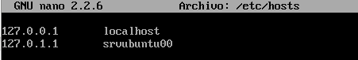

- [La xarxa en GNU/Linux](./README.md#la-xarxa-en-gnulinux)
  - [Nom de les targetes](./README.md#nom-de-les-targetes)
  - [Netplan vs ifupdown](./README.md#netplan-vs-ifupdown)
  - [Veure la configuració amb ifupdown](./README.md#veure-la-configuraci%C3%B3-amb-ifupdown)
  - [Veure la configuració amb netplan (Ubuntu 17.10 i posteriors)](./README.md#veure-la-configuraci%C3%B3-amb-netplan)
  - [Accions més comuns](./README.md#accions-m%C3%A9s-comuns)
  - [Configurar la xarxa](#configurar-la-xarxa)
    - [Configuració de la xarxa amb ifupdown](#configuraci%C3%B3-de-la-xarxa-amb-ifupdown)
    - [Configuració de la xarxa amb netplan (Ubuntu 17.10 i posteriors)](#configuraci%C3%B3-de-la-xarxa-amb-netplan)
    - [Configuració de la xarxa en CentOS](#configuraci%C3%B3-de-la-xarxa-en-centos)
    - [Detectar problemes](#detectar-problemes)
  - [Enrutament](./enrutament.md#enrutament)
    - [Habilitar l’enrutament](./enrutament.md#habilitar-lenrutament)
    - [Configurar NAT en sistemes amb ifupdown](./enrutament.md#configurar-nat-en-sistemes-amb-ifupdown)
      - [Configurar NAT en sistemes amb ifupdown i nftables (Debian 10 i posteriors)](./enrutament.md#configurar-nat-en-sistemes-amb-ifupdown-i-nftables)
    - [Configurar NAT en sistemes netplan (Ubuntu 17.10 i posteriors)](./enrutament.md#configurar-nat-en-sistemes-netplan)
    - [Configurar NAT en CentOS](./enrutament.md#configurar-nat-en-centos)

## Configurar la xarxa
Tots els canvis que fem amb el comando `ifconfig` o `ip` són temporals i es perden quan reiniciem la xarxa. El servei de xarxa (anomenat **networking** en ifupdown i **systemd-networkd** en netplan), quan s'inicia configura la xarxa amb el contingut del fitxer de configuració (`/etc/network/interfaces` en ifupdown i `/etc/netplan/nom-del-fitxer.yaml` en netplan). Per tant, per a canviar la configuració permanentment hem de canviar-la en aquest fitxer.

Ací veurem com configurar la xarxa en:
* [sistemes amb ifupdown (Ubuntu fins 17.04 i altres distribucions)](#)
* [sistemes amb netplan (Ubuntu des de 17.10 i altres distribucions)](#)
* [CentOS](#)
* [Configuració prèvia de Virtualbox](#)

### Configuració de la xarxa amb ifupdown
El fitxer de configuració de la xarxa és `/etc/network/interfaces`:


La informació que trobem és:
* auto: per a què la interfície s'active automàticament en arrancar l'equip sense haver de fer ifup.
* allow-hotplug: per a què la interfície s'active automàticament en detectar un esdeveniment en la interfície (com que es connecta el cable).
* inet dhcp: per a configurar aquesta interfície per DHCP
* inet static: per a configurar-la estàticament. Haurem d'indicar els seus paràmetres:
  * address: l'adreça IP
  * netmask: la màscara de xarxa
  * gateway: la porta d'enllaç
  * dns-nameservers: servidors DNS (separats per espai)

Un altre exemple amb 2 targetes de xarxa configurades estàticament:


Podem configurar cada interfície de forma estàtica (iface ethX inet static) o per dhcp (iface ethX inet dhcp). Si ho fem estàticament hem d'indicar la IP (address), la màscara (netmask), la porta d'enllaç si fa falta (gateway) i els servidors DNS (dns-nameservers). També es pot indicar la xarxa (network) i l'adreça de broadcast però no és necessari perquè es pot calcular a partir de la IP i la màscara.

Després de modificar el fitxer de configuració hem de reiniciar el servei de xarxa (amb systemctl):
```bash
systemctl restart networking
```

o (amb el sistema d'inici SysV)
```bash
service networking restart
```

o directament executant l'script:
```bash
/etc/init.d/networking restart
```

En ocasions cal reiniciar la targeta que hem canviat amb `ifdown ethX` i `ifup ethX`.

Els servidors DNS es poden configurar també en el fitxer `/etc/resolv.conf` encara que se sobreescriu el seu contingut amb el que indiquem en `/etc/network/interfícies` en l'apartat _dns-nameservers_ en reiniciar el servei de xarxa pel que s'ha de configurar allí. Un exemple de fitxer és:


A més en el fitxer /etc/hosts podem posar els noms que el nostre propi ordinador ha de resoldre:



Si la nostra màquina té una IP fixa hauríem d'afegir-la ací també al costat del nom del host.

### Configuració de la xarxa amb netplan
El nou fitxer de configuració és un fitxer que trobem dins de `/etc/netplan/`. Es tracta d'un fitxer _YAML_ el que significa que cada opció va en una línia i si una opció és una subopció de l'anterior ha d'anar indentada cap a dins amb espais (ATENCIÓ han de ser espais, no serveix tabulador).

Exemple de fitxer d'una màquina amb una única targeta configurada per DHCP:


Si volem configurar una altra targeta i que siguen ambdues estàtiques:


**ATENCIÓ**: ha d'haver-hi un espai entre els : i el valor de l'opció i no pot haver-hi espais al final d'una línia.

Perquè s'apliquen els canvis no és necessari reiniciar el servei de xarxa sinó que n'hi ha prou amb fer:
```bash
netplan apply
```

Si volem obtindre més informació de què fa o si hi ha errors li posem l'opció `--debug`:
```bash
netplan --debug apply
```

També podem utilitzar el paràmetre `try` en compte de `apply` per a que ens mostre que farà abans de decidir si volem que es canvie o no la configuració de la xarxa.

Si volem fer la configuració des de l'entorn gràfic amb **NetworkManager** ho indiquem en el fitxer que hi ha en `/etc/netplan/`, posant-ho com a renderer:


Aquesta és l'opció per defecte en distribucions amb entorn gràfic. Si volem tornar a utilitzar el fitxer canviarem el renderer a **systemd** (o eliminem la línia ja que systemd és l'opció per defecte):
```bash
network:
  renderer: systemd
  version: 2
  ethernets:
    ...
```

### Configuració de la xarxa en CentOS
La configuració es similar a la de netplan i utilitzem també el comando `ip`. Però en compte d'un fitxer on es configuren totes les targetes cadascuna té el seu propi fitxer de configuració en **`/etc/sysconfig/network-scripts/ifcfg-enp0sX`**.

Les principals opcions que hem de configurar són:
* ONBOOT=yes
* BOOTPROTO=dhcp

L'opció ONBOOT indica al sistema que ha d'activar la targeta al iniciar el servei _network_ (igual que _auto_ en Ubuntu). BOOTPROTO indica com es configurarà la xarxa i potser _dhcp_, _static_ o _none_.

Si volem configurar la targeta estàticament posarem:
* BOOTPROTO=static
* IPADRR=10.0.2.15 (la IP, si es configura static)
* PREFIX=24 (la màscara)
* GATEWAY=10.0.2.2 (la porta d'enllaç predeterminada de la interfície)
* DNS1=8.8.8.8 (el primer DNS)
* DNS2=9.9.9.9 (el segon DNS, podem posar més)

Si no volem usar IPv6:
* IPV6INIT=no
* IPV6_AUTOCONF=no

A més de configurar la xarxa canviant directament els fitxers podem utilitzar l'eina `nmcli` que és el client del **NetworkManager**. Fins i tot tenim una interfície de text anomenada `nmtui` (_NetworkManager Text User Interface_) que ens permet configurar la xarxa com es fa des de l'entorn gràfic. Podem obtindre informació de com utilitzar aquestes eines en pàgines com [LinuxConfig: How to configure a static IP address on RHEL 8 / CentOS 8 Linux](https://linuxconfig.org/rhel-8-configure-static-ip-address).

Per a reiniciar el servei de xarxa es recomana utilitzar el comando `nmcli`:
```bash
nmcli nerworking off
nmcli nerworking on
```

Encara que també el podem reiniciar amb `systemctl`
```bash
systemctl restart NetworkManager.service
```
NOTA: En CentOS 7 i anteriors el servei en un sistema sense interfície gràfica és **network.service** i no tenim el comando `nmcli`. Si te interfície gràfica el servei encarregat de la xarxa és també **NetworkManager** i és el que haurem de reiniciar. 

#### Afegir noves targetes
Si hem afegit posteriorment una nova targeta no es crea el seu fitxer de configuració dins de **/etc/sysconfig/network-scripts/**. Si tenim entorn gràfic seleccionem la nova interfície i polsem la icona de afegir perfil (+) que apareix a la seua dreta.

Si no el tenim poder crear-ho manualment però és molt més senzill fer-ho amb `nmtui`. Al obrir-ho seleccinem _'Modificar una connexió'_ i com no ens apareix polsem sobre _'Afegir'_ i seleccionem el tipus de targeta (en el nostre cas _Ethernet_). Ens apareix una finestra on configurar la nova targeta:


El que ens pregunta és:
- Nom del perfil: el nom del fitxer on es guardarà. Normalment posem el nom de la targeta
- Dispossitiu: el nom de la targeta que es gestionarà amb aquest fitxer
- Ethernet: no cal configurar res
- Configuració IPv4: podem triar 'Desactivat', 'Automàtic' (per DHCP), 'Manual',... Si triem _'Manual'_ hem de configurar els parèmetres de xarxa polsant en _'Mostrar'_
- Configuració IPv6: igual per a IPv6
- Connectar de forma automàtica: per a que s'active al reiniciar l'equip
- Disponible per a tots els usuaris: la marcarem igual que l'anterior

Això crea el fitxer **ifcfg-NomDelPerfil**. Reiniciem la xarxa i ja tenim la targeta funcionant.

### Configuració en Virtualbox
Si volem configurar una màquina virtual que siga el servidor de una xarxa de màquines virtuals clients haurà de tindre al menys 2 targetes de xarxa: una 'externa' per a connectar-se a l'enterior i una interna per a cada xarxa interna de clients que vulga connectar. Cada targeta interna la configurarem en VirtualBox com a 'Xarxa interna' i li assignarem un nom (és com si fóra el nom del switch al que es connecta el seu cable). Per a la interfície externa Virtualbox ens ofereix 2 opcions:
* **Adaptador pont**: la màquina serà una més de la xarxa real i es podrà accedir a ella des de qualsevol equip de la xarxa. Per tant la seua IP ha de ser una IP de la xarxa. El problema és que la xarxa en l'aula i a casa són diferents per la qual cosa la configuració que funciona a casa no ho fa en l'aula.
* **NAT**: en aquest cas formen part d'una xarxa virtual que crea VirtualBox en la qual només estem nosaltres i el gateway que ens dóna eixida a l'exterior (amb la IP 10.0.2.2). L'avantatge és que aquesta configuració funciona en qualsevol lloc (perquè el 10.0.2.2 ens dóna eixida a l'ordinador real que ens trau en Internet) però des de fora d'aqueixa xarxa no es pot accedir a la nostra màquina (fins i tot no es pot accedir des de la màquina amfitrió).

### Detectar problemes
Si la xarxa no funciona podem veure els missatges d'inici relacionats amb la xarxa amb:
```bash
dmesg | grep eth
```
o si el nom de les nostrres targetes és enpXsY
```bash
dmesg | grep enp
```

# [<- La Xarxa en GNU/Linux](./#la-xarxa-en-gnulinux)
# [-> Enrutament](./enrutament.html#enrutament)
