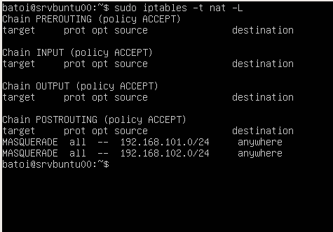
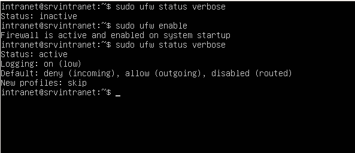
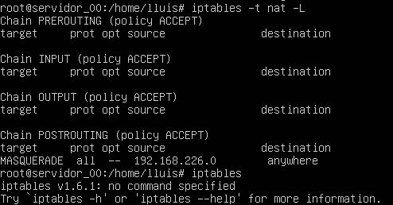

- [La xarxa en GNU/Linux](./README.md#la-xarxa-en-gnulinux)
  - [Nom de les targetes](./README.md#nom-de-les-targetes)
  - [Netplan vs ifupdown](./README.md#netplan-vs-ifupdown)
  - [Veure la configuració amb ifupdown](./README.md#veure-la-configuraci%C3%B3-amb-ifupdown)
  - [Veure la configuració amb netplan](./README.md#veure-la-configuraci%C3%B3-amb-netplan)
  - [Accions més comuns](./README.md#accions-m%C3%A9s-comuns)
  - [Configurar la xarxa](./config.md#configurar-la-xarxa)
    - [Configuració de la xarxa amb ifupdown](./config.md#configuraci%C3%B3-de-la-xarxa-amb-ifupdown)
    - [Configuració de la xarxa amb netplan](./config.md#configuraci%C3%B3-de-la-xarxa-amb-netplan)
    - [Configuració de la xarxa en CentOS](./config.md#configuraci%C3%B3-de-la-xarxa-en-centos)
    - [Detectar problemes](./config.md#detectar-problemes)
  - [Enrutament](#enrutament)
    - [Habilitar l’enrutament](./enrutament.md#habilitar-lenrutament)
    - [Configurar NAT en sistemes amb ifupdown](#configurar-nat-en-sistemes-amb-ifupdown)
    - [Configurar NAT en sistemes netplan](#configurar-nat-en-sistemes-netplan)
    - [Configurar NAT en CentOS](#configurar-nat-en-centos)


## Enrutament
Si estem configurant un servidor de comunicacions que proporcione eixida a l'exterior a una xarxa haurà de tindre 2 targetes de xarxa:
* la externa que li comunica amb l'exterior (el router o altre equip que fa de porta d'enllaç)
* la interna conectada al switch on estan els equips de la xarxa que han d'eixir per ell

Una vegada les 2 targetes estiguen correctament configurades com hem vist en l'apartat anterior, perquè els clients tinguen accés a Internet haurem de configurar l'enrutamient en el servidor, la qual cosa comporta 2 accions:
* habilitar l'enrutament
* configurar NAT (serà diferent si usem ifupdown o netplan)

Si es tracta d'una màquina virtual la targeta interna la configurarem en VirtualBox com a 'Xarxa interna' i li assignarem un nom (és com si fóra el nom del switch al que es connecta el seu cable). Per a la interfície externa Virtualbox ens ofereix 2 opcions:
* Adaptador pont: la màquina serà una més de la xarxa real i es podrà accedir a ella des de qualsevol equip de la xarxa. Per tant la seua IP ha de ser una IP de la xarxa. El problema és que la xarxa en l'aula i a casa són diferents per la qual cosa la configuració que funciona a casa no ho fa en l'aula.
* NAT: en aquest cas formen part d'una xarxa virtual que crea VirtualBox en la qual només estem nosaltres i el gateway que ens dóna eixida a l'exterior (amb la IP 10.0.2.2). L'avantatge és que aquesta configuració funciona en qualsevol lloc (perquè el 10.0.2.2 ens dóna eixida a l'ordinador real que ens trau en Internet) però des de fora d'aqueixa xarxa no es pot accedir a la nostra màquina (fins i tot no es pot accedir des de la màquina amfitrió).

### Habilitar l'enrutament
L'enrutament el que fa és redirigir a la targeta de xarxa externa el tràfic de la targeta interna amb destinació a altres xarxes (com a Internet).

Per a habilitar l'enrutament editem el fitxer `/etc/sysctl.conf` (en CentOS és `/etc/sysctl.d/99-sysctl.conf`) i descomentem la línia:
```bash
net.ipv4.ip_forward=1
```

Perquè faça efecte hem de recarregar la configuració amb:
```bash
sysctl -p
```

També podem habilitar-ho temporalment, fins que reiniciem la màquina, executant l'ordre
```bash
echo 1 > /proc/sys/net/ipv4/ip_forward
```

(si en comptes de echo 1 posem echo 0 ho deshabilitem).

Per a comprovar si està habilitat executem l'ordre
```bash
cat /proc/sys/net/ipv4/ip_forward
```

(si retorna 1 és que està habilitat).

### Configurar NAT en sistemes amb ifupdown
Respecte al NAT, amb versions de GNU/Linux que utilitzen ifupdown (en Ubuntu fins la 17.04) hem d'afegir una regla a iptables. Per exemple si la nostra targeta externa és la eth0 amb IP 10.0.2.20 i la nostra xarxa interna és la 192.168.101.0 el comando per a activar NAT seria:
```bash
iptables -t nat -A POSTROUTING -s 192.168.101.0/24 -o enp0s3 -j MASQUERADE
```

El que indiquem és d'on provindrà el tràfic a enrutar (-s xarxa interna/màscara, és a dir, -s 192.168.10.0/24) a quina targeta s'enviarà (-o targeta externa, és a dir, -o enp0s3) i que enrute a la IP que tinga la targeta externa (-j MASQUERADE). Si nostra IP externa sempre serà la mateixa podem posar l'opció -j SNAT --to 10.0.2.20 (on 10.0.2.20 seria la IP externa) en compte de -j MASQUERADE.

Si hem d'enrutar més d'una xarxa interna repetirem aquest comando per a cada xarxa a enrutar:
```bash
iptables -t nat -A POSTROUTING -s 192.168.102.0/24 -o enp0s3 -j MASQUERADE
```

Per a evitar haver d'executar aquest comando cada vegada que reiniciem el sistema instal·larem el paquet iptables-persistent que ens pregunta si emmagatzema la configuració actual de iptables (v4 i v6) i la càrrega de nou cada vegada que reiniciem el sistema. Si posteriorment fem modificacions en les iptables per a que ens torne a preguntar si guarda els canvis farem
```bash
dpkg-reconfigure iptables-persistent
```

Per a comprovar si el nostre sistema està fent NAT executem l'ordre:
```bash
iptables -t nat - L
```


Si volem eliminar totes les regles que tenim ara en iptables (per a tornar-las a posar o per si ens hem equivocat):
```bash
iptables  -t nat -F
```

### Configurar NAT en sistemes netplan
Amb netplan s'utilitza el Firewal **ufw** (uncomplicated Firewall). Per defecte està desactivat i podem activar-ho o desactivar-ho amb els comandos `ufw enable` i `ufw disable`. Per a veure la configuració executem:
```bash
ufw status verbose
```



Per a configurar NAT hem d'activar ufw i realitzar les següents accions:
* Editar el fitxer `/etc/default/ufw` i canviar la línia `DEFAULT_FORWARD_POLICY="DROP"` per
```bash
DEFAULT_FORWARD_POLICY="ACCEPT"
```

* Editar el titxer `/etc/ufw/before.rules` i afegir les següents línies al principi (abans de les regles de filtrat _\*filter_). Aquest exemple és per a enrutar la xarxa interna 192.168.226.0:
```bash
# NAT table rules
*nat
:POSTROUTING ACCEPT [0:0]

# Forward traffic through eth0 - Change to match you out-interface
-A POSTROUTING -s 192.168.226.0/24 -o enp0s3 -j MASQUERADE

# don't delete the 'COMMIT' line or these nat table rules won't be processed
COMMIT
```

Només queda reiniciar el Firewall (podem desactivar-ho i tornar-lo a activar). Per a comprovar les regles que estan aplicant-se executem el comando que ja hem vist:
```bash
iptables  -t nat -L
```

 
Com hem vist abans podem usar `iptables  -t nat -F` per a eliminar totes les regles de iptables.

**NOTA**: Si fem la configuració de l’enrutament des de **Webmin** tot funciona igual però l’enrutament l’activa en `/etc/sysctl.conf` (no en /etc/ufw/sysctl.conf) i les regles de nat les guarda en /etc/iptables.up.rules (en compte de en /etc/ufw/before.rules) i les carrega afegint la següent línia a /etc/network/interfaces:
```bash
post-up iptables restore < /etc/iptables.up.rules
```

### Configurar NAT en CentOS
En CentOS també s'utilitza un firewall per a gestionar els paquets de les diferents interfícies pel que hem de configurar-ho. Hi ha diferents zones ja creades (public, dmz, external, internal, ...) i hem de configurar les zones internal i external que són les que usarem.

Per a aquest exemple tenim les targetes:
* externa: enp0s3 amb IP 10.0.2.10
* interna: enp0s8 amb IP 192.168.100.1

En primer lloc assignem a la zona internal la seua targeta de xarxa:
```bash
firewall-cmd --change-interface=enp0s8 --zone=internal --permanent
```

Fem el mateix amb la zona external:
```bash
firewall-cmd --change-interface=enp0s3 --zone=external --permanent
```

Posem com a zona per defecte la internal (abans era public):
```bash
firewall-cmd --set-default-zone=internal
```

Ara configurem l'enrutament entre les targetes interna i externa:
```bash
firewall-cmd --direct --passthrough ipv4 -t nat -I POSTROUTING -s 192.168.100.0/24 -o enp0s3 -j SNAT --to 10.0.2.10 --permanent
```

Finalment només queda reiniciar el firewall:
```bash
firewall-cmd --reload
firewall-cmd --complete-reload
```
