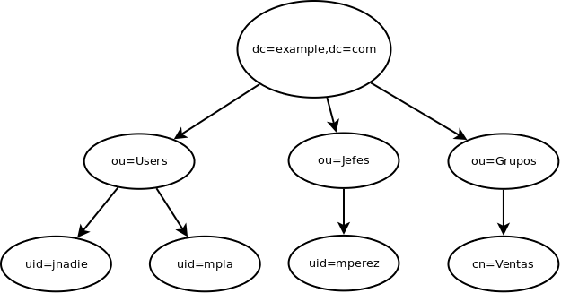
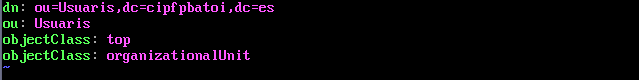
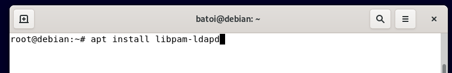
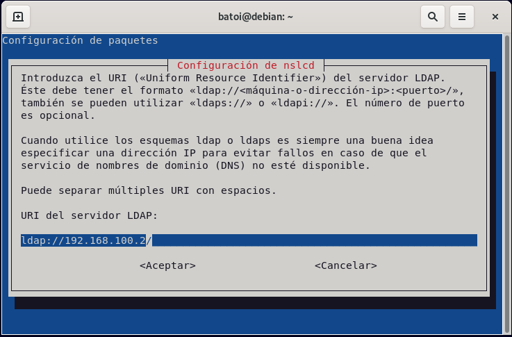
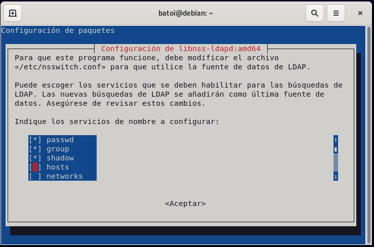
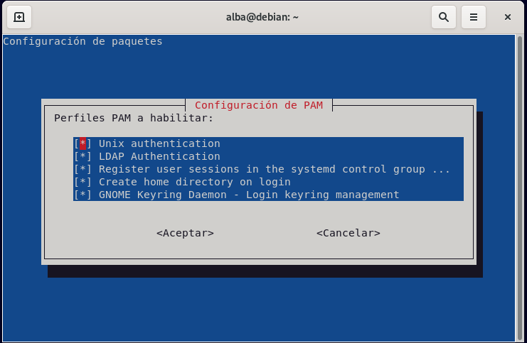
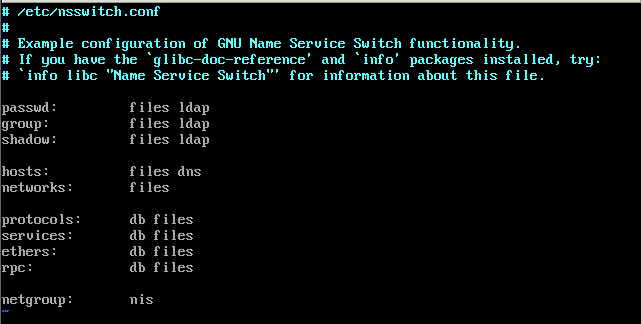
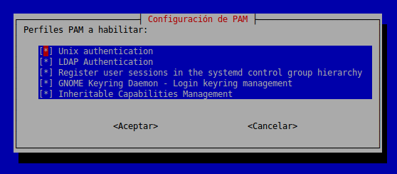
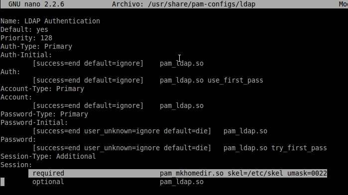
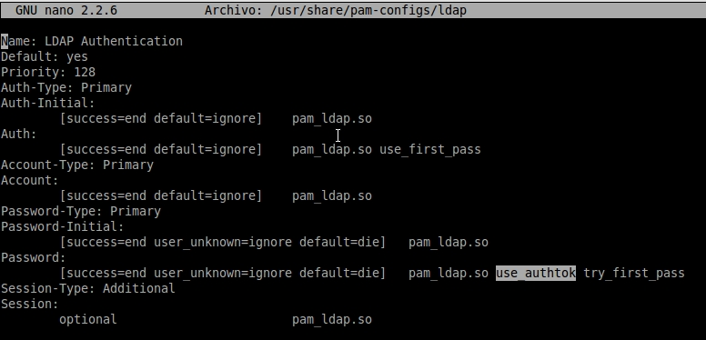

# 🖥️ Centralización de la información con OpenLDAP

- [🖥️ Centralización de la información con OpenLDAP](#️-centralización-de-la-información-con-openldap)
  - [](#)
  - [Objetivos](#objetivos)
  - [Conceptos clave](#conceptos-clave)
  - [Introducción a LDAP](#introducción-a-ldap)
  - [Los objetos del directorio](#los-objetos-del-directorio)
  - [Instalación y configuración](#instalación-y-configuración)
    - [Configuración desde la terminal](#configuración-desde-la-terminal)
  - [Buscar elementos del directorio](#buscar-elementos-del-directorio)
  - [Modificar entradas del directorio](#modificar-entradas-del-directorio)
  - [Borrar entradas del directorio](#borrar-entradas-del-directorio)
  - [LDAP Account Manager](#ldap-account-manager)
    - [Otras herramientas](#otras-herramientas)
  - [Configuración del cliente LDAP](#configuración-del-cliente-ldap)
    - [Instalación cliente Debian ](#instalación-cliente-debian-)
      - [Instalación en otros clientes](#instalación-en-otros-clientes)
      - [Configuración del cliente ldap](#configuración-del-cliente-ldap-1)
    - [Configuración de NSS y PAM](#configuración-de-nss-y-pam)
      - [Configuración del servicio NSS](#configuración-del-servicio-nss)
      - [Configuración de PAM](#configuración-de-pam)
      - [Ajustes de la configuración](#ajustes-de-la-configuración)
      - [Perfiles móviles](#perfiles-móviles)
    - [Configuración del cliente LDAP con SSSD](#configuración-del-cliente-ldap-con-sssd)
      - [Configurar SSSD](#configurar-sssd)
  - [Bibliografía](#bibliografía)


##

<figure><figcaption></figcaption></figure>

## Objetivos

Los objetivos a alcanzar en esta unidad de trabajo son los siguientes:

* Implementar dominios.
* Administrar cuentas de usuario y cuentas de equipo.
* Centralizar la información personal de los usuarios del dominio mediante el uso de perfiles móviles y carpetas personales.
* Crear y administrar grupos.
* Organizar los objetos del dominio para facilitar su administración.
* Utilizar máquinas virtuales para administrar dominios y verificar su funcionamiento.
* Incorporar equipos al dominio.
* Bloquear accesos no autorizados al dominio.

## Conceptos clave

Los conceptos más importantes de esta unidad son:

* LDAP
* Configuración de un servidor LDAP
* Administración del directorio
* Configuración de un cliente LDAP

## Introducción a LDAP

LDAP son las siglas de _Lightweight Directory Access Protocol_ (Protocolo Ligero de Acceso a Directorios) y es un protocolo cliente-servidor que permite el acceso a un servicio de directorio ordenado y distribuido para buscar información en la red.

Un directorio es una base de datos especial donde las consultas son frecuentes pero las actualizaciones no tanto. Sus datos son objetos que tienen atributos y están organizados de forma jerárquica. Un ejemplo sería el directorio telefónico, que consiste en una serie de nombres (de personas y empresas) que están ordenados alfabéticamente por poblaciones, y cada nombre tiene como atributos una dirección y un número de teléfono.

El directorio se organiza como un árbol y tiene una entrada para cada objeto que almacena. Cada entrada consta de un conjunto de atributos y un atributo tiene un nombre (el tipo de atributo) y uno o más valores.

LDAP puede usarse para muchas cosas. Nosotros lo usaremos para realizar la autentificació centralizada de los usuarios de nuestra red (entre otras cosas almacenaremos la información de autenticación: usuario y contraseña) pero podría usarse para gestionar libretas o calendarios compartidos, gestionar una infraestructura de clave pública (PKI), ...

Hay muchas implementaciones del protocolo LDAP, tanto libres como privativas. Algunas de las más usadas son:

* **Active Directory**: es la implementación que utiliza Microsoft para sus dominios
* **openLDAP**: es una implementación libre y es la más usada en sistemas GNU/Linux
* Otras: Apache DS, Oracle Internet Directory, Novell Directory Services, etc.

## Los objetos del directorio

Un directorio es como un árbol cuya raíz es un dominio (un objeto de tipo DC) y del que cuelgan los diferentes objetos. Tenemos todo tipo de objetos pero los más comunes son:

* **dominio**: es el objeto raíz del directorio
* **unidades organizativas (ou)**: son contenedores de otros objetos y nos permiten organizar los objetos
* **usuarios**: representan a personas de nuestra organización
* **grupos**: son agrupaciones de usuarios
* otros objetos: equipos, impresoras, ...

Un ejemplo de directorio sería:

<figure><figcaption></figcaption></figure>

**LDAP** suele usar nombres DNS para estructurar los niveles más altos de la jerarquía (DC). Por debajo aparecen entradas que representan unidades organizativas, personas, impresoras, grupos, etc.

Cada objeto tiene un identificador único llamado **Nombre Distinguido** (**Distinguished Name**, **DN**) que consta de su **Relative Distinguished Name** (**RDN**) construido por el atributo identificativo del objeto, seguido del **DN** del objeto padre. Si lo comparamos con ficheros el **RDN** sería como el nombre del fichero y el **DN** su nombre completo, incluyendo la ruta (que sería el nombre completo del directorio que lo contiene, que es su objeto padre).

En el esquema anterior, el **DN** del objeto **jnadie** sería:

```
uid=jnadie,ou=Users,dc=example,dc=com
```

y su **RDN** sería simplemente:

```
uid=jnadie
```

Habitualmente se utiliza el formato **LDIF** para describir un objeto. En él se define el **DN** del objeto en la primera línea seguido del **RDN** y demás atributos del objeto, cada uno en una línea:

```bash
dn: uid=jnadie,ou=Users,dc=example,dc=com
    uid: jnadie
    uidNumber: 5012
    cn: Juan Nadie
    givenName: Juan
    sn: Nadie
    telephoneNumber: +34 888 555 6789
    telephoneNumber: +34 888 555 1233
    mail: jnadie@example.com
    manager: uid=cperez,ou=Jefes,dc=example,dc=com
    objectClass: inetOrgPerson
    objectClass: organizationalPerson
    objectClass: person
    objectClass: top
```

Como veis, el **DN** se construye como el nombre de un fichero pero de derecha a izquierda en vez de izquierda a derecha (el elemento raíz está a la derecha y vamos descendiendo hasta el objeto en cuestión que está a la izquierda).

En cada atributo lo que aparece antes del símbolo ":" es el nombre del atributo y después su valor. Algunos nombres de atributo son:

* **dn**: Distinguished Name. Siempre está en la primera línea
* **dc**: Domain Component. Es una parte del dominio. Si hay más de un nivel (lo habitual) habrá más de un atributo de. Por ejemplo www.google.es (3 niveles) se expresaría como dc=www,dc=google,dc=es
* **cn**: Common Name (ej.: Juan Nadie)
* **givenName**: nombre de pila (Juan)
* **sn**: apellidos (Nadie)
* **ou**: unidad organizativa
* **object class**: tipo de objeto. En función de su tipo tendrá unos atributos u otros (por ejemplo un objeto persona tendrá nombre apellidos, teléfono, ... mientras que un objeto grupo tendrá nombre, miembros, ...). Los tipos de objetos que tenemos y qué atributos tiene cada tipo viene definido por el **esquema** que estemos usando. Un objeto puede tener más de un tipo (por lo que tendrá los atributos definidos en los esquemas de todos ellos).

## Instalación y configuración

Los paquetes que tenemos que instalar en el servidor para instalar openLDAP son **slapd** y **ldap-utils**. El primero es el servicio LDAP y el segundo utilidades para gestionar el dominio.

Al instalar (o reinstalar) el servicio LDAP se nos pide la contraseña del administrador y se crea un directorio cuya raíz es **nodomain** y que incluye el cn **admin**. Para crear un nuevo directorio con nuestros datos ejecutaremos **dpkg-reconfigure slapd** y nos pedirá la siguiente información:

* el nombre del dominio LDAP (si no lo proporcionamos será **nodomain**)
* el nombre de nuestra organización (es informativo y por eso puede tener espacios u otros caracteres)
* la contraseña del administrador del dominio
* el motor de base de datos a utilizar (se recomienda el MDB)
* si queremos o no que se borre el directorio si desinstalamos el programa
* si queremos mover la base de datos antigua porque no interfiera con la que se creará ahora. La antigua se moverá a /var/backups
* si queremos que se pueda usar el protocolo LDAPv2. Sólo lo haremos si tenemos programas o equipos muy antiguos

Esto crea automáticamente el objeto raíz del directorio con el nombre de nuestro dominio y el objeto administrador del dominio (usuario **admin**) con la contraseña proporcionada. Podemos volver a ejecutarlo cuando queramos y se creará un nuevo directorio.



### Configuración desde la terminal

Algunos comandos para trabajar con **LDAP**:

* **slapcat**: muestra todo el contenido del directorio en formato _LDIF_
* **ldapadd**: permite añadir nuevos nodos al directorio. Sus parámetros más importantes son:
  * _-D_ “dn del usuario”: para especificar las credenciales del usuario que añade el nodo. En nuestro caso será admin (pondremos -D “cn=admin,dc=nuestroDominio,dc=lan“)
  * _-W_: para que nos pida la contraseña en vez de escribirla en la orden
  * _-f_ fichero: nombre del fichero con la información del nodo a crear en formato _LDIF_
* **ldapdelete**: elimina un objeto del directorio
* **ldapsearch**: busca objetos en el directorio
* **ldappasswd**: cambia la contraseña de un usuario

Por ejemplo, para borrar todo nuestro directorio ejecutamos la orden:

```bash
    ldapdelete -r -D "dn administrador" -W "dc=nuestroDominio,dc.lan”
```

Para cambiar la contraseña de un usuario:

```bash
    ldappasswd -D "dn del administrador" -W -s nueva_contraseña "dn del usuario"
```

(ATENCIÓN: "_dn administrador_" quiere decir el _dn_ de tu administrador: **cn=admin,dc=nuestroDominio,dc=lan**, o el que sea)

Ejemplo: tenemos que crear una **OU** denominada _Usuarios_ en nuestro directorio llamado _cipfpbatoi.es_. El único atributo obligatorio de una **OU** es su nombre (atributo llamado _ou_) y es un objeto de las clases _top_ y _organizationalUnit_. El **RDN** de este tipo de objeto es su único atributo: _ou_.

Lo primero que tenemos que hacer es crear un fichero que denominaremos _ou\_usuarios.ldif_ con la información de la nuestra OU:

<figure><figcaption></figcaption></figure>

A continuación ejecutamos la orden **ldapadd** para crearla:

```bash
    ldapadd -D “cn=admin,dc=cipfpbatoi,dc=es” -W -f OU_usuarios.ldif
```

Con **-D** le indicamos las credenciales de quien crea el nodo (admin), con **-W** le decimos que nos pida la contraseña en vez de escribirla en el comando. Con **-f** le indicamos el fichero que contiene la información.

Para eliminar esta **OU** ejecutaremos el comando **ldapdelete**:

```bash
    ldapdelete -D “cn=admin,dc=cipfpbatoi,dc.es” -W “OU=Usuarios,dc=cipfpbatoi,dc.es”
```

Cada tipo de objeto tendrá unos atributos obligatorios y otros opcionales y esto viene definido en el esquema que sigue dicho objeto (indicado por su objectClass). Un objeto puede (y suele) tener varios objectClass por lo que tiene atributos definidos en varios esquemas.

Los principales objetos con que trabajaremos son:

<table data-header-hidden><thead><tr><th width="141"></th><th width="98"></th><th width="277"></th><th></th></tr></thead><tbody><tr><td><strong>Objeto</strong></td><td><strong>RDN</strong></td><td><strong>Atributos</strong></td><td><strong>objectClass</strong></td></tr><tr><td>Unidad<br>organizativa</td><td>ou</td><td>ou: nombre</td><td>organizationalUnit</td></tr><tr><td>Grupo</td><td>cn</td><td><strong>cn</strong>: nombre del grupo<br><strong>gidNumber</strong>: gid<br><strong>memberUid</strong>: uid de los miembros, separados por coma</td><td>posixGroup</td></tr><tr><td>Usuario</td><td>cn o uid</td><td><strong>uid</strong>: login del usuario<br><strong>uidNumber</strong>: nº id<br><strong>gidNumber</strong>: nº grupo principal<br><strong>sn</strong>: apellidos<br><strong>cn</strong>: nombre para mostrar del usuario<br><strong>homeDirectory</strong>:ruta de su home<br><strong>loginShell</strong>: shell del usuario<br>Además podemos especificar muchos más atributos cómo:<br>- <strong>givenName</strong>: nombre<br>- <strong>userPassword</strong>: contraseña<br>- <strong>displayName</strong>: nombre para mostrar<br>- <strong>mail</strong>: su e-mail<br>- <strong>shadowExpire</strong>, <strong>shadowFlag</strong>, <strong>shadowWarning</strong>, <strong>shadowMin</strong>, <strong>shadowMax</strong>, …: opciones de password</td><td>inetOrgPerson<br>posixAccount<br>shadowAccount</td></tr></tbody></table>

**IMPORTANTE**: para evitar conflictos con los usuarios y grupos locales que se numeran a partir del 1000, nosotros utilizaremos números a partir de **10000** para los **uidNumber** y **gidNumber** de usuarios y grupos del directorio.

Los esquemas que podemos utilizar son los incluidos en directorio del servidor LDAP "**/etcopenldap/schema"**. Algunos de los más comunes son:

* /etcopenldap/schema/core.schema
* /etcopenldap/schema/cosine.schema
* /etcopenldap/schema/inetorgperson.schema
* /etcopenldap/schema/nis.schema

Si además vamos a necesitar que el servidor **LDAP** almacene cuentas **Samba** tendremos que asegurarnos que **LDAP** conoce la estructura y los datos necesarios de una cuenta **Samba** mediante la inclusión del correspondiente fichero de esquema **samba.schema**.

## Buscar elementos del directorio

Como hemos visto más arriba, la utilidad de línea de comandos que permite realizar búsquedas en el directorio **LDAP** es _ldapsearch_. Se trata de una utilidad con multitud de opciones, pero aquí vamos a hacer un uso básico de ella.

Por ejemplo, podríamos buscar todos los usuarios usando la siguiente sintaxis:

```bash

ldapsearch -xLL -b "dc=iso,dc=lan" uid=* sn givenName mail

```

Parámetros:

* **-x** indica que usaremos autentificación simple.
* **-LL** sirve para que la salida sea simple del tipo LDAPv1.
* **-b** va seguida del punto del árbol donde debe comenzar la búsqueda. En este caso, dc=iso,dc=lan. Después se incluye la condición que deberán cumplir los objetos buscados. En el ejemplo, cualquier valor (\*) para el atributo uid.
* Por último, se incluye el nombre de los atributos que queremos obtener en el resultado de la consulta.

## Modificar entradas del directorio

El comando que usaremos en este caso es **ldapmodify**, que permite cambiar el contenido de cualquier atributo, añadir atributos nuevos, eliminarlos etc.

Dado que la sintaxis es más compleja nos apoyaremos en un archivo _LDIF_ que especifique los cambios que necesitamos realizar. En nuestro caso, el archivo tendrá el siguiente aspecto:

```bash
  dn: uid=jomuoru,ou=usuarios,dc=iso,dc=lan
  changetype: modify
  replace: mail
  mail: jomuoru@iso.lan
```

Como puedes suponer, la primera línea identifica la cuenta en la que realizaremos el cambio. La segunda indica el tipo de operación a realizar, la tercera identifica el atributo y, por último, la cuarta incluye el nuevo valor que debe asignarle.

Por último, ejecutamos la utilidad **ldapmodify**, indicándole el nombre del archivo donde se encuentran los datos:

```bash
  ldapmodify -x -D cn=admin,dc=iso,dc=lan -W -f modify.ldif
```

## Borrar entradas del directorio

La utilidad que permite eliminar entradas del directorio se llama **ldapdelete**. Para utilizarla, sólo tenemos que aportar los datos del objeto a borrar y los datos de la cuenta administrador que debe permitirlo. La sintaxis será como sigue:

```bash
  ldapdelete -x -W -D 'cn=admin,dc=iso,dc=lan' "uid=jomuoru,ou=usuarios,dc=iso,dc=lan"
```

## LDAP Account Manager

Como hemos visto la gestión del directorio desde la terminal es bastante engorrosa. Por ello existen multitud de herramienta (normalmente vía web) que nos permiten gestionar nuestro directorio gráficamente.

Para utilizar este programa instalamos el paquete **ldap-account-manager** y ya podemos abrir desde el navegador en [http://localhost/lam](http://localhost/lam). En nuestro caso como no lo abriremos desde el servidor (no tenemos navegador ni entorno gráfico) sino desde otra máquina en vez de localhost deberemos poner la IP o el nombre de nuestro servidor **LDAP**.

La configuración inicial puede hacerse desde el entorno gráfico en la opción **LAM configuration**. Lo primero que deberíamos que configurar es la contraseña a utilizar en este programa que por defecto es lam.

A continuación configuraremos el acceso a nuestro servidor (su IP o nombre), el dominio, el dn del administrador y las _OU_ que utilizar por defecto para crear nuevos usuarios, grupos y equipos. No hace falta configurar los _UID_ y _GID_ porque por defecto ya utiliza valores superiores a 10000.

Una vez configurado ya podríamos crear nuestros objetos:


Vídeo demostración


Tras crear los objetos hacemos un **slapcat** para comprobar que se han creado correctamente:


Vídeo demostración


### Otras herramientas

Existen multitud de herramientas para gestionar nuestro directorio. Una de ellas es **Webmin** que nos permite realizar algunas acciones pero no es tan completo ni fácil de usar como los 2 vistos anteriormente.

Otras herramientas (también de software libre como todas las que hemos visto) son **GOsa** o **Web2ldap**.

## Configuración del cliente LDAP

Una vez instalado y configurado el servidor **LDAP**, nos queda configurar nuestros clientes de red para que utilicen el servidor para autentificar los usuarios.

De momento, configuraremos la validación de usuarios desde equipos GNU/Linux. En temas posteriores (integración de sistemas heterogéneos) ya veremos como hacerlo para clientes Windows.

En el proceso de validación de los usuarios en el cliente mediante un servidor **LDAP** van a participar dos servicios:

* **PAM** (_Pluggable Authentication Module_): permite configurar en el sistema varios métodos de autenticación de usuarios. El método de autenticación por defecto es el de usuario y contraseña pero _PAM_ permite utilizar otros métodos como un servidor **LDAP**, identificación biométrica (como la huella digital, la voz, etc). La mayor parte de las aplicaciones y herramientas en los sistemas **GNU/Linux** (login, ssh, su, ...) utilizan _PAM_ y esto permite cambiar el método de autenticación sin hacer cambios directamente en las aplicaciones.
* **NSS** (_Name Service Switch_): permite a las aplicaciones obtener información sobre usuarios, grupos, contraseñas, etc, de diferentes fuentes. Lo habitual es obtener esta información de archivos locales (_/etc/passwd_, _/etc/group_ y _/etc/shadow_), pero **NSS** permite utilizar además otras fuentes como un servidor **NIS** o un servidor **LDAP**. Para que un usuario pueda entrar en el sistema _PAM_ debe autorizarlo (si cumple los requisitos, por ejemplo que usuario+contraseña son correctos) pero se necesita más información del mismo, como a qué grupos pertenece o cuál es la ruta de su carpeta personal. Esta información la proporciona _NSS_. En el fichero `/etc/nsswitch.conf` es donde configura _NSS_ dónde debe buscar la información de los usuarios, grupos, etc.

### Instalación cliente Debian&#x20;

En este apartado describimos el procedimiento para realizar la instalación/configuración utilizando el paquete **libpam-ldapd**. **libpam-ldapd** es una alternativa más nueva al **libpam-ldap** original. **libpam-ldapd** usa el mismo backend (**nslcd**) que **libnss-ldapd** y, por lo tanto, también comparte el mismo archivo de configuración (_/etc/nslcd.conf_) para los parámetros de conexión **LDAP**.

Instalación del paquete:

<figure><figcaption></figcaption></figure>

Configuración de la dirección del servidor ldap:

<figure><figcaption></figcaption></figure>

Configuración de **nslc** con el DN de nuestro dominio:

<figure><figcaption></figcaption></figure>

Configurando la fuente de datos LDAP para los diferentes servicios:

<figure><figcaption></figcaption></figure>

Ahora podemos ejecutar el comando:

```bash

pam-auth-update
```

y seleccionamos la opción _Create home directory_. Para que cree el directorio del usuario al validarse.

<figure><figcaption></figcaption></figure>

#### Instalación en otros clientes

Los paquetes necesarios para configurar un equipo como cliente **LDAP** son:

* **libnss-ldap**: permite al servicio **NSS** obtener información administrativa a través de un servidor **LDAP**
* **libpam-ldap**: permite al servicio **PAM** utilizar un servidor LDAP para autenticar usuarios
* **nscd**: este servicio implementa una caché para acelerar el uso de LDAP y así evitar continuas consultas al servidor por parte del cliente. Este paquete no es necesario, pero sí recomendable.

La instalación de este paquetes también nos seleccionará otros adicionales cómo: **auth-client-config,** **ldap-auth-client** y **ldap-auth-config**.

#### Configuración del cliente ldap

La instalación de los paquetes finaliza con la configuración del módulo de autentificació de ldap (**ldap-auth-config**). La configuración que hacemos se almacena en el fichero **/etc/ldap.conf**. Este se utiliza tanto por el servicio de autenticación PAM como por el servicio de nombres NSS. Si posteriormente tenemos que cambiar esta configuración podemos editar el fichero o, más fácilmente reconfigurarlo con el comando **dpkg-reconfigure ldap-auth-config**.

La configuración de este paquete nos pide la siguiente información:

* el nombre o IP del servidor LDAP. Nos recomienda utilizar la IP para evitar problemas con el DNS. (NOTA: utilizar el protocolo ldap, no ldapi)
* El DN de nuestro dominio
* la versión del protocolo LDAP a utilizar (la misma que configuramos en el servidor)
* si queremos que las contraseñas se guarden en un archivo independiente al que sólo root tenga acceso (como pasa con /etc/shadow)
* si queremos que sea obligatorio identificarse para hacer consultas al directorio
* el DN del administrador de LDAP (el que configuramos en el servidor)
* su contraseña

### Configuración de NSS y PAM

#### Configuración del servicio NSS

El siguiente paso es configurar el servicio NSS editando el fichero _**/etc/nsswitch.conf**_:

<figure><figcaption></figcaption></figure>

En este fichero se configura dónde se debe buscar la información de los diferentes tipos de objetos, entre ellos:

* Los nombres de usuario, especificados en el archivo de configuración con la línea que empieza por **passwd**
* Los nombres de grupos, especificados en el archivo de configuración con la línea que empieza por **group**
* Las contraseñas de usuario, especificadas en el archivo de configuración con la línea que empieza por **shadow**

Indicaremos que la información sobre nombres de usuario, grupos y contraseñas primero se busque en los archivos locales (files o compat) y después mediante el servicio LDAP (ldap). Este orden es importante puesto que si se busca primero en LDAP, si por algún motivo no se puede acceder al servidor LDAP para realizar la validación, no sería posible acceder al equipo.

Por lo tanto las líneas en nuestro archivo _**/etc/nsswitch.conf**_ quedarían como muestra la imagen anterior.

Respecto a las máquinas (hosts) primero las busca en el fichero local (_**/etc/hosts**_) y si no las encuentra pregunta al DNS. Esto no es necesario cambiarlo.

Podemos probar que NSS está funcionando con la orden **getent** (primeramente tendremos que reiniciar el cliente porque tengan efecto los cambios hechos):

```bash
    getent passwd
```

Esta orden mostrará por pantalla la información de usuarios contenida en el archivo _**/etc/passwd**_. Si funciona NSS, además de la lista de usuarios locales, mostrará información de los usuarios creados en el directorio LDAP del servidor.

Podemos consultar el logs del sistema referentes a validación, _**/var/log/auth.log**_, para comprobar y ver posibles problemas.

#### Configuración de PAM

El siguiente paso sería configurar **PAM** para que utilice el servicio proporcionado por **LDAP**. Los archivos de configuración de **PAM** se almacenan en el directorio **/etc/palmo.d**.

Podemos configurar **PAM** sin editar manualmente los archivos de configuración con el comando **pam-auth-update**:

<figure><figcaption></figcaption></figure>

Tenemos que asegurarnos que tenemos marcada la opción de **LDAP Authentication** (también la de _Unix_ que es la autenticación por defecto). Lo normal es que esto se haya configurado automáticamente al instalar los paquetes.

Para probar que **PAM** funciona correctamente podemos utilizar el comando **pamtest** (se encuentra en el paquete **libpam-dotfile** que tendremos que instalar, pero atención que se encuentra en los repositorios universe).

Es necesario especificar 2 parámetros: el servicio para el que queremos probar la autenticación mediante **PAM** y el usuario que queremos validar en el servicio. Por ejemplo, para comprobar la validación del usuario _batoi_ a través del servicio de cambio de contraseñas se ejecutaría la orden:

```bash
    pamtest passwd batoi
```

Podemos probar otros servicios como _login_ o _ssh_. Una vez configurado el servicio.

En cualquier caso también podemos probar que el usuario se autentifica correctamente iniciando sesión con este usuario desde la terminal (desde el entorno gráfico aún no podrá iniciar sesión porque no se puede crear su perfil de usuario).

#### Ajustes de la configuración

Todavía quedan para hacer un par de ajustes para mejorar el funcionamiento de **LDAP** en el cliente.

Tendríamos que hacer que la primera vez que un usuario del directorio **LDAP** se valida en un equipo cliente se cree de forma automática su directorio home en el equipo con un perfil por defecto igual que sucede la primera vez que iniciamos sesión con un usuario local.

Para eso vamos a modificar el archivo de configuración de _PAM_ **/usr/share/pam-configs/ldap** y añadiremos como primera línea del bloque _Session_ la siguiente línea:

```bash
    required        pam\_mkhomedir.so skel=/etc/skel umask=0022
```

<figure><figcaption></figcaption></figure>

En ella especificamos:

* que se cree el directorio del usuario la primera vez que inicia sesión
* que se copie en el mismo el perfil por defecto (que se encuentra en _**/etc/skel**_. Este perfil incluye archivos ocultos (como .profile, bash\_history, ...) y, si iniciamos sesión en el entorno gráfico, también el resto de carpetas por defecto (Descargas, Documentos, Escritorio, etc).
* que se establezca su _máscara_ en 0022, lo que dará _permisos_ 755 y 644 para nuevos directorios y ficheros respectivamente en esa carpeta. Si quisiéramos por ejemplo que el resto de usuarios no tengan acceso pondríamos _umask 0027_

Si no hacemos esto, tendríamos que crear manualmente en todos los equipos clientes los directorios home de todos los usuarios **LDAP**.

Otro aspecto que es aconsejable ajustar es que la configuración por defecto no permite que un usuario LDAP puede cambiar su contraeña desde el equipo cliente con la orden _passwd_.

Para permitirlo tenemos que quitar el parámetro _use\_authtok_ en la línea donde aparece en la sección _Password_ en el mismo archivo, **/usr/share/pam-configs/ldap**:

<figure><figcaption></figcaption></figure>

La línea:

```bash

    [success=end user_unknow=ignore default=die] pam_ldap.so use_authtoktry_first_pass
```

pasaría a:

```bash
    [success=end user_unknow=ignore default=die] pam_ldap.so try_first_pass
```

Para que estos cambios tengan efecto debemos volver a ejecutar el comando

```bash
    pam-auth-update
```

#### Perfiles móviles

Lo que hemos hecho crea los home de los usuarios del dominio en el equipo en que inician la sesión. Una mejora sería que el directorio home de cada usuario no sea un directorio local del equipo cliente sino un directorio compartido en el servidor para que cuando un usuario inicia sesión en cualquier equipo de la red tenga acceso automáticamente a su directorio home creado en el servidor.

### Configuración del cliente LDAP con SSSD

En lugar de utilizar sólo estas librerías podemos utilizar el _demonio_ _**SSSD**_ para autenticar e identificar un usuario contra un servidor LDAP remoto (incluyendo Microsoft _Active DIrectory_). Este sistema incluye sus propios módulos PAM y NSS diferentes de los _"standalone"_ que hemos visto en el apartado anterior.

Una ventaja de SSSD sobre las librerías PAM y NSS _standalone_ es que SSSD guarda una caché (en `/var/lib/sss/db`) que permite acceder al cliente en caso de que el servidor LDAP no esté activo en ese momento.

#### Configurar SSSD

La configuración se realiza en `/etc/sssd/sssd.conf` (donde podemos configurar valores por defecto) y en los ficheros `.conf` que hay dentro del directorio `/etc/sssd/sssd.conf.d` que se cargan después y por tanto sobreescriben sus valores. Todos estos ficheros deben ser propiedad de root y sólo él debe tener acceso.

El fichero de configuración debe tener las secciones (más información en `man sssd.conf`):

* **\[sssd]**: debe al menos incluir una opción **domains** con una lista (separada por comas) de los distintos proveedores de autenticación/identidad (se les llama _domains_)
* **\[domain/nombre\_del\_dominio]**: para cada proveedor hay que incluir una sección donde se configura, al menos:
  * **auth\_provider**: proveedor de autenticación de este dominio (ldap, krb5, ad, ...)
  * **id\_provider**: proveedor de identidad (ldap, archivos, ...)
  * **access\_provider**: proveedor de acceso, que define qué usuarios tienen acceso al sistema (aunque se identifique correctamente si no cumple los criterios de este proveedor no podrá acceder). Los valores permitidos son ldap, krb5, ad, simple -permite si está en la lista-, denegar -siempre deniega-, permitir -siempre permite-, ...
  * **chpass\_provider**: quién se encarga de los cambios de contraseña (ldap, krb5, ad, none -no se permite-, ...)
  * otras líneas dependiendo de las opciones elegidas. Podemos obtener más información en `man sssd-ldap`, `man sssd-krb5`, `man sssd-ad`, ...
* **\[pam]**: configuraciones adicionales de PAM (por ejemplo límite de días que permitirá el acceso _offline_ sin el servidor LDAP disponible)
* **\[nss]**: configuraciones adicionales de NSS (como excluir usuarios o grupos del sistema)

Ejemplo de configuración para un servicio LDAP en el dominio acme.lan:

```
[sssd]
domains=ldapacme
[domain/ldapacme]
auth_provider=ldap
id_provider=ldap
ldap_uri=ldaps://ldapserver.acme.lan
ldap_search_base=dc=acme,dc=lan
ldap_tls_reqcert=allow
```

NOTA: la última línea es si el servidor usa un certificado autofirmado para TLS

Fuente: [https://www.javieranto.com/kb/GNU-Linux/pr%C3%A1cticas/Servidor%20LDAP%20389DS/#login-ldap-desde-cliente-con-sssd](https://www.javieranto.com/kb/GNU-Linux/pr%C3%A1cticas/Servidor%20LDAP%20389DS/#login-ldap-desde-cliente-con-sssd)

## Bibliografía

* [https://wiki.debian.org/LDAP/PAM](https://wiki.debian.org/LDAP/PAM)
* [LDAP-Linux-Como: Introducción - TLDP-ES](https://wiki.gentoo.org/wiki/Centralized\_authentication\_using\_OpenLDAP/es)
* [Documentation - OpenLdap.org](https://www.openldap.org/doc/)
* [Instalar y configurar el servidor LDAP de Linux](https://likegeeks.com/es/servidor-ldap-de-linux/)
* [Autenticación centralizada mediante OpenLDAP](https://wiki.gentoo.org/wiki/Centralized\_authentication\_using\_OpenLDAP/es)
* [Gentoo Linux](https://wiki.gentoo.org/wiki/Centralized\_authentication\_using\_OpenLDAP/es)
* [https://wiki.debian.org/LDAP](https://wiki.debian.org/LDAP)

Obra publicada con [Licencia Creative Commons Reconocimiento No comercial Compartir igual 4.0](http://creativecommons.org/licenses/by-nc-sa/4.0/)