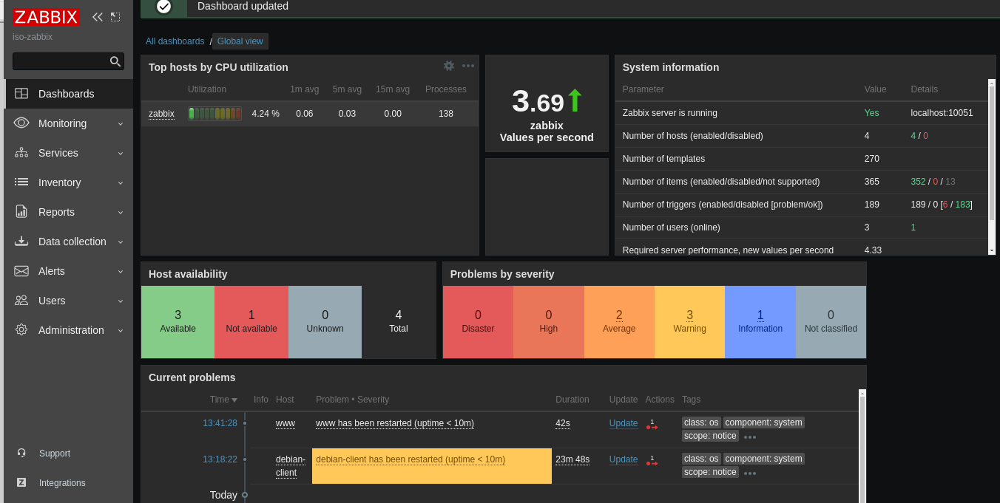

# 🔬 Servidores de monitorización

## ¿Qué es un servidor de monitorización?

Un servidor de monitorización es una herramienta que se utiliza para supervisar y recopilar información sobre los sistemas informáticos.

Proporciona datos en tiempo real sobre el rendimiento, la disponibilidad y otros aspectos clave de los servidores, redes, aplicaciones y dispositivos.

## ¿Por qué es importante la monitorización en Linux?

La monitorización en Linux es esencial para garantizar el funcionamiento adecuado de los sistemas y prevenir problemas antes de que ocurran. Permite detectar cuellos de botella, identificar problemas de rendimiento, supervisar la disponibilidad de los servicios y generar alertas ante situaciones anormales.

## Características de los servidores de monitorización en Linux

Supervisión del rendimiento del sistema operativo y de los recursos (CPU, memoria, disco, red, etc.).

* Monitorización de servicios y aplicaciones específicas.
* Generación de informes y estadísticas.
* Alertas y notificaciones en tiempo real.
* Capacidad de escalado para grandes infraestructuras.

## Herramientas populares de monitorización en Linux

* **Nagios**: una de las herramientas de monitorización más populares y utilizadas, con una gran comunidad y una amplia gama de plugins disponibles.
* **Zabbix**: una solución de monitorización escalable y de código abierto con soporte para múltiples plataformas.
* **Prometheus**: una herramienta de monitorización y alerta diseñada especialmente para entornos de contenedores y microservicios.
* **Cacti**: un sistema de gráficos y generación de informes basado en RRDTool para supervisar y registrar el rendimiento del sistema.

## Configuración y uso de un servidor de monitorización en Linux

* Instalación de la herramienta de monitorización deseada en el servidor.
* Configuración de los parámetros de monitorización y definición de los servicios a supervisar.
* Configuración de alertas y notificaciones.
* Visualización de los datos recopilados a través de paneles y gráficos.
* Análisis de informes y estadísticas para tomar decisiones informadas.

## Conclusiones

Un servidor de monitorización en Linux es una herramienta esencial para garantizar el rendimiento y la disponibilidad de los sistemas informáticos. Permite detectar problemas antes de que se conviertan en fallas graves y tomar medidas correctivas.

Existen varias herramientas populares y de código abierto disponibles para implementar un servidor de monitorización en Linux.

## Zabbix

<figure><figcaption></figcaption></figure>

<figure><figcaption></figcaption></figure>

## Bibliografía

* [https://geekflare.com/es/best-open-source-monitoring-software/](https://geekflare.com/es/best-open-source-monitoring-software/)
