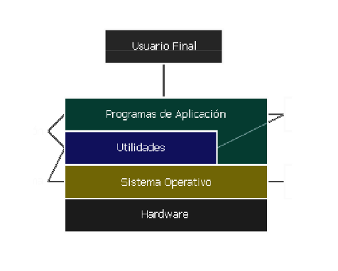
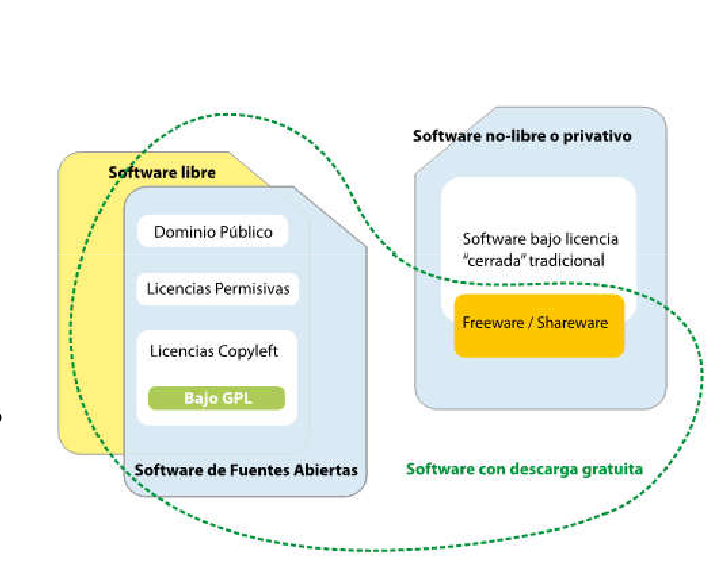
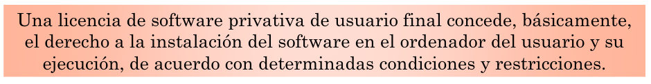
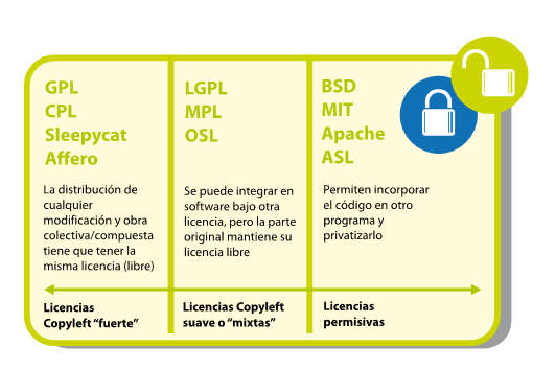
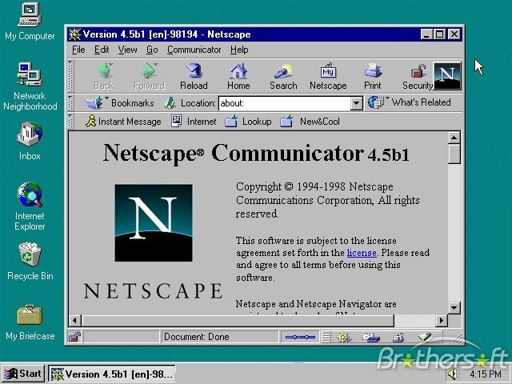
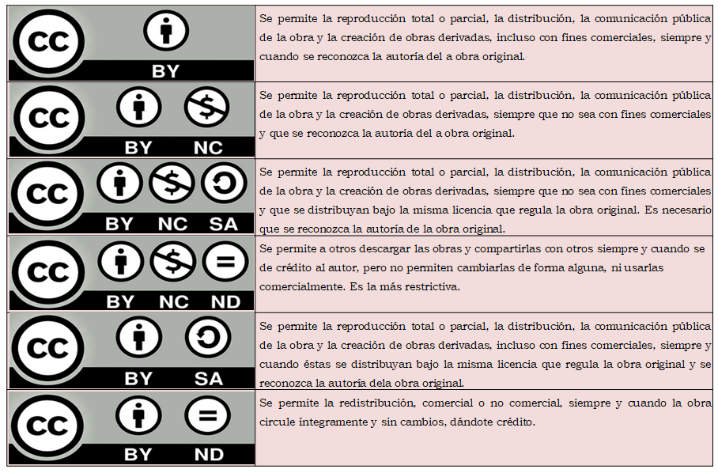
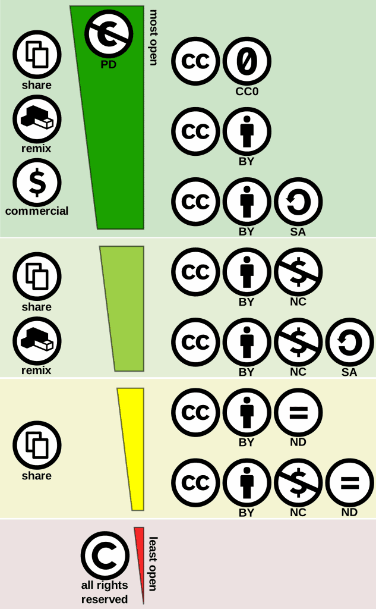

# Introducción a los Sistemas Operativos

- [Introducción a los Sistemas Operativos](#introducción-a-los-sistemas-operativos)
  - [Objetivos de la unidad](#objetivos-de-la-unidad)
  - [Conceptos clave](#conceptos-clave)
  - [Estructura de un sistema informático](#estructura-de-un-sistema-informático)
    - [Maquinari](#maquinari)
    - [Programari](#programari)
  - [Arquitectura d’un sistema Operatiu.](#arquitectura-dun-sistema-operatiu)
    - [Elementos i estructura d'un Sistema Operatiu (SO)](#elementos-i-estructura-dun-sistema-operatiu-so)
  - [Funcions del Sistema Operatiu.](#funcions-del-sistema-operatiu)
    - [Administrar recursos Hw](#administrar-recursos-hw)
  - [Proporcionar interfície](#proporcionar-interfície)
  - [Tipus de Sistemes Operatius.](#tipus-de-sistemes-operatius)
  - [Tipus d’aplicacions](#tipus-daplicacions)
    - [Llicències del programari](#llicències-del-programari)
    - [Llicències no-lliure o privatives](#llicències-no-lliure-o-privatives)
    - [Llicències de Programari de codi obert](#llicències-de-programari-de-codi-obert)
    - [Llicències permissives o acadèmiques](#llicències-permissives-o-acadèmiques)
    - [Llicències amb copyleft fort](#llicències-amb-copyleft-fort)
    - [Llicències mixtes o amb copyleft suau.](#llicències-mixtes-o-amb-copyleft-suau)
    - [Creative Commons](#creative-commons)

## Objetivos de la unidad

Los objetivos a alcanzar en esta unidad de trabajo son los siguientes:

* Identificar los elementos funcionales de un sistema informático
* Identificar las características, funciones y arquitectura de un sistema operativo
* Comparar diferentes sistemas operativos, sus versiones y licencias de uso

## Conceptos clave

Los conceptos más importantes de esta unidad son:

* Hardware y software. Software de base y de aplicación
* Componentes físicos. Arquitectura von Newmann
* Principales arquitecturas de procesadores
* Funciones de un sistema operativo
* Clasificación de sistemas operativos
* Tipos de aplicaciones y licencias
* S.O. Windows: versiones cliente y servidor; ediciones
* S.O. Debian: ramas de desarrollo
* S.O. Ubuntu: versiones; soporte; versiones no oficiales

## Estructura de un sistema informático

* El ordenador és la herramienta que nos permite el procesamiento automático de la información.
* Un ordenador no és más que una máquina formada per elementos mecánicos y electrónicos.
* El que diferencia un ordenador de otras máquinas es que el ordenador és programable, és decir, que puede recibir instrucciones que le indican com tiene que funcionar.
* El ordenador se una máquina compuesta por elementos físicos (electrónicos y eléctricos).
* Esto se denomina comúnmente **Hardware**.
* Este hardware necesita de órdenes o instrucciones que hacen funcionar el **hardware** de una manera determinada. 
* Podemos denominar programa a un conjunto de instrucciones que la denominamos programa a un conjunto de instrucciones que le permiten al ordenador hacer una tarea. Al conjunto de todos los elementos no físicos, es decir, de todos los programas del ordenador se lo denomina **Software**.
* Dentro del **software** hay un especial, llamado **software de base**, que hace posible que el ordenador funciono: el *Sistema Operativo*.
* Entre el **software** y el **hardware** hay otro tipo de elemento: el **Firmware**.

### Maquinari
  

Anem a veure a grans trets alguns dels components més importants d'un ordinador. 
  
* ***Unitat Central de Procés*** (CPU): és l'element encarregat del control i execució de les operacions que es realitzen dins de l'ordinador. La CPU esta format per les seguents parts:
  * **Unitat de Control**: és la part que pensa de l'ordinador. La seua funció és rebre cada instrucció d'un programa interpretar-la i enviar a cada dispositiu les senyal de control necessàries per a executar-la.
  * **Unitat Aritmètica-Lógica**: és l'encarregada de realitzar operacions aritmètiques i lògiques sobre les dades.
  * **Registres**: emmagatzemen temporalment la informació amb la qual està treballant la CPU (la instrucció que està executant-se i les dades sobre els quals opera eixa instrucció).
  
* ***La Memòria***: és on s'emmagatzema la informació, tant instruccions com dades. Es pot dividir en:
  * Memòria d'emmagatzematge massiu o secundària.
  * Memòria interna o principal o RAM.
  * Memoria Cache
  * Memoria ROM BIOS.
  
* Unitats d'entrada/eixida i busos: Serveix per comunicar el processador i la resta dels components interns de l'ordinador, amb els perifèrics d'entrada/eixida i les memòries d'emmagatzematge extern o auxiliars.extern o auxiliars
  
* Els busos són les línies per les quals viatja la informació entre els diferents components de l'ordinador.
  
* Perifèrics: són dispositius maquinari amb els quals l'usuari pot interactuar amb l'ordinador.
  * Els perifèrics es connecten a l'ordinador mitjançant els anomenats ports.
  * Els perifèrics necessiten d'un programa especial que hem d'instal·lar en l'ordinador per a poder usar-los. 

Arquitectures de CPU. L'element més important per executar una instrucció es el procesador. Els passos per executar una instrucció son.

1. Es llig la instrucció de memòria1.Es llig la instrucció de memòria.
2. Es decodifica la instrucció (què s'ha de fer).
3. Es troben els dades necessaris per a processar la instrucció.
4. Es processa la instrucció.
5. S'escriuen els resultats en memòria.

No tots els processadors funcionen igual. Cadascun les realitza d’una forma diferent. Té conjunt d’instruccions que pot executar. L’arquitectura més comú es la PC. Les que han sortit posteriorment, normalment son compatibles en aquesta. Un Sistema Operatiu. Nomes es pot executar sobre una màquina amb l’arquitectura pel que s’ha dissenyat. 

### Programari

Existeixen 2 tipus de programari principalment:

* Programari de base o sistema
* Programari d'aplicació

El programari d'aplicacions és el conjunt de programes i paquets informàtics instal·lats per l'usuari per a realitzar tasques concretes com editar textos, retocar fotografies, realitzar càlculs, etc.realitzar càlculs, etc. Programari de sistema o de base són aquells programes que fan possible que l'ordinador funcione i es puga comunicar amb l'usuari.El programari de base ho constitueixen el sistema operatiu amb el qual treballa l'ordinador, els drivers que permeten el funcionament dels distints perifèrics (que són específics per a aqueix sistema operatiu) i altres programes d'utilitat.

El sistema operatiu és també el qual proporciona la interfície d'usuari mitjançant la qual l'usuari es comunica amb
l'ordinador i li indica el que desitja fer a cada moment.

## Arquitectura d’un sistema Operatiu.

El sistema operatiu és el programari bàsic de l'ordinador sense el qual aquest no funciona. Gestiona tots els recursos maquinari del sistema i proporciona la base sobre la qual s'executa el programari d'aplicació. A més proporciona a l'usuari la forma de comunicar-se. A més proporciona a l'usuari la forma de comunicar-se amb l'ordinador mitjançant una interfície de text o gràfica.

Per exemple, quan un usuari vol guardar un fitxer en el disc dur simplement li indica el sistema operatiu el nom del fitxer i en quina carpeta ho desitja guardar, sent el S.O. el qual es preocuparà de cercar sectors buits en el disc
dur.

No tots els sistemes operatius es poden instal·lar en qualsevol sistema informàtic, ni tots els equips poden suportar qualsevol sistema operatiu.

### Elementos i estructura d'un Sistema Operatiu (SO)

Como podemos imaginar, un sistema operativo es un programa muy complejo que debe estar muy bien organizado y estructurado internamente para llevar a cabo su trabajo de una forma muy eficiente. En este sentido, los sistemas operativos se subdividen en diferentes componentes que se encuentran especializados en aspectos muy concretos del mismo.

Los elementos que constituyen la mayoría de los sistemas operativos son lo siguientes:

* Gestor de procesos.
* Gestor de memoria virtual.
* Gestor de almacenamiento secundario.
* Gestor de entrada y salida.
* Sistema de archivos.
* Sistemas de protección.
* Sistema de comunicaciones.
* Programas de sistema.
* Gestor de recursos.

Ahora que ya sabemos que el sistema operativo se divide en distintos elementos, podemos plantearnos el modo en el que dichos elementos se organizan dentro del sistema operativo para llevar a cabo su cometido. También será importante para el diseño del sistema establecer qué componentes del mismo se ejecutan en modo núcleo y cuáles en modo usuario.

El núcleo de un sistema operativo también suele recibir el nombre de kernel.

En este sentido, los planteamientos que se aplican en los sistemas operativos más conocidos son los siguientes:

* Monolítico. En este tipo de sistemas, el núcleo concentra la mayor parte de la funcionalidad del sistema operativo (sistema de archivos, gestión de memoria, etc), de modo que todos sus componentes principales se ejecutarán en modo núcleo. Aunque estos componentes se programen de forma separada se unen durante el proceso de compilación mediante un enlazador (linker).
* Micronúcleo. n este tipo de sistemas, el núcleo sólo contiene la implementación de servicios básicos como el soporte de acceso a memoria de bajo nivel, la administración de tareas y la comunicación entre procesos (también conocida como IPC, del inglés, Inter-Process Communication).
* Núcleo híbrido. Este tipo de arquitectura consiste básicamente en un esquema de micronúcleo que incluye algo de código complementario para hacerlo más rápido, aunque buena parte de las funciones del sistema operativo siguen ejecutándose en modo usuario.

## Funcions del Sistema Operatiu.

### Administrar recursos Hw

* El S.O no és més que un programa que dirigeix al processador en l'ocupació dels recursos del sistema. 
* El kernel (nucli) es una part del S.O que sempre esta en la memoria principal.esta en la memoria principal.
* Per a realitzar les funcions d'administració del maquinari els SO han de proporcionar determinats serveis:
  * Gestió de execució de programes.
  * Gestió de memoria.
  * Administració de perifèrics.
  * Gestió de sistema de arxius
  * Altres funcions, com gestió de xarxa o de usuaris...

## Proporcionar interfície

El sistema operatiu fa d'intermediari entre aquests elements i el maquinari de l'equip. Respecte als programes d'aplicació els proporciona una sèrie de funcions perquè utilitzen el maquinari sense haver de preocupar-utilitzen el maquinari sense haver de preocupar-se de la complexitat del mateix.

A l'usuari li proporciona una interfície, que pot ser:

* De text.

* Gráfica.

## Tipus de Sistemes Operatius.

Els SS.OO. Es poden classificar segons diverses paràmetres:

* Segons la forma d’explotació.
  * Procés per lots.
  * Procés en temps compartit o reial.
* Segons el nombre d’usuaris
  * Monousuari
  * Multiusuari.
* Segons el nombre de tasques o processos.oSegons el nombre de tasques o processos.
  * Monotasca.
  * Multitasca.
* Segons el nombre de processadors.
  * Monoprocessador.
  * Multiprocessador.
* Segons com ofereix els serveis.
  * Sistemes operatius d’escriptori.
  * Sistemes Operatius en xarxa.
  * Sistema centralitzat.
  * Sistemes distribuïts.
* Segons la llicencia d’us.
  * Privatius
  * Lliures.

## Tipus d’aplicacions

### Llicències del programari

La llicència de programari és, segons el Dret espanyol, el contracte pel qual el titular d'un programa autoritza al llicenciatari a utilitzar-ho, cedint-li els drets necessaris per a aquest ús. 

La llicència de programari compleix una dobleLa llicència de programari compleix una doble funció:

* Assegurar els drets de l'usuari (les autoritzacions)
* Reservar i protegir els drets del titular (els drets no cedits i les condicions que ha de complir l'usuari).

Per tant la llicència estableix determinats drets i obligacions entre les parts. I és en aquest punt on es diferencien les llicències del programari de codi obert (Open Source Software) i les llicències no lliures o privatives:les llicències no lliures o privatives:

* programari de codi obert concedeixen amplis drets a l'usuari (inclosos els de modificar el programari i tornar a distribuir-ho)
* Les llicencies no lliures solen limitar o imposar condicions dràstiques.

Com veiem en el diagrama, cada conjunt (programari lliure, no lliure) inclou determinats subtipus de llicències subtipus de llicències (permissives, copyleft, etc.), que es diferencien entre si per les condicions que s'estableixen en elles.

### Llicències no-lliure o privatives

Es pot dir que hi ha casi tantes llicencies no-lliures com programari propietari. 

* Programari estàndard de distribució massiva: Ms Windows o MacOS.
* Programari empresarial per parametrització, com SAP.
* Programari desenvolupat a mida per un client particular.

Les condicions especifiques dependran d’aspectes com:

* Tipus de programari.
* Posició de les parts que negocien el contracte.-
* Jurisdicció del lloc on es ven

Per exercir els drets d’aquestes llicencies, l’usuari deurà complir una serie d’obligacions

* Pagament de drets de llicencia.
* Prohibició de la copia, modificació i redistribució
* I altres limitacions que interposi el fabricant.

Dintre de les llicencies privatives ens trobem les de tipus Freeware, Shareware i Adware.

**Freeware**:

* El seu nom indica “Software gratuït”.
* No te cap cost.
* La seva utilització es per temps il·limitat.La seva utilització es per temps il·limitat.
* No sol incloure el codi font (encara que el podria).
* Sol incloure una llicencia d’ús en la que es pot redistribuir, però sense fins comercials.

**Shareware**:

* El programa es distribueix en limitacions.
* Pot ser versió demo o d’avaluació.
* Té funcions o característiques mínima o amb ús restringit a un temps establit.
* Per aconseguir l’ús del software de manera completa, es requereix un pagament.

**Adware**:

* Programa totalment gratuït.
* Inclou publicitat en el programa, durant la seva instal·lació o durant el seu ús.instal·lació o durant el seu ús.
* Hi ha programes que poden ser shareware a la mateixa vegada que Adware.

### Llicències de Programari de codi obert

Les llicències de codi obert, permeten entre altres coses:

* Descarregar, instal·lar i executar el software sense limitacions.
* Descarregar el codi font i estudiarlo.
* Analitzar les interfaces per fer un software interoperable.
* Modificar el software per adaptarlo a les seves necessitats, recompilar-ho i executar-ho.
* Utilitzar part del codi per altre software.
* Ampliar el Programari original.
* Integrarlo en un altre Sw (SFA) per millorar les seves funcionalitats.
* Redistribuir o comunicar públicament el software original.
* De la mateixa manera, redistribuir el Sw modificat i les extensions (respectant sempre les condicions de la llicencia
* Crear documentació sobre el software i ficar-la a la venda.

Tipus de llicencia.

* No totes les llicències de codi obert son iguals,
* Hi ha quasi 70 llicencies OpenSource certificades per OSI.
* És important conèixer les llicencies sempre que utilitzem un programari de codi obert.
* La major diferencia radica en les condicions aplicables a la redistribució, en particular en quant al grau de copyleft:redistribució, en particular en quant al grau de copyleft.

Apart del copyleft, les llicencies de SFA també es caracteritzen per aplicar condicions addicionals sobre temes que els seus autors han cregut important:

* Prohibir el us del nom del titular perProhibir el us del nom del titular per promoure el Sw. (Apache Sw License)
* L'abast de la llicencia de patents (MPL, CPL, GPLv3)
* El dret aplicable i la jurisdicció competent per resoldre conflictes (MPL,CPL)
* Accés a codi font medis sistemes remots(OSL, CDDL y Affero GPL)

### Llicències permissives o acadèmiques

S'anomenen d'aquesta forma ja que no imposen cap condició particular en quant a la redistribució del software excepte mantenir els avisos legals i les limitacions de garantia i responsabilitat.

Aquest tipus de llicencia és el resultat del desig dels seus autors de compartir el software amb qualsevol finalitat sense imposar obligacions que
pugen restringir els usos tant personals com comercials, llibres o privatius.

Les més conegudes son:

* **BSD**. (Berkeley Software Distribution. És una llicència que per als seus detractors és pràcticament una llicència de programari libertino, més que lliure. Si crees un programa X i un altre ho vol utilitzar, ho podrà prendre lliurement, només respectant la teva autoria però sense alliberar els canvis que hagin fet.

* **ASL**. (Apache Software License)

### Llicències amb copyleft fort

Són les que exigeixen l'ús de la mateixa llicència per a qualsevol redistribució del programa i de les modificacions que es realitzin del mateix, així com a programes que ho utilitzen o incorporen.

El seu objectiu bàsic és assegurar que qualsevol usuari (directe o indirecte) del programari sempre tingui accés al codi font, sota els termes d'aquesta
mateixa llicència.

Com a consecuencia, s'impedeix la distribució del programari amb copyleft en aplicacions privatives. 

Això no significa que no es puguin crear i vendre aplicacions comercials amb programari copyleft. Però sí serà una violació de la llicència redistribuir aquest programari sota una altra llicència.

Llicències Amb copyleft fort (General Public License) **GPL**

* Llicència amb codi copyleft mès coneguda.
* Sw’utilitza en la majoria de programes de GNU.
* La seva finalitat és protegir els drets dels usuaris finals (usar, compartir, estudiar i modificar) finals (usar, compartir, estudiar i modificar)
* Els treballs derivats només poden ser distribuïts sota els termes de la mateixa llicència.

### Llicències mixtes o amb copyleft suau.

Llicències mixtes o amb copyleft suau.

Inclouen clausules de copyleft sols pel codi original, sense que afecte a altres programes que l’integren o l’utilitzen.

Permetent l'ús del programari per programes que es distribueixin sota una llicència diferent (la Lesser GPL o LGPL).

Permetent la seva incorporació en una obra més àmplia (o "obra major") la llicència de la qual, igualment, pot ser diferent (MPL i CDDL28, entre altres).

**Llicència MPL (Mozilla Public License)**

Compleix completament amb la definició de Programari de codi Obert de la Open Source Initiative (OSI) i amb les llibertats del software lliure enunciades per la Free Software Foundation (FSF) 

Però deixa ja obert el camí a una possible reutilització no lliure del software, si el usuari així ho desitja.

Té els seus orígens en la empresa Netscape Communications per al seu navegador.

Serveix com a llicencia de control per el navegador Firefox i el seu client de correu Thunderbird.

També es àmpliament utilitzat per desenvolupadors i programadors que volen alliberar el seu codi.

### Creative Commons

Llicencia que s’aplica a la documentació. Permet elegir al autor quin tipus de dret vol cedir.

- **Reconeixement**: el us de l’obra deu reconèixer l’autoria original.
- **No comercial**: l’utilització de l’obra queda limitada a un us no comercial.
- **Sense Obres derivades**: no es pot permetre modificar l’obra per crear-ne un altra.
- **Compartir igual**: Es permet crear obres derivades sempre que es mantinguen la llicència.

