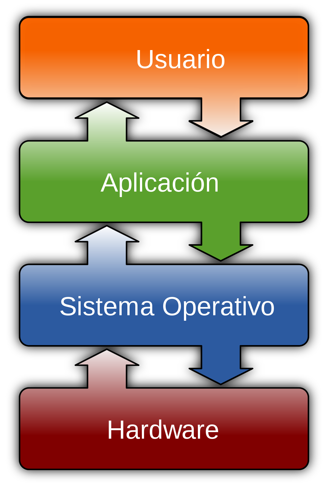

# Introducción a los Sistemas Operativos  

* [Hardware y Software](#hardware-y-software)
* [Componentes físicos: el hardware](#componentes-físicos-el-hardware)
* [Principales arquitecturas de procesador](#principales-arquitecturas-de-procesador)
* [Software de base del sistema](#software-de-base-del-sistema)

# Objetivos de la unidad
Los objetivos a alcanzar en esta unidad de trabajo son los siguientes:
- Identificar los elementos funcionales de 'un sistema informático
- Identificar las características, funciones y arquitectura de un sistema operativo
- Comparar diferentes sistemas operativos, sus versiones y licencias de uso

# Conceptos clave
Los conceptos más importantes de esta unidad son:

- Hardware y software. Software de base y de aplicación
- Componentes físicos. Arquitectura von Newmann
- Principales arquitecturas de procesadores
- Funciones de un sistema operativo
- Clasificación de sistemas operativos
- Tipos de aplicaciones y licencias
- S.O. Windows: versiones cliente y servidor; ediciones
- S.O. Debian: ramas de desarrollo
- S.O. Ubuntu: versiones; soporte; versiones no oficiales

# Estructura de un sistema informático

La palabra **informática** proviene de los términos INFORmación autoMÁTICA y una de sus principales aplicaciones es trabajar de forma rápida con grandes cantidades de información. El elemento que permite realizar el tratamiento de dicha información es el **ordenador**.

Un ordenador es un dispositivo electrónico que, a diferencia de otros, es **programable** lo que significa que podemos indicarle mediante instrucciones cómo debe funcionar.

## Hardware y Software

Un ordenador es una máquina compuesta por elementos físicos (eléctricos y electrónicos) capaz de hacer trabajos con velocidad y precisión. Esto vendría a reflejarnos el que es el **Hardware**.

Este hardware necesita de órdenes o instrucciones que hacen funcionar el hardware de una manera determinada. Podemos denominar programa a un conjunto de instrucciones que le permiten al ordenador hacer una tarea. Un ejemplo de programa es la calculadora de nuestro ordenador que nos permite hacer operaciones matemáticas, o el Paint que nos permite dibujar. Muchas veces los programas se agrupan en el que se denomina una **aplicación informática**, como por ejemplo la aplicación Microsoft Office que incluye el procesador de textos Word, la hoja de cálculo Excel, etc. Al conjunto de todos los elementos no físicos, es decir, de todos los programas del ordenador se lo denomina **Software**.

Dentro del software hay un especial, llamado **software de base**, que hace posible que el ordenador funciono: el **Sistema Operativo**. Es el encargado de que el resto de programas sean capaces de ejecutarse sobre el hardware.

Entre el software y el hardware hay otro tipo de elemento: el **Firmware**. Se trata del software incluido en algunos componentes hardware que los permite funcionar, por ejemplo el software que incorpora un router, un reproductor de dvd, etc. El firmware no suele ser modificado.

## Componentes físicos: el hardware

Vamos a ver a grandes rasgos algunos de los componentes más importantes de un ordenador (se ampliarán dichos conceptos en el módulo de Fundamentos de Hardware).

La mayoría de ordenadores modernos siguen la Arquitectura von Newmann en la cual el ordenador utiliza el mismo dispositivo de almacenamiento (la memoria) tanto para las instrucciones como para los datos. Las partes de que consta un ordenador con esta arquitectura son:

- **Unidad Central de Proceso (CPU)**: también denominada procesador, es el elemento encargado del control y ejecución de las operaciones que se realizan dentro del ordenador. Es la parte fundamental del ordenador. El procesador está formado por otros componentes entre los cuales destacan:
    - **Unidad de Control**: es la parte que piensa del ordenador. Su función es recibir cada instrucción de un programa, interpretarla y enviar a cada dispositivo las señal de control necesarias para ejecutarla.
    - **Unidad Aritmética-Lógica**: es la encargada de realizar operaciones aritméticas y lógicas sobre los datos.
    - **Registros**: almacenan temporalmente la información con la cual está trabajando la CPU (la instrucción que está ejecutándose y los datos sobre los cuales opera esa instrucción).

Un programa es una serie de instrucciones que se cargan una después de otra en el procesador y se ejecutan, es decir, se realizan las acciones indicadas en esta instrucción. Decimos que un programa está en ejecución cuando la CPU está ejecutando sus instrucciones.

- La Memoria: es donde se almacena la información, tanto instrucciones como datos. Se puede dividir en:
    - Memoria de almacenamiento masivo o secundaria: discos, disquetes, Cd-rom, DVD, memorias USB, ... Son más lentas que la RAM pero no volátiles.
    - Memoria interna o principal o RAM: la memoria RAM es fundamental puesto que los programas que se están ejecutando en un momento dado y los datos sobre los cuales están trabajando tienen que estar en memoria RAM.
        Además hay otros tipos de memoria como las memorias caché que hacen de intermediarias entre el procesador y la RAM (son mucho más rápidas que esta) y agilizan el acceso a la memoria RAM o la memoria ROM que contiene los programas que inician el arranque del ordenador (BIOS).
    - Unidades de entrada/salida y buses: la unidad de E/S sirve para comunicar el procesador y el resto de los componentes internos del ordenador, con los periféricos de entrada/salida y las memorias de almacenamiento externo o auxiliares. Los buses son las líneas por las cuales viaja la información entre los diferentes componentes del ordenador.
    - Periféricos: son dispositivos hardware con los cuales el usuario puede interactuar con el ordenador, almacenar o leer datos y/o programas, imprimir resultados, etc. Los periféricos se conectan al ordenador mediante los llamados puertos. Los periféricos necesitan de un programa especial que tenemos que instalar en el ordenador para poder usarlos. Esos programas se llaman drivers.

## Principales arquitecturas de procesador

Ya hemos visto que todos los ordenadores modernos están diseñados siguiendo la arquitectura von Newmann y cuentan con un procesador, una memoria donde se almacenan las instrucciones de los programas y los datos con que trabajan y una unidad de E/S que lo comunica con el exterior.

De esos elementos el más importante es el procesador que es quien procesa o ejecuta cada instrucción de un programa. Los pasos para ejecutar una instrucción son:

    1. Se lee la instrucción de memoria
    1. Se decodifica la instrucción (qué se tiene que hacer)
    1. Se encuentran los datos necesarios para procesar la instrucción
    1. Se procesa la instrucción
    1. Se escriben los resultados en memoria

Pero no todos los procesadores funcionan igual: cada tipo de procesador realiza esas funciones de una forma determinada y tiene un conjunto de instrucciones que puede ejecutar. Esto recibe el nombre de microarquitectura del procesador, aunque por comodidad a a menudo nos referimos a ella simplemente como la arquitectura del procesador o del ordenador.

El más habitual se trabajar con ordenadores que tienen arquitectura PC. Aunque no se trata de una única arquitectura las diferentes arquitecturas que fueron aparecen en su evolución siempre han mantenido la compatibilidad con la arquitectura anterior, es decir que cuando salía al mercado un procesador con un nuevo conjunto de instrucciones (por lo tanto se trata de una nueva arquitectura) esas instrucciones incluyen todas las del modelo de procesador anterior (por lo cual un programa hecho para el modelo anterior funcionará en el nuevo procesador). Un ejemplo de esto es cuando salió el procesador Pentium MMX que era una evolución del Pentium pero que incluía un nuevo juego de instrucciones (las instrucciones *MMX) para mejorar el procesamiento multimedia.

Esta evolución ha sido produciéndose ininterrumpidamente en los PCs desde el primeros procesadores que aparecieron a los años 80 del siglo pasado.

Vamos a ver sin entrar en detalles algunas de las principales arquitecturas de procesadores:

- arquitectura PC: es posiblemente la única que nos encontraremos en los ordenadores en que trabajaremos. El nombre que se le mujer normalmente es x86. Dentro hay 2 grandes ramas:
    - arquitectura de 32 bits: ya va quedando obsoleta y sólo la encontramos en ordenadores antiguos o poco potentes. Se denomina x86-32, y386, IA32
    - arquitectura de 64 bits: es una extensión del conjunto de instrucciones creada para los procesadores AMD de 64 bit y posteriormente adoptada también por Intel. Se denomina x86-64, amd64, intel64, EMT64 (ojo NO IA64). Esta es la arquitectura que tienen la mayoría de PCs actuales y también los Mac.
- Intel Itanium: es una línea de procesadores de 64 bits creada por Intel para servidores pero que no ha tenido el éxito esperado. Se denomina IA-64
- ARM: es la utilizada en la mayoría de Smartphones y muchas tablets (otras tienen arquitectura x86).
- PowerPC: utilizada entre otros por Apple para sus Mac hasta el 2005 en que cambió a la arquitectura x86-64. Es el procesador utilizar por muchas consolas como XBOX, Wii o PS3 (con procesador Cell basado en PowerPC).
- Otros: utilizadas en supercomputadors y mainframes como SPARC, DEC Alpha,

La arquitectura del procesador determina qué instrucciones puede ejecutar. Por lo tanto cualquier programa cuando se diseña (también los Sistemas operativos) se hacen para una arquitectura en concreto.

Es decir, que un sistema operativo sólo se puede ejecutar sobre una máquina con la arquitectura para la cual se ha diseñado o compatible (por ejemplo Windows 7 de 64 bits sólo puede ejecutarse en un ordenador con arquitectura PC de 64 bits y Windows 7 de 32 bits sólo puede ejecutarse en un ordenador con arquitectura PC de 32 bits o de 64 bits porque esta es compatible con la de 32 bits).

Así mismo cualquier programa se crea para un sistema operativo concreto (también los drivers que son un programa) y sólo puede funcionar en un ordenador con ese sistema operativo.

Otra cosa es que hay diferentes versiones de los programas. Por ejemplo hay versión de Debian para i386, amd64, ARM, Alpha, Sparc, etc pero la versión ARM sólo funciona sobre una máquina ARM y la amd64 sólo sobre ese tipo de procesador.

Igual pasa con los programas donde tenemos versión de LibreOffice o de Firefox para Windows, para Gnu/Linux, etc.

## Software de base del sistema

Cómo hemos comentado anteriormente el hardware necesita de unas instrucciones o programas que le indican qué tiene que hacer en cada momento. Estos programas constituyen el software del equipo.

Existen 2 tipos de software principalmente:

- software de base o sistema
- software de aplicación

El software de aplicaciones es el conjunto de programas y paquetes informáticos instalados por el usuario para realizar tareas concretas como editar textos, retocar fotografías, realizar cálculos, etc.

Por su parte el software de sistema o de base son aquellos programas que hacen posible que el ordenador funciono y se pueda comunicar con el usuario. Hace de intermediario entre el software de aplicación y el hardware del equipo puesto que sólo el software de base tiene acceso a los componentes del ordenador (CPU, memoria y periféricos). Cuando, por ejemplo, una aplicación tiene que imprimir un documento se lo comunica al sistema operativo que es quien se encarga de comprobar la impresora y enviarle la información a imprimir en un formato que la impresora entienda, ocupándose además de los diferentes problemas que puedan surgir (cómo es que se acabo el papel o la tinta).

El software de base lo constituyen el sistema operativo con el cual trabaja el ordenador, los drivers que permiten el funcionamiento de los distintos periféricos (que son específicos para ese sistema operativo) y otros programas de utilidad (cargadores, bibliotecas de aceleración gráfica, programas que controlan el hardware -temperatura, discos duros, ...-, etc.).

El sistema operativo es también el cual proporciona la interfaz de usuario mediante la cual el usuario se comunica con el ordenador y le indica el que desea hacer en cada momento. Esta interfaz puede ser gráfica o de texto en la cual el usuario indica qué realizar escribiendo comandos.