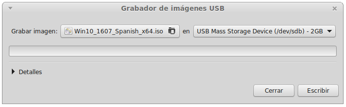
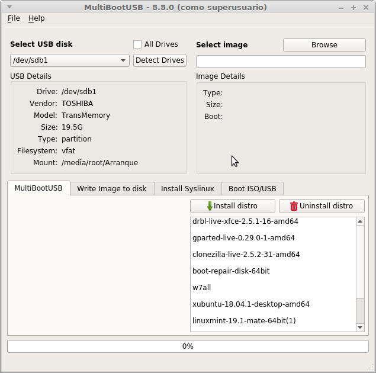
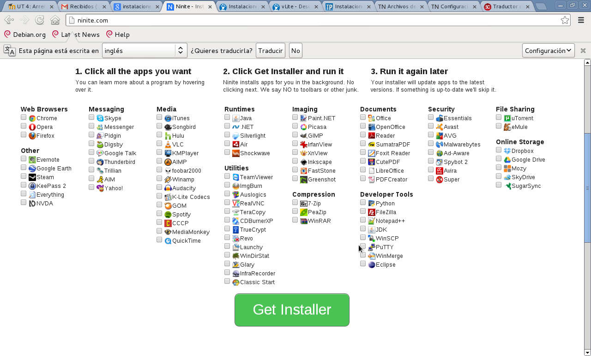
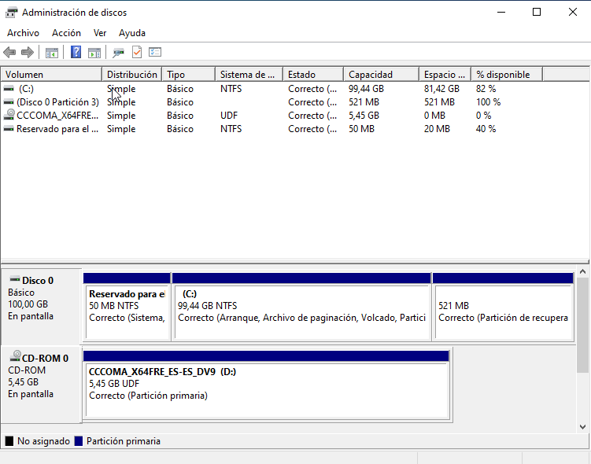
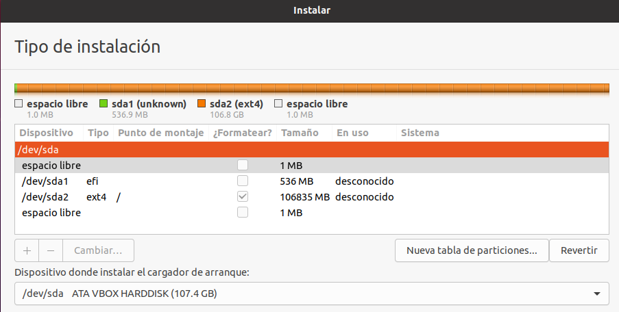
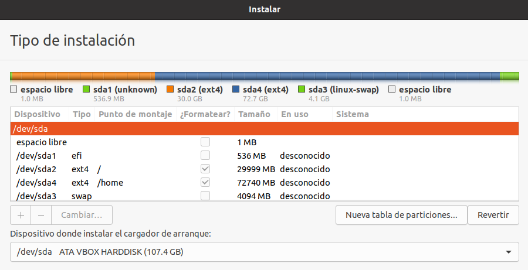
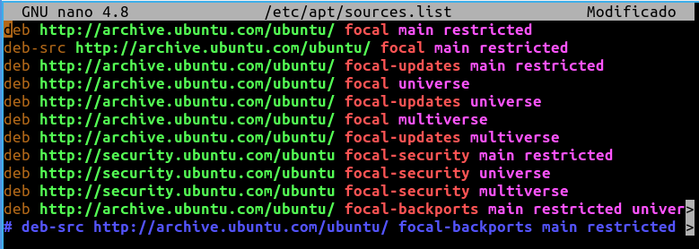
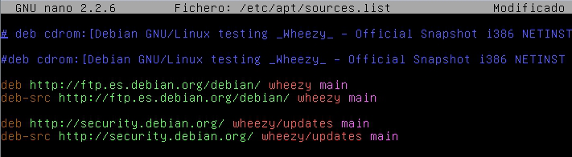
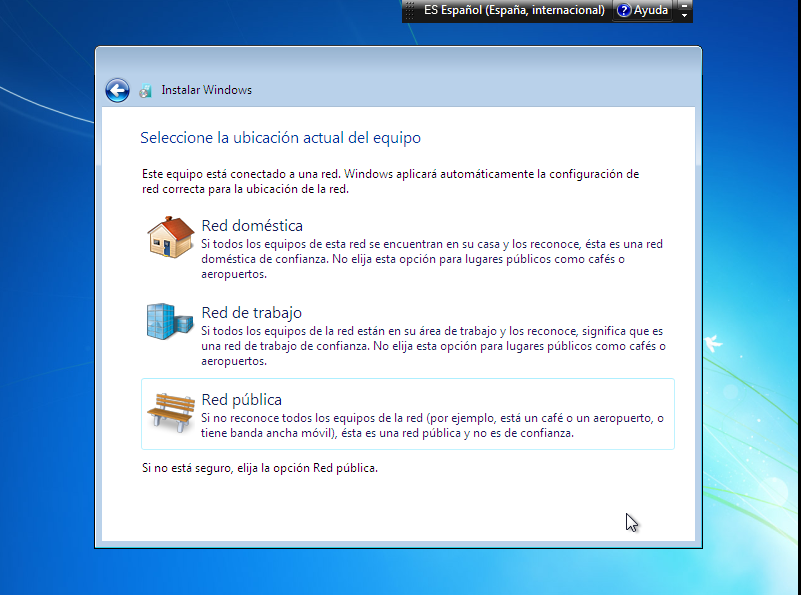

# Proceso de instalación de un sistema operativo
- [Proceso de instalación de un sistema operativo](#proceso-de-instalación-de-un-sistema-operativo)
  - [Introducción](#introducción)
  - [Desde dónde instalar el sistema](#desde-dónde-instalar-el-sistema)
    - [Instalación desde CD o DVD](#instalación-desde-cd-o-dvd)
    - [Instalación desde USB](#instalación-desde-usb)
    - [Instalación desde la red](#instalación-desde-la-red)
    - [Instalación por clonación](#instalación-por-clonación)
    - [Instalaciones desatendidas](#instalaciones-desatendidas)
  - [Dónde instalar el sistema: particionado](#dónde-instalar-el-sistema-particionado)
  - [Particiones a realizar al instalar el sistema](#particiones-a-realizar-al-instalar-el-sistema)
    - [Particiones al instalar Windows](#particiones-al-instalar-windows)
    - [Particiones al instalar GNU/Linux](#particiones-al-instalar-gnulinux)
    - [GNU/Linux con Windows](#gnulinux-con-windows)
  - [Instalación del cargador de arranque Grub](#instalación-del-cargador-de-arranque-grub)
  - [Otras configuraciones básicas al instalar un sistema](#otras-configuraciones-básicas-al-instalar-un-sistema)
    - [Nombre del equipo](#nombre-del-equipo)
    - [Tipos de usuarios](#tipos-de-usuarios)
      - [Usuarios administrador](#usuarios-administrador)
      - [Usuarios estándar](#usuarios-estándar)
      - [Usuario invitado o _guest_](#usuario-invitado-o-guest)
  - [Repositorios de GNU/Linux](#repositorios-de-gnulinux)
    - [El fichero sources.list](#el-fichero-sourceslist)
  - [Tipos de red en Windows](#tipos-de-red-en-windows)

## Introducción
Ya hemos dicho que la instalación de un sistema operativo es un proceso largo y complejo y que si no lo hacemos correctamente podemos perder la información que tengamos en el ordenador y tener problemas posteriormente. Por eso antes de empezar este proceso haremos una planificación del mismo como ya hemos visto.

Respecto al proceso de instalación propiamente dicho aquí vamos a explicar:
- **Desde dónde** instalar el sistema: debemos tener el sistema operativo en algún dispositivo desde el que realizar la instalación. Éste puede ser un **CD**, una unidad **USB** o incluso desde la **red**. También hablaremos de cómo automatizar una instalación de software para que no pregunte los diferentes parámetros que debe conocer (**instalación desatendida**)
- **Dónde instalar** el sistema: cada sistema operativo debe instalarse en su propia partición. Aquí veremos qué son las particiones, los principales tipos de particionamiento usados en el PC (tabla **Ms-DOS** y **GPT**) y otras particularidades como el nombre que tienen, cómo se montan, etc
- Qué hay que **configurar** durante la instalación: veremos cómo contestar a las preguntas del instalador del sistema como nombre del equipo, tipos de usuarios, repositorios de GNU/Linux, el tipo de red en Windows, etc

## Desde dónde instalar el sistema
### Instalación desde CD o DVD
Hasta hace poco tiempo la manera más habitual de instalar un sistema operativo era desde el CD o el DVD. En el caso de sistemas privativos era el medio en el cual nos daban el programa al comprarlo en la tienda. En el caso de sistemas libres desde Internet nos descargábamos la ISO (la imagen del CD) que después teníamos que quemar en un CD o DVD. Hay que tener en cuenta que grabar una imagen en un CD no es símplemente grabar un fichero _.iso_ en un CD cómo si fuera un fichero normal sino que en el programa de grabación de CDs tenemos que elegir la opción de _grabar una imagen_ ya que tiene que preparar el CD para que sea arrancable.

### Instalación desde USB
Ahora es lo más habitual hacer la instalación del sistema desde un dispositivo USB (incluso muchos equipos ni tienen lector de CD).

En este caso, igual que en el CD, no es suficiente con copiar el fichero ISO o los ficheros de instalación al USB sino que tenemos que hacer que el USB sea arrancable. La manera más sencilla es utilizar cualquier de los programas que encontramos para hacerlo.

Un ejemplo es el programa '[Unetbootin](https://unetbootin.github.io/)'. Es software libre con versiones para GNU/Linux, Windows y Mac. Este programa en concreto nos ofrece la opción de elegir qué imagen queremos grabar en el USB (desde la opción _Diskimage_ de la parte inferior de la imagen) o directamente elegir la distribución que queremos y él la descarga y la graba (desde la opción _Distribution_ de la parte superior).


En Linux Mint tenemos el programa '**Grabador de imágenes USB**' (_mintstick_) y hay infinidad más tanto para GNU/Linux como para Windows o Mac. Podemos encontrar muchas páginas donde se explica como hacerlo.



Todos estos programas, además de copiar el ficheros de la imagen al USB, lo hacen arrancable y copian en él los ficheros que permiten el arranque del ordenador como vimos en la unidad anterior.

Otra opción muy interesante, sobre todo para un informático, es tener en un único USB varias ISOs de sistemas operativos, utilidades, etc. Así con sólo un USB con bastante capacidad podemos tener cubiertas todas las necesidades para instalar sistemas o reparar equipos.


MultibootUSB (CC0)

Hay multitud de programas (_Multibootusb_, _Yumi_, ...) y de páginas en internet que nos explican diferentes formas de crear estos USB.

### Instalación desde la red
En el caso de tener que instalar muchos equipos a la vez podemos ahorrarnos mucho tiempo haciendo la instalación por red. Para ello necesitaremos tener en la red un servidor que proporcionará a los equipos que lo piden los ficheros necesarios para instalar el sistema operativo.

El arranque desde red es el proceso de arrancar un computador desde una red en vez de un disco local. Los PCs proporcionan una opción en su firmware (BIOS o UEFI) para arrancar desde la red, normalmente por medio del _Preboot eXecution Environment_ (PXE) que es un chip de la tarjeta de red que permite al ordenador iniciarse sin tener un sistema operativo, simplemente ejecutando el programa contenido en este chip. Este programa inicializa la tarjeta de red y hace una petición de IP a un servidor DHCP. A continuación pide los ficheros del sistema operativo, que recibe a través de la red desde un servidor.

Para utilizar la carga del sistema desde la red tenemos que poner en la BIOS como primer dispositivo de arranque la opción "_Arranque por LAN_". Si esta opción no está disponible habrá que activar la opción "_onboard LAN Boot ROM_" o similar que suele estar en el menú de Integrated Peripherals de la BIOS. Los equipos muy antiguos no incluyen en la BIOS la opción de arranque por red.

Este proceso se puede utilizar directamente para cargar el sistema operativo desde la red (es como funcionan por ejemplo los terminales ligeros que tenemos en la biblioteca del centro) o para que el servidor envíe los ficheros de instalación del sistema y en este caso se producirá la instalación del sistema operativo en el equipo cliente igual que si estuvimos haciéndolo desde un CD o USB).

Para hacer instalaciones por red existen implementaciones para _Mac OS X_, _Windows_, y _Linux_, como son _NetInstall_, _Windows Deployment Services_ y _DRBL_, respectivamente.

### Instalación por clonación
El proceso de preparar un nuevo ordenador para ser utilizado es muy largo y laborioso puesto que tenemos que:
- Particionar el disco y formatear cada partición
- Instalar el sistema operativo
- Instalar los drivers de los diferentes dispositivos hardware no instalados automáticamente
- Configurar todo el sistema (red, crear y configurar usuarios y grupos, acceso a recursos compartidos, etc)
 -Instalar y configurar todas las aplicaciones necesarias

Si además son muchos los ordenadores que tenemos que instalar y configurar este proceso puede durar días.

La alternativa es hacer todo este proceso en el primer ordenador y después clonar su disco al resto de equipos.

La clonación de un disco es copiar todo su contenido a otro disco o a un fichero "imagen" para restaurarlo posteriormente en el mismo equipo o en otro.

La utilidad de la clonación no se limita a instalar y configurar muchos equipos sino que también es adecuada para:
- Recuperación del sistema: podemos tener en el ordenador guardada una imagen de nuestro sistema "limpio" que podemos restaurar en cualquier momento en que el sistema no funciono adecuadamente. La mayoría de portátiles incluyen una partición con esta imagen de fábrica
- Copia de seguridad de todo el sistema: podemos hacer una nueva imagen en cualquier momento con todos nuestros programas instalados y configurados para recuperarla muy rápidamente en caso necesario
- Actualización del disco duro: si nos compramos un disco más grande podemos traspasar todo el que teníamos en el disco antiguo al nuevo
- Y por supuesto instalación de muchos equipos al mismo tiempo: los equipos quedan instalados con un conjunto de programas estándar, de forma que el usuario puede utilizarlo sin tener que configurarlos e instalarlos.

Tenemos muchos programas, tanto libres como privativos, que nos permiten hacer clonaciones y normalmente podemos clonar y restaurar todo un disco o sólo las particiones indicadas.

Si el objetivo es tener muchos equipos instalados y configurados el proceso habitual es hacer la imagen del primer equipo una vez configurado totalmente y después lanzar esta imagen por red al resto de equipos. Para ello tenemos que configurar todos los equipos para que arranquen por red y el programa de clonación tiene que arrancar un servidor que proporcionará IPs y el sistema base a todos los equipos. Una vez arrancados los clientes todos recibirán la imagen al mismo tiempo por multidifusión para no cargar en exceso la red (puesto que la imagen habitualmente ocupará varios GB).

Normalmente los programas de clonación son de tipo LiveCD por lo cual no hay que instalar nada en ningún equipo.

No siempre es posible la clonación. En el caso de los sistemas Windows sólo funcionará si el equipo destino tiene el mismo hardware que el equipo del cual hemos hecho la imagen porque si no los drivers son diferentes y posiblemente ni siquiera arrancará. La alternativa que plantea Microsoft es utilizar la utilidad _Sysprep_ que explora el hardware del equipo al arrancar.

En cualquier caso si la clonación es para preparar muchos equipos después de clonar tenemos copias idénticas del equipo original y se tienen que modificar algunos parámetros de cada equipo como el nombre del equipo, la dirección de red si fuera estática, etc.

Un ejemplo de software libre de clonación es el programa **[Clonezilla](http://clonezilla.org)**. Podemos encontrar información del programa y su utilización en la página oficial. Allí también encontramos información de la versión servidor denominada DRBL.

Además en Internet tenemos muchos manuales que explican por paso como realizar clonaciones de discos y particiones con esta herramienta.

### Instalaciones desatendidas
Siempre es tedioso el proceso de instalación de un sistema operativo donde cada cierto tiempo se nos hacen preguntas como qué idioma elegir, en qué partición instalar el sistema o el nombre del equipo o de los usuarios. Incluso en algunos casos tenemos que buscar antes drivers u otros programas. En caso de tener que realizar la instalación de muchos equipos este esfuerzo se multiplica.

Por ello conveniente automatizar el proceso lo más posible para ahorrarnos tiempo y minimizar la posibilitar de errores en la instalación. Esto puede hacerse con las instalaciones desatendidas o automatizadas.

Hay herramientas que básicamente lo que hacen es generar un fichero con las respuestas que queremos dar a las diferentes preguntas que nos hace el programa de instalación del sistema operativo, de forma que este programa lee las respuestas de ese fichero en lugar de hacernos las preguntas durante la instalación.

En el caso de Windows, Microsoft proporciona una herramienta gratuita llamada **WSIM** (_Windows System Image Manager_) incluida en el _Windows Assessment and Deployment Kit_ (Windows ADK) que podemos descargar de la web de Microsoft. Esta herramienta genera un fichero en formato XML llamado `Autounattend.xml` que tenemos que copiar en la carpeta raíz del dispositivo desde el que instalaremos el sistema (el disco USB o el DVD). En la web de Microsoft encontramos las opciones de configuración que tenemos que incluir en el fichero de respuestas para evitar la aparición de la interfaz de usuario al instalar:

[http://technet.microsoft.com/es-es/library/dd744272(v=ws.10).aspx](http://technet.microsoft.com/es-es/library/dd744272(v=ws.10).aspx)

En Internet podemos encontrar muchos vídeos y tutoriales de cómo hacerlo. Por ejemplo tenéis un tutorial para Windows 10 en:

[https://todosobrewindows.com/como-crear-windows-10-usb-o-iso-desatendidos/](https://todosobrewindows.com/como-crear-windows-10-usb-o-iso-desatendidos/)

De todas formas la opción más cómoda es utilizar un programa de terceros, como _NT-Lite_, que nos ayude a crearlas. Se trata de programas que nos ayudan a personalizar el sistema, sus componentes, los controladores que incorpora o los programas que se instalarán por defecto.

Las cuestiones que podremos personalizar con una instalación desatendida son:
- Selección de los componentes del sistema operativo que instalamos por defecto, por ejemplo es muy habitual no instalar por defecto algunas opciones que no vamos a utilizar en la empresa como pueden ser juegos, etc
- Selección de los servicios. Igual que con las aplicaciones podemos hacer que se instalan sólo aquellos que realmente necesitamos, eliminando todos aquellos que incorpora el sistema por defecto pero no utilizamos.
- Integración de controladores: esta es una cuestión importante a la hora de ahorrarnos tiempo. Instalar a la vez los drivers de nuestra tarjeta gráfica, la impresora, etc nos ahorrará mucho tiempo de configuración después
- Programas por defecto: al final los ordenadores de nuestra empresa comparten un cuerpo común de programas, que todos utilizan, ya sean ofimàtics, de gestión, etc. y después determinados departamentos tienen sus propios.

También podemos encontrar muchos programas de terceros que simplemente crean el fichero `Autounattended.xml` para hacer instalaciones desatendidas de otros programas útiles (desde antivirus o compresores hasta navegadores o paquetes ofimáticos). Un ejemplo es la web de [ninite](ninite.com).



En el caso de distribuciones GNU/Linux el funcionamiento es muy similar e incluso la mayoría de herramientas nos permiten elegir qué componentes del sistema operativo instalar y qué otros paquetes queremos incluir en la instalación. Como el proceso de instalación varía mucho de unas distribuciones a otras encontramos diferentes herramientas según qué sea nuestra distribución:
- para sistemas basados en paquetes .rpm de RedHat podemos utilizar _Kickstart_
- para sistemas con instalador YAST de SuSE podemos utilizar _AutoYast_
- para sistemas basados en paquetes .deb (Debian, Ubuntu y derivados) podemos utilizar _Preseed_, o también _Kickstart_

La gran ventaja que tiene todo este trabajo es el ahorro de tiempo. Invertimos tiempo para crear la primera instalación desatendida y después cada vez que tengamos que instalar un equipo nos ahorraremos mucho tiempos y trabajo.

Sin embargo este tipo de instalaciones también tienen sus inconvenientes. La principal dificultad en la empresa radica en la administración de las licencias de los programas. Es conveniente administrar bien la instalación para que cada programa tenga la licencia necesaria, sobre todo para poder tener después el apoyo adecuado para cada aplicación.

Esto lo practicaremos en el bloque 2 configurando en nuestro servidor instalaciones desatendidas para los clientes.

## Dónde instalar el sistema: particionado
Es la parte más importante y delicada de la instalación de un nuevo sistema operativo y por tanto tenemos que asegurarnos de hacerlo correctamente.

Podemos encontrar la información actualizada de este apartado en [este enlace](../../../../altres/sistemes-operatius/particions)

## Particiones a realizar al instalar el sistema
Como dijimos a la hora de planificar, debemos tener cuy claras qué particiones vamos a necesitar para nuestro sistema. 

Siempre tenemos la posibilidad de no indicar las particiones a hacer y dejar que sea el propio asistente el que lo decida, pero en ocasiones esa no es la mejor elección.

### Particiones al instalar Windows
Cuando instalamos Windows 10, si no le indicamos qué particiones queremos el asistente creará las siguientes:
- en un disco MBR (BIOS)
  - partición de inicio (50 MB - NTFS): es la partición donde se guarda el gestor de arranque de Windows (_BootMGR_) y el fichero con las opciones de arranque (_BCD_). Esta partición no se monta (no se asigna letra) por lo que el usuario no la ve
  - partición del sistema (NTFS): es la partición que se montará en la letra C: con el sistema operativo y donde se guardarán también los datos de los usuarios (en la carpeta _C:\Usuarios_). Ocupa todo el disco menos el espacio ocupado por las otras 2 particiones pequeñas
  - entorno de recuperación de Windows (500 MB - NTFS): tampoco se monta (ni el '_Administrador de Discos_' nos permite asignarle una letra) y contiene el entorno de recuperación (fichero _WinRE.wim_). Se carga si reiniciamos con la letra SHIFT pulsada y es un entorno como el que se carga al arrancar desde el CD de instalación pulsando en 'Reparar el sistema'



- en un disco GPT (UEFI)
  - partición _EFI System Partition_ - ESP (100 MB - Fat32): es la partición ESP que debe tener cualquier disco GPT que incluya un sistema operativo ya que es donde se almacenan los gestores de arranque de los diferentes sistemas (_bootmgr.efi_ para Windows, _grubx64.efi_ para algunos Linux, ...)
  - partición reservada de Microsoft - MSR (16 MB): según [Microsoft](https://docs.microsoft.com/es-es/windows-hardware/manufacture/desktop/configure-uefigpt-based-hard-drive-partitions#microsoft-reserved-partition-msr) es una partición para ayudar con la administración de particiones GPT... 
  - entorno de recuperación de Windows (500 MB - NTFS): igual que la que se crea en MBR


### Particiones al instalar GNU/Linux
Por defecto si instalamos GNU/Linux indicando el particionado automático se crearán 2 particiones (si el disco es GPT se creará además la partición ESP):
- partición del sistema (ext4): la partición donde se instalará el sistema y donde estarán todos los ficheros. Se monta en **/** y ocupa todo el espacio de disco menos el dedicado a la partición de _swap_
- partición de _swap_ o intercambio (area de intercambio, no ext4): es la partición que utilizará GNU/Linux como memoria virtual del sistema. La regla era que su tamaño fuera el doble que la RAM pero en los equipos actuales con 8 GB o más de RAM bastaría con 2-4 GB. De hecho es casi innecesaria y algunas distribuciones ya no la crean sino que usan un fichero como memoria virtual igual que hace Windows. Sí es necesario un tamaño algo superior a la RAM si se va a usar la hibernación ya que en ese caso el contenido de la RAM se guarda en esta partición. Esta partición no utiliza el sistema de archivos _ext4_ ni ningún otro sino que se gestiona de forma diferente.

En el caso de Ubuntu no se crea partición de swap:



Sin embargo es conveniente hacer más particiones, al menos para los datos de los usuarios. Esta partición tendrá también formato _ext4_ y se montará en **/home**.



Las particiones a las que asignamos un punto de montaje (al menos **/** y si hacemos **/home** también) se añaden al fichero `/etc/fstab` donde habrá una línea para cada partición que deba montarse al arrancar el ordenador.

### GNU/Linux con Windows
Si al instalar el sistema ya tenemos un Windows instalado en esta máquina el asistente lo detectará y nos mostrará la opción de instalar GNU/Linux junto a Windows. En ese caso nos pedirá que reduzcamos el tamaño de la partición de Windows para dejar sitio a la de Linux. En Debian no aparece esta opción pero podemos entrar a particionado manual y allí redimensionar la partición de Windows y crear en ese espacio las de Debian.

Por defecto las particiones Windows y el resto de particiones que haya en el disco no se montarán automáticamente en GNU/Linux. Si queremos que alguna se monte sólo tenemos que seleccionarla y ponerle un punto de montaje (el directorio en que se montará). Esto añadirá la partición al fichero `/etc/fstab`. Si no siempre podremos montarlas desde el entorno gráfico pinchando sobre ellas o desde la terminal con el comando `mount` o bien podemos añadirlas manualmente a `/etc/fstab` para que se monten siempre al iniciar el sistema.

## Instalación del cargador de arranque Grub
El último paso al instalar un sistema GNU/Linux es siempre guardar el cargador de arranque Grub para que el sistema puede iniciar, de lo contrario no podríamos arrancarlo (tendríamos que arreglarlo manualmente como se vió en el tema del [arranque de Linux](../../../../altres/sistemes-operatius/arrencada/bios.html#reparar-larrencada-del-sistema-1)).

Siempre debemos guardarlo en el dispositivo desde el que arranca nuestro ordenador (normalmente '**/dev/sda**') lo que significa que se guardará en el MBR para iniciar el proceso de arranque. También si tenemos Windows ya instalado porque queremos que Grub sustituya al cargador por defecto del MBR que sólo nos permite arrancar el Windows.

## Otras configuraciones básicas al instalar un sistema
Durante el proceso de instalación, además de en qué partición instalar el sistema, nos hacen una serie de preguntas para configurar el mismo. Estas preguntas varían de un sistema a otro pero la mayoría preguntan, entre otras:
- Idioma de la instalación: en qué idioma haremos el proceso de instalación. Este idioma será el idioma por defecto del sistema operativo una vez instalado, aunque posteriormente podemos añadir más idiomas y cambiar el idioma por defecto
- Idioma del teclado: cuál es el idioma de nuestro teclado, que determina la posición de cada tecla
- Fecha y hora y zona horaria en que nos encontramos (para cambiar automáticamente el horario de verano y de invierno)
- Nombre del equipo: es el nombre que identificará a este equipo en la red. El nombre elegido tiene que ser único en su red para evitar conflictos (no podemos tener 2 equipos dentro de la misma red con el mismo nombre).
- Nombre del usuario: es el nombre de un usuario que se creará durante el proceso de instalación. En muchas ocasiones este usuario será de tipo "_Administrador_" y podrá hacer cambios en la configuración del sistema
- Repositorios: en los sistemas GNU/Linux tendremos que especificar qué repositorios utilizar. Un repositorio es un lugar (un CD o, normalmente, un servidor de Internet) desde el cual podemos descargarnos programas para nuestro sistema
- Tipo de red: en el caso de los sistemas Windows nos preguntan, para cada red detectada, qué tipo de red es para configurar adecuadamente el cortafuegos de Windows

Vamos a ver en más detalle las últimas opciones.

### Nombre del equipo
El nombre de un equipo lo identifica en la red por lo cual su nombre tiene que ser único (si tenemos en la misma red 2 equipos con el mismo nombre tendremos un conflicto y algunos programas no funcionarán correctamente al no poder identificar a los equipos en la red). Tanto en Windows como el GNU/Linux el nombre de un equipo sólo puede contener letras, números y guión (¡¡¡nada de espacios en blanco!!!).

Cuando instalamos el sistema operativo nos preguntan el nombre que tendrá el equipo pero posteriormente podemos cambiarlo en cualquier momento Para cambiar el nombre del equipo en Windows 10 lo podemos hacer desde `Inicio -> Configuración -> Sistema -> Acerca de -> Cambiar nombre de este equipo`. Otra forma que funciona en todos los Windows es desde el _Explorador de archivos_ pulsando sobre el icono de _Este equipo_ con el `botón derecho -> Propiedades`. Después de cambiar el nombre tenemos que reiniciar el equipo para que se aplique el cambio.

En GNU/Linux el nombre del equipo se guarda en el fichero `/etc/hostname`. Para cambiarlo sólo tenemos que editar el fichero y escribir allí el nuevo nombre. Este nombre se aplicará cuando reiniciamos el equipo. Normalmente también se guarda en el fichero `/etc/hosts` para que se resuelva sin preguntar al DNS por lo que debemos comprovar si está y si es así cambiarlo también.

Si lo que queremos es cambiar el nombre del equipo sólo para esta sesión de trabajo lo hacemos desde la terminal con el comando `hostname`. Por ejemplo para que se llame pc01 haremos:

```bash
hostname pc01
```

Cuando volvamos a reiniciar el equipo se llamará con el nombre que ponga en el fichero `/etc/hostname`.

El Ubuntu y otras distribuciones tenemos también el comando `hostnamectl` que me permite ver el nombre de la màquina o cambiarlo:

```bash
batoi@pc-juanbatoi:~$ hostnamectl 

   Static hostname: pc-juanbatoi
         Icon name: computer-laptop
           Chassis: laptop
        Machine ID: 34a45d74850d400d834559def624e447
           Boot ID: bb1dd13b3be84e2b9cb9735c74f3ce6e
  Operating System: Linux Mint 20
            Kernel: Linux 5.4.0-67-generic
      Architecture: x86-64
```

Para darle un nuevo nombre se lo pasamos a dicho comando:
```bash
hostname mipc
```

### Tipos de usuarios
Es habitual que un ordenador lo utilice más de una persona, pero que pasará sí:
- cada persona quiere un fondo de pantalla diferente
- cada uno quiere tener sus vínculos de favoritos
- cada persona quiere que sus ficheros sean privados

Para solucionar todo esto se crearon los _usuarios_. Creamos un usuario para cada persona que usa el ordenador y los cambios que cada uno haga se guardan con la información de ese usuario de forma que sólo se aplican cuando ese usuario inicia sesión. Además se establecen permisos para indicar qué usuarios tienen acceso en cada fichero y que pueden hacer con él.

Existen 3 tipo de usuarios: administrador, estándar e invitado.

#### Usuarios administrador
Tienen control total sobre todo el equipo, su configuración y sus datos. En cada sistema tiene que haber al menos uno que es quien lo configura. Es altamente recomendable que este usuario tenga una contraseña para evitar que cualquiera pueda cambiar la configuración del equipo o acceder y, si quiere, eliminar cualquier fichero del mismo.

En Windows siempre existe un usuario de este tipo cuyo nombre es **_Administrador_**, pero que por defecto está deshabilitado. Además el usuario con el cual instalamos el sistema operativo es un usuario de tipo _administrador_. Los usuarios que creamos posteriormente serán de tipo _estándar_ o _administrador_ según elijamos al crearlos. Para que un usuario sea administrador sólo tiene que pertenecer al grupo _**Administradores**_.

En GNU/Linux siempre hay un usuario administrador llamado **_root_**. El usuario con el cual instalamos Ubuntu y otras distribuciones también es un usuario _administrador_. Desde la terminal un usuario administrador puede ejecutar cualquier orden como si fuera _root_ anteponiéndole el comando **`sudo`**. Por ejemplo puede cambiar el nombre del equipo y llamarlo pc01 escribiendo:

```bash
sudo hostname pc01
```

En Debian el usuario con el cual instalamos el sistema es un usuario normal, por eso durante la instalación se nos pide también la contraseña del usuario _root_. Como en Ubuntu _root_ no tiene contraseña está deshabilitado. Para poder usar esa cuenta debemos primero ponerle una contraseña con

```bash
sudo passwd root
```
o bien convertirnos en _root_ desde el usuario actual con

```bash
sudo su
```

Para que un usuario sea administrador (pueda hacer _sudo_) sólo es necesario que pertenezca al grupo _**sudo**_.

#### Usuarios estándar
Son los usuarios normales del equipo. Pueden configurar su usuario y acceder a sus datos o a datos a los que alguien les dé permisos pero no pueden cambiar la configuración del equipo ni instalar nuevo software. Tienen una carpeta personal con su nombre donde guardan sus ficheros y dentro de la cual pueden hacer cualquier cosa.

Lo más recomendable es trabajar siempre con un usuario _estándar_ y utilizar un usuario _administrador_ sólo cuando tengamos que realizar algún trabajo que así lo requiera.

#### Usuario invitado o _guest_
Es un usuario especial que tienen muchos sistemas para que cualquier persona sin cuenta de usuario en el equipo pueda iniciar sesión en el mismo. Tiene los mismos privilegios que un usuario estándar pero no tiene contraseña.

Por seguridad normalmente este usuario está deshabilitado.

## Repositorios de GNU/Linux
En los sistemas operativos privativos el software normalmente es de pago y es el usuario el encargado de obtenerlo en una tienda, por Internet, etc.

En los sistemas operativos libres la mayoría del software es gratuito y su distribución no tiene ninguna limitación por lo cual se ha ideado un método para obtener software que es muy sencillo y cómodo para el usuario.

Además de obtener el software de un medio extraíble (como CD, USB, etc) o buscándolo en Internet, se puede obtener directamente de un **repositorio de software**.

Un repositorio o fuente de software es un lugar centralizado donde se almacenan y se mantienen paquetes de software, que pueden ser descargados e instalados en un ordenador. Un paquete de software es el conjunto de ficheros que forma un programa.

Las distribuciones GNU/Linux incluyen sistemas de gestión de paquetes que permiten descargar e instalar programas sin más intervención por parte del usuario que indicar el nombre del paquete a instalar: el sistema lo descarga desde el repositorio en que se encuentre, lo instala en el equipo y lo configura para que funcione. Incluso, si este programa necesita otros paquetes o librerías que no tenemos instaladas las descarga e instala también.

Cuando instalamos un sistema GNU/Linux desde un CD estamos utilizando este CD como repositorio pero en el proceso de instalación nos pregunta si queremos añadir también repositorios de Internet y cuáles. Al hacerlo le indicamos al sistema que cuando queramos instalar nuevos paquetes los descargue desde estos repositorios.

El fichero donde se guardan los repositorios configurados en el sistema es **`/etc/apt/sources.list`**. En cualquier momento podemos añadir o eliminar repositorios editando este fichero o utilizando las herramientas gráficas que incluye el sistema (como el _Centro de software de Ubuntu_, el programa _Synaptic_, etc).

Existen varios formatos para empaquetar los paquetes de software. Los más comunes son:
- formato **`.deb`**, usado por Debian y sus derivados (cómo Ubuntu)
- formato **`.rpm`** usado por RedHat; SuSE y sus derivados

### El fichero sources.list
Cada línea del fichero configura un repositorio. Su sintaxis es:

```bash
{deb | deb-src} url_del_repositorio versión tipo_de_paquetes
```

- en primer lugar indicamos si queremos bajar paquetes ya compilados (_deb_) o el código fuente para compilarlo (_deb-src_)
- url del repositorio
- versíón de la cual queremos los paquetes (tiene que ser la que tengamos instalada). Para descargar actualizaciones ponemos `_version_-updates` en Ubuntu o `version/updates` en Debian. Para parches de seguridad pondremos `version-security` o `version/security` respectivamente (_version_ se debe cambiar por la versión adecuada como _focal_ o _bullseye_)
- tipo de software que queremos (`main`, `restricted`, `universe` o `multiverse` en Ubuntu o `main`, `contrib` o `non-free` en Debian). Podemos poner más de un tipo separados por espacio

Ejemplo de fichero en Ubuntu:



Ejemplo de fichero en Debian:



Después de hacer cambios en este fichero tenemos que recargar la lista de paquetes de los repositorios con el comando

```bash
apt-get update
```

## Tipos de red en Windows
En los sistemas operativos Windows si estamos conectados en una red cuando instalamos el sistema operativo se nos pregunta el tipo de red que es:



Esta pregunta nos la volverán a hacer cada vez que nos conectamos a una nueva red.

La información que proporcionamos le permite a Windows configurar el cortafuegos de manera más o menos restrictiva según el tipo de red en que nos encontramos:
- **Red doméstica**: indicamos que estamos en una red en nuestra casa y por lo tanto que confiamos en todos los equipos y usuarios de esta red. Windows configura el cortafuegos con las mínimas restricciones
- **Red de trabajo**: indicamos que estamos en una red en el trabajo. Windows configura el cortafuegos en un nivel intermedio
- **Red pública**: indicamos que estamos en una red pública (por ejemplo en una estación o una cafetería) y no confiamos en el resto de equipos de esta red por lo cual Windows configurará el cortafuegos con las máximas restricciones para evitar que otro usuario conectado a la misma red pueda acceder a nuestro equipo y a la información que guardamos en él.

En versiones posteriores de Windows sólo se nos pregunta **si queremos que los otros equipos de esa red puedan o no ver nuestro equipo**. El redes públicas debemos contestar que **No** y en nuestra red de casa o del trabajo que **Sí** para poder compartir información con los otros equipos de dicha red. 