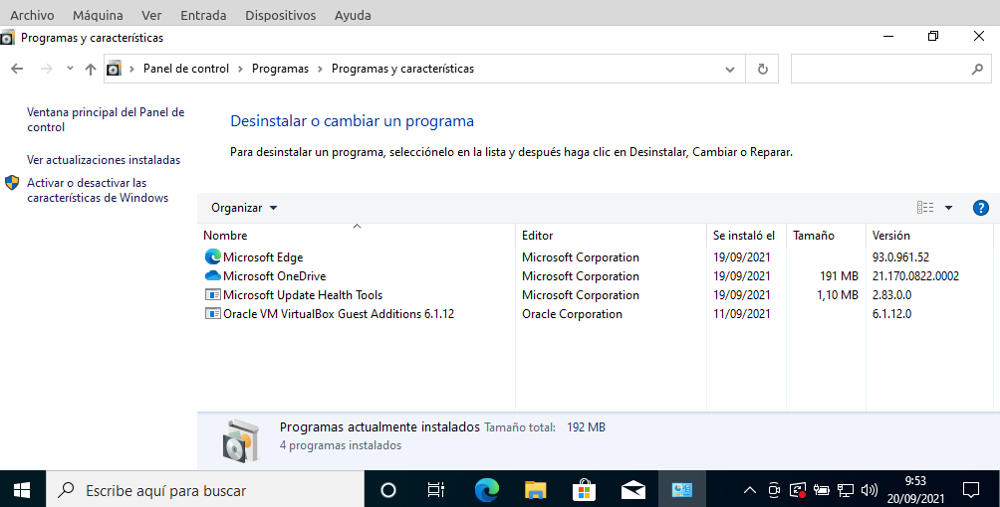
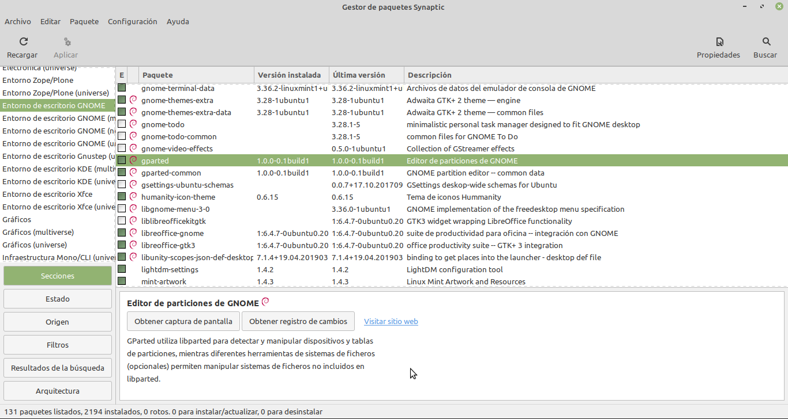
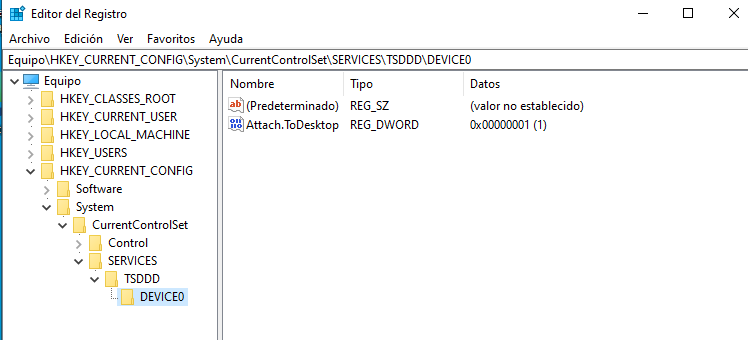

# Otras acciones a realizar
- [Otras acciones a realizar](#otras-acciones-a-realizar)
  - [Documentación de la instalación](#documentación-de-la-instalación)
  - [Instalación de aplicaciones](#instalación-de-aplicaciones)
    - [Instalar aplicaciones en Windows](#instalar-aplicaciones-en-windows)
    - [Instalar aplicaciones en GNU/Linux](#instalar-aplicaciones-en-gnulinux)
      - [Gestión del software en Gnu/Linux desde la terminal](#gestión-del-software-en-gnulinux-desde-la-terminal)
      - [Desinstalar aplicaciones](#desinstalar-aplicaciones)
  - [El Registro de Windows](#el-registro-de-windows)

## Documentación de la instalación
Cuando instalamos un sistema operativo, especialmente en un servidor, conviene ir anotando en un documento cuestiones importantes cómo:
- Fecha y hora de la instalación
- Especificaciones del hardware del equipo (procesador, RAM, disco llevar, tarjeta gráfica, tarjetas de red, etc.)
- Versión y num. de serie del sistema operativo, licencias de cliente instaladas, ...
- Identificación del equipo: nombre, ubicación, ...
- Identificación de los usuarios: contraseña del administrador, nombre y contraseña del resto de usuarios
- Software adicional instalado incluyendo el nombre del programa la versión, descripción, utilidad y fecha de instalación
- Configuración de red: IP, máscara, puerta de enlace, servidores DNS, num. de roseta en el switch o el rack, nombre del dominio o grupo de trabajo al que pertenece
- Impresoras conectadas: nombre, tipo, IP o puerto, ubicación
- Configuraciones adicionales: configuración de elementos como cortafuegos, gestor de base de datos, antivirus, etc
- Incidencias producidas en el proceso de instalación y solución dada

La documentación de un equipo no es un documento estático sino que va cambiado a lo largo del tiempo anotando todas las variaciones hechas en el mismo y otras informaciones útiles cómo:
- Actualizaciones instaladas: nombre, utilidad y fecha de instalación
- Otro software que se instale posteriormente
- Incidencias que se produzcan durante la vida útil del equipo
- etc

## Instalación de aplicaciones
Después de instalar el sistema operativo y los drivers necesarios nuestro ordenador ya es totalmente operativo pero todavía no es demasiado útil para el usuario final que necesita de software específico para las tareas que tiene que desarrollar.

Este software tendría que incluir un antivirus y seguramente otras aplicaciones como navegadores (como _Firefox_ o _Chrome_), paquetes ofimáticos (como _Office_ o _LibreOffice_), compresores de ficheros, programas de retoque fotográfico (como _Photoshop_ o _Gimp_), reproductores multimedia (como _VLC_), lectores de PDF (como _Adobe Reader_ o _Foxit_) y otros programas específicos que necesite el usuario. Por lo tanto todavía queda bastante trabajo para hacer después de instalar el sistema operativo.

Antes de instalar un programa nos tenemos que asegurar de que nuestro equipo cumple holgadamente los requisitos indicados tanto de hardware como de sistema operativo (igual que un sistema operativo sólo puede instalarse en una arquitectura de hardware concreta cada programa sólo es para un sistema operativo específico).

Si el programa no es libre tendremos que obtener una licencia para cada equipo en el que vamos a instalar la aplicación y hay que leer el contrato de licencia para asegurarnos que cumplimos con todos sus términos. En algunos casos podemos instalar el programa sin adquirir una licencia para probarlo durante un tiempo, transcurrido el cual tenemos que adquirir la licencia o desinstalarlo.

Instalar un programa es el proceso de copiar en el disco los ficheros que forman el programa, crear los directorios y los archivos de configuración de la aplicación e informar de todo esto al sistema operativo para que este pueda proporcionar al programa el entorno de ejecución que necesita.

Algunos programas son tan sencillos que no necesitan instalación sino que es suficiente con descomprimir sus ficheros (si tiene más de uno) en cualquier carpeta y ejecutar el fichero del programa. Para el resto el proceso de instalación empieza con la obtención del paquete del programa a instalar. Puede ser un fichero descargado de Internet, un CD-ROM o cualquier otro medio. En el caso del software libre lo más normal es que sean paquetes que nuestro ordenador descargará automáticamente desde uno de los repositorios.

A continuación ejecutaremos el instalador que es el programa que realizará todos los pasos para que la aplicación quede correctamente instalada en nuestro ordenador. Estos pasos incluyen:
- crear los directorios necesarios (en Windows dentro del directorio _Archivos de programa_ y en GNU/Linux en _opt_ o _usr_)
- descomprimir si es preciso y copiar todos los ficheros del programa a nuestro disco
- enlazar el programa con los ficheros de biblioteca necesarios (_DLL_s en caso de Windows o _dependencias_ en caso de Gnu/Linux)
- configurar el programa
- en ocasiones registrar la aplicación ante el propietario de la misma (recordad que el software privativo NO nos vende un programa sino el derecho a usarlo pero el programa continúa siendo propiedad del fabricante)

Sólo los usuarios administradores del ordenador pueden instalar nuevos programas.

En ocasiones antes de instalar una nueva versión de un programa tenemos que desinstalar la versión antigua, aunque lo más normal es que esto se haga automáticamente en el proceso de instalación.

Cuando no vamos a utilizar más un programa hay que desinstalarlo. La desinstalación de software es el proceso de revertir los cambios producidos en un sistema en la instalación del programa. Por eso no solamente tienen que ser borrados los archivos, sino también el resto de cambios realizados en el sistema, como por ejemplo, eliminar usuarios que hayan sido creados, retirar derechos concedidos, borrar directorios creados y, en el caso de Windows, borrar del registro todas las entradas referentes a la aplicación desinstalada.

Este proceso no siempre es correcto (especialmente en Windows) y a veces quedan en el sistema "restos" que van haciendo que nuestro ordenador cada vez funcione peor según va pasando el tiempo y vamos instalando y desinstalando todo tipo de programas.

### Instalar aplicaciones en Windows
Lo primero que necesitamos es obtener el programa a instalar: o bien lo tendremos en un CD, DVD u otro dispositivo o bien lo descargaremos de Internet. Una vez que tenemos el programa sólo hay que hacer doble clic sobre el instalador para que se inicie el proceso de instalación.

Para desinstalar una aplicación en Windows lo haremos desde el `Panel de control -> Programas -> Programas y características -> Desinstalar un programa`. Allí seleccionamos el programa y pulsamos el botón de _Desinstalar_.



### Instalar aplicaciones en GNU/Linux
La instalación de programas el Gnu/Linux es totalmente diferente al mundo del software privativo. El software libre está a disposición de todo el mundo por lo cual no tenemos que preocuparnos de conseguir el programa a instalar. Para ello tenemos los repositorios, que son servidores en Internet con miles de programas de software libre a nuestra disposición.

Al instalar el sistema operativo configuramos qué repositorios utilizará para obtener los paquetes (esta información se puede modificar posteriormente). El ordenador se descarga una lista de todos los paquetes disponibles en estos repositorios y cuando queremos instalar un de ellos simplemente lo marcamos en el programa gestor de paquetes (_Synaptic_, _Centro de software de Ubuntu_ o la utilidad gráfica que inclya nuestra distribución). Este programa se encarga automáticamente de descargar el paquete desde el repositorio, descomprimirlo, instalarlo y configurarlo. Por lo tanto la gestión del software el Gnu/Linux es extremadamente sencilla.



También tenemos la opción de buscar nosotros el paquete en Internet u otro medio e instalarlo haciendo doble clic sobre el mismo (como hacemos en los sistemas Windows). En este caso debemos descargar el paquete adecuado a nuestro sistema.

En GNU/Linux hay 2 tipos de empaquetado de software:
- `.deb`: es el empaquetado que utiliza _Debian_ y sus derivados (_Ubuntu_, _Mint_, ...). La utilidad que incluye el sistema para gestionar estos paquetes desde la terminal es `apt`
- `.rpm` (_RedHat Package Manager): es el que utilizan _RedHat_, _SuSE_ y sus derivados (_CentOS_, _Fedora_, ...). EN este caso se gestionan desde la terminal con el comando `yum`

#### Gestión del software en Gnu/Linux desde la terminal
Como ya hemos visto antes la gestión del software en GNU/Linux utiliza los repositorios, que se configuran en `/etc/apt/sources.list`.

Antes de descargar software es conveniente actualizar la lista de paquetes (con `apt update`) para asegurarnos de instalar las últimas versiones de los paquetes.

Los comandos a usar son:
- `apt install nombre_de el_paquete` para instalar un paquete
- `apt reinstall install nombre_de el_paquete` para reinstalar un paquete
- `dpkg-reconfigure nombre_de el_paquete` para reconfigurar un paquete (sin volverlo a instalar)
- `apt source nombre_de el_paquete` para descargar el código fuente de un paquete (en este caso para poder usarlo deberemos compilarlo)
- `apt search _queBusco_` para buscar los paquetes relacionados con lo que busco
- `apt show nombre_del paquete` para obtener más información sobre un paquete
- `dpkg -i nombre_de el_paquete.deb` para instalar un paquete .deb que hemos descargado nosotros previamente. 
Si tiene dependencias que no tenemos instaladas fallará la instalación. Para que se instalen automáticamente las dependencias no resueltas ejecutamos `apt-get -f install` y luego volveremos a intentar la instalación del paquete que ha fallado

Además de instalar paquetes individuales podemos instalar funcionalidades enteras (un conjunto de paquetes relacionados) con `tasksel`.

Todo esto es para distribuciones basadas en _Debian_. Para las que utilizan el empaquetado _.rmp_ el funcionamiento es muy similar (en muchos caso es sólo usar el comando `yum` en vez de `apt`)

#### Desinstalar aplicaciones
En Gnu/linux podemos desinstalar las aplicacioes desde el entorno gráfico con Synaptic, el Centro de software de Ubuntu o cualquier otra utilidad gráfica. También se puede hacer desde la terminal con la orden:

```bash
apt remove [--purge] paquete_a_desinstalar
```

Si ponemos la opción `--purge` también se borrarán todos los ficheros de configuración del programa.

## El Registro de Windows
Es una base de datos jerárquica donde se guarda la configuración del sistema en Windows. Contiene la configuración de los componentes de bajo nivel del sistema operativo, así como de las aplicaciones que hay funcionando en la plataforma. Este registro lo usa el kernel, los controladores de dispositivos, los servicios, la interfaz de usuario y aplicaciones de terceros. Está organizado en categorías, subcategorías, claves y subclaves y dentro de ellas están las entradas con sus valores.

Se trata de un elemento fundamental y sin él no se puede cargar el sistema por lo cual antes de modificar su contenido es recomendable hacer una copia de seguridad por si algo fuera mal.

Para editar (o hacer una copia) del registro tenemos el programa `Regedit.exe` que nos muestra todo el registro. Este está organizado en categorías:
- **HKEY_CLASES_ROOT**: contiene archivos y vínculos OLE y las asociaciones de archivo y clase. Esta información está repetida en las clases _HKEY\_LOCAL\_MACHINE\\SOFTWARE\\Clases_ y en _HKEY\_CURRENT\_USER\\SOFTWARE\\Clases_
- **HKEY_CURRENT_USER**: contiene la configuración del usuario actual. Es un subconjunto de la categoría _HKEY\_USERS_ en lo referente al usuario actual
- **HKEY_LOCAL_MACHINE**: es la categoría más importante. Contiene la información del hardware y el software instalados. Algunas partes se rehacen cada vez que iniciamos el equipo para reflejar la configuración actual del hardware
- **HKEY_USERS**: contiene las configuraciones de los perfiles de todos los usuarios (incluyendo el perfil por defecto)
- **HKEY_CURRENT_CONFIG**: guarda las configuraciones actuales del hardware y el software del equipo. Es el subconjunto de _HKEY\_LOCAL\_MACHINE\\SYSTEM\\CurrentControlSet\\Hardware\Profiles\Current correspondiente a la configuración actual

Cada entrada del registro tiene 3 partes:
- nombre de la entrada
- tipo de datos
- valor

Podemos ver el contenido del registro de Windows y modificarlo con el programa `regedit.exe`:



Antes de hacer cualquier modificación en el registro es recomendable hacer una copia de seguridad del mismo. Con el programa _regedit.exe_ podemos exportar la rama del registro seleccionada o el registro entero (seleccionando la raíz del mismo). La información del registro se guardará en un fichero con extensión _.reg_

También podemos exportar el registro a un fichero desde la terminal con la orden:

```cmd
regedit /e nombre_del_fichero
```

Si hemos hecho algún cambio en el registro que ha provocado que el sistema funcione mal podemos restaurar la copia anterior del registro con el programa regedit.exe

También puede hacerse desde la terminal con la orden:

```cmd
regedit nombre_de el_fichero
```

Si le ponemos la opción /s no pedirá al usuario que confirme la operación.

Además Windows después de iniciar el sistema guarda siempre una copia de seguridad de cómo estaba el registro al inicio. Si cambiamos algo (editándolo directamente o bien cambiando alguna configuración o instalando un nuevo programa o driver para algún dispositivo) y al reiniciar se produce un error que no permite cargar el sistema, aparecerá en el menú de arranque una opción etiquetada como _**La última configuración válida conocida**_ que carga el registro que se guardó al iniciar correctamente la última vez.

También se guarda una copia cada vez que se crea un **punto de restauración del sistema** y con la herramienta de **Restaurar sistema** podemos volver a dejarlo en el estado en que se encontraba en dicho punto de restauración.
