# Sistemas de Archivos

- [Sistemas de Archivos](#sistemas-de-archivos)
  - [Introducción](#introducción)
    - [Unidades de almacenamiento](#unidades-de-almacenamiento)
      - [Estructura lógica](#estructura-lógica)
    - [Almacenamiento de la información](#almacenamiento-de-la-información)
  - [Sistemas de archivo](#sistemas-de-archivo)
    - [Journaling](#journaling)
    - [Principales sistemas de archivo](#principales-sistemas-de-archivo)
  - [Gestión de sistemas de archivo](#gestión-de-sistemas-de-archivo)
    - [Objetivos del sistema de archivos](#objetivos-del-sistema-de-archivos)
    - [Funciones del gestor de archivos](#funciones-del-gestor-de-archivos)
    - [Gestión desde el entorno gráfico](#gestión-desde-el-entorno-gráfico)
    - [Gestión desde la terminal](#gestión-desde-la-terminal)
    - [Montaje sistema de ficheros](#montaje-sistema-de-ficheros)
  - [Estructura](#estructura)
    - [MS Windows](#ms-windows)
    - [GNU/Linux](#gnulinux)
  - [Permisos](#permisos)
    - [MS Windows](#ms-windows-1)
    - [GNU/Linux](#gnulinux-1)

## Introducción

### Unidades de almacenamiento

- La información se guarda dentro de **soportes o unidades de almacenamiento** (Discos duros, USBs, CDs, etc.)
  
- Esta información tiene forma de **archivos o ficheros**
  
- La forma en que se almacena la información la determina el **sistema de ficheros**.
  
- El sistema de ficheros establece para cada fichero:
  - ESTRUCTURA 
  - NOMBRE 
  - FORMA DE ACCESO
  - PROTECCIÓN
  
- Las unidades de almacenamiento
  - Guardan la información con la que trabaja el ordenador
  - Son dispositivos **no volátiles** (no se borra su contenido cuando deja de recibir electricidad)

**Estructura física de un disco duro**

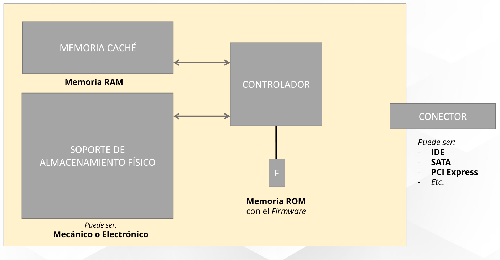

**Platos (A)**: cada uno de los discos unidos por su eje que forman normalmente un disco duro

**Caras**: cada una de las caras de cada plato (la superior y la inferior

**Cabezas (C)**: el elemento que lee o escribe en el disco. Hay un cabezal de lectura/escritura para cada cara

**Brazo (B)**: dispositivo al que van unidas cada una de las cabezas de lectura/escritura

**Pistas (E)**: son círculos concéntricos en los cuales se divide cada cara.

**Cilindro (D)**: se llama así a la misma pista de todas las caras (formado por todas las pistas accesibles en una posición de los cabezales)

**Sector (F)**: cada una de las divisiones de una pista. Es la unidad mínima que se puede leer o escribir de un disco

**Clúster**: agrupación fija de sectores (se determina al dar formato al disco. Es la unidad mínima que el sistema operativo lee o escribe en cada operación.

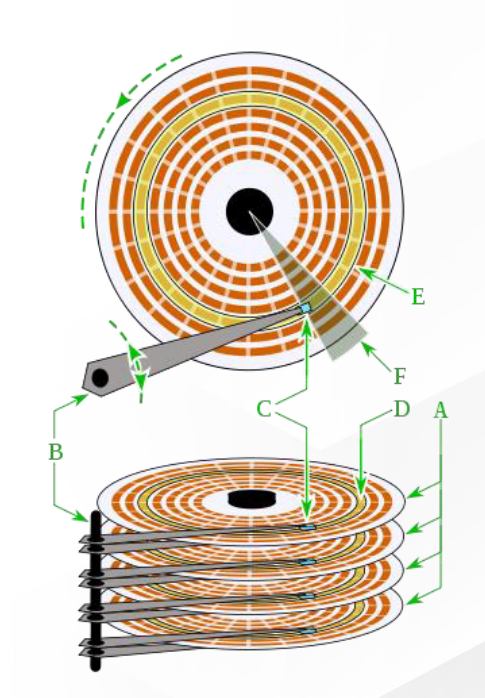

**Estructura física de un disco duro SSD**

Se eliminan las partes móviles de un disco duro mecánico, aumentando considerablemente la velocidad.

Se utilizan **memorias Flash con puertas lógicas NAND**, que son no volátiles 

Estas puertas NAND están fabricadas mediante **transistores** de puerta flotante que es el elemento en donde se almacenan los bits. Para el caso de las memorias RAM estos transistores necesitan de una alimentación continua para mantener su estado y en las memorias flash no. Cuando un transistor de puerta flotante está cargado tiene en su interior un 0, y cuando está descargado tiene
un 1.

Los chips de memoria Flash con puertas NAND se organizan en forma de **matriz**.

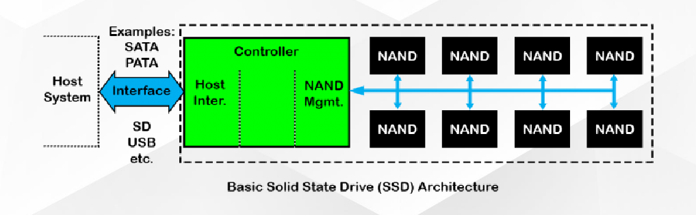

#### Estructura lógica

Se **abstrae la estructura física** del disco para crear una estructura lógica, en la que la memoria se ve como una serie de sectores contiguos.

Por ejemplo, en un disco particionado con tabla de particiones Ms-DOS, el sector de arranque (**MBR o Master Boot Record**) se localiza siempre en el primer sector del disco (cabeza 0, cilindro 0, sector 1). 

En él se almacena la tabla de particiones y un pequeño programa (master boot code) encargado de leer la tabla de particiones y ejecutar el programa del sector de arranque de la partición activa.

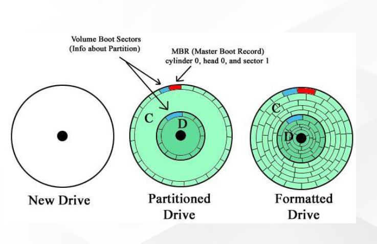

Cada partición se comporta como si fuera un disco independiente. La estructura interna de cada partición dependerá del sistema de archivos que utilice. Se llama sector de arranque de la partición al primer sector de la misma y, si la partición tiene instalado un sistema operativo, en él se encontrará el programa que inicia el arranque del sistema.

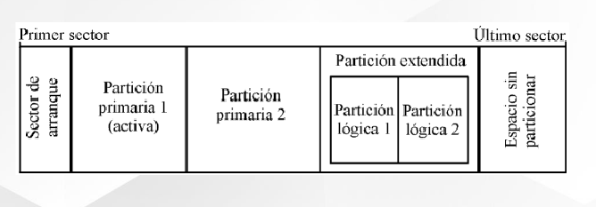

La tabla de **particiones GUID (GPT)** es un estándar para la colocación de la tabla de particiones en un disco duro físico. Es parte del estándar Extensible Firmware Interface (EFI) propuesto por Intel para reemplazar el viejo BIOS del PC. La GPT sustituye al Master Boot Record (MBR) usado con el BIOS.

Mientras que el MBR comienza con el código de arranque maestro (Master Boot Code), que contienen un binario ejecutable que identifica la partición activa e inicia el proceso de arranque, la GPT se basa en las capacidades extendidas del EFI para estos procesos. A pesar de que una entrada de MBR comienza el disco, con propósitos de protectividad y compatibilidad con el viejo esquema BIOS PC, la GPT propiamente dicha comienza con la cabecera de la tabla de particiones.

GPT usa un moderno modo de direccionamiento lógico (LBA, logical block addressing) en lugar del modelo cilindro-cabeza-sector (CHS) usado con el MBR. La información de MBR heredado está almacenada en el LBA 0, la cabecera GPT está en el LBA 1, y la tabla de particiones en sí en los bloques sucesivos. En los sistemas operativos Windows de 64-bits, 16.384 bytes, o lo que es lo mismo, 32 sectores, están reservados para la GPT, dejando el bloque LBA 34 como el primer sector usable del disco.

GPT proporciona asimismo redundancia. La cabecera GPT y la tabla de particiones están escritas tanto al principio como al final del disco.

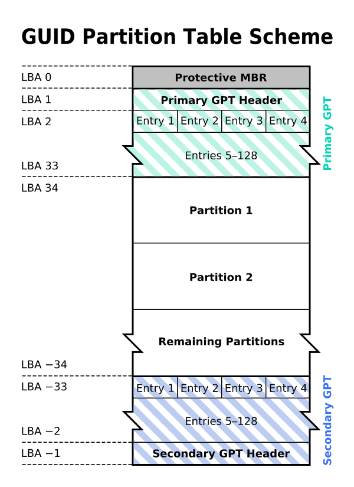

### Almacenamiento de la información

La información se guarda en los dispositivos de almacenamiento mediante archivos, que son grupos de informaciones relacionadas.

Cada sistema operativo utiliza su sistema de archivos para gestionar como se guardan y sus metadatos:

- Nombre
- Tamaño
- Tipo de archivo
- Fecha
- Ubicación física
- Etc.

Un archivo se identifica de forma unívoca mediante su nombre y la ruta de acceso. 

El aspecto y formato del nombre depende del sistema operativo y del sistema de archivos que utilizamos.

Algunos sistemas permiten nombres con espacios, caracteres especiales, distinguen entre mayúsculas y minúsculas, etc.

Una parte importante del nombre de un archivo es su extensión, que se ubica al final del mismo detrás de un punto (normalmente son 3 caracteres, aunque puede variar)

En **MS Windows** la extensión permite conocer el tipo de información que contiene.

En **GNU/Linux** esta información se guarda en meta-datos, aunque se suele utilizar la extensión para aportar información al usuario.

***Directorios***

Tipo de archivo especial que permite organizar los ficheros.

Puede contener ficheros y/o otros directorios. 

De este modo los archivos y directorios constituyen una **estructura jerárquica** en forma de **árbol**: cada medio tiene un directorio principal llamado **directorio raíz** dentro del cual se encuentran archivos y otros subdirectorios que contienen más archivos y subdirectorios.

Se denomina **directorio padre** de un directorio al directorio que contiene a ese directorio.

***Directorio raíz***

Es el primer directorio o carpeta en una jerarquía. Contiene todos los subdirectorios de la jerarquía.

En sistemas tipo **Unix**, se identifica con el carácter **/**. Todos los accesos al sistema de ficheros, incluyendo los otros discos y particiones, se encuentran en la jerarquía dentro del directorio raíz.

En los sistemas Windows cada partición tiene un directorio raíz individual
(nombrado ***letra***:***\\***, por ejemplo para una determinada partición C su directorio raíz se llama ***C***:***\***) y no hay un directorio raíz común que las contenga a todas ellas.

**Rutas**

La ubicación de un archivo se indica con una cadena de texto llamada "ruta" (path).
La ruta también sirve para identificar al archivo. Puede haber dos archivos con el mismo nombre en distintas rutas.
La nomenclatura de rutas varía ligeramente dependiendo del sistema.

Aunque de forma general, una ruta viene dada por una sucesión de nombres de directorios y subdirectorios, ordenados jerárquicamente de izquierda a derecha y separados por algún carácter especial que suele ser una barra ('/') o barra invertida ('\') y acaba en el nombre de un archivo o directorio presente en la última rama de directorios especificada.

Ejemplo de ruta en **Unix**:

/home/usuario/documentos/documento.txt

- **/** representa el directorio raíz
- **home/usuario/música** es la ruta
- **documento.txt** es el nombre del archivo

Ejemplo de ruta en **Windows**:

C:\Usuarios\usuario\Documentos\documento.txt

- **C:** es la unidad de almacenamiento
- **\\** representa el directorio raíz de la unidad C:
- **Usuarios\usuario\Documentos** es la ruta
- **documento** es el nombre del archivo
- **.txt** es la extensión

**Rutas absolutas y relativas**

Siempre hay 2 formas de identificar un fichero:

- Utilizando su ruta absoluta: es la que empieza en el directorio raíz y llega hasta el fichero. Los ejemplos que hemos visto anteriormente usan rutas absolutas.
- Utilizando rutas relativas: en lugar de empezar la ruta por el directorio raíz se empieza desde el directorio activo (directorio en el que nos encontramos).

**Ejemplo de ruta absoluta**

/home/usuario/documentos/documento.txt

**Ejemplo de rutas relativas**

Si el directorio activo es /home/usuario, la ruta del fichero documento.txt sería:

*documentos/documento.txt*

Si el directorio activo es /home/usuario/música/, la ruta del fichero documento.txt sería:

*../../documentos/documento.txt*

## Sistemas de archivo

Establece la estructura, nombre, forma de acceso, uso y protección que tendrá cada archivo almacenado.

El tipo de sistema de archivos de un dispositivo se determina al darle formato.

Además de alojar los datos de los archivos, el sistema de archivo también almacena y manipula información muy importante sobre los archivos y el propio sistema de archivo (fecha y hora, propiedad, permisos de acceso, tamaño de los archivos, localización o localizaciones del almacenaje en el disco, etc).

Esta información constituye lo que comúnmente denominamos metadatos que son atributos asociados a un fichero pero que no forman parte de él. 

La mayoría de los sistemas operativos usan su propio sistema de ficheros.

Los sistemas de archivos proveen métodos para crear, copiar y eliminar tanto archivos como directorios así como para garantizar el acceso seguro a los archivos.

Cuando elegimos un sistema de archivos para formatear un medio debemos tener en cuenta:
- La medida máxima que puede tener un fichero.
- Capacidad máxima del sistema de ficheros (es decir, medida máxima de cada partición)
- Cómo gestiona los permisos de ficheros y directorios.
- Cómo evitar la fragmentación. Si permiten enlaces, tanto simbólicos como duros.
- Si tiene **Journaling** (recuperación después de un apagado brusco)
- Si proporciona soporte para ficheros dispersos.
- Si permite el crecimiento del sistema de ficheros nativo.

**Fragmentación del disco**

Al irse escribiendo y borrando archivos continuamente en el disco duro, estos tienden a no quedar en **áreas contiguas**.

Así los diferentes clústeres que forman el archivo quedan repartidos por todo el disco, y se dice entonces que el **archivo** está **"fragmentado"**.

Al tener los archivos esparcidos por el disco, se vuelve ineficiente el acceso a ellos.

Los sistemas de archivos de **Windows** tienen mayor tendencia a la fragmentación.

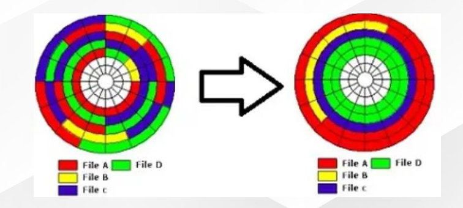

### Journaling

El sistema de archivos procura trabajar de forma asíncrona para evitar cuellos de botella.

Si el ordenador se apaga de forma brusca, pueden ocurrir varias cosas:
  
- Si ya se ha salvado el archivo, al reiniciarse se puede continuar trabajando en él.
- Si todavía no se ha salvado el archivo, probablemente se pierdan los datos recientes.
- Si el archivo está siendo escrito en disco, tenemos un archivo parcialmente nuevo y no se podrá abrir porque el formato interno de los datos es inconsistente.
- Si se ha escrito el archivo pero todavía no los metadatos será el peor escenario puesto que tendremos un sistema de archivos corrupto, pudiendo perder muchos datos.
- Los sistema de archivo más modernos escriben primero en un área llamada journal o log, antes de escribir los datos en su localización final.
- Una vez escritas en su posición del disco se borran del log.
- De este modo, cuando el sistema arranca tras un apagado brusco en mitad de una transacción, simplemente se debe rehacer lo escrito en el journal.

### Principales sistemas de archivo

**FAT (File Allocation Table)**

Es el sistema de archivos que se utilizaba en los primeros PC's. En la actualidad suele usarse normalmente en las unidades USB. Sus principales inconvenientes son:

- Tamaño máximo del sistema de archivos y de un fichero de 4GB
- No soporta ACLs ni ningún otro tipo de permiso
- No tiene Journaling ni soporte para metadatos

**FAT32**

Supera algunas limitaciones de FAT:

- Puede almacenar hasta 2TB
- Soporte para Journaling y metadatos
- También tiene un límite de tamaño de archivo individual de 4GB

**exFAT**

Supera las capacidades de almacenamiento de sus predecesores (sin problemas en la capacidad de almacenamiento)

**NTFS (New Technology File System)**
- Supera las limitaciones de FAT en los sistemas Windows.
- Es eficiente, robusto, admite seguridad, compresión nativa de ficheros, cifrado y journaling.
- El inconveniente que plantea es que necesita para si mismo bastante espacio en disco.

**ext (Extended Filesystem)**

- ext fue el primer sistema de archivos diseñado específicamente para Linux
- Sucedido por ext2, que todavía no implementa Journaling
- ext3 y ext4 sí poseen Journaling y son los que se utilizan en la actualidad

El sistema de ficheros tiene una tabla donde se almacenan los i-nodos, que almacenan la información del archivo:
- Ruta
- Tamaño
- Ubicación

[https://en.wikipedia.org/wiki/List_of_file_systems](https://en.wikipedia.org/wiki/List_of_file_systems)

## Gestión de sistemas de archivo

Los sistemas operativos incluyen **herramientas para gestionar** los **sistemas de archivos** soportados por ellos.

Esta gestión incluye las **operaciones** más **habituales**:

- Creación
- Lectura
- Actualización
- Eliminación
- Ejecución
- Control de acceso
- Operaciones sobre el propio sistema de archivos

### Objetivos del sistema de archivos

Garantizar que la información del archivo sea válida.
  
- Optimizar el acceso a los archivos.
- Proveer soporte de E/S a gran variedad de dispositivos de almacenamiento.
- Entregar los datos que el usuario necesita.
- Eliminar o minimizar una potencial pérdida de datos.
- Proveer un conjunto estándar de rutinas E/S.
- Dar soporte de E/S a múltiples usuarios.

### Funciones del gestor de archivos

Identificar y localizar un fichero.

- Utilizar un directorio para describir la ubicación y atributos de un archivo.
- Controlar el acceso de varios usuarios a los archivos.
- Bloquear el uso de archivos.
- Ubicar archivos en bloques libres.
- Administrar el espacio libre

### Gestión desde el entorno gráfico

Windows: Desde el Administrador de discos (solo lee particiones FAT o NTFS)

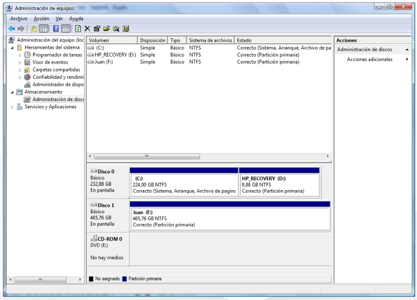

Se puede gestionar cada partición: crear, eliminar, redimensionar, formatear o cambiar la forma en que Windows monta la partición.

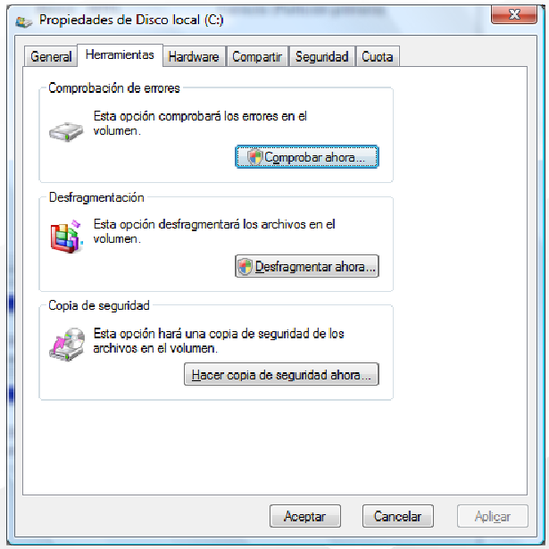

GNU/Linux: Las diferentes distribuciones y los diferentes escritorios tienen herramientas gráficas propias para gestionar los sistemas de archivo, aunque son bastante parecidos.

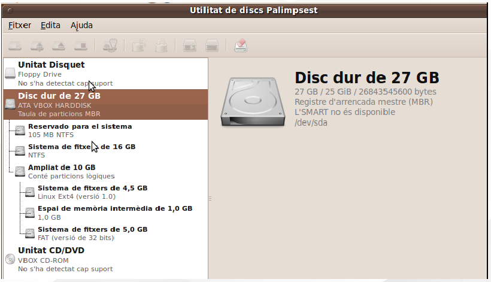

**gparted**

### Gestión desde la terminal

**Windows**

No es habitual gestionar los sistemas de archivo en Windows desde la consola pero tenemos varios comandos para hacerlo:

- **chkdsk**: permite comprobar un sistema de archivos FAT o NTFS
- **defrag**: para desfragmentar el sistema de archivos que le indicamos
- **format**: formatea una partición con sistema de archivos FAT o NTFS
- **convert**: convierte una partición FAT a NTFS sin perder los datos

Algunos comandos (como chkdsk o defrag) tienen que ejecutarse desde la consola de Administrador.

Para gestionar particiones disponemos del programa diskpart (dentro del programa teclear help para obtener ayuda).

**GNU/Linux**
Algunos de los comandos para gestionar el sistema de archivos son:

- fsck: permite comprobar un sistema de archivos (hay versiones para los diferentes FS)
- mkfs: formatea una partición con sistema de archivos ext, FAT, NTFS, etc.
- mount: monta una partición en una carpeta para poderla utilizar
- df: muestra un resumen de todas las particiones montadas en el sistema
- dd: permite copiar directamente al o desde el disco duro
- gdisk.
- sfdisk.
  
Algunos comandos tienen que ejecutarse con permisos de Administrador.

También tenemos el programa fdisk para gestionar discos con tabla de particiones ms-dos o parted que permite gestionar tanto particiones ms-dos como GPT.

### Montaje sistema de ficheros

Para que el sistema operativo pueda utilizar un dispositivo y acceder a su sistema de archivos primeramente tiene que montarlo. Este proceso es normalmente automático y asocia ese dispositivo a una ruta (una letra en Windows o un directorio en Gnu/Linux).

**WINDOWS**

- Monta automáticamente todos los dispositivos que encuentra y tengan sistema de archivos soportado (FAT o NTFS).
- A cada partición le asignará una ruta formada por una letra y dos puntos. Por ejemplo, C: 
- Se puede modificar la letra asignada desde el Administrador de discos.

**LINUX**

- En este sistema sólo existe un directorio raíz por lo que cualquier dispositivo de almacenamiento que queramos utilizar ha de montarse en algún directorio.
- Se montan automáticamente las particiones indicadas en el fichero de configuración **/etc/fstab**.
- Los discos USB suelen montarse automáticamente (normalmente bajo la
carpeta **/media**).

## Estructura 

Por defecto, cuando instalamos un sistema operativo se crean una serie de directorios donde se almacenan los ficheros del sistema, los programas instalados, etc. Veremos las diferencias entre los dos sistemas operativos con los que estamos trabajando.

### MS Windows

En los sistemas Microsoft el sistema asigna una letra para cada dispositivo de almacenamiento (partición, disco o unidad extraíble). Normalmente, el sistema operativo se instalará en la unidad C:. En esta unidad se crearán los directorios por defecto del sistema operativo.

**\Boot**: Este directorio contiene archivos y directorios utilizados en el arranque del sistema. Normalmente se encuentra en una partición que se crea al instalar el sistema.

**\Archivos de programa**: La mayoría de los programas (incluidos los programas y herramientas que vienen con Windows) instalan los ficheros que necesitan en sub-carpetas dentro de esta carpeta.

**\Archivos de programa x86**: Si nuestro sistema es de 64 bits también se creará esta carpeta donde se instalarán los programas que son de 32 bits.

**\PerfLogs**: Almacena información sobre rendimiento y monitorización del sistema.

**\Usuarios**: La primera vez que entramos en el equipo con una cuenta de usuario, Windows crea una carpeta para la cuenta de usuario en la carpeta *“Usuarios”*. Ésta contiene:

  - Varias sub-carpetas para almacenar datos del usuario: Contactos, Escritorio, Documentos, Música, Videos, etc.

  - Una carpeta oculta AppData que contiene información sobre configuración de nuestra cuenta de usuario y los programas que utiliza.

La carpeta Usuarios también contiene la subcarpeta de Acceso Público en la que se guardan los archivos compartidos entre todos los usuarios del equipo.

**\Windows**: La mayoría de los ficheros críticos del sistema operativo se almacenan en esta carpeta. Es mejor no tocar nada de esta carpeta a no ser que sepamos realmente qué estamos haciendo.

### GNU/Linux

El estándar que detalla los nombres, ubicaciones, contenidos y permisos de los archivos y directorios de cualquier sistema Unix y derivados (como GNU/Linux lo define el FHS **(Filesystem Hierarchy Standard)**.

Es un estándar flexible, por lo que pueden haber pequeñas diferencias entre distribuciones. 

**El directorio raíz ( / )**: Todos los archivos y directorios se encuentran bajo este directorio (no hay uno por unidad como en Windows). No es recomendable crear directorios o archivos directamente en este directorio.

**/home**: Contiene los subdirectorios que son directorios personales de los diferentes usuarios del sistema. Cada directorio de usuario es un lugar donde se localizan los ficheros personales de dicho usuario y también los archivos de configuración propios de cada cual (su perfil).

**/root**: Directorio raíz del usuario root (este usuario no tiene su directorio en /home)

**/etc**:Contiene archivos necesarios para la configuración del sistema y de los diferentes programas instalados. Son ficheros de texto plano que podemos editar para modificar las opciones.

**/boot**: Este directorio contiene todo que necesita el proceso de arranque del sistema.

**/dev**: Este directorio almacena las definiciones de todos los dispositivos, es decir los archivos especiales asociados a cada dispositivo. (El subdirectorio **/dev/null** actúa como agujero negro)

**/media**: Contiene los subdirectorios que se utilizan como puntos del montaje para los medios de almacenamiento extraíble, como por ejemplo ç disquetes, CD-ROM y memorias USB’s.

**/mnt**: Se utiliza para montar particiones de forma temporal en el sistema por parte del usuario.

**/bin**: En este directorio se sitúa el código binario o compilado de los programas y comandos que pueden utilizar todos los usuarios del sistema.

**/sbin**: Como el anterior pero contiene comandos y programas exclusivos de root.

**/srv**: Directorio donde guardar los ficheros y directorios de datos del sistema.

**/tmp**: Directorio donde se guardan los archivos temporales.

**/proc**: El contenido de este directorio es virtual y sus ficheros no existen realmente en disco, sólo están en la memoria. Son archivos que contienen información sobre nuestro sistema.

**/lib**: Contiene librerías compartidas (similar a las DLLs de Windows) necesarias para arrancar el sistema y para los ficheros ejecutables. También contiene módulos del núcleo básicos que permiten el funcionamiento de muchos elementos de hardware.

**/opt**: Contiene paquetes de programas opcionales de aplicaciones que pueden ser compartidas entre los usuarios. Estas aplicaciones no guardan sus configuraciones en este directorio; de este modo, cada usuario puede tener una configuración diferente de una misma aplicación, de forma que se comparte la aplicación pero no las configuraciones de los usuarios, las cuales se
guardan en su respectivo directorio /home.

**/usr**: También incluye comandos y programas y sus ficheros tienen que ser de sólo lectura. Normalmente en este directorio se almacena el software instalado en el sistema.

## Permisos 

La mayoría de los sistemas de archivos modernos permiten asignar **permisos** a los archivos para determinados **usuarios y grupos** de usuarios.

Los sistemas de archivo **FAT** no implementan ningún sistema de permisos. Sólo existe un atributo de *"solo lectura“*.

Los sistemas **NTFS** usan listas de control de acceso (**ACLs**) para administrar los permisos.

Las ACLs permiten asignar a cada **usuario o grupo** los permisos que tendrá sobre el archivo o directorio.

Los sistemas **UNIX** y derivados poseen un sistema simple para el manejo de permisos sobre archivos individuales, aunque también permiten usar un sistema de listas de control de acceso (**ACLs**).

### MS Windows

**Atributos**

Un atributo es una característica de un archivo o carpeta que se aplica a todos los usuarios del sistema.

Existen desde las primeras versiones de **FAT**. Por ejemplo, los atributos *Hidden (Oculto)* o *Read-Only (Solo Lectura)*.

No permiten realizar un control sobre los archivos tan específico como los permisos, implementados a partir del sistema de ficheros **NTFS**.

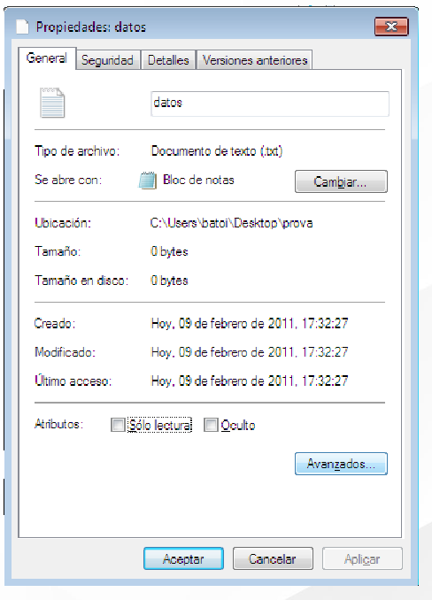

- **Oculto (H)**: indica que el fichero no se ve al entrar en su directorio.
- **Solo lectura (R)**: indica que no podemos modificar el contenido del fichero.
- **Sistema (S)**: atributo de Windows, indica que se trata de un archivo especial del sistema operativo.
- **Accedido (A)**: atributo de Windows, se utiliza para hacer copias de seguridad.

**Permisos NTFS**

Los permisos se especifican para cada usuario o grupo de usuarios.

Para gestionar los permisos, abrimos el menú contextual del archivo y seleccionamos la opción Propiedades, pestaña de Seguridad.

Podemos ver:
  
- **Ruta** absoluta al recurso
- **Usuarios y grupos** con permisos sobre este recurso.
- **Permisos** en función del rol seleccionado.

Tipos de permisos NTFS:

- **Permisos especiales**: Controlan cada acción que un usuario puede o no hacer sobre una carpeta o archivo. Son muchos y es bastante compleja su administración.
- **Permisos estándar**: Son combinaciones de varios permisos especiales para hacer más sencillo su uso.

Normalmente utilizaremos sólo los permisos estándar y si en algún momento necesitamos un mayor grado de control utilizamos los permisos especiales.

**Permisos estándar**

- **Control total**: permite hacer cualquier cosa, incluyendo cambiar los permisos o la propiedad del archivo o carpeta. Este permiso incluye todos los otros.
- **Modificar**: permite hacer cualquier cosa con el recurso, como leer, modificar o eliminar pero no permite cambiar los permisos. Incluye los permisos de Leer y ejecutar y Escribir.
- **Leer y ejecutar**: permite leer el recurso y ejecutarlo si se trata de un programa. Si es una carpeta podemos ver su contenido y entrar dentro. Este permiso incluye el permiso de Leer y, en el caso de carpetas, incluye el de Mostrar el contenido.
- **Mostrar el contenido de la carpeta**: se aplica en carpetas y permite ver su contenido y entrar dentro de la carpeta.
- **Leer**: permite ver el contenido (si es una carpeta ver los ficheros que contiene pero no entrar dentro) y ver sus atributos y permisos.
- **Escribir**: si es un fichero permite modificarlo y si es una carpeta permite copiar ficheros dentro pero no eliminar nada ni leerlo (ficheros) o ver su contenido ni entrar (carpetas). 

La mayoría a veces utilizamos sólo los permisos de Control total, Modificar o Leer y ejecutar.

**Permisos especiales**

- **Recorrer carpeta o ejecutar archivo**: permite o impide que el usuario pase por la carpeta para llegar a otros archivos o carpetas (carpeta) o permite ejecutarlo (archivo).
- **Listar carpeta / Leer datos**: permite que el usuario vea los nombres de fichero y subcarpetas de la carpeta (carpeta) o ver datos del archivo (archivo).
- **Atributos de lectura**: permite ver los atributos de un archivo o de una carpeta, definidos por el sistema de archivos NTFS.
- **Atributos extendidos de lectura**: permite ver los atributos extendidos de un archivo o de una carpeta, que están definidos por los programas y pueden variar de uno al otro.
- **Crear archivos / Escribir datos**: permite crear archivos en la carpeta (carpeta) o hacer cambios en el archivo (archivo).
- **Crear carpetas / Anexar datos**: permite crear carpetas en la carpeta (carpeta) o añadir datos al final del fichero (archivo).
- **Atributos de escritura**: permite que el usuario cambie los atributos NTFS de un archivo o de una carpeta.
- **Atributos extendidos de escritura**: permite que se cambien los atributos extendidos de un archivo o de una carpeta (definidos por los programas y pueden variar de uno al otro).
- **Eliminar subcarpetas y archivos**: permite eliminar subcarpetas y archivos. Este permiso se aplica sólo en las carpetas.
- **Eliminar**: permite eliminar el archivo o la carpeta a quien se aplica este permiso.
- **Leer permisos**: permite leer los permisos del archivo o de la carpeta.
- **Cambiar permisos**: permite cambiar permisos del archivo o de la carpeta.
- **Tomar posesión**: permite que el usuario tome posesión del fichero o de la carpeta. El propietario de un archivo o de una carpeta siempre puede cambiar los permisos del fichero o la carpeta.

**Permisos heredados**: Al crear una carpeta o archivo este hereda los permisos de la carpeta o unidad donde se crea.

**Permisos explícitos**: Permisos que añade cualquier usuario autorizado sobre el recurso a parte de los heredados.

**Permisos efectivos**: Que un usuario tenga o no permiso sobre un archivo o carpeta depende de:

- los permisos que posea dicho usuario
- los permisos de todos los grupos a los que pertenece el usuario
- los permisos explícitos del objeto
- los permisos heredados del mismo

Por eso a veces se hace difícil determinar qué permisos reales tenemos sobre algún recurso. Los permisos efectivos permiten ver los permisos vigentes en el recurso.

### GNU/Linux

**GNU/Linux** utiliza un sistema de permisos más simple que el de NTFS basado en 3 permisos básicos:

- **r (read)**: es el permiso de lectura y permite ver el contenido de un fichero o de una carpeta
- **w (write)**: es el permiso de escritura y permite modificar ficheros, borrar o crear ficheros y
subcarpetas nuevos
- **x (execute)**: en el caso de ficheros permite ejecutarlos (si es un programa ejecutable) y en el caso de carpetas permite entrar dentro

Por defecto no se usan **ACLs** (aunque podemos usarlas). Se definien permisos para:

- **Usuario** propietario del recurso
- **Grupo** principal al que pertenece el usuario propietario
- **Otros** usuarios del sistema

A este tipo de permisos se les suela llamar **UGO** (acrónimo de User Group Others).

Al ejecutar el comando **ls -l** veremos los permisos de cada archivo del directorio:

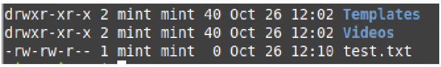

- **Permisos**: los 10 primeros caracteres nos indican los permisos del fichero.
- **Enlaces fuertes**: similar a un puntero. Para los directorios, este número indica cuántas carpetas contiene (incluyendo ‘.’ para sí misma y ‘..’ para la carpeta padre)
- **Usuario propietario**: usuario propietario del fichero
- **Grupo propietario**: grupo propietario del fichero
- **Tamaño**: expresado en bytes
- **Fecha y hora**: de la última modificación
- **Nombre**: del fichero o directorio

El significado de los permisos es el siguiente:

- **Tipo de Archivo**: en el caso de ser un fichero, aparece el carácter "-", mientras que para los directorios aparece una "d“ y para los enlaces “l”.
- **Permisos del propietario** : nos indican, respectivamente, los permisos de lectura, escritura y ejecución para el usuario propietario del fichero. En el caso de tener el permiso correspondiente activado encontramos el carácter correspondiente, "r", "w" o "x", y si no tiene alguno de estos permisos en lugar de la letra del permiso aparece el símbolo "-".
- **Permisos del grupo propietario**: estos caracteres tienen exactamente el mismo significado que los anteriores, pero hacen referencia a los permisos concedidos a los usuarios del grupo propietario del fichero.
- **Permisos del resto de usuarios del sistema**: igual que los anteriores, pero para los otros usuarios del sistema que no son el propietario ni pertenecen al grupo propietario.

Los permisos pueden cambiarse desde la interfaz gráfica, de forma similar a Windows.

- **Ninguno**: equivale a los permisos ---
- **Sólo lectura**: equivale a r--
- **Lectura y escritura**: equivale a rw-
- Si marcamos la opción de **“Permite ejecutar este fichero como un programa”** se añade a los anteriores el permiso x, pasando “Sólo lectura” a ser **r-x** y “Lectura y escritura” a **rwx**.

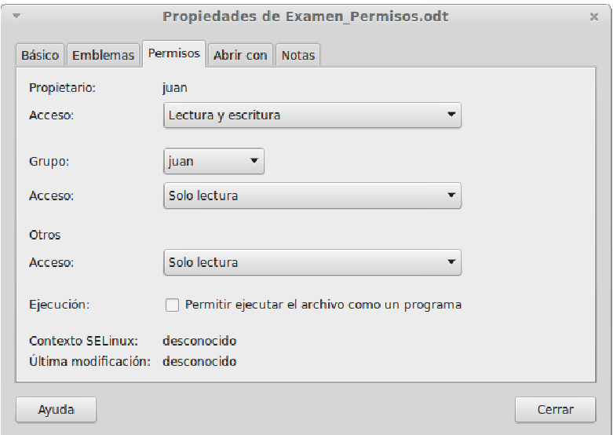

También para carpetas: 

- Ninguno: ---
- Sólo listar ficheros: r--
- Acceder a los ficheros: r-x
- Crear y suprimir ficheros: rwx

Se puede controlar la herencia mediante la opción *“Aplicar permisos a los archivos contenidos”* 

Cabe recordar que solo el propietario (o root) puede cambiar los permisos.

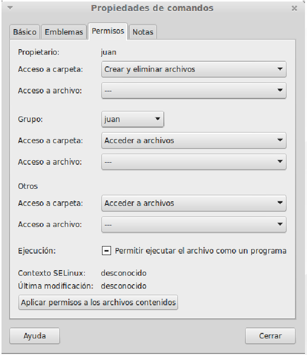

**Permisos ACL**

Normalmente con los permisos UGO tenemos suficiente para asignar los permisos necesarios a ficheros y directorios pero en ocasiones necesitamos poder asignar permisos diferentes a diferentes grupos. En ese caso podemos utilizar ACLs en GNU/Linux igual que se hace en Windows.

Al mirar los permisos desde la terminal si un fichero o directorio te establecidos permisos ACL aparece junto en los permisos el símbolo + que nos dice que hay más permisos (los ACL):

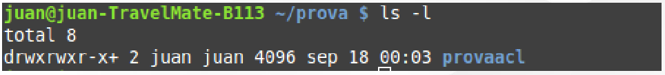

**getfacl**

El comando para ver los permisos ACL de un fichero o directorio es **getfacl**:

- \# file: nombre del fichero o directorio
- \# owner: usuario propietario
- \# group: juan - nombre del grupo propietario
- user::rwx - permisos del usuario propietario
- group::r-x - permisos del grupo propietario
- group:alumnos:r-x - permisos del grupo alumnos
- group:profesores:rwx - permisos del grupo profesores
- mask::rwx - la máscara indica los permisos máximos que se pueden dar
- other::r-x - permisos del resto de usuarios

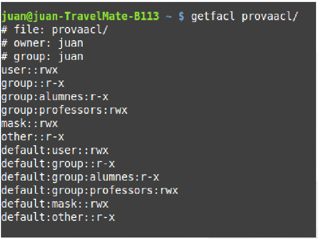

El comando para asignar permisos ACL de un fichero o directorio es **setfacl**. Tiene los siguientes parámetros:

- **-b** borra permisos
- **-m** añade permisos a los que ya tuviera
- **-s** quita los permisos que tuviera y pone los que le indican
- **-d** (junto a -m o -s) los permisos que ponemos serán para los nuevos ficheros y directorios que se crean dentro de (default) no para el fichero o directorio indicado
- **-R** aplica el comando también a todos los ficheros y directorios incluidos en ese directorio

**setfacl**

Algunos ejemplos 
- **setfacl -b provaacl**: Borra todos los permisos ACL de provaacl.
- **setfacl -R -m g:alumnos:r-x provaacl**: Le da permisos r-x al grupo alumnos sobre el directorio provaacl y todo el que contiene.
- **setfacl -R -m g:profesores:rwx provaacl**: Le da permisos rwx al grupo profesores sobre el directorio provaacl y todo el que contiene.
- **setfacl -d -m g:alumnos:r-x provaacl**: Le da permisos r-x por defecto al grupo alumnos sobre los nuevos ficheros o directorios que se crean dentro de provaacl.
- **setfacl -d -m g:profesores:rwx provaacl**: Le da permisos rwx por defecto al grupo profesores sobre los nuevos ficheros o directorios que se crean dentro de provaacl.