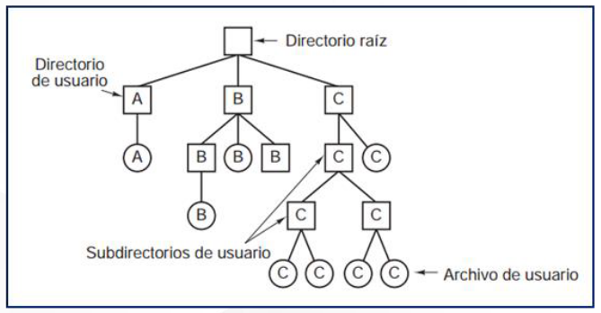

# Sistemas de Archivos

- [Sistemas de Archivos](#sistemas-de-archivos)
  - [Introducción](#introducción)
    - [Unidades de almacenamiento](#unidades-de-almacenamiento)
      - [Estructura lógica](#estructura-lógica)
    - [Almacenamiento de la información](#almacenamiento-de-la-información)
  - [Sistemas de archivo](#sistemas-de-archivo)
  - [Gestión de sistemas de archivo](#gestión-de-sistemas-de-archivo)
  - [Estructura](#estructura)
  - [Permisos](#permisos)
    - [MS Windows](#ms-windows)
    - [GNU/Linux](#gnulinux)

## Introducción

### Unidades de almacenamiento

- La información se guarda dentro de **soportes o unidades de almacenamiento** (Discos duros, USBs, CDs, etc.)
  
- Esta información tiene forma de **archivos o ficheros**
  
- La forma en que se almacena la información la determina el **sistema de ficheros**.
  
- El sistema de ficheros establece para cada fichero:
  - ESTRUCTURA 
  - NOMBRE 
  - FORMA DE ACCESO
  - PROTECCIÓN
  
- Las unidades de almacenamiento
  - Guardan la información con la que trabaja el ordenador
  - Son dispositivos **no volátiles** (no se borra su contenido cuando deja de recibir electricidad)

**Estructura física de un disco duro**

**Platos (A)**: cada uno de los discos unidos por su eje que forman normalmente un disco duro

**Caras**: cada una de las caras de cada plato (la superior y la inferior

**Cabezas (C)**: el elemento que lee o escribe en el disco. Hay un cabezal de lectura/escritura para cada cara

**Brazo (B)**: dispositivo al que van unidas cada una de las cabezas de lectura/escritura

**Pistas (E)**: son círculos concéntricos en los cuales se divide cada cara.

**Cilindro (D)**: se llama así a la misma pista de todas las caras (formado por todas las pistas accesibles en una posición de los cabezales)

**Sector (F)**: cada una de las divisiones de una pista. Es la unidad mínima que se puede leer o escribir de un disco

**Clúster**: agrupación fija de sectores (se determina al dar formato al disco. Es la unidad mínima que el sistema operativo lee o escribe en cada operación.

**Estructura física de un disco duro SSD**

Se eliminan las partes móviles de un disco duro mecánico, aumentando considerablemente la velocidad.

Se utilizan **memorias Flash con puertas lógicas NAND**, que son no volátiles 

Estas puertas NAND están fabricadas mediante **transistores** de puerta flotante que es el elemento en donde se almacenan los bits. Para el caso de las memorias RAM estos transistores necesitan de una alimentación continua para mantener su estado y en las memorias flash no. Cuando un transistor de puerta flotante está cargado tiene en su interior un 0, y cuando está descargado tiene
un 1.

Los chips de memoria Flash con puertas NAND se organizan en forma de **matriz**.

#### Estructura lógica

Se **abstrae la estructura física** del disco para crear una estructura lógica, en la que la memoria se ve como una serie de sectores contiguos.

Por ejemplo, en un disco particionado con tabla de particiones Ms-DOS, el sector de arranque (**MBR o Master Boot Record**) se localiza siempre en el primer sector del disco (cabeza 0, cilindro 0, sector 1). 

En él se almacena la tabla de particiones y un pequeño programa (master boot code) encargado de leer la tabla de particiones y ejecutar el programa del sector de arranque de la partición activa.

Cada partición se comporta como si fuera un disco independiente. La estructura interna de cada partición dependerá del sistema de archivos que utilice. Se llama sector de arranque de la partición al primer sector de la misma y, si la partición tiene instalado un sistema operativo, en él se encontrará el programa que inicia el arranque del sistema.

La tabla de **particiones GUID (GPT)** es un estándar para la colocación de la tabla de particiones en un disco duro físico. Es parte del estándar Extensible Firmware Interface (EFI) propuesto por Intel para reemplazar el viejo BIOS del PC. La GPT sustituye al Master Boot Record (MBR) usado con el BIOS.

Mientras que el MBR comienza con el código de arranque maestro (Master Boot Code), que contienen un binario ejecutable que identifica la partición activa e inicia el proceso de arranque, la GPT se basa en las capacidades extendidas del EFI para estos procesos. A pesar de que una entrada de MBR comienza el disco, con propósitos de protectividad y compatibilidad con el viejo esquema BIOS PC, la GPT propiamente dicha comienza con la cabecera de la tabla de particiones.

GPT usa un moderno modo de direccionamiento lógico (LBA, logical block addressing) en lugar del modelo cilindro-cabeza-sector (CHS) usado con el MBR. La información de MBR heredado está almacenada en el LBA 0, la cabecera GPT está en el LBA 1, y la tabla de particiones en sí en los bloques sucesivos. En los sistemas operativos Windows de 64-bits, 16.384 bytes, o lo que es lo mismo, 32 sectores, están reservados para la GPT, dejando el bloque LBA 34 como el primer sector usable del disco.

GPT proporciona asimismo redundancia. La cabecera GPT y la tabla de particiones están escritas tanto al principio como al final del disco.

### Almacenamiento de la información

La información se guarda en los dispositivos de almacenamiento mediante archivos, que son grupos de informaciones relacionadas.

Cada sistema operativo utiliza su sistema de archivos para gestionar como se guardan y sus metadatos:

- Nombre
- Tamaño
- Tipo de archivo
- Fecha
- Ubicación física
- Etc.

Un archivo se identifica de forma unívoca mediante su nombre y la ruta de acceso. 

El aspecto y formato del nombre depende del sistema operativo y del sistema de archivos que utilizamos.

Algunos sistemas permiten nombres con espacios, caracteres especiales, distinguen entre mayúsculas y minúsculas, etc.

Una parte importante del nombre de un archivo es su extensión, que se ubica al final del mismo detrás de un punto (normalmente son 3 caracteres, aunque puede variar)

En **MS Windows** la extensión permite conocer el tipo de información que contiene.

En **GNU/Linux** esta información se guarda en meta-datos, aunque se suele utilizar la extensión para aportar información al usuario.

***Directorios***

Tipo de archivo especial que permite organizar los ficheros.

Puede contener ficheros y/o otros directorios. 

De este modo los archivos y directorios constituyen una **estructura jerárquica** en forma de **árbol**: cada medio tiene un directorio principal llamado **directorio raíz** dentro del cual se encuentran archivos y otros subdirectorios que contienen más archivos y subdirectorios.

Se denomina **directorio padre** de un directorio al directorio que contiene a ese directorio.

***Directorio raíz***

Es el primer directorio o carpeta en una jerarquía. Contiene todos los subdirectorios de la jerarquía.

En sistemas tipo **Unix**, se identifica con el carácter **/**. Todos los accesos al sistema de ficheros, incluyendo los otros discos y particiones, se encuentran en la jerarquía dentro del directorio raíz.

En los sistemas Windows cada partición tiene un directorio raíz individual
(nombrado ***letra***:***\\***, por ejemplo para una determinada partición C su directorio raíz se llama ***C***:***\***) y no hay un directorio raíz común que las contenga a todas ellas.

## Sistemas de archivo

## Gestión de sistemas de archivo

## Estructura 

## Permisos 

### MS Windows

### GNU/Linux
