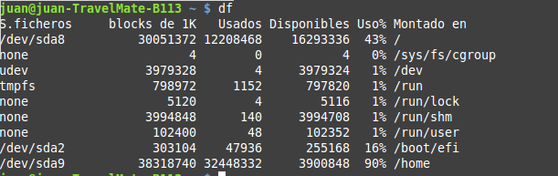
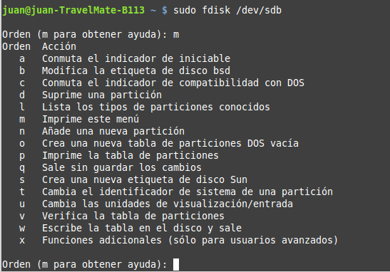
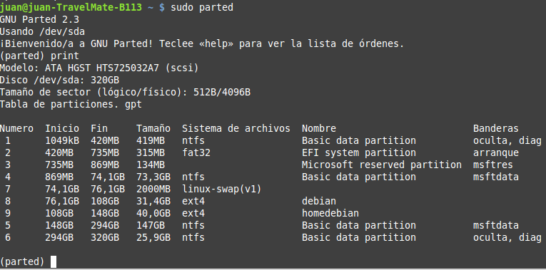

UD 5 - Comandos 
===============

- [UD 5 - Comandos](#ud-5---comandos)
  - [Objetivos de la unidad](#objetivos-de-la-unidad)
  - [Conceptos clave](#conceptos-clave)
  - [Conocimiento previo](#conocimiento-previo)
- [La interfaz de texto](#la-interfaz-de-texto)
    - [Conceptos básicos](#conceptos-básicos)
    - [Scripts](#scripts)
    - [Sintaxis](#sintaxis)
    - [Comodines](#comodines)
- [Rutas absolutas y relativas](#rutas-absolutas-y-relativas)
- [Comandos en Windows](#comandos-en-windows)
    - [Obtener ayuda](#obtener-ayuda)
    - [Sintaxis de los comandos](#sintaxis-de-los-comandos)
- [para trabajar con Directorios](#para-trabajar-con-directorios)
    - [dir](#dir)
    - [cd (o chdir)](#cd-o-chdir)
    - [md (o mkdir)](#md-o-mkdir)
    - [rd (o rmdir)](#rd-o-rmdir)
    - [tree](#tree)
- [para trabajar con Ficheros {_90_paratrabajarconFicheros .nodeTitle}](#para-trabajar-con-ficheros-_90_paratrabajarconficheros-nodetitle)
    - [copy](#copy)
    - [xcopy](#xcopy)
    - [move](#move)
    - [ren (o rename)](#ren-o-rename)
    - [del (o erase)](#del-o-erase)
    - [attrib](#attrib)
    - [print](#print)
- [para trabajar con el contenido de un fichero](#para-trabajar-con-el-contenido-de-un-fichero)
    - [type](#type)
    - [more](#more)
    - [find](#find)
    - [sort](#sort)
    - [fc](#fc)
- [para gestionar la red](#para-gestionar-la-red)
    - [ipconfig](#ipconfig)
    - [ping](#ping)
    - [tracert](#tracert)
    - [netstat](#netstat)
    - [nslookup](#nslookup)
- [para gestionar discos](#para-gestionar-discos)
    - [chkdsk / scandisk](#chkdsk--scandisk)
    - [defrag](#defrag)
    - [format](#format)
    - [convert](#convert)
    - [diskpart](#diskpart)
- [otros comandos](#otros-comandos)
    - [X:](#x)
    - [date](#date)
    - [time](#time)
    - [echo](#echo)
    - [shutdown](#shutdown)
    - [cls](#cls)
    - [exit](#exit)
    - [logoff](#logoff)
- [Redireccionamiento de comandos](#redireccionamiento-de-comandos)
    - [Dispositivos](#dispositivos)
    - [Operadores de redireccionamiento](#operadores-de-redireccionamiento)
- [Ficheros de proceso por lotes](#ficheros-de-proceso-por-lotes)
- [Comandos en GNU/Linux](#comandos-en-gnulinux)
    - [Las terminales en Gnu/Linux](#las-terminales-en-gnulinux)
    - [Ayuda y utilidades](#ayuda-y-utilidades)
    - [Sintaxis](#sintaxis-1)
- [para trabajar con directorios](#para-trabajar-con-directorios-1)
    - [ls](#ls)
    - [cd](#cd)
    - [mkdir](#mkdir)
    - [rmdir](#rmdir)
    - [pwd](#pwd)
- [para trabajar con ficheros](#para-trabajar-con-ficheros)
    - [cp](#cp)
    - [mv](#mv)
    - [rm](#rm)
    - [touch](#touch)
    - [find](#find-1)
    - [file](#file)
    - [stat](#stat)
    - [gzip](#gzip)
    - [gunzip](#gunzip)
    - [tar](#tar)
- [para trabajar con el contenido de un fichero](#para-trabajar-con-el-contenido-de-un-fichero-1)
    - [cat](#cat)
    - [more](#more-1)
    - [less](#less)
    - [tail](#tail)
    - [head](#head)
    - [sort](#sort-1)
    - [grep](#grep)
    - [cut](#cut)
    - [diff](#diff)
    - [wc](#wc)
- [para gestionar permisos](#para-gestionar-permisos)
    - [chmod](#chmod)
    - [chown](#chown)
    - [chgrp](#chgrp)
- [para gestionar usuarios](#para-gestionar-usuarios)
    - [whoami](#whoami)
    - [groups](#groups)
    - [id](#id)
    - [who](#who)
    - [passwd](#passwd)
    - [useradd](#useradd)
    - [adduser](#adduser)
    - [userdel o deluser](#userdel-o-deluser)
    - [usermod](#usermod)
    - [groupadd o addgroup](#groupadd-o-addgroup)
    - [groupdel](#groupdel)
- [para gestionar la red](#para-gestionar-la-red-1)
    - [ping](#ping-1)
    - [ifconfig](#ifconfig)
    - [dhclient](#dhclient)
    - [ifup ethX](#ifup-ethx)
    - [ifdown ethX](#ifdown-ethx)
    - [nslookup](#nslookup-1)
- [para gestionar discos](#para-gestionar-discos-1)
    - [fsck](#fsck)
    - [mkfs](#mkfs)
    - [mount](#mount)
    - [df](#df)
    - [dd](#dd)
    - [fdisk](#fdisk)
    - [parted](#parted)
- [otros comandos](#otros-comandos-1)
    - [ps](#ps)
    - [date](#date-1)
    - [clear](#clear)
    - [shutdown, poweroff, halt, reboot, logout, exit](#shutdown-poweroff-halt-reboot-logout-exit)
    - [su](#su)
    - [sudo](#sudo)
    - [uname](#uname)
    - [hostname](#hostname)
    - [ln](#ln)
    - [Dispositivos](#dispositivos-1)
    - [Operadores de redireccionament](#operadores-de-redireccionament)
- [Scripts](#scripts-1)
- [Bibliografía](#bibliografía)

Objetivos de la unidad
----------------------

Los objetivos a alcanzar en esta unidad de trabajo son los siguientes:

- Utilizar la interfaz de texto en el sistema operativo
- Saber utilizar la línea de comandos para realizar tareas
- Utilizar la interfaz de texto para realizar configuraciones en el equipo

El objetivo de esta unidad no es que el alumno conozca en profundidad el uso de los diferentes comandos en Windows y GNU/Linux sino que adquiera unos conocimientos básicos del uso de la terminal y tenga una guía de referencia donde poder consultar cómo usar los comandos que vaya
necesitando a lo largo del curso.

Conceptos clave 
---------------

Los conceptos más importantes de esta unidad son:

- Funcionamiento de la terminal el Windows y GNU/Linux
- Principales comandos
- Redireccionamiento de comandos

Conocimiento previo
-------------------

Antes de comenzar esta unidad de trabajo el alumno debería saber:

- cuáles son los sistemas operativos más utilizados en la arquitectura PC
- cómo utilizar software de virtualización para crear máquinas virtuales

La interfaz de texto 
====================

Una de las funciones del sistema operativo es hacer de intermediario entre el usuario y el equipo: el sistema operativo le proporciona una interfaz para comunicarse con el ordenador. Las interfaces pueden ser de dos tipos:

- **de texto**: el usuario se comunica mediante el teclado escribiendo comandos que el sistema operativo entiende y ejecuta. Esta parte del sistema operativo se llama shell o intérprete de comandos. El shell lee el comando tecleado, lo ejecuta y muestra el resultado por pantalla y le pide al usuario un nuevo comando (mostrándole el carácter de petición de comandos o prompt).
- **gráfica**: consta de ventanas, iconos y botones con los cuales el usuario interactúa. Son mucho más sencillas de usar para el usuario por lo cual actualmente la mayoría de sistemas operativos proporcionan este tipo de interfaces.

La interfaz que tenían los primeros sistemas operativos para comunicarse con el usuario era de texto, en la cual el usuario tenía que escribir una orden y esperar los resultados. Desde hace ya muchos años los sistemas operativos disponen también de una interfaz gráfica que facilita enormemente su uso puesto que ahora no es necesario conocer multitud de órdenes. Entonces, ¿por qué usar la línea de órdenes?. Las razones son varías:

- no todo se puede hacer desde el entorno gráfico
- muchas veces para hacer una acción tenemos que pasar por muchos menús y ventanas el que trae tiempo
- es difícil automatizar tareas que hacemos a a menudo (a veces miedo hacerse con macros y otros es imposible)

### Conceptos básicos

La línea de órdenes es una interfaz de usuario de tipo texto para
interactuar con el sistema operativo. El usuario escribe una orden en el símbolo del sistema o **prompt** que se ejecuta al pulsar la tecla *Intro*. Un programa, denominado intérprete de comandos o **shell**, comprueba si la sintaxis es correcta y ejecuta el comando. Cuando finaliza vuelve a mostrar el prompt y podemos escribir otra orden.

El prompt es un símbolo que muestra el sistema operativo y que indica que está preparado para recibir órdenes. Además muestra información al usuario como el directorio actual o el nombre del usuario y el ordenador en el caso de Linux.

En Windows el prompt es el símbolo “\>” y muestra el directorio actual: C:\\Users\\juan, es decir, el directorio personal del usuario “juan”.

En Linux el prompt de cualquier usuario (excepto root) es \$ y la
información que muestra es el usuario (juan), el nombre del ordenador (acerubuntu) y el directorio actual (\~, que es el directorio personal del usuario, es decir, /hombre/juan). El símbolo @ separa el usuario y el ordenador y el símbolo : separa el ordenador del directorio actual.

El Linux el prompt del usuario root es \#. La información mostrada es el usuario (root), el ordenador (acerubuntu) y el directorio actual (/hombre/juan, es el mismo que antes pero en este caso ese directorio no es el directorio personal de root por lo cual no pone \~).

El directorio actual es el directorio en el cual nos encontramos en este instante y en el cual se ejecutará la orden. Si, por ejemplo, la orden es de crear el directorio “prueba” (mkdir prueba) ese directorio se creará en el directorio actual. En los ejemplos anteriores se creará
dentro de /hombre/juan (en los ejemplos de Linux) y dentro de C:\\Users\\juan (en el ejemplo de Windows).

### Scripts

Además de escribir un por uno los comandos a ejecutar también se pueden escribir todos en un fichero de texto llamado **script**. Un script contiene en cada línea un comando.

Ejecutar un script es equivalente a escribir y ejecutar un detrás otro todos los comandos que contiene.

Los scripts se utilizan habitualmente para automatizar tareas que
tenemos que realizar periódicamente en el ordenador. El script incluirá los comandos necesarios para hacer esa tarea y el único que tenemos que hacer se ejecutarlo (escribir su nombre) desde la línea de comandos o incluso programar su ejecución.

### Sintaxis

Un comando es simplemente una palabra en inglés que expresa una operación a realizar y que se tiene que teclear a continuación del prompt.

Cuando ejecutamos un comando podemos pasarle uno o más parámetros (unos obligatorios y otros opcionales, según el comando). Los parámetros son información que recibirá el comando para su ejecución y van después del nombre del comando separados por espacios en blanco.

En el ejemplo anterior el comando mkdir recibe como parámetro en nombre del directorio a crear, en este caso prueba.

### Comodines

Si los parámetros son nombres de ficheros podemos utilizar caracteres
comodines. Los comodines son:\
\

-   \* (asterisco): sustituye a cero o más caracteres
-   ? (interrogación): sustituye a un carácter

Vamos a ver algunos ejemplos en los que utilizaremos el comando copy. Se
trata de un comando de Windows que permite copiar ficheros y al que se
le pasan 2 parámetros: el primero el nombre del fichero a copiar y el
segundo la ruta donde lo copiaremos.

copy inf\*.txt C:\\Users\\juan\\prueba

Comando de Windows que copia todos los ficheros el nombre de los cuales
empieza por “inf” seguido de cualquier carácter y la extensión de los
cuales es “txt” desde el directorio actual al directorio
C:\\Users\\juan\\prueba (copiará inf.txt, informe.txt,
informacio\_junio.txt, etc pero no informe.doc, mí\_informe.txt, ...)

copy \_junio.doc C:\\Users\\juan\\prueba

Comando de Windows que copia todos los ficheros el nombre de los cuales
acaba por “\_junio” y la extensión de los cuales es “doc” desde el
directorio actual al directorio C:\\Users\\juan\\prueba (copiará
informe\_junio.doc, ventas\_junio.doc, etc pero no
informo\_junio\_clientes.doc, informo\_junio.txt, ...)

copy \*.\* C:\\Users\\juan\\prueba

Comando de Windows que copia todos los ficheros (con cualquier nombre y
extensión) desde el directorio actual al directorio
C:\\Users\\juan\\prueba

copy mi?o.jpg C:\\Users\\juan

Comando de Windows que copia todos los ficheros el nombre de los cuales
es “mi”, una letra cualquiera y “o” y la extensión de los cuales es
“jpg” desde el directorio actual al directorio C:\\Users\\juan (copiará
mando.jpg, mazo.jpg, etc pero no marzo.jpg -2 letras- ni mao.jpg -0
letras-).

Rutas absolutas y relativas 
===========================

Cómo hemos visto una orden se ejecuta en el directorio actual, pero
puede actuar sobre ficheros o directorios que estén en cualquier parte
de nuestro sistema de ficheros.

Cuando el parámetro de un comando es un nombre de fichero o directorio
tenemos que especificar su ruta, es decir, donde se encuentra. Si no lo
hacemos el sistema considerará que ese fichero o directorio se encontrar
en el directorio actual. Si no es así tenemos que indicar la ruta hasta
el fichero o directorio.

La ruta se puede indicar tomando como base el directorio raíz del
sistema de ficheros (o de la unidad en Windows) y en este caso se
denomina **ruta absoluta**, o tomando como base el directorio actual, en
este caso se llama **ruta relativa**. Una ruta absoluta siempre empezará
en Gnu/Linux con el directorio raíz (**/**) y en Windows con el
directorio raíz, precedido o no por la letra de la unidad (\\ o C:\\).

Recordamos que, además de con su nombre, podemos hacer referencia al
directorio actual con el símbolo . (punto) y al directorio padre con ..
(punto punto).

Vamos a ver unos ejemplos partiendo de la estructura de directorios de
la imagen siguiente. Esa estructura está creada en la carpeta personal
del usuario juan (en C:\\Usuarios\\juan). Para los ejemplos nuestro
directorio actual será “nacional”
(C:\\Usuarios\\juan\\pedidos\\nacional).

Ejemplos:

-   Copiar todos los ficheros de “nacional” en “bilbao”

Ruta absoluta: copy C:\\Usuarios\\juan\\pedidos\\nacional\\\*.\*
C:\\Usuarios\\juan\\pedidos\\bilbao

Ruta relativa: copy \*.\* bilbao (o también copy \*.\* .\\bilbao)

-   Copiar todos el ficheros con extensión “jpg” de “pedidos” a “ferias”

Ruta absoluta: copy C:\\Usuarios\\juan\\pedidos\\\*.jpg
C:\\Usuarios\\juan\\imagenes\\ferias

Ruta relativa: copy ..\\\*.jpg ..\\..\\imagenes\\ferias

También podemos poner un parámetro con ruta absoluta y otro con
relativa. Ejemplo:

-   Copiar los ficheros con extensión “gif” de “descatalogados” a
    “imagenes”: copy descatalogados\\\*.gif C:\\Usuarios\\juan\\imagenes

Comandos en Windows 
===================

La línea de comandos de Windows es una implementación de la consola de
Ms-DOS para la interfaz gráfica del sistema operativo Windows.

Para abrir una terminal de la línea de comandos en Windows se hace desde
el **menú Inicio -\> Todos los programas -\> Accesorios -\> Símbolo del
sistema**, o también ejecutando el programa **cmd.exe**.

Windows 7 y posteriores incluyen también el entorno a ejecución de
comandos **PowerShell** que pretende ser una herramienta tan potente
como la terminal en Linux. PowerShell combina características de una
consola de comandos y del framework .NET de Microsoft, que está
orientado a objeto, y permite hacer la mayoría de tareas de
configuración del sistema operativo.

Windows no diferencia entre mayúsculas y minúsculas por lo cual podemos
utilizar los comandos y sus argumentos en mayúsculas o en minúsculas.

### Obtener ayuda

Podemos obtener la lista de comandos y una breve explicación del que
hacen con el comando help:

help

Si le pasamos como parámetro el nombre de un comando muestra la ayuda de
ese comando:

help copy

El mismo podemos obtener tecleando el nombre del comando seguido del
modificador /?, por ejemplo miedo obtener ayuda sobre copy teclearemos:

copy /?

### Sintaxis de los comandos

Normalmente para ejecutar un comando ponemos uno o más parámetros para
que el comando haga exactamente el que queremos. Esto hace que en
ocasiones sea compleja la forma de utilizar un comando y muchas veces
tenemos que ir a la ayuda para hacer el que queremos.

La información que nos proporciona la ayuda es la siguiente:

-   Descripción del comando: explica qué hace ese comando (en el caso de
    COPY copia archivos en otra ubicación)
-   Sintaxis: cómo tenemos que utilizarlo. Normalmente los comandos
    pueden tener parámetros que modifican su comportamiento. Además
    algunos tienen parámetros que es obligatorio poner para que el
    comando sepa qué tiene que hacer. Aquí podemos encontrar:
    -   parámetros sin corchetes: significa que son obligatorios, es
        decir que tenemos que escribir algo allí. Por ejemplo 'origen'
        es obligatorio porque tenemos que indicar qué archivo es el que
        queremos copiar. Si no lo hacemos tendremos un error al intentar
        ejecutar el comando
    -   parámetros entre corchetes: significa que son opcionales, es
        decir que podemos ponerlos o no. Por ejemplo podemos poner /V
        (los corchetes no se escriben) y en ese caso después de copiar
        el archivo verificará que se ha escrito correctamente. Si no lo
        ponemos no lo verificará
    -   parámetros separados por una barra, dentro de corchetes o
        claves: significa que tenemos que elegir un de ellos, por
        ejemplo /A o /B que indican si el fichero es de texto (ASCII) o
        ejecutable (binario) pero no puede ser las dos cosas a la vez.
        Si está entre corchetes (cómo en este caso) el parámetro es
        opcional y no hace falta que pongamos ninguna de las opciones y
        si está entre llaves (por ejemplo {/A | /B}) seria obligatorio
        poner una de las opciones
-   Explicación de cada parámetro: nos dice qué se el que hace cada uno
    de los parámetros que podemos poner. Por ejemplo nos dice que origen
    es el nombre del fichero a copiar y que /V hace una verificación de
    que el archivo se ha copiado correctamente a su destino
-   Explicaciones adicionales: más explicaciones o ejemplos referentes
    al comando en cuestión. Por ejemplo en COPY nos dice que podemos
    juntar más de un archivo en uno solo (pondríamos COPY
    archivo1.txt+archivo2.txt+archivo3.txt archivo\_destino.txt o COPY
    archivo?.txt archivo\_destino.txt).

Cómo podemos ver, los parámetros que modifican el comportamiento de un
comando en Windows son una letra precedida del carácter /. Podemos poner
tantos parámetros como necesitemos para un comando.

para trabajar con Directorios 
=============================

### dir

Lista el contenido del directorio pasado como parámetro. Si no le
pasamos ningún parámetro muestra el contenido del directorio actual.
Principales parámetros:

-   **ruta**: de qué directorio queremos ver su contenido. Si no ponemos
    nada muestra el contenido del directorio actual
-   **/s**: muestra también el contenido de todos los subdirectorios
-   **/p**: si la lista es muy larga muestra pantalla por pantalla
-   **/q**: muestra el propietario de cada fichero
-   **/w**: muestra sólo los nombres de ficheros y directorios y en
    varias columnas
-   **/a:atributo**: muestra sólo los ficheros con el atributo indicado
    (recordáis que los atributos son A, H, R y S)
-   **/o:criterio**: muestra la lista ordenada según el criterio
    indicado. Los posibles criterios son:
    -   **n**: por nombre (decir /o:n, en orden alfabético; decir /o:-n,
        en orden alfabético inverso)
    -   **e**: por extensión
    -   **s**: por medida
    -   **d**: por fecha

Ejemplos:

dir - Muestra el contenido del directorio actual

dir /p C:\\Usuarios - Muestra el contenido del directorio C:\\Usuarios
pantalla a pantalla\
\
 dir .. - Muestra el contenido del directorio paro del actual

dir /o:-s \*.txt - Muestra todos los ficheros del directorio actual con
extensión .txt ordenados por su medida de mayor a menor

### cd (o chdir)

Cambia el directorio actual por el que le pasamos como parámetro. Sin
parámetros muestra la ruta del directorio actual. Ejemplos:

cd C:\\Usuarios - Cambia al directorio C:\\Usuarios que pasa a ser el
directorio actual

cd .. - Cambia al directorio paro del actual

cd - Muestra la ruta absoluta del directorio actual

### md (o mkdir)

Crea un nuevo directorio que le pasamos como parámetro. Ejemplos:

mkdir clientes - Crea un directorio llamado clientes dentro del
directorio actual

mkdir ..\\clientes - Crea un directorio llamado clientes en el
directorio paro del actual

mkdir C:\\Usuarios\\Juan\\Documentos\\clientes - Crea el directorio
clientes en C:\\Usuarios\\Juan\\Documentos

mkdir clientes proveidors facturas - Crea dentro del directorio actual
los directorios clientes, proveidors y facturas

### rd (o rmdir)

Elimina el directorio que le pasamos como parámetro, que tiene que estar
vacío. Principales modificadores:

-   **/s** elimina el directorio aunque no esté vacío (eliminará todo su
    contenido)

Ejemplos:

rd clientes - Elimina el directorio clientes que hay dentro del
directorio actual

rd C:\\Usuarios\\Juan\\Documentos\\clientes - Elimina el directorio
clientes de la ubicación indicada

rd /s clientes - Elimina el directorio clientes que hay dentro del
directorio actual y todo su contenido

### tree

Muestra la estructura de directorios de la ruta indicada. Modificadores:

-   **/F** Muestra también los ficheros de cada directorio

Ejemplos:

tree - Muestra la estructura de directorios desde el directorio actual

tree C:\\ - Muestra toda la estructura de directorios de la unidad C:

para trabajar con Ficheros {_90_paratrabajarconFicheros .nodeTitle}
==========================

### copy

Copia el fichero o ficheros especificados como primer parámetro en el
directorio especificado como segundo parámetro. El comando copy NO copia
directorios. Ejemplos:

copy leeme.txt .. - Copia el fichero leeme.txt del directorio actual a
su directorio paro

copy C:\\Windows\\\*.txt F:\\ - Copia todos los ficheros con extensión
txt del directorio C:\\Windows al directorio raíz de la unidad F:

### xcopy

Es igual que el comando copy pero permite copiar árboles de directorios
y ficheros enteros. Principales modificadores:

-   **/S** Copia también los subdirectorios, excepto los vacíos
-   **/E** Copia también los subdirectorios, incluyendo los vacíos
-   **/H** Copia también los ficheros ocultos y del sistema
-   **/D:m-d-y** Copia sólo los modificados a partir de la fecha
    indicada

Ejemplos:

xcopy \*.\* F:\\ - Copia todos los ficheros del directorio actual al
directorio raíz de la unidad F:

xcopy /E \*.\* F:\\ - Copia todos los ficheros y subdirectorios del
directorio actual al directorio raíz de la unidad F:

### move

Funciona como el comando xcopy pero en cuenta de hacer una copia mueve
los ficheros de ubicación. Después hacer un copy tendremos el fichero 2
veces: donde estaba y donde lo hemos copiado. Si hacemos un move se
borra de donde estaba y se sitúa donde lo copiamos.

### ren (o rename)

Permite cambiar el nombre del fichero o directorio pasado como primer
parámetro por el que le pasamos cono a segundo parámetro. Ejemplo:

ren leeme.txt readme.txt - Cambia el nombre del fichero leeme.txt del
directorio actual por readme.txt

### del (o erase)

Elimina el fichero o ficheros pasados como parámetro. Ejemplos:

del lligme.txt - Borra el fichero lligme.txt del directorio actual

del C:\\Usuarios\\juan\\\*.odt - Borra todos los ficheros con extensión
odt del directorio indicado

### attrib

Permite ver y cambiar los atributos de los ficheros. Los atributos que
pueden tener los ficheros son:

-   **A**: modificado
-   **H**: Hidden, oculto
-   **R**: Read, sólo lectura
-   **S**: System, fichero del sistema operativo

Ejemplos:

attrib - Muestra los atributos de todos los ficheros del directorio actual

attrib +H lligme.txt - Pone el atributo H al fichero lligme.txt del directorio actual (ahora ese fichero está oculto y no aparece al hacer un DIR)

attrib -R C:\\boot.ini - Quita el atributo R al fichero boot.ini del directorio raíz de C: por lo cual ahora se puede modificar ese fichero

### print

Imprime por la impresora predeterminada el fichero o ficheros pasados
como parámetro.

para trabajar con el contenido de un fichero 
============================================

### type

Muestra por pantalla el contenido del fichero o ficheros pasados como
parámetro.

### more

Igual que el anterior pero si el contenido del fichero ocupa más de una
pantalla lo muestra pantalla a pantalla, esperando a que el usuario
pulse una tecla para mostrar la siguiente pantalla.

### find

Busca el texto pasado como primer parámetro en el fichero pasado como
segundo parámetro y muestra por pantalla las líneas que lo contengan.
Ejemplo:

find “juan” alumnos.txt - Muestra las líneas del fichero alumnos.txt que
contengan el texto juan

### sort

Ordena el contenido de un fichero de texto. La ordenación la hace por
líneas. Modificadores:

-   **/+n** (n = número) A partir de qué carácter de cada línea se
    ordena. SI no indicamos nada ordena por el primer carácter de cada
    línea
-   **/R** Hace la ordenación al reas, de mayor a menor

Ejemplos:

sort alumnos.txt - Muestra el contenido del fichero alumnos.txt ordenado

sort /+10 alumnos.txt - Muestra el contenido del fichero alumnos.txt
ordenado a partir de la posición 10 de cada línea (ignora las anteriores
para hacer la ordenación)

sort /R alumnos.txt - Muestra el contenido del fichero alumnos.txt
ordenado de mayor a menor

A los comandos more, find y suerte se los denomina filtros porque
reciben una entrada, la filtran o modifican y vuelven una salida que es
esa entrada modificada.

### fc

Compara el contenido de los ficheros pasado como parámetro y muestra por
pantalla las líneas que tengan alguna diferencia. Ejemplo:

fc fichero1.txt fichero2.txt - Muestra por pantalla las líneas que sean
diferentes entre los ficheros fichero1.txt y fichero2.txt del directorio
actual

para gestionar la red 
=====================

### ipconfig

Muestra información de la configuración de red del equipo (dirección ip,
puerta de enlace, etc). Modificadores:

-   **/all** Muestra toda la información
-   **/renew** Vuelve a pedir IP al servidor DHCP

### ping

Envía un ping al ordenador especificado como parámetro. Podemos indicar
el ordenador por su nombre o por su IP. Nos permite comprobar la
conectividad de la red y su velocidad.

### tracert

Igual que ping pero no sólo muestra el tiempo que ha tardado la
respuesta sino todos los equipos por los cuales ha pasado el ping antes
de llegar a su destino.

### netstat

Muestra estadísticas de las conexiones actualmente establecidas.

### nslookup

Resuelve el nombre de dominio indicado, mostrando qué es la suya IP

para gestionar discos 
=====================

### chkdsk / scandisk

Permite comprobar un sistema de archivos FAT o NTFS.

Ejemplo: chkdsk E:

### defrag

Desfragmenta el sistema de archivos que le indicamos.

Ejemplo: defrag E:

### format

Formatea una partición con sistema de archivos FAT o NTFS.

Ejemplo: format E:

### convert

Convierte una partición FAT a NTFS sin perder los datos

### diskpart

Se trata de un programa en modo texto que permite gestionar las
particiones de nuestros discos.

\

otros comandos 
==============

### X:

Cambia la unidad actual por la letra indicada, por ejemplo, para ir al
disquete tecleamos A: y para volver al disco C tecleamos C:

### date

Muestra la fecha actual del ordenador y nos permite cambiarla. Si no
queremos que pide nueva fecha ponemos el parámetro /T. Ejemplos:

-   date - Muestra la fecha actual y nos permite indicar una nueva fecha
-   date 24/3/2012 - Cambia la fecha del ordenador a 24 de marzo de 2012
-   date /T - Muestra la fecha actual

### time

Igual que dato pero para ver y cambiar la hora del sistema

### echo

Muestra en la terminal el mensaje pasado como parámetro

### shutdown

Permite apagar el ordenador. Modificadores:

-   **/s** Apaga el equipo
-   **/r** Reinicia el equipo
-   **/h** Hiberna el equipo
-   **/l** Cierra la sesión
-   **/t** Permite especificar un tiempo (en según) de espera antes
    apagar
-   **/a** Anula el apagado del equipo, si estamos todavía en el tiempo
    de espera
-   **/c** Comentario de la causa de la apagado
-   **/m** Permite apagar otro equipo de la red

Ejemplos:

shutdown /s - Apaga el equipo

shutdown /s /t 300 - Apaga el equipo dentro de 5 minutos (300 según)

shutdown /s /t 300 /c  “El ordenador se va a apagar en 5 minutos” -
Apaga el equipo dentro de 5 minutos y muestra el mensaje indicado

shutdown /s /t 300 /m \\\\pc-23 - Apaga dentro de 5 minutos el equipo de
la red denominado “pc-23”

### cls

Borra la pantalla.

### exit

Cierra la terminal

### logoff

Cierra la sesión de Windows. Vuelve a aparecer la ventana para loguear
el usuario

Redireccionamiento de comandos
==============================

### Dispositivos

La comunicación del sistema con el exterior se hace, por defecto,
mediante 3 dispositivos:

-   dispositivo estándar de **entrada**, que es el teclado. Es el
    dispositivo por el que se introduce la información
-   dispositivo estándar de **salida**, que es el monitor. Es por donde
    el sistema muestra la información al usuario
-   dispositivo estándar de **error**, que también es el monitor. Es por
    donde el sistema muestra los mensajes de error al usuario

A los dispositivos estándar de entrada y salida se los conoce como
consola (o abreviado CON). Los dispositivos más comunes son:

-   CON: consola. Es el dispositivo que se utiliza por defecto y está
    formado por el teclado y el monitor
-   NUL: es un dispositivo ficticio que hace desaparecer todo el que le
    se envía. Por ejemplo si no queremos que los errores aparezcan en el
    monitor redireccionamos la salida de error al dispositivo NUL.
-   LPTn: hace referencia a los puertos paralelos del ordenador. Puede
    haber hasta 3 (LPT1, LPT2 y LPT3). Tradicionalmente la impresora
    estaba conectada al puerto LPT1 que también se denomina PRN.
-   COMn: identifica los puertos serie y pueden haber 4 (COM1, COM2,
    COM3 y COM4).

Podemos utilizar estos dispositivos en los comandos. Por ejemplo:

copy prueba.txt PRN - Copia el fichero prueba.txt del directorio actual
en el dispositivo PRN, o sea, lo envía a la impresora conectada en el
primer puerto paralelo. Es otra forma de imprimir un fichero (seria
equivalente al comando PRINT prueba.txt)

### Operadores de redireccionamiento

Cómo hemos comentado la entrada y salida por defecto es CON (el teclado
y el monitor), por ejemplo si ejecutamos el comando DATE muestra la
fecha actual por el monitor y espera que introducimos una nueva fecha
por el teclado.

Pero es posible redireccionar la entrada y la salida para que se utilizo
otro dispositivo, un fichero o, incluso, otro comando. Los operadores
que lo hacen posible son:

-   **\<**: redirecciona la entrada al fichero o dispositivo indicado
-   **\>**: redirecciona la salida al fichero o dispositivo indicado. Si
    se un fichero lo creará (y si ya existe lo truncará, es decir,
    eliminará su contenido)
-   **\>\>**: redirecciona la salida a un fichero y, si ya existe, lo
    añade al final
-   **2\>**: redirecciona la salida de error a un fichero o dispositivo
-   **|**: redirecciona la salida del comando a su izquierda a la
    entrada del comando a su derecha. Se utiliza habitualmente con los
    filtros (more, find y suerte).

Ejemplos:

copy prueba.txt PRN - Copia el fichero prueba.txt al dispositivo PRN, o
sea, lo imprime

dir C:\\Usuarios\\juan \> ficheros\_de\_juan - La lista de ficheros del
directorio indicado la guarda en un fichero llamado ficheros\_de\_juan.
Si el fichero existe lo truncará

dir C:\\Usuarios\\juan \>\> ficheros\_de\_juan - La lista de ficheros
del directorio indicado la añade al fichero llamado ficheros\_de\_juan.
Si ya existe el fichero añadirá la lista al final

sort alumnos.txt \> alumnos\_ordenado.txt - Copia el contenido del
fichero alumnos.txt ordenado al fichero alumnos\_ordenado.txt

dir | more - Muestra el contenido del directorio actual pantalla a
pantalla

find “Alcoi” alumnos.txt | sort \>\> alumnos\_ordenado.txt - Filtra en
el fichero alumnos.txt las líneas que contengan la palabra Alcoi, envía
esas líneas al comando suerte que las ordena y el resultado (los alumnos
que son de Alcoi, ordenados) se añade al fichero alumnos\_ordenado.txt

Ficheros de proceso por lotes 
=============================

En ocasiones para hacer una tarea tenemos que ejecutar una serie de
comandos y a veces esa tarea tiene que ejecutarse día detrás día.

Para automatizar ese tipo de tareas se crearon los ficheros de proceso
por lotes, que son un fichero de texto que en cada línea tiene un
comando. Cuando ejecutamos un fichero de proceso por lotes el que pasa
es que se ejecuta un por uno los comandos que contiene.

En Windows este tipo de fichero tienen extensión .BAT y se ejecutan
tecleando su nombre en el prompt del sistema.

**Ejemplo 1** - Haz un fichero de proceso por lotes que limpio la
ventana y a continuación muestro la hora y fecha actuales y el contenido
del directorio raíz del disco C: en este momento.

El fichero se denominará info\_raíz.bat y su contenido será:

@ECHO OFF\
 CLS\
 ECHO La hora actual es\
 TIME /t\
 ECHO El día actual es\
 DATE /t\
 ECHO El contenido del directorio raíz del disco C es\
 DIR C:\\

La primera línea del ejemplo es para que no se muestro en la ventana
cada comando. Para ejecutar el fichero en la línea de comandos
escribiremos info\_raíz.bat.

Podemos pasarle parámetros a un fichero BAT igual que hacemos con los
comandos normales. Para acceder desde el fichero BAT a cada parámetro
utilizamos %1 para el primer parámetro, %2 para el segundo, etc.

**Ejemplo 2** - Haz un fichero de proceso por lotes que limpio la
ventana y a continuación muestro la hora y fecha actuales y el contenido
del directorio pasado como parámetro.

El fichero se denominará info\_dir.bat y su contenido será:

@ECHO OFF\
 CLS\
 ECHO La hora actual es\
 TIME /t\
 ECHO El día actual es\
 DATE /t\
 ECHO El contenido del directorio %1 es\
 DIR %1

Para ejecutar el fichero en la línea de comandos escribiremos el nombre
del fichero seguido del nombre de un directorio, por ejemplo
info\_dir.bat C:\\Windows. Al ejecutarse el fichero la última línea se
convertirá a DIR C:\\Windows y se mostrará el contenido de ese
directorio.

Comandos en GNU/Linux 
=====================

La línea de comandos de Linux es una herramienta muy potente que nos
permite realizar cualquier acción en el sistema. En Linux el entorno
gráfico es una opción y, de hecho, podemos instalar el sistema operativo
sin entorno gráfico con todas sus funcionalidades (se hace en servidores
para optimizar los recursos).

Aunque podemos hacer cualquier cosa necesitamos los permisos necesarios
para hacerlo. Por eso hay muchos comandos que sólo los puede ejecutar el
superusuari root. Cómo vieron anteriormente el prompt de cualquier
usuario normal acaba en el carácter **\$** y el de root en **\#**.

Otra cuestión importante es que cuando el usuario root ejecuta un
comando el sistema operativo considera que sabe qué está haciendo y no
nos pedirá confirmaciones, simplemente lo hace. Por eso tenemos que
tener mucha cura cuando somos root en un sistema Linux. La recomendación
es que siempre trabajamos como un usuario normal y sólo cuando tenemos
que ejecutar un comando que necesita permisos de superusuari nos
convertimos en root.

El comando para cambiar de usuario es su y se le pasa como parámetro el
usuario en que nos queremos loguejar. Si no le pasamos ningún parámetro
se supone que queremos ser root. Ejemplo:

su jmonllor - pasem a ser el usuario jmonllor (después de escribir su
contraseña)

su - pasem a ser el usuario root (si escribimos la contraseña de root)

También es posible ejecutar un comando que necesita permisos de root
desde nuestro usuario anteponiéndole el comando sudo. Para hacer esto
nuestro usuario tiene que pertenecer al grupo de usuarios que pueden
hacer sudo (**sudoers**).

En el caso de Ubuntu esta es la manera de trabajar por defecto y el
usuario con que instalamos el sistema pertenece al grupo de sudoers. De
hecho durante el proceso de instalación no se nos pide la contraseña de
root por lo cual no nos podemos loguear como root (podemos hacerlo con
el comando sudo su). En el caso de Debian el usuario que se crea durante
la instalación es un usuario nomal (no puede hacer sudo) pero si se nos
pide la contraseña de root para poder loguearnos como root.

### Las terminales en Gnu/Linux

Linux por defecto arranca 7 terminales para trabajar, 6 de texto y una
terminal gráfica. Podemos cambiar de unos a otros con**Ctrl+Alt+Fn**
donde n es el número de terminal al que queremos ir. La terminal gráfica
es la 7 y las de texto son del 1 al 6. Por lo tanto para trabajar con la
primera terminal de texto pulsamos **Ctrl+Alt+F1** y para volver a la
terminal gráfica **Ctrl+Alt+F7** (en algunas distribuciones la terminal
gráfica se encuentra en la número 8).

Cada terminal tiene un nombre que es **ttyN**, donde N es el número de
terminal (es decir tty1, tty2, ..., tty7).

Además dentro de la terminal gráfica podemos abrir tantas
pseudoterminals cómo queramos, cada una en su ventana. El nombre de
estas terminales es **pts/N**.

**Ejemplo** - Abre desde el entorno gráfico un par de terminales y
además logueate con el usuario root desde la primera terminal de texto.
Ahora desde cualquier terminal de las que tienes abiertas teclea la
orden **who** que muestra los usuarios logueados en este momento.
Aparecerá algo pareciendo a:

En Linux podemos elegir el **shell** o interpreto de comandos que
queremos utilizar, es decir, el programa encargado de interpretar y
ejecutar el comando que tecleamos en la terminal. El más utilizado es el
**bash** (se encuentra en /bin/bash) pero podemos utilizar otros como el
**sh**, **ksh**, etc.. En el fichero de usuarios del sistema
(**/etc/passwd**) entre otras informaciones de cada usuario se almacena
cuál es su shell.

### Ayuda y utilidades

En Linux podemos obtener ayuda de un comando de diferentes maneras. La
más completa y utilizada es utilizando el comando **man** seguido del
nombre del comando que queremos. Por ejemplo:

man cp

Esto nos muestra la página del manual en lo referente al comando
indicado. Para salir del manual pulsamos la tecla **q** (quit = salir).

También podemos obtener ayuda de algunos comandos con **help** y el
nombre del comando (ejemplo help cd) y otros con el nombre del comando
con la opción --help (ejemplo cp --help).

En Linux no hay que escribir el comando entero sino que podemos utilizar
la función de **autocompletar**: por ejemplo si queremos reiniciar el
ordenador en cuenta de escribir el comando reboot entero podemos
escribir reb y pulsar el tabulador para que aparezca el resto del
comando. Si hay varios comandos que empiezan por los caracteres que
hemos escrito aparece una lista de todos ellos al pulsar el tabulador
dos veces (por ejemplo si en vez de escribir reb escribimos sólo re al
pulsar el tabulador no pasa nada pero al volver a pulsarlo aparecen
todos los comandos que empiezan por re, incluyendo reboot).

La función de autocompletar también funciona para los nombres de
ficheros y directorios y es conveniente utilizarla por comodidad pero
también porque así evitamos equivocarnos a la hora de escribir.

También utilizaremos a a menudo la utilidad de Linux de guardar los
comandos que ya hemos escrito de forma que podemos volver a escribirlos
sólo pulsando las flechas de cursor arriba y bajo. Podemos ver la lista
de comandos almacenada con el comando **history**.

### Sintaxis

La sintaxis general de cualquier comando es:

comando [ -o | --opción ] [argumentos]

En primer lugar escribimos el nombre del comando y a continuación las
opciones que queremos (o ninguna) y después los argumentos que le
pasamos. Para escribir cada opción normalmente podemos elegir entre la
forma normal (ejemplo **--all**) o la reducida (ejemplo **-a**). Fijaos
que la forma reducida sólo es una letra y está precedida de un signo
menos (-) mientras que la forma normal es una palabra y siempre está
precedida de dos signos menos (**--**).

Respecto a los argumentos, algunos comandos no tienen, otros tienen
argumentos opcionales y otros obligatorios. Tendremos que escribir la
sintaxis correcta de cada comando para que se ejecuto (recordáis que
podemos obtener ayuda con **man**).

para trabajar con directorios
=============================

### ls

Lista el contenido del directorio pasado como parámetro. Si no le
pasamos ningún parámetro muestra el contenido del directorio actual.
Principales opciones:

-   **-l** muestra toda la información de cada fichero y directorio
-   **-h** muestra la medida de los ficheros en formato “humano” (en KB,
    MB, etc en vez de en bytes)
-   **-a** muestra también los ficheros y directorios ocultos
-   **-R** recursivo. Muestra también el contenido de cada subdirectorio

Ejemplos:

ls - Muestra el contenido del directorio actual\
 ls -l /home/juan - Muestra con detalles el contenido del directorio
/home/juan\
 ls -la .. - Muestra el contenido del directorio padre del actual con
detalles e incluyendo los ficheros y directorios ocultos (fijaos que -la
equivale a -l -a)

### cd

Cambia el directorio actual por el que le pasamos como parámetro.
Ejemplos:

cd /hombre/juan/Desktop/pruebas - Cambia al directorio indicado

cd .. - Cambia al directorio padre del actual

cd \~ - Cambia al directorio de inicio del usuario (\~ en Gnu/Linux hace
referencia a ese directorio)

### mkdir

Crea un nuevo directorio que le pasamos como parámetro. Ejemplos:

mkdir clientes - Crea un directorio llamado clientes dentro del
directorio actual

mkdir ../clientes - Crea un directorio llamado clientes en el directorio
paro del actual

mkdir /home/juan/clientes - Crea el directorio clientes en /home/juan

### rmdir

Elimina el directorio que le pasamos como parámetro, que tiene que estar
vacío. Ejemplos:

rmdir clientes - Elimina el directorio clientes que hay dentro del
directorio actual

rmdir /home/juan/clientes - Elimina el directorio clientes de la
ubicación indicada

### pwd

Muestra cuál es el directorio actual.

para trabajar con ficheros
==========================

### cp

Copia el fichero o ficheros especificados como primer parámetro en el
directorio especificado como segundo parámetro. Ejemplos:

cp leeme.txt .. - Copia el fichero leeme.txt del directorio actual a su
directorio paro\
 cp /home/juan/\* /media/KINGSTON - Copia todos los ficheros que del
directorio /hombre/juan al directorio indicado (seguramente un disco
USB)

El comando cp NO copia directorios a menos que utilizamos la opción -R
(recursiu). Ejemplo:

cp -R /home/juan/\* /media/KINGSTON - Copia todos los ficheros y
subdirectorios del directorio /hombre/juan al directorio indicado

### mv

Funciona como el comando cp pero en cuenta de hacer una copia mueve los
ficheros de ubicación. Después de hacer un cp tendremos el fichero 2
veces: donde estaba y donde lo hemos copiado. Si hacemos un mv se borra
de donde estaba y se sitúa donde lo copiamos.

También mueve directorios y su contenido.

Este comando también se utiliza para cambiar el nombre de un fichero o
directorio. Ejemplos:

mv leeme.txt .. - Mueve el fichero leeme.txt del directorio actual a su
directorio paro\
 mv /home/juan/\* /media/KINGSTON - Mueve todos los ficheros y
subdirectorios del directorio /hombre/juan al directorio indicado\
 mv leeme.txt readme.txt - Cambia el nombre del fichero leeme.txt del
directorio actual por readme.txt

### rm

Elimina el fichero o ficheros pasados como parámetro. Ejemplos:

rm leeme.txt - Borra el fichero leeme.txt del directorio actual\
 rm /home/juan/\*.odt - Borra todos los ficheros con extensión odt del
directorio indicado

Con la opción -R elimina directorios con todo su contenido:

rm -R /home/juan/pruebas - Borra el directorio indicado (pruebas) con
todos los ficheros y directorios que contenga

### touch

Crea un nuevo fichero vacío si no existe con el nombre que le pasamos
como parámetro

### find

Busca ficheros en la ruta pasada como primer parámetro que cumplan las
condiciones pasadas como segundo parámetro. Principales opciones:

-   **-name** busca los ficheros con ese nombre
-   **-perm** busca los ficheros con esos permisos
-   **-user** busca los ficheros que pertenecen a ese usuario
-   **-group** busca los ficheros que pertenecen a ese grupo
-   **-size** busca los ficheros de más (o menos) de esa medida

Ejemplos:

find . -name “\*.odt” - Busca en el directorio actual (y sus
subdirectorios) todos los ficheros con extensión odt\
 find / -perm 770 - Busca desde el directorio raíz todos los ficheros
con permisos 770\
 find / -user batoi - Busca desde el directorio raíz todos los ficheros
del usuario batoi\
 find /var -size +1000000c - Busca en /var y subdirectorios todos los
ficheros de medida superior a 1.000.000 bytes

### file

Indica el tipo del fichero pasado como parámetro

### stat

Muestra las características del fichero que le pasamos como parámetro:
nombre, permisos, medida, fecha, propietario, i-nodo, etc

### gzip

Comprime el fichero que le pasamos como parámetro. El fichero comprimido
tendrá el mismo nombre y extensión gz

### gunzip

Descomprime el fichero que le pasamos como parámetro (normalmente con
extensión gz)

### tar

Agrupa o desagrupa los ficheros pasados como parámetro. También tiene
una opción para comprimir el fichero agrupado. Puede utilizarse para
hacer copias de seguridad. Principales opciones:

-   **-c** crea un fichero agrupado
-   **-x** extrae los ficheros de un fichero agrupado (es el contrario
    de -c)
-   **-t** no extrae el contenido de un fichero agrupado sino que sólo
    muestra los ficheros que contiene
-   **-f** agrupa o desagrupa a un fichero en vez de a la salida
    estándar (lo usaremos siempre)
-   **-v** verbose, para ver todos los mensajes
-   **-z** comprime el resultado con gzip

tar permite no poner el guion (-) ante las opciones. Ejemplos:

tar -cvfz /home/juan/etc.tar.gz /etc - Crea en /hombre/juan el fichero
etc.tar.gz con todo el contenido del directorio /etc comprimido\
 tar -xfz etc.tar.gz - Extrae donde estamos todo el contenido del
fichero agrupado y comprimido etc.tar.gz

para trabajar con el contenido de un fichero 
============================================

### cat

Muestra por pantalla el contenido del fichero o ficheros pasados como
parámetro.

### more

Igual que el anterior pero si el contenido del fichero ocupa más de una
pantalla lo muestra pantalla a pantalla, esperando a que el usuario
pulse una tecla para mostrar la siguiente pantalla.

### less

Igual que more pero permite también volver atrás en el fichero.

### tail

Muestra por pantalla las últimas líneas del fichero pasado como
parámetro, por defecto 10. La opción -f va mostrando las últimas líneas
según va creciendo el fichero (se utiliza para ver como cambian ficheros
de log). Ejemplo:

tail -f /var/logs/squid/acces.log - Va mostrando por pantalla las
ultimas líneas del fichero acces.log donde se guardan las páginas de
Internet visitadas por los alumnos

### head

Muestra por pantalla las primeras líneas del fichero pasado como
parámetro, por defecto 10.

### sort

Ordena las líneas contenidas en un fichero de texto. Si no cambiamos las
opciones la ordenación la hace por el primer carácter de cada línea.
Opciones:

-   **-r** Ordena de forma inversa
-   **-f** no diferencia mayúsculas y minúsculas

Ejemplos:

sort alumnos.txt - Muestra el contenido del fichero alumnos.txt
ordenado\
 sort -r alumnos.txt - Muestra el contenido del fichero en orden inverso

### grep

Busca el texto pasado como primer parámetro en el fichero pasado como
segundo parámetro y muestra por pantalla las líneas que lo contengan.

Opciones:

-   **-e** ignora las diferencias entre mayúsculas y minúsculas
-   **-v** muestra las líneas que NO contengan el texto pasado
-   **-c** vuelve sólo el número de líneas que contienen el texto

Ejemplo:

grep ”juan” alumnos.txt - Muestra las líneas del fichero alumnos.txt que
contengan el texto juan, es decir, todos los alumnos que se denominan
juan

### cut

Muestra sólo los caracteres o campos indicados de cada línea de un
fichero de texto. Opciones:

-   **-c** muestra los caracteres indicados. Se utiliza en ficheros
    organizados en campos de ancho fijo
-   **-f** muestra sólo el campo indicado. Se utiliza juntamente al
    siguiente el ficheros con campos separados por un carácter
    delimitador que indica donde acaba cada campo
-   **-d** permite indicar cuál es el carácter delimitador de campo

Este comando permite filtrar campos en 2 tipos de ficheros de texto:

-   ficheros de ancho fijo en que cada campo comienza y acaba en una
    determinada posición. Se usa la opción **-c** indicando dónde
    empieza y acaba el campo.
-   ficheros con campos delimitados por un carácter que determina dónde
    acaba cada campo. Se usan las opciones **-f** para indocar qué campo
    queremos y **-d** para indicar qué carácter es el delimitador

Ejemplos:

cut -c 4-12 alumnos.txt - Muestra los caracteres del 4 al 12 de cada
línea del fichero alumnos.txt (que será un fichero con campos de ancho
fijo y entre los caracteres 4 y 12 tendremos por ejemplo el nombre del
alumno)\
 cut -f 6 -d ”:” /etc/passwd - Muestra el sexto campo del fichero passwd
que contiene la lista de usuarios del sistema. En este fichero el sexto
campo es la carpeta personal del usuario y el carácter que delimita
cuando acaba un campo es :

A todos estos comandos (cat, grep, cut, sort, tail, ...) se los denomina
filtros porque reciben unos datos de entrada, los filtran o modifican y
devuelven una salida que es esos datos modificados.

### diff

Compara el contenido de los ficheros pasado como parámetro y muestra por
pantalla las líneas que tengan alguna diferencia. Ejemplo:

diff fichero1.txt fichero2.txt - Muestra por pantalla las líneas que
sean diferentes entre los ficheros fichero1.txt y fichero2.txt del
directorio actual

### wc

Muestra el número de líneas, palabras y letras del fichero pasado como
parámetro.

para gestionar permisos 
=======================

### chmod

Cambia los permisos de los ficheros o directorios pasados por parámetro.
Funciona de dos formas:

Permite añadir (+), eliminar (-) o asignar (=) permisos de lectura (r),
escritura (w) o ejecución (x) para el propietario (uno), el grupo (g),
el resto de usuarios (o) o todos a la vez (a)

Ejemplos:

chmod g-w alumnos.txt - Elimina el permiso de escritura sobre el fichero
alumnos.txt a los usuarios del grupo al que pertenece el fichero\
 chmod a+x alumnos.txt - Añade permissos de ejecución sobre el fichero a
todos los usuarios\
 chmod uno=rw alumnos.txt - Mujer al propietario permissos de lectura y
ejecución sobre el fichero y quita el de ejecución (si lo tenía)

También permite establecer directamente qué permisos tendrá, en notación
octal:

-   **1** permisos de ejecución (--x = 001 = 1)
-   **2** permisos de escritura (-w- = 010 = 2)
-   **4** permisos de lectura (r-- = 100 = 6)

Por lo tanto, lectura y escritura será 4+2=6 (puesto que rw- = 110 = 6),
lectura y ejecución 5 (4+1) y todos los permisos será 7 (4+2+1). De este
modo para establecer los permisos indicamos un número octal para el
usuario, otro para el grupo y otro para el resto de usuarios. Ejemplos:

chmod 664 alumnos.txt - Los permisos sobre el fichero alumnos.txt serán
de lectura y escritura (6) para el propietario, lectura y escritura (6)
para los miembros del grupo propietario y de lectura (4) para el resto
de usuarios\
 chmod 750 ventas - Mujer todos los permisos (lectura, escritura y
ejecución -en el caso de un directorio, entrar dentro-) al propietario,
permisos de lectura y ejecución/entrar al grupo y ningún permiso al
resto sobre el fichero o directorio ventas

Este comando permite la opción -R para ejecutarse recursivamente sobre
el contenido de un directorio. Ejemplo:

chmod -R 750 ventas - Mujer todos los permisos (lectura, escritura y
entrar dentro) al propietario, permisos de lectura y entrar dentro al
grupo y ningún permiso al resto sobre el directorio ventas y todos los
ficheros y directorios contenidos dentro de ventas

### chown

Permite cambiar el propietario y el grupo propietario de los ficheros o
directorios pasados por parámetro. Ejemplos:

chown amiro alumnos.txt - El fichero alumnos.txt pasa a pertenecer al
usuario amiro\
 chown amiro:ventas alumnos.txt - El fichero alumnos.txt pasa a
pertenecer al usuario amiro y al grupo ventas

Igual que el anterior permite el uso de la opción -R para funcionar
recursivamente.

### chgrp

Permite cambiar el grupo propietario de los ficheros o directorios
pasados por parámetro.

para gestionar usuarios
=======================

### whoami

Muestra el nombre del usuario en que estoy logueado

### groups

Muestra el nombre de los grupos a que pertenece el usuario que le
pasamos como parámetro (o el usuario actual si no se le pasa ningún
parámetro)

### id

Muestra el id y el nombre del usuario, el gid y el nombre de su grupo
principal y los gids y nombre de todos los grupos a que pertenece

### who

Muestra los usuarios conectados al sistema ahora

### passwd

Permite especificar una nueva contraseña para el usuario pasado como
parámetro (o para el usuario actual si no pasamos ningún usuario).

También permite bloquear (con el parámetro **-l**) o desbloquear (con
**-u**) una cuenta de usuario.

### useradd

Crea el usuario que le pasamos por parámetro, pero no la activa porque
no crea su contraseña (tenemos que hacerlo después con passwd).
Principales opciones:

-   **-d** directorio para indicar qué directorio será su hombre (si no
    ponemos este parámetro su hombre será el normal, /hombre/usuario)
-   **-m** para crear ese directorio si no existe
-   **-g** grupo para indicar cuál será su grupo principal
-   **-G** grupos para indicar el resto de grupos a que pertenece

Ejemplos:

useradd -m -d /hombre/alumnos/amiro -g empleados -G alcoi,ventas amiro -
Crea el usuario amiro y crea también su carpeta personal que será
/hombre/alumnos/amiro. Su grupo principal es empleados y pertenece
también a los grupos alcoi y ventas

### adduser

También crea la usauri que le pasamos por parámetro pero nos pide
también su contraseña y activa el usuario creado. Se crea el usuario, un
grupo que se denomina como él y que será su grupo principal, la carpeta
personal del usuario (en /hombre/usuario) y su contraseña. Ejemplo:

adduser amiro - Crea el usuario amiro después de preguntar su contraseña
y le suyos datos (nombre, dirección, teléfono, etc)

También permite añadir un usuario a un grupo (tienen que existir los
dos). Ejemplo:

adduser amiro produccio - Añade el usuario amiro (ya creado) al grupo
produccion (también tiene que estar creado ya)

### userdel o deluser

Borra el usuario pasado por parámetro. Por defecto no elimina su
directorio personal. Para hacerlo tenemos que possar el parámetro -r

### usermod

Modifica el usuario pasado por parámetro. Tiene las mismas opciones que
useradd.

Ejemplos:

usermod -G jefes amiro - Modifica el usuario amiro haciéndole pertenecer
al grupo jefes, pero dejaría de pertenecer a los grupos a los cuales
pertenecía antes.

Si queremos que pertenezca además de a el grupo cabes a los grupos alcoi
y ventas a los que pertenecía antes grupos tendríamos que hacer:

usermod -G jefes,alcoi,ventas amiro - hace que el usuario pertenezca a
los 3 grupos

o usermod

-a -G jefes amiro - añade (-a) el usuario al grupo jefes sin quitarlo de
alcoi y ventas

### groupadd o addgroup

Crea el grupo pasado por parámetro

### groupdel

Borra el grupo pasado por parámetro.

para gestionar la red 
=====================

### ping

Envía señales de ping al host indicado

### ifconfig

Muestra la configuración de la red y permite cambiarla

### dhclient

Vuelve a pedir IP a un servidor DHCP

### ifup ethX

Activa la interfaz de red indicada (eth0, eth1, wlan0, etc)

### ifdown ethX

Desactiva la interfaz de red indicada

### nslookup

Resuelve el nombre de dominio indicado, mostrando qué es su IP

para gestionar discos
=====================

### fsck

Permite comprobar un sistema de archivos (hay versiones para los
diferentes FS)

Ejemplo: fsck.ext4 /dev/sda1

### mkfs

Formatea una partición con sistema de archivos ext, FAT, NTFS, etc.

Ejemplo: mkfs.ext4 /dev/sda1

### mount

Monta una partición en una carpeta para poderla utilizar. Hay que
indicar el dispositivo que queremos montar y en qué directorio se
montará (el directorio debe existir).

Ejemplo: mount /dev/sda1 /mnt

La partición permanecerá montada hasta que la desmontemos con **umount**
o hasta que reiniciemos la máquina. Si queremos que una partición se
monte automáticamente cada vez que iniciamos el equipo hay que añadir
una línea con sus opciones al fichero **/etc/fstab**.

Sin parámetros muestra todas las unidades montadas y sus opciones de
montaje.

### df

Muestra un resumen de todas las particiones montadas en el sistema y el
espacio usado y libre de cada una:

### dd

Permite copiar directamente bloques a o desde un dispositivo, como el
disco duro.

Ejemplo: dd if=/dev/sda of=copia\_mbr count=1 bs=512

Este ejemplo copia 1 bloque (count=1) de 512 bytes (bs=512) del disco
duro (/dev/sda) a un fichero llamado copia\_mbr. Este primer bloque del
disco duro es el MBR por lo que estamos haciendo una copia del MBR en un
fichero.

### fdisk

Se trata de un programa en modo texto que permite gestionar las
particiones del disco pasado como parámetro.

Con la opción **-l** muestra todos los discos del sistema con sus
particiones:

### parted

Se trata de una utilidad similar a fdisk pero que permite gestionar
también discos con tipo de partición GPT.

otros comandos 
==============

### ps

Falta este comando!!!!!!!!!!!!!!!!!!!!!!!!!!s
### date

Muestra la fecha y hora actuales del ordenador

### clear

Borra la pantalla.

### shutdown, poweroff, halt, reboot, logout, exit

Permiten apagar el ordenador (shutdown -h, poweroff y halt), reiniciarlo
(shutdown -r, reboot) o cerrar la sesión actual (exit, logout). Ejemplo:

poweroff - Apaga ahora el equipo\
 shutdown -h now - Apaga (-h) ahora el equipo\
 shutdown -r 10:15 “El servidor va a reiniciarse” - Reinicia (-r) el
equipo a las 10:15 y muestra antes el mensaje

### su

Permite cambiar al usuario indicado como parámetro o a root si no
indicamos ninguno.

### sudo

Permite ejecutar el comando pasado como parámetro con permisos de root.
Sólo pueden usarlo los usuarios con permisos de administración (sudoers)

### uname

Muestra información del sistema operativo y del ordenador. Opciones:

-   **-s** muestra el nombre del kernel (Linux)
-   **-r** muestra la versión del kernel
-   **-n** muestra el nombre del equipo
-   **-a** muestra toda la información

### hostname

Muestra el nombre del equipo y si le pasamos un nuevo nombre cambia el
nombre del equipo (pero sólo por esta sesión, para cambiarlo para
siempre tenemos que hacerlo en el fichero **/etc/hostname**)

### ln

Crea un nuevo enlace a un fichero. Un enlace es como darle otro nombre
al fichero (que ahora tendrá dos nombres diferentes pero existe sólo un
fichero). Opciones:

**-s** lo que crea es un nuevo enlace simbólico, que es como un acceso
directo

Redireccionamiento de comandos 

### Dispositivos

En Linux los dispositivos se tratan como ficheros. Cada dispositivo
tiene un fichero asociado dentro del directorio /dev. Los más comunes
son:

-   unidades de almacenamiento: los discos duros, unidades USB, etc se
    identifican como sdX. El primer disco llevar es /dev/sda y su
    primera partición es /dev/sda1. En caso de disco duros IDE en cuenta
    de sdX se identifican como hdX.
-   terminales: se identifican cono ttyX. La terminal gráfica es la 7,
    es decir, /dev/tty7

La comunicación del sistema con el exterior se hace, por defecto,
mediante 3 dispositivos:

-   dispositivo estándar de entrada (stdin o 0), que es el teclado. Es
    el dispositivo por el que se introduce la información. En /dev hay
    un enlace simbólico para este dispositivo llamado **stdin**
-   dispositivo estándar de salida (stdout o 1), que es el monitor. Es
    por donde el sistema muestra la información al usuario. En /dev hay
    un enlace simbólico para este dispositivo llamado **stdout**
-   dispositivo estándar de error (stderr o 2), que también es el
    monitor. Es por donde el sistema muestra los mensajes de error al
    usuario. En /dev hay un enlace simbólico para este dispositivo
    llamado **stderr**

También hay un dispositivo especial que es como un agujero negro donde
desaparece todo el que se le envía denominado **null** (/dev/null)

### Operadores de redireccionament

El redireccionament en GNU/Linux es exactamente igual que en Windows.
Cómo hemos comentado la entrada y salida por defecto son el teclado y el
monitor respectivamente.

Pero es posible redireccionar la entrada y la salida para que se utilizo
otro dispositivo, un fichero o, incluso, otro comando. Los operadores
que lo hacen posible son:

-   **\<**: redirecciona la entrada al fichero o dispositivo indicado
-   **\>**: redirecciona la salida al fichero o dispositivo indicado. Si
    se un fichero lo creará (y si ya existe lo truncará, es decir,
    eliminará su contenido)
-   **\>\>**: redirecciona la salida a un fichero y, si ya existe, lo
    añade al final
-   **2\>**: redirecciona la salida de error a un fichero o dispositivo
-   **|**: redirecciona la salida del comando a su izquierda a la
    entrada del comando a su derecha. Se utiliza habitualmente con los
    filtros (more, find y suerte).

Ejemplos:

ls /hombre/juan \> ficheros\_de\_juan - La lista de ficheros del
directorio indicado la guarda en un fichero llamado ficheros\_de\_juan.
Si el fichero existe lo truncará\
  ls /hombre/juan \>\> ficheros\_de\_juan - La lista de ficheros del
directorio indicado la añade al fichero llamado ficheros\_de\_juan. Si
ya existe el fichero añadirá la lista al final\
 sort alumnas.txt \> alumnos\_ordenado.txt - Copia el contenido del
fichero alumnos.txt ordenado al fichero alumnos\_ordenado.txt\
 ls -l | more - Muestra el contenido del directorio actual con detalles
pantalla a pantalla\
 grep “Alcoi” alumnos.txt | sort \>\> alumnos\_ordenado.txt - Filtra en
el fichero alumnos.txt las líneas que contengan la palabra Alcoi, envía
esas líneas al comando sort que las ordena y el resultado (los alumnos
que son de Alcoi, ordenados) se añade al fichero alumnos\_ordenado.txt\
 touch /root/prueba 2\> errores.txt - Crea dentro del directorio root un
fichero vacío denominado prueba. Si hay un error en vez de mostrarlo por
pantalla lo escribirá en el fichero errores.txt

Scripts 
=======

En ocasiones para hacer una tarea se tienen que ejecutar una serie de
comandos y a veces esa tarea tiene que ejecutarse día detrás día.

Para automatizar ese tipo de tareas se crearon los scripts, que son un
fichero de texto que en cada línea tiene un comando (son iguales que los
ficheros de proceso por lotes en Windows). Habitualmente tienen
extensión **.sh**. Cuando ejecutamos un script el que pasa es que se
ejecuta un por uno los comandos que contiene.\
\
Para ejecutar un script tenemos dos formas:\
\

-   Escribir el nombre del shell a utilizar seguido del nombre del
    script (ejemplo: **bash haz\_backup.sh**)
-   Dar permisos de ejecución al fichero. En ese caso se puede ejecutar
    directamente escribiendo su nombre (precedido de la ruta si no se
    encuentra en el PATH, por ejemplo: **./haz\_backup.sh**)

Bibliografía
============

Obra publicada con [Licencia Creative Commons Reconocimiento No comercial Compartir igual 4.0](http://creativecommons.org/licenses/by-nc-sa/4.0/)
