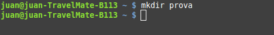
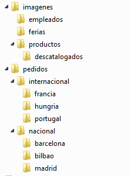

UD 5 - Comandos 
===============

- [UD 5 - Comandos](#ud-5---comandos)
  - [Objetivos de la unidad](#objetivos-de-la-unidad)
  - [Conceptos clave](#conceptos-clave)
  - [Conocimiento previo](#conocimiento-previo)
- [La interfaz de texto](#la-interfaz-de-texto)
    - [Conceptos básicos](#conceptos-básicos)
    - [Scripts](#scripts)
    - [Sintaxis](#sintaxis)
    - [Comodines](#comodines)
- [Rutas absolutas y relativas](#rutas-absolutas-y-relativas)
- [Comandos MS Windows](#comandos-ms-windows)
- [Comandos GNU/Linux](#comandos-gnulinux)

Objetivos de la unidad
----------------------

Los objetivos a alcanzar en esta unidad de trabajo son los siguientes:

- Utilizar la interfaz de texto en el sistema operativo
- Saber utilizar la línea de comandos para realizar tareas
- Utilizar la interfaz de texto para realizar configuraciones en el equipo

El objetivo de esta unidad no es que el alumno conozca en profundidad el uso de los diferentes comandos en Windows y GNU/Linux sino que adquiera unos conocimientos básicos del uso de la terminal y tenga una guía de referencia donde poder consultar cómo usar los comandos que vaya
necesitando a lo largo del curso.

Conceptos clave 
---------------

Los conceptos más importantes de esta unidad son:

- Funcionamiento de la terminal el Windows y GNU/Linux
- Principales comandos
- Redireccionamiento de comandos

Conocimiento previo
-------------------

Antes de comenzar esta unidad de trabajo el alumno debería saber:

- cuáles son los sistemas operativos más utilizados en la arquitectura PC
- cómo utilizar software de virtualización para crear máquinas virtuales

La interfaz de texto 
====================

Una de las funciones del sistema operativo es hacer de intermediario entre el usuario y el equipo: el sistema operativo le proporciona una interfaz para comunicarse con el ordenador. Las interfaces pueden ser de dos tipos:

- **de texto**: el usuario se comunica mediante el teclado escribiendo comandos que el sistema operativo entiende y ejecuta. Esta parte del sistema operativo se llama shell o intérprete de comandos. El shell lee el comando tecleado, lo ejecuta y muestra el resultado por pantalla y le pide al usuario un nuevo comando (mostrándole el carácter de petición de comandos o prompt).
- **gráfica**: consta de ventanas, iconos y botones con los cuales el usuario interactúa. Son mucho más sencillas de usar para el usuario por lo cual actualmente la mayoría de sistemas operativos proporcionan este tipo de interfaces.

La interfaz que tenían los primeros sistemas operativos para comunicarse con el usuario era de texto, en la cual el usuario tenía que escribir una orden y esperar los resultados. Desde hace ya muchos años los sistemas operativos disponen también de una interfaz gráfica que facilita enormemente su uso puesto que ahora no es necesario conocer multitud de órdenes. Entonces, ¿por qué usar la línea de órdenes?. Las razones son varías:

- no todo se puede hacer desde el entorno gráfico
- muchas veces para hacer una acción tenemos que pasar por muchos menús y ventanas el que trae tiempo
- es difícil automatizar tareas que hacemos a a menudo (a veces miedo hacerse con macros y otros es imposible)

### Conceptos básicos

La línea de órdenes es una interfaz de usuario de tipo texto para
interactuar con el sistema operativo. El usuario escribe una orden en el símbolo del sistema o **prompt** que se ejecuta al pulsar la tecla *Intro*. Un programa, denominado intérprete de comandos o **shell**, comprueba si la sintaxis es correcta y ejecuta el comando. Cuando finaliza vuelve a mostrar el prompt y podemos escribir otra orden.

El prompt es un símbolo que muestra el sistema operativo y que indica que está preparado para recibir órdenes. Además muestra información al usuario como el directorio actual o el nombre del usuario y el ordenador en el caso de Linux.


En Windows el prompt es el símbolo “\>” y muestra el directorio actual: C:\\Users\\juan, es decir, el directorio personal del usuario “juan”.


En Linux el prompt de cualquier usuario (excepto root) es \$ y la
información que muestra es el usuario (juan), el nombre del ordenador (acerubuntu) y el directorio actual (\~, que es el directorio personal del usuario, es decir, /hombre/juan). El símbolo @ separa el usuario y el ordenador y el símbolo : separa el ordenador del directorio actual.


El Linux el prompt del usuario root es \#. La información mostrada es el usuario (root), el ordenador (acerubuntu) y el directorio actual (/hombre/juan, es el mismo que antes pero en este caso ese directorio no es el directorio personal de root por lo cual no pone \~).

El directorio actual es el directorio en el cual nos encontramos en este instante y en el cual se ejecutará la orden. Si, por ejemplo, la orden es de crear el directorio “prueba” (mkdir prueba) ese directorio se creará en el directorio actual. En los ejemplos anteriores se creará
dentro de /hombre/juan (en los ejemplos de Linux) y dentro de C:\\Users\\juan (en el ejemplo de Windows).

### Scripts

Además de escribir un por uno los comandos a ejecutar también se pueden escribir todos en un fichero de texto llamado **script**. Un script contiene en cada línea un comando.

Ejecutar un script es equivalente a escribir y ejecutar un detrás otro todos los comandos que contiene.

Los scripts se utilizan habitualmente para automatizar tareas que
tenemos que realizar periódicamente en el ordenador. El script incluirá los comandos necesarios para hacer esa tarea y el único que tenemos que hacer se ejecutarlo (escribir su nombre) desde la línea de comandos o incluso programar su ejecución.

### Sintaxis

Un comando es simplemente una palabra en inglés que expresa una operación a realizar y que se tiene que teclear a continuación del prompt.

Cuando ejecutamos un comando podemos pasarle uno o más parámetros (unos obligatorios y otros opcionales, según el comando). Los parámetros son información que recibirá el comando para su ejecución y van después del nombre del comando separados por espacios en blanco.



En el ejemplo anterior el comando mkdir recibe como parámetro en nombre del directorio a crear, en este caso prueba.

### Comodines

Si los parámetros son nombres de ficheros podemos utilizar caracteres
comodines. Los comodines son:

- \* (asterisco): sustituye a cero o más caracteres
- ? (interrogación): sustituye a un carácter

Vamos a ver algunos ejemplos en los que utilizaremos el comando copy. Se trata de un comando de Windows que permite copiar ficheros y al que se le pasan 2 parámetros: el primero el nombre del fichero a copiar y el segundo la ruta donde lo copiaremos.

```bash
copy inf\*.txt C:\\Users\\juan\\prueba
```

Comando de Windows que copia todos los ficheros el nombre de los cuales empieza por “inf” seguido de cualquier carácter y la extensión de los cuales es “txt” desde el directorio actual al directorio C:\\Users\\juan\\prueba (copiará inf.txt, informe.txt, informacio\_junio.txt, etc pero no informe.doc, mí\_informe.txt, ...)

```bash
copy \_junio.doc C:\\Users\\juan\\prueba
```

Comando de Windows que copia todos los ficheros el nombre de los cuales acaba por “\_junio” y la extensión de los cuales es “doc” desde el directorio actual al directorio C:\\Users\\juan\\prueba (copiará informe\_junio.doc, ventas\_junio.doc, etc pero no informo\_junio\_clientes.doc, informo\_junio.txt, ...)

```bash
copy \*.\* C:\\Users\\juan\\prueba
```

Comando de Windows que copia todos los ficheros (con cualquier nombre y extensión) desde el directorio actual al directorio C:\\Users\\juan\\prueba

```bash
copy mi?o.jpg C:\\Users\\juan
```

Comando de Windows que copia todos los ficheros el nombre de los cuales es “mi”, una letra cualquiera y “o” y la extensión de los cuales es “jpg” desde el directorio actual al directorio C:\\Users\\juan (copiará mando.jpg, mazo.jpg, etc pero no marzo.jpg -2 letras- ni mao.jpg -0 letras-).

Rutas absolutas y relativas 
===========================

Cómo hemos visto una orden se ejecuta en el directorio actual, pero puede actuar sobre ficheros o directorios que estén en cualquier parte de nuestro sistema de ficheros.

Cuando el parámetro de un comando es un nombre de fichero o directorio tenemos que especificar su ruta, es decir, donde se encuentra. Si no lo hacemos el sistema considerará que ese fichero o directorio se encontrar en el directorio actual. Si no es así tenemos que indicar la ruta hasta el fichero o directorio.

La ruta se puede indicar tomando como base el directorio raíz del sistema de ficheros (o de la unidad en Windows) y en este caso se denomina **ruta absoluta**, o tomando como base el directorio actual, en este caso se llama **ruta relativa**. Una ruta absoluta siempre empezará en Gnu/Linux con el directorio raíz (**/**) y en Windows con el directorio raíz, precedido o no por la letra de la unidad (\\ o C:\\).

Recordamos que, además de con su nombre, podemos hacer referencia al directorio actual con el símbolo . (punto) y al directorio padre con .. (punto punto).

Vamos a ver unos ejemplos partiendo de la estructura de directorios de la imagen siguiente. Esa estructura está creada en la carpeta personal del usuario juan (en C:\\Usuarios\\juan). Para los ejemplos nuestro
directorio actual será *nacional* (C:\\Usuarios\\juan\\pedidos\\nacional).



Ejemplos:

- Copiar todos los ficheros de *nacional* en *bilbao*

Ruta absoluta: copy C:\\Usuarios\\juan\\pedidos\\nacional\\\*.\* C:\\Usuarios\\juan\\pedidos\\bilbao

Ruta relativa: copy \*.\* bilbao (o también copy \*.\* .\\bilbao)

- Copiar todos el ficheros con extensión “jpg” de “pedidos” a “ferias”

Ruta absoluta: copy C:\\Usuarios\\juan\\pedidos\\\*.jpg C:\\Usuarios\\juan\\imagenes\\ferias

Ruta relativa: copy ..\\\*.jpg ..\\..\\imagenes\\ferias

También podemos poner un parámetro con ruta absoluta y otro con relativa. Ejemplo:

- Copiar los ficheros con extensión *gif* de *descatalogados* a *imagenes*: copy descatalogados\\\*.gif C:\\Usuarios\\juan\\imagenes

Comandos MS Windows
===================

Documentación comandos Windows [aquí](windows.md)

Comandos GNU/Linux
==================

Documentación comandos GNU/Linux [aquí](linux.md)


Obra publicada con [Licencia Creative Commons Reconocimiento No comercial Compartir igual 4.0](http://creativecommons.org licenses/by-nc-sa/4.0/)
