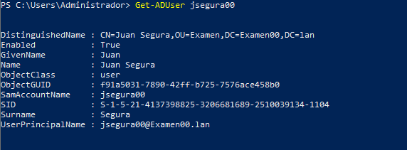
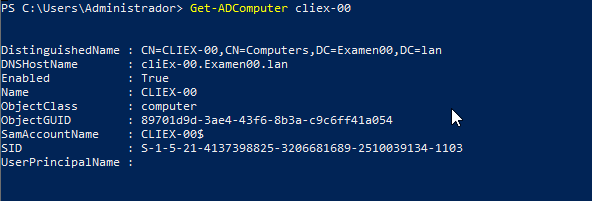
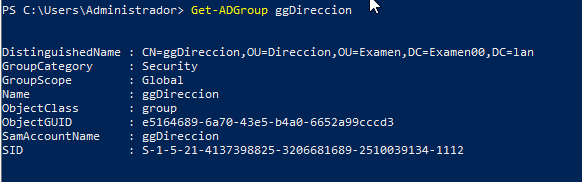

# Active Directory
- [Active Directory](#active-directory)
  - [Introducción](#introducción)
  - [Notación de los objetos del Active Directory](#notación-de-los-objetos-del-active-directory)
  - [Añadir más DC a un dominio](#añadir-más-dc-a-un-dominio)
  - [Roles FSMO](#roles-fsmo)
  - [Transferir roles FSMO](#transferir-roles-fsmo)

## Introducción
El nombre que da Microsoft al servicio de directorio es **Active Directory** y, al igual que los usados en GNU/Linux, sigue el estándar LDAP (_Lightweight Directory Access Protocolo_, protocolo ligero de acceso al directorio).

Para tener un directorio en una red Windows necesitaremos un servidor con un sistema operativo Windows 2022 Server (o alguna de las versiones anteriores) en el que instalaremos el rol de "**Servicios de dominio de Active Directory**" que lo promoverá dicho servidor a **Controlador de Dominio** (DC, _Domain Controller_). En todo dominio _Active Directory_ habrá al menos un controlador de dominio pero pueden haber más controladores de dominio. Antiguamente el primer DC se llamaba controlador de dominio principal (PDC, _Primary Domain Controller_) y era el único que podía hacer cambios en el dominio. Los otros tenían copias del directorio, y se llamaban BDC (_Backup Domain Controllers_).

Si en una red montamos un dominio _Active Directory_ se necesitará un servidor DNS que resuelva dicho dominio para los equipos de la red. Si no hay ninguno se instalará el servicio DNS automáticamente en el DC al instalar _Active Directory_ y se configurará para poder responder al nombre del servidor y del dominio.

## Notación de los objetos del Active Directory
Como en cualquier LDAP todos los objetos de AD (usuarios, equipos, grupos, ...) tienen un identificador único que es su DV (_Distinguished Name_). Podemos verlos con los _cmdlets_ `Get-ADUser`, `Get-ADComputer`, `Get-ADGroup`, etc:







Como vemos, además del DN cada objeto tiene un **SID** (_Security IDentifier_) que también és único. Este SID esta formado por 3 partes:
- **S-1-5-21**: es un identificador asignado por ISO a Microsoft y especifica que es un identificador de seguridad para uso en dominios NT
- el identificador del dominio, único para cada dominio. En los ejemplos anteriores es 4137398825-3206681689-2510039134. Podemos obtenerlo con  `Get-ADDomain`
- el **RID** (_Relative IDentifier_) que es el identificador relativo del objeto y que es único, a partir de 1000

Este es el identificador que usa internamente Microsoft para identificar los objetos y por eso, en ocasiones, al mirar los permisos de una carpeta vemos un SID en lugar de un nombre de usuario o grupo (siempre lo _traduce_ pero a veces tarda un instante, o no puede).

## Añadir más DC a un dominio
El DC es un equipo crítico en nuestra red por lo que es una buena idea que sea tolerante a fallos. Esto se consigue muy fácilmente añadiendo a la red un segundo DC.

La principal función de un DC es autenticar a los usuarios y en ese proceso intervienen varios elementos:
- un DC que es quien realiza la autenticación
- un GC (Global Catalog) configurado en el DC,
- un DNS para que los clientes encuentren al DC

El GC es un repositorio de datos con información (no toda) de cada objeto del dominio. Puede estar en varios DC y se utiliza en el inicio de sesión y en las búsquedas en el dominio (Más información: [Microsoft](https://social.technet.microsoft.com/wiki/contents/articles/16637.catalogo-global-global-catalog-conceptos-y-funciones-es-es.aspx)).

La opción por defecto al promover un servidor a DC es que se instale en el mismo el GC y también el servicio DNS. También al promover un servidor a DC de un dominio ya existente. 

Por tanto para tener tolerancia a fallos respecto al DC en nuestra red debemos hacer que los 2 DC tengan el GC y el servicio DNS y configurar en todos los clientes como DNS a ambos DC.

**NOTA**: un usuario puede iniciar sesión aunque no haya disponible ningún DC si ya ha iniciado sesión anteriormente en ese equipo porque el cliente usa siempre en primer lugar las credenciales cacheadas de ese usuario (en su perfil se guarda también su contraseña encriptada de forma que es el propio cliente quien hace la comprobación). Sin embargo no podrá conectarse a ningún recurso de otro equipo porque necesita un ticket Kerberos que sólo proporciona un DC.

**IMPORTANTE**: un DC sólo debería dedicarse a autenticar usuarios y a servidor DNS. Como mucho le podríamos poner un servicio ligero como DHCP pero no es recomendable que haga también de servidor de ficheros, de impresión o de aplicaciones. Tampoco debería hacer nunca de servidor de comunicaciones ya que contiene información muy importante y no debería estar expuesto a internet sino protegido dentro de la LAN.

## Roles FSMO
Si nuestra infraestructura de red consta de un sólo dominio con un único DC es muy sencilla su administración pero cuando tenemos un bosque con varios dominios y subdominios gestionados por diferentes DC (cada dominio/subdominio debe contar con su propio DC) la cosa puede complicarse.

Por ejemplo podría suceder que dos administradores estén creando simultáneamente 2 subdominios con el mismo nombre. O que en 2 DC se estén creando 2 usuarios y se les esté asignando el mismo identificador (SID) a ambos.

Para solucionar los problemas derivados de la administración distribuida del bosque Microsoft ha definido 5 roles cada uno de los cuales que sólo puede ejecutarse en un único DC del bosque llamado _Maestro de operaciones único flexible_ (**FSMO**). Estos roles son:
- Maestro de esquema
- Patrón de nomenclatura de dominio
- Patrón de RID
- Emulador PDC
- Maestro de infraestructura

Podemos ver qué máquinas ejecutan cada uno de estos roles con el comando:
```cmd
NETDOM QUERY FSMO
```

**Maestro de Esquema (Schema Master)**

Hay 1 por bosque (estará en un DC del dominio raíz). Es el único que puede hacer modificaciones en el esquema de directorio y, una vez hechas, las replica al resto de DC.

**Maestro de Nomenclatura de Dominios (Domain Naming Master)**

También es único en el bosque y su función es garantizar de que los nombres de los Dominios que se agreguen al bosque sean únicos. Es el único que añade o elimina dominios del directorio.

**Maestro RID (Relative IDentifier Master)**

Hay 1 maestro por dominio y se encarga de asignar RIDs a los DC de ese dominio. A cada DC le asigna 500 RID (a partir del 1000) y cuando le quedan menos de 50 vuelve a solicitar al RID Master otros 500. Así se asegura de que 2 DC distintos no puedan asignar un mismo RID a 2 objetos.

**Maestro Controlador Principal de Dominio (PDC Emulator)**

Antiguamente sólo el PDC podía efectuar cambios en el dominio. Este rol se mantiene por compatibilidad y además se encarga de gestionar el tiempo en el dominio. Este es el equipo que obtiene la hora de una fuente externa y todos los demás usarán la hora de este DC.

Además tiene otras funciones como procesar los bloqueos de cuenta o recibir preferentemente los cambios de contraseña de los usuarios.

**Maestro de Infraestructura (Infrastructure Master)**

Se encarga de actualizar el SID de los objetos al hacer referencia a ellos desde otro dominio.

Podéis ampliar la información en páginas como:
- [Microsoft: Roles FSMO de Active Directory en Windows](https://docs.microsoft.com/es-es/troubleshoot/windows-server/identity/fsmo-roles)
- [Windowsserver: Maestros de Operaciones (FSMO Roles)](https://windowserver.wordpress.com/2011/05/10/maestros-de-operaciones-fsmo-roles-parte-1/)

## Transferir roles FSMO
Cuando un DC es correctamente degradado sus roles FSMO son asignados automáticamente a otros DC. También puede suceder que se apague el DC correctamente, por ejemplo por mantenimiento programado, y sus roles FSMO sean asignados a otro DC "vivo".

Sin embargo en ocasiones puede ser necesario que un _Administrador_ deba transferir manualmente un rol a otro DC, por ejemplo si el titular del mismo ha dejado de funcionar y se ha degradado con el comando `dcpromo /forceremoval`. El comando para transferir roles FSMO es
```cmd
ntdsutil /roles
```

Podéis ampliar la información en [Microsoft: Transferir o aprovechar roles FSMO en servicios de dominio de Active Directory](https://docs.microsoft.com/es-es/troubleshoot/windows-server/identity/transfer-or-seize-fsmo-roles-in-ad-ds).