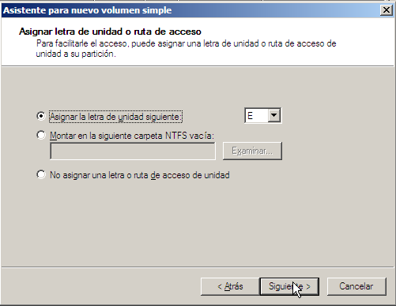
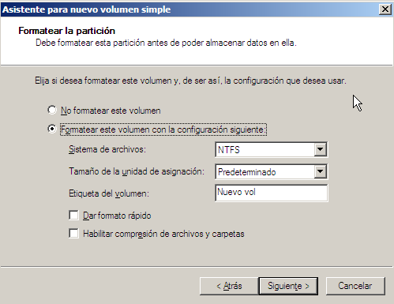
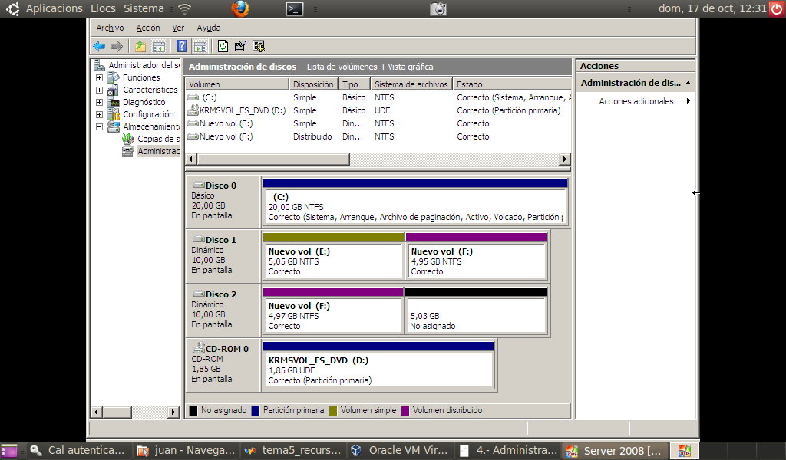
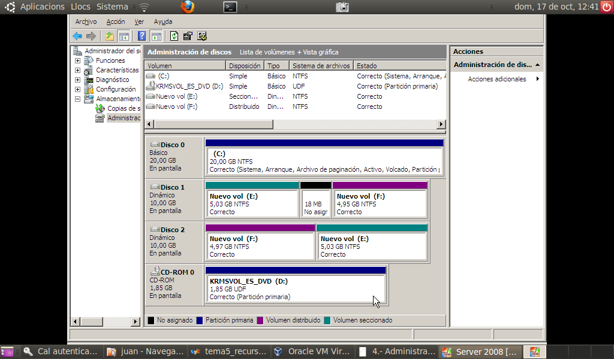

# Administrar discos
- [Administrar discos](#administrar-discos)
  - [Introducción](#introducción)
  - [Administración de discos](#administración-de-discos)
  - [Creación de un volumen simple](#creación-de-un-volumen-simple)
    - [Creación de un volumen simple con Powershell](#creación-de-un-volumen-simple-con-powershell)
  - [Convertir un disco básico en dinámico](#convertir-un-disco-básico-en-dinámico)
  - [Creación de un volumen distribuido](#creación-de-un-volumen-distribuido)
  - [Creación de volúmenes seccionados (RAID-0)](#creación-de-volúmenes-seccionados-raid-0)
  - [Creación de volúmenes reflejados (RAID-1)](#creación-de-volúmenes-reflejados-raid-1)
  - [RAID 5](#raid-5)

## Introducción
En Windows Server tenemos dos tipos de discos:
- **Básicos**: son los discos que hemos utilizado hasta ahora. Ya vimos en en un PC podíamos usar principalmente 2 tipos de tablas de particiones para los discos:
  - **la tabla de particiones Ms-DOS (la del MBR)** donde un disco puede tener hasta 4 particiones primarias una de las cuales puede ser extendida dentro de la cual se pueden crear tantas particiones lógicas como sea necesario
  - **la tabla de particiones GUID (GPT)**, más moderna y donde sólo existen particiones primarias y pueden haber hasta 128
- **Dinámicos**: los discos no se organizan en particiones sino en volúmenes y no son accesibles desde sistemas operativos que no sean Windows Server. La principal ventaja es la gran versatilidad que ofrecen los volúmenes frente a una partición que siempre debe ser una parte contigua de un sólo disco.

Igual que en un disco básico creamos particiones (que aquí se llaman **volúmenes simples**) en un disco dinámico se crean **volúmenes dinámicos**. No hay límite en el número de volúmenes que se pueden crear. Un volumen puede estar formado por una o más partes de un sólo disco o puede extenderse por más de un disco. Otra ventaja importante de los volúmenes es que se pueden redimensionar sin tener que reiniciar el sistema.

Además podemos configurar los volúmenes dinámicos para trabajar en **RAID-0** (volúmenes seccionados), **RAID-1** (volúmenes reflejados) y **RAID-5**.

Tanto los discos básicos como los dinámicos se gestionan desde el **Administrador de discos**.

## Administración de discos
Para gestionar los discos utilizamos la herramienta _Administración de discos_ que encontramos dentro del _Administrador de equipos_ y es muy parecida a la de otras versiones de Windows. Algunas de las características que incorpora el Administrador de discos son:
- permite extender y reducir el tamaño de las particiones
- es muy sencillo crear volúmenes distribuidos o seccionados
- cuando agregamos más de 4 particiones en un disco MBR nos permite hacer la conversión a disco GPT

También se pueden administrar desde la línea de comandos con la herramienta **DISKPART** o con los _cmdlets_ de **Powershell**.

## Creación de un volumen simple
Windows Server no utiliza la palabra partición sino que la denomina volumen simple. Antes de poder trabajar con un disco desde la _Administración de discos_ el disco tiene que haberse inicializado (como disco MBR o GPT). Si no lo está aparece la siguiente pantalla desde la que se crea la tabla de particiones del disco:


Para crear una nueva partición en un espacio sin particionar desde el menú contextual seleccionamos `Nuevo volumen simple` y en la siguiente pantalla indicamos el tamaño de la partición a crear. A continuación le asignamos una letra a la nueva unidad o una carpeta donde se montará (Windows Server nos da la posibilidad de acceder a una unidad mediante una letra de unidad como el resto de sistemas Windows o montando la unidad en una carpeta como los sistemas UNIX y Linux):



A continuación elegimos el sistema de archivos. Podemos seleccionar el tamaño de clúster:



Por último el asistente nos muestra un resumen de las opciones elegidas y cuando pulsamos _Finalizar_ se crea la nueva partición.

Desde el menú contextual de cualquier partición ya creada podemos:
- Cambiar la letra y ruta de acceso: para asignarle una letra o ruta diferente
- Extender o reducir el volumen: para cambiar su medida
- Eliminar partición
- Agregar reflejo (si tenemos suficiente espacio sin particionar): para crear un RAID-1.

### Creación de un volumen simple con Powershell
Para hacer esto desde _Powershell_ haremos:
```powershell
Get-Disk    
# muestra lso discos, el nuevo tendrá RAW en Partition Style
# suponemos que su Number es el 1
Initialize-Disk -Number 1 -PartitionStyle GPT
New-Partition -DiskNumber 1 -Size 200GB -AssignDriveLetter
# como no indicamos la letra que se le debe asignar se le asigna
# automáticamente, supondremos que es la E:
Format-Volume -DriveLetter E -FileSystem NTFS
```

## Convertir un disco básico en dinámico
Convertir un disco en dinámico nos da nuevas posibilidades (como utilizar RAID) pero también tiene limitaciones, sobre todo de compatibilidad, cómo hemos visto antes. Si queremos convertir un disco en dinámico desde su menú contextual (el del disco, a la izquierda, no el de las particiones) seleccionamos Convertir en disco dinámico. Aparece una pantalla donde elegir qué discos queremos convertir en dinámicos.

Para convertir un disco dinámico en básico tenemos que eliminar previamente todos los volúmenes del disco (es decir, perderemos todos los datos) y a continuación desde su menú contextual seleccionamos Convertir en disco básico.

## Creación de un volumen distribuido
En un disco básico podemos crear un volumen básico como hemos visto antes o un volumen distribuido que incluye partes de más de un disco. Se hace desde su menú contextual seleccionando Nuevo volumen distribuido:


En esta pantalla añadimos todos los discos por los que se extenderá el volumen e indicamos el espacio a coger de cada disco. El resto del proceso es igual que para un volumen básico: asignamos letra o ruta de acceso y después el sistema de archivos a crear.



## Creación de volúmenes seccionados (RAID-0)
Se pueden crear sobre volúmenes básicos o dinámicos. Necesitamos 2 o más discos con espacio sin particionar. Se crea de forma similar al volumen distribuido pero la medida del volumen tiene que ser igual en cada disco.



## Creación de volúmenes reflejados (RAID-1)
También se pueden crear sobre disco básicos pero esta operación los convertirá en dinámicos. Para reflejar un volumen desde su menú contextual seleccionamos la opción Añadir reflejo. A continuación tenemos que seleccionar otro disco donde crear el volumen reflejado (tiene que tener espacio sin particionar de a el menos la medida del volumen a reflejado):


En cualquier momento se puede deshacer un volumen reflejado desde el menú contextual seleccionando Eliminar reflejo. Al hacerlo el volumen seleccionado deja de ser parte del RAID 1 y se puede utilizar.

## RAID 5
Podemos implementar RAID 5 sobre discos dinámicos si tenemos al menos 3 discos. RAID 5 incluye tolerancia a fallos (si falla 1 disco se puede regenerar la información que contenía a partir de los otros) y sus desventajas son que aprovecha sólo el 66% del espacio de almacenamiento (con 3 discos, pero mejora el 50% de RAID 1) y que la escritura es más lenta porque se tiene que escribir información de paridad. Para solucionar esto normalmente se implementa por hardware con controladoras RAID.

Para crear una unidad RAID 5 desde el menú contextual de un disco del volumen a crear seleccionamos Nuevo volumen RAID 5. A continuación indicamos la cantidad de espacio a utilizar en cada disco y después añadimos el resto de discos. Por último asignamos una letra y especificamos el sistema de archivos igual que hemos visto antes.

Si uno de los discos de un volumen RAID 5 presenta problemas podemos restaurar la información que contenía seleccionando la opción Regenerar paridad. Si directamente el disco no funciona tenemos que hacer:
1. Eliminamos el disco del RAID desde su menú contextual seleccionando `Quitar volumen`
2. Seleccionamos espacio no particionado en otro disco (que no forme ya parte del volumen RAID 5) y desde su menú contextual seleccionamos `Reparar volumen`
