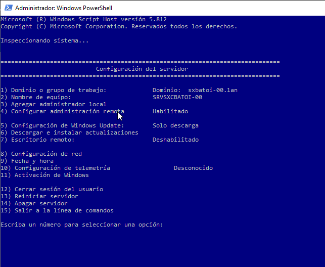
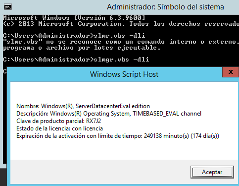

# Instalación de Windows Server
- [Instalación de Windows Server](#instalación-de-windows-server)
  - [Planificación de la instalación](#planificación-de-la-instalación)
  - [Proceso de instalación](#proceso-de-instalación)
    - [Instalación Server Core](#instalación-server-core)
  - [Finalización de la instalación](#finalización-de-la-instalación)
    - [Proporcionar información del equipo](#proporcionar-información-del-equipo)
    - [Configurar la red](#configurar-la-red)
    - [Actualizar el servidor](#actualizar-el-servidor)
    - [sconfig](#sconfig)
    - [Roles y características](#roles-y-características)
    - [Versión de evaluación](#versión-de-evaluación)
  - [Documentación de la instalación](#documentación-de-la-instalación)

## Planificación de la instalación
Instalar un sistema operativo nunca es un proceso trivial y mucho menos en el caso de un servidor. Si el sistema no se instala y configura correctamente podemos encontrarnos posteriormente con fallos que serán difíciles de corregir. Ya vimos en el bloque 1 las [tareas a planificar](../ud03/aplnif.md#introducción) antes de realizar la instalación de un sistema operativo.

En la fase de [análisis del sistema](./README.md#caso-práctico) debemos haber respondido a la pregunta de para qué vamos a utilizar este sistema informático tanto en la actualidad como en el futuro (al menos a corto/medio plazo).

Una vez decidido que nuestro sistema informático es bastante complejo como para necesitar un servidor tenemos que planificar cuidadosamente su instalación:
- Habrá que elegir los sistemas operativos a instalar en el servidor y en los clientes
- También tenemos que elegir qué servicios son los que necesitamos y si para ofrecer esos servicios tendremos uno o varios servidores.
- Por último tenemos que decidir si queremos que los servidores estén o no virtualitzados (en nuestro caso lo estará necesariamente pero muchas veces en la empresa tiene ventajas el uso de servidores virtualizados como vimos en la UD 2 sobre virtualización).

Una vez analizadas todas las consideraciones indicadas tendremos que decidir sobre diferentes aspectos:
- Elección del hardware
  - Compatibilidad con el sistema operativo a instalar
  - Capacidad para hacer frente a las necesidades actuales y en posibles crecimientos al menos a corto plazo
  - En caso de decidir virtualitzar servidores el equipo tendría que tener soporte hardware para la virtualización
  - Soporte de drivers para todo el hardware. En caso de no existir drivers tendrían que cambiar el hardware o elegir otra opción de sistema operativo
  - Soporte para todo el software a instalar: sistema operativo, aplicaciones, seguridad (antivirus, backup, ...), etc
- Elección del sistema operativo
  - Compatibilidad con el hardware
  - Compatibilidad con los sistemas operativos del cliente
  - Funcionalidades para la correcta gestión de la red
- Aplicaciones
  - Compatibilidad de todas las aplicaciones a instalar con el sistema operativo y el hardware

En función de eso haremos la elección de los equipos a adquirir y los sistemas a instalar en cada equipo, eligiendo los que satisfagan todas nuestras necesidades (actuales y futuras).

En nuestro caso no tenemos que preocuparnos de la parte del hardware porque ya lo tenemos y no lo podemos cambiar. Simplemente miraremos si es necesario mejorar algún elemento como aumentar la cantidad de RAM o adquirir algún disco duro adicional o alguna otra tarjeta de red.

Respecto al  sistema operativo ya hemos elegido los sistemas para los clientes y debemos ahora elegir el sistema operativo para el servidor. Como aún no tenemos demasiados conocimientos de los sistemas GNU/Linux nos decantaremos por un Windows Server para el servidor que hemos visto que cumple con los requerimientos que nos plantean.

Lo razonable es instalar la última versión: Windows Server 2022. Dentro de cada versión de Windows hay diferentes ediciones y debemos elegir la más adecuada para nuestro sistema.

En la web de [Microsoft](https://www.microsoft.com/es-es/windows-server/pricing), Wikipedia y otras páginas podemos consultar las características de las diferentes ediciones.

## Proceso de instalación
Una vez finalizada la planificación procederemos a la instalación del sistema. Si ya tenemos las particiones hechas en la instalación elegiremos cuál será la del sistema. Si no las haremos al instalar (recordad que el instalador de Windows sólo permite crear particiones primarias y con sistema de ficheros NTFS).

El proceso de instalación es similar al de cualquier Windows cliente.

### Instalación Server Core
Esta instalación (que es la opción por defecto al instalar el sistema) instala el servidor pero sin entorno gráfico, con las ventajas e inconvenientes que ello comporta. En realidad sí que hay un sistema gráfico desde el que se pueden realizar algunas acciones pero no es tan potente ni pesado como el entorno gráfico normal.

Una forma bastante práctica de usar un servidor Server Core es gestionarlo con la herramienta de Microsoft **RSAT** (_Remote Server Administration Tools_) que puede instalarse en cualquier cliente Windows con entorno gráfico y que nos permitirá gestionar desde él el servidor gráficamente.

Para cambiar el nombre del servidor haremos:
```powershell
Rename-Computer -NewName MISERVIDOR
Restart-Computer -force
```

Para configurar la red podemos usar Powershell o **netsh**:
```powershell
Get-NetAdapter –name $redInterna | Remove-NetIPAddress -Confirm:$false
Get-NetAdapter –name $redInterna | New-NetIPAddress –AddressFamily IPv4 –IpAddress 192.168.1.25 -PrefixLength 24
```

## Finalización de la instalación
Una vez finalizada la instalación y antes de configurar el sistema es conveniente hacer una serie de comprobaciones:
- **estado de los dispositivos**: desde el _Administrador de dispositivos_ podemos comprobar que no haya hardware sin detectar o con problemas de controladores
- **configuración de la red**: es fundamental que sea correcta. Podemos comprobarlo con comandos como `ping`, `tracert`, `nslookup`,... y también con las herramientas del _Centro de redes y recursos compartidos_
- **registros de eventos**: mediante el Visor de eventos podemos como probar que no haya errores o advertencias que indican que algo no funciona correctamente
- **particiones**: también es conveniente comprobar que el sistema detecta correctamente todos los discos y las particiones hechas

Una vez comprobado todo esto es conveniente reiniciar el equipo para comprobar que lo hace correctamente. Después acabaremos de configurarlo como veremos ahora y, una vez configurado, sería conveniente hacer una imagen del servidor limpio.

Lo primero es realizar una serie de tareas básicas de configuración desde el `Administrador del servidor->Servidor local`.

### Proporcionar información del equipo
Tenemos que proporcionar el **nombre del equipo**. Como nombre de equipo se recomienda que no tenga más de 15 caracteres y sólo use caracteres estándar (letras normales, números o guión). El nombre tiene que ser único en el dominio.

Respecto al dominio si este servidor hará de servidor en un dominio ya existente (donde ya hay otro servidor que hace de controlador de dominio) aquí indicaremos el nombre del dominio. Si no trabajaremos con dominio o es este servidor el que hará de controlador lo dejamos como grupo de trabajo (posteriormente veremos como crear el nuevo dominio).

El _Firewall_ de Windows siempre deberemos tenerlo activado y bien configurado.

Si es necesario podemos habilitar el _Escritorio remoto_ para que los usuarios puedan conectarse al servidor mediante _Terminal Server_ y trabajar desde su equipo como si estuvieron físicamente en la consola del servidor.

También es aconsejable comprobar la zona horaria (aparece a la derecha).

### Configurar la red
Tenemos que comprobar la configuración de la red. Lo más normal es que el servidor tenga direcciones IP estáticas, no obtenidas por DHCP (seguramente será él quien asigne direcciones por DHCP). Si no lo hemos hecho antes desde aquí le asignamos la IP que corresponda a cada tarjeta de red.

Si nuestro servidor tiene que hacer de servidor de comunicaciones y ser la puerta de enlace por la cual los clientes de nuestra red accedan en Internet tendrá que tener al menos 2 tarjetas de red:
- la tarjeta externa que conectará nuestro servidor con la red externa (al router o equipo que le da salida a Internet). Configuraremos el protocolo TCP/IP (la IPv4, la IPv6 o las dos, según el protocolo que utilizamos en nuestra red): como _gateway_ pondremos la IP del dispositivo que nos proporciona acceso a Internet y como IP de nuestro equipo pondremos la IP estática con que se conecta a ese gateway (tendrá que estar en la misma subred para poder acceder al gateway). Si estamos creando un servidor virtual la IP será diferente según si elegimos adaptador puente o NAT cuando configuremos el adaptador en VirtualBox.
- la tarjeta interna conectará nuestro servidor a los clientes e irá al switch al que se conectan todos los clientes. En su configuración no pondremos ninguna gateway porque la salida de esta tarjeta será la tarjeta externa y como dirección IP de nuestro servidor pondremos una IP de la misma subred de nuestros clientes (normalmente solo ser la acabada en 1, por ejemplo 192.168.224.1, pero puede ser cualquiera).

Finalmente tendremos que enrutar el tráfico entre las dos tarjetas de forma que todo el tráfico de salida que llega por la tarjeta interna sea transferido a la externa desde donde irá hacia su destino. Sin este paso los clientes llegarán al servidor pero no podrán ir más allá. La forma más sencilla de hacer esto es instalando en nuestro servidor el **Servicio de Enrutamiento** (es uno de los servicios que encontramos dentro del servicio de _Acceso a red_).

### Actualizar el servidor
En este apartado configuramos las actualizaciones del servidor. Podemos configurarlas automáticamente o manualmente donde podemos indicar cómo queremos que se realizan las actualizaciones, que se envían a Microsoft los informes de errores y cómo queremos participar en el programa de mejora de la experiencia de usuario (se envía información a Microsoft del que instalamos y estiércol).

Si es importante que un cliente esté siempre actualizado para evitar vulnerabilidades esto es mucho más importante en el caso del servidor porque si un atacante consigue acceder a nuestro servidor tendrá a su alcance toda la información y los recursos de nuestra red. De todas formas tenemos que tener cuidado con esto porque algunas actualizaciones requieren reiniciar el equipo (y es un tema delicado en un servidor) y también podría pasar que alguna actualización nos de problemas con nuestro hardware o con alguna aplicación instalada, aunque es algo poco habitual. Por eso hay administradores que prefieren que las actualizaciones se descarguen automáticamente pero no se instalen sino que hacen ellos la instalación en momentos en que no sea crítico el funcionamiento del servidor.

No profundizaremos en cómo hacerlo ya que es igual que en cualquier cliente Windows.

**Recordad que nosotros deshabilitaremos las actualitzaciones automáticas para no colapsar la red del instituto.**

### sconfig
Esta herramienta de texto **sconfig** nos permite configurar de forma sencilla la mayoría de opciones desde la terminal, lo que no será muy útil en una instalación _Server Core_. Si lo ejecutamos nos aparece su menú:



### Roles y características
Los roles son los diferentes servicios que podemos instalar en el servidor.

Las características son componentes que permiten añadir funcionalidades al servidor, como copias de seguridad, cifrado de discos, equilibrio de carga de red, etc.

Tras la instalación ya tenemos Windows Server correctamente instalado en nuestra máquina pero aún no se comporta como un servidor. Ahora falta instalar los servicios necesarios para convertir a este equipo en el servidor del nuestra red.

El más importante es el **servicio de dominio de Active Directory**, que veremos en el siguiente apartado. Antes vamos a ver cómo se instalaría cualquier servicio (llamados "roles" por Microsoft) y en concreto instalaremos y configuraremos el servicio de enrutamiento para que los clientes de nuestra red interna tengan salida al exterior (y a Internet) a través de este servidor.

Pero antes de eso vamos a aprender a administrar los discos de que dispongamos que es una cuestión importante en un servidor ya que posiblemente en ellos se alojen los datos de la empresa.

### Versión de evaluación
La versión que hemos instalado es la versión  de evaluación y sólo podemos utilizarla durante un tiempo determinado antes de adquirir una licencia. Podemos ver el tiempo que nos queda con el comando:
```bash
slmgr.vbs -dli
```



Microsoft nos permite ampliar el periodo de prueba con el comando:
```bash
slmgr.vbs -rearm
```

Este comando tarda un tiempo en ejecutarse y después nos pide que reiniciemos el sistema.

## Documentación de la instalación
A lo largo de la instalación es conveniente anotar en un documento cuestiones cómo:
- Fecha y hora de la instalación
- Versión y número. de serie del sistema operativo, licencias de cliente instaladas, ...
- Especificaciones hardware del equipo (procesador, RAM, disco llevar, tarjeta gráfica, tarjetas de red, etc)
- Discos duros y particiones del equipo (nombre, medida, FS, utilización, ...)
- Identificación del equipo: nombre, contraseña del administrador, ubicación
- Software adicional instalado incluyendo con el nombre del programa la versión, descripción, utilidad y fecha de instalación
- Configuración de red: IP, máscara, puerta de enlace, servidores DNS, num. de roseta en el switch o el rack, nombre del dominio o grupo de trabajo
- Actualizaciones instaladas: nombre, utilidad y fecha de instalación
- Clientes conectados: IP, sistema operativo, nombre del equipo, tipo de equipo, ubicación, usuario habitual, observaciones
- Otras datos: antivirus, cortafuegos, gestor de base de datos, servidores a quienes está conectado, etc
- Configuraciones adicionales: configuración de elementos como cortafuegos, gestor de base de datos, antivirus, etc
- Impresoras conectadas: nombre, tipo, IP o puerto, ubicación

La documentación no es un documento estático sino que irá modificándose a medida que cambiemos la configuración del servidor.