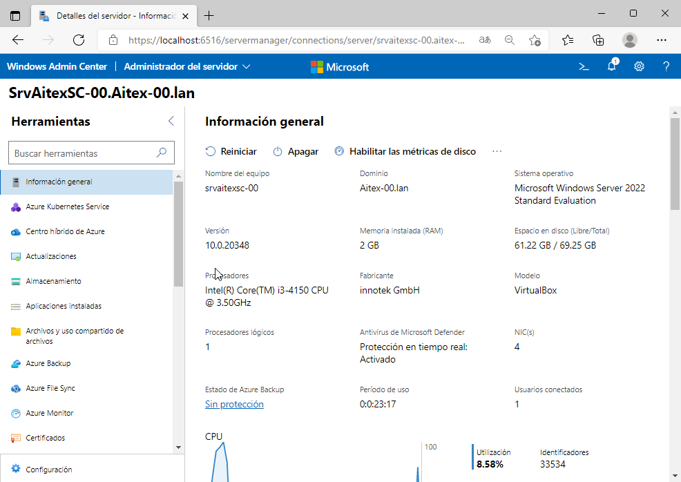

# Instalar roles y características
- [Instalar roles y características](#instalar-roles-y-características)
  - [Introducción](#introducción)
    - [Powershell](#powershell)
  - [Servicio de enrutamiento](#servicio-de-enrutamiento)
    - [Realizar el enrutamiento desde la terminal](#realizar-el-enrutamiento-desde-la-terminal)
  - [Instalación del dominio](#instalación-del-dominio)
    - [Instalar el dominio desde la terminal](#instalar-el-dominio-desde-la-terminal)
    - [Degradar un controlador de dominio](#degradar-un-controlador-de-dominio)
    - [Añadir un cliente al dominio](#añadir-un-cliente-al-dominio)
      - [La hora en cliente y servidor](#la-hora-en-cliente-y-servidor)
  - [Otros roles](#otros-roles)
  - [RSAT](#rsat)
  - [Windows Admin Center (WAC)](#windows-admin-center-wac)

## Introducción
Hemos comentado que los roles son los diferentes servicios que podemos instalar en el servidor.

Después de instalar Windows Server el sistema operativo funciona como cualquier otro Windows hasta que instalamos los componentes que le permitan funcionar como un servidor. A estos componentes Microsoft los denomina "roles".

Para agregar un rol al servidor se hace desde el **Administrador del servidor** en el `menú Administrar-> Agregar Roles y características`. 


Algunos de ellos son:
- **Acceso remoto**: servicios que ofrecen la capacidad de conectar diferentes segmentos de red y las herramientas para administrar el acceso a la red. Incluye varios servicios como el servicio de enrutamiento, VPN o el servicio de acceso remoto.
- **Servicios de archivos y almacenamiento**: proporcionan administración de almacenamiento, replicación de archivos, acceso de los clientes a los archivos, etc
- **Servicios de dominio de Active Directory (AD)**: administra la información sobre usuarios, equipos y el resto de dispositivos y recursos. Permite a los administradores gestionar todos los elementos del dominio.
- **Servicios de impresión y documentos**: permite administrar impresoras y servidores de impresión.
- **Servidor DHCP**
- **Servidor DNS**
- **Servidor web (IIS)**: integra el servidor web IIS (Internet Information Server) y ASP.NET

El más importante es el servicio de dominio, que veremos en el siguiente apartado. Antes vamos a ver cómo se instalaría cualquier rol y en concreto instalaremos y configuraremos el servicio de enrutamiento para que los clientes de nuestra red interna tengan salida al exterior (y a Internet) a través de este servidor.

Puedes ver [este vídeo](./media/rolSrvImpresion.ogv) de cómo instalar un rol, en concreto el _Servicio de Impresión_.

### Powershell
El comando para instalar un rol es `Install-WindowsFeature`. A diferencia del entorno gráfico este comando no incluirá las herramientas de administración de ese rol a menos que incluyamos el parámetro `IncludeManagementTools`. El comando

```powershell
Install-WindowsFeature -Name <feature_name> -computerName <computer_name> -IncludeManagementTools -Restart
```

instala el rol identificado por _<feature_name>_ en el equipo _<computer_name>_ (si no se pone este parámetro se instala en la máquina en que se ejecuta el comando) incluyendo sus herramientas de administración y, si es necesario, reinicia el equipo tras finalizar la instalación.

Podemos obtener la lista de roles que podemos instalar en este equipo con el comando `Get-WindowsFeature`. Si queremos la lista para otro equipo pondremos `Get-WindowsFeature -computerName <computer_name>`.

Y para desinstalar un rol ejecutaremos `Uninstall-WindowsFeature -Name <feature_name> -computerName <computer_name> -Restart -IncludeManagementTools`.

## Servicio de enrutamiento
Deberemos instalar esta función si nuestro servidor va a permitir a los clientes de al red salir al exterior (para ello necesitará tener 2 tarjetas de red). Con las dos tarjetas configuradas tenemos 2 redes diferentes: una externa que nos comunica con el exterior y una interna que nos comunica con nuestros clientes. Pero ahora mismo las 2 redes no están comunicadas entre sí y un cliente de la red interna sólo puede llegar hasta el servidor pero no salir al exterior. Para que pueda hacerlo tenemos que enrutar las 2 tarjetas del servidor de forma que todo el tráfico que llega por la tarjeta interna hacia el exterior se enrute a la tarjeta externa que sabe hacia donde se tiene que dirigir.

Este servicio se encuentra dentro del rol de **Acceso remoto**. Una vez instalado el servicio hay que configurarlo.

Para ello pregunta es qué tipo de servicio queremos crear. En nuestro caso sólo queremos conectar las 2 redes haciendo **NAT** para que los clientes puedan acceder a la red externa e Internet.

A continuación hemos de indicar cuál es la tarjeta externa por la cual salir a Internet. Por último nos dice que no hay ningún servidor de DNS ni DHCP instalado pero como los instalaremos más adelante elegimos no configurar ahora esto.

Puedes ver [este vídeo](./media/Enrutamiento.ogv) de cómo instalar y configurar este rol.

Si tenemos más de una red interna las otras tarjetas internas se enrutan desde `Enrutamiento y acceso remoto->nuestro servidor->IPv4->NAT` y se añaden el resto de interfaces internas.


Una vez configurada la red comprobaremos su correcto funcionamiento, con las órdenes `ping` y `tracert`. Ahora ya se debe poder navegar por Internet desde un cliente. El comando que nos muestra la configuración actual de la red es `ipconfig / all`.

### Realizar el enrutamiento desde la terminal
Para hacer _NAT_ entre nuestra red interna y la externa podemos crear una regla con `New-NetNat` sin necesidad de instalar el servicio de enrutamiento. 

Por ejemplo, si queremos hacer _nat_ sobre los paquetes que nos llegan de la red interna 192.168.100.0 escribiremos:
```powershell
New-NetNat -Name "Enruta red 100" -InternalIPInterfaceAddressPrefix 192.168.100.0/24
```

Podemos añadir más de una regla para enrutar diferentes redes internas. Para ver las regals que tenemos creadas ejecutamos `Get-NetNat`.

## Instalación del dominio
Para que nuestro servidor sea un controlador de dominio (DC, Domain Controller) debemos instalar el rol de **Servicio de dominio de Active Directory**.

Como cualquier otro rol en primer lugar se instala y luego se configura. Podemos abrir el asistente de configuración desde la pantalla que indica el final de la instalación.

Puedes ver [este vídeo](./media/Dominio.ogv) de cómo instalar y configurar este rol.

Vamos a explicar las diferentes opciones que hemos escogido durante la configuración del dominio:
- en primer lugar hemos de seleccionar _Agregar un nuevo bosque_ ya que no hay ningún dominio en nuestra red al que vayamos a unirnos. El nombre del nuevo dominio raíz debería tener más de 1 nivel (por ejemplo _midominio.lan_ con 2 niveles). EN caso de tener ya un dominio en el bosque elegiremos entre crear un nuevo dominio en ese árbol o crear un árbol nuevo
- el nivel funcional del bosque y del dominio lo establecemos al máximo posible, Windows Server 2016. Así podemos aprovechar todas sus características. Si en este dominio tuviéramos un DC con una versión inferior deberíamos escoger dicha versión para que sean compatibles
- además se va a instalar el **servicio DNS** porque no hay ningún servidor DNS en el dominio así que esta máquina hará también de servidor DNS. Aparece un mensaje diciendo que si ya tenemos un DNS debemos agregar manualmente la zona para el dominio que estamos creando, pero si no hay ningún DNS no hay que nacer nada porque automáticamente se instalará uno con la zona para este dominio y con un _reenviador_ (a quien enviar otras peticiones) que será el DNS de la tarjeta externa de la máquina en este momento. Además en la configuración de dicha tarjeta se cambiará ese DNS por 127.0.0.1
- en cuanto a la ubicación de los diferentes componentes del dominio, si tenemos varios discos sería conveniente que estén en discos distintos por cuestión de rendimiento. Podéis obtener más información en la web de Microsoft. En nuestro caso lo dejaremos todo en C:

Tras configurar el dominio se reiniciará el servidor que, cuando vuelva a arrancar, ya será un DC.

### Instalar el dominio desde la terminal
Deberemos instalar el rol **AD-Domain-Services** y posteriormente configurarlo con `Install-ADDSForest`:
```powershell
Install-WindowsFeature AD-Domain-Services
Install-ADDSForest
```

Powershell pedirá el nombre del nevo dominio y la contraseña del administrador. También podemos poner todos los parámetros para que no pida nada (adecuado si queremos ponerlo en un script). El comando para crear el dominio ACME.LAN sería:
```powershell
$dominioFQDN = "ACME.LAN"
$dominioNETBIOS = "ACME"
$adminPass = "Batoi@1234."
Install-WindowsFeature AD-Domain-Services,DNS
Import-module addsdeployment
Install-ADDSForest `
    -DomainName $dominioFQDN `
    -DomainNetBiosName $dominioNETBIOS `
    -SafeModeAdministratorPassword (ConvertTo-SecureString -string $adminPass -AsPlainText -Force) `
    -DomainMode WinThreshold `
    -ForestMode WinThreshold `
    -InstallDNS -Confirm:$false `
```

Por defecto no están instalados los comandos Powershell para gestionar _Active Directory_. Para instalarlos debemos ejecutar:
```powershell
Install-WindowsFeature -Name "RSAT-AD-PowerShell" -IncludeAllSubFeature
```

### Degradar un controlador de dominio
Si tenemos que eliminar un controlador de dominio y dejarlo como servidor miembro o independiente se hace desinstalando el rol de **Servicios de dominio de Active Directory**.

En la ventana de 'quitar las características' requeridas marcaremos debajo la casilla de 'Quitar herramientas de administración'. Posteriormente aparece una ventana informándonos que se debe 'Disminuir el nivel de este DC'. Pulsamos en ella y al final aparecerá una pantalla indicándonos todos los roles que hospeda este DC. Tras marcar la casilla 'COntinuar con la eliminación' se procederá a la misma.

Si estamos degradando el último controlador del dominio se eliminará el mismo, perdiéndose toda la información que contenía. El servidor pasará a ser un servidor independiente. Si por el contrario aún quedan otros controladores de dominio la única cosa que estamos haciendo es que este servidor pasará a ser un servidor miembro del dominio sin funciones de controlador (que las harán el resto de controladores que aún queden en el dominio).

Para eliminar un controlador de dominio desde Powershell ejecutaremos `Uninstall-ADDSDomainController`.

### Añadir un cliente al dominio
En primer lugar hemos de asegurar la correcta conectividad de cliente y servidor, es decir:
- que sus IPs pertenezcan a la misma red
- que físicamente sus cables de red estén conectados al mismo switch (o a switches conectados entre sí)
- que el cliente puede resolver correctamente el nombre del dominio (para ello como DNS del cliente deberemos poner la IP del servidor que hará de servidor DNS en el dominio)

Una vez hecho esto (podemos comprobarlo desde la terminal con `ping` y `nslookup`) ya podemos añadir el cliente al dominio. Puedes ver [este vídeo](./media/Cliente.ogv) de cómo añadir un cliente al dominio.

#### La hora en cliente y servidor
Por defecto el servidor tolera una diferencia horaria con los clientes de 5 minutos. Eso significa que si la hora del cliente difiere en más de 5 minutos de la del servidor no le permitirá iniciar sesión en el dominio.

Esto no suele ser un problema pero como trabajamos con máquinas virtuales y en ocasiones las dejamos guardadas hay veces que la hora se desconfigura. Para sincronizarla podemos ejecutar el comando:
```cmd
w32tm /resync
```

Si lo ejecutamos en un cliente añadido al dominio y nos da problemas podemos ejecutar `w32tm /domain` para que sincronice la hora con el DC del dominio.

## Otros roles
Tenemos infinidad de servicios que podemos instalar en nuestro servidor. Algunos ejemplos son:
- Servidor de actualizaciones (_Windows Server Update Services_): permite que los equipos de nuestra organización se instalen las actualizaciones desde este servidor para no tener que descargarlas cada uno de ellos. Tutoriales de ejemplo:
  - [Windows Server Update Services](https://docs.microsoft.com/es-es/windows-server/administration/windows-server-update-services/get-started/windows-server-update-services-wsus)
  - [Cómo instalar y configurar Windows Server Update Services (WSUS)](https://thesolving.com/es/sala-de-servidores/como-instalar-y-configurar-windows-server-update-services-wsus/)
- Servidor de imágenes de Windows (_Windows Deployment Server_): permite desplegar Windows en la red para realizar la instalación de nuevos equipos desde el servidor. Tutoriales de ejemplo:
  - [Servicios de implementación de Windows](https://docs.microsoft.com/es-es/windows/win32/wds/windows-deployment-services-portal)
  - [Cómo configurar y utilizar los Servicios de implementación de Windows (WDS)](https://thesolving.com/es/sala-de-servidores/como-configurar-y-utilizar-windows-deployment-services-wds/)
- Servidor de aplicaciones: permite que el servidor proporcione programas instalados en él a los equipos clientes (se ejecutan en el servidor). Tutorial de ejemplo:
  - [RAGASYS SISTEMAS: Remote Desktop Services – Instalación de los Servicios de Escritorio Remoto](https://blog.ragasys.es/remote-desktop-services-instalacion-de-los-servicios-de-escritorio-remoto)
  - [Microsoft: Implementación del entorno de Escritorio remoto](https://docs.microsoft.com/es-es/windows-server/remote/remote-desktop-services/rds-deploy-infrastructure)
  - [Instalar rol Escritorio Remoto en Windows Server 2022](https://proyectoa.com/instalar-rol-escritorio-remoto-en-windows-server-2022/)
- Característica de copias de seguridad (_Windows Server Backups_): es una herramienta para hacer backups del sistema, aunque no es la más completa para hacer backups de los datos. Tutoriales de ejemplo:
  - [Windows Server Backup: Installation, Features and Limitations](https://www.vembu.com/blog/windows-server-backup-installation-features-limitations/)
  - [Windows Server Backup: How to Install and Use It](https://www.minitool.com/backup-tips/windows-server-backup.html)

## RSAT
Las herramientas de administración remota del servidor (RSAT, Remote Server Administration Tools) es un software gratuito que Microsoft pone a disposición de los usuarios para poder administrar un servidor desde cualquier cliente Windows. Esto nos permite, por ejemplo, instalar el servidor sin entorno gráfico (que es lo que recomienda Microsoft) y administrarlo desde un equipo cliente que sí lo tiene.

En versiones de Windows 10 posteriores a la 1809 podemos activarlas desde `Configuración -> Aplicaciones y características -> Características opcionales -> Agregar una característica`:


NOTA: para saber qué versión es nuestro sistema desde la terminal ejecutamos el comando `winver`.

Marcaremos las que necesitemos, al menos:
- **RSAT: Administrador del servidor**: proporciona la herramienta de _Administrador del servidor_
- **RSAT: Herramientas de Active Directory Domain Services y Ligthweigth Directory Services**: proporciona muchas de las herramientas del dominio como _Usuarios y Equipos de Active Directory_
- **RSAT: Herramientas de Administración de directivas de grupo**: para crear y gestionar las directivas

Hay otras que nos pueden ser de utilidad como:
- **RSAT: Herramientas de servidor DNS**: para gestionar el servidor DNS instalado
- **RSAT: Herramientas de servidor DHCP**: si instalamos el rol de _Servidor DHCP_
- **RSAT: Herramientas de servicios de archivo**: si instalamos el rol de _Administrador de recursos del servidor de archivo_
- y muchas otras

**NOTA**: para poder instalar estas características el equipo debe tener acceso a Internet y activo el servicio _Windows Update_.

Ahora abrimos el **_Administrador del servidor_** y añadimos nuestro servidor (desde `Administrar -> Agregar servidores`). Allí pinchamos en _'Buscar ahora'_, no es necesario escribir su nombre ni su dirección:


En el menú _'Herramientas'_ ya tenemos las herramientas para gestionar nuestro dominio.

En versiones de Windows 10 anteriores a la 1809 se instala una actualización que hay que descargar de la página de Microsoft. 

Puedes ampliar la información sobre RSAT en la [web de Microsoft](https://docs.microsoft.com/es-es/troubleshoot/windows-server/system-management-components/remote-server-administration-tools).

También podemos instalar RSAT desde la consola con el comando:

```powershell
dism /online /add-capability /CapabilityName:Rsat.GroupPolicy.Management.Tools~~~~0.0.1.0 /CapabilityName:Rsat.Dns.Tools~~~~0.0.1.0 /CapabilityName:Rsat.ActiveDirectory.DS-LDS.Tools~~~~0.0.1.0
```

## Windows Admin Center (WAC)
El _Centro de Administración de Windows_ es una herramienta para administrar cualquier sistema Windows y que se ejecuta desde un navegador web. Cada vez que iniciamos el _Administrador del servidor_ nos aparece un mensaje animándonos a usar esta herramienta.

Se trata de una solución basada en navegador cuyo objetivo es unificar todas las herramientas necesarias para administrar un equipo así como mejorar la seguridad en la administración remota.

Para poder utilizarlo primero se tiene que instalar en la máquina desde la que vamos a administrar los servidores. Tenemos las instrucciones en la [documentación de Microsoft](https://docs.microsoft.com/es-es/windows-server/manage/windows-admin-center/deploy/install).

Por defecto utiliza el puerto 6516 pero podemos elegir cualquier otro. Al abrirlo por primera vez nos pregunta qué certificado usar: seleccionaremos _Windows Admin Cliente_. A continuación tenemos que **Agregar** los servidores que queramos administrar.

Al entrar a una máquina podemos ver información de la misma, parecido a como lo muestra el _Administrador del servidor_:



En la parte izquierda tenemos el menú. Algunas opciones importantes son:
- **Almacenamiento**: muestra los discos y volúmenes del equipo
- **Archivos y uso compartido**: tenemos un explorador de archivos y una pestaña para ver, crear y configurar recursos compartidos
- **Dispositivos**: similar al '_Administrador de dispositivos_
- **Eventos**: muestra la información del _Visor de eventos_
- **Roles y características**: para instalar o desinstalar roles en el equipo
- **Firewall**, **Powershell**, **Redes**, **Servicios**, **Tareas programadas**, ...

Podemos configurar más coses instalando extensiones como **Active directory** (para gestionar un dominio AD), **DHCP**, **DNS**, ...

Se hace desde `Configuración -> Extensiones`. Algunas necesitan también instalar alguna herramienta de RSAT pero nos lo dice al abrirla y se instala desde allí.

Podéis ampliar la información en:
- [Microsoft Windows Admin Center](https://docs.microsoft.com/es-es/windows-server/manage/windows-admin-center/overview)
- [Managing Windows Server - with Windows Admin Center (PDF)](https://www.thomas-krenn.com/redx/tools/mb_download.php/mid.y8757d34c910d1ce3/ebook_WindowsServer_AdminCenter_16_19_engl_verlinkt.pdf)
