# Objetos del dominio
- [Objetos del dominio](#objetos-del-dominio)
  - [Introducción](#introducción)
    - [Elementos de Active Directory](#elementos-de-active-directory)
    - [Nombres de los objetos de AD](#nombres-de-los-objetos-de-ad)
    - [Usuarios y equipos de Active Directory](#usuarios-y-equipos-de-active-directory)
  - [Usuarios](#usuarios)
    - [Creación de una cuenta de usuario del dominio](#creación-de-una-cuenta-de-usuario-del-dominio)
    - [Modificar una cuenta de usuario](#modificar-una-cuenta-de-usuario)
    - [Otras operaciones comunes](#otras-operaciones-comunes)
  - [Grupos](#grupos)
    - [Organización de los grupos](#organización-de-los-grupos)
    - [Creación de cuentas de grupo](#creación-de-cuentas-de-grupo)
    - [Modificar un grupo](#modificar-un-grupo)
    - [Añadir miembros a un grupo](#añadir-miembros-a-un-grupo)
    - [Otras operaciones con grupos](#otras-operaciones-con-grupos)
    - [Usuarios y grupos predeterminados e integrados](#usuarios-y-grupos-predeterminados-e-integrados)
  - [Equipos](#equipos)
    - [Crear una cuenta de equipo](#crear-una-cuenta-de-equipo)
    - [Modificar una cuenta de equipo](#modificar-una-cuenta-de-equipo)
    - [Otras operaciones](#otras-operaciones)
  - [Unidades Organizativas](#unidades-organizativas)
    - [Operaciones comunes](#operaciones-comunes)
    - [Delegar la administración de una OU](#delegar-la-administración-de-una-ou)
  - [Sitios (_Sites_)](#sitios-sites)
  - [Buscar objetos](#buscar-objetos)
    - [Buscar desde el cliente](#buscar-desde-el-cliente)
  - [Gestionar objetos desde la línea de comandos](#gestionar-objetos-desde-la-línea-de-comandos)

## Introducción
_Active Directory_, tal como hemos visto, es en realidad una base de datos jerárquica de objetos, que representan las entidades que pueden administrarse en una red de ordenadores, en nuestro caso en un dominio de Windows Server. Esta base de datos centralizada de objetos de administración puede ser consultada por todos los ordenadores miembros del dominio y modificada por todos los controladores del dominio.

La gestión de un dominio supone crear y configurar adecuadamente los objetos del directorio que representan a las entidades o recursos que existen en la red (usuarios, grupos, equipos, etc.) y las relaciones entre ellos (qué miembros tiene cada grupo, qué grupos tienen acceso a cada recurso, etc).

### Elementos de Active Directory
La forma en que se organizan los objetos del directorio es:
- **Dominio**: es la estructura fundamental que engloba todos los demás objetos de la red
- **Sitio**: es una ubicación geográfica. Cada dominio puede tener un único sitio o varios (por ejemplo uno para cada delegación o sede de nuestra empresa)
- **Unidad organizativa (OU)**: es un elemento que creamos para agrupar lógicamente diversos objetos (por ejemplo podemos hacer una OU por cada departamento de la empresa donde incluir los usuarios, equipos, impresoras, ... de ese departamento). Son como las carpetas que nos permiten agrupar los archivos de un disco
- **Grupo**: es también una agrupación de objetos pero del mismo tipo. Lo más habitual es hacer grupos de usuarios para luego asignar los permisos a los grupos en vez de a usuarios individuales, pero también podemos hacer grupos de equipos
- **Objeto**: cada objeto representa un elemento de la red (equipo, usuario, carpeta compartida, impresora, ...)

### Nombres de los objetos de AD
Cualquier objeto en el AD (un usuario, un equipo, un grupo o una unidad organizativa) se identifica por su nombre. El nombre de un objeto se puede indicar de 3 formas distintas: por su nombre canónico, por su nombre distinguido (DN) o por su nombre distinguido relativo (RDN).

Por ejemplo si creamos una cuenta de usuario llamado jsegura dentro de una OU llamada asix que está dentro de la OU informática dentro del dominio acme.lan se nombraría como:
- _Nombre canónico_: identifica al objeto globalmente ya que incluye la ruta para llegar al mismo además de su nombre: **acme.lan/informatica/asix/jsegura**. Es similar a la ruta absoluta de un fichero
- _DN (Distinguished Name)_: es el más utilizado. Es como el anterior pero va desde el objeto al dominio (al revés que el nombre canónico) e incluye para cada elemento una abreviatura de 2 letras que indica el tipo de objeto que es. Sería: **CN=jsegura,OU=asix,OU=informatica,DC=acme,DC=lan** (los tipos son _CN=Common Name, OU=Organizational Unit, DC=Domain Component_). Es la forma que usaremos habitualmente para identificar cualquier objeto.
- _RDN (Relative Distinguished Name)_: es sólo el nombre del objeto, sin su ruta: **CN=jsegura**

Por su parte la OU asix del ejemplo anterior podemos denominarla como:
- RDN: **OU=asix**
- DN: **OU=asix,OU=informatica,DC=acme,DC=lan**
- Nombre canónico: **acme.lan/informatica/asix**

Además de su nombre cada objeto tiene unos atributos que lo describen y que varían en función del tipo de objeto de que se trate. Por ejemplo algunos de los atributos de un objeto de tipo usuario son nombre, apellidos, cuenta de e-mail, etc. Algunos de los atributos de un grupo son nombre, tipo o miembros.

### Usuarios y equipos de Active Directory
El AD dispone de herramientas para la gestión de los objetos y sus diferentes atributos y esta es la que más utilizaremos.

Como el resto de herramientas se accede a ella desde el `Administrador del servidor -> desplegable Herramientas (en la parte superior derecha)` o desde el botón `Inicio->Herramientas administrativas`.

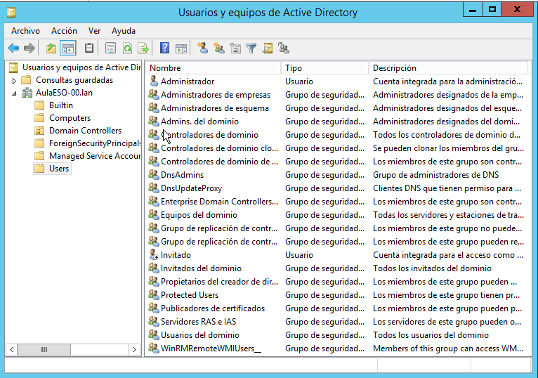

Aquí vemos nuestro dominio y dentro varias _Unidades organizativas_ (OU, también llamadas Departamentos) que se han creado automáticamente, entre las que destacan:
- _Builtin_: son usuarios y grupos integrados creados automáticamente al crear el domino. Más adelante veremos quiénes son y para qué se utilizan
- _Computers_: aquí tenemos todos los equipos cliente añadidos al dominio
- _Domain Controllers_: aquí están las cuentas de todos los equipos controladores del dominio. Ahora tenemos únicamente la de nuestro servidor
- _Users_: aquí es donde se crean por defecto los usuarios y los grupos, aunque es más práctico crear nuestras propias OU para crear en ellas nuestros usuarios (para que quede mejor organizado). Ya hay muchos usuarios y grupos predeterminados que se han creado al instalar el dominio.

En la barra de herramientas tenemos iconos para crear un nuevo usuario, un nuevo grupo o un nuevo departamento (OU) así como para buscar objetos, filtrarlos, etc.

## Usuarios
Para cada persona que utiliza el ordenador se tiene que crear una cuenta de usuario que sirve para:
- identificar y autentificar a esa persona para acceder al sistema
- gestionar los permisos y derechos que tendrá esa persona sobre los recursos del sistema

Cuando creamos un usuario en un equipo con Windows que no sea DC (como hacíamos en un Windows cliente) lo que creamos es una cuenta local de usuario, es decir, una cuenta con la que el usuario puede iniciar sesión en el equipo en el cual creamos la cuenta.

Si ese usuario necesite iniciar sesión en otros ordenadores de la red tendríamos que crearle una cuenta de usuario en cada uno.

La alternativa es crearle una cuenta de **usuario de dominio** que es una cuenta que se crea dentro de AD y le permite al usuario iniciar sesión desde cualquier equipo del dominio (no es que se cree una cuenta para ese usuario en cada ordenador miembro sino que existe una única cuenta visible en todos los ordenadores del dominio).

Estas cuentas se crean desde la herramienta _Usuarios y equipos de Active Directory_ y sus datos se almacenan en el Directorio Activo por lo que son conocidos por todos los ordenadores del dominio. Cuando una persona se conecta a cualquier ordenador utilizando su cuenta de dominio, el ordenador en cuestión realiza una consulta al AD para que se validen las credenciales del usuario.

Los ordenadores miembros de un dominio que no sean DC, además de reconocer a los usuarios del dominio, pueden tener también sus propios usuarios locales. En este caso, estos usuarios son únicamente visibles en el ordenador en el cual han sido creados. Cuando una persona desea entrar en el sistema utilizando una cuenta local, esta cuenta se valida contra la base de datos local de ese ordenador.

A una cuenta de usuario local no se le pueden asignar permisos sobre recursos del dominio, sólo sobre recursos locales del equipo en que se crea. A un usuario del dominio se le pueden conceder permisos sobre cualquier recurso (archivo, directorio, impresora, etc.) de cualquier ordenador miembro del dominio.

Vamos a ver las operaciones más comunes que podemos hacer con usuarios.

### Creación de una cuenta de usuario del dominio
Se hace como la mayoría de operaciones de gestión de los objetos desde la herramienta **Usuarios y equipos de Active Directory**.

Vamos al contenedor donde queremos crear el nuevo usuario (por defecto la OU Users aunque sería mejor crear nuestras propias OU) y pinchamos en el icono de _'Nuevo usuario'_ o desde su menú contextual elegimos `Nuevo -> Usuario`.

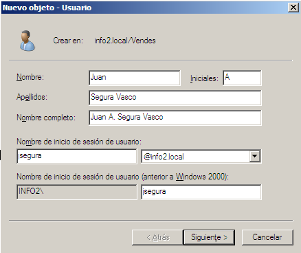

Ponemos el nombre, iniciales y apellidos del nuevo usuario. En _'Nombre de inicio de sesión'_ pondremos su login (sin espacios) y elegimos en qué dominio se crea el usuario.

En la siguiente pantalla tenemos que poner una contraseña para el nuevo usuario. La contraseña tendrá que cumplir los requisitos de complejidad exigidos en el sistema.

Además podemos elegir opciones importantes de su contraseña cómo:
- El usuario tiene que cambiar la contraseña: la primera vez que inicio sesión se lo pedirá que pongo una nueva contraseña
- El usuario no puede cambiar la contraseña
- La contraseña nunca caduca: por defecto el sistema obliga a los usuarios a cambiar la contraseña cada cierto tiempo. Si marcamos esta opción este usuario no tiene que cambiarla nunca
- La cuenta está deshabilitada: el usuario continúa existiendo pero no se puede utilizar su cuenta (no podrá iniciar sesión) hasta que se vuelvo a habilitar.

A continuación el asistente nos muestra las opciones elegidas y al pulsar Finalizar lo crea el nuevo usuario.

### Modificar una cuenta de usuario
Se hace haciendo doble clic sobre la cuenta o desde su menú contextual seleccionando _'Propiedades'_. Tenemos varias pestañas:
- **General**: con información del usuario (nombre, teléfono, e-mail, etc)
- Dirección: domicilio del usuario
- **Cuenta**:
  - Nombre de inicio de sesión: el que tiene que escribir para iniciar sesión
  - Nombre de inicio (anterior a Windows 2000): nombre para iniciar sesión en ordenadores con Windows NT, 98 o anteriores
  - Horas de inicio de sesión: a qué horas puede iniciar sesión (por defecto a todas)
  - Iniciar sesión en: desde qué equipos del domine miedo iniciar sesión (por defecto desde cualquier equipo del dominio)
  - Desbloquear cuenta: si el usuario ha hecho demasiados intentos fallidos de inicio de sesión (no poniendo correctamente la contraseña) su cuenta se bloquea. Desmarcando esta opción lo desbloqueamos
  - Opciones de cuenta: diferentes opciones, la mayoría relacionadas con la contraseña. Desde aquí tenemos también la opción de deshabilitar una cuenta.
  - La cuenta caduca: para establecer una caducidad a la cuenta
- **Perfil**: estas opciones las veremos en el siguiente punto
- Teléfonos
- Organización. información de la empresa. También podemos indicar qué usuario administra esta cuenta y qué cuentas administra este usuario
- **Miembro de**: los grupos a que pertenece el usuario
El resto de opciones están relacionadas con el acceso telefónico a redes y los servicios de Terminal Server y no las veremos.

### Otras operaciones comunes

**Modificar la contraseña de un usuario**
Desde su menú contextual elegimos Restablecer contraseña e introducimos la nueva contraseña del usuario. Deberíamos marcar la opción de "El usuario tiene que cambiar la contraseña" para obligarlo a que la cambie la próxima vez que inicie sesión.

**Copiar una cuenta de usuario**
Cuando queremos crear un usuario muy parecido a otro existente es más rápido copiar el usuario y modificar lo que cambia en el nuevo usuario. Para hacerlo desde el menú contextual de la cuenta elegimos Copiar.

Lo que haremos normalmente para gestionar nuestros usuarios es crear “plantillas” que son cuentas de usuario ficticias. Su nombre puede ser algo identificativo como plantilla_tipo_usuario. Una vez creada la configuramos añadiéndola a los grupos a los que tenga que pertenecer, estableciendo las horas y los equipos de inicio de sesión, su política de contraseñas, etc. Tendremos tantas plantillas como tipos de usuario a crear. Cuando necesitamos crear un usuario de un tipo seleccionamos su plantilla y "copiamos" la cuenta como hemos visto antes. El conveniente que las cuentas que usamos como plantilla estén deshabilitadas.

**Mover una cuenta de usuario**
Como hemos dicho antes dentro del dominio crearemos Unidades Organizativas (OU) que son contenedores dentro de los cuales están los objetos. Esto permite tener los objetos mejor organizados (es como crear carpetas para organizar los ficheros cuando tenemos muchos).

Para mover una cuenta de usuario a otro contenedor (dentro del mismo dominio) desde su menú contextual seleccionamos Mover y en la siguiente pantalla elegimos a qué contenedor (normalmente una OU) lo queremos mover.

**Eliminar una cuenta de usuario**
Se hace desde su menú contextual con la opción Eliminar.

Cada cuenta de usuario tiene un identificador de seguridad (SID) único. Si eliminamos la cuenta y después volvemos a crearla exactamente igual, el identificador SID será diferente y NO se podrán recuperar los permisos y privilegios de la cuenta eliminada.

Para evitar estos problemas lo normal es que, si existe la pòsibilidad de necesitar la cuanta más adelante, en lugar de eliminarla la deshabilitaremos. Así impedimos que se pueda utilizar pero cuando se necesite de nuevo sólo hay que volverla a habilitar. Se puede hacer desde el menú contextual de la cuenta.

**Realizar operaciones con muchas cuentas**
A veces tenemos que hacer algo con varios de las cuentas de usuario que tenemos creadas. Para lo cual las seleccionamos todas (manteniendo pulsada la tecla Ctrl o con la tecla Mysc) y desde el menú contextual seleccionamos _'Todas las tareas'_ y elegimos:
- Añadir a un grupo: para añadir todos los usuarios seleccionados a los grupos que indicaremos
- Deshabilitar cuenta
- Habilitar cuenta
- Mover: mueve las cuentas al contenedor que indicamos a continuación
- Abrir página principal: se abrirá la web de cada usuario
- Enviar correo: se envía un email a los usuarios

## Grupos
Al igual que hay usuarios del dominio, existen grupos que se almacenan en el AD y son visibles desde todos los ordenadores del dominio. Los grupos simplifican la administración del sistema.

En el directorio pueden crearse dos tipos de grupos: **grupos de distribución** y **grupos de seguridad**. Los primeros son simplemente una lista de usuarios para comunicarse (por ejemplo por correo electrónico), mientras que los segundos son los que se utilizan con finalidades administrativas. A partir de ahora nos referiremos exclusivamente a los grupos de seguridad.

En dominios Windows Server se definen tres tipos de grupos de seguridad o ámbitos:
- **Grupos locales del dominio**. Se crean dentro de un dominio y sólo son visibles dentro del mismo. Se utilizan para asignar permisos y derechos sobre recursos de ese dominio. Sus miembros son usuarios de ese u otros dominios y puede incluir también grupos globales de cualquier dominio del bosque o grupos locales del mismo dominio. Normalmente crearemos grupos de este tipo.
- **Grupos globales**. Son visibles en cualquier dominio y permiten asignar permisos y derechos sobre recursos de cualquier dominio. Sus miembros tienen que pertenecer al dominio en que se crea el grupo y suelen utilizarse para clasificar a los usuarios en función de las labores que realizan. Normalmente los utilizamos para agrupar usuarios similares.
- **Grupos universales**. Son visibles en todo el bosque. Sus miembros son usuarios de cualquier dominio y permiten asignar permisos y derechos sobre recursos de cualquier dominio. La utilización de grupos universales tiene sentido sólo cuando un mismo conjunto de usuarios (y/o grupos) de varios dominios tienen que recibir permisos/derechos en varios dominios simultáneamente. Por razones de eficiencia tenemos que limitar al máximo el uso de este tipo de grupos.

En un ordenador miembro de un dominio también se pueden definir grupos locales. Los grupos locales pueden estar formados por cuentas de usuario locales y por usuarios y grupos globales de cualquier dominio del bosque, además de por grupos universales. Un grupo local no puede ser miembro de otro grupo local. Los grupos locales pueden utilizarse para conceder permisos y derechos en el equipo en que son creados.

Por lo tanto, la administración de la protección en cada ordenador del dominio puede realizarse mediante grupos locales del dominio o grupos locales del equipo en que reside el recurso a administrar.

En relación con esto, es importante saber que cuando un ordenador pasa a ser miembro de un dominio, el grupo global _Administradores del dominio_ se incluye automáticamente en el grupo local _Administradores_ de este ordenador. De igual forma, el grupo global _Usuarios del dominio_ se incluye dentro del grupo local _Usuarios_. De esta forma, los administradores y usuarios del dominio tienen en cada equipo miembro los mismos derechos y permisos que los que tengan ya definidos los administradores y usuarios locales.

### Organización de los grupos
La manera de organizar los usuarios y grupos que recomienda Windows en un entorno con varios dominios es la llamada **A G DL P** (Accounts -cuentas de usuario-, Global, Domain Local, Permissions):
- **Añadir los usuarios a grupos globales**, según las labores que ejerzan en la organización.
- **Incluir los grupos globales en grupos de dominio local** según el nivel de acceso que tengan que tener.
- **Asignar permisos y derechos únicamente a estos grupos de dominio local**.

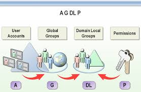

Los pasos a seguir son:
- En primer lugar tenemos que identificar los tipos de usuarios que tendremos (por ejemplo, todos los empleados del departamento de informática)
- A continuación se crea un grupo global para agrupar esos usuarios similares (ej. _ggInformáticos_)
- Determinar si para lo que queremos hacer (por ejemplo permitir a los informáticos imprimir en una impresora de red) podemos utilizar uno de los grupos integrados (como _Usuarios del dominio_ o _Administradores_) o tenemos que crear un nuevo grupo de dominio local. En este caso crearemos un nuevo grupo de dominio local llamado _gdlUsuarios de impresora_
- A continuación tenemos que identificar todos los grupos de usuarios con las esas necesidades (imprimir en la impresora de red) y añadirlos al grupo local creado anteriormente (añadiremos el grupo _ggInformáticos_ al _gdlUsuarios de impresora_)
- En el recurso Impresora concederemos los permisos necesarios para que puedan imprimir los miembros del grupo _gdlUsuarios de impresora_

Dentro de un grupo podemos incluir otros grupos, pero:
- dentro de un grupo global sólo podemos incluir grupos globales del mismo dominio y no podemos incluir grupos locales del dominio
- dentro de un grupo local de dominio podemos incluir grupos globales de cualquier dominio y grupos locales del mismo dominio

El anidamiento de grupos (incluir un grupo como miembro de otro) mejora la administración del dominio pero si tiene muchos niveles de anidamiento se hace difícil establecer los permisos reales de los usuarios. Lo ideal es utilizar un único nivel de anidamiento: un grupo puede estar dentro de otro grupo pero este no estará dentro de ningún grupo más.

### Creación de cuentas de grupo
Podemos crear grupos dentro de cualquier contenedor. Por defecto se crean dentro de Users pero lo correcto es crearlos en nuestras propias OU.

Para crear un nuevo grupo, desde el icono de _'Nuevo grupo'_ en el menú contextual del contenedor seleccionamos _Nuevo -> Grupo_.

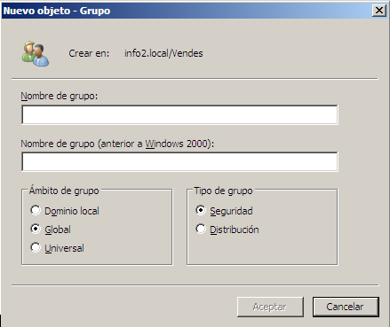

Tenemos que escribir el nombre del nuevo grupo, su ámbito y el tipo de grupo.

### Modificar un grupo
Se hace desde su menú contextual seleccionando _'Propiedades'_. Podemos modificar el nombre y tipo de grupo así como incluir miembros en el grupo (pestaña _Miembros_) o incluir el grupo dentro de otros grupos (pestaña _Miembro de_).

En la pestaña _Administrado por_ podemos indicar un nombre de usuario que será el administrador de este grupo. Ese usuario podrá añadir y quitar miembros del grupo.

### Añadir miembros a un grupo
Dentro de un grupo podemos tener cualquiera otro objeto: usuarios, equipos y otros grupos (respetando las restricciones vistas anteriormente). Para añadir un objeto a un grupo podemos hacerlo de dos formas diferentes:
- Desde las propiedades del grupo, en la pestaña Miembros añadimos los objetos que queremos
- Desde el menú contextual del objeto a añadir seleccionamos la opción Añadir a un grupo y elegimos el grupo que queremos.

### Otras operaciones con grupos
Igual que con el resto de objetos las operaciones más comunes que hacemos con los grupos son mover un grupo a otro contenedor, eliminar grupo, etc y se hacen del mismo modo.

### Usuarios y grupos predeterminados e integrados
Al instalar el AD se crean dentro de la OU **Users** una serie de usuarios y grupos (Universales, Globales y Locales de dominio) para diferentes tareas. Se llaman **grupos (y usuarios) predeterminados**.

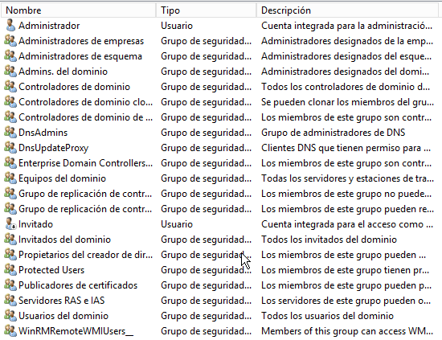

Entre ellos destacamos:
- usuario **Administrador**: es la cuenta del administrador del dominio y tiene control total sobre el dominio. Este usuario es miembro de los grupos Administradores y Administradores del dominio entre otros
- usuario **Invitado**: es una cuenta de usuario que pueden utilizar los usuarios que no tienen cuenta en el dominio, igual al que se crea en el resto de sistemas operativos de Microsoft. Por defecto está deshabilitada
- grupo global **Usuarios del dominio**: incluye todas las cuentas de usuarios creados en el dominio.
- grupo global **Administradores del dominio**: sus miembros pueden administrar el dominio.
- grupo universal **Administradores de empresa**: sus miembros pueden administrar cualquier dominio del bosque.

Además de los grupos creados en la OU _Users_, dentro de la carpeta **Builtin** se crean grupos locales del dominio para realizar tareas específicas. Estos grupos se denominan **grupos integrados**. Entre ellos encontramos:

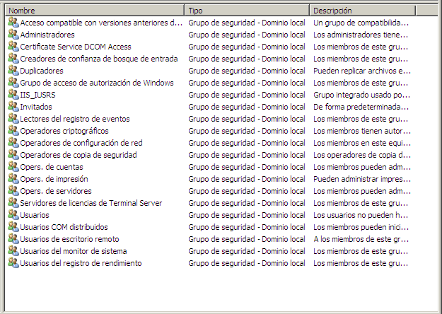

- grupo local **Administradores**: sus miembros pueden administrar el controlador del dominio.
- grupo local **Operadores de copias de seguridad**: sus miembros pueden realizar copias de seguridad o restaurar archivos en el dominio.
- grupo local **Operadores de cuenta**: sus miembros pueden crear, editar y eliminar cuentas de usuario, grupos y equipos.
- grupo local **Operadores de impresión**: sus miembros pueden configurar y administrar las impresoras.
- grupo local **Operadores de servidor**: sus miembros pueden crear carpetas compartidas en el servidor y realizar copias de seguridad o restaurar archivos en el controlador de dominio.
- grupo local **Usuarios**: limita las posibilidades de que un usuario pueda hacer un cambio accidental en el sistema pero permite ejecutar la mayoría de aplicaciones. Contiene al grupo global de Usuarios del dominio. 

Por último, junto a los usuarios y grupos que se crean al instalar el sistema también se crean una serie de **identidades** (a veces se los denomina grupos del sistema) a las cuales podemos asignar permisos. Las más comunes son:
- **Todos**: corresponde a todos los usuarios (incluyendo los no autentificados)
- **Usuarios autentificados**: cualquier usuario que acceda al sistema a través de un proceso de inicio de sesión. Es más seguro utilizar este grupo en vez del grupo Todos.
- **Usuarios de Terminal Server**: todos los usuarios que han iniciado sesión por Terminal Server
- **Propietario (Creator Owner)**: usuario que creó o tiene la propiedad de lo objeto
- **Grupo creador (Creator Group)**: grupo que creó o tiene la propiedad del objeto

Cuando asignamos permisos sobre un objeto podemos hacerlo a usuarios o grupos específicos o a estas identidades.

## Equipos
En el AD además de almacenarse información sobre los usuarios del dominio también se crean cuentas para cada equipo del dominio. Usuarios, grupos y equipos tienen un identificador único (el SID) que es el que utiliza el AD para asignar permisos y derechos.

Las cuentas de equipo representan un equipo de la red desde el cual un usuario del dominio puede iniciar sesión. A una cuenta de equipo se le pueden conceder permisos y derechos igual que a las cuentas de usuario. Hay dos carpetas donde se almacenan por defecto las cuentas de equipo: Domain controllers y Computers. En la primera tendremos las cuentas de los DC (el principales y los secundarios) y en la otra el resto de equipos clientes y servidores miembro. Pero una cuenta de equipo se puede mover a otro contenedor (normalmente Unidades organizativas).

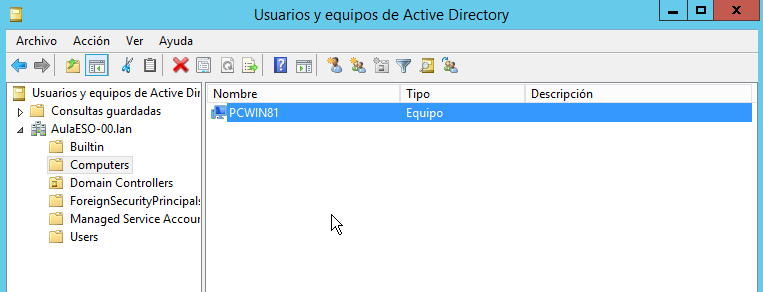

### Crear una cuenta de equipo
No es necesario crear las cuentas de los equipos porque estas se crean automáticamente al añadir un equipo al dominio. Sin embargo si se quiere se puede crear antes la cuenta manualmente desde _Usuarios y equipos de AD_, desde el menú contextual seleccionamos 'Nuevo -> Equipo'.

### Modificar una cuenta de equipo
Se hace desde el menú contextual del equipo a modificar (dentro de Usuarios y equipos de AD) en la opción de _'Propiedades'_. Aquí encontramos información del equipo y podemos modificarla. La información que encontramos es:
- General: nombre del equipo, tipo (si es o no DC), lugar en que se encuentra y descripción
- Sistema operativo: tipo, versión y último service pack instalado
- Miembro de: grupos a los que pertenece el equipo. Por defecto al de Equipos del dominio
- Delegación: si se quiere delegar algún servicio en este equipo
- Ubicación: donde se encuentra el equipo
- Administrado por: usuario o grupo responsable de su administración
- Marcado: si se permite que el equipo acceda en la red mediante acceso telefónico y su configuración

Si antes de abrir las propiedades del equipo marcamos la opción _'Características avanzadas'_ del menú _Ver_ aparecen más pestañas con información sobre el equipo.

### Otras operaciones

**Mover una cuenta de equipo**

Para mover una cuenta de equipo a otro contenedor (dentro del mismo dominio) desde su menú contextual seleccionamos Mover y en la siguiente pantalla elegimos a qué contenedor (normalmente una OU) lo queremos mover.

**Deshabilitar una cuenta de equipo**

Si deshabilitamos una cuenta de equipo estamos impidiendo que ningún usuario pueda iniciar sesión en el dominio desde ese equipo. Se hace normalmente por algún problema con el equipo (tiene un virus o falla algún software) hasta que se soluciono el problema.

Se hace desde su menú contextual eligiendo la opción Deshabilitar equipo. Aparecerá una flecha junto al icono del equipo. Para volver a habilitar el equipo haciendo el mismo: desde su menú contextual elegimos Habilitar equipo.

**Restablecer una cuenta de equipo**

En ocasiones no se puede iniciar sesión desde un equipo y es porque se ha perdido el sincronismo de la contraseña entre el equipo y el DC (esa contraseña se crea al crearse la cuenta y es interna del sistema, no se puede ver).

Para restablecerla desde el menú contextual elegimos Restablecer la cuenta.

Si el equipo a restablecer es un servidor el proceso tiene que hacerse desde la línea de comandos con la orden:

netdom resetpwd /s:NomEquipARestablir /ud:NomDomini\NomUsuari /pd:

**Eliminar una cuenta de equipo**

La eliminación es una operación irreversible. Se hace desde el menú contextual del equipo con la opción Eliminar. Supone que el equipo deja de ser miembro del dominio.

Cuando un equipo deja de pertenecer a un dominio lo más correcto no es eliminar su cuenta sino en el propio equipo configurar el nuevo dominio o grupo de trabajo al que pertenecerá y su cuenta en el dominio se borrará automáticamente.

**Administrar un equipo remoto**

Desde el AD se pueden administrar equipos remotos. Para poderlo hacer el usuario tiene que ser miembro de los grupos Administradores de dominio, Operadores de cuentas o Administradores de empresa.

Previamente tenemos que permitir la administración remota en el Firewall del equipo a administrar. Si utilizamos como Firewall el de Windows en la pestaña de Excepciones tenemos que marcar la opción Administración remota.


## Unidades Organizativas
Una Unidad Organizativa (OU) o Departamento es un objeto del Directorio Activo que puede contener a otros objetos, en concreto cuentas de usuario, de grupo, de equipo, de recurso compartido, de impresora compartida, etc., además de otras unidades organizativas.

Mediante unidades organizativas podemos crear una jerarquía de objetos en el directorio (similar a los directorios de un sistema de archivos típico). Los objetos situados dentro de una unidad organizativa pueden moverse más tarde a otra.

El objetivo de las unidades organizativas es organizar el conjunto de los objetos del directorio, agrupándolos de manera coherente.Lo más habitual es usar las OU para reflejar la estructura de nuestra organización (departamentos, etc).

En el Directorio Activo, las unidades organizativas permiten:
- Delegar la administración. Cada unidad organizativa puede administrarse de forma independiente. En concreto, se puede otorgar la administración de una unidad organizativa a un usuario o grupo de usuarios cualquiera.
- Establecer de forma centralizada comportamientos diferentes para usuarios y equipos. A cada unidad organizativa pueden vincularse políticas de grupo, que aplican comportamientos (generalmente en forma de restricciones) a los usuarios y equipos que contiene (por ejemplo a los usuarios contenidos en la OU Alumnos podemos impedirles el acceso al Panel de control de su equipo). Sin embargo también pueden aplicarse dichas políticas a grupos sin tener que crear OUs específicas.

En la mayoría de organizaciones pequeñas o medianas suele implementarse un modelo de dominio único con múltiples unidades organizativas. Sólo tiene sentido trabajar con diferentes dominios sí:
- se trata de una organización descentralizada en la cual usuarios y recursos diferentes son administrados por administradores diferentes.
- hay partes de la red separadas por conexiones lentas que hacen difícil la replicación del directorio entre DC de las diferentes partes

### Operaciones comunes

**Crear una Unidad Organizativa**

Para crear una nueva OU abrimos Usuarios y equipos de AD, nos situamos donde queremos crear la nueva OU (en el dominio o dentro de otra OU) y desde el menú contextual elegimos _'Nueva -> Unidad Organizativa'_.

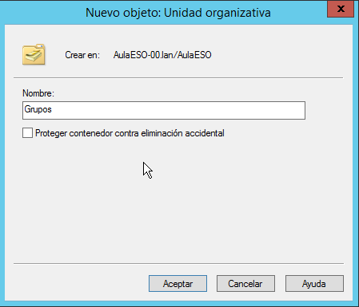

Nos pide el nombre de la nueva OU y podemos marcar la opción de _Proteger contenedor contra eliminación accidental_ que impide que se pueda eliminar el objeto.

**Mover una OU**

Para mover una OU a otro contenedor (dentro del mismo dominio) desde su menú contextual seleccionamos Mover y en la siguiente pantalla elegimos a qué contenedor la queremos mover.

**Eliminar una OU**

Por defecto, cuando creamos la OU, está marcada la opción de _Proteger objeto contra eliminación accidental_ y por eso cuando intentamos eliminar una UO, aparece el mensaje:

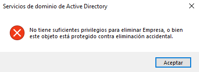

Para poderla eliminar debemos marcar la opción de _'Características avanzadas'_ en el menú _Ver_. A continuación desde el menú contextual de la OU a borrar vamos a _'Propiedades'_ y en la pestaña _'Objeto'_ desmarcamos la opción de _'Proteger objeto'_.

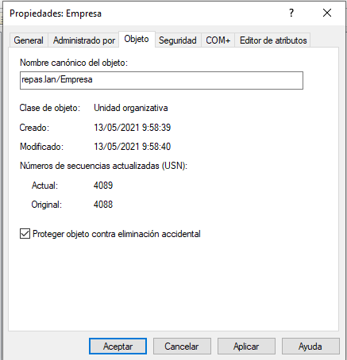

Una vez desprotegida ya podemos eliminarla desde su menú contextual con la opción Eliminar.

### Delegar la administración de una OU
AD permite delegar el control de una OU del Administrador del dominio a otros usuarios que sólo tendrán privilegios sobre esa OU. Para ellos desde el menú contextual de la OU elegimos la opción Delegar control y aparece el asistente. En la pantalla de usuarios y grupos pulsamos Agregar y elegimos los usuarios o (preferiblemente) grupos en que delegaremos la administración. Los seleccionamos y aceptamos.

Siempre es conveniente elegir grupos y no usuarios porque es más fácil de mantener: si queremos cambiar el administrador sólo tenemos que eliminar del grupo el antiguo usuario y añadir el nuevo.

A continuación elegimos qué tareas queremos delegar:

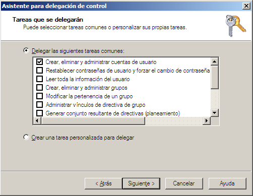

Finalmente el asistente nos muestra el resumen de lo que queremos hacer y cuando aceptemos se hace la delegación para las tareas indicadas.

## Sitios (_Sites_)
Definen diferentes ubicaciones dentro del dominio y sirven para establecer límites de replicación. Si nuestra empresa tiene diferentes ubicaciones crearemos un _site_ para cada una de ellas para mejorar el rendimiento ya que se supone que la comunicación entre distintos sitios no es tan rápida como dentro de un sitio.

## Buscar objetos
Según va aumentando el número de objetos en el AD se hace más difícil encontrar las cosas. Para facilitarlo se incluye un buscador que podemos abrir desde el botón de _**'Encontrar objetos...'**_ desde el menú contextual de cualquier contenedor:

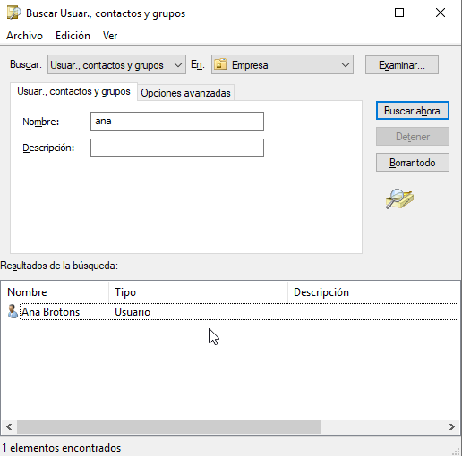

En el desplegable de **'Buscar'** podemos indicar si queremos buscar usuarios o grupos, equipos, impresoras, carpetas compartidas o departamentos (OUs). También podemos hacer una búsqueda personalizada por cualquier campo.

La última opción de **'Consultas comunes'** nos muestra una pantalla con las opciones más comunes para buscar usuarios, grupos y equipos:

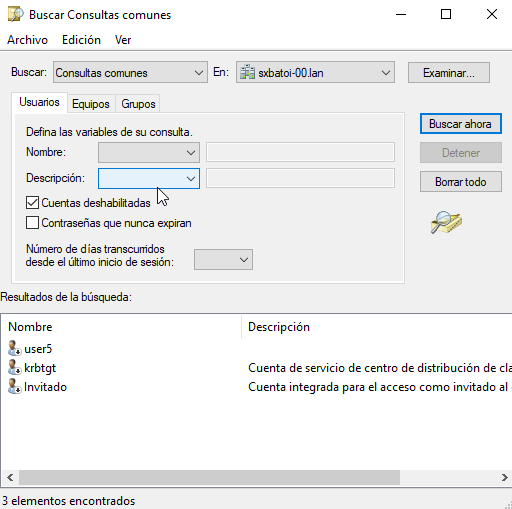

En el desplegable **'En'** indicamos en qué contenedor queremos buscar (por defecto en todo el dominio pero podemos especificar cualquier OU).

### Buscar desde el cliente
En muchas ocasiones el cliente necesita conectarse a un equipo, impresora o carpeta compartida pero no sabe exactamente su nombre o ubicación. En el _Explorador de archivos_  tenemos una herramienta para buscar objetos de AD.

Lo haremos desde el icono de _Red_ dentro del menú _Red_ aparece **'Buscar en AD'** que nos proporciona un buscador prácticamente igual que el que hemos visto en el servidor. Podéis ver en [este vídeo](media/Busca.ogv) un ejemplo de búsqueda.

Como vemos se pueden buscar usuarios, grupos, equipos o cualquier otro objeto. Si buscamos un recurso compartido sólo aparece si préviamente se ha publicado en Active Directory.

## Gestionar objetos desde la línea de comandos
Vamos a ver algunos _cmdlets_ útiles para gestionar nuestros objetos:
- `New-ADUser -name <nombre usuario>`: crea un usuario
- `Get-ADUser -name <nombre usuario>`: muestra información de un usuario
- `Set-ADUser -Identity <nombre usuario> -Add @{...} -Remove @{...} -Replace @{...}`: cambia la información de un usuario añadiendo, quitando o cambiando propiedades
- `Remove-ADUser -Identity <nombre usuario>`: borra la cuenta de un usuario
- `Disable-ADAccount -Identity <nombre usuario>`: deshabilita la cuenta de un usuario
- `Set-ADAccountPassword -Identity <nombre usuario> -Reset -NewPassword <nueva contraseña>`: cambia la contraseña a un usuario
- `New-ADGroup -name <nombre usuario>`: crea un grupo
- `Get-ADGroup -name <nombre grupo>`: muestra información de un grupo
- `Set-ADGroup -Identity <nombre grupo> -Add @{...} -Remove @{...} -Replace @{...}`: cambia la información de un grupo añadiendo, quitando o cambiando propiedades
- `Remove-ADGroup -Identity <nombre grupo>`: borra la cuenta de un grupo
- `Get-ADGroupMember -Identity <nombre grupo>`: muestra los miembros de un grupo
- `Add-ADGroupMember -Identity <nombre grupo> -Members <miembros a añadir>`: añade miembros a un grupo
- `Remove-ADGroupMember -Identity <nombre grupo> -Members <miembros a quitar>`: elimina miembros de un grupo
- `New-ADComputer -name <nombre ordenador>`: crea una cuenta de un ordenador cliente
- `Get-ADComputer -name <nombre ordenador>`: muestra información de un ordenador
- `Set-ADComputer -Identity <nombre ordenador> -Add @{...} -Remove @{...} -Replace @{...}`: cambia la información de un ordenador añadiendo, quitando o cambiando propiedades
- `Remove-ADComputer -Identity <nombre ordenador>`: borra la cuenta de un ordenador
- `Disable-ADAccount -Identity <nombre ordenador>`: deshabilita la cuenta de un ordenador
- `New-ADOrganizationalUnit -name <nombre OU>`: crea una nueva OU
- `Get-ADOrganizationalUnit -name <nombre OU>`: muestra información de una OU
- `Set-ADOrganizationalUnit -Identity <nombre OU> -Add @{...} -Remove @{...} -Replace @{...}`: cambia la información de un OU añadiendo, quitando o cambiando propiedades
- `Remove-ADOrganizationalUnit -Identity <nombre OU>`: borra la cuenta de un OU
- `Rename-ADObject -NewName <nombre ordenador> `: renombra la cuenta de un objeto
- `Move-ADObject -identity <DN del objeto> -targetpath <DN de la OU de destino>`: mueve un objeto a otra OU


**Ejemplos**:

1. Crea el usuario _jsegura_ cuyo nombre es _Juan Segura_, le establece varios valores (email, departamento, ciudad, ...) en la OU _asix_ del dominio _cipfpbatoi.lan_, su contraseña es la guardada en la variable _$password_, la cuenta está activa y muestra el resultado por pantalla (_Passthru_):

```powershell
New-ADUser -name "jsegura" -surname "Segura" -givenname "Juan" -emailaddress "jsegura@cipfpbatoi.lan" -samaccountname "jsegura" -accountpassword $password -displayname "Juan Segura" -department "INF" -country "ES" -city "Alcoi" -path "OU=asix, DC=cipfpbatoi,DC=lan" -Enabled $true -Passthru
```

Para obtener la contraseña podemos pedírsela al usuario:
```powershell
$password = Read-Host "Escribe la contraseña" -AsSecureString
```

o indicarla directamente, por ejemplo si es 12345678:
```powershell
$password = ConvertTo-SecureString 12345678 -AsPlainText -force
```

2. Cambia el usuario _jsegura_ que se traslada al departamento TIC de Nueva York:

```powershell
Set-ADUser -Identity "jsegura" -replace @{department="INF"; country="US"; city="NY"}
```

3. Cambia todos los usuarios del fichero _usuarios.csv_ que se trasladan al departamento TIC de Nueva York:

```powershell
$usuarios = Import-CSV C:\usuarios.csv
foreach ($usuario in $usuarios) {
    Set-ADUser -Identity $usuario -replace @{department="INF"; country="US"; city="NY"}
}
```

4. Deshabilita la cuenta del usuario _jsegura_:

```powershell
Disable-ADAccount -Identity "jsegura" -Passthru
```

4. Renombra la cuenta del usuario _jsegura_  a _juansegura_:

```powershell
Get-ADUser "jsegura" | Rename-ADObject -NewName "juansegura"
```

5. Deshabilita todas las cuentas de la OU _asix_:

```powershell
Get-ADUser -searchbase "OU=asix,DC=cipfpbatoi,DC=lan" -filter * |Disable-ADAccount
```

6. Borra la cuenta del usuario _jsegura_:

```powershell
Remove-ADUser -Identity "jsegura"
```

7. Mueve el usuario jsegura a la OU _daw_:

```powershell
Move-ADObject -identity "CN=jsegura,OU=asix,DC=cipfpbatoi,DC=lan" -targetpath "OU=daw,DC=cipfpbatoi,DC=lan"
```
Como se ve el nombre completo LDAP de un usuario es parecido al de una OU pero su prefijo es "CN".

8. Mueve a la OU _daw_ a todos los usuarios que sean del departamento de _INF_:

```powershell
Get-ADUser -filter 'department -eq "INF"' | Move-ADObject -targetpath "OU=daw,DC=cipfpbatoi,DC=lan"
```

9. Mueve a la OU _daw_ a todos los usuarios de la OU _asix_:

```powershell
Get-ADUser -filter * -searchBase "OU=asix,DC=cipfpbatoi,DC=lan" | Move-ADObject -targetpath "OU=daw,DC=cipfpbatoi,DC=lan"
```

10. Le pone al usuario jsegura la contraseña p@ssw0rd

```powershell
Set-ADAccountPassword -Identity jsegura -Reset -NewPassword (ConvertTo-SecureString -AsPlainText "p@ssw0rd" -Force): 
```

Siempre hay que utilizar comillas (" ") si hay espacios en alguna variable. 
Ejemplo: 
```powershell
New-ADUser -name "jsegura" -displayname "Juan Segura"
```
