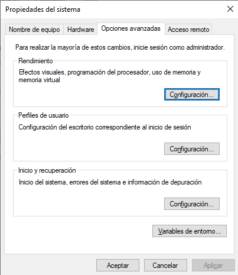
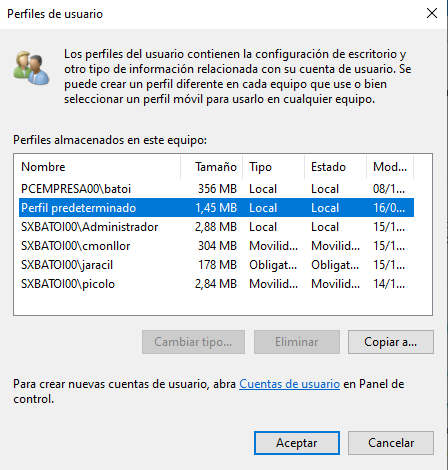
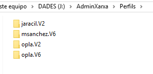
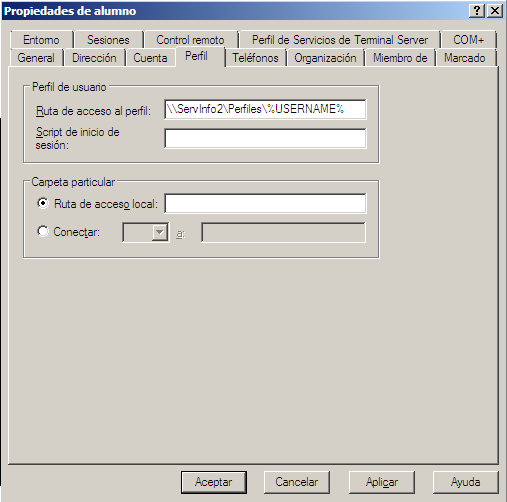
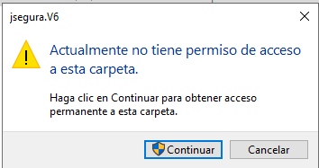
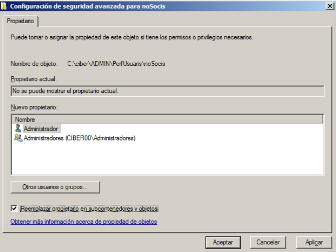
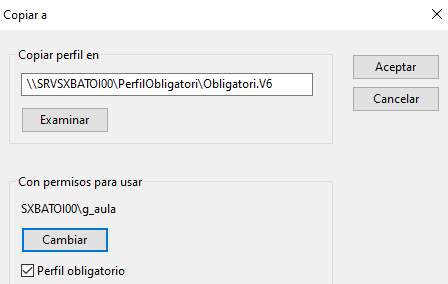
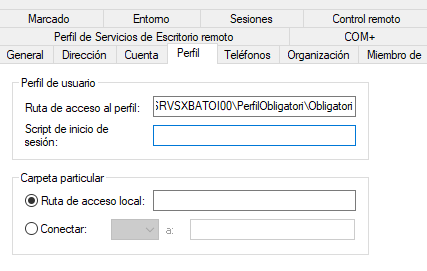
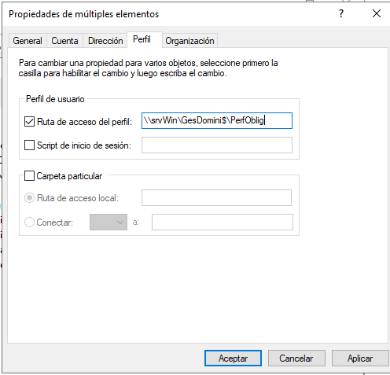
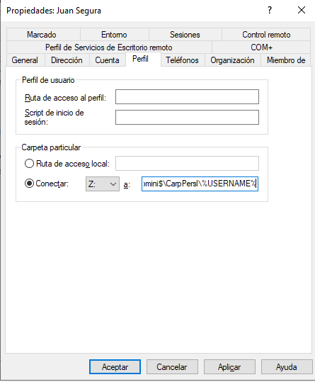

# Usuarios móviles
- [Usuarios móviles](#usuarios-móviles)
  - [Introducción](#introducción)
  - [Perfiles de usuario](#perfiles-de-usuario)
    - [Perfiles locales](#perfiles-locales)
    - [Perfiles de red](#perfiles-de-red)
  - [Creación de perfiles móviles de usuario](#creación-de-perfiles-móviles-de-usuario)
  - [Perfil obligatorio](#perfil-obligatorio)
    - [Convertir en obligatorio el perfil de un usuario](#convertir-en-obligatorio-el-perfil-de-un-usuario)
    - [Utilizar un mismo perfil obligatorio para muchos usuarios](#utilizar-un-mismo-perfil-obligatorio-para-muchos-usuarios)
  - [Script de inicio de sesión](#script-de-inicio-de-sesión)
  - [Carpetas particulares](#carpetas-particulares)
  - [Permisos de las carpetas de perfil de red y particulares](#permisos-de-las-carpetas-de-perfil-de-red-y-particulares)
    - [Ejemplo](#ejemplo)

## Introducción
Un perfil de usuario es un conjunto de configuraciones, preferencias y datos asociados a una cuenta de usuario concreta que sirve para personalizar el entorno de trabajo de dicho usuario. La primera vez que un nuevo usuario inicia sesión en un equipo, se crea automáticamente una carpeta con el nombre de ese usuario dentro de la carpeta **Usuarios** de la partición de Windows y allí se guarda su perfil.

Un perfil de usuario contiene información como el escritorio, sus carpetas personales (_Documentos_, _Imágenes_, ...), la configuración del _menú Inicio_, las opciones de accesibilidad, las preferencias de pantalla, las contraseñas guardadas, las configuraciones del navegador web y otras configuraciones específicas del usuario. También almacena sus datos y archivos personales, como documentos, imágenes, música y vídeos asociados con esta cuenta de usuario. Cuando un usuario cambia algo los cambios se almacenan en su perfil y se conservan la próxima vez que inicia sesión.

Al iniciar sesión el sistema carga automáticamente el perfil correspondiente al usuario que inicia la sesión, lo que hace que Windows aplique todas las configuraciones y preferencias personalizadas de ese usuario. Esto incluye su escritorio, la configuración de los iconos, los fondos de pantalla, etc.

Los perfiles de usuario son independientes y separados entre sí y por tanto un usuario no puede acceder directamente a los perfiles de otros. Esto ayuda a mantener la privacidad y la seguridad de los datos de cada usuario.

Como hemos dicho, el perfil de usuario se almacena en una carpeta con su nombre dentro de la carpeta `C:\Usuarios` (si es _Local_). Dentro de esta carpeta, hay subcarpetas que contienen los datos y configuraciones específicas de este usuario, como "Escritorio", "Documentos", "Descargas", "Imágenes", ...

¿Pero qué ocurre si un usuario inicia sesión a otro equipo? Como es la primera vez en este equipo se crearía un nuevo perfil para él con las configuraciones por defecto y no tendría su escritorio personalizado como estaba en el otro equipo ni tendría acceso a sus datos ya que se le han creado nuevas carpetas "Escritorio", "Documentos", etc en este equipo. La solución, como veremos más adelante, es guardar el perfil de ese usuario en un servidor de la red.

A estos usuarios se les denomina **usuarios móviles** y las herramientas que tenemos para conseguir que tengan su entorno de trabajo en cualquier ordenador en que inicien sesión son:
- perfiles de red
- carpetas privadas
- redireccionamiento de carpetas


Para ver los perfiles creados en un sistema debemos abrir las '_Propiedades del sistema_', por ejemplo desde `Configuración -> Sistema -> Acerca de -> Configuración avanzada del sistema`:



Allí veremos los perfiles de los usuarios de esta màquina en la `pestaña Opciones avanzadas -> Perfiles de usuario -> botón Configuración`:



En ocasiones tenemos usuarios que no siempre utilizan el mismo equipo sino que pueden iniciar sesión en diferentes equipos del dominio. Es necesario que, sea cual sea el ordenador en el que inicien sesión, tengan su entorno de trabajo personalizado y puedan acceder a sus documentos.


## Perfiles de usuario
Los perfiles de usuario son una herramienta muy potente para personalizar el entorno de trabajo de los usuarios. En el perfil de un usuario se almacena el aspecto de su escritorio, de la barra del tareas, el contenido del menú Inicio (incluyendo programas), su carpeta privada donde se guardan sus ficheros y a la que sólo él tiene acceso, etc..  Cuando un usuario cambia algo los cambios se almacenan en su perfil y se conservan la próxima vez que inicia sesión.

El perfil del usuario **se crea la primera vez que un usuario inicia sesión** en un equipo (por eso tarda más) y se almacena en ese equipo dentro de la carpeta que se crea para el usuario (`C:\Users\nombre_del_usuario`).

Si un usuario del dominio inicia sesión en varios equipos se creará un **perfil local** en cada uno (que son independientes y diferentes) y cualquier cosa que cambie de su perfil se cambiará sólo en el equipo en que lo ha cambiado.

La solución para que esto no ocurra es guardar el perfil de los usuarios móviles en un servidor, de forma que puedan acceder a él desde cualquier equipo desde el que inicien sesión en el dominio. A estos perfiles se les denomina **perfiles de red** (_roaming profile_) y tienen la ventaja de que el usuario tiene un único perfil por lo que será idéntico en cualquier equipo desde el que inicie sesión y los cambios que haga en él se reflejarán en todos los equipos.

Además del perfil local y los perfiles de red tenemos los **perfiles temporales** que son los que se crean en el equipo local si por alguna razón no se puede cargar el perfil de red del usuario cuando inicia sesión. El perfil temporal se crea para que el usuario pueda trabajar en el equipo pero se elimina al finalizar la sesión por lo que los cambios hechos en la sesión no se conservan.

### Perfiles locales
El perfil local se crea la primera vez que un usuario inicia sesión en un equipo. Se almacenan dentro de la carpeta que se crea para el usuario dentro de `C:\Users`.

Podemos ver y eliminar los perfiles locales de usuario desde el `botón Configuración -> Sistema -> Acerca de -> Configuración avanzada del sistema -> Configuración avanzada -> Perfiles de usuario`.


Esta captura corresponde a un equipo que se llama _PcEmpresa00_ que pertenece al dominio _SxBatoi00.lan_. Se puede ver que han iniciado sesión en el mismo varios usuarios:
- el usuario local **batoi**. Su perfil ocupa 356 MB y se encuentra en este equipo (_Local_)
- _Perfil predeterminado_ no es un usuario sino el perfil por defecto que se copia para crear un nuevo perfil de usuario
- el usuario **Administrador** del dominio SXBATOI00. Su perfil ocupa 2,88 MB y se encuentra en este equipo (_Local_)
- el usuario **cmonllor** del dominio SXBATOI00. Su perfil ocupa 304 MB pero no está en ese equipo sino en otro equipo de la red (_Movilidad_)
- el usuario **jaracil** del dominio SXBATOI00. Su perfil ocupa 178 MB pero no está en ese equipo sino en otro equipo de la red (_Obligatorio_, ya veremos qué significa)
- el usuario **picolo**, del dominio SXBATOI00. Su perfil ocupa 2,84 MB pero no está en ese equipo sino en otro equipo de la red (_Movilidad_)

Desde aquí podemos eliminar cualquier perfil (se volverá a crear cuando el usuario inicié sesión con las opciones por defecto) o cambiar el tipo para convertirlo en perfil móvil si el usuario es un usuario del dominio y se ha creado su perfil en el servidor.

### Perfiles de red
Los perfiles de red pueden ser de 3 tipos diferentes:
- **Perfil móvil**: el administrador asigna un perfil de red al usuario, quien puede modificarlo y los cambios se conservarán para la siguiente sesión.
- **Perfil obligatorio**: es como el perfil móvil pero los cambios que hacen los usuarios en su perfil no se guardan por lo que el usuario siempre trabaja con el perfil que le asignó el administrador cuando inicia sesión.
- **Perfil superobligatorio**: es un perfil obligatorio en el que, si por alguna razón no se puede cargar el perfil cuando el usuario inicia sesión, no se le permite conectarse.

Muchas veces utilizamos el término perfil móvil para referirnos a cualquiera de los 3 perfiles de red. 

Los perfiles de red deben estar almacenados en una carpeta de red accesible desde cualquier equipo del dominio. Cuando un usuario con perfil móvil inicia sesión en un equipo del dominio recibe desde el DC la ruta de su perfil y el equipo cliente accede a esa ruta y descarga todo el perfil. Cuando cierra la sesión su perfil vuelve a copiarse desde el equipo cliene a la carpeta de red para mantener los cambios que haya hecho. Esto puede suponer una carga importante para la red en el caso de perfiles muy grandes (ten en cuenta que el perfil **incluye las carpetas personales** del usuario).

El formato en que se guarda un perfil es diferente entre distintas sesiones de Windows. Un perfil de Windows XP no puede usarlo un equipo con Windows 10 y viceversa. Para saber de qué versión de Windows es un determinado perfil a la carpeta que lo contiene se le añade automáticamente una extensión:
- **.V6**: se trata de un perfil de Windows 10 o posterior o bien de Windows Server 2016 o posterior (son compatibles)
- **.V2**: se trata de un perfil de Windows 7 / 8 o de Windows Server 2008 o 2012
- **sin extensión**: se trata de un perfil de Windows XP o Windows Server 2003

Por tanto un usuario llamado 'fperez' con perfil móvil y que haya iniciado sesión en un cliente con Windows XP, otro con Windows 7 y otro con Windows 10 tendrá en la carpeta de perfiles 3 carpetas suyas: `fperez` (con su perfil de XP). `fperez.V2` (con su perfil Windows 7) y `fperez.V6` (con su perfil Windows 10). Según el sistema operativo de la máquina en la que inicie sesión se cargará un perfil u otro al loguearse el usuario.

La captura siguiente es de un sistema donde un usuario móvil llamado 'opla' ha iniciado sesión en algún cliente Win7 y algún Win10, otro usuario 'jaracil' que sólo usa Win7 y otro llamado 'msanchez' que sólo ha usado clientes Win10:



## Creación de perfiles móviles de usuario
Lo primero que necesitamos es tener una carpeta compartida donde se crearán las carpetas con el perfil de cada usuario móvil. Como además de esta carpeta necesitaremos otras (para carpetas particulares o perfiles obligatorios que veremos más adelante) es habitual en lugar de compartir la carpeta de los perfiles, compartir una carpeta con subcarpetas para los perfiles móviles, obligatorios, carpetas particulares, etc. En ese caso la ruta de la carpeta del perfi será:

```[bash]
\\nombre-del-servidor\carpeta-compartida\carpeta-de los-perfiles-mobiles\%USERNAME%
```

Las partes que forman esa ruta son:
- nombre del servidor: nombre de la máquina en la que hemos compartido la carpeta
- carpeta compartida: nombre de la carpeta que hemos compartido. Como esta carpeta no la utilizarán directamente los usuarios sería una buena idea que estuviera oculta (su nombre debe terminar por $)
- carpeta de los perfiles móviles: carpeta donde se creará una subcarpeta para cada usuario con su perfil
- %USERNAME%: variable de Windows que se sustituye por el nombre del usuario, por lo que para el usuario _jsegura_ se creará una subcarpeta llamada `jsegura`

Por ejemplo, si en un equipo llamado `srvWin` hemos compartido una carpeta llamada `GesDomini$` dentro de la cual existe una subcarpeta llamada `PerfiMobil` y configuramos el usuario _jsegura_ para que tenga un perfil móvil dentro de esa carpeta, la primera vez que inicie sesión se creará automáticamente la carpeta `\\srvWin\GesDomini$\PerfMobil\jsegura.V6` y en ella se creará el perfil del usuario.

Para que se pueda crear esa carpeta el usuario _jsegura_ debe tener permisos para crear carpetas en `PerfiMobil` (por ejemplo permiso de **_Modificar_**). Esto es porque la carpeta con el perfil del usuario la crea Windows la primera vez que el usuario inicia sesión pero lo hace en su nombre y con sus credenciales (es como si la creara el usuario).

Cuando Windows crea esa carpeta le dará al usuario el permiso de **_Control total_** y **quitará los permisos al resto de usuarios**, incluido el _Administrador_ por lo que nadie más podrá acceder al perfil mas que el propio usuario.

**NOTA**: si el _Administrador_ lo necesita puede acceder a cualquier carpeta incluso si no tiene permisos. Para ello desde _Propiedades_ de la carpeta deberá cambiar el propietario de la misma y poner como nuevo propietario él mismo o mejor, al grupo _Administradores_ (así el antiguo propietario sigue siendo el usuario propietario tras el cambio).

**ATENCIÓN**: como aún no sabemos compartir carpetas (lo veremos en la próxima unidad) podemos usar **`Servicios de archivo y almacenamiento`** dentro del `Administrador del servidor` para crearlas y compartirlas de manera sencilla.

Una vez compartida la carpeta con los permisos necesarios sólo es necesario especificar en la cuenta de usuario la ubicación física de su perfil desde las `propiedades de la cuenta -> pestaña Perfil`:



Podemos indicar el nombre de la carpeta (`\\srvWin\GesDomini$\PerfMobil\jsegura`) o mejor, utilizar la variable de Windows `%USERNAME%` que se sustituye por el nombre de usuario de ese usuario concreto (_jsegura_).

**IMPORTANTE**: en la ruta del perfil **NUNCA se pone la extensión** porque aquí sólo se indica que ese usuario tendrá un perfil móvil pero no sabemos si iniciará sesión desde un equipo con Windows 10, 7 o 15. En función del sistema operativo del equipo desde el que inicie sesión Windows determinará automáticamente la extensión de la carpeta con el perfil a cargar (`jsegura.V6`, `jsegura.V2`, ...).

## Perfil obligatorio
Si un perfil es obligatorio el usuario podrá realizar los cambios que quiera en él, pero al cerrar sesión esos cambios no se guardan, por lo que cuando vuelva a iniciar sesión tendrá su perfil como estaba antes.

El perfil de un usuario consta de muchas carpetas y archivos donde se almacena la configuración de ese usuario. Para hacer que un perfil sea obligatorio sólo debemos cambiar la extensión del archivo **`NTUSER.DAT`**. Se trata de un archivo oculto y del sistema (atributos **H** y **S**) que contiene las principales configuraciones del perfil. Para convertir un perfil en obligatorio, lo único que debemos hacer es cambiar la extensión del archivo NTUSER.DAT por `NTUSER.MAN` (este cambio debe hacerse con la **sesión del usuario cerrada**).

A partir de ese momento cuando el usuario inicie sesión y realice cambios en su perfil estos cambios no se guardarán al cerrar la sesión.

Se pueden dar 2 casos cuando queremos establecer los perfiles obligatorios:
- queremos que un usuario tenga perfil obligatorio
- queremos que un grupo de usuarios tenga perfil obligatorio (es lo que normalmente queremos hacer)

### Convertir en obligatorio el perfil de un usuario
**NOTA**: este caso es muy poco frecuente ya que lo normal es queramos que sea todo un grupo de usuarios los que tengan perfil obligatorio, no uno sólo. Ese caso lo vemos en el siguiente apartado.

Como hemos dicho para hacerlo obligatorio sólo debemos cambiar el nombre del archivo `NTUSER.DAT` por `NTUSER.MAN`. El problema que nos encontramos para hacer esto es que sólo el propio usuario tiene permisos para entrar en su carpeta del perfil, ni siquiera el Administrador puede entrar.



Para poder entrar en esa carpeta debemos cambiar temporalmente el propietario de la carpeta del perfil del usuario y pondremos como propietario al _grupo **Administradores**_.

Se realiza desde la carpeta en `Propiedades -> Seguridad -> Opciones avanzadas -> Propietario -> Cambiar`:



Pondremos como nuevo propietario el grupo **_Administradores_** y marcarremos la casilla de **_Reemplazar propietario en subcontenedoras y objetos_** para cambiar también el propietario en los archivos de dentro de la carpeta (especialmente de _NTUSER.DAT_ que es lo que debemos cambiar). Ahora bien, es importante que el usuario del perfil obligatorio mantenga su permiso de _Control total_.

Ahora ya podemos entrar en la carpeta y cambiar el nombre del archivo _NTUSER.DAT_ a **_NTUSER.MAN_** y ya hemos hecho el perfil obligatorio.

En el cliente podremos comprobar que el usuario, efectivamente, tiene el perfil declarado como obligatorio (en este caso el usuario _msanchez_):



**MUY IMPORTANTE**: el nuevo propietario debe ser el grupo _Administradores_, **NO** el usuario _Administrador_ ya que así continúa perteneciendo también al usuario de este perfil. Si el usuario que usa un perfil no es su usuario propietario no puede usarlo.

Aquí podéis ver un pequeño [vídeo de cómo cambiar el propietario](media/cambiarPropietario.mkv) de una carpeta.

### Utilizar un mismo perfil obligatorio para muchos usuarios
Este es el caso más habitual ya que normalmente es más de un usuario quien tiene que tener perfil obligatorio y el perfil tiene que ser igual para todos. Como además ninguno de esos usuarios puede hacer cambios en el perfil (porque es obligatorio) no tiene sentido que cada usuario tenga su propio perfil sino que es mejor usar un mismo perfil para todos ellos.

La forma más sencilla de hacerlo es copiando el perfil desde un equipo cliente. En primer lugar debemos tener una carpeta compartida dentro de la cual crearemos la carpeta del perfil obligatorio (seguiendo el ejemplo de los perfiles móviles podría ser la carpeta `\\srvWin\GesDomini$`). También debemos tener creado un grupo con todos los usuarios que han de utilizar este perfil obligatorio. 

A continuación iniciamos sesión en un equipo cliente con el usuario _Administrador_ del dominio y hacemos:

1.- Vamos dónde se ven los perfiles creados en el equipo, en `Configuración -> Sistema -> Acerca de -> Configuración avanzada del sistema -> Opciones avanzadas -> Perfiles de usuario`


2.- Pulsamos el botón `Configuración` y accedemos a los perfiles. Seleccionamos el _Perfil predeterminado_ y pulsamos el botón `Copiar a`.


3.- En `Copiar perfil en` ponemos la ruta de la carpeta del servidor donde se guardará el perfil **con la extensión correspondiente** (**V6** para Windows 10 y superiores). Esta carpeta se creará (no hace falta que ya esté creada). Por ejemplo:

```[bash]
\\srvWin\GesDominio$\PerfOblig.V6
```

4.- En `Con permisos para usar` debemos poner el grupo al que pertenecen los usuarios que tendrán perfil obligatorio para que puedan acceder al perfil. Sólo se puede poner un grupo (si queremos que el perfil sea para más de un grupo crearemos un nuevo grupo que los englobe). Para añadir el grupo pondremos su nombre en la ventana de **Seleccionar usuario o grupo**, pero antes debemos pulsar el botón de **Avanzados** y en la ventana que se abra vamos a **Tipo de objetos** y marcamos la casilla de **_Grupos_** que por defecto está desmarcada. Ahora ya encontrará el grupo que queremos y lo seleccionaremos para permitir a sus miembros acceder a la carpeta en la que se copiará el perfil.

Con esto ya tenemos el perfil creado en la carpeta del servidor indicada y con los permisos establecidos para el grupo indicado, por lo que ya podemos cerrar la sesión en el cliente. 

Falta hacer obligatorio el perfil para lo que vamos a la carpeta que acaba de crearse en el servidor (y a la que sí podemos entrar sin tener que cambiar el propietario) para cambiar el nombre del fichero _NTUSER.DAT_ por **NTUSER.MAN**.

Ahora modificamos las cuentas de los usuarios que tendrán perfil obligatorio para poner en la pestaña Perfil la ruta en la que hemos copiado este perfil. Tened en cuenta que ahora la ruta **no terminará en `%USERNAME%`** porque no queremos una carpeta de perfil diferente para cada usuario sino que todos tendrán el mismo perfil. Recordad que **NUNCA** debemos poner en la ruta la extensión V6:



Recuerda que podemos establecer una propiedad a muchos usuarios al mismo tiempo si los seleccionamos todos y después abrimos sus Propiedades:




## Script de inicio de sesión
Podemos hacer un script (un fichero de proceso por lotes, con extensión `.BAT`, o de Powershell con extensión `.PS1`) que se ejecutará automáticamente cada vez que el usuario inicie sesión. Este script se tiene que guardar obligatoriamente en la carpeta compartida **NETLOGON** (que se encuentra en `C:\Windows\SYSVOL\sysvol\nombre_del_dominio\scripts`). Al indicar en la ficha de perfil la ruta a la script NO tenemos que poner la extensión .BAT.

Sólo se utiliza en perfiles de red.

## Carpetas particulares
Si los usuarios móviles guardan sus archivos en sus carpetas habituales de _Escritorio_, _Documentos_, _Imágenes_, _Vídeos_, etc estos documentos se guardarán en su perfil móvil lo que hará que su tamaño aumente mucho y por tanto la cantidad de información que hay que cargar en el equipo cliente cada vez que ese usuario inicia sesión y que hay que guardar en el servidor cuando la sesión se cierra.

Una solución es proporcionarles una carpeta en el servidor donde guardar sus propios archivos de forma que los tengan disponibles en cualquier equipo en el que inicien sesión. De esta manera su perfil permanece pequeño y cuando necesiten un archivo lo tienen disponible en el servidor, descargándose sólo dicho archivo y no todos los que tienen guardados.

Además haremos que esa carpeta se conecte automáticamente a una unidad de red de su equipo y así al usuario le aparecerá como una unidad más en la ventana **Equipo** del `Explorador de archivos` (junto al disco C: y el resto de unidades del equipo).

Al igual que ocurre con la carpeta del perfil del usuario, la carpeta particular también la crea Windows automáticamente en la ruta de red que le indicamos pero hay 3 diferencias respecto a la carpeta del perfil:
1. La carpeta del perfil contiene muchos archivos y subcarpetas (todo el perfil del usuario) pero la carpeta particular está vacía y es el usuario quien guardará en ella los documentos que desee
2. La carpeta del perfil se crea la primera vez que inicia sesión el usuario. La carpeta particular se crea en el momento en que el administrador configura la cuenta de ese usuario y le asigna una carpeta particular. Por tanto el usuario no necesita permisos de _Modificar_ dónde se deba crear la carpeta sino sólo de _Lectura y ejecución_.
3. Cuando Windows crea la carpeta del perfil de un usuario le da a ese usuario el permiso de _Control total_ y quita los permisos al resto de usuarios (incluido el _Administrador_). Pero cuando crea la carpeta particular de un usuario también le da al mismo _Control total_ pero además **hereda todos los permisos de la carpeta** en la que se ha creado.

Para configurar las carpetas particulares, igual que para los perfiles, primeramente tendremos que crear y compartir una carpeta en el servidor dentro de la cual Windows creará automáticamente las carpetas particulares de los usuarios.

Una vez creada configuramos la cuenta de los usuarios igual que con los perfiles móviles en la pestaña _Perfil_ de la cuenta del usuario, en la sección de _Carpeta particular_:



Elegimos la letra de unidad a la que se conectará la carpeta personal del usuario. En el ejemplo en el equipo cliente aparecerá un nuevo disco `Z:` y cuando el usuario entre en él estará accediendo a su carpeta particular. La ruta que pondremos, siguiendo el ejemplo del perfil móvil será

```[bash]
\\srvWin\GesDominio$\CarpPers\%USERNAME%
```

Recuerda que `%USERNAME%` es una variable de Windows que se sustituye por el nombre de ese usuario (_jsegura_).

Hemos visto que en la sección Carpeta particular hay 2 opciones:
- **Conectar**: es la opción que escogeremos normalmente. Elegimos la letra a la que se conectará automaticamente la unidad de red que contiene la carpeta personal del usuario y la ruta de dicha carpeta (que como el caso de los perfiles terminará por **%USERNAME%** para que cada usuario tenga su propia carpeta
- **Ruta de acceso local**: en vez de tener la carpeta personal en una unidad de red estará en una carpta local (por tanto no sirve para usuarios móviles)

La diferencia respecto a la carpeta de los perfiles es:
## Permisos de las carpetas de perfil de red y particulares
Los permisos a dar a la carpeta donde se van a crear las carpetas para cada usuario son distintos según su función:
- **Carpeta de perfil móvil**: el grupo de usuarios que vayan a tener perfil móvil deben poder tener permisos para crear carpetas aquí dentro (ya que su carpeta se crea cuando ellos inician sesión). Por tanto necesitarán permisos NTFS de _Modificar_ y SMB de _Cambiar_. La primera vez que inicien sesión se creará su carpeta en la que el usuario tendrá _Control total_ y no habrá permisos para el resto de usuarios, ni siquiera para los Administradores) por lo que nadie más que él tendrá acceso a su carpeta de perfil.
- **Carpeta de perfil obligatorio**: en este caso la carpeta ya está creada (la creó el _Administrador_ al copiarla desde el equipo cliente) y los permisos asignados al grupo de usuarios que vayan a usarla. Como no necesitan cambiar nada en ella sería suficiente el permiso de _Lectura y ejecución_
- **Carpeta particular**: en este caso la carpeta de cada usuario también está creada (la crea el _Administrador_ en el momento en que la configura en la cuenta del usuario) por lo que es suficiente con permisos NTFS de _Lectura y ejecución_ (y SMB de _Leer_). Pero, a diferencia de las carpetas de los perfiles, la carpeta particular de cada usuario hereda los permisos que se establezcan aquí por lo que este permiso se heredaría en todas las subcarpetas haciendo que todos los usuarios vieran las carpetas particulares de los demás. Para evitarlo al dar al grupo el permiso de _Lectura y ejecución_ desde `Opciones avanzadas->Editar` estableceremos el permiso _**`Sólo a esta carpeta`**_ en vez de _`Esta carpeta, subcarpetas y archivos`_.

### Ejemplo
Vamos a suponer que tenemos los usuarios _profe1_ y _profe2_ que pertenecen al grupo _gProfes_ y que queremos que tengan perfil móvil y carpeta particular. Además tenemos los usuarios _alum1_ y _alum2_ que pertenecen a grupo _gAlumnos_ y que tendrán perfil obligatorio y carpeta particular.

Crearemos una carpeta compartida llamada _ManageMobileUsers_ donde crearemos las carpetas:
- PerfMovil
- PerfOblig
- CarpPart

Los permisos NTFS que daremos a cada carpeta serán:
- ManageMobileUsers: `Administradores -> Control total`, `gProfes -> Lectura y ejecución`, `gAlumnos -> Lectura y ejecución`
  - PerfMovil:  `Administradores -> Control total`, `gProfes -> Modificar`
  - PerfOblig:  `Administradores -> Control total`, `gAlumnos -> Lectura y ejecución`
  - CarpPart:  `Administradores -> Control total`, `gProfes -> Lectura y ejecución (Sólo esta carpeta)`, `gAlumnos -> Lectura y ejecución (Sólo esta carpeta)`

Dentro de _PerfMovil_ cuando los profesores hayan iniciado sesión se habrán creado las carpetas:
- profe1: `profe1 -> Control total`
- profe2: `profe2 -> Control total`

y dentro de _CarpPart_ se habrán creado:
- profe1: `Administradores -> Control total`, `profe1 -> Control total`
- profe2: `Administradores -> Control total`, `profe2 -> Control total`
- alum1: `Administradores -> Control total`, `alum1 -> Control total`
- alum2: `Administradores -> Control total`, `alum2 -> Control total`

Y los permisos SMB que habrá que dar a _ManageMobileUsers_ serán `Administradores -> Control total`, `gProfes -> Cambiar (o Control total)`, `gAlumnos -> Cambiar (o Control total)`