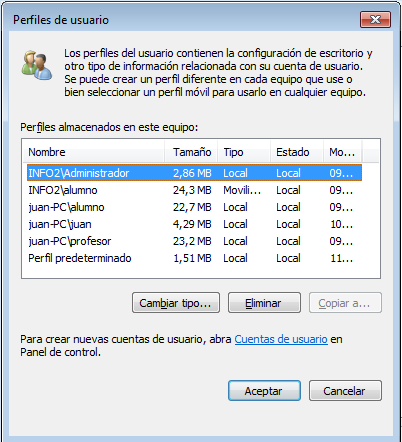
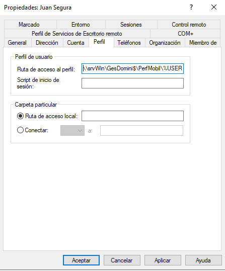
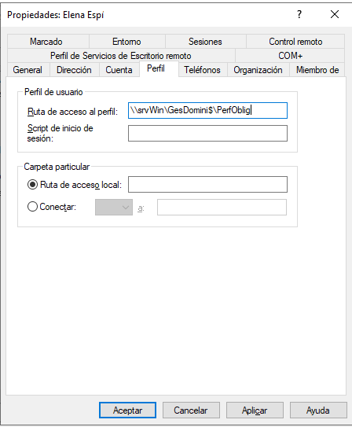

# Usuarios móviles
- [Usuarios móviles](#usuarios-móviles)
  - [Introducción](#introducción)
  - [Perfiles de usuario](#perfiles-de-usuario)
    - [Perfiles locales](#perfiles-locales)
    - [Perfiles de red](#perfiles-de-red)
    - [Creación de perfiles móviles de usuario](#creación-de-perfiles-móviles-de-usuario)
    - [Convertir en obligatorio el perfil de un usuario](#convertir-en-obligatorio-el-perfil-de-un-usuario)
    - [Utilizar un mismo perfil obligatorio para muchos usuarios](#utilizar-un-mismo-perfil-obligatorio-para-muchos-usuarios)
  - [Script de inicio de sesión](#script-de-inicio-de-sesión)
  - [Carpetas particulares](#carpetas-particulares)
  - [Permisos de las carpetas de perfil de red y particulares](#permisos-de-las-carpetas-de-perfil-de-red-y-particulares)
    - [Ejemplo](#ejemplo)

## Introducción
En ocasiones tenemos usuarios que no siempre utilizan el mismo equipo sino que pueden iniciar sesión en diferentes equipos del dominio. Es deseable que, sea cual sea el ordenador en el que inicien sesión, tengan su entorno de trabajo personalizado y puedan acceder a sus documentos.

A estos usuarios se les denomina **usuarios móviles** y las herramientas que tenemos para conseguir que tengan su entorno de trabajo en cualquier ordenador en que inicien sesión son:
- perfiles de red
- carpetas privadas
- redireccionamiento de carpetas

## Perfiles de usuario
Los perfiles de usuario son una herramienta muy potente para personalizar el entorno de trabajo de los usuarios. En el perfil de un usuario se almacena el aspecto de su escritorio, de la barra del tareas, el contenido del menú Inicio (incluyendo programas), su carpeta privada donde se guardan sus ficheros y a la que sólo él tiene acceso, etc..  Cuando un usuario cambia algo los cambios se almacenan en su perfil y se conservan la próxima vez que inicia sesión.

El perfil del usuario **se crea la primera vez que un usuario inicia sesión** en un equipo (por eso tarda más) y se almacena en ese equipo dentro de la carpeta que se crea para el usuario (`C:\Users\nombre_del_usuario`).

Si un usuario del dominio inicia sesión en varios equipos se creará un **perfil local** en cada uno (que son independientes y diferentes) y cualquier cosa que cambie de su perfil se cambiará sólo en el equipo en que lo ha cambiado.

La solución para que esto no ocurra es guardar el perfil de los usuarios móviles en el servidor, de forma que puedan acceder a él desde cualquier equipo desde el que inicien sesión en el dominio. A estos perfiles se les denomina **perfiles de red** (_roaming profile_) y tienen la ventaja de que el perfil es único por lo que será idéntico en cualquier equipo desde el que inicie sesión y los cambios que haga en él se reflejarán en todos los equipos.

Además del perfil local y el perfil de red están los **perfiles temporales** que son los que se crean en el equipo local si por alguna razón no se puede cargar el perfil de red del usuario cuando inicia sesión. El perfil temporal se elimina al finalizar la sesión por lo cual los cambios hechos en la sesión no se conservan.

### Perfiles locales
El perfil local se crea la primera vez que un usuario inicia sesión en un equipo. Se almacenan dentro de la carpeta que se crea para el usuario dentro de `C:\Users`.

Podemos ver y eliminar los perfiles locales de usuario desde el `botón Configuración -> Sistema -> Acerca de -> Configuración avanzada del sistema -> Configuración avanzada -> Perfiles de usuario`.

Esta captura corresponde a un equipo que se llama _juan-PC_ que pertenece al dominio _INFO2.lan_. Se puede ver que han iniciado sesión en el mismo varios usuarios del dominio (_Administrador_, con perfil local, y _alumno_ con perfil móvil) y varios usuarios locales (_alumno_, _juan_ y _profesor_).

Desde aquí podemos eliminar cualquier perfil (se volverá a crear cuando el usuario inicié sesión con las opciones por defecto) o cambiar el tipo para convertirlo en perfil móvil si el usuario es un usuario del dominio y se ha creado su perfil en el servidor.

### Perfiles de red
Los perfiles de red pueden ser de 3 tipos diferentes:
- **Perfil móvil**: el administrador asigna un perfil de red al usuario, quien puede modificarlo y los cambios se conservarán para la siguiente sesión.
- **Perfil obligatorio**: es como el perfil móvil pero los cambios que hacen los usuarios en su perfil no se guardan por lo que el usuario siempre trabaja con el perfil que le asignó el administrador cuando inicia sesión.
- **Perfil superobligatorio**: es un perfil obligatorio pero si por alguna razón no se puede cargar el perfil cuando el usuario inicia sesión no se le permite conectarse.

Muchas veces utilizamos el término perfil móvil para referirnos a cualquiera de los 3 perfiles de red. Los perfiles de red deben estar almacenados en una carpeta de red accesible desde cualquier equipo del dominio. Cuando un usuario con perfil móvil inicia sesión en un equipo del dominio recibe desde el DC la ruta de su perfil y el cliente accede a esa ruta y lo copia al equipo local. Cuando cierra la sesión su perfil vuelve a copiarse en la carpeta de red para mantener los cambios que haya hecho. Esto puede suponer una carga importante para la red en el caso de perfiles muy grandes (ten en cuenta que el perfil **incluye las carpetas personales** del usuario).

El formato en que se guarda un perfil es diferente entre distintas sesiones de Windows. Un perfil de Windows XP no puede usarlo un equipo con Windows 10 y viceversa. Para saber de qué versión de Windows es un determinado perfil a la carpeta que lo contiene se le añade automáticamente una extensión:
- **sin extensión**: se trata de un perfil de Windows XP
- **.V2**: se trata de un perfil de Windows Vista o 7
- **.V6**: se trata de un perfil de Windows 8 o 10

Por tanto un usuario llamado 'fperez' con perfil móvil y que haya iniciado sesión en un cliente con Windows XP, otro con Windows 7 y otro con Windows 10 tendrá en la carpeta de perfiles 3 carpetas suyas: `fperez` (con su perfil de XP). `fperez.V2` (con su perfil Windows 7) y `fperez.V6` (con su perfil Windows 10). Según el sistema operativo de la máquina en la que inicie sesión Windows cargará un perfil u otro al loguearse el usuario.

Por ejemplo, si tenemos un usuario móvil llamado opla que ha iniciado sesión en algún cliente Win8 y algún Win10, otro usuario jaracil que sólo usa Win8 y otro llamado msanchez que sólo ha usado clientes Win10 tendremos los siguientes perfiles creados:

### Creación de perfiles móviles de usuario
En primer lugar crearemos en el servidor la carpeta donde almacenaremos todos los perfiles de los usuarios. La carpeta de perfiles tiene que estar compartida con permisos al menos de **Modificar** (tanto SMB como NTFS) para todos los usuarios que tengan perfil móvil. Esto es porque la carpeta con el perfil del usuario la crea el equipo cliente la primera vez que el usuario inicia sesión y lo hace con sus credenciales (es como si la creara el usuario por lo que necesita permisos de crear carpetas).

Después tenemos que especificar en la cuenta de usuario la ubicación física de su perfil (dentro de la carpeta creada anteriormente). Por ejemplo, en el servidor `ServInfo2` hemos compartido la carpeta `Perfiles` y vamos a indicar que el usuario `alumno` tiene un perfil móvil, En su cuenta ponemos:

Podemos indicar el nombre de la carpeta (`\\ServInfo2\Perfiles\alumno`) o usar la variable de Windows **`%USERNAME%`** que se sustituye por el nombre de usuario de este usuario concreto (en este caso _alumno_).

**IMPORTANTE**: en la pestaña de configuración del perfil en la cuenta del usuario NUNCA pondremos la extensión (.V2, .V6, ...) para indicar el tipo de perfil porque eso lo hace Windows automáticamente en función del S.O. que tenga el equipo desde que inicia sesión el usuario.

### Convertir en obligatorio el perfil de un usuario
**NOTA**: este caso es muy poco frecuente ya que lo normal es queramos que sea todo un grupo de usuarios los que tengan perfil obligatorio, no uno sólo. Ese caso lo vemos en el siguiente apartado.

El perfil de un usuario consta de muchas carpetas y ficheros donde se almacena la configuración de ese usuario y se crea a partir del _perfil predeterminado_ de usuario que tiene Windows. Entre los ficheros que se crean está el fichero **NTUSER.DAT** (es un fichero oculto y del sistema) que contiene las principales configuraciones del perfil. Para convertir un perfil en obligatorio lo único que tenemos que hacer es cambiar el nombre del fichero _NTUSER.DAT_ por **NTUSER.MAN** (este cambio tiene que hacerse con la sesión del usuario cerrada).

A partir de ahora cuando el usuario inicie sesión y realice cambios en su perfil estos cambios no se guardarán al cerrar la sesión por lo cual cuando vuelva a iniciar sesión se encontrará su entorno como si no hubiera cambiado nada.

El problema que nos encontramos para hacer esto es que sólo el propio usuario tiene permisos para entrar en su carpeta del perfil, ni siquiera el Administrador puede entrar. Para que pueda entrar el Administrador tenemos que cambiar el propietario de la carpeta del perfil de ese usuario.

Se hace desde el `menú contextual de la carpeta -> Propiedades -> Seguridad -> Opciones avanzadas -> Propietario -> botón 'Cambiar'`:

Pondremos como nuevo propietario el **grupo Administradores** y marcamos la casilla de **Reemplazar propietario en subcontenedores y objetos** para cambiar también el propietario en los ficheros de dentro de la carpeta.

**MUY IMPORTANTE**: el nuevo propietario debe ser el grupo _Administradores_, **NO** el usuario _Administrador_ ya que así continúa perteneciendo también al usuario de este perfil. Si el usuario que usa un perfil no es su usuario propietario no puede usarlo.

Aquí podéis ver un pequeño [vídeo de cómo cambiar el propietario](media/cambiarPropietario.mkv) de una carpeta.

Ahora ya podemos entrar a la carpeta y cambiar el nombre del fichero NTUSER.DAT a **NTUSER.MAN** y ya hemos conseguido que el perfil sea obligatorio.

### Utilizar un mismo perfil obligatorio para muchos usuarios
Este es el caso más habitual ya que normalmente es más de un usuario quien tiene que tener perfil obligatorio y el perfil tiene que ser igual para todos. Como además ninguno de esos usuarios puede hacer cambios en el perfil (porque es obligatorio) no tiene sentido que cada usuario tenga su propio perfil sino que es mejor usar un mismo perfil para todos ellos.

La manera más sencilla de hacerlo es copiar el perfil desde un equipo cliente al servidor y usarlo para todo ellos.

Para ello debemos iniciar sesión en un equipo cliente como _Administrador del dominio_  y copiar el Perfil predeterminado desde ese equipo a la carpeta del servidor donde queremos que esté el perfil obligatorio. A continuación en el servidor cambiamos la extensión del fichero NTUSER a .MAN y configuramos las cuentas de los usuarios para usar dicha carpeta como perfil.

Veamos cómo hacerlo paso a paso:

1. Crear en el servidor la carpeta `PerfilObligatori` que alojará el perfil obligatorio del grupo de usuarios.

2. Compartir esa carpeta para que sea accessible desde la red (también puede estar como subcarpeta de una carpeta compartida). Suponemos que su ruta será `\\SRVSXBATOI00\PerfilObligatori`. Debemos asegurarnos de que los Administradores tengan permisos tanto NTFS como SMB para escribir en ella (les daremos _Control total_).

3. Si aún no lo hemos hecho crearemos el grupo que usará este perfil obligatorio. Tiene que ser un único grupo por lo que si deben usarlo varios grupos distintos crearemos uno nuevo que los englobe a todos.

4. Iniciar sesión en el cliente con la cuenta del Administrador del dominio.

5. Vamos a los perfiles de usuario del equipo desde el `botón Configuración -> Sistema -> Acerca de -> Configuración avanzada del sistema -> Configuración avanzada -> Perfiles de usuario`.

6. Desde aquí seleccionamos el _Perfil predeterminado_ y pulsamos el botón **Copiar a**.

7. En **'Copiar perfil en'** ponemos la ruta de la carpeta del servidor donde se copiará el perfil (se creará dicha carpeta) **incluyendo su extensión**, por ejemplo `\\SRVSXBATOI00\PerfilObligatori\Obligatori.V6` (V6 para a Windows 10)

8. En **'Con permisos para usar'** pondremos el grupo al que pertenecen los usuarios que van a usar este perfil obligatorio. Sólo puede ponerse un grupo. Para que en la ventana de '_Seleccionar usuario o grupo_' aparezcan los grupos debemos antes pulsar el botón de _'Tipos de objetos'_ y marcar la casilla de _'Grupos'_ que por defecto está desmarcada. Ahora ya escribimos el nombre del grupo que usará el perfil.

9. Cerramos sesión en el cliente y vamos a la carpeta que acaba de crearse en el servidor (y a la que sí podemos entrar sin tener que cambiar el propietario) para cambiar el nombre del fichero _NTUSER.DAT_ por **NTUSER.MAN**.

10. Desde _Usuarios y equipos de Active Directory_, modificamos la cuenta de los usuarios con perfil obligatorio poniendo como ruta de su perfil esta carpeta. Tened en cuenta que la ruta **no acabarà en %USERNAME%** porque no queremos que se cree una carpeta de perfil para cada usuario sino que todos usen la que hemos copiado del cliente. Recordad también que NUNCA se pone en la ruta la extensión V6.

Si queremos crear perfil obligatorio para más de un sistema operatiu cliente tendremos que repetir este proceso con cada sistema diferente (por ejemplo desde un Windows 7 para crear el perfil _.V2_ y así el usuario tendrá su perfil obligatorio tanto en equipos Windows 7/Vista com en Windows 8/10. 

## Script de inicio de sesión
Podemos hacer un script (un fichero de proceso por lotes .BAT o de Powershell .SH) que se ejecutará automáticamente cada vez que el usuario inicie sesión. Este script se tiene que guardar obligatoriamente en la carpeta compartida **NETLOGON** (que se encuentra en `C:\Windows\SYSVOL\sysvol\nombre_del_dominio\scripts`). Al indicar en la ficha de perfil la ruta a la script NO tenemos que poner la extensión .BAT.

Sólo se utiliza en perfiles de red.

## Carpetas particulares
Si los usuarios móviles guardan sus archivos en sus carpetas habituales de _Escritorio_, _Documentos_, _Imágenes_, _Vídeos_, etc estos documentos se guardarán en su perfil móvil lo que hará que su tamaño aumente mucho y por tanto la cantidad de información que hay que cargar en el equipo cliente cada vez que ese usuario inicia sesión.

Una solución es proporcionarles una carpeta en el servidor donde guardar sus propios archivos de forma que los tengan disponibles en cualquier equipo en el que inicien sesión. De essta manera su perfil permanece pequeño y cuando necesiten un archivo lo tienen disponible en el servidor, descargándose sólo dicho archivo y no todos los que tienen guardados.

Además haremos que esa carpeta se conecte automáticamente a una unidad de red de su equipo y así al usuario le aparecerá como una unidad más en la ventana Equipo (junto al disco C: y el resto de unidades del equipo).

Igual que para los perfiles primeramente tendremos que crear y compartir una carpeta en el servidor dentro de la cual Windows creará automáticamente las carpetas personales de los usuarios.

Se configura igual que los perfiles móviles en la pestaña _Perfil_ de la cuenta del usuario, en la sección de _Carpeta particular_:

Hay 2 opciones:
- **Conectar**: es la opción que escogeremos normalmente. Elegimos la letra a la que se conectará automaticamente la unidad de red que contiene la carpeta personal del usuario y la ruta de dicha carpeta (que como el caso de los perfiles terminará por **%USERNAME%** para que cada usuario tenga su propia carpeta
- **Ruta de acceso local**: en vez de conectar la carpeta personal a una unidad de red se monta en una carpeta (como hace Linux)

La diferencia respecto a la carpeta de los perfiles es:
- La carpeta personal de cada usuario se crea en el momento en que se configura (por tanto la está creando el Administrador del dominio) mientras que la carpeta del perfil se crea la primera vez que el usuario inicia sesión (por tanto la crea el propio usuario). Esto es importante a la hora de asignar los permisos necesarios a las carpetas donde se crearán.
- Windows da, tanto a la carpeta del perfil como a la particular de un usuario, permiso de _Control total_ a dicho usuario, pero en la del perfil quita el resto de permisos mientras que en la carpeta personal hereda los permisos que haya establecidos en la carpeta padre

Una buena opción es compartir la carpeta donde se crearán las carpetas personales (y también la de los perfiles) de forma que esté oculta al examinar la red, lo cual se hace compartiéndola con un nombre acabado en $ (por ejemplo Perfiles$).

## Permisos de las carpetas de perfil de red y particulares
Los permisos a dar a la carpeta donde se van a crear las carpetas para cada usuario son distintos según su función:
- **Carpeta de perfil móvil**: el grupo de usuarios que vayan a tener perfil móvil deben poder tener permisos para crear carpetas aquí dentro (ya que su carpeta se crea cuando ellos inician sesión). Normalmente les asignaremos permisos de _Modificar_. La primera vez que inicien sesión se creará su carpeta en la que el usuario tendrá _Control total_ y no habrá ningún otro permiso ni siquiera para los Administradores) por lo que nadie más que él tendrá acceso a su carpeta de perfil.
- **Carpeta de perfil obligatorio**: en este caso la carpeta ya está creada (la creó el Administrador al copiarla desde el equipo cliente) y el grupo de usuarios que vayan a usarla no necesitan cambiar nada en ella por lo que sería suficiente el permiso de _Lectura y ejecución_
- **Carpeta particular**: en este caso la carpeta de cada usuario también está creada (la crea el Administrador en el momento en que la configura en la cuenta del usuario) por lo que es suficiente con permisos de _Lectura y ejecución_. Pero, a diferencia de las carpetas de los perfiles, la carpeta particular de cada usuario hereda los permisos que se establezcan aquí por lo que este permiso se heredaría en todas las subcarpetas haciendo que todos los usuarios vieran las carpetas particulares de los demás. Para evitarlo al dar al grupo el permiso de _Lectura y ejecución_ desde _Opciones avanzadas->Editar_ estableceremos el permiso _**Sólo a esta carpeta**_ en vez de _Esta carpeta, subcarpetas y archivos_.

### Ejemplo
Vamos a suponer que tenemos los usuarios profe1 y profe2 que pertenecen al grupo gProfes y que queremos que tengan perfil móvil y carpeta particular. Además tenemos los usuarios alum1 y alum2 que pertenecen a grupo gAlumnos y que tendrán perfil obligatorio y carpeta particular.

Crearemos una carpeta compartida llamada _ManageMobileUsers_ donde crearemos las carpetas:
- PerfMovil
- PerfOblig
- CarpPart

Los permisos NTFS que daremos a cada carpeta serán:
- ManageMobileUsers: `Administradores -> Control total`, `gProfes -> Lectura y ejecución`, `gAlumnos -> Lectura y ejecución`
  - PerfMovil:  `Administradores -> Control total`, `gProfes -> Modificar`
  - PerfOblig:  `Administradores -> Control total`, `gAlumnos -> Lectura y ejecución`
  - CarpPart:  `Administradores -> Control total`, `gProfes -> Lectura y ejecución (Sólo esta carpeta)`, `gAlumnos -> Lectura y ejecución (Sólo esta carpeta)`

Dentro de _PerfMovil_ cuando los profesores hayan iniciado sesión se habrán creado las carpetas:
- profe1: `profe1 -> Control total`
- profe2: `profe2 -> Control total`

y dentro de _CarpPart_ se habrán creado:
- profe1: `Administradores -> Control total`, `profe1 -> Control total`
- profe2: `Administradores -> Control total`, `profe2 -> Control total`
- alum1: `Administradores -> Control total`, `alum1 -> Control total`
- alum2: `Administradores -> Control total`, `alum2 -> Control total`

Y los permisos SMB que habrá que dar a _ManageMobileUsers_ serán `Administradores -> Control total`, `gProfes -> Control total (o al menos Cambiar)`, `gAlumnos -> Control total (o al menos Cambiar)`