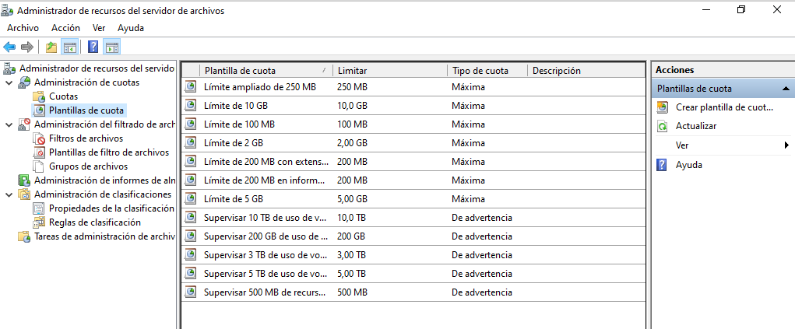

# Administrador de recursos del servidor de archivos (FSRM)
- [Administrador de recursos del servidor de archivos (FSRM)](#administrador-de-recursos-del-servidor-de-archivos-fsrm)
  - [Introducción](#introducción)
  - [Cuotas de carpeta](#cuotas-de-carpeta)
    - [Cuotas de volumen](#cuotas-de-volumen)
  - [Filtrado de archivos](#filtrado-de-archivos)
  - [FSRM con Powershell](#fsrm-con-powershell)
    - [Ejemplo creación de cuota](#ejemplo-creación-de-cuota)
    - [Ejemplo creación de filtro de archivos](#ejemplo-creación-de-filtro-de-archivos)

## Introducción
Se trata de un rol que nos permite configurar más cosas en los recursos, como cuotas de disco. Este rol se encuentra dentro de `Servicios de archivo y almacenamiento -> Servicios de iSCSI y archivo`.

Tras instalarlo podemos abrirlo desde las _Herramientas_ del _Administrador del servidor_:



**NOTA**: Para acceder al _Administrador_ desde fuera del servidor debemos:
- instalar la característica **_RSAT: Herramientas de servicios de archivo_**
- al abrir la herramienta, desde el menú `Acción -> Conectarse a otro equipo` debemos indicar el equipo remoto al que conectarnos
- debemos configurar el firewall del servidor para que permita el tráfico de FSRM: `Get-NetFirewallRule -Name "FSRM*" | Set-NetFIrewallRule -Enabled True`

Lo que podemos gestionar desde aquí es:
- Cuotas de disco
- Filtrado de archivos
- Informes de almacenamiento: podemos ver los informes generados automáticamente al configurar cuotas o filtrados
- Clasificaciones
- Tareas de administración de archivos

## Cuotas de carpeta
Permiten limitar la cantidad de espacio que un usuario puede utilizar en una carpeta compartida. Si se establecen el espacio disponible que a aparecerá al usuario no será el espacio real disponible en la carpeta sino el que él puede usar según establece su cuota.


Hay varias plantillas creadas que podemos usar o podemos crear nuestras propias plantillas de cuota. Para crear una nueva plantilla desde `Plantillas de cuota` seleccionamos en el `menú Acción -> Crear plantilla de cuota`:


En ellas se establece:
- el espacio máximo disponible para el usuario
- si no pueden superarlo (cuota máxima) o sí pueden pero les aparecerá una advertencia (cuota de advertencia)
- umbrales a partir de los cuales se le informará al usuario de que está cerca de llegar a su cuota. Para cada umbral indicaremos:
  - el % del espacio ocupado que activará el umbral
  - si se enviará un email a los administradores
  - si se enviará un email al usuario que ha superado el umbral
  - si se generará un evento
  - si se ejecutará un comando o script
  - si se generará un informe de almacenamiento

Si creamos una nueva plantilla es conveniente seleccionar en `Copiar propiedades` una plantilla similar a la que queremos crear para ahorrarnos trabajo ya que se copian en la nueva plantilla todas sus propiedades. También podemos empezar con una plantilla en blanco.

Para crear una nueva cuota a aplicar en una carpeta seleccionamos desde el `menú Acción -> Crear cuota`:


Lo que tenemos que completar es:
- Ruta: carpeta o volumen para el cual queremos definir una nueva cuota
- Crear cuota o Aplicar plantilla: aquí indicamos si la cuota es sólo para la carpeta indicada o queremos aplicarla también a todas sus subcarpetas (que será lo habitual)
- Derivar de plantilla o Definir propiedades: para utilizar una plantilla de cuota existente o crear una nueva cuota. Lo recomendado es trabajar sobre una plantilla ya creada.
- Resumen de las propiedades: aparece un resumen de las propiedades de la cuota a aplicar en la carpeta

### Cuotas de volumen
Además de establecer cuotas para una carpeta, que es lo más útil, podemos también limitar el espacio que los usuarios pueden utilizar de un volumen completo estableciendo cuotas del volumen. En este caso no es necesario instalar el _Administrador de recursos del servidor de archivos (FSRM)_. **NOTA**: no es conveniente establecer cuotas en la partición del sistema porque el sistema podría sobrepasar la cuota asignada durante el arranque.

Para establecer cuotas en un volumen desde su menú contextual seleccionamos `Propiedades` y vamos a la pestaña de `Cuota`:


Tenemos que activar la opción `Habilitar la administración de cuotas`. Las opciones que tenemos son:
- Denegar espacio en disco a usuarios que excedan el límite: si un usuario sobrepasa el límite asignado no puede escribir datos en el disco
- No limitar el uso de disco: por defecto no establecemos límites. Después los podemos especificar para usuarios concretos
- Limitar espacio en disco: ponemos límites por defecto para todos los usuarios. Indicaremos la cantidad de espacio a asignar por usuario y el nivel en el cual se le mostrará una advertencia
- Registrar un evento cuando un usuario supero su límite o su nivel de advertencia: se registra un evento en los casos indicados porque el administrador pueda tomar las medidas apropiadas

De este modo hemos establecido unas cuotas generales para todos los usuarios. Pero a a menudo querremos establecer cuotas sólo para determinados usuarios. Esto lo hacemos desde el botón de `Valores de cuota`. En la nueva ventana seleccionamos desde el `menú Cuota -> Nueva entrada de cuota...`, escogemos el usuario o usuarios a los cuales se aplicará la cuota que estamos creando y establecemos la cuota específica para ellos:


De este modo establecemos cuotas para una partición entera.

## Filtrado de archivos
Permite impedir que se almacenen en la carpeta compartida determinados tipos de archivo (vídeo, imágenes, ejecutables, ...).

Como con las cuotas hay creadas unas plantillas que podemos usar o podemos crear nuestras propias plantillas y configuraremos:
- el tipo de archivos a filtrar (hay creados varios tipos y podemos crear otros)
- si no podrán guardar el archivo que no pasa el filtro (filtrado activo) o sí pueden (filtrado pasivo)
- si se enviará un email a los administradores cuando un usuario intenta guardar un archivo que no pasa el filtro
- si se enviará un email al usuario
- si se generará un evento
- si se ejecutará un comando o script
- si se generará un informe de almacenamiento

## FSRM con Powershell
Una vez hemos instalado el rol de _Administración de recursos del servidor de archivos_ (FSRM, _File Server Resource Manager_) Se añaden a PowerShell unos comandos que tienen el prefijo fsrm. Algunos de los más útiles son:
- `Get-fsrmSetting`: devuelve o muestra la configuración de nuestro servidor de archivos
- `New-fsrmQuotaTemplate`: nos va a permitir crear una nueva plantilla de cuotas
- `New-fsrmAction`: nos permite definir una acción que utilizaremos una vez un usuario sobrepase el límite de umbral establecido
- `New-fsrmQuotaThreshold`: nos va a permitir establecer un umbral a partir del cual generaremos una acción (enviar un correo,  notificar un evento, etc.)
- `New-FsrmFileGroup`: nos permite definir un grupo de archivos para filtrar
- `New-FsrmFileScreenTemplate`: nos va a permitir crear una plantilla con los grupos que nosotros elijamos

Nos será de utilidad, definirnos variables para utilizarlas en los distintos comandos.

### Ejemplo creación de cuota
Vamos a definir una cuota para el recurso compartido _E:\Shares\Diseny_ que cuando el usuario supere el umbral del 85% registre un evento de warning informando de lo ocurrido.

Primero vamos a definirnos la variable _Action_ en la cual definiremos la acción a realizar cuando superemos el umbral, que va a ser registrarlo en el visor de eventos.
```powershell
$Action = New-FsrmAction -Type Event -EventType Warning -Body "El usuario [Source Io Owner] ha superado el 85% de la cuota de 10MB"
```

Después definimos el limite a partir del cual se generará la acción.
```powershell
$Limite = New-FsrmQuotaThreshold -Percentage 85 -Action $Action
```

Finalmente creamos la nueva plantilla asignándole el umbral que hemos establecido en la variable anterior.
```powershell
New-FsrmQuotaTemplate -Name "Limite para Diseny" -Size 50GB -Threshold $Limite
```

Una vez creada la plantilla, solo necesitamos asignarla.
```powershell
New-FsrmQuota -Path E:\Shares\Diseny -Template "Limite para Diseny"
```

### Ejemplo creación de filtro de archivos
Vamos a definir un grupo de archivos que usaremos para crear una plantilla que posteriormente asignaremos a un recurso compartido. Junto con todos los ejecutables, vamos a bloquear los archivos: *.pdf.

Lo primero que hacemos es crear el grupo de archivos para incluir los pdf, jpg y html.
```powershell
New-FsrmFileGroup -Name "Grupo de archivos pdf" -IncludePattern "*.pdf"
```

A continuación creamos la plantilla con los grupos que queremos bloquear. Como necesitamos incluir más de un grupo a nuestra plantilla (un array de grupos) se deben añadir separados por comas utilizando el parámetro @("grupo1", "grupo2",...,"grupoN"). Esto sirve igual si queremos añadir a un grupo mas de un tipo de archivos. 
```powershell
New-FsrmFileScreenTemplate -Name "Bloquear los ejecutables y los archivos .pdf" -IncludeGroup @("Grupo de archivos pdf, jpg y html", "Bloquear archivos ejecutables")
```

Finalmente solo quedaría añadir esta plantilla al recurso compartido que queramos.

En la página de Microsoft podemos ver los distintos [cmdlets FSMR](https://docs.microsoft.com/es-es/previous-versions/windows/powershell-scripting/jj900651(v%3dwps.620)).
