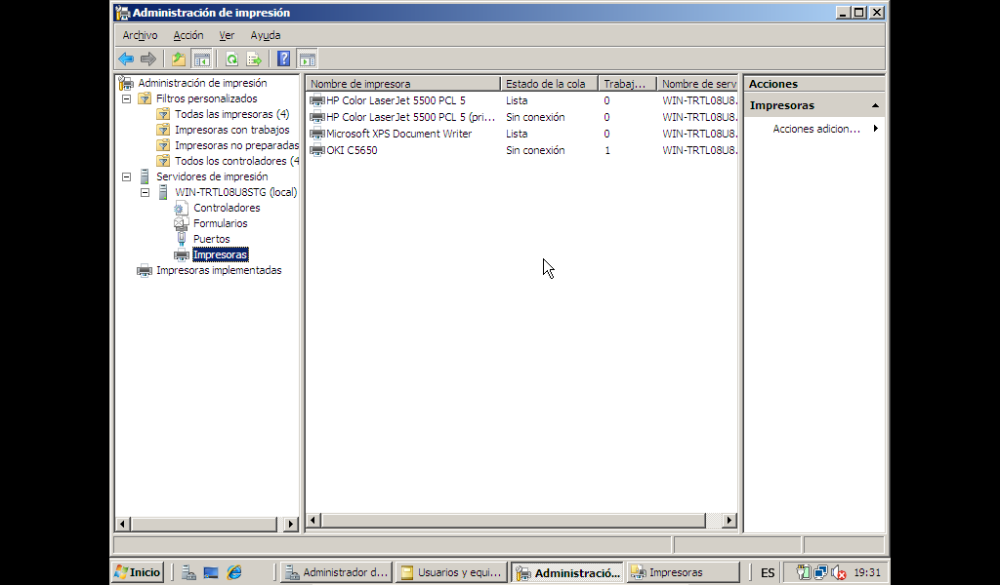

# Compartir impresoras
- [Compartir impresoras](#compartir-impresoras)
  - [Introducción](#introducción)
  - [Administración de impresión](#administración-de-impresión)
  - [Instalar una impresora](#instalar-una-impresora)
  - [Configurar una impresora](#configurar-una-impresora)
    - [Permisos de las impresoras](#permisos-de-las-impresoras)
  - [Opciones avanzadas de impresión](#opciones-avanzadas-de-impresión)
    - [Creación de un Grupo o Reserva de impresoras](#creación-de-un-grupo-o-reserva-de-impresoras)
    - [Prioridad de impresión](#prioridad-de-impresión)
    - [Trabajos muy largos](#trabajos-muy-largos)

## Introducción
Antes de ver cómo compartir una impresora vamos a aclara 3 conceptos que se usan en los sistemas de impresión en red:
- **Impresora**: dispositivo donde se imprimen los trabajos. Puede atender a una o más colas de impresión. Se trata de la impresora física que tenemos
- **Cola de impresión**: archivo donde se almacenan los trabajos a imprimir a la espera de ser enviados a la impresora. Una cola puede enviar sus trabajos a una o más impresoras. Esta es la impresora lógica que vemos en Windows
- **Servidor de impresión**: ordenador al que está conectada la impresora (localmente o por red) que le envía los trabajos de su cola de impresión. Un servidor puede gestionar una o más impresoras (y por tanto tendrá una o más colas de impresión)

Es posible utilizar una impresora conectada directamente a la red sin usar un servidor de impresión: cada cliente añade esa impresora (se crea su cola de impresión en su carpeta de _Impresoras_). Esto tiene ciertos inconvenientes:
- cada equipo tiene su propia cola de impresión y sólo ve los trabajos pendientes de imprimir desde ese equipo
- los usuarios no conocen el estado real de la impresora: los problemas sólo lo aparecerán en la cola de impresión del trabajo activo
- todo el procesamiento de los trabajos a imprimir se hace en el equipo local
- un usuario no sabe como está su trabajo en relación al total de trabajos a imprimir

Utilizar un servidor tiene las siguientes ventajas:
- el servidor administra la configuración del driver de la impresora
- hay una única cola de impresión donde aparecen todos los trabajos, por lo que cada usuario sabe como está su trabajo en relación al resto
- todos los equipos conocen el estado de la impresora y si hay errores
- parte del procesamiento de los trabajos se hace en el servidor de impresión

Si la impresión en nuestra empresa empieza a requerir muchos recursos siempre es mejor instalar uno (o más) servidores de impresión dedicados y liberar de esta tarea al DC. No hace falta que sean máquinas muy potentes puesto que sólo necesitarán suficiente RAM para procesar los trabajos y espacio vacío en disco para almacenar las colas de impresión.

Es recomendable dedicar un volumen del disco a la cola de impresión o, en todo caso, que no esté en el mismo volumen del sistema: la gestión de la cola implica crear muchos ficheros en disco que son eliminados muy rápidamente lo que favorece la fragmentación del volumen donde se encuentra.

## Administración de impresión
Podemos gestionar las impresoras desde el Panel de control, pero además tenemos la herramienta de _Administrador de impresión_ desde la cual podemos administrar centralizadamente todos los servidores de impresión y todas las impresoras instaladas. También facilitan la administración de las diferentes colas de impresión y nos notifican si una cola deja de procesar trabajo.

Algunas de las opciones que encontramos en la herramienta son:
- _Filtros personalizados_: desde aquí podemos ver rápidamente todas las impresoras, las que tienen trabajos pendientes, las que no están preparadas, etc. También podemos ver todos los controladores instalados. Podemos crear nuestros propios filtros
- _Servidores_: aparece cada servidor de impresión instalado en el _AD_. De cada uno de ellos podemos ver las impresoras que controla, puertos, controladores, etc.

En general instalar el servicio de impresión facilita la administración si tenemos muchas impresoras puesto que desde el _Administrador de impresión_ podemos ver todos los trabajos y las colas a la vez sin tener que abrir impresora por impresora. También facilita la gestión si tenemos más de un servidor de impresión en nuestro dominio.

También lo utilizaremos para desplegar las impresoras en los clientes como veremos en la próxima Unidad. Esto permitirá que a cada cliente que deseemos (en función del equipo o del usuario que inicia sesión) le aparezcan ya instaladas y configuradas las impresoras que utiliza sin ningún tipo de configuración por su parte.

## Instalar una impresora
Podemos instalar una nueva impresora de la misma forma que se hace en un cliente: desde el _Panel de control -> Impresoras -> Añadir impresora_.

También es posible (y recomendable) hacerlo desde la herramienta **_Administración de impresión_** que nos permitirá tener más control sobre las impresoras y los drivers instalados. 

**NOTA**: esta herramienta nos muestra el servidor local por lo que si queremos administrar otro servidor debemos instalar en él el rol de **`Servidor de impresión`** y después añadirlo desde el `menú Acción -> Agregar o quitar servidores` en la herramienta de _Administración de impresión_ del equipo en que lo queremos administrar. Podemos ver un vídeo de [cómo añadir una impresora](media/AddPrinter.mkv).

Lo normal es que se hubiera detectado la impresora en la primera pantalla pero como estamos instalando una impresora que no existe no es detectada (ni tampoco más adelante cuando le indicamos su IP).

En este ejemplo la impresora estaba conectada al switch y tiene su propia IP (es lo normal) aunque podría también haber estado conectada directamente al servidor.

## Configurar una impresora
Desde su menú contextual seleccionamos _Propiedades_ y podemos configurar la impresora. Las diferentes pestañas que encontramos son:
- **General**: nombre de la impresora y preferencias (papel vertical u horizontal, color o blanco y negro, pagines por hoja, etc)
- **Compartir**: si queremos compartir la impresora  indicaremos en qué equipo (el cliente o el servidor) se procesan los trabajos y si queremos publicar la impresora en el _Active Directory_ (esto permitirá que aparezca en la herramienta de _Buscar_). El botón de _Controladores adicionales_ nos permiten instalar los controladores que necesitarán los diferentes clientes
- **Puertos**: podemos ver y configurar los puertos de las diferentes impresoras. Normalmente se tratará de puertos TCP/IP
- **Opciones avanzadas**: cuando está disponible la impresora, tipo de controlador y gestión de la cola de impresión. Es importante no marcar la opción de _Imprimir directamente_ porque la aplicación que envía un documento a la impresora se quedará esperando a que termine la impresión para continuar.
- **Administración del color**: configuración del color
- **Configuración del dispositivo**: opciones adicionales de configuración
- **Seguridad**: lo veremos en el siguiente punto

### Permisos de las impresoras
Como para el resto de objetos los permisos de las impresoras se establecen desde su menú contextual seleccionando _Propiedades_ y yendo a la pestaña de _Seguridad_. Los permisos estándar sobre impresoras son 3:
- **Imprimir**: permite conectarse a la impresora y enviarle documentos para imprimir. También pausar, reanudar o cancelar los propios documentos
- **Administrar documentos**: permite pausar, reanudar y cancelar documentos de cualquier usuario y gestionar la cola de impresión
- **Administrar impresoras**: el usuario tiene control completo de la impresora

Cuando instalamos una impresora el grupo _Todos_ tiene por defecto permisos para imprimir en ella, el grupo _Creator Owner_ tiene permisos de Administrar documentos y los grupos de _Operadores de impresión_ y _de servidor_, _Usuarios avanzados_ y _Administradores_ tienen permisos de _Administrar la impresora_.

## Opciones avanzadas de impresión
Lo normal es instalar una cola de impresión por cada impresora de que disponemos, pero en ocasiones necesitamos hacer otro tipo de cosas.

### Creación de un Grupo o Reserva de impresoras
Se trata de una impresora lógica (una cola) conectada a varias impresoras físicas iguales o similares (tienen que utilizar el mismo driver).

Su objetivo es que todos los usuarios envíen sus trabajos a la única impresora que les aparece (una sola cola) y estos trabajos se enviarán a imprimir a la primera impresora física disponible de esta cola.

Lo que tenemos que hacer es instalar una impresora cómo hemos visto antes y una vez instalada, desde sus _Propiedades_ abrimos la pestaña **_Puertos_** y añadimos todos los puertos a los que tengamos conectada una impresora de este grupo. Para marcar más de un puerto tenemos que marcar la casilla de _Habilitar la cola de la impresora_ (o utilizar el botón derecho del ratón).

### Prioridad de impresión
Este caso lo usaremos cuando disponemos de una impresora pero queremos que un grupo de usuarios tenga preferencia sobre otros a la hora de imprimir.

Se puede modificar la prioridad de un trabajo de la cola para que se imprima antes de que otras. Para lo cual abrimos la impresora a la que hemos enviado el trabajo y se muestra la cola de trabajos pendientes. Desde el menú contextual del trabajo a modificar seleccionamos Propiedades y en la pestaña General podemos aumentar o reducir la prioridad del trabajo. También podemos programar en qué intervalo horario tiene que imprimirse el trabajo.

Pero es incómodo tener que hacer esto cada vez. Una opción mejor es crear varias impresoras lógicas (tantas como prioridades se quieran definir) de una única impresora física. Los pasos a seguir son:
1. instalamos la primera impresora con su puerto correspondiente
2. instalamos una nueva impresora en el mismo puerto de la impresora ya instalada
3. una vez instalada abrimos sus _Propiedades_ y en la pestaña de _Opciones avanzadas_ establecemos una **_Prioridad_** diferente para la nueva impresora. Será la prioridad que tengan por defecto los trabajos que se envían a esta impresora
4. establecemos los permisos de qué grupos pueden imprimir en cada impresora como necesitemos (podemos optar porque unos usuarios utilicen sólo la de baja prioridad y otros la otra o bien que todos los usuarios tengan acceso a las dos impresoras y sean ellos los que envíen los trabajos a una u otra impresora en función de la urgencia de los trabajos).

### Trabajos muy largos
A veces hay trabajos poco urgentes pero muy largos que cuando se impriman colapsarán la impresora durante bastante tiempo. Una opción es darles una prioridad muy baja para que sólo se impriman si no hay otro trabajo. El problema es que cuando empiezan no se pueden parar si llega otro trabajo más urgente.

Una mejor solución es crear una impresora lógica cómo hemos visto antes pero a la cual le asignamos una disponibilidad horaria en que no sea un problema imprimir (por ejemplo por las noches) de forma que de una misma impresora real tenemos una impresora lógica activa las 24 horas y otra impresora lógica activa sólo por las noches a la cual los usuarios envían los trabajos muy largos y poco urgentes.