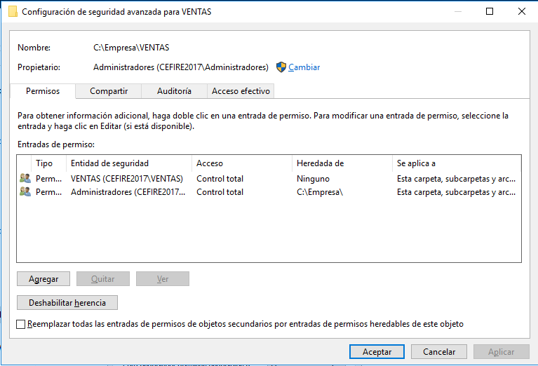
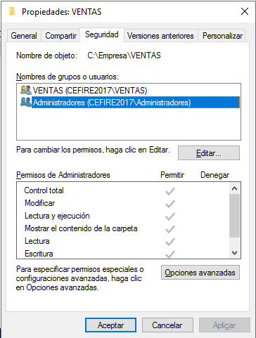

# Permisos y derechos
- [Permisos y derechos](#permisos-y-derechos)
  - [Introducción](#introducción)
  - [Permisos NTFS](#permisos-ntfs)
    - [Establecer permisos NTFS desde la terminal](#establecer-permisos-ntfs-desde-la-terminal)
    - [Propietarios de archivos y carpetas](#propietarios-de-archivos-y-carpetas)
    - [Permisos implícitos (heredados) y explícitos](#permisos-implícitos-heredados-y-explícitos)
    - [Deshabilitar la herencia](#deshabilitar-la-herencia)
    - [Permisos al copiar o mover archivos y carpetas](#permisos-al-copiar-o-mover-archivos-y-carpetas)
    - [Reglas de aplicación de permisos](#reglas-de-aplicación-de-permisos)
  - [Permisos SMB](#permisos-smb)
  - [Consideraciones sobre los permisos](#consideraciones-sobre-los-permisos)

## Introducción
Para establecer las acciones que un usuario (o grupo) puede o no llevar a cabo en el sistema se definen permisos y derechos:
- Un **derecho** es un atributo de un usuario que le permite realizar una acción que **afecta al sistema en conjunto**, no a un objeto o recurso concreto. En Windows hay un conjunto fijo de derechos y cada derecho tiene una lista de grupos y usuarios que lo tienen concedido.
- Un **permiso** es una característica de **cada recurso** del sistema que concede o no acceso a un usuario específico. Cada recurso tiene una lista con los usuarios y grupos que pueden acceder al mismo y qué tipo de acceso puede hacer cada uno de ellos (lectura, modificación, eliminación, ...)

Si hay un conflicto entre un permiso y un derecho tendrá prioridad el derecho: por ejemplo los usuarios miembros del grupo de _Operadores de copia de seguridad_ tienen derecho de hacer copia de seguridad de todos los archivos, incluso de los que no tienen permisos. Así mismo el _Administrador_ tiene derecho de tomar posesión de cualquier archivo, incluyendo sobre los que no tiene ningún permiso.

En la unidad 4 del primer bloque vimos cómo gestionar los permisos NTFS, que son los que posee cualquier fichero y carpeta de un sistema de archivos NTFS. Pero al compartir carpetas en una red Windows utilizaremos además otro tipo de permisos: los SMB que se aplican a cualquier recurso al que se accede a través de la red. Por tanto trabajaremos con dos tipos de permisos diferentes:
- **Permisos SMB**. Se establecen sólo sobre las carpetas compartidas. Sólo se aplican cuando accedemos a la carpeta a través de la red (no si lo hacemos localmente).
- **Permisos NTFS**. Un volumen con sistema de archivos NTFS permite establecer estos permisos para cualquier fichero o carpeta. Estos permisos se comprueban siempre, tanto si accedemos desde la red como localmente.

Los permisos SMB sólo se establecen para recursos compartidos, por lo tanto a carpetas. Los permisos NTFS se establecen para carpetas y también para archivos individuales.


Si un recurso tiene permisos SMB y NTFS se aplicará el más restrictivo (es decir que sólo podemos acceder o realizar cualquier acción sobre él si tenemos tanto permisos SMB como NTFS que nos los permitan).

## Permisos NTFS
Para cada carpeta o fichero podemos establecer gran número de permisos NTFS que nos permiten detallar qué puede hacer un usuario en esa carpeta o fichero:


Sin embargo normalmente no es necesario tanto detalle por lo que existen los llamados **permisos estándar** que son una agrupación de ellos para los casos más comunes. De ellos normalmente utilizaremos sólo 3 permisos estándar:
- **Lectura y ejecución**: permite leer el fichero o carpeta y mostrar su contenido. Si es un fichero ejecutable permite ejecutarlo y entrar dentro si es una carpeta. No permite modificar ni eliminar nada.
- **Modificar**: incluye el permiso anterior y además permite modificar el fichero o carpeta y crear ficheros nuevos (si es una carpeta). No permite cambiar los permisos ni tomar posesión de la carpeta o fichero. Tampoco eliminar subcarpetas ni archivos que contenga el recurso (si es una carpeta) pero sí eliminar el recurso en sí.
- **Control total**: incluye el permiso de _Modificar_ y además permite cambiar los permisos o el propietario del archivo o carpeta. En definitiva, permite hacer cualquier cosa con el fichero o carpeta.


Sin embargo tenemos 6 permisos _estándar_ que son, además de los 3 vistos:
- **Mostrar el contenido de la carpeta**: se aplica sólo a carpetas y permite ver los nombres de ficheros y subcarpetas que tiene esta carpeta
- **Lectura**: para una carpeta permite ver sus archivos y subcarpetas además de sus atributos, el propietario y sus permisos. Para un fichero permite además verlo
- **Escritura**: este lo usaremos alguna vez sobre una carpeta y permite crear nuevos archivos y subcarpetas (pero no ver lo que hay si no se tiene permiso de _Lectura_). Sobre un fichero permite sobreescribirlo y cambiar sus atributos.

Recordad que al aplicar un permiso sobre una carpeta este permiso se hereda a todos los ficheros y subcarpetas que contenga, ya que es la opción predeterminada a otorgar un permiso. Sin embargo podemos modificarlo en las _'Opciones avanzadas'_ para hacer que se aplique, por ejemplo, sólo a esta carpeta (con lo que no se heredaría). Las opciones que tenemos son:


### Establecer permisos NTFS desde la terminal
El comando incluido en el sistema para establecer los permisos NTFS desde la línea de comandos es `icacls` (aunque tenemos muchas herramientas como xcalcs o subinacl que también permiten hacerlo pero tenemos que instalarlas puesto que no lo están por defecto).

Vamos a ver algunos ejemplos de cómo utilizarlo:
- Para dar al grupo Ventas el permiso de Control total sobre la carpeta Prueba:
```powershell
icacls D:\Pruebas /grant INFO2\Ventas:(F)
```
- Para quitar la herencia en la carpeta Prueba:
```powershell
icacls D:\Pruebas /inheritance:d
```
- Para quitar todos los permisos al grupo Usuarios sobre la carpeta Prueba:
```powershell
icacls D:\Pruebas /remove:g Usuarios
```

Como podemos ver si utilizamos un grupo creado por nosotros tenemos que poner antes el nombre del dominio pero no para grupos predeterminados. La letra para indicar los permisos estándar es F (Full, control total), W (Write, escribir) y R (Read, leer). Para modificar pondremos (R,W).

### Propietarios de archivos y carpetas
A crear un archivo o carpeta se pone como propietario del mismo el usuario que lo crea. El Administrador y el propietario de un objeto pueden transferir su propiedad a otro usuario o grupo. Para hacerlo desde el `menú contextual -> Propiedades -> pestaña Seguridad -> botón Opciones avanzadas`:


Podemos ver el propietario actual y cambiarlo desde el botón **`Cambiar`**.
 
### Permisos implícitos (heredados) y explícitos
Al crear una carpeta o archivo este hereda los permisos de la carpeta en la que se crea. Y también si cambiamos los permisos de una carpeta, estos cambios se propagan a todas las subcarpetas y archivos que contiene.

Estos permisos se llaman _implícitos_ o _heredados_ y son muy útiles porque evitan que sea necesario asignar los permisos a cada carpeta y archivo del equipo. Desde la ventana de opciones avanzadas se puede ver si un permiso es heredado o explícito:



En este ejemplo el permiso del grupo _'Administradores'_ es heredado y el del grupo _'Ventas'_ es explícito. También se ve desde la pestaña de Seguridad que los heredados están deshabilitados:



El inconveniente que tienen es que los permisos heredados no podemos quitarlos a menos que deshabilitemos la herencia en la carpeta.

### Deshabilitar la herencia
Si queremos modificar los permisos heredados de una carpeta debemos deshabilitar la herencia desde la ventana de _'Opciones avanzadas'_:


Al pulsar el botón de '_Deshabilitar herencia_' nos pregunta qué hacer con los permisos heredados:
- **Convertirlos en permisos explícitos**: es la opción que escogeremos normalmente. Deja los permisos que hay ahora pero convertidos en explícitos y así podemos modificarlos o eliminarlos
- **Quitar todos los permisos heredados**: los elimina directamente (normalmente no lo haremos ya que no querremos eliminar los permisos de _SYSTEM_, _Administrador_, etc.)

Si modifican los permisos de la carpeta padre, los nuevos permisos ya no se heredarán en esta carpeta.

Como hemos visto antes, cuando asignamos un nuevo permiso a una carpeta podemos hacer que no se herede en las carpetas y archivos que contiene si lo hacemos desde opciones avanzadas:


Además de la opción predeterminada que es que el permiso se aplique a '_Esta carpeta, subcarpetas y archivos_' podemos elegir otras opciones como que sólo se aplique a '_Esta carpeta_' y así evitamos que lo hereden las subcarpetas y archivos que contiene.

### Permisos al copiar o mover archivos y carpetas
Si copiamos un archivo o carpeta a otra ubicación se quitan sus permisos y heredará los permisos del lugar donde se copia.

Si se mueve un archivo o carpeta dentro del mismo volumen conserva sus permisos pero si es a otro volumen pasa igual que en la copia.

### Reglas de aplicación de permisos
- Los permisos son acumulativos: un usuario posee todos los permisos otorgados a él más todos los otorgados a los grupos a que pertenece.
- Los usuarios y grupos que no aparecen en la lista de permisos no tienen ningún permiso sobre ese archivo o carpeta.
- En caso de conflicto los permisos explícitos tienen prioridad sobre los heredados y los permisos de denegación sobre los de concesión.
- Un permiso negativo (de denegación) tiene prioridad sobre un positivo (de concesión). Por ejemplo si a un usuario que pertenece a un grupo con permisos sobre una carpeta le denegamos el permiso no tendrá el permiso sobre la carpeta. Así mismo si otorgamos permiso al usuario pero alguno de los grupos a los que pertenece tiene denegado ese permiso el usuario no tendrá el permiso porque la denegación tiene prioridad sobre la concesión.

## Permisos SMB
Al compartir un recurso en la red podemos definir los permisos para la utilización del recurso. Estos permisos varían en función del protocolo por el cual se comparte el recurso. Si el protocolo es NFS veremos los permisos que podemos asignar en el tema referente a los permisos en Linux. Normalmente el protocolo que usaremos es CIFS/SMB que es el que utiliza Windows de forma predeterminada en sus redes.

Para compartir una carpeta vamos a sus _Propiedades_ y entramos en la pestanya _Compartir_:


Desde el botón de **_Uso compartido avanzado_** podemos establecer los permisos SMB que son:
- **Leer** (o _Lectura_ si utilizamos el asistente para compartir): da permiso para acceder, es decir, entrar dentro de las carpetas y abrir y leer los ficheros. Equivale a _Lectura y ejecución_ en NTFS
- **Cambiar** (o _Lectura y escritura_): otorga permiso para modificar archivos y subcarpetes, eliminar y crear nuevas. Es el equivalente a _Modificar_ en NTFS
- **Control total** (o _Propietario_): otorga todos los permisos sobre el recurso, es decir, permite también cambiar los permisos

Cada permiso incluye el anterior (si un grupo tiene el permiso de _Control total_ también tiene el de _Cambiar_ y si un grupo tiene este también tiene el de _Leer_).


Cuando establecemos los permisos tenemos la opción de **Permitir** o **Denegar**:


Siempre intentaremos no utilizar la opción de denegar, esta opción tiene prioridad sobre _Permitir_.

Si en lugar de entrar en _Uso compartido avanzado_ compartimos la carpeta desde el botón de **_Compartir_** los permisos que podemos establecer son _Lectura_ o _Lectura y escritura_. Si lo hacemos así **se añadirán también esos permisos en NTFS automáticamente** (lo cual no siempre es lo que queremos).

Hay que recordar que los permisos SMB sólo se aplican cuando el usuario accede a la carpeta compartida desde la red. Si accede localmente estos permisos no se tienen en cuenta.

## Consideraciones sobre los permisos
- Siempre daremos permisos a grupos y no a usuarios individuales puesto que así será mucho más fácil su administración. 
- Intentaremos no dar nunca permisos al grupo _Todos_, mejor darlos al grupo _Usuarios_ o _Usuarios del dominio_.
- Intentaremos no utilizar la opción de _denegar_, especialmente sobre grupos genéricos como _Usuarios_ o _Todos_, puesto que esta opción tiene prioridad sobre _Permitir_. Por ejemplo si permitimos el permiso de _Control total_ al usuario _Administrador_ pero lo denegamos para el grupo _Todos_, como el _Administrador_ también pertenece a este grupo estamos dándole y quitándole el permiso y denegar tiene prioridad con lo cual no tendría ningún permiso sobre el recurso.
- En caso de no marcar ningún permiso en un grupo este no tendría ningún permiso. En este caso es mejor quitar ese grupo

