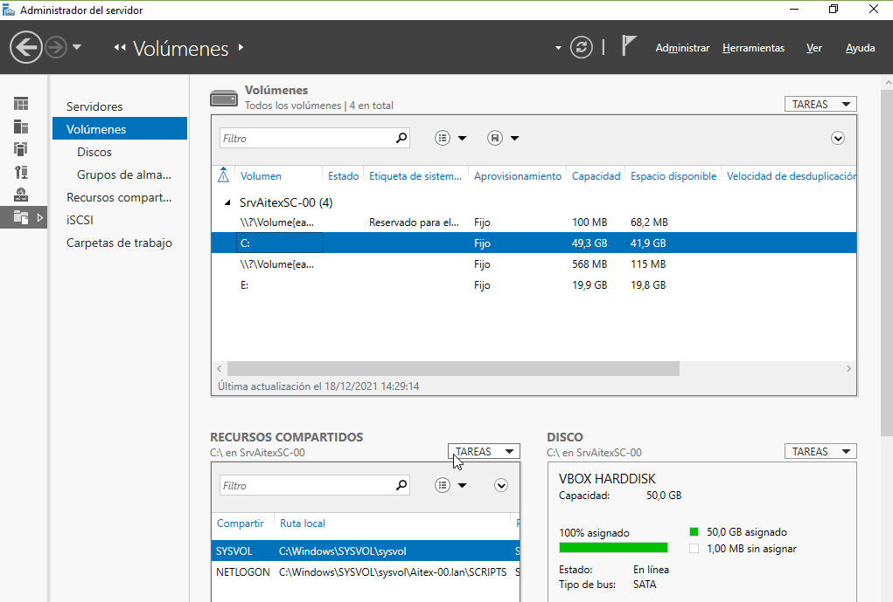
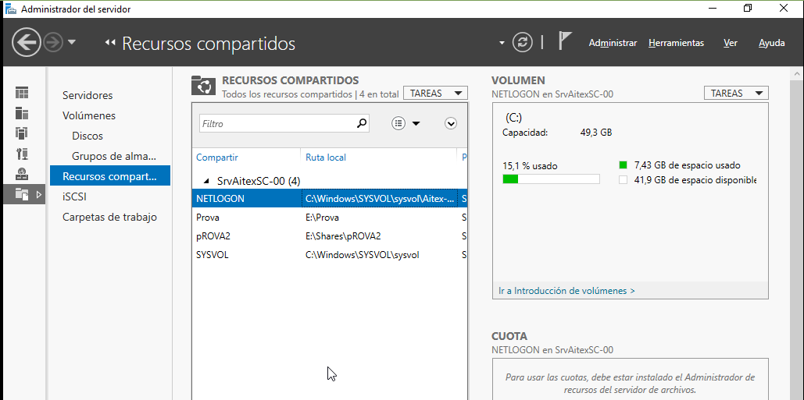
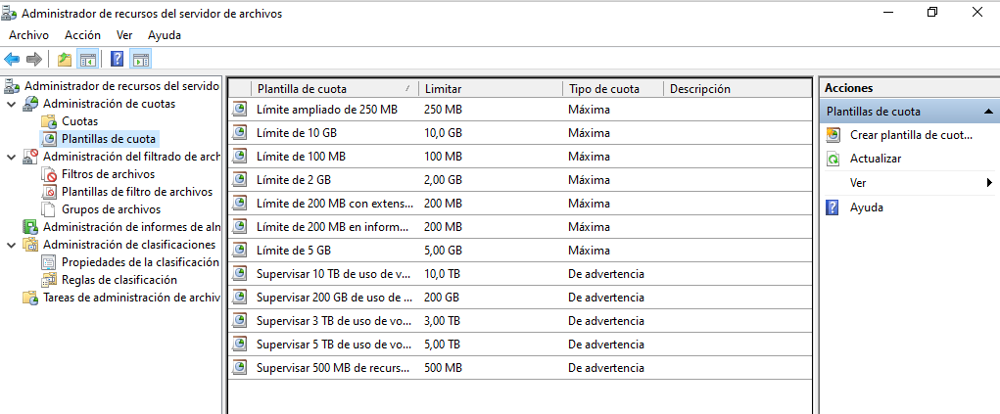
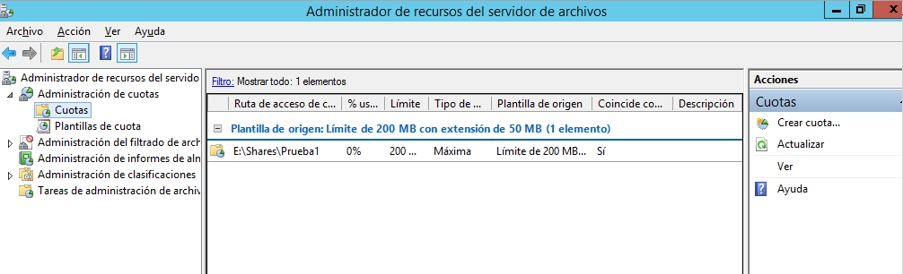
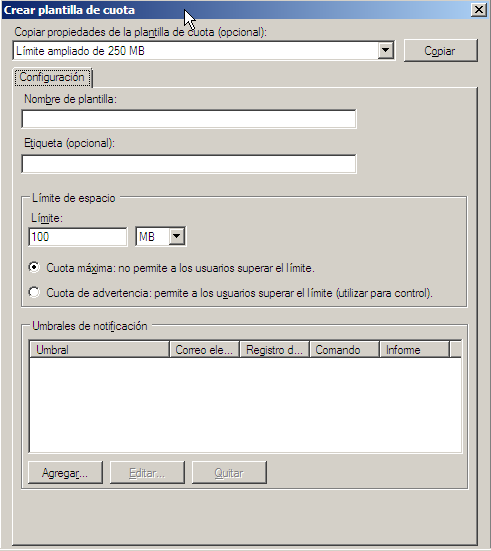
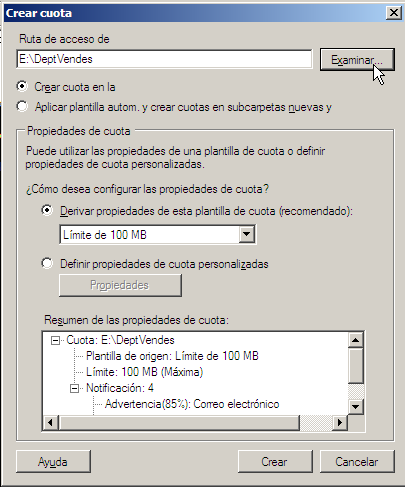
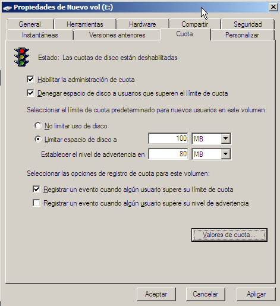
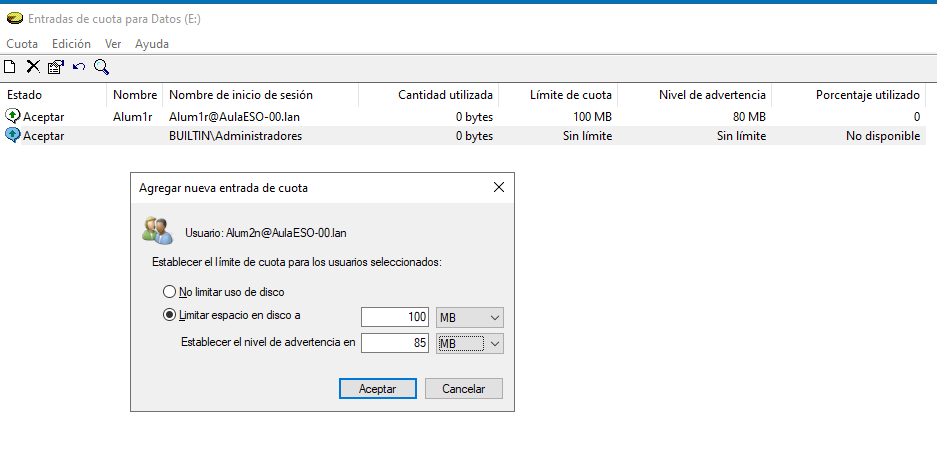

# Servicios de archivo y almacenamiento
- [Servicios de archivo y almacenamiento](#servicios-de-archivo-y-almacenamiento)
  - [Introducción](#introducción)
  - [Crear un recurso compartido](#crear-un-recurso-compartido)
    - [Compartir una carpeta desde la terminal](#compartir-una-carpeta-desde-la-terminal)
    - [Publicar una carpeta compartida](#publicar-una-carpeta-compartida)
  - [Grupos de almacenamiento](#grupos-de-almacenamiento)
  - [iSCSI](#iscsi)
    - [Utilizar discos iSCSI](#utilizar-discos-iscsi)
    - [Proporcionar discos iSCSI](#proporcionar-discos-iscsi)
  - [Carpetas de trabajo](#carpetas-de-trabajo)
  - [Administrador de recursos del servidor de archivos (FSRM)](#administrador-de-recursos-del-servidor-de-archivos-fsrm)
    - [Cuotas de carpeta](#cuotas-de-carpeta)
      - [Cuotas de volumen](#cuotas-de-volumen)
    - [Filtrado de archivos](#filtrado-de-archivos)
    - [FSRM con Powershell](#fsrm-con-powershell)

## Introducción
Se trata de una herramienta desde la que gestionar todo el almacenamiento del servidor. Accedemos a ella desde una opción del menú de la izquierda del _Administrador del servidor_. Tiene varias opciones:
- Servidores: para ver todos los servidores que estamos gestionando
- Volúmenes: aparecen todos los volúmenes que hay creados en el servidor. También podemos filtrarlos por _Discos_ o por _Grupos de almacenamiento_. Para el volumen seleccionado muestra información de su disco y los recursos compartidos y discos virtuales iSCSI creados en él:



- Recursos compartidos: aquí podemos ver los recursos compartidos en cualquier volumen e información sobre ellos:



- iSCSI: aquí nos muestra los discos iSCSI
- Carpetas de trabajo: se utilizan para poder tener sincronizados los datos que se utilizan en dispositivos que a veces necesitan acceso a ellos sin estar conectados a la red de la empresa

## Crear un recurso compartido
Desde las _Tareas_ podemos gestionar los volúmenes (extender o eliminar un volumen, formatearlo, comprobar el sistema de archivos, ...) y crear un nuevo recurso compartido.

Podemos compartir recursos usando el protocolo SMB/CIFS (el nativo de Windows) o NFS (usado en GNU/Linux). Además desde la opción _Avanzado_ podemos establecer **cuotas de disco** y otras características.

Si compartimos un recurso desde a opción _Básico_ nos pregunta dónde crear la carpeta, su nombre y los permisos NTFS que tendrá. Por defecto en SMB asigna el permiso _Control total_ a _Todos_. Podemos _personalizar_ tanto los permisos NTFS como los SMB desde el asistente o después de crear el recurso, desde el `botón derecho -> Propiedades`.

Si instalamos el **_Administrador de recursos del servidor de archivos_** podemos crear un nuevo recurso compartido usando la opción _Avanzado_ que además de las opciones del _Básico_ nos permite indicar:
- el uso de esa carpeta (si es para archivos de un usuario -como su carpeta particular-, de un grupo -ficheros que usa un grupo de usuarios-, archivos de copia de seguridad o archivos de programa)
- si queremos establecer cuotas en la carpeta (lo veremos más adelante).

### Compartir una carpeta desde la terminal
Algunos comandos de utilidad para trabajar con carpetas compartidas son:
- `New-SmbShare -Name <recursocompartido> -Path <ruta a la carpeta> <Permisos> <usuario o grupo>`: compaarte una carpeta
- `Remove-SmbShare -Name <recursocompartido> -force`: quita la compartición de una carpeta
- `Get-FileShare`: muestra las carpetas compartidas que tenemos
- `Get-FileShare -name <recursocompartido> | select *`: muestra todas las propiedades de una carpeta compartida
- `Get-SmbShareAccess <recursocompartido>`: muestra los permisos SMB sobre dicho recurso compartido

Ejemplo:
`New-SMBShare -Name Datos -Path "C:\Datos" -FullAccess "Admins. del dominio" -ReadAccess "Usuarios"`: comparte el directorio C:\Datos con el nombre Datos y le asigna permisos SMB de _Control total_ al grupo _Admins. del dominio_ y permisos de _Leer_ al grupo _Usuarios_.

### Publicar una carpeta compartida
Si queremos podemos publicar la carpeta compartida desde _Usuarios y equipos de Active Directory_ para que los usuarios la puedan encontrar más fácilmente (la pueden buscar con la herramienta de _Buscar en Active Directory_).

Para ello vamos a la OU donde queramos publicarla y escogemos `Nuevo -> Carpeta compartida`. Indicamos el nombre de la carpeta compartida y su ruta y podemos añadir palabras clave que ayuden al usuario a encontrarla. 

NOTA: este proceso no crea la carpeta compartida. La debemos haber creado y compartido previamente

## Grupos de almacenamiento
Los grupos de almacenamiento (_storage pools_) permiten gestionar los discos de manera más eficiente. Su funcionamiento es similar a los discos LVM de Linux y los pasos a realizar son:


- Creamos un **grupo de almacenamiento** al que le asignamos los discos físicos que queramos, sin particionar. Posteriormente podremos añadir más discos. A la hora de añadir cada disco tenemos 3 opciones:
  - Automático: el espacio del disco forma parte del grupo y se pueden guardar cosas en él
  - Reserva activa (_Hot spare_): el espacio del disco no se suma a los demás sino que queda a la espera y entrará a formar parte del volumen si otro disco falla. Esta opción sólo tiene sentido se hemos elegido RAID1 o RAID5
  - Manual: su espacio no se suma hasta que manualmente lo asignemos
- En ese grupo creamos un **espacio de almacenamiento** o _disco virtual_ con el que trabajaremos, que se comportará como un disco real que podremos ver desde el _Administrador de discos_. Al crearlo especificaremos:
  - Distribución de almacenamiento: nos permite elegir entre un disco _Simple_ (que realizará RAID0 entre todos los discos físicos del grupo), _Mirror_ (RAID1) o _Parity_ (RAID5)
  - Aprovisionamiento: elegimos si será _Delgado_ o _Fijo_. La primera opción es como los discos dinámicos de Virtualbox donde no se asigna al disco todo su espacio sino que se le va asignando según lo va necesitando
  - Reconocimiento de contenedor: podemos marcarlo si los discos están en diferentes chasis JBOD (_Just a Brunch Of Disks_) y en ese caso se encarga de que tengamos tolerancia a fallos a nivel de chasis
  - Tamaño: el espacio que tendrá este disco virtual (del total del grupo) 
- En el disco creado creamos un nuevo **volumen** como si se tratara de un disco real, al que se asignaremos el espacio que queramos y su sistema de ficheros (NTFS o ReFS)

Podéis ver un ejemplo de uso de grupos de almacenamiento en las páginas [Grupos de almacenamiento](https://blog.ragasys.es/grupos-de-almacenamiento-storage-pool-en-ms-windows-server-2016) y [Espacio de almacenamiento](https://blog.ragasys.es/espacio-de-almacenamiento-storage-space-tipo-parity-o-raid-5-en-ms-windows-server-2016) de RAGASYS SISTEMAS o en muchas otras páginas en internet.

Los grupos de almacenamiento nos permiten realizar en caliente:
- añadir o eliminar discos físicos de un grupo de almacenamiento (lo que cambiará su tamaño)
- redimensionar un disco virtual
- redimensionar un volumen

También permiten, si en nuestro grupo de almacenamiento tenemos discos tanto HDD como SSD, crear discos por capas que nos permita utilizar volúmenes que requieran mucha velocidad utilizando discos SSD y volúmenes que no requieran tanta velocidad utilizar los discos HDD. De manera interna al crear un disco por capas con diferente hardware (HDD y SSD) almacenará los datos que se estén utilizando con mucha frecuencia en el disco SSD para que funcionen más eficientemente y los que se usen con menos frecuencia en el disco HDD.

Podemos crear un espacio de almacenamiento con Powershell:
```powershell
$MyPhysicalDisks = Get-PhysicalDisk -CanPool $true
NewStoragePool -FriendlyName MiGrupoAlm -StorageSubsystemFriendlyName "Windows Storage*" -PhysicalDisks MyPhysicalDisks -ProvisioningTypeDefault Thin -Verbose
```

## iSCSI
iSCSI (Abreviatura de Internet SCSI) es un estándar que permite el uso del protocolo SCSI sobre redes TCP/IP. iSCSI es un protocolo de la capa de transporte definido en las especificaciones SCSI-3.

La adopción del iSCSI en entornos de producción corporativos se ha acelerado gracias al aumento del Gigabit Ethernet ya que es menos costosa y está resultando una alternativa efectiva a las soluciones SAN basadas en Canal de fibra. (Fuente [Wikipedia](https://en.wikipedia.org/wiki/ISCSI)).

Windows Server permite utilizar como almacenamiento una cabina de discos SAN y también puede emular una para proporcionar su almacenamiento a otros equipos.

### Utilizar discos iSCSI
Si tenemos un dispositivo que proporciona discos iSCSI (cabina de discos o equipo con el software específico para ello) podemos utilizarlos en cualquier equipo. Para ello arrancamos el servicio **_Iniciador iSCSI_** (`Set-Service -Name MSiSCSI -StartupType Automatic`).

A continuación iniciamos el programa _iniciador iSCSI_ (_iscsicpl.exe_) y en la pestaña _Descubrir_ buscamos el servidor de almacenamiento configurado en nuestra red y conectamos el disco, configurando la interfaz de red por la que se conectará al mismo.

Con esto ya tenemos un nuevo espacio de almacenamiento en nuestra máquina que deberemos configurar desde el _Administrador de discos_, activándolo y creando en el mismo las particiones y sistemas de archivo que deseemos.

Recordad que para obtener un buen rendimiento la red con la que nos conectamos a los discos iSCSI debe ser una red independiente de la LAN de nuestra empresa.

### Proporcionar discos iSCSI
Un equipo con Windows Server puede convertirse en un dispositivo de almacenamiento que proporcione discos iSCSI a otros equipos de nuestra red. Para ello se debe instalar el rol de `Servidor de destino iSCSI` (se encuentra dentro de _Servicios de almacenamiento_).

Una vez instalado crearemos en este servidor uno o más discos virtuales (desde `Administrador del servidor -> Servicios de archivo y almacenamiento -> iSCSI`) y configuraremos los servidores que podrán conectarse a él (_iniciadores iSCSI_).

Podéis encontrar muchas páginas de internet donde explican el proceso, como [¿Cómo configurar y conectar un disco iSCSI en Windows Server?](https://informaticamadridmayor.es/tips/como-configurar-y-conectar-un-disco-iscsi-en-windows-server/).

## Carpetas de trabajo
Permiten tener sincronizados los archivos de un usuario entre sus distintos dispositivos. Sería una especie de **_OneDrive_** pero gestionado por nosotros.

Podemos encontrar información de cómo implementarlas en la web de [Microsoft](https://docs.microsoft.com/es-es/windows-server/storage/work-folders/deploy-work-folders).

## Administrador de recursos del servidor de archivos (FSRM)
Se trata de un rol que nos permite configurar más cosas en los recursos, como cuotas de disco. Este rol se encuentra dentro de `Servicios de archivo y almacenamiento -> Servicios de iSCSI y archivo`.

Tras instalarlo podemos abrirlo desde las _Herramientas_ del _Administrador del servidor_:



**NOTA**: Para acceder al _Administrador_ desde fuera del servidor debemos:
- instalar la característica **_RSAT: Herramientas de servicios de archivo_**
- al abrir la herramienta, desde el menú `Acción -> Conectarse a otro equipo` debemos indicar el equipo remoto al que conectarnos
- debemos configurar el firewall del servidor para que permita el tráfico de FSRM: `Get-NetFirewallRule -Name "FSRM*" | Set-NetFIrewallRule -Enabled True`

Lo que podemos gestionar desde aquí es:
- Cuotas de disco
- Filtrado de archivos
- Informes de almacenamiento: podemos ver los informes generados automáticamente al configurar cuotas o filtrados
- Clasificaciones
- Tareas de administración de archivos

### Cuotas de carpeta
Permiten limitar la cantidad de espacio que un usuario puede utilizar en una carpeta compartida. Si se establecen el espacio disponible que a aparecerá al usuario no será el espacio real disponible en la carpeta sino el que él puede usar según establece su cuota.



Hay varias plantillas creadas que podemos usar o podemos crear nuestras propias plantillas de cuota. Para crear una nueva plantilla desde `Plantillas de cuota` seleccionamos en el `menú Acción -> Crear plantilla de cuota`:



En ellas se establece:
- el espacio máximo disponible para el usuario
- si no pueden superarlo (cuota máxima) o sí pueden pero les aparecerá una advertencia (cuota de advertencia)
- umbrales a partir de los cuales se le informará al usuario de que está cerca de llegar a su cuota. Para cada umbral indicaremos:
  - el % del espacio ocupado que activará el umbral
  - si se enviará un email a los administradores
  - si se enviará un email al usuario que ha superado el umbral
  - si se generará un evento
  - si se ejecutará un comando o script
  - si se generará un informe de almacenamiento

Si creamos una nueva plantilla es conveniente seleccionar en `Copiar propiedades` una plantilla similar a la que queremos crear para ahorrarnos trabajo ya que se copian en la nueva plantilla todas sus propiedades. También podemos empezar con una plantilla en blanco.

Para crear una nueva cuota a aplicar en una carpeta seleccionamos desde el `menú Acción -> Crear cuota`:



Lo que tenemos que completar es:
- Ruta: carpeta o volumen para el cual queremos definir una nueva cuota
- Crear cuota o Aplicar plantilla: aquí indicamos si la cuota es sólo para la carpeta indicada o queremos aplicarla también a todas sus subcarpetas (que será lo habitual)
- Derivar de plantilla o Definir propiedades: para utilizar una plantilla de cuota existente o crear una nueva cuota. Lo recomendado es trabajar sobre una plantilla ya creada.
- Resumen de las propiedades: aparece un resumen de las propiedades de la cuota a aplicar en la carpeta

#### Cuotas de volumen
Además de establecer cuotas para una carpeta, que es lo más útil, podemos también limitar el espacio que los usuarios pueden utilizar de un volumen completo estableciendo cuotas del volumen. En este caso no es necesario instalar el _Administrador de recursos del servidor de archivos (FSRM)_. **NOTA**: no es conveniente establecer cuotas en la partición del sistema porque el sistema podría sobrepasar la cuota asignada durante el arranque.

Para establecer cuotas en un volumen desde su menú contextual seleccionamos `Propiedades` y vamos a la pestaña de `Cuota`:



Tenemos que activar la opción `Habilitar la administración de cuotas`. Las opciones que tenemos son:
- Denegar espacio en disco a usuarios que excedan el límite: si un usuario sobrepasa el límite asignado no puede escribir datos en el disco
- No limitar el uso de disco: por defecto no establecemos límites. Después los podemos especificar para usuarios concretos
- Limitar espacio en disco: ponemos límites por defecto para todos los usuarios. Indicaremos la cantidad de espacio a asignar por usuario y el nivel en el cual se le mostrará una advertencia
- Registrar un evento cuando un usuario supero su límite o su nivel de advertencia: se registra un evento en los casos indicados porque el administrador pueda tomar las medidas apropiadas

De este modo hemos establecido unas cuotas generales para todos los usuarios. Pero a a menudo querremos establecer cuotas sólo para determinados usuarios. Esto lo hacemos desde el botón de `Valores de cuota`. En la nueva ventana seleccionamos desde el `menú Cuota -> Nueva entrada de cuota...`, escogemos el usuario o usuarios a los cuales se aplicará la cuota que estamos creando y establecemos la cuota específica para ellos:



De este modo establecemos cuotas para una partición entera.

### Filtrado de archivos
Permite impedir que se almacenen en la carpeta compartida determinados tipos de archivo (vídeo, imágenes, ejecutables, ...).

Como con las cuotas hay creadas unas plantillas que podemos usar o podemos crear nuestras propias plantillas y configuraremos:
- el tipo de archivos a filtrar (hay creados varios tipos y podemos crear otros)
- si no podrán guardar el archivo que no pasa el filtro (filtrado activo) o sí pueden (filtrado pasivo)
- si se enviará un email a los administradores cuando un usuario intenta guardar un archivo que no pasa el filtro
- si se enviará un email al usuario
- si se generará un evento
- si se ejecutará un comando o script
- si se generará un informe de almacenamiento

### FSRM con Powershell
Una vez hemos instalado el rol de _Administración de recursos del servidor de archivos_ (FSRM, _File Server Resource Manager_) Se añaden a PowerShell unos comandos que tienen el prefijo fsrm. Algunos de los más útiles son:
- `Get-fsrmSetting`: devuelve o muestra la configuración de nuestro servidor de archivos
- `New-fsrmQuotaTemplate`: nos va a permitir crear una nueva plantilla de cuotas
- `New-fsrmAction`: nos permite definir una acción que utilizaremos una vez un usuario sobrepase el límite de umbral establecido
- `New-fsrmQuotaThreshold`: nos va a permitir establecer un umbral a partir del cual generaremos una acción (enviar un correo,  notificar un evento, etc.)
- `New-FsrmFileGroup`: nos permite definir un grupo de archivos para filtrar
- `New-FsrmFileScreenTemplate`: nos va a permitir crear una plantilla con los grupos que nosotros elijamos

Nos será de utilidad, definirnos variables para utilizarlas en los distintos comandos.

**Ejemplo creación de cuota**
Vamos a definir una cuota para el recurso compartido _E:\Shares\Diseny_ que cuando el usuario supere el umbral del 85% registre un evento de warning informando de lo ocurrido.

Primero vamos a definirnos la variable _Action_ en la cual definiremos la acción a realizar cuando superemos el umbral, que va a ser registrarlo en el visor de eventos.
```powershell
$Action = New-FsrmAction -Type Event -EventType Warning -Body "El usuario [Source Io Owner] ha superado el 85% de la cuota de 10MB"
```

Después definimos el limite a partir del cual se generará la acción.
```powershell
$Limite = New-FsrmQuotaThreshold -Percentage 85 -Action $Action
```

Finalmente creamos la nueva plantilla asignándole el umbral que hemos establecido en la variable anterior.
```powershell
New-FsrmQuotaTemplate -Name "Limite para Diseny" -Size 50GB -Threshold $Limite
```

Una vez creada la plantilla, solo necesitamos asignarla.
```powershell
New-FsrmQuota -Path E:\Shares\Diseny -Template "Limite para Diseny"
```

**Ejemplo creación de filtro de archivos**
Vamos a definir un grupo de archivos que usaremos para crear una plantilla que posteriormente asignaremos a un recurso compartido. Junto con todos los ejecutables, vamos a bloquear los archivos: *.pdf.

Lo primero que hacemos es crear el grupo de archivos para incluir los pdf, jpg y html.
```powershell
New-FsrmFileGroup -Name "Grupo de archivos pdf" -IncludePattern "*.pdf"
```

A continuación creamos la plantilla con los grupos que queremos bloquear. Como necesitamos incluir más de un grupo a nuestra plantilla (un array de grupos) se deben añadir separados por comas utilizando el parámetro @("grupo1", "grupo2",...,"grupoN"). Esto sirve igual si queremos añadir a un grupo mas de un tipo de archivos. 
```powershell
New-FsrmFileScreenTemplate -Name "Bloquear los ejecutables y los archivos .pdf" -IncludeGroup @("Grupo de archivos pdf, jpg y html", "Bloquear archivos ejecutables")
```

Finalmente solo quedaría añadir esta plantilla al recurso compartido que queramos.

En la página de Microsoft podemos ver los distintos [cmdlets FSMR](https://docs.microsoft.com/es-es/previous-versions/windows/powershell-scripting/jj900651(v%3dwps.620)).

