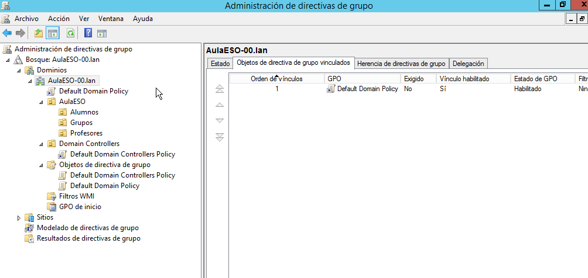
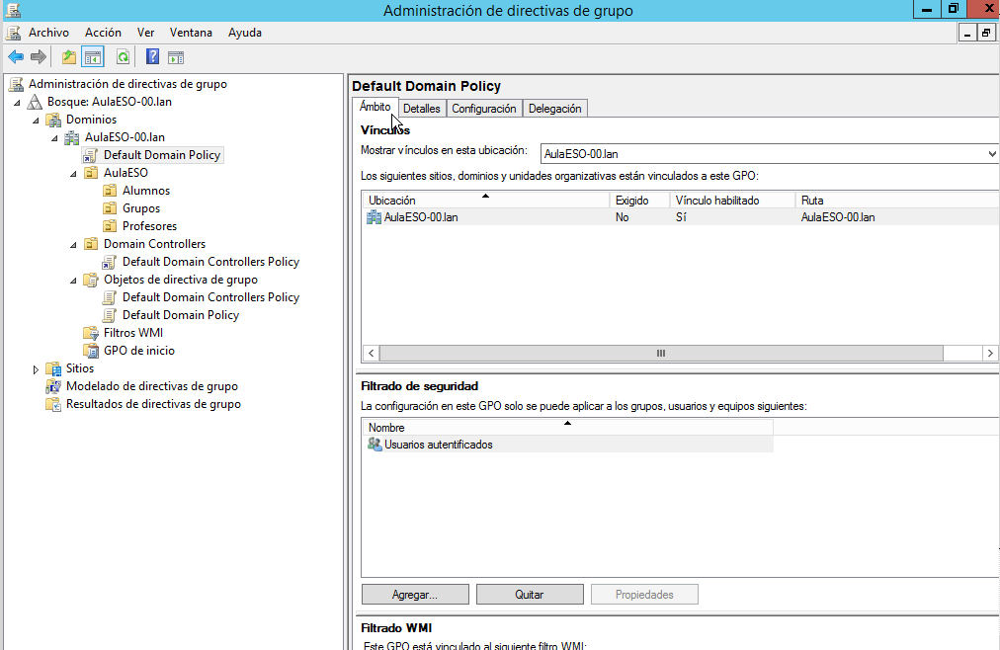
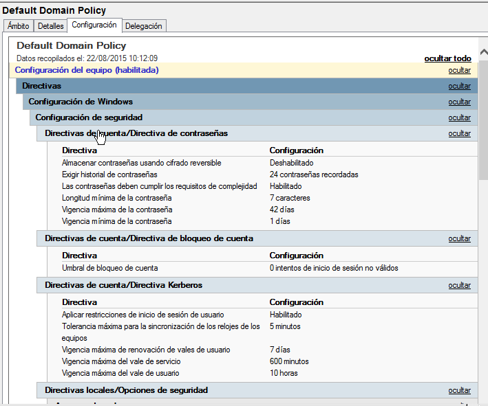
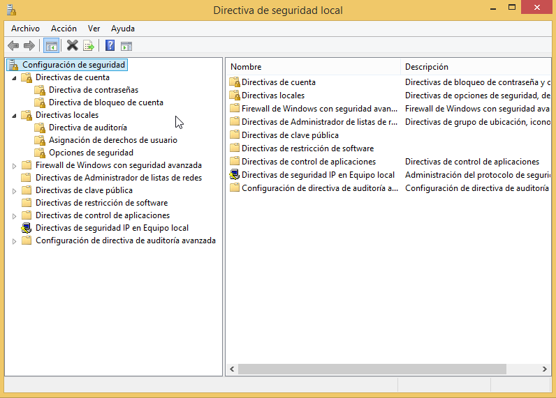
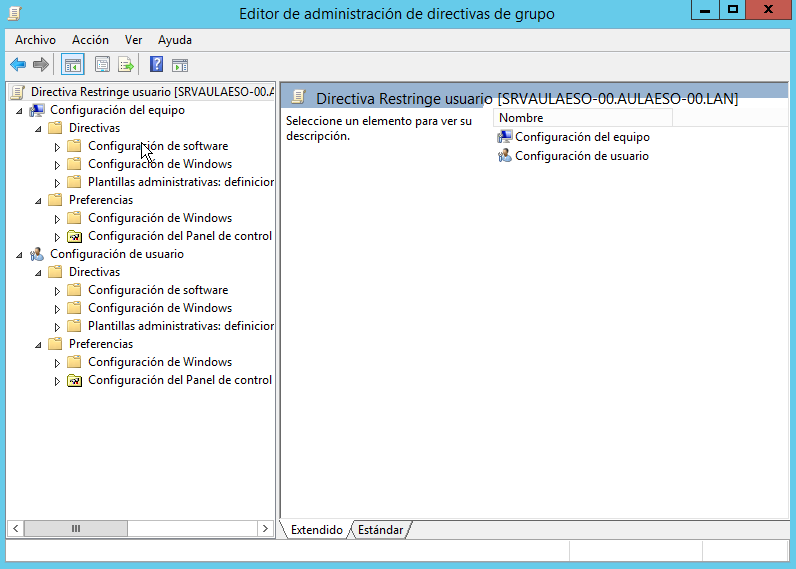
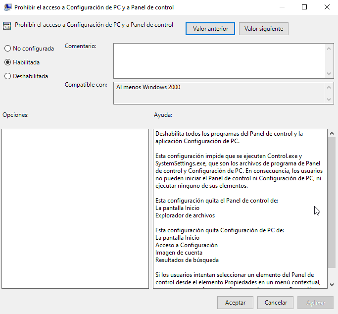

# Directivas
- [Directivas](#directivas)
  - [Introducción](#introducción)
  - [Administrador de directivas de grupo](#administrador-de-directivas-de-grupo)
    - [Qué hace una directiva y a quién se aplica](#qué-hace-una-directiva-y-a-quién-se-aplica)
      - [A quién se aplica](#a-quién-se-aplica)
      - [Quá hace la directiva](#quá-hace-la-directiva)
    - [Directivas aplicadas efectivamente](#directivas-aplicadas-efectivamente)
    - [Deshabilitar una GPO](#deshabilitar-una-gpo)
    - [Administrar directivas locales](#administrar-directivas-locales)
  - [Crear un nuevo GPO](#crear-un-nuevo-gpo)
    - [Editor de administración de directivas de grupo](#editor-de-administración-de-directivas-de-grupo)

## Introducción
Cómo vimos en la Unidad anterior un derecho es un atributo de un usuario que le permite realizar una acción que afecta al sistema en conjunto, no a un objeto o recurso concreto (por ejemplo cambiar el aspecto de su escritorio o instalar programas). Para simplificar su administración los derechos se agrupan en políticas del sistema llamadas **directivas de grupo** (_**Group Policy**_).

NOTA: las directivas de grupo no tienen nada que ver con los grupos del AD. En realidad sería más correcto decirlas directivas agrupadas porque se trata de agrupar derechos.

Las directivas de grupo son conjuntos de reglas que controlan el entorno de trabajo tanto de los usuarios como de los equipos en Windows en cuanto al sistema operativo y las aplicaciones. En definitiva controlan lo que un usuario puede o no puede hacer en el equipo. Entre las cosas que podemos configurar con directivas tenemos:
- Restringir algunas acciones que el usuario puede hacer (como acceder al Panel de control o al USB)
- Establecer que se ejecuten scripts al inicio o fin de sesión
- Establecer las características de la de seguridad de las cuentas de usuario
- Configurar la apariencia de la sesión de usuario
- Redireccionar carpetas centralizadas a un servidor
- Distribuir software desde un servidor a los equipos cliente
- Desplegar impresoras instaladas en un servidor

Para gestionar las directivas se utilizan los **GPO** (_Group Policy Object_, Objetos de Directiva de Grupo).

Se pueden configurar directivas en cualquier equipo Windows desde el _Administrador del equipo_. Estas directivas se llaman _**Directivas Locales_** y se aplican a ese equipo y los usuarios que lo utilicen. Pero también es posible definir directivas en el dominio para que se apliquen a todos (o algunos según deseemos) los equipos y/o los usuarios del dominio. En caso de conflicto entre una política local o una del dominio siempre tiene preferencia la del dominio.

Las directivas del dominio pueden aplicarse para un sitio (y afectará a todos los dominios del lugar), para el dominio (y en ese caso afectarán a todos los objetos del dominio) o a nivel de unidad organizativa (y se aplicarán sólo a los objetos de esa OU).

El orden de aplicación de las directivas de grupo es el siguiente:
- Directivas locales: son las primeras que se aplican
- Directivas de sitio
- Directivas del dominio
- Directivas de la OU

Esto es importante porque en caso de haber 2 directivas con configuraciones contradictorias la que se estará aplicando es la última según el orden anterior ya que sobreescribirá los parámetros de las anteriores (por ejemplo si una directiva local dice que un usuario no puede acceder al _Panel de control_ y una directiva del dominio dice que sí puede sí que podrá hacerlo).

En caso de que haya más de una directiva en el mismo nivel se aplican en el orden en que aparezcan en el Administrador de directivas de grupo.

Las directivas de grupo (tanto los locales como las del dominio) se pueden definir a **nivel de usuario** o a **nivel de equipo**. Las directivas de usuario se aplican al usuario independientemente de en qué equipo inicie sesión. Las directivas de equipo se aplican a un equipo sea quién sea el usuario que inicia sesión en él.

## Administrador de directivas de grupo
La herramienta que incluye Active Directory para administrar las directivas es la característica de **_Administrador de directivas de grupo_**.



Por defecto hay 2 GPO ya creados en el dominio que establecen su configuración básica:
- _**Default Domain Policy**_: está vinculada al dominio (es decir se aplica a todos los objetos del dominio). Configura muchas opciones de seguridad de las cuentas, como la política de contraseñas
- _**Default Domain Controller Policy**_: vinculada a la OU _Domain Controllers_ y por tanto se aplicará sólo a los objetos que hay en esa OU (que son las cuentas de los equipos controladores del dominio)

Todos los GPO aparecen en _Objetos de directivas de grupo_. Además cada GPO la encontramos dentro del objeto al que está vinculado (la _Default Domain Policy_ la vemos vinculada al dominio, la _Default DC Policy_ a la OU _Domain Controllers_, etc).

### Qué hace una directiva y a quién se aplica
Desde _Administración de directivas de grupo_ podemos ver a quién se está aplicando una GPO y qué es lo que configura. Para ello hacemos doble click en la GPO.

#### A quién se aplica
Para ver a quién se aplica seleccionamos la pestaña de **Ámbito**:



En **Vínculos** podemos ver a qué contenedores está vinculada. En este caso está vinculada al dominio. Podemos vincularla:
- al dominio: se aplicará a todos los objetos del dominio
- a uno o varios sitios: se aplicará a los objetos que haya dentro de esos sitios
- a una o varias OU: se aplicará sólo a los objetos creados en ellas

En **Filtrado de seguridad** establecemos a qué objetos de dichos contenedores se aplicará. Por defecto tenemos el grupo **Usuarios autentificados** por lo que se aplicará a todos los usuarios y a todos los equipos (ya que todos pertenecen a ese grupo). Si quisiéramos que se aplique sólo a uno o varios grupos concretos eliminaríamos este grupo y añadiríamos los grupos que queramos. En ese caso debemos añadir también el grupo **Equipos del dominio** o bien algún grupo que creemos al que añadamos los equipos en los que debe actuar esta directiva ya que algunas directivas necesitan que el equipo (además del usuario) tenga permisos de lectura sobre la directiva para que se le pueda aplicar.

Además tenemos el **Filtrado WMI** que nos permite poner cualquier tipo de filtro que se comprobará en el equipo cliente antes de aplicar dicha directiva (por ejemplo qué tipo de S.O. tiene o qué programas tiene instalados).

#### Quá hace la directiva
Para saber qué configura este GPO iremos a la pestaña de **Configuración**. Al pulsar sobre mostrar todo vemos lo siguiente:



Vemos que esta directiva configura muchas opciones como que la longitud mínima de las contraseñas es de 7 caracteres o que su vigencia máxima es de 42 días (trascurrido ese tiempo se obliga al usuario a cambiarla).

### Directivas aplicadas efectivamente
Podemos saber qué directivas están aplicándose efectivamente al usuario actual sobre el equipo actual con el comando:
```cmd
rsop.msc
```

Hay que tener en cuenta que las directivas no se aplican inmediatamente sino que sólo se actualizan cada cierto tiempo (normalmente suede tardar 10-20 minutos en replicarse a todos los DC, pero puede ser más). Para actualizar las directivas y hacer que se aplican inmediatamente las que acabamos de crear utilizamos el comando:
```cmd
gpupdate /force
```

### Deshabilitar una GPO
En cualquier momento podemos deshabilitar una GPO o directamente eliminarla. Si la deshabilitamos la GPO sigue existiendo pero no se aplicará a los objetos a los que está vinculada.

En la pantalla de _Administración de directivas de grupo_, seleccionamos la GPO a modificar (dentro de objetos de directiva) y desde su menú contextual tenemos las opciones:
- Estado de GPO
  - Habilitar: la GPO está habilitada y se aplicará a los objetes
  - Configuración de usuario deshabilitada: no se aplicarán las configuraciones de usuario pero sí las de equipo
  - Configuración de equipo deshabilitada: no se aplicarán las configuraciones de equipo pero sí las de usuario
  - Todas las configuraciones deshabilitadas: no se aplicará la GPO
- Eliminar: elimina la GPO

Si lo que queremos se desvincular una GPO de un contenedor para que no se aplique a ese contenedor, desde la ventana del contenedor abrimos el menú contextual de la GPO y seleccionamos:
- Eliminar: eliminamos el vínculo (pero no la GPO)
- o bien desmarcamos _Vínculo habilitado_: el vínculo continúa existiendo pero no está activo

Podemos eliminar una GPO o desvincularla desde su menú contextual. Si la desvinculamos la GPO continúa existiendo pero no se aplicará a los contenedores a los que está vinculada.

### Administrar directivas locales
Como hemos comentado, además de las directivas que tenemos en el servidor podemos crear directivas en cada equipo (también en los clientes).

Se gestionan desde `Inicio->Herramientas administrativas->Directivas de seguridad local`:



No tiene todas las opciones de las directivas de Active Directory pero sí podemos configurar muchas cosas en el cliente.

## Crear un nuevo GPO
Podemos crear un nuevo GPO desde _Objetos de directiva de grupo_ y en su menú contextual seleccionamos **Nuevo** y le damos el nombre que queramos al nuevo GPO. Este GPO no se encuentra vinculado a ningún contenedor (el dominio o una OU). Para que se aplique a alguno vamos al contenedor al que queramos aplicarlo y desde su menú contextual seleccionamos **Vincular GPO existente** y elegimos el GPO creado.

También podemos vincular un GPO a un contenedor a la vez que se crea. En este caso desde el menú contextual del contenedor seleccionamos **Crear un nuevo GPO en este dominio y vincularlo aquí**. De este modo creamos el nuevo GPO ya vinculado al contenedor.

Ya tenemos el GPO creado y vinculado a un contenedor pero este GPO aún no hace nada. Para configurarlo en su menú contextual seleccionamos la opción de **Editar**.

### Editor de administración de directivas de grupo
Podemos modificar cualquier GPO desde su menú contextual seleccionando Editar. Se abrirá el Editor de directivas de grupo:



Cómo se ve a la imagen en el GPO podemos establecer 
- directivas de configuración de equipo
- y directivas de configuración de usuario

y dentro de cada una encontramos 2 secciones:
- **Directivas**: es donde se establecen directivas. Hay 3 apartados:
  - **Configuración de software**: permite instalar o desinstalar programas en equipos del dominio. Esos programas estarán disponibles para los usuarios y equipos a los cuales se aplico esta GPO
  - **Configuración de Windows**: incluye directivas de seguridad (cuentas, contraseñas, etc) y directivas para ejecutar scripts al iniciar o cerrar una sesión o el equipo
  - **Plantillas administrativas**: incluye todas las configuraciones que se guardan en el registro de Windows y que permiten configurar todos los componentes de Windows, la red y el sistema
- **Preferencias**: aquí podemos configurar preferencias del entorno. Hay 2 apartados:
  - **Configuración de Windows**: permite establecer muchas opciones como asignar unidades (para montar carpetas compartidas en una letra de unidad) que veremos más adelante
  - **Configuración del Panel de control**: permite configurar diferentes opciones del mismo

En total son miles las opciones de configuración disponibles. Podemos descargado la lista completa de la web de Microsoft.

Para modificar cualquier opción la buscamos (dentro de configuración de equipo o de usuario según a quien se la queramos configurar) y desde su menú contextual seleccionamos Propiedades:



En la pestaña **Configuración** podemos configurar esta opción y en **Explicación** podemos ver qué implica esa opción. En **Comentarios** podemos escribir cualquier cosa.

Cada opción de configuración puede estar 
- **habilitada**: se aplica esa propiedad, en el ejemplo de la imagen anterior el usuario NO tendrá acceso al _Panel de control_
- **deshabilitada**: se desactiva esa propiedad incluso si alguna directiva menos prioritaria la había habilitado. O sea que el usuario SÍ tendrá acceso al _Panel de control_ aunque alguna directiva previa se lo haya denegado.
- **no configurada**: se deja como esté por defecto o como la haya configurado alguna directiva anterior. Es la opción por defecto. En el ejemplo el usuario tendrá acceso al _Panel de control_ porque por defecto cualquier usuario tiene acceso al mismo, a menos que alguna directiva previa haya habilitado esa opción.

Una vez acabado de editar el GPO cerramos la ventana del Editor y desde _Administración de directivas_ podemos ver cómo ha quedado (si no se reflejan los cambios pulsa el botón de **Actualizar**).
