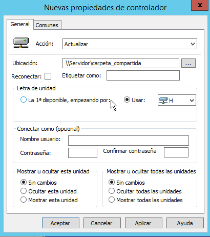

# Ejemplos de configuración mediante directivas
- [Ejemplos de configuración mediante directivas](#ejemplos-de-configuración-mediante-directivas)
  - [Introducción](#introducción)
  - [Cómo configurar el entorno del usuario](#cómo-configurar-el-entorno-del-usuario)
  - [Cómo configurar la seguridad del dominio](#cómo-configurar-la-seguridad-del-dominio)
  - [Cómo ejecutar scripts automáticamente](#cómo-ejecutar-scripts-automáticamente)
  - [Cómo asignar una letra de unidad a una carpeta compartida](#cómo-asignar-una-letra-de-unidad-a-una-carpeta-compartida)
  - [Cómo implementar software en los equipos clientes](#cómo-implementar-software-en-los-equipos-clientes)
    - [Desinstalar programas](#desinstalar-programas)
  - [Cómo desplegar impresoras](#cómo-desplegar-impresoras)

## Introducción
En esta página vamos a ver cómo podemos usar GPO para configurar algunas cosas comunes en los usuarios de nuestro dominio.

## Cómo configurar el entorno del usuario
Una de las aplicaciones más comunes de las directivas es configurar el entorno del usuario y, en muchas ocasiones, restringir las acciones que puede realizar sobre el ordenador. El entorno de un usuario se administra con el fin de asegurar que este disponga de todo lo necesario para realizar su trabajo pero no pueda dañar ni configurar incorrectamente este entorno.

La mayoría de opciones para configurar el entorno del usuario las encontraremos dentro de **Plantillas administrativas**. Dentro de ella encontramos los siguientes tipos:
- _Active desktop_: para configurar el comportamiento del escritorio, los iconos perdeterminados que se muestran, etc
- _Componentes de Windows_: permite configurar los componentes del sistema como el Explorador de archivos, las carpetas de trabajo, Internet Explorer, los gadgets del escritorio, Windows Update, etc
- _Menú Inicio y Barra de tareas_: permite agregar o quitar elementos en el menú Inicio y la Barra de tareas de Windows
- _Panel de control_: permite configurarlo, definir qué se muestra y que no, impedir el acceso al mismo, etc
- _Red_: permite configurar la red
- _Sistema_: podemos configurar la administración de energía, el acceso a dispositivos extraíbles, etc

Algunas de las opciones que podríamos configurar aquí son:
- impedir a los usuarios acceder al Panel de control: `Configuración de usuario -> Plantillas administrativas -> Panel de control`
- impedir a los usuarios acceder a la terminal: `Configuración de usuario -> Plantillas administrativas -> Sistema`
- impedir el acceso a unidades USB: `Configuración de usuario -> Plantillas administrativas -> Sistema`
- impedir a los usuarios modificar el fondo del escritorio: `Configuración de usuario -> Plantillas administrativas -> Escritorio -> Escritorio`
- poner la misma imagen de fondo de escritorio para todos los usuarios: igual que antes (tenemos que activar también _Active Desktop_)
- etc

## Cómo configurar la seguridad del dominio
Por defecto ya está configurada la seguridad en la directiva Default Domain Policy. Incluye entre otras cosas todo lo relativo a las contraseñas: definimos cómo han de ser las contraseñas de los usuarios, cada cuanto tiempo las deben cambiar o bloqueamos una cuenta tras varios intentos erróneos de inicio de sesión.

La mayoría de estas opciones se encuentran en Configuración de equipo->Directivas-> Configuración de Windows->Configuración de seguridad.

Para modificar cualquier opción relacionada con las contraseñas y la seguridad del dominio tenemos 2 opciones:
- Modificar esta directiva (es la forma más sencilla)
- Crear una nueva directiva y asegurarnos de que se aplica después que la _Default Domain Policy_ (aplicándola a nivel de OU o, si al aplicamos al dominio, haciendo que su orden sea posterior a la Default Domain Policy). Así los valores que establece la Default Domain Policy serán sobreescritos por los de nuestra propia directiva

## Cómo ejecutar scripts automáticamente
Podemos crear una directiva que ejecute automáticamente un script al arrancar un equipo o al apagarlo desde `Configuración de equipo->Directivas->Configuraciónde Windows->Scripts`. También podemos crear una directiva que ejecute automáticamente un script al iniciar sesión un usuario en un equipo o al cerrar sesión un usuario en un equipo desde `Configuración de usuario->Directivas->Configuraciónde Windows->Scripts`.

**NOTA**: también se puede ejecutar un script de inicio de sesión para un usuario indicándolo en las propiedades de su cuenta, desde la pestaña **Perfil**. En este caso el script tiene que guardarse obligatoriamente dentro de la carpeta compartida **NETLOGON**.

## Cómo asignar una letra de unidad a una carpeta compartida
Podríamos hacerlo creando un script y una directiva que lo ejecutara al iniciar sesión el usuario, como hemos visto antes. El contenido del script sería algo como:
```cmd
net use H: \\Servidor\carpeta_compartida
```

Este comando monta en la unidad **H:** el recurso que se encuentra en **\\Servidor\carpeta_compartida**

Pero hay una forma aún más sencilla y es desde `Configuración de usuario->Preferencias->Configuración de Windows->Asignación de unidades`. Allí elegimos `Nuevo->Asignar unidad` y especificamos la ruta de la carpeta y la letra de unidad a usar:



## Cómo implementar software en los equipos clientes
Con directivas de grupo se puede distribuir el software entre los clientes de forma que un usuario tenga siempre a su alcance los programas que necesita para su trabajo.

Para la instalación de programas se utiliza _Windows Installer_ que es un componente que automatiza el proceso de instalación y actualización de software. El programa a instalar se tiene que incluir en un paquete que es un archivo con extensión **.msi**. Todos los paquetes a distribuir tienen que estar en un punto de distribución de software accesible desde la red para los usuarios.

Hay dos maneras de distribuir software: **asignándolo** o **publicándolo**. Cuando asignamos un programa a un equipo o usuario el programa se instala automáticamente cuando se inicia el equipo o cuando inicia sesión el usuario (según si configuramos la GPO por equipo o por usuario).

Podemos asignar un programa de dos formas:
- en la configuración del equipo: el programa se instala automáticamente al iniciar el equipo (recomendada)
- en la configuración del usuario: cuando el usuario inicia sesión en el Escritorio aparece un icono para instalar el programa. El programa se instala cuando el usuario hace doble clic en el icono o cuando abre un fichero asociado al programa (por ejemplo si el programa es Word se instalaría al abrir un documento con extensión .docx). Si el usuario no activa el programa no se instalará

Cuando publicamos un programa el usuario lo tiene a su disposición para instalarlo sí lo desea. Sólo se puede publicar un programa en la configuración del usuario, no en la del equipo. Un programa publicado se instala en el equipo cliente de dos formas:
- El usuario instala el programa desde el `Panel de control->Programas->Instalar un programa desde la red`
- El usuario abre un fichero asociado al programa y este se instala automáticamente (el equipo envía a AD una consulta para ver si hay algún programa en el punto de distribución para ese tipo de archivo y si lo encuentra lo instala)

Los programas a instalar deben estar en un punto de distribución de software del servidor, que es una **carpeta compartida** con permisos de acceso para los usuarios. Allí copiaremos los paquetes .msi y el resto de archivos y carpetas necesarios para instalar el programa.

Una vez creado el punto de distribución tenemos que crear el GPO que se encargo de distribuir el programa y, a continuación, vincularlo a los contenedores adecuados. Esta GPO se configura desde `Configuración de equipo o de usuario (según deseemos)->Configuración de software -> Instalación de software` y desde el menú contextual seleccionamos **Nuevo**.

Podéis ver un [vídeo de ejemplo](media/GPOsw.ogv) de cómo distribuir el programa 7-zip a todos los alumnos de 4º de la ESO.

**NOTA**: al hacer el GPO la ruta de acceso al programa **no puede ser local** (C:\... o E:\...) sino una ruta de red (\\Servidor\...) para que sea accesible desde los clientes.

Desde _Propiedades_ de su menú contextual podemos modificar la configuración de la GPO o añadir actualizaciones para el programa que se instalarán automáticamente en los clientes.

### Desinstalar programas
Si editamos una directiva de instalación de software al pulsar con el botón derecho del ratón sobre el paquete a instalar aparecen 2 opciones útiles dentro de la opción 'Todas la tareas':
- Volver a implementar la aplicación: reinstala el programa en los equipos cliente
- Quitar: elimina la aplicación de la directiva. Al hacerlo nos da 2 posibilidades:
  - Desinstalar el software de usuarios y equipos: la directiva eliminará el programa de los equipos en que lo había instalado
  - Permitir seguir utilizando el software: no se realizará ninguna nueva instalación pero no se elimina de los equipos en que ya se había instalado

## Cómo desplegar impresoras
La manera más sencilla de que los usuarios puedan imprimir en una impresora de red es instalándola en el servidor y desplegándola en los equipos cliente con una directiva. Para facilitar esta tarea instalaremos el rol de _Servidor de impresión_ en nuestro servidor, si no lo teníamos ya.

Una vez que tenemos la impresora instalada y configurada (tiene que estar compartida) creamos una nueva directiva para ella (aunque no configuramos nada en ella).

A continuación desde el _Admininstrador de impresión_ en el menú contextual de la impresora elegimos la opción de **Implementar con directiva de grupo**. En la ventana que se abre configuramos cómo hacerlo:
- con el botón **Examinar** indicamos qué GPO será la encargada de desplegar la impresora (la que hemos creado antes). Si queremos que esté disponible para todo el dominio o para una OU no es necesario crear la GPO sino que basta con elegir aquí el dominio o la OU que queramos
a continuación marcamos si queremos que se aplique **a los usuarios** o **a los equipos** (en función de sí queremos la impresora para determinados usuarios o determinados equipos) y le damos al botón **Agregar**
- Aplicamos la configuración y aparece un mensaje indicando que se ha implementado correctamente la impresora.

Podéis ver un [vídeo de ejemplo](media/DespliegaImpr.ogv) de cómo desplegar una impresora llamada HP_red para que aparezca a los usuarios miembros de los grupos gdl_profes y gdl_alum4eso.

Para que la impresora se instale correctamente en todos los clientes nos tenemos que asegurar que tenemos los drivers para todos ellos. Desde la pestaña _Compartir_ de _Propiedades de la impresora_ podemos instalar drivers adicionales para otras arquitecturas (Itanium o i386) si tenemos clientes con esas arquitecturas de procesador.
