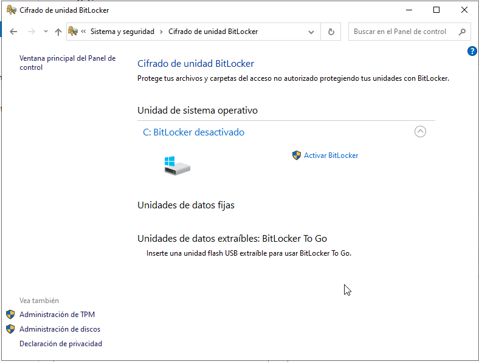
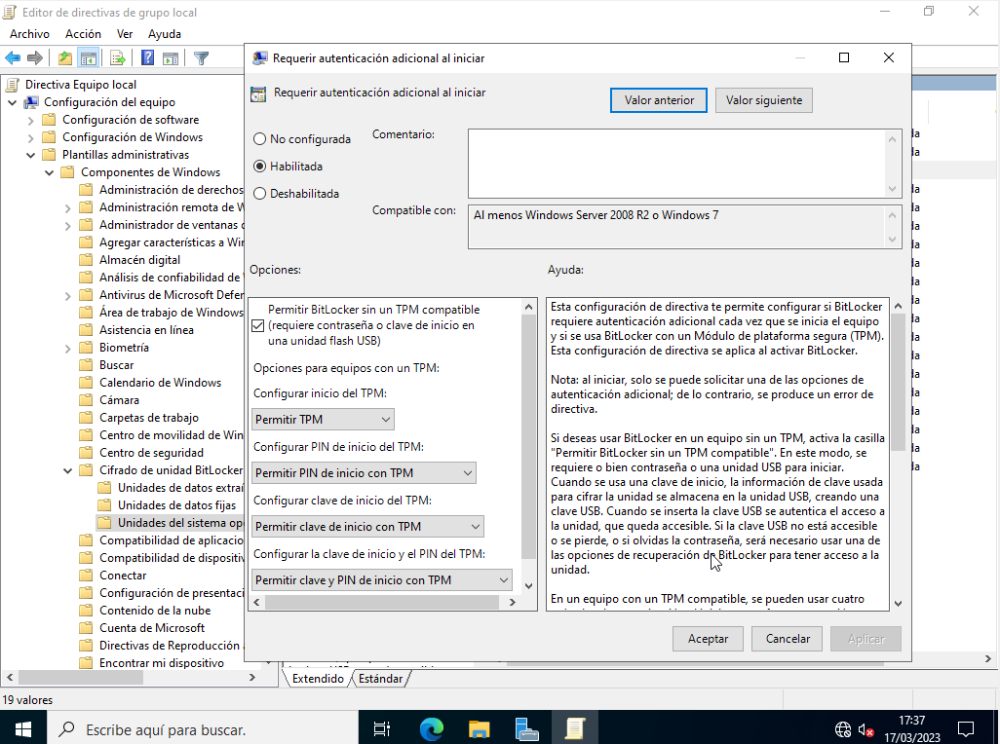
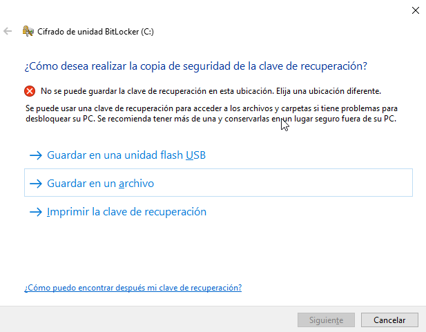
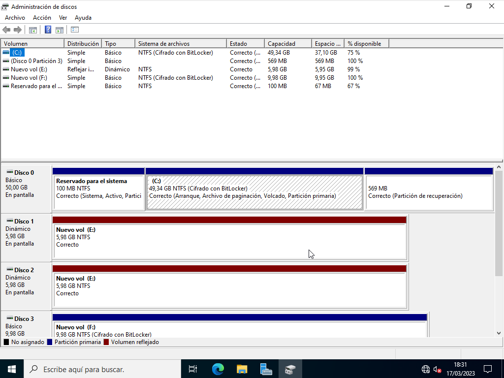

# BitLocker
Aunque el sistema operativo controla el acceso a los ficheros del disco según le hayamos indicado (estableciendo permisos), si nos roban el disco o si se arranca la máquina con otros sistema operativo (desde eun USB) esas protecciones ya no sirven de nada.

Por ello es muy recomendable cifrar todo el disco de manera que sólo sea accesible desde el sistema operativo que es quien tiene la clave para desbloquearlo.

La herramienta de Microsoft para cifrar los discos se llama **BitLocker** y está incluida en las versiones _Pro_ y _Enterprise_ de sus sistemas operativos. Una vez cifrada la unidad, cada vez que guardamos un fichero en disco este se cifra automáticamente y cada vez que lo leemos se descifra, de forma transparente para el usuario.

Para usarla debemos instalar la característica '_Cifrado de unidad BitLocker_' (tras la instalación nos obliga a reiniciar el servidor).

Una vez reiniciado lo activaremos desde el _Panel de control -> Sistema y seguridad -> Cifrado de unidad BitLocker_':

BitLocker utiliza el chip **_TPM_** para almacenar la clave de cifrado. Si no lo tenemos (como pasa con las máquinas virtuales de Virtualbox) podemos usar BitLocker pero debemos configurar otra forma de desencriptar los datos:
- o bien esceribimos una contraseña al arrancar el equipo, antes de cargarse el sistema operativo
- o arrancamos con un USB extraíble en el que hayamos guardado la clave

Para permitir esto debemos habilitar en la directiva local (gpedit.msc) o en una GPO, en '_Configuración del equipo -> Plantillas administrativas -> Componentes de Windows -> Cifrado de unidad de BitLocker -> Unidades del sistema operativo_' la directiva '_Requerir autenticación adicional al iniciar_' y marcar la casilla 'Permitir Biltlocker sin un TPM compatible':

En este caso nos indica que cada vez que iniciemos deberemos escribir una contraseña o introducir una unidad USB con la clave. OJO con poner símbolos en la contraseña porque cuando nos la pide al arrancar aún no está cargado el teclado en nuestro idioma.

A continuación nos pregunta dónde guardar una copia de seguridad de la clave de encriptación. Es MUY IMPORTANTE ya que si olvidamos la contraseña y perdemos esta clave PERDEREMOS todos los datos del disco al no poder desencriptarlos:

Luego pregunta si cifrar todo el disco o sólo lo usado y qué tipo de cifrado usar (el nuevo es más seguro). Por último pregunta si realizar una comprobación de que Bitlocker puede acceder a los datos cifrados (por defecto sí) y tras reiniciar de nuevo la máquina comienza el cifrado, que tardará bastantes minutos o incluso horas en función de la cantidad de datos en la unidad.

Una vez finalizado desde el '_Administrador de discos_' podemos comprobar que la unidad ha sido cifrada:

NOTA: Bitlocker NO puede cifrar discos dinámicos, sólo disos simples.

Fuente: https://www.redeszone.net/tutoriales/seguridad/bitlocker-cifrar-discos-windows/

