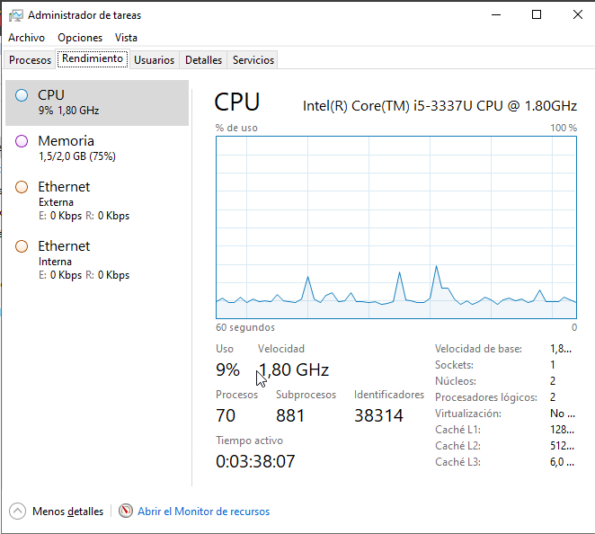
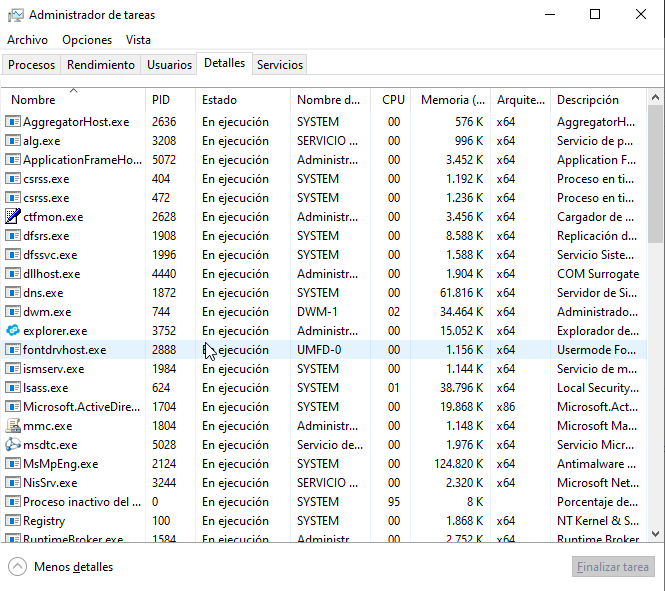
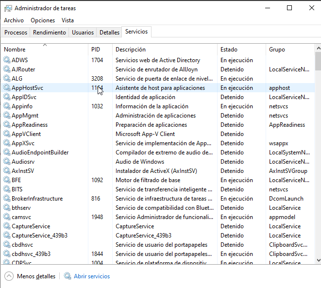
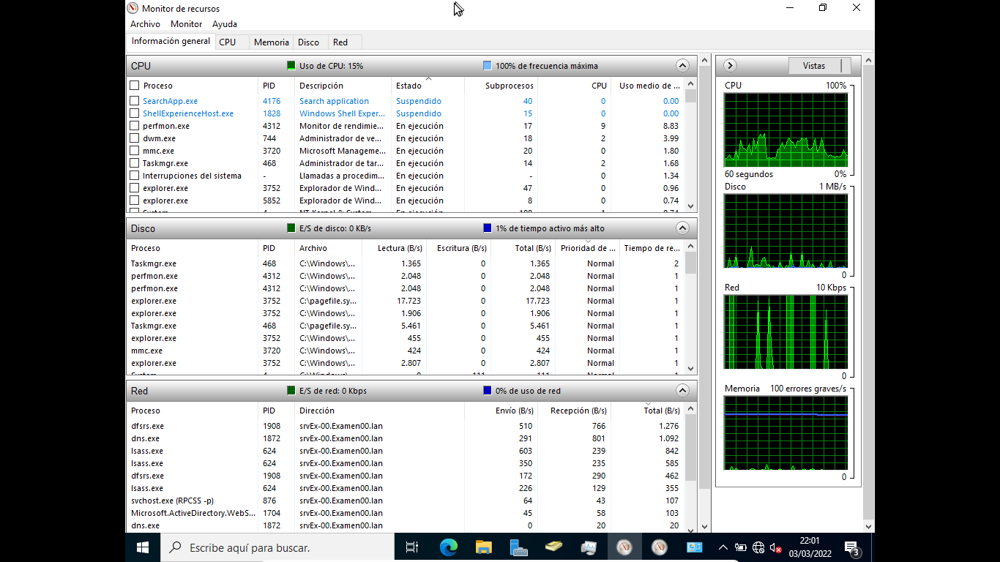
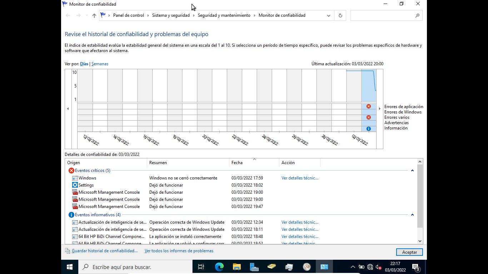
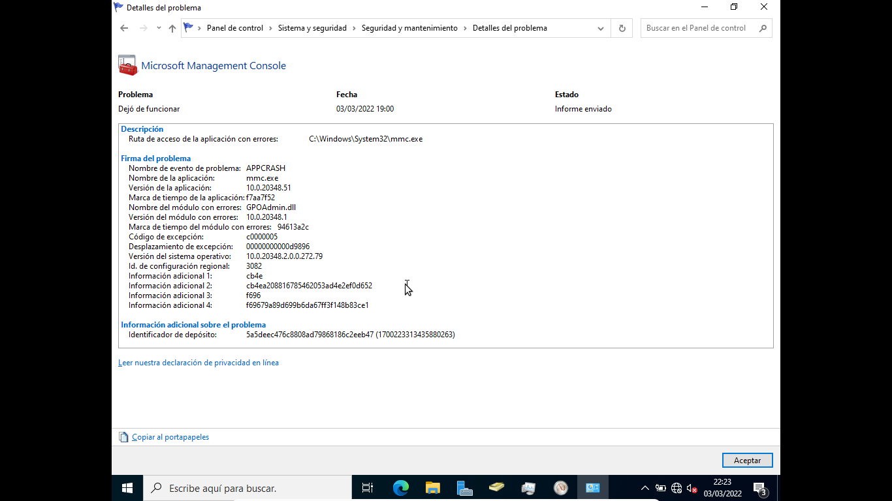
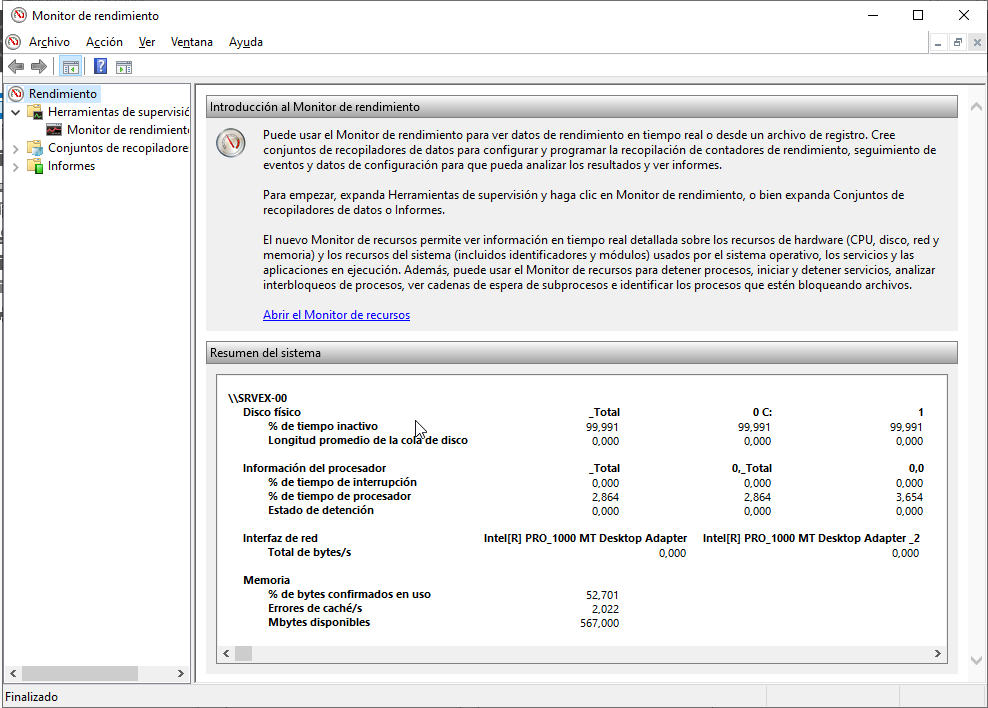

# Supervisión del sistema
- [Supervisión del sistema](#supervisión-del-sistema)
  - [Introducción](#introducción)
  - [Administrador de tareas](#administrador-de-tareas)
  - [Monitor de recursos](#monitor-de-recursos)
  - [Visor de eventos](#visor-de-eventos)
  - [Monitor de confiabilidad](#monitor-de-confiabilidad)
  - [Monitor de rendimiento](#monitor-de-rendimiento)

## Introducción
Es imprescindible conocer lo que está sucediendo en el sistema tanto para resolver problemas como para mejorar el rendimiento del mismo. Para ello comprobaremos el rendimiento del sistema antes de ponerlo en producción y lo volveremos a comprobar si a lo largo de la vida del equipo hay problemas o si llega un momento en el que no responde con la suficiente rapidez a su carga de trabajo. Esto nos permitirá conocer qué elemento es el cuello de botella que debemos mejorar para mejorar el funcionamiento general del equipo.

Algunas definiciones de conceptos relacionados con el rendimiento del sistema son:
- **Evaluación del rendimiento de un sistema informático**: es una medida de la calidad en el uso del hardware respecto a un conjunto de programas denominado "carga del sistema" donde puede existir interacción con usuarios.
- **Carga del sistema**: conjunto de programas que se ejecutan en el sistema para satisfacer las necesidades de los usuarios. Suele ser un conjunto complejo y variable en el tiempo.
- **Benchmark** (en castellano, comparativa o análisis): programa informático o un conjunto de programas que tienen como objetivo estimar el rendimiento de un elemento concreto o la totalidad del sistema y ​​poder comparar los resultados con máquinas similares.
- **Cuello de botella**: situación que se da cuando un dispositivo del sistema informático recibe muchas peticiones y está muy saturado de trabajo, mientras que el resto de dispositivos están ociosos esperando su respuesta. Se trata de encontrar el dispositivo en el que se encuentra el cuello de botella porque mejorando su rendimiento mejorará el de todo el sistema.

¿Cuándo debemos realizar una evaluación del rendimiento? Puede ser útil evaluar el rendimiento de un equipo cuando:
- se fabrica una nueva máquina
- se desea diseñar un sistema informático nuevo
- se desea seleccionar un sistema informático entre varias alternativas
- se desea planificar la capacidad de un sistema informático
- se desea ajustar un sistema informático (operaciones de mantenimiento)

## Administrador de tareas
En sistemas Windows podemos obtener importante información del `Administrador de tareas de Windows`, que nos muestra los programas, procesos y servicios que están en ejecución. Tiene varias pestañas con información sobre:
- **Procesos**: podemos ver los programas que se están ejecutando, tanto los abiertos por nosotros (_aplicaciones_) como los que están en segundo plano y los de Windows. De cada proceso vemos su nombre, el porcentaje de CPU está consumiendo ahora y la memoria que ocupa. Desde ahí podemos finalizar cualquier proceso.

- **Rendimiento**: vemos los datos de uso de CPU, memoria y red así como sus gráficos. Desde aquí podemos abrir el Monitor de recursos.

- **Usuarios**: nos muestra todos los procesos agrupados según el usuario que los haya abierto. Desde aquí podemos desconectar un usuario del sistema.
- **Detalles**: nos muestra todos los procesos con más información de cada uno (PID, estado, ...)

- **Servicios**: muestra todos los servicios de Windows, y de los arrancados nos muestra también su PID

## Monitor de recursos
Es similar a la pestaña de _Rendimiento_ del _Administrador de tareas_ pero nos proporciona mucha más información sobre el uso de CPU, Disco, Red y Memoria por parte de los diferentes procesos en ejecución.

## Visor de eventos
Todos los sistemas Windows disponen de registros de eventos donde se almacenan todos los sucesos importantes del equipo. Podemos consultar estos registros con el _Visor de eventos_. Existen 2 tipos de registros:
- Registros de aplicaciones y servicios: aquí se recogen los eventos que afectan a una sola aplicación
- Registros de Windows: recogen eventos que afectan a todo el sistema. Son:
  - Eventos de aplicaciones: son los generados por las aplicaciones
  - Eventos de seguridad: registran cosas como inicios de sesión, etc
  - Eventos de instalación: los producidos al instalar el sistema o algún componente
  - Eventos del sistema: los que más consultaremos, producidos por los diferentes servicios
  - Eventos reenviados: producidos en otros equipos que los reenvían aquí

Según su gravedad pueden ser:
- crítico: error graves que no pueden recuperarse
- error: error importante
- advertencia: puede ser un problema
- información: sólo se registra un suceso

## Monitor de confiabilidad
Muestra en un gráfico la confiabilidad del equipo, entre 1 (mínima) y 10 (máxima) en función de los problemas y cambios detectados a lo largo del tiempo.

En la parte inferior muestra información sobre los eventos producidos y podemos hacer click sobre cualquiera para obtener más información del mismo.

Desde _Ver todos los informes de problemas_ obtenemos un listado de todos ellos y haciendo click sobre cualquiera obtenemos toda la información.

## Monitor de rendimiento
El Monitor de Rendimiento nos permite visualizar datos sobre el rendimiento tanto en tiempo real como desde recopilando datos de registro. Permite:
- Reunir datos de rendimiento en tiempo real del equipo local o de cualquier otro
- Ver los datos unificados en un registro de **contadores de rendimiento**
- Presentar los datos en un gráfico, histograma o informe
- Exportar los datos a aplicaciones de Microsoft Office
- Crear una página HTML a partir de las vistas de rendimiento.

La información que recoge se reúne en **Conjuntos de Recopiladores de datos** que recogen los datos de los equipos y crean informes de rendimiento. Estos conjuntos usan los siguientes tipos de recopiladores de datos:
- Contadores de rendimiento: son mediciones del estado o de la actividad del sistema
- Datos de seguimiento de eventos: se recopilan de componentes del sistema operativo o de aplicaciones que informan de acciones o eventos
- Información de configuración del sistema: valores de las claves del Registro de Windows
- Alerta de contador de rendimiento: permite definir unos contadores de rendimiento y lanzar una alerta si se supera alguno de los límites que se definan para dichos contadores.

